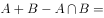
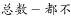
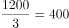
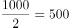
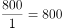
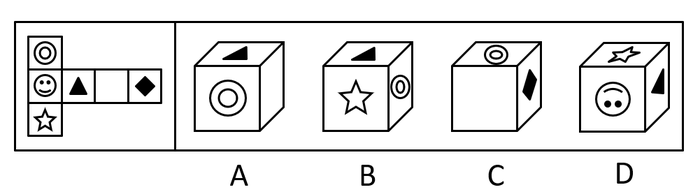

# 2020年山东省选拔录用选调生笔试综合测试（节选）（网友回忆版）

> 选调生 · 2020 年 · 5 个模块 · 共 20 题

- [政治理论](#%E6%94%BF%E6%B2%BB%E7%90%86%E8%AE%BA) · 4 题
- [常识判断](#%E5%B8%B8%E8%AF%86%E5%88%A4%E6%96%AD) · 6 题
- [言语理解与表达](#%E8%A8%80%E8%AF%AD%E7%90%86%E8%A7%A3%E4%B8%8E%E8%A1%A8%E8%BE%BE) · 3 题
- [数量关系](#%E6%95%B0%E9%87%8F%E5%85%B3%E7%B3%BB) · 3 题
- [判断推理](#%E5%88%A4%E6%96%AD%E6%8E%A8%E7%90%86) · 4 题

---

## 政治理论

### 第 1 题　qid 2668066 · 新思想

习近平新时代中国特色社会主义思想是党和国家必须长期坚持的指导思想，核心要义是（    ）。

- **A**. 坚持和发展中国特色社会主义　✅
- **B**. 坚持党的领导
- **C**. 坚持以人民为中心的根本立场
- **D**. 坚持和发展马克思主义

**答案**：A

**官方解析**

本题考查政治常识。
习近平新时代中国特色社会主义思想的核心要义就是坚持和发展中国特色社会主义，具体体现在它从理论和实践结合上系统回答了新时代坚持和发展什么样的中国特色社会主义、怎样坚持和发展中国特色社会主义这个重大时代课题，回答了新时代坚持和发展中国特色社会主义的总目标、总任务、总体布局、战略布局和发展方向、发展方式、发展动力、战略步骤、外部条件、政治保证等基本问题，并且根据新的实践对经济、政治、法治、科技、文化、教育、民生、民族、宗教、社会、生态文明、国家安全、国防和军队、“一国两制”和祖国统一、统一战线、外交、党的建设等各方面作出理论分析和政策指导，为更好坚持和发展中国特色社会主义提供了思想武器和行动指南。
故正确答案为A。

---

### 第 2 题　qid 2668072 · 新思想

习近平在中央政治局第十八次集体学习时强调，要利用（    ）探索数字经济模式创新，为加快新旧动能接续转换、推动经济高质量发展提供支撑。

- **A**. 物联网技术
- **B**. 区块链技术　✅
- **C**. 人工智能技术
- **D**. 数字金融技术

**答案**：B

**官方解析**

本题考查政治常识。
2019年10月24日，中共中央政治局就区块链技术发展现状和趋势进行第十八次集体学习。中共中央总书记习近平在主持学习时强调：“要利用区块链技术探索数字经济模式创新，为打造便捷高效、公平竞争、稳定透明的营商环境提供动力，为推进供给侧结构性改革、实现各行业供需有效对接提供服务，为加快新旧动能接续转换、推动经济高质量发展提供支撑。”
故正确答案为B。

---

### 第 3 题　qid 2668075 · 新思想

中国共产党第十九届中央委员会第四次全体会议通过了《中共中央关于坚持和完善中国特色社会主义制度、推进国家治理体系和治理能力现代化若干重大问题的决定》。《决定》指出，坚持和完善党的领导制度体系，提高党（    ）水平。

- **A**. 科学执政、民主执政、从严执政
- **B**. 科学执政、廉洁执政、依法执政
- **C**. 科学执政、民主执政、依法执政　✅
- **D**. 科学执政、廉洁执政、从严执政

**答案**：C

**官方解析**

本题考查政治常识。
中国共产党第十九届中央委员会第四次全体会议通过了《中共中央关于坚持和完善中国特色社会主义制度、推进国家治理体系和治理能力现代化若干重大问题的决定》。《决定》指出：“坚持和完善党的领导制度体系，提高党科学执政、民主执政、依法执政水平。中国共产党领导是中国特色社会主义最本质的特征，是中国特色社会主义制度的最大优势，党是最高政治领导力量。必须坚持党政军民学、东西南北中，党是领导一切的，坚决维护党中央权威，健全总揽全局、协调各方的党的领导制度体系，把党的领导落实到国家治理各领域各方面各环节。”
故正确答案为C。

---

### 第 4 题　qid 2668079 · 马克思主义

习近平强调，金融要为实体经济服务，满足经济社会发展和人民群众需要。金融活，经济活；金融稳，经济稳。经济兴，金融兴；经济强，金融强。经济是肌体，金融是血脉，两者共生共荣。这体现了什么唯物辩证法道理？

- **A**. 人民群众是历史的创造者
- **B**. 矛盾的同一性是无条件的
- **C**. 事物是普遍联系的　✅
- **D**. 人们可以根据需要人为建立事物的联系

**答案**：C

**官方解析**

本题考查政治常识。
A项错误，马克思主义认为，人民群众是历史的创造者，是社会物质财富和精神财富的创造者，是社会变革的决定性力量。题干强调的是金融的作用，而非人民群众的作用。
B项错误，矛盾的斗争性是无条件的、绝对的，矛盾的同一性是有条件的、相对的。矛盾的同一性是指矛盾着的对立面之间的相互依存、相互吸引、相互贯通的一种趋势和联系，体现着事物的稳定性、常住性，而事物的稳定性、常住性是有条件的、暂时的、可变的，因而是相对的。所以，矛盾的同一性是有条件的、暂时的和相对的。
C项正确，联系是指事物之间以及事物内部各要素之间相互连结、相互依赖、相互影响、相互作用、相互转化等相互关系。事物是普遍联系的，任何事物都不可能孤立存在，都同其他事物处于一定的相互联系之中。题干中金融与经济共生共荣的关系体现了事物的普遍联系。
D项错误，事物的联系是客观的，是不以人的主观意志为转移的，人不能凭空“创造”一种联系强加给客观的事物，也不能任意“消灭”事物之间所固有的联系。
故正确答案为C。

---

## 常识判断

### 第 1 题　qid 2668071 · 人文常识

《中共中央国务院关于坚持农业农村优先发展做好“三农”工作的若干意见》是新世纪以来，党中央连续发出的第十六个“一号文件”，指出要坚持（    ）总方针，以（    ）为总抓手。

- **A**. 农业农村现代化  实施乡村振兴战略
- **B**. 农业农村优先发展  实施乡村治理
- **C**. 农业农村优先发展  实施乡村振兴战略　✅
- **D**. 农业农村现代化  实施乡村治理

**答案**：C

**官方解析**

本题考查政治常识。
2019年中央一号文件《中共中央国务院关于坚持农业农村优先发展做好“三农”工作的若干意见》中指出：“坚持农业农村优先发展总方针，以实施乡村振兴战略为总抓手，对标全面建成小康社会‘三农’工作必须完成的硬任务，适应国内外复杂形势变化对农村改革发展提出的新要求，抓重点、补短板、强基础，围绕‘巩固、增强、提升、畅通’深化农业供给侧结构性改革，坚决打赢脱贫攻坚战，充分发挥农村基层党组织战斗堡垒作用，全面推进乡村振兴，确保顺利完成到2020年承诺的农村改革发展目标任务。”
故正确答案为C。

---

### 第 2 题　qid 2668083 · 人文常识

《中国的粮食安全》白皮书指出，中国坚持立足国内保障粮食基本自给的方针，实行最严格的耕地保护制度，实施“（    ）”战略。

- **A**. 藏粮于地、藏粮于技　✅
- **B**. 优化农业产业结构
- **C**. 藏粮于库、藏粮于技
- **D**. 大力发展现代农业

**答案**：A

**官方解析**

本题考查政治常识。
2019年10月14日，国务院新闻办发表《中国的粮食安全》白皮书。白皮书指出，中国坚持立足国内保障粮食基本自给的方针，实行最严格的耕地保护制度，实施“藏粮于地、藏粮于技”战略，持续推进农业供给侧改革和体制机制创新，粮食生产能力不断增强，粮食流通现代化水平明显提升，粮食供给结构不断优化，粮食产业经济稳步发展，更高层次、更高质量、更有效率、更可持续的粮食安全保障体系逐步建立，国家粮食安全保障更加有力，中国特色粮食安全之路越走越稳健、越走越宽广。
故正确答案为A。

---

### 第 3 题　qid 2668084 · 法律常识

根据《公务员法》的规定，下列选项中错误的是（    ）。

- **A**. 根据工作需要和领导职务与职级的对应关系，公务员担任的领导职务和职级可以互相转任、兼任；符合规定资格条件的，可以晋升领导职务或者职级
- **B**. 公务员职位类别按照公务员职位的性质、特点和管理需要，划分为综合管理类、专业技术类和行政执法类等类别
- **C**. 公务员因为工作需要在机关外兼职，要经过批准，一定情况下可以领报酬　✅
- **D**. 公务员不得在其配偶、子女及其配偶经营的企业、营利性组织的行业监管或者主管部门担任领导成员

**答案**：C

**官方解析**

本题考查法律常识。
A项正确，《公务员法》第二十一条规定：“根据工作需要和领导职务与职级的对应关系，公务员担任的领导职务和职级可以互相转任、兼任；符合规定资格条件的，可以晋升领导职务或者职级。”
B项正确，《公务员法》第十六条规定：“公务员职位类别按照公务员职位的性质、特点和管理需要，划分为综合管理类、专业技术类和行政执法类等类别。”
C项错误，《公务员法》第四十四条规定：“公务员因工作需要在机关外兼职，应当经有关机关批准，并不得领取兼职报酬。”
D项正确，《公务员法》第七十四条规定：“公务员不得在其配偶、子女及其配偶经营的企业、营利性组织的行业监管或者主管部门担任领导成员。”
本题为选非题，故正确答案为C。

---

### 第 4 题　qid 2668087 · 人文常识

城际铁路的开通带动了旅游业的发展，体现了（    ）。

- **A**. 马太效应
- **B**. 外部效应　✅
- **C**. 鲶鱼效应
- **D**. 棘轮效应

**答案**：B

**官方解析**

本题考查管理常识。
A项错误，马太效应是指强者愈强、弱者愈弱的现象，广泛应用于社会心理学、教育、金融以及科学领域。
B项正确，外部效应是指在实际经济活动中，生产者或者消费者的活动对其他生产者或消费者带来的非市场性影响。这种影响可能是有益的，也可能是有害的，有益的影响被称为外部效益，外部经济性，或正外部性；有害的影响被称为外部成本，外部不经济性，或负外部性。题干中，城际铁路对旅游业产生了外部效益，促进了旅游业的发展。
C项错误，鲶鱼效应是指鲶鱼在搅动小鱼生存环境的同时，也激活了小鱼的求生能力，比喻刺激一些企业活跃起来投入到市场中积极参与竞争，从而激活市场中的同行业企业。
D项错误，棘轮效应是指人的消费习惯形成之后有不可逆性，即易于向上调整，而难于向下调整。尤其是在短期内消费是不可逆的，其习惯效应较大。这种习惯效应，使消费取决于相对收入，即相对于自己过去的高峰收入。消费者易于随收入的提高增加消费，但不易于随收入降低而减少消费，以致产生有正截距的短期消费函数。
故正确答案为B。

---

### 第 5 题　qid 2668090 · 人文常识

李四的儿子把张三的车玻璃打碎了，李四去给张三道歉，并协商自己承担修理费。这体现了（    ）。

- **A**. 社会救济
- **B**. 福利救济
- **C**. 公力救济
- **D**. 私力救济　✅

**答案**：D

**官方解析**

本题考查法律常识。
A项错误，社会救济是指国家和社会对陷入生活困境的公民，给予物质接济和扶助，以保障其最低生活标准的制度。
B项错误，社会福利（救济）是指国家和社会通过各种福利事业、福利设施、福利服务为社会成员提供基本生活保障，并使其基本生活状况不断得到改善的社会政策和制度的总称。
C项错误，公力救济，是保护民事权利的主要手段，指当权利人的权利受到侵害或者有被侵害时，权利人行使诉讼权，诉请人民法院依民事诉讼和强制执行程序保护自己。公力救济又可分为公助救济和公权救济。
D项正确，私力救济是指权利主体在法律允许的范围内，依靠自身的实力，通过实施自卫行为或者自助行为来救济自己被侵害的民事权利。故李四的儿子把张三的车玻璃打碎了，李四去给张三道歉，并协商自己承担修理费，这是通过自助的行为进行救济，体现了私力救济。
故正确答案为D。

---

### 第 6 题　qid 2668092 · 人文常识

刘家义在全省“担当作为、狠抓落实”工作动员大会上的讲话中指出，一个地方、一个部门最好的状态，就是让干部置身其中，如同进入一个“强磁场”，变“要我干”为“我要干”，变“催着干”“推着干”为“争着干”“比着干”。各级党组织和领导干部，都有责任创造和推动形成这样一种局面。这句话强调的是（    ）。

- **A**. 内因是事物变化的根据　✅
- **B**. 外因是事物变化的条件
- **C**. 外因通过内因起作用
- **D**. 矛盾的同一性寓于斗争性之中

**答案**：A

**官方解析**

本题考查政治常识。
A项正确，内因即事物的内部矛盾，是事物变化发展的根本原因。题干中变“要我干”为“我要干”，变“催着干”“推着干”为“争着干”“比着干”，体现了干部干事由原来外部督促转化为自身推动，体现了内因的作用。
B项错误，外因是事物变化发展的条件，但题干强调的是内因的作用。
C项错误，外因通过内因对事物变化发展起加速或延缓的作用，但题干强调的是内因作用。
D项错误，矛盾的斗争性寓于同一性之中。斗争性强调对立面之间相互排斥、相互分离的趋势和倾向；同一性强调矛盾双方相互依存、相互转化。矛盾的斗争性是无条件的，同一性是有条件的、相对的，斗争性寓于同一性之中。
故正确答案为A。

---

## 言语理解与表达

### 第 1 题　qid 2668133 · 逻辑填空

千百年来，人类都梦想着持久和平，但战争始终像一个        一样伴随着人类发展历程。此时此刻，世界上很多孩子正生活在战乱的        之中。我们必须作出努力，让战争远离人类，让全世界的孩子们都在和平的阳光下幸福成长。
依次填入画线部分最恰当的一项是（    ）。

- **A**. 魂灵  惊悚
- **B**. 恶灵  惊慌
- **C**. 幽灵  惊恐　✅
- **D**. 亡灵  惊吓

**答案**：C

**官方解析**

第一空，横线之前由“但”表示转折，并且由“人类梦想和平”以及“伴随人类发展历程”可知，横线处所填的词语要体现战争带来的消极作用，并且强调其一直伴随人类，B项“恶灵”指传说中作祟人间的灵，C项“幽灵”泛指神鬼，两者感情色彩偏消极并且体现伴随的状态，均保留；A项“魂灵”和D项“亡灵”都指人死后的灵魂，不能体现消极的感情色彩并且不能与伴随形成对应，均排除。
第二空，根据后文“让全世界的孩子们都在和平的阳光下幸福成长”可知，横线所填词语要体现出孩子对战乱的发生非常害怕的含义，B项“惊慌”侧重慌乱，C项“惊恐”侧重恐惧、害怕，对比两项，C项更能体现战争带给孩子的消极影响，当选。
故正确答案为C。
【文段出处】《习近平在联合国教科文组织总部的演讲（全文）》

---

### 第 2 题　qid 2668136 · 逻辑填空

提高文明素质，管一时靠惩戒，管一世靠        法治意识。只有“一时不文明，时时受约束；一处不文明，处处受阻碍”，才能让文明内化于心，始于自发、成于        。
依次填入画线部分最恰当的一项是（    ）。

- **A**. 涵养  自觉　✅
- **B**. 涵养  自愿
- **C**. 修养  自觉
- **D**. 修养  自愿

**答案**：A

**官方解析**

第一空，根据文段可知，提高文明素质只靠惩戒是不够的，需要培养法治意识，因此横线处所填的词语要表达培养的含义，“涵养”指道德修养，滋润养育，培养的意思，符合文意，保留A、B两项；“修养”指理论、知识、艺术、思想等方面的一定水平，或养成的正确的待人处事的态度，不能体现出培养的意思，排除C、D两项；
第二空，根据“始于”、“成于”可知，横线处所填的词语要与“自发”构成对应，即刚开始是不自觉的文明，之后是有意识的文明，A项“自觉”一指自己感觉到，自己意识到，二指自己有所认识而觉悟，与“自发”相对应，填入文段合适，当选。B项“自愿”指自己愿意，不能体现出自己意识到的含义，并且不能与“自发”形成对应，排除B项。
故正确答案为A。
【文段出处】《人民网三评“国民素质”》

---

### 第 3 题　qid 2668140 · 片段阅读

由于受西方文明起源理论的影响，以往的文明起源研究，往往将城市作为重要标志，对村落的地位与价值关注不够，忽略了对村落的研究。其实，就中国古代文明起源的实际而言，村落与城邑具有同等重要的意义，中国古代村落与城邑同时脱胎于原始聚落，自产生之日起，两者便共生共存，处于同一共同体中，同是早期社会结构的重要组成部分。所以村落也同样应当成为文明起源与发展的重要标志。忽略了这一点，便无法真正明了中国文明的起源与文明发展的道路。
下列观点与以上文字不相符的是（    ）。

- **A**. 西方文明起源理论不完全符合中国实际
- **B**. 研究中国古代起源不应该将城市作为重要标志　✅
- **C**. 中国古代村落与城邑同时脱胎于原始聚落，与西方不同
- **D**. 应构建中国自己的文明起源理论

**答案**：B

**官方解析**

文段首先介绍受到西方文明起源理论的影响，以往的文明起源研究关注城市，忽略对村落的关注，但是针对中国古代文明起源，村落和城邑具有同样重要的意义，应该把村落也作为文明起源与发展的重要标志。
A项，由文段可知，以往受到西方文明起源影响，将城市作为研究重点，忽略村落，但是针对中国而言城市和村落同等重要，不能忽略村落，由此可知“西方文明起源理论不完全符合中国实际”表述正确，排除；
B项，根据“村落与城邑具有同等重要的意义”可知，城市和村落都要作为研究重点，“不应该将城市作为重要标志”表述错误，当选；
C项，根据“中国古代村落与城邑同时脱胎于原始聚落”以及文意可知，表述正确，排除；
D项，根据文意以及“忽略了这一点，便无法真正明了中国文明的起源与文明发展的道路”可知，这一点指的是不能忽略村落的发展，也就是中国不能完全照搬西方的理论只研究城市，而是要把城市和村落共同研究，要建立自己的理论框架，表述正确，排除。
本题为选非题，故正确答案为B。
【文段出处】《山东大学马新教授在&lt;中国社会科学&gt;发表学术长文》

---

## 数量关系

### 第 1 题　qid 2668119 · 数学运算

已知某零件的生产需要依次经过4道工序，分别由甲、乙、丙、丁4人完成，其中每一道工序均需花费30分钟才能完成。请问如果生产10个这样的零件，至少需要多少分钟才能完成？（    ）

- **A**. 300
- **B**. 390　✅
- **C**. 480
- **D**. 570

**答案**：B

**官方解析**

由甲开头，生产第一个零件。接着交给乙，甲继续去做第二个零件；接着乙交给丙，此时乙开始做第二个，甲开始做第三个；然后丙交给丁，可知当丁开始做第一个的时候，甲开始做第四个，两人之间差了3个。以此类推，当甲做完10个零件，用了分钟，此时丁还差3个，需要再做分钟，故最后所需的总时间至少为分钟。

故正确答案为B。

---

### 第 2 题　qid 2668120 · 数学运算

某一个专业共有100名学生，在第一次考试中有52人得90分以上（含90分），在第二次考试中有42人得90分以上（含90分）。已知这两次考试都没得90分以上（含90分）的有34人，那么这两次考试都得90分以上（含90分）的有多少人？（    ）

- **A**. 14
- **B**. 28　✅
- **C**. 8
- **D**. 4

**答案**：B

**官方解析**

根据两集合容斥原理公式：，可得到关系：第一次得90分以上第二次得90分以上两次都得90分以上总人数两次都没得90分以上。设两次考试都得90分以上的有人，可得：，解得。

故正确答案为B。

---

### 第 3 题　qid 2668122 · 数学运算

某单位职工食堂需要装修，可以使用甲、乙、丙三个装修队，甲队单独工作需10天完成，乙队单独工作需15天完成，丙队单独工作需30天完成。甲队装修一天需要1200元，乙队装修一天需要1000元，丙队装修一天需要800元。若该单位要求在9天内完成装修，则该单位至少需要付多少元装修费？（不足一天按一天算）（    ）

- **A**. 12000
- **B**. 12600　✅
- **C**. 15000
- **D**. 18600

**答案**：B

**官方解析**

赋值工作总量为10、15和30的最小公倍数30，则甲队的效率为，乙队的效率为，丙队的效率为。根据支付条件可知，甲、乙、丙每天平均完成一份工作量需要的装修费分别为元、元、元，甲最少，故应尽可能多用甲，其次为乙和丙。已知“要求在9天内完成装修”，甲队工作9天的工作量为，剩余工作量为，在9天中任选1天加入乙、丙合作恰好完成。此时总装修费最少，为元。

故正确答案为B。

---

## 判断推理

### 第 1 题　qid 2668381 · 图形推理

左图是给定纸盒的外表面，以下哪一项是由它折叠而成的？

- **A**. A
- **B**. B
- **C**. C　✅
- **D**. D

**答案**：C

**官方解析**

本题为空间重构类题目。
A项：展开图中三角形底边所对的面是五角形，选项中三角形底边所对的面为圆环，选项与题干不一致，排除；
B项：展开图中五角星头顶所对的面是笑脸，选项中五角星头顶所对的面为三角形，选项与题干不一致，排除；
C项：选项与题干一致，当选；
D项：展开图中三角形头顶所对的面是圆环，选项中三角形头顶所对的面为笑脸，选项与题干不一致，排除。
故正确答案为C。

---

### 第 2 题　qid 2668386 · 定义判断

天气是一定区域短时段内的大气状态及其变化的总称。气候是指整个地球或其中某一个地区一年或一段时期的气象状况的多年特点。
根据上述定义，下列选项中属于天气的是（    ）。

- **A**. 黄梅时节家家雨，青草池塘处处蛙
- **B**. 忽如一夜春风来，千树万树梨花开　✅
- **C**. 清明时节雨纷纷，路上行人欲断魂
- **D**. 人间四月芳菲尽，山寺桃花始盛开

**答案**：B

**官方解析**

第一步：找出定义关键词。
天气：“一定区域短时段内”、“大气状态及其变化”。
气候：“整个地球或其中某一个地区”、“一段时期气候状况的多年特点”。
第二步：逐一分析选项。
A项：“黄梅时节家家雨，青草池塘处处蛙”指的是梅雨时节家家户户都被烟雨笼罩着，长满青草的池塘边上传来阵阵蛙声。梅雨时节下雨，每年各地基本都会发生，不符合“一定区域短时段内”，不符合“天气”定义，排除；
B项：“忽如一夜春风来，千树万树梨花开”指的是仿佛一夜之间春风吹来，树上有如梨花争相开放，描写的是塞北冬天突降大雪之后的景象，符合“一定区域短时段内”、“大气状态及其变化”，符合“天气”定义，当选；
C项：“清明时节雨纷纷，路上行人欲断魂”指的是清明节这天细雨纷纷，路上行人好像断魂一样迷乱凄凉。清明时节下雨，每年各地基本都会发生，不符合“一定区域短时段内”，不符合“天气”定义，排除；
D项：“人间四月芳菲尽，山寺桃花始盛开”指的是四月正是平地上百花凋零殆尽的时候，高山古寺中的桃花才刚刚盛放。这说明是由于地形的原因造成的物候现象，并非短时段内形成，不符合“一定区域短时段内”、“大气状态及其变化”，不符合“天气”定义，排除。
故正确答案为B。

---

### 第 3 题　qid 2668388 · 类比推理

机密：绝密：公开

- **A**. 谴责：批评：表扬
- **B**. 乐于助人：舍己为人：自私自利　✅
- **C**. 狡诈：奸邪：聪慧
- **D**. 一丝不苟：任劳任怨：百密一疏

**答案**：B

**官方解析**

第一步：判断题干词语间逻辑关系。
机密和绝密都指的是秘密，二者为语义关系中的近义关系，且绝密的保密程度比机密更高；机密和绝密都是轻易不能公开的，前两词与第三词为语义关系中的反义关系。
第二步：判断选项词语间逻辑关系。
A项：谴责和批评都指的是对缺点或错误进行斥责，二者为近义关系，且与表扬为反义关系，但谴责的严厉程度比批评更高，两词顺序与题干相反，与题干逻辑关系不一致，排除；
B项：乐于助人和舍己为人都指的是帮助他人，二者为近义关系，且舍己为人的帮助程度比乐于助人更高，二者与自私自利为反义关系，与题干逻辑关系一致，当选；
C项：狡诈和奸邪都指的是阴险邪恶，二者为近义关系，但狡诈、奸邪的人也可能是聪慧的，与聪慧不存在反义关系，与题干逻辑关系不一致，排除；
D项：一丝不苟指的是做事认真细致，任劳任怨指的是不怕吃苦，二者不存在近义关系，与题干逻辑关系不一致，排除。
故正确答案为B。

---

### 第 4 题　qid 2668392 · 类比推理

甲、乙、丙、丁四个人年龄不同。
甲说：我最大，乙第二；
乙说：我最大，甲最小；
丙说：我最大，乙最小；
丁说：我最小，丙最大。
四个人都说对了一半，则这四个人的年龄从大到小排列是（    ）。

- **A**. 甲、乙、丙、丁
- **B**. 乙、丙、丁、甲
- **C**. 丙、甲、丁、乙
- **D**. 丙、乙、丁、甲　✅

**答案**：D

**官方解析**

此题为组合排列题型，题干信息不确定，优先考虑代入法解题。
代入A项，此时甲的说法均正确，不符合题干要求，排除；
代入B项，此时乙的说法均正确，不符合题干要求，排除；
代入C项，此时丙的说法均正确，不符合题干要求，排除；
代入D项，此时甲、乙、丁都只有后半句对，丙只有前半句对，符合题干要求，当选。
故正确答案为D。

---
