# 2020年度浙江省党政机关选调应届优秀大学毕业生《行测》题（网友回忆版）

> 选调生 · 2020 年 · 5 个模块 · 共 55 题

- [政治理论](#%E6%94%BF%E6%B2%BB%E7%90%86%E8%AE%BA) · 1 题
- [常识判断](#%E5%B8%B8%E8%AF%86%E5%88%A4%E6%96%AD) · 9 题
- [数量关系](#%E6%95%B0%E9%87%8F%E5%85%B3%E7%B3%BB) · 20 题
- [判断推理](#%E5%88%A4%E6%96%AD%E6%8E%A8%E7%90%86) · 15 题
- [资料分析](#%E8%B5%84%E6%96%99%E5%88%86%E6%9E%90) · 10 题

---

## 政治理论

### 第 1 题　qid 2456356 · 时事政治

2019年6月28日，习近平主席在日本大阪举行的G20峰会上发表题为《携手共进，合力打造高质量世界经济》的重要讲话，宣布对外开放五方面重大举措，下列不属于这五方面重大举措的是：

- **A**. 鼓励科技创新　✅
- **B**. 主动扩大进口
- **C**. 全面实施平等待遇
- **D**. 大力推动经贸谈判

**答案**：A

**官方解析**

本题考查政治常识。
习近平总书记在《携手共进，合力打造高质量世界经济》的讲话中提出：“第一，进一步开放市场。我们即将发布2019年版外资准入负面清单，进一步扩大农业、采矿业、制造业、服务业开放。新设6个自由贸易试验区，增设上海自由贸易试验区新片区，加快探索建设海南自由贸易港进程。第二，主动扩大进口。我们将进一步自主降低关税水平，努力消除非关税贸易壁垒，大幅削减进口环节制度性成本。办好第二届中国国际进口博览会。第三，持续改善营商环境。我们将于明年1月1日实施新的外商投资法律制度，引入侵权惩罚性赔偿制度，增强民事司法保护和刑事保护力度，提高知识产权保护水平。第四，全面实施平等待遇。我们将全面取消外资准入负面清单之外的限制。准入后阶段，对在中国境内注册的各类企业平等对待、一视同仁，建立健全外资企业投诉机制。第五，大力推动经贸谈判。我们将推动早日达成区域全面经济伙伴关系协定，加快中欧投资协定谈判，加快中日韩自由贸易协定谈判进程。”因此，鼓励科技创新不属于五方面重大举措。
本题为选非题，故正确答案为A。

---

## 常识判断

### 第 1 题　qid 2456357 · 人文常识

下列诗句表达了不想为官意愿的是：

- **A**. 欲济无舟楫，端居耻圣明
- **B**. 但用东山谢安石，为君谈笑静胡沙
- **C**. 还君明珠双泪垂，恨不相逢未嫁时　✅
- **D**. 妆罢低声问夫婿，画眉深浅入时无

**答案**：C

**官方解析**

本题考查人文常识。
A项错误，“欲济无舟楫，端居耻圣明”出自唐代诗人孟浩然所作的《望洞庭湖赠张丞相》，此句采用了类比的手法，前句意思是说自己本想渡过洞庭湖，却缺少舟和桨。诗人以“无舟楫”喻指自己向往入仕从政而无人引荐赏识。后句中一个“耻”字，道出躬逢盛世却隐居无为，实在感到羞耻愧颜的心情。言下之意是自己多么希望被引荐出仕。
B项错误，“但用东山谢安石，为君谈笑静胡沙”出自唐代李白所作的《永王东巡歌十一首.其一》，意思是只要起用东山谢安那样的人才，谈笑之间就会为君王扫平叛乱。李白到永王李璘幕府以后，踌躇满志，以为可以一抒抱负，成为像谢安那样叱咤风云的人物。该诗抒发了作者的出仕的政治抱负，也表现出向往和平的愿望和爱国爱民的热情。
C项正确，“还君明珠双泪垂，恨不相逢未嫁时”出自唐代张籍所作的《节妇吟》，原诗是写节妇的忠贞守节，而现代喜用“还君明珠双泪垂”作为对难舍难分感情的辞谢，用“恨不相逢未嫁时”来表达对所思慕的异性已婚的惋惜，相逢恨晚也。该诗通篇运用比兴手法，委婉地表明自己的态度。单看表面完全是一首抒发男女情事之言情诗，骨子里却是一首政治抒情诗，题为《节妇吟》，即用以明志，含蓄地表达了诗人的政治立场。唐宪宗时，藩镇割据，平卢节度使李师道拥兵跋扈，勾结朝廷的官吏文人，图谋不轨。李师道也想收买张籍，张籍特写此诗，以节妇的坚贞不二自比，来表示对李师道的拒绝。诗中所说“双明珠”是李师道用来拉拢、引诱作者为其助势的代价，作者慎重考虑后委婉地拒绝了对方的要求，像一个节妇守住了贞操一样地守住了自己的严正立场。然而，当时李师道是个炙手可热的藩镇高官，作者并不想得罪他，让他难堪，因此写了这首非常巧妙的双层面的诗去回绝他。
D项错误，“妆罢低声问夫婿，画眉深浅入时无”出自唐代朱庆馀所作的《近试上张籍水部》，意思是打扮好了轻轻问丈夫一声：我的眉画得浓淡可合时兴？该诗以夫妻或男女爱情关系比拟君臣、朋友、师生等其他社会关系。唐代应进士科举的士子有向名人行卷的风气，临到要考试了，朱庆馀怕自己的作品不一定符合主考的要求，因此以新妇自比，以新郎比张籍，以公婆比主考，写下了这首诗，征求张籍的意见。诗句表达了作者及第出仕的愿望。
故正确答案为C。

---

### 第 2 题　qid 2456358 · 人文常识

下列我国古代的变革，按时间先后排序正确的是：
①庆历新政  ②王安石变法  ③王莽改制  ④孝文帝改革

- **A**. ①②③④
- **B**. ③④①②　✅
- **C**. ①③④②
- **D**. ③①②④

**答案**：B

**官方解析**

本题考查人文常识。
①庆历新政是北宋仁宗庆历年间由范仲淹主持的社会改革。庆历三年（1043年），吕夷简罢相，仁宗任命范仲淹为参知政事，韩琦、富弼为枢密副使，欧阳修、蔡襄、王素、余靖等为谏官，发动了一场变革社会的运动。
②王安石变法又称 “熙宁变法”“熙丰新政”。宋神宗时王安石主持的改革， 包含政治、经济、文化等多方面内容。北宋中叶以后，积贫积弱局面形成。庆历三年（1043年）范仲淹行“庆历新政”，一年废罢。嘉祐三年（1058年），王安石上《言事书》，力陈除弊革新之见。神宗即位，王安石上《本朝百年无事剳子》，再述改革主张。熙宁二年(1069年)二月，神宗任王安石为参知政事，主持变法。
③王莽改制是王莽新朝以托古为名所进行的改革。王莽是汉元帝皇后侄。公元8年，外戚王莽代汉称帝，针对西汉末年土地兼并严重、阶级矛盾激化、农民起义不断发生的情况，颁布一系列“改制”法令。
④孝文帝改革是北魏孝文帝元宏在位时(471—499年)实行的政治改革。为适应社会经济的发展，加强中央集权，孝文帝在位时实行了一系列的政治改革。
时间先后顺序为③④①②。
故正确答案为B。

---

### 第 3 题　qid 2456360 · 人文常识

国家博物馆有以下四个展厅，观众最有可能在哪一展厅中看到国宝《千里江山图》？

- **A**. 山水合璧——黄公望作品特展
- **B**. 大唐风华——唐代精品文物展
- **C**. 归来——国外返还中国流失文物展
- **D**. 山水寄梦——历代绿水青山画特展　✅

**答案**：D

**官方解析**

本题考查人文常识。
《千里江山图》由北宋王希孟作。
A项错误，黄公望为“元四家”之一，擅山水，创作有《富春山居图》《写山水诀》等。
B项错误，《千里江山图》是北宋作品，因此不可能出现在唐代精品文物展中。
C项错误，《千里江山图》现藏于北京故宫博物院，并非流失文物，因此不可能出现在国外返还中国流失文物展中。
D项正确，《千里江山图》描绘祖国千里山河壮丽雄伟、灿烂辉煌的景色，为宋代青绿山水中的巨制杰作，因此最有可能出现在历代绿水青山画特展。
故正确答案为D。

---

### 第 4 题　qid 2456362 · 人文常识

以下第四代战斗机与其设计生产国家对应正确的是：
①阵风战斗机—法国
②鹰狮战斗机—以色列
③米格-35战斗机—俄罗斯
④F-16战斗机—日本

- **A**. ①③　✅
- **B**. ②③
- **C**. ②④
- **D**. ③④

**答案**：A

**官方解析**

本题考查科技常识。
①对应正确，阵风战斗机是法国达索公司研制的单座双发多用途战斗机。
②对应错误，鹰狮战斗机是瑞典萨伯公司研制的单座全天候全高度战斗机。
③对应正确，米格-35战斗机是俄罗斯米格飞机公司潜心多年精心打造的一种新型多用途战斗机。
④对应错误，F-16战斗机是美国通用动力公司制造的新型战斗攻击机，是美国最优秀的机种之一。
故正确答案为A。

---

### 第 5 题　qid 2456365 · 人文常识

关于曲艺和戏曲，下列说法正确的是：

- **A**. 评弹最常用的乐器是琵琶和古筝
- **B**. 昆曲发源于清朝乾隆年间的苏州昆山
- **C**. 因常用枣木梆子伴奏，秦腔又名“梆子腔”　✅
- **D**. 京剧经典曲目《铡美案》中的包拯属于老生

**答案**：C

**官方解析**

本题考查人文常识。
A项错误，评弹是苏州评话与苏州弹词综合演出的合称。评弹最常用的乐器是三弦和琵琶。
B项错误，昆曲是戏曲的一种，元末明初源于江苏昆山县一带，故称昆曲，又称昆山腔、昆腔或昆剧。因元末居于昆山附近的顾坚创始而得名。明代嘉靖、隆庆年间，魏良辅等一批戏曲音乐家对昆山腔在唱腔上做了进一步加工提高，又吸收海盐、弋阳腔的音乐成分，使昆山腔的传播愈加广泛，成为明代中叶至清代中叶戏曲中影响最大的声腔剧种。昆曲起源于元末明初。
C项正确，秦腔是戏曲剧种。一般认为源于陕西、甘肃及山西的民歌小曲，由民间流行的弦索调演变而成，约形成于明代中叶，明万历抄本《钵中莲》传奇已使用“西秦腔二犯”曲调。陕西、甘肃一带古为秦地，故称“秦腔”或“西秦腔”。因采用枣木梆子击节，作“桄、桄”声，又名“梆子腔”或“桄桄子”。
D项错误，《铡美案》是传统京剧剧目，讲述了陈世美贪恋富贵，悔婚招为驸马，不认前妻，终被包拯处死的故事。《铡美案》中的包拯在行当划分中属于净角。净角，通称花脸，扮演性格刚烈或粗暴的男性。包拯在戏剧中总是以花脸形象出场。
故正确答案为C。

---

### 第 6 题　qid 2456368 · 法律常识

根据《商标法》，下列说法正确的是：

- **A**. 商标中有商品地理标志的，不予注册
- **B**. 国内某著名品牌通过一份申请就多个类别的商品申请注册同一商标　✅
- **C**. 某企业将QQ消息声等其他企业特有的声音标识作为商标申请注册
- **D**. 某经营者将“驰名商标”字样用于广告宣传、展览以及其他商业活动中

**答案**：B

**官方解析**

本题考查法律常识。
A项错误，根据《商标法》第十六条规定：“商标中有商品的地理标志，而该商品并非来源于该标志所标示的地区，误导公众的，不予注册并禁止使用；但是，已经善意取得注册的继续有效。前款所称地理标志，是指标示某商品来源于某地区，该商品的特定质量、信誉或者其他特征，主要由该地区的自然因素或者人文因素所决定的标志。”商标中有商品的地理标志，并非一律不予注册。
B项正确，根据《商标法》第二十二条第二款规定：“商标注册申请人可以通过一份申请就多个类别的商品申请注册同一商标。”
C项错误，根据《商标法》第八条规定：“任何能够将自然人、法人或者其他组织的商品与他人的商品区别开的标志，包括文字、图形、字母、数字、三维标志、颜色组合和声音等，以及上述要素的组合，均可以作为商标申请注册。”第九条规定：“申请注册的商标，应当有显著特征，便于识别，并不得与他人在先取得的合法权利相冲突。”虽然声音可以作为商标进行申请注册，但是QQ消息声是其他企业在先取得的权利，因此该企业不能将此声音标识作为商标申请注册。
D项错误，根据《商标法》第十四条第五款规定：“生产、经营者不得将‘驰名商标’字样用于商品、商品包装或者容器上，或者用于广告宣传、展览以及其他商业活动中。”
故正确答案为B。

---

### 第 7 题　qid 2456371 · 人文常识

关于生活中常见的字母及其含义，下列说法正确的是：

- **A**. 视频显示格式1080p中的“p”是指逐行扫描　✅
- **B**. 手机流量数据20GB中的“GB”是指兆字节
- **C**. 2HP（2匹）空调中的“HP”是指压缩机数量
- **D**. 4K超高清电视中的“K”是指色温单位开尔文

**答案**：A

**官方解析**

本题考查科技常识。
A项正确，1080p是一种视频显示格式，其中“p”是“Progressive scanning”的缩写，意为逐行扫描。
B项错误，手机流量数据中的“GB”是指千兆字节，“MB”是兆字节。
C项错误，空调中的“HP”是马力的意思，简称“匹”，是一种计量功率的单位。
D项错误，4K超高清电视中的“K”是指像素值，1K相当于1024个像素。4K，就是指水平方向上每行的像素值达到或者接近4096。
故正确答案为A。

---

### 第 8 题　qid 2456376 · 人文常识

生活垃圾一般可分为四大类：可回收垃圾、厨余垃圾（湿垃圾）、有害垃圾和其他垃圾（干垃圾）。下列说法正确的是：

- **A**. 报纸和陶瓷属于可回收垃圾
- **B**. 蛋壳和塑料餐盒属于厨余垃圾
- **C**. 人体毛发和厕纸属于其他垃圾　✅
- **D**. 废旧蓄电池和玻璃碎片属于有害垃圾

**答案**：C

**官方解析**

本题考查科技常识。
A项错误，可回收垃圾是指可以再生循环的垃圾。报纸属于可回收垃圾，陶瓷属于其他垃圾（干垃圾）。
B项错误，厨余垃圾是指居民日常生活及食品加工、饮食服务、单位供餐等活动中产生的垃圾。蛋壳属于厨余垃圾（湿垃圾），塑料餐盒属于其他垃圾（干垃圾）。
C项正确，其他垃圾是指危害较小，但无再次利用价值的垃圾。人体毛发和厕纸属于其他垃圾（干垃圾）。
D项错误，有害垃圾指废电池、废灯管、废药品、废油漆及其容器等对人体健康或者自然环境造成直接或者潜在危害的生活废弃物。废旧蓄电池属于有害垃圾，玻璃碎片属于可回收垃圾。
故正确答案为C。

---

### 第 9 题　qid 2456380 · 人文常识

关于人体骨骼，下列说法正确的是：

- **A**. 长度最长的骨骼是脊椎骨
- **B**. 一般成年人有306块骨骼
- **C**. 体积最小的骨骼是下颌中切牙
- **D**. 锁骨和肩胛骨都属于四肢骨　✅

**答案**：D

**官方解析**

本题考查科技常识。
A项错误，大腿骨，又称股骨，是人体最长的骨骼。
B项错误，一般成年人体内有206块骨骼，分为头颅骨、躯干骨、上肢骨、下肢骨四个部分，儿童和初生婴儿的骨骼数多于成年人。
C项错误，耳朵中的镫骨（位于中耳，是听小骨中的一个）是人体最小的骨骼。
D项正确，四肢骨包括上肢骨和下肢骨，上肢骨分为上肢带骨（包括锁骨、肩胛骨）和自由上肢骨（包括肱骨、桡骨、尺骨等）。
故正确答案为D。

---

## 数量关系

### 第 1 题　qid 2456369 · 数学运算

小芳驾车往返于甲、乙两地，两地之间只有上坡和下坡，已知上坡时的行驶速度为，下坡时的行驶速度为。小芳7时30分从甲地出发，到达乙地后停留了一个小时，而后返程，回到甲地的时间为11时。若返程时间比去程时间多半个小时，那么从甲地到乙地上坡路比下坡路：

- **A**. 少20千米　✅
- **B**. 少10千米
- **C**. 多10千米
- **D**. 多20千米

**答案**：A

**官方解析**

令甲地到乙地上坡路为，下坡路为，则返程上坡路为，下坡路为。结合返程时间比去程时间多半个小时，可建立方程：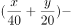，解得。即甲地到乙地上坡路比下坡路少20千米。

故正确答案为A。

---

### 第 2 题　qid 2456374 · 数学运算

箱子内有标号分别为1、2、3······25的25个乒乓球，问至少需要取出多少个乒乓球才能保证有两个的标号之差为6的倍数？

- **A**. 6
- **B**. 7　✅
- **C**. 9
- **D**. 10

**答案**：B

**官方解析**

要保证有两个乒乓球的标号差为6的倍数，考虑最不利情况。若拿出来的球是六个连续的标号，在此情况下不会产生标号差为6的倍数。故至少需拿出个乒乓球，才能保证有两个的标号差为6的倍数。

故正确答案为B。

---

### 第 3 题　qid 2456384 · 数学运算

某停车场的收费标准如下：7:00—21:00，每小时6元，不足一小时按一小时计算；21:00—次日7:00，每两小时1元，不足两小时按两小时计算；每日零时为新的计费周期，重新开始计时。小刘某天上午10时将车驶入停车场，待其驶出时缴费70元，则小刘停车时长的范围是：

- **A**. 

- **B**. 
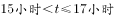

- **C**. 
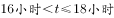
　✅
- **D**. 

**答案**：C

**官方解析**

小刘上午10:00将车驶入停车场，则10:00—21:00时段产生停车费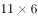。结合21:00—次日7:00每两小时1元，不足两小时按两小时计算的收费标准，以及每日凌晨为新的计费周期，重新开始计时。则21:00-24:00，共3小时，收费2元。驶出时缴费70元，，根据收费标准次日停车时长大于2小时小于等于4小时。则停车时长范围大于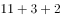；小于等于。

故正确答案为C。

---

### 第 4 题　qid 2456388 · 数学运算

王先生花30000元买入A、B两只股票若干，两个交易日后，A股票上涨，B股票下跌。王先生将股票卖出，共盈利1300元，那么王先生在买入A、B两只股票时的投资比例为：

- **A**. 5：4
- **B**. 4：3
- **C**. 3：2
- **D**. 2：1　✅

**答案**：D

**官方解析**

令买入A股元，买入B股元。根据题意可建立方程组：；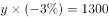。解得，，故A、B两股的投资比例为。

故正确答案为D。

---

### 第 5 题　qid 2456394 · 数学运算

实验室内有浓度分别为和的盐酸各500毫升，从两种溶液中分别倒出一部分配成浓度为的盐酸600毫升。如果将剩余的盐酸混合，则该溶液的浓度为：

- **A**. 

- **B**. 

- **C**. 

- **D**. 
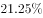
　✅

**答案**：D

**官方解析**

的盐酸500毫升，溶质量为毫升；的盐酸500毫升，溶质量为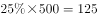毫升；的盐酸600毫升，溶质量为毫升。故剩余溶液量为毫升，剩余溶质质量为毫升，则剩余溶液混合后浓度为。

故正确答案为D。

---

### 第 6 题　qid 2456397 · 数学运算

9个人按1到9的顺序编号围坐在一起玩“数7”的游戏，从第1号开始依次报数，凡是报到7的倍数或者含有7的数字时，轮到的人都说“过”。当大家从1报到100时，几号说的“过”最少？

- **A**. 5号　✅
- **B**. 6号
- **C**. 7号
- **D**. 8号

**答案**：A

**官方解析**

9个人依次轮流报数，则每报数一轮的周期为9。
5号在第一轮时所报数字为5，再次报数时应每轮+9，则报数分别为14、23、32、41、50、59、68、77、86、95，满足7的倍数或者含有7的数字的共有（14、77）两个；
6号在第一轮时所报数字为6，再次报数时应每轮+9，报数分别为：15、24、33、42、51、60、69、78、87、96，满足7的倍数或者含有7的数字的共有（42、78、87）三个；
7号在第一轮时所报数字为7，再次报数时应每轮+9，报数分别为：16、25、34、43、52、61、70、79、88、97，满足7的倍数或者含有7的数字的共有（7、70、79、97）四个；
8号在第一轮时所报数字为8，再次报数时应每轮+9，报数分别为：17、26、35、44、53、62、71、80、89、98，满足7的倍数或者含有7的数字的共有（17、35、71、98）四个；
报数中报到7的倍数或者含有7的数字最少的是5号，则5号说的“过”最少。
故正确答案为A。

---

### 第 7 题　qid 2456398 · 数学运算

500家公司的年收入都在6300万元到8500万元之间。由于失误，把其中一家公司的年收入8500万元记为85000万元输入计算机。那么输入的错误数据的500家公司年收入平均值与准确数据的平均值相差多少万元？

- **A**. 76.5
- **B**. 78.48
- **C**. 153　✅
- **D**. 382.5

**答案**：C

**官方解析**

设未输入错误的499家公司年收入总和为，则可得输入错误的500家公司年均收入与准确数据相差：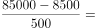万元。

故正确答案为C。

---

### 第 8 题　qid 2456401 · 数学运算

甲、乙两地间的车程是40分钟，每天早上6点起，每隔7分钟两地都会发出一班公交车。早上6点35分从甲地出发的公交车，在去乙地的路上，会遇到多少辆从乙地开出的公交车？

- **A**. 9
- **B**. 10
- **C**. 11　✅
- **D**. 12

**答案**：C

**官方解析**

方法一：因每天早上6点起，甲、乙两地每隔7分钟都会发出一班公交车，则6点35分时，从乙地发出的第一班公交车距离甲地还有5分钟的车程。此时从甲地发出的公交车只需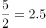分钟即可与之相遇。在剩余分钟的车程里，6点35分从甲地发出的公交车每分钟就会与一班乙地发出的公交车相遇，还可以遇到辆，取整为10辆。故一共可以遇到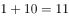辆从乙地开出的公交车。

方法二：6点35分时，从乙地6点及以后发出的公交车都未到达甲地，而此时从甲地发出的公交车，经过40分钟，7点15分才能到达乙地。因此在7点15分之前从乙地发出的公交车都会与之相遇。6点至7点15分，共计75分钟，每7分钟发出一班，，加上6点整发出的一班，一共可以遇到11辆从乙地开出的公交车。

故正确答案为C。

---

### 第 9 题　qid 2456406 · 数学运算

扶贫干部小张和小李计划在周一到周五完成8个村的调研工作，每人每天只能去一个村，每个村只能去1人次。其中小张必须去甲村和乙村，小李必须去丙村，且丙、丁、戊、己四个村只能在周一和周二去。问共有多少种不同的安排方式？

- **A**. 超过1000种
- **B**. 501～1000种之间　✅
- **C**. 200～500种之间
- **D**. 不到200种

**答案**：B

**官方解析**

根据题意，因丙、丁、戊、己只能在周一和周二去，同时丙必须由小李去，则除了丙外，小李可从剩余三个村中抽选一个，然后小张去剩余两村，总共有：种情况。剩余四个村子，可分为以下两种情况：

（1）若小张剩余三天每天均去一个村，则除了必须去的甲和乙外，还需从剩余2个村中抽选一个。此时小李只要在剩余三天中去一个村即可。总情况数为：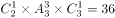种情况；

（2）若小张剩余三天中只去了甲、乙，则小李在剩余三天中需要去两个村。总情况数为：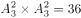种情况；

则总共的安排方式有：种，B项满足。

故正确答案为B。

---

### 第 10 题　qid 2456359 · 数学运算

正三角形跑道ABC边长为120米，甲和乙从A点同时出发，甲沿AB、乙沿AC方向匀速跑步。已知甲的速度是，且乙离开C点10秒后，两人在BC间第一次相遇。问甲的速度是乙的多少倍？

- **A**. 不到1.25倍
- **B**. 1.25～1.5倍之间
- **C**. 1.5～1.75倍之间　✅
- **D**. 1.75倍以上

**答案**：C

**官方解析**

设乙的速度为，则乙跑完AC用时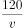秒，从出发到相遇总计用时秒。两人同时出发，所用时间相同，到相遇共跑完跑道的一圈，则可得：，化简得：。根据一元二次方程求根公式“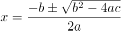”，求得，。根据条件可得1.88满足。则甲的速度是乙的倍。

猜题技巧：设未知数求解，计算会过于复杂，考虑结合选项代入验证求解。

若甲的速度是乙的1.5倍，则乙的速度为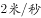。则相遇时乙所走的时间为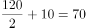秒，所走路程米；此时甲所走的路程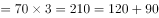米。因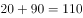，不足120米，则此时乙的速度应略小于2。因为只有小于2时，与甲相遇花费的时间才能更多，两人才能够将BC的路程走完。则甲的速度是乙的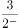倍，应略大于1.5倍，C项满足。

故正确答案为C。

---

### 第 11 题　qid 2456361 · 数学运算

足球小组赛时，5个足球队A、B、C、D、E分到同一个小组，进行单循环赛（每两队赛一场，胜、平、负分别积3、1、0分），结果A、B、C、D队总分分别是1、4、7、8，那么E队最多可能得多少分？

- **A**. 5
- **B**. 6
- **C**. 7　✅
- **D**. 8

**答案**：C

**官方解析**

分析A、B、C、D四队得分：

A队：得1分，只能为赢0场、平1场、输3场；

B队：得4分，可能为赢1场、平1场、输2场，或赢0场、平4场、输0场；

C队：得7分，只能为赢2场、平1场、输1场；

D队：得8分，只能为赢2场、平2场、输0场。

A、C、D三队输赢场次已确定，共赢4场、平4场、输4场。因各队的胜场数总和应等于负场数总和，且平局场次数为偶数，要想E队得分赢尽可能高，则确定B队为赢1场、平1场、输2场。A、B、C、D四队共赢了场、输了场，平了场。则E队赢的场次数比输的场次数大1，且平的场次数为奇数。已知E队共比了4场比赛，则E队可能为赢2场、平1场、输1场，或赢1场、平3场、输0场，得分分别为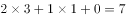分，或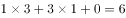分，则E队得分最多为7分。

故正确答案为C。

---

### 第 12 题　qid 2456372 · 数学运算

如下图所示，在直角三角形ABC中，MN是中位线。已知四边形ABMN与三角形MNC的周长比为28：15，则AC与BC的长度比是：

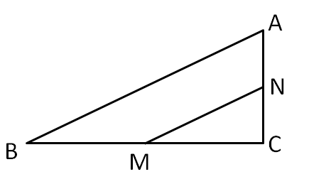

- **A**. 5：12　✅
- **B**. 5：7
- **C**. 3：4
- **D**. 6：7

**答案**：A

**官方解析**

假设三角形MNC的长度为15，四边形ABMN的长度为28，因MN为中位线，则，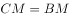，则两个周长之差为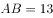，因三角形ABC为直角三角形，5、12、13为一组勾股数，，A项满足。

故正确答案为A。

---

### 第 13 题　qid 2456381 · 数学运算

下图中，阴影部分的面积大还是条纹部分的面积大？

- **A**. 阴影部分面积大　✅
- **B**. 条纹部分面积大
- **C**. 两个部分一样大
- **D**. 不能确定

**答案**：A

**官方解析**

假设正方形的边长为4，则正方形的面积为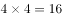，内切于正方形的圆直径为4，半径为2，每个小圆的直径为2，则阴影部分面积为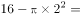。

按照如下图所示作辅助线，箭头所指区域面积即为题目所求条纹部分面积。

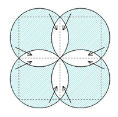

每个小圆面积减去其内接小正方形面积等于4个箭头所指区域面积之和，也等于题目所求条纹部分面积的一半。因小圆的直径为2，半径为1，小圆的面积为，其内接小正方形对角线长度为2，小正方形的面积为对角线乘积的一半，为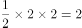，则题目所求条纹部分面积为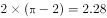。

综上，阴影部分面积较大。

故正确答案为A。

---

### 第 14 题　qid 2456386 · 数学运算

数表如下图所示，根据规律，第20行所有数的和是：

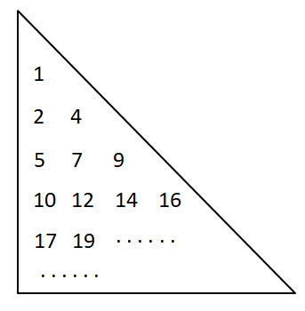

- **A**. 6850
- **B**. 7239
- **C**. 7610
- **D**. 7620　✅

**答案**：D

**官方解析**

如图所示，第1行有1个数，第2行有2个数，第3行有3个数······，则第20行有20个数，且从第2行开始，每一行中后项均比前项大2，构成公差为2的等差数列。

且观察发现，每一行最后一个数均为平方数，，，，······，则第20行的最后一个数为第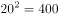，第20行的第一个数为，则第20行所有数的和为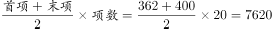。

故正确答案为D。

---

### 第 15 题　qid 2456389 · 数学运算

王明家与李兰家相距3.42千米，李兰家与张红家相距10.8千米，张红家与周珊家相距5.85千米，周珊家与王明家相距1.53千米。问王明家与张红家相距多少千米？

- **A**. 4.95
- **B**. 7.38　✅
- **C**. 9.27
- **D**. 10.8

**答案**：B

**官方解析**

根据题意，张红家与周珊家相距5.85千米，周珊家与王明家相距1.53千米。

若周珊家在王明家与张红家连线构成的直线上，则王明家与张红家的距离为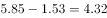千米，或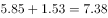千米；

若周珊家不在王明家与张红家连线构成的直线上，结合三角形性质：两边之差小于第三边，两边之和大于第三边，则王明家与张红家的距离为：大于千米，小于千米。

则王明家与张红家的距离为：大于等于4.32千米，小于等于7.38千米。

同理，若李兰家在王明家与张红家连线构成的直线上，则王明家与张红家的距离为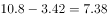千米，或千米；

若李兰家不在王明家与张红家连线构成的直线上，则王明家与张红家的距离为：大于千米，小于千米；

则王明家与张红家的距离为：大于等于7.38千米，小于等于14.22千米。

综上，王明家与张红家的距离只能为7.38千米。

故正确答案为B。

---

### 第 16 题　qid 2456390 · 数学运算

某服装商场限时促销100件衣服，买一件打九折，买两件打八折，买三件打七折，每人限购3件。活动结束后发现，100件衣服刚好分50单卖出，且平均每件衣服相当于原价的售出。那么，买三件衣服的顾客有多少人？

- **A**. 20
- **B**. 25　✅
- **C**. 28
- **D**. 30

**答案**：B

**官方解析**

设购买一件、两件、三件衣服的顾客分别有a、b、c人，每件衣服原价为元。根据刚好分50单卖出，可列式：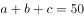①；根据一共售出100件，可列式：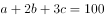②；根据平均每件衣服相当于原价的售出，可列式：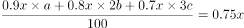，化简得：③。可得：，代入①式可得：④，代入③式可得：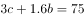⑤，可得：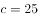。

故正确答案为B。

---

### 第 17 题　qid 2456393 · 数学运算

甲、乙、丙三人出同样多的钱购买了一大袋单价为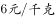的面粉。本来想三人平分，后来丙觉得不需要那么多面粉，就以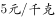的价格转让给甲、乙一部分面粉。最后，甲、乙都比丙多分到9千克面粉，那么甲、乙各要给丙多少元钱？

- **A**. 15　✅
- **B**. 18
- **C**. 22.5
- **D**. 45

**答案**：A

**官方解析**

由题可知，丙转让部分面粉后，甲、乙都比丙多分到9千克面粉，即甲、乙多分到的面粉重量相同。设三人平分后每人面粉重量为千克，甲多分到的面粉重量为a千克，丙转让出的面粉重量为2a千克，根据最后甲比丙多分到9千克面粉，可列式：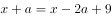，解得千克。丙以的价格转让，甲需要付给丙的钱数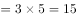元，同理乙也需要付给丙15元。

故正确答案为A。

---

### 第 18 题　qid 2456396 · 数学运算

甲、乙、丙三艘轮船同时从A地出发去B地，甲、乙到达B地后调头回A地，因为逆水的关系速度都减少到原来各自的一半。甲第一个到达B地，调头后与乙在C处相遇，接着又与丙在AB的中点D处相遇，乙调头后与丙也在C处相遇。已知AB两地相距4880米，那么当甲、乙相遇时，丙行驶了多少米？

- **A**. 1580
- **B**. 1830　✅
- **C**. 2050
- **D**. 2240

**答案**：B

**官方解析**

设甲最初速度为a，乙最初速度为b，丙速度为c，路程如下图所示：

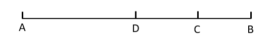

根据甲、乙相遇于C点，可列式：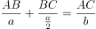，化简得：；根据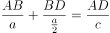，又因为D是AB中点，所以，化简得：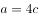；根据乙、丙相遇于C点，可列式：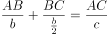，化简得：。

令，则，，化简得：，即。将代入，，化简得：，即。当甲、乙相遇于C点时，丙行驶的距离千米。

故正确答案为B。

---

### 第 19 题　qid 2456377 · 数学运算

某书店从图书批发商那里以图书定价的四折购进一批图书，又以定价的八折售出这批图书的，剩下的图书以六折的价格售完。那么这批图书的利润率是多少？

- **A**. 

- **B**. 

- **C**. 

- **D**. 

　✅

**答案**：D

**官方解析**

赋值这批图书定价为100元，总共购进。则进价元，八折售出价格元，此时利润元，六折售出价格元，此时利润元。。

故正确答案为D。

---

### 第 20 题　qid 2456385 · 数学运算

小刘从家到单位，有2路、9路两路公共汽车可乘。已知2路车过去3分钟就来9路车，9路车过去7分钟才来2路车。小刘每次到车站等车，哪路先到就上哪路。那么，小刘坐2路车的概率是多少？

- **A**. 

- **B**. 

- **C**. 

- **D**. 

　✅

**答案**：D

**官方解析**

由题可知，2路车过去3分钟就来9路车，9路车过去7分钟来2路车，公交车到站情况如下图所示：

公交车到站时间以10分钟为一个周期，其中红色线段3分钟内小刘将乘坐9路车，蓝色线段7分钟内小刘将乘坐2路车，则小刘乘坐2路车的概率。

故正确答案为D。

---

## 判断推理

### 第 1 题　qid 2456392 · 逻辑判断

调查发现，认同自己有网瘾的同学，上网时间明显高于否认有网瘾的同学，他们平均每周上网时间为13.3小时，比后者多5.4小时。研究者据此认为，一旦认为自己有网瘾，上网时间就会变长。
以下哪项如果为真，最能削弱上述观点？

- **A**. 家长对有网瘾的同学很难管得住
- **B**. 认为自己有网瘾的同学学习时间明显变少
- **C**. 不认为自己有网瘾的同学对上网更有自制力
- **D**. 一周上网10小时以上的同学才会认为自己有网瘾　✅

**答案**：D

**官方解析**

第一步：找出论点和论据。
论点：一旦认为自己有网瘾，上网时间就会变长。
论据：认同自己有网瘾的同学，上网时间明显高于否认有网瘾的同学，他们平均每周上网时间为13.3小时，比后者多5.4小时。
本题的论点是因果类的论点，可以优先考虑因果倒置的削弱方法。
第二步：逐一分析选项。
A项：选项在说网瘾同学“不好管理”，而论点讨论的是认为自己有网瘾和“上网时长”之间的关系，二者讨论话题不一致，不能削弱，排除；
B项：讨论的是认为有网瘾和学习时间的关系，与论点无关，无法削弱，排除；
C项：不认为有网瘾的同学更有自制力，从反面说明认为有网瘾的自制力要差一些，上网时间会长，可以加强，无法削弱，排除；
D项：论点是认为有网瘾导致上网时间长，该项是上网时间长才认为自己有网瘾，颠倒了论点中的因果，属于因果倒置的削弱，当选。
故正确答案为D。

---

### 第 2 题　qid 2456410 · 逻辑判断

2016年国家开始推广全民阅读，调查发现，2017年我国成年国民人均纸质图书阅读量为4.66本，较2016年的4.65本略有增长。据此有人认为，全民阅读没什么效果。
以下哪项如果为真，最能削弱上述观点？

- **A**. 
全民阅读推广以来，读书节活动吸引了很多人参加

- **B**. 
2017年，我国成年国民的电子书阅读率比2016年提高了5.8个百分点
　✅
- **C**. 
2017年，人均阅读量最高的日本人均纸质图书阅读量跟2016年基本持平

- **D**. 
2017年，我国成年国民人均每天手机接触时长比2016年增加了6.03分钟

**答案**：B

**官方解析**

第一步：找到论点和论据。
论点：全民阅读没什么效果。
论据：2016年国家开始推广全民阅读，2017年我国成年国民人均纸质图书阅读量为4.66本，较2016年的4.65本略有增长。
论据说的是人均纸质图书阅读量增长慢，论点说的是全民阅读没有效果，纸质图书阅读量只是衡量是否有效果的一个因素，论点论据话题不一致，要想削弱，优先考虑拆桥。
第二步：逐一分析选项。
A项：读书节吸引了很多人，但是他们是否阅读更多的书不确定，不能削弱，排除；
B项：2017年成年国民的电子书阅读率比2016年提高了5.8个百分点，也就说是不能仅仅由纸质书阅读增长慢推出全民阅读没有效果，切断了论点和论据之间的联系，可以削弱，当选；
C项：日本人均阅读量与我国情况无关，不能削弱，排除；
D项：手机接触时间增加与读书无关，不能削弱，排除。
故正确答案为B。

---

### 第 3 题　qid 2456414 · 逻辑判断

《中国农村教育发展报告2017》显示，2016年全国乡村教学点有8.68万个，远不及1995年时19.36万个教学点的一半。
以下各项如果为真，不能解释上述情况的是：

- **A**. 城镇化发展导致农村人口流失很多
- **B**. 农村学校教师待遇差，师资力量弱　✅
- **C**. 许多农村学校难以为继，最终被撤并
- **D**. 很多乡村教学点都搬到城市里了

**答案**：B

**官方解析**

第一步：找出题干矛盾。
2016年全国乡村教学点有8.68万个，远不及1995年时19.36万个教学点的一半。
第二步：逐一分析选项。
A项：城镇化发展导致农村人口流失很多，由于农村人口流失，所以教学点相应减少，可以解释题干矛盾，排除；
B项：农村学校教师待遇差，师资力量弱，无法解释2016年乡村教学点远不及1995年教学点的一半，无法解释题干矛盾，当选；
C项：许多农村学校难以为继，最终被撤并，可以解释2016年教学点大量减少，可以解释题干矛盾，排除；
D项：很多乡村教学点都搬到城市里了，可以解释2016年教学点大量减少，可以解释题干矛盾，排除。
本题为选非题，故正确答案为B。

---

### 第 4 题　qid 2456419 · 逻辑判断

有三户人家，每家都有一个孩子，他们是：小花（女）、小芳（女）、小明（男）。孩子的爸爸是刘生、马峰、王强；妈妈是朱凤、陈静、郑婷。对于这三家人，已知：
（1）王强和郑婷不是一家人；
（2）马峰的女儿不是小芳；
（3）刘生家和陈静家的孩子都参加了女子舞蹈培训班。
根据以上条件，可以推出：

- **A**. 刘生、朱凤和小花是一家
- **B**. 王强、陈静和小芳是一家
- **C**. 刘生、郑婷和小芳是一家　✅
- **D**. 王强、郑婷和小明是一家

**答案**：C

**官方解析**

第一步：分析题干。
（1）王强和郑婷不是一家人。
（2）马峰的女儿不是小芳。
（3）刘生家和陈静家的孩子都参加了女子舞蹈培训班。
第二步：根据题干条件分析选项。
由（1）可以排除D项。由（2）可知马峰的孩子为女儿，不是小芳即是小花，因此马峰和小花是一家人，排除A项。由（3）可知刘生家的孩子不是小明，又由（2）可知刘生家的孩子不是小花，因此刘生家的孩子是小芳，排除B项，本题选C。
故正确答案为C。

---

### 第 5 题　qid 2456422 · 逻辑判断

某教育学家指出我们应该用立法的方式来限定儿童的最大学业负担，以此来保证儿童的自由活动时间。所以，该项法律能够推动儿童创新思维的培养。
下列可以作为上述论证前提的是：

- **A**. 立法的目的是为了减轻儿童的负担
- **B**. 创新思维对儿童的全面发展至关重要
- **C**. 自由活动时间太少是创新思维发展的重要阻碍　✅
- **D**. 很多儿童因为学业负担太重而没有充足活动时间

**答案**：C

**官方解析**

第一步：找出论点和论据。
论点：该项法律能够推动儿童创新思维的培养。
论据：我们应该用立法的方式来限定儿童的最大学业负担，以此来保证儿童的自由活动时间。
论点讨论的是儿童创新思维，论据讨论的是学业负担和自由活动时间，论点论据话题不一致，且提问中包含了“前提”，因此本题优先考虑搭桥的方式加强。
第二步：逐一分析选项。
A项：立法的目的与论点讨论的立法的结果话题不一致，无法加强，排除；
B项：创新思维对儿童的全面发展至关重要，与立法是否能够推动儿童的创新思维无关，无法加强，排除； 
C项：自由活动时间太少是创新思维发展的重要阻碍，在论点的创新思维和论据的自由活动时间之间搭桥，当选； 
D项：很多儿童因为学业负担太重而没有充足活动时间，与立法是否能够推动儿童的创新思维无关，无法加强，排除。
故正确答案为C。

---

### 第 6 题　qid 2456428 · 逻辑判断

一项研究表明，明火、煤炉和烧烤炉的烟雾中含有大量的致癌物质、一氧化碳等有害物质。在明火或炭上经常烧烤或烹饪食物会使患肺炎、哮喘和其他肺部疾病的可能性增加。据此有人认为，它们给人们带来的危害不亚于香烟。

以下哪项如果为真，最能削弱上述观点？

- **A**. 
调查发现，致癌人员中经常接触明火、木炭的人数远小于吸烟人数
　✅
- **B**. 
与火灾经常接触的消防队员，其血液中的致癌物浓度远高于普通人

- **C**. 
近年来，香烟生产商在生产环节已经逐步降低了香烟对人的危害性

- **D**. 
据统计，目前我国近的家庭仍在使用木材和煤炭来做饭和取暖

**答案**：A

**官方解析**

第一步：找出论点和论据。

论点：明火、煤炉和烧烤炉的烟雾给人们带来的危害不亚于香烟。

论据：明火、煤炉和烧烤炉的烟雾中含有大量的致癌物质、一氧化碳等有害物质。在明火或炭上经常烧烤或烹饪食物会使患肺炎、哮喘和其他肺部疾病的可能性增加。

论点论据都在讨论明火、煤炉和烧烤炉会给人带来危害，论点论据话题一致，因此削弱优先考虑否定论点。

第二步：逐一分析选项。

A项：致癌人员中经常接触明火、木炭的人数远小于吸烟人数，说明明火、煤炉和烧烤炉对人们的危害没有吸烟大，直接削弱论点，当选；

B项：与火灾经常接触的消防队员，其血液中的致癌物浓度远高于普通人，说明明火对人体有一定危害，有加强作用，无法削弱，排除； 

C项：香烟生产商在生产环节已经逐步降低了香烟对人的危害性，与明火、煤炉和烧烤炉的危害无关，无法削弱，排除； 

D项：目前我国近的家庭仍在使用木材和煤炭来做饭和取暖，但木材和煤炭对人体的危害如何不知道，无法削弱，排除。

故正确答案为A。

---

### 第 7 题　qid 2456436 · 逻辑判断

一项研究表明，喝咖啡能明显降低心血管病人的死亡风险，这说明日常喝咖啡对我们的身体健康具有一定的积极意义。
以下哪项如果为真，最能支持上述观点？

- **A**. 咖啡具有提神醒脑、增加记忆力的功效
- **B**. 不论是男性还是女性，喝咖啡与全因死亡率降低有显著关系　✅
- **C**. 给小鼠喂食一定量的咖啡因之后，衰老小鼠的心肌功能回到了年轻状态
- **D**. 咖啡因能够促进一种名为p27的蛋白质进入线粒体，从而增强心脏细胞的功能

**答案**：B

**官方解析**

第一步：找出论点和论据。
论点：日常喝咖啡对我们身体健康具有一定的积极意义。
论据：喝咖啡能明显降低心血管病人的死亡风险。
题干论点和论据都体现了喝咖啡与身体健康的关系，话题一致，考虑补充论据进行加强。
第二步：逐一分析选项。
A项：该项讨论的是咖啡增强记忆力，与身体健康的关系未知，不能加强，排除；
B项：喝咖啡与降低全因死亡率有显著关系，说明咖啡确实对于身体健康有积极意义，属于补充论据，保留；
C项：该项说明咖啡对小鼠有益，但是题干强调的主体是人，不能加强，排除；
D项：该项说明了咖啡里的咖啡因确实对身体有好处，可以加强，保留。
对比B、D两项，可以发现B项的全因死亡包括了死亡的各种原因，其中也必然有涉及健康的种种因素，很全面；而D项仅仅是对论据进行的补充，涉及的依旧是心脏方面的健康，不如B项全面。
故正确答案为B。

---

### 第 8 题　qid 2456367 · 逻辑判断

现在不仅年轻人热衷于使用网络语言，不少网络流行语也从网络蔓延到传统媒体，成为大众熟悉的语言。有专家指出，网络语言的盛行使得语言表达更加丰富，人们之间的沟通变得新奇、简单、幽默，彰显个性，符合现代社会的多元化特点。
以下哪项如果为真，最能反驳专家的观点？

- **A**. 网络流行语粗鄙化比例较高，会给青少年语言习得带来不利影响
- **B**. 因为言语交际具有场合性，不是所有的语境都适合使用网络语言
- **C**. 网络流行语使人们的表达方式趋于同化，独立组织语言的能力下降　✅
- **D**. 网络语言大多不符合汉语语法规范，不利于青少年语言学习与发展

**答案**：C

**官方解析**

第一步：找出论点和论据。
论点：网络语言的盛行使得语言表达更加丰富，人们之间的沟通变得新奇、简单、幽默，彰显个性，符合了现代社会的多元化的特点。
论据：无。
本题只有论点没有论据，论点讨论网络语言的语言表达更加丰富，符合了现代社会的多元化的特点，削弱优先考虑削弱论点。
第二步：逐一分析选项。
A项：说的是网络流行语会给青少年的语言学习带来不利影响，并没有说网络流行语对语言表达的影响，论点说的是网络语言的语言表达更加丰富，符合了现代社会的多元化的特点，话题不一致，无法削弱，排除；
B项：说的是有的语境不适合用网络语言，说明网络语言有一定的局限性，但论点说的是网络语言的语言表达更加丰富，符合了现代社会的多元化的特点，话题不一致，无法削弱，排除；
C项：说的是网络流行语使得人们的表达趋于同化，也就是使得人们的表达单一，没有个性，直接否定了论点，可以削弱，当选；
D项：说的是网络语言不利于青少年的语言学习和发展，并没有说网络流行语对语言表达的影响，论点说的是网络语言的语言表达更加丰富，符合了现代社会的多元化的特点，话题不一致，无法削弱，排除。
故正确答案为C。

---

### 第 9 题　qid 2456375 · 逻辑判断

王力、刘青、陈华、马玲四人代表单位参加比赛。赛后，王力说刘青会获奖，刘青说陈华会获奖，陈华、马玲都说自己不会获奖。如果四人的陈述只有一人错，那么谁一定获奖？

- **A**. 仅王力
- **B**. 仅刘青　✅
- **C**. 仅陈华
- **D**. 仅刘青和陈华

**答案**：B

**官方解析**

第一步：找出题干矛盾命题。
刘青说“陈华会获奖”和陈华说“自己不会获奖”是矛盾关系，必有一真必有一假。已知只有一人错，说明王力和马玲一定说真话。
第二步：看其余。
根据王力和马玲说真话可知：刘青会获奖、马玲不会获奖，而王力和陈华是否获奖，无法确定。
故正确答案为B。

---

### 第 10 题　qid 2456383 · 逻辑判断

假设“如果甲爱看越剧或乙不爱看越剧，那么丙爱看越剧”为真，由下列哪项可推出“乙爱看越剧”的结论？

- **A**. 丙不爱看越剧　✅
- **B**. 甲不爱看越剧
- **C**. 甲和丙都爱看越剧
- **D**. 甲和丙有一个不爱看越剧

**答案**：A

**官方解析**

第一步：翻译题干。

题干条件：甲或乙→丙；

题干结论：乙。

第二步：逐一分析选项。

A项：丙不爱看越剧，是对题干条件的否后，否后必否前，可以推出：（甲或乙），根据德摩根定律，可得：甲且乙，因此可以得出乙爱看越剧的结论，当选；

B项：甲不爱看越剧，无法确定“甲或乙爱看越剧”的真假，因此无法推出结论，排除；

C项：根据“或”关系一真即真，由甲爱看越剧可知，“甲或乙爱看越剧”也为真，是对题干条件的肯前，肯前必肯后，可以推出：丙爱看越剧，但无法确定乙是否爱看越剧，因此无法推出结论，排除；

D项：甲和丙有一个不爱看越剧，不明确是甲还是丙不爱看越剧，因此无法推出结论，排除。

故正确答案为A。

---

### 第 11 题　qid 2456395 · 图形推理

左图给定的是由相同正方体堆叠而成的多面体，其正视图和后视图完全相同。该多面体可以由①、②和③三个多面体组合而成，以下哪一项能填入问号处？

- **A**. A　✅
- **B**. B
- **C**. C
- **D**. D

**答案**：A

**官方解析**

本题考查立体拼合。

如下图所示，选项小方块数量相同，故优先在题干找最大块/特殊块拼合，题干图②（红块）比较特殊，在立体图形中只能拼在下图位置，图①（绿块）与右侧方块形状更为类似，故放在右侧，最后剩下的蓝块对应A项。

故正确答案为A。

---

### 第 12 题　qid 2456399 · 图形推理

左边给定的是纸盒的外表面，右边哪一项能由它折叠而成？

- **A**. A
- **B**. B　✅
- **C**. C
- **D**. D

**答案**：B

**官方解析**

将原展开图标上序号如下图，逐一进行分析。

A项：立体图包含面a和面c，而面a与面d为相对面，故上面三角形的面只能是面e，利用面e以三角形底边为唯一边起点出发顺时针画边标号如下图，题干边4挨着面f，选项A并不是，选项与题干不一致，排除；

B项：选项与题干一致，当选；

C项：若三角形面为面d，则面d的相对面面a不能出现，故右侧面为面c，而又因为面c与面f是相对面，故顶面只能是面b；同理若三角形面为面e，则顶面为面f，右面为面a。故C项可能是两种情况，（1）面b、面c、面d组成，此时三者公共点（如下图绿点）展开图发出两条斜线，而选项发出一条斜线，选项与题干不一致；

（2）面a、面e、面f组成，此时三者公共点（如下图红点，题干中相同颜色的边为一条边，折合后红点为三者公共点）在题干展开图发射两条斜线，而选项发出一条斜线，选项与题干不一致；

两种情况均与题干不一致，排除；

D项：立体图包含面b和面f，而面b与面e为相对面，故上面三角形的面只能是面d，三者公共点如下图蓝点，题干蓝点只发出面f上一条斜线，而选项发射出两条斜线，选项与题干不一致，排除。

故正确答案为B。

---

### 第 13 题　qid 2456409 · 图形推理

把下面的六个图形分为两类，使每一类图形都有各自的共同特征或规律，分类正确的一项是：

- **A**. ①②③，④⑤⑥
- **B**. ①③⑥，②④⑤
- **C**. ①⑤⑥，②③④　✅
- **D**. ①④⑥，②③⑤

**答案**：C

**官方解析**

本题为分组分类题目。题干图形中均出现小黑点，优先考虑功能元素。观察发现，题干图形中的小黑点均标记在交点上，图①⑤⑥标记的是直线与曲线的交点，图②③④标记的是直线与直线的交点，即图①⑤⑥一组，图②③④一组。
故正确答案为C。

---

### 第 14 题　qid 2456413 · 图形推理

把下面的六个图形分为两类，使每一类图形都有各自的共同特征或规律，分类正确的一项是：

- **A**. ①②④，③⑤⑥　✅
- **B**. ①③⑤，②④⑥
- **C**. ①②⑥，③④⑤
- **D**. ①④⑥，②③⑤

**答案**：A

**官方解析**

元素组成相同，优先考虑位置规律。题干每幅图都分为内外层，考虑内外分开看。观察发现，图①②④为一组，三者的内部图案和外部图案分别一致，且图②可以看作图①顺时针旋转90度得到，图④可以看作图①逆时针旋转90度得到；图③⑤⑥为一组，三者内部图案和外部图案分别一致，且图⑤可以看作图③旋转180度得到，图⑥可以看作图③逆时针旋转90度得到。只有A项符合，当选。
故正确答案为A。

---

### 第 15 题　qid 2456418 · 图形推理

从所给的四个选项中，选择最合适的一个填入问号处，使之呈现一定的规律性：

- **A**. A
- **B**. B
- **C**. C
- **D**. D　✅

**答案**：D

**官方解析**

元素组成不同，无明显属性规律，优先考虑数量规律。图形均有封闭面，九宫格第一行图及第二行图封闭面数量均分别为2、3、4；第三行前两幅图封闭面数量分别为2、3，故处封闭面数量应为4，排除A、C两项。再次观察题干，图形均为全直线图形，考虑数直线。九宫格第一行图直线数均为7；第二行图直线数均为8；第三行前两幅图直线数均为9，故处图形直线数也应为9，B项直线数为8，排除；D项直线数为9，符合规律，当选。

故正确答案为D。

---

## 资料分析

### 材料 1

        2018年1-11月，我国互联网和相关服务业发展态势良好，业务收入保持较快增长，盈利状况基本稳定。分领域看，网络销售、影音直播等应用深受用户欢迎，市场规模稳步扩大，网络生活服务市场活跃。

一、总体运行情况

        1-11月，我国规模以上互联网和相关服务企业（简称互联网企业）完成业务收入8518亿元，同比增长，增速较1-10月提高1.7个百分点，与去年同期基本持平。主要省份保持良好增长态势，互联网业务收入总量居前三位的广东、上海、北京互联网业务收入分别增长、和。

二、分业务运行情况

（一）信息服务业务

        1-11月，信息服务收入达7615亿元，同比增长，其中，电子商务平台收入3212亿元，同比增长；网络游戏（包括客户端游戏、手机游戏、网页游戏等）业务收入1628亿元，同比增长。

（二）互联网数据中心业务

        1-11月，互联网企业完成互联网数据中心业务收入137亿元，同比增长；截至11月末，部署的服务器数量达138万台，同比增长。

（三）互联网接入业务

        1-11月，互联网企业完成互联网接入业务收入129亿元，同比下降，降幅较上半年和前三季度分别收窄6.9个和5个百分点。

三、移动应用程序（APP）数量情况

        我国市场上移动互联网应用数量小幅增长。截至11月底，我国市场上监测到的移动应用为447万款。11月份，我国第三方应用商店与苹果应用商店中新上架14.3万款移动应用。截至11月底，我国本土第三方应用商店移动应用数量超过266万款，苹果商店（中国区）移动应用数量超过181万款。

        截至11月底，游戏类应用数量为137.6万款。生活服务类应用规模达54万款，排名第二。排名第三和第四的分别是电子商务类应用和主题壁纸类应用，规模分别为42万款和37.1万款。在市场热点类应用当中，以物流企业应用、货运运输服务应用和具有自有物流服务能力的电子商城为代表的智慧物流类应用数量超过2.4万款；而提供二维码扫码、转账等金融支付功能的网络支付类应用数量约为2.5万款。

        截至11月底，第三方应用商店分发累计数量超过1.75万亿次。游戏类、系统工具类、影音播放类、社交通讯类、日常工具类、生活服务类和金融类应用下载量均超过千亿次，分别为3014亿次、2892亿次、2264亿次、1911亿次、1212亿次、1143亿次和1911亿次，其中游戏类、系统工具类和影音播放类应用下载量均突破两千亿次。其余各类应用中，下载总量超过500亿次的应用还有电子商务类（999亿次）、资讯阅读类（931亿次）和主题壁纸类（754亿次）。

#### 第 1 题　qid 2456363 · 综合

2017年1-11月，我国互联网企业完成业务收入约为多少亿元？

- **A**. 6900
- **B**. 7100　✅
- **C**. 7300
- **D**. 7500

**答案**：B

**官方解析**

由题干“2017年1-11月，我国互联网企业完成业务收入···”，结合材料时间是2018年1-11月，可判定本题为基期量计算问题。定位文字材料第二段，“（2018年）1-11月，我国规模以上互联网和相关服务企业（简称互联网企业）完成业务收入8518亿元，同比增长···”。根据公式：基期量，可计算出2017年1-11月，我国互联网企业完成业务收入约为：亿元。

故正确答案为B。

---

#### 第 2 题　qid 2456370 · 比重

2018年1-11月，信息服务收入占互联网企业业务收入比重约为：

- **A**. 

- **B**. 

- **C**. 

- **D**. 

　✅

**答案**：D

**官方解析**

由题干“2018年1-11月，···占···比重约为”，结合材料时间是2018年1-11月，可判定本题为现期比重计算问题。定位文字材料第二段，“（2018年）1-11月，我国规模以上互联网和相关服务企业（简称互联网企业）完成业务收入8518亿元，···”；定位文字材料第三段，“（2018年）1-11月，信息服务收入达7615亿元，···”。根据公式：比重，可计算出2018年1-11月，信息服务收入占互联网企业收入比重约为：，与D项最接近。

故正确答案为D。

---

#### 第 3 题　qid 2456373 · 综合

2018年前三季度，互联网企业完成互联网接入业务收入降幅较上半年：

- **A**. 收窄1.9个百分点　✅
- **B**. 收窄11.9个百分点
- **C**. 扩大1.9个百分点
- **D**. 扩大11.9个百分点

**答案**：A

**官方解析**

定位文字材料第五段，“（2018年）1-11月，互联网企业完成互联网接入业务收入···，同比下降17.8%，降幅较上半年和前三季度分别收窄6.9个和5个百分点”。可计算出2018年前三季度降幅；上半年降幅。由此可知，2018年前三季度，互联网企业完成互联网接入业务收入降幅较上半年：，即收窄1.9个百分点。 

故正确答案为A。

---

#### 第 4 题　qid 2456378 · 综合

根据上述资料，以下说法不正确的是：

- **A**. 
截至2018年11月底，至少七个类别应用下载量超过千亿次

- **B**. 
2018年1-11月，互联网业务收入同比增长率： 
　✅
- **C**. 
截至2018年11月底，移动应用程序（APP）数量方面，游戏类应用领先

- **D**. 
截至2018年11月底，排名前三的APP数量之和占移动应用程序总量的一半以上

**答案**：B

**官方解析**

A项：定位文字材料最后一段，“截至（2018年）11月底，第三方应用商店···。游戏类、系统工具类、影音播放类、社交通讯类、日常工具类、生活服务类和金融类应用下载量均超过千亿次，分别为···。其余各类应用中，下载总量超过500亿次的应用还有电子商务类（999亿次）、资讯阅读类（931亿次）和主题壁纸类（754亿次）。”可以看出，截至2018年11月底，共有游戏类······金融类，七个类别应用下载量超过千亿次。这仅仅是第三方应用商店的七类，还包括其他应用商店的，所以“至少七类”，正确；

B项：定位文字材料第二段，“（2018年）1-11月，…互联网业务收入总量居前三位的广东、上海、北京互联网业务收入分别增长、和。”可知2018年1-11月，互联网业务收入同比增长率，错误；

C项：定位文字材料倒数第二段，“截至（2018年）11月底，游戏类应用数量为137.6万款。生活服务类···54万款，排名第二。”可知，截至（2018年）11月底，移动应用程序（APP）数量方面，，故游戏类应用领先，正确；

D项：定位文字材料倒数第二段，截至（2018年）11月底，游戏类应用数量为137.6万款。生活服务类排名第二为54万款。电子商务类应用排名第三为42万款。定位文字材料倒数第三段，截至（2018年）11月底，我国市场上监测到的移动应用为447万款。根据公式：比重，可计算出截至2018年11月底，排名前三的APP数量之和占移动应用程序总量的比重，即一半以上，正确。

本题为选非题，故正确答案为B。

---

#### 第 5 题　qid 2456379 · 综合

根据上述资料，以下说法不正确的是：

- **A**. 截至2017年11月末，互联网企业部署的服务器数量超过100万台
- **B**. 2017年1-11月，互联网数据中心业务收入少于互联网接入业务
- **C**. 截至2018年11月底，应用下载量：系统工具类＞金融类＞日常工具类＞电子商务类
- **D**. 2018年1-11月，信息服务收入的同比增长率高于其所有子业务收入的同比增长率　✅

**答案**：D

**官方解析**

A项：定位文字材料第四段，“···截至（2018年）11月末，部署的服务器数量达138万台，同比增长。”。根据公式：基期量，可计算出截至2017年11月末，互联网企业部署的服务器数量万台。即超过100万台，正确；

B项：定位文字材料第四段，“（2018年）1-11月，互联网企业完成互联网数据中心业务收入137万元，同比增长”；定位文字材料第五段，“（2018年）1-11月，互联网企业完成互联网接入业务收入129亿元，同比下降···”。根据公式：基期量，可计算出2017年1-11月，互联网数据中心业务收入亿元；互联网接入业务收入亿元。故前者少于后者，正确；

C项：定位文字材料最后一段，“截至（2018年）11月底······游戏类、系统工具类、影音播放类、社交通讯类、日常工具类、生活服务类和金融类应用下载量均超过千亿次，分别为3014亿次、2892亿次、2264亿次、1911亿次、1212亿次、1143亿次和1911亿次···。其余各类应用中，下载总量超过500亿次的应用还有电子商务类（999亿次）、···”。可知，截至2018年11月底，应用下载量：系统工具类（2892亿次）金融类（1911亿次）日常工具类（1212亿次）电子商务类（999亿次）。正确；

D项：定位文字材料第三段，“（2018年）1-11月，信息服务收入达7615亿元，同比增长，其中，电子商务平台收入3212亿元，同比增长；网络游戏（包括客户端游戏、手机游戏、网页游戏等）业务收入1628亿元，同比增长”，材料中虽然未给出其他子业务收入情况，但根据混合增长率的结论：总体的增长率大小居于所有部分增长率中间范围。可知，2018年1-11月，信息服务收入的同比增长率是居于所有子业务中间范围的，故不会高于其所有子业务收入的同比增长率。错误。

本题为选非题，故正确答案为D。

---

### 材料 2

        2017年，我国技术市场交易额稳步增长，全年共签订各类技术合同36.8万项，成交金额13424.2亿元，比上年分别增长和。

        2017年全国共成交1000万元以上重大技术合同13358项，同比增长；成交额10281.4亿元，同比增长。重大技术合同中涉及各类知识产权的合同，成交5561项，成交金额为4121.7亿元。其中，技术秘密为主要交易形式，成交2959项，成交额2239.6亿元，居第一位；专利技术合同成交1291项，成交额1258.5亿元，居第二位。

#### 第 6 题　qid 2456364 · 平均数

2016年，平均每项技术合同成交金额约为：

- **A**. 330万元
- **B**. 356万元　✅
- **C**. 365万元
- **D**. 385万元

**答案**：B

**官方解析**

根据题干“2016年，平均每项技术合同成交金额约为”，可判定本题为基期平均数问题。定位文字材料第一段可知，“2017年，全年共签订各类技术合同36.8万项，比上年增长”；定位图形材料可知，2016年全国技术合同成交金额为11407亿元。根据公式：平均数；基期，可得所求万元。

故正确答案为B。

---

#### 第 7 题　qid 2456366 · 增长

2008-2017年，全国技术合同成交金额同比上涨最快的年份是：

- **A**. 2008年
- **B**. 2010年
- **C**. 2012年　✅
- **D**. 2017年

**答案**：C

**官方解析**

根据题干“2008-2017年，······同比上涨最快的年份是”，可判定本题为一般增长率的比较问题。定位图形材料可知，2007-2012年全国技术合同成交金额依次为2227亿元、2665亿元、3039亿元、3907亿元、4764亿元、6437亿元；定位文字材料第一段可知，2017年成交金额比上年增长。代入公式：增长率，则选项年份的增长率分别为：

2008年：增长率；

2010年：增长率；

2012年：增长率；

2017年：增长率。则全国技术合同成交金额同比上涨最快的年份是2012年。

故正确答案为C。

---

#### 第 8 题　qid 2456382 · 比重

2016年，1000万元以上重大技术合同数量占全国各类技术合同的比例在：

- **A**. 
以内
　✅
- **B**. 
之间

- **C**. 
之间

- **D**. 
以上

**答案**：A

**官方解析**

根据题干“2016年，······占······的比例”，可判定本题为基期比重问题。定位文字材料第一、二段可知，2017年，全年共签订各类技术合同36.8万项，比上年增长；2017年全国共成交1000万元以上重大技术合同13358项，同比增长。代入公式：基期比重，故所求在以内。

故正确答案为A。

---

#### 第 9 题　qid 2456387 · 综合

2005-2017年间，我国GDP总量突破50万亿的年份有几个？

- **A**. 4
- **B**. 5
- **C**. 6　✅
- **D**. 7

**答案**：C

**官方解析**

根据题干“2005-2017年间，我国GDP总量突破50万亿的年份有几个”，结合材料给出各年份全国技术合同成交金额占GDP的比重，可判定本题为现期比重问题。定位图形材料，可知2005-2017年全国技术合同成交金额及其占GDP的比重，代入公式：总体万亿，化简得，万亿，即：万亿，则2005-2017年情况如下：

2005年：1551亿万亿；

2006年：1818亿万亿；

2007年：2227亿万亿；

2008年：2665亿万亿；

2009年：3039亿万亿；

2010年：3907亿万亿；

2011年：4764亿万亿；

2012年：6437亿万亿；

2013年：7469亿万亿；

2014年：8577亿万亿；

2015年：9836亿万亿；

2016年：11407亿万亿；

2017年：13424亿万亿；

故我国GDP总量突破50万亿的年份为2012-2017年，共6年。

故正确答案为C。

备注：结合常识可知，我国GDP总量逐年上升，故算出2012年GDP大于50万亿时，之后年份便可不必计算。

---

#### 第 10 题　qid 2456391 · 综合

能够从上述资料中推出的是：

- **A**. 
2005-2017年，全国技术合同成交金额占GDP的比重逐年上升

- **B**. 
2006-2017年，全国技术合同成交金额同比增长超千万的年份有8个

- **C**. 
2017年，1000万元以上重大技术合同中，专利技术合同平均每项成交额超过1个亿

- **D**. 
2017年，1000万元以上重大技术合同中，涉及各类知识产权的合同项数和成交金额均超过
　✅

**答案**：D

**官方解析**

A项：定位图形材料可知，2007年和2008年，全国技术合同成交金额占GDP的比重分别为和，比重下降，并非逐年上升，错误；

B项：定位图形材料可知，2005年-2017年，全国技术合同成交金额。根据公式：增长量，且亿可知，2006-2017年，每年的全国技术合同成交金额均超过0.1亿，即均超过千万，共12个年份，错误；

C项：定位文字材料第二段可知，专利技术合同成交1291项，成交额1258.5亿元，代入公式：平均数亿，错误；

D项：定位文字材料第二段可知，2017年全国共成交1000万元以上重大技术合同13358项，成交额10281.4亿元，重大技术合同中涉及各类知识产权的合同，成交5561项，成交金额为4121.7亿元。代入公式：比重，则合同项数的比重；成交金额的比重，两者均超过，正确。

故正确答案为D。

---
