# 2020年重庆市选调优秀大学生到基层工作考试《行测》题

> 选调生 · 2020 年 · 6 个模块 · 共 98 题

- [政治理论](#%E6%94%BF%E6%B2%BB%E7%90%86%E8%AE%BA) · 4 题
- [常识判断](#%E5%B8%B8%E8%AF%86%E5%88%A4%E6%96%AD) · 11 题
- [言语理解与表达](#%E8%A8%80%E8%AF%AD%E7%90%86%E8%A7%A3%E4%B8%8E%E8%A1%A8%E8%BE%BE) · 30 题
- [数量关系](#%E6%95%B0%E9%87%8F%E5%85%B3%E7%B3%BB) · 13 题
- [判断推理](#%E5%88%A4%E6%96%AD%E6%8E%A8%E7%90%86) · 30 题
- [资料分析](#%E8%B5%84%E6%96%99%E5%88%86%E6%9E%90) · 10 题

---

## 政治理论

### 第 1 题　qid 4678560 · 时事政治

2020年5月，在第十三届全国人民代表大会第三次会议上，国务院总理李克强向大会做了政府工作报告，下列表述中错误的是（    ）。

- **A**. 新冠肺炎疫情是新中国成立以来我国遭遇的传播速度最快、感染范围最广、防控难度最大的重大突发公共卫生事件
- **B**. 没有提出全年经济增速具体目标
- **C**. 提出重点支持加强新型基础设施建设，加强新型城镇化建设，加强交通、水利等重大工程建设的“两新一重”建设
- **D**. 为抵御疫情对经济的冲击，要实施积极的财政政策和积极的货币政策　✅

**答案**：D

**官方解析**

本题考查政治常识。
A项正确，《2020年国务院政府工作报告》在引言部分指出：“这次新冠肺炎疫情，是新中国成立以来我国遭遇的传播速度最快、感染范围最广、防控难度最大的重大突发公共卫生事件。在以习近平同志为核心的党中央坚强领导下，经过全国上下和广大人民群众艰苦卓绝努力并付出牺牲，疫情防控取得重大战略成果。当前，疫情尚未结束，发展任务异常艰巨。要努力把疫情造成的损失降到最低，努力完成今年经济社会发展目标任务。”
B项正确，《2020年国务院政府工作报告》在“二、今年发展主要目标和下一阶段工作总体部署”部分指出：“需要说明的是，我们没有提出全年经济增速具体目标，主要因为全球疫情和经贸形势不确定性很大，我国发展面临一些难以预料的影响因素。这样做，有利于引导各方面集中精力抓好‘六稳’、‘六保’。”
C项正确，《2020年国务院政府工作报告》在“五、实施扩大内需战略，推动经济发展方式加快转变”部分指出：“我国内需潜力大，要深化供给侧结构性改革，突出民生导向，使提振消费与扩大投资有效结合、相互促进······重点支持既促消费惠民生又调结构增后劲的‘两新一重’建设，主要是：加强新型基础设施建设，发展新一代信息网络，拓展5G应用，建设数据中心，增加充电桩、换电站等设施，推广新能源汽车，激发新消费需求、助力产业升级。加强新型城镇化建设，大力提升县城公共设施和服务能力，以适应农民日益增加的到县城就业安家需求。新开工改造城镇老旧小区3.9万个，支持管网改造、加装电梯等，发展居家养老、用餐、保洁等多样社区服务。加强交通、水利等重大工程建设。”
D项错误，《2020年国务院政府工作报告》在“二、今年发展主要目标和下一阶段工作总体部署”部分指出：“积极的财政政策要更加积极有为。今年赤字率拟按3.6%以上安排，财政赤字规模比去年增加1万亿元，同时发行1万亿元抗疫特别国债······稳健的货币政策要更加灵活适度。综合运用降准降息、再贷款等手段，引导广义货币供应量和社会融资规模增速明显高于去年。保持人民币汇率在合理均衡水平上基本稳定。”
本题为选非题，故正确答案为D。

---

### 第 2 题　qid 4678564 · 时事政治

2019年4月，习近平总书记在重庆主持召开解决“两不愁三保障”突出问题座谈会时强调，到（    ）年稳定实现农村贫困人口不愁吃、不愁穿，义务教育、基本医疗、住房安全有保障。

- **A**. 2020　✅
- **B**. 2021
- **C**. 2022
- **D**. 2023

**答案**：A

**官方解析**

本题考查政治常识。
A项正确，B、C、D三项错误，习近平总书记在会上强调：“到2020年稳定实现农村贫困人口不愁吃、不愁穿，义务教育、基本医疗、住房安全有保障，是贫困人口脱贫的基本要求和核心指标，直接关系攻坚战质量。”
故正确答案为A。

---

### 第 3 题　qid 4678605 · 新思想

《中华人民共和国民法典》是一部适应新时代中国特色社会主义发展要求，符合我国国情和实际，体例科学、结构严谨、规范合理、内容完整并协调一致的法典。民法典共分为7编，其中不包括（    ）。

- **A**. 物权编
- **B**. 人格权编
- **C**. 劳动关系编　✅
- **D**. 继承编

**答案**：C

**官方解析**

本题考查法律常识。
A、B、D三项正确，C项错误，《中华人民共和国民法典》共7编、1260条，各编依次为总则、物权、合同、人格权、婚姻家庭、继承、侵权责任，以及附则。被称为“社会生活的百科全书”，是新中国第一部以法典命名的法律，在法律体系中居于基础性地位，也是市场经济的基本法。通篇贯穿以人民为中心的发展思想，着眼满足人民对美好生活的需要，对公民的人身权、财产权、人格权等作出明确详实的规定，并规定侵权责任，明确权利受到削弱、减损、侵害时的请求权和救济权等，体现了对人民权利的充分保障，也被誉为“新时代人民权利的宣言书”。
本题为选非题，故正确答案为C。

---

### 第 4 题　qid 4678601 · 新思想

1929年，中国共产党红四军第九次代表大会通过的《关于纠正党内的错误思想》成为中国共产党及其领导的人民军队建设的纲领性文件。这次会议史称（    ）。

- **A**. 八七会议
- **B**. 遵义会议
- **C**. 古田会议　✅
- **D**. 瓦窑堡会议

**答案**：C

**官方解析**

本题考查毛中特。
A项错误，八七会议是大革命失败以后，在关系党和革命事业前途和命运的严重危机时刻，中共中央于1927年8月7日在湖北汉口召开的紧急会议。会议批判和纠正了陈独秀右倾机会主义错误，撤销了他在党内的职务，选出了新的临时中央政治局，确定了土地革命和武装斗争的总方针。毛泽东出席了这次会议，并提出了著名的“枪杆子里出政权”的论断。
B项错误，遵义会议是指1935年1月中共中央政治局在贵州遵义召开的独立自主地解决中国革命问题的一次极其重要的扩大会议。是在红军第五次反“围剿”失败和长征初期严重受挫的情况下，为了纠正博古、王明、李德等人“左”倾领导在军事指挥上的错误而召开的。这是中国共产党第一次独立自主地运用马克思列宁主义基本原理解决自己的路线、方针和政策方面问题的会议，在极端危急的历史关头，挽救了党，挽救了红军，挽救了中国革命，是党的历史上生死攸关的转折点。
C项正确，《关于纠正党内的错误思想》是由毛泽东同志起草的著名的古田会议决议的第一部分，是在中国人民最困难的时期里指导革命势力使之重新发展起来的一篇重要文件。它在中国破天荒第一次系统完整地按照马克思列宁主义的原理解决了如何使军队成为革命的人民军队的问题，同时也解决了如何建立一个能够领导革命斗争使之走向胜利前途的布尔什维克化的共产党的问题，成为中国共产党及其领导的人民军队建设的纲领性文献。
D项错误，瓦窑堡会议是六届中央政治局于1935年12月17日至25日在陕北安定县瓦窑堡举行扩大会议，会议分析了华北事变后国内阶级关系的新变化，讨论了抗日民族统一战线、国防政府和抗日联军等问题，批判了党内长期存在着的“左”倾冒险主义和关门主义错误，制定了正确的策略。
故正确答案为C。

---

## 常识判断

### 第 1 题　qid 4678573 · 人文常识

根据《中华人民共和国香港特别行政区维护国家安全法》中央人民政府在香港特别行政区设立（    ）。

- **A**. 维护国家安全委员会
- **B**. 维护国家安全公署　✅
- **C**. 维护国家安全局
- **D**. 维护国家安全部队

**答案**：B

**官方解析**

本题考查法律常识。
B项正确，A、C、D三项错误，根据《中华人民共和国香港特别行政区维护国家安全法》第四十八条第一款规定：“中央人民政府在香港特别行政区设立维护国家安全公署。中央人民政府驻香港特别行政区维护国家安全公署依法履行维护国家安全职责，行使相关权力。”
故正确答案为B。

---

### 第 2 题　qid 4678610 · 科技常识

下列关于化学元素应用的描述，错误的是（    ）。

- **A**. 铂可用于汽车尾气的净化
- **B**. 铯可用于制作原子钟
- **C**. 氩在焊接中常被作为助燃剂　✅
- **D**. 硅广泛应用于集成电路制造

**答案**：C

**官方解析**

本题考查科技常识。
A项正确，铂的化学符号为Pt，是贵金属之一，银白色有光泽，其单质俗称白金，较软，有良好的延展性、导热性和导电性。铂、钯和铑是铂族金属中的其中三种，它们在化学、物理和结构上都很相似。在汽车行业，铂、钯和铑是汽车催化剂的关键组成部分，用以减少汽车的有害尾气排放，并改善空气质量。
B项正确，铯的化学符号为Cs，是制造真空件器、光电管等的重要材料。铯原子的最外层的电子绕着原子核旋转的速度，总是极其精确地在几十亿分之一秒的时间内转完一圈，稳定性比地球绕轴自转高得多。利用铯原子的这个特点，人们制成了一种新型的钟——铯原子钟，规定一秒就是铯原子“振动”9192631770次所需要的时间。
C项错误，氩的化学符号为Ar。氩是单原子分子，单质为无色、无臭和无味的气体。氩是空气中含量最多、最早发现的稀有气体，化学性极不活泼，不能燃烧，也不能助燃。在电弧焊接不锈钢、镁铝等时用作保护气体。
D项正确，硅的化学符号为Si，有无定形硅和晶体硅两种同素异形体，高纯的单晶硅是重要的半导体材料。集成电路在电子学中是一种把电路（主要包括半导体装置，也包括被动元件等）小型化的方式，并通常制造在半导体晶圆表面上。因此硅广泛应用于集成电路制造。
本题为选非题，故正确答案为C。

---

### 第 3 题　qid 4678545 · 人文常识

截止2020年6月底，新冠肺炎疫情累计确诊病例最多的国家是（    ）。

- **A**. 美国　✅
- **B**. 巴西
- **C**. 印度
- **D**. 英国

**答案**：A

**官方解析**

本题考查政治常识。
2020年，美国约翰斯·霍普金斯大学发布的疫情数据显示，截至北京时间7月1日（美国时间6月30日左右）左右，美国累计确诊新冠肺炎病例2623217例；据巴西卫生部当地时间6月30日晚公布的最新数据，累计确诊1402041例；印度卫生部官方网站6月30日公布的数据显示，截至当地时间当天上午，印度新冠肺炎确诊病例已升至566840例；据英国政府网站当地时间6月30日下午公布的最新统计结果，累计确诊312654例。故截止2020年6月底，新冠肺炎疫情累计确诊病例最多的国家是美国。
故正确答案为A。

---

### 第 4 题　qid 4678555 · 人文常识

下列关于数字经济的说法，哪项是错误的？

- **A**. 数字经济是可实现资源快速优化配置与再生、实现经济高质量发展的经济形态
- **B**. 数字经济广泛依托于互联网、云计算、区块链、物联网等信息技术
- **C**. 数字经济正成为推动重庆经济增长和社会发展的重要引擎
- **D**. 数字经济时代，大数据将消除个体差异，成就一元化的经济体系　✅

**答案**：D

**官方解析**

本题考查经济常识。
A项正确，作为经济学概念的数字经济是人类通过大数据的识别-选择-过滤-存储-使用，引导、实现资源快速优化配置与再生、实现经济高质量发展的经济形态。
B项正确，数字经济在技术层面，包括大数据、云计算、物联网、区块链、人工智能、5G通信等新兴技术。
C项正确，近年来，重庆市深入实施以大数据智能化为引领的创新驱动发展战略，统筹推进数字产业化、产业数字化，推动数字经济和实体经济深度融合，优化完善“芯屏器核网”全产业链、“云联数算用”全要素群、“住业游乐购”全场景集，促进智能产业、智能制造、智能化应用协同发展，集中力量建设“智造重镇”“智慧名城”，大数据智能化发展取得显著成效。数字经济正成为推动重庆经济增长和社会发展的重要引擎。
D项错误，大数据来源于大量的网络活动及其记录，经济社会中的大数据，是经济活动的网络化、账户化、数字化的产物，是经济人自由意志的集合映射。大数据就是社会经济活动的一层“数据化的外衣”而已，不能本末倒置经济体系。
本题为选非题，故正确答案为D。

---

### 第 5 题　qid 4678565 · 人文常识

2015年7月31日，北京携手张家口获得2022年冬奥会举办权。这是中国历史上第一次举办冬季奥运会，北京将成为奥运史上第一个举办过夏奥会和冬奥会的城市。亚洲第一个主办冬奥会的城市是（    ）。

- **A**. 北京
- **B**. 札幌　✅
- **C**. 首尔
- **D**. 索契

**答案**：B

**官方解析**

本题考查政治常识。
B项正确，A、C、D三项错误，冬季奥林匹克运动会（Olympic Winter Games）简称为冬季奥运会、冬奥会，是世界规模最大的冬季综合性运动会。第十一届冬季奥运会于1972年2月3日至13日在日本札幌举行。这是冬奥会第一次在欧洲和美国以外的地区举办，也是亚洲举办的第一届奥运会。
故正确答案为B。

---

### 第 6 题　qid 4678598 · 人文常识

以下哪一项的作者与其他三项的作者不在同一个朝代？（    ）

- **A**. 文章千古事，得失寸心知　✅
- **B**. 不识庐山真面目，只缘身在此山中
- **C**. 春风又绿江南岸，明月何时照我还
- **D**. 生当作人杰，死亦为鬼雄

**答案**：A

**官方解析**

本题考查人文常识。
A项，“文章千古事，得失寸心知”出自唐代杜甫的《偶题》，表达杜甫晚年对诗歌创作的见解，意思是写文章是留传久远，关系重大的事，对于文章，作者本人的理解感知最为明白。
B项，“不识庐山真面目，只缘身在此山中”出自北宋苏轼的《题西林壁》，意思是之所以辨不清庐山真正的面目，是因为我身处在庐山之中。
C项，“春风又绿江南岸，明月何时照我还”出自北宋王安石的《泊船瓜洲》，意思是温柔的春风又吹绿了大江南岸，天上的明月呀，你什么时候才能够照着我回家呢？表达了一种思乡之情。
D项，“生当作人杰，死亦为鬼雄”出自南宋李清照的《夏日绝句》，意思是活着就要当人中的俊杰，死了也要做鬼中的英雄。无关功利，为给生命一个交代。
故A项的作者与其他三项的作者不在同一朝代。
本题为选非题，故正确答案为A。

---

### 第 7 题　qid 4678613 · 科技常识

①中国第一艘核潜艇下水；②中国第一颗人造卫星发射成功；③中国第一颗原子弹爆炸成功；④中国第一颗导弹发射成功。
上述事件按照发生的时间顺序排序正确的一项是（    ）。

- **A**. ④③②①　✅
- **B**. ③②①④
- **C**. ③④②①
- **D**. ①③②④

**答案**：A

**官方解析**

本题考查科技常识。
①1970年12月26日，我国自主研制的第一艘核潜艇成功下水，成为世界上第五个拥有核潜艇的国家。1974年8月1日，第一艘核潜艇被命名为“长征一号”，正式编入海军战斗序列。
②“东方红一号”卫星是我国发射的第一颗人造地球卫星，于1970年4月24日由“长征一号”运载火箭在酒泉卫星发射中心成功发射。
③中国自行制造的第一颗原子弹于1964年10月16日在新疆罗布泊爆炸成功。
④1960年11月5日，我国第一枚导弹“东风一号”发射成功，标志着中国向掌握导弹技术方面迈出了突破性的一步。
故按照发生的时间顺序排列为④③②①。
故正确答案为A。

---

### 第 8 题　qid 4678595 · 人文常识

歌剧是一门西方舞台表演艺术，简单而言就是主要或完全以歌唱和音乐来交代和表达剧情的戏剧，它源自古希腊戏剧的剧场音乐。而中国的歌剧则以（    ）的问世为诞生标志。

- **A**. 《小小画家》
- **B**. 《白毛女》　✅
- **C**. 《刘三姐》
- **D**. 《运河谣》

**答案**：B

**官方解析**

本题考查人文常识。
A项错误，《小小画家》是我国儿童音乐作曲家黎锦晖在20世纪20年代创作的儿童歌舞剧。剧中描写了一个有绘画才能的儿童，母亲为他请了三位老师强迫他死背经书，他十分苦恼。后来老师发现了他的绘画天赋，使他的特长得到发展。
B项正确，白毛女起源于晋察冀边区白毛仙姑的民间传说故事中的主人公“喜儿”，其因饱受旧社会的迫害而成为少白头，顾名思义被称作“白毛女”。1945年延安鲁迅艺术学院据此集体创作出歌剧《白毛女》。《白毛女》是我国歌剧创作的一座里程碑，它的诞生是中国歌剧正式形成的标志。
C项错误，《刘三姐》是长春电影制片厂于1961年摄制的故事片，根据广西壮族民间传说改编。是中国大陆第一部风光音乐故事片，主要讲述了刘三姐用山歌反抗财主莫怀仁的故事。
D项错误，《运河谣》是国家大剧院2012年推出的首部原创民族歌剧，该剧以民族唱法为载体，以京杭大运河为故事背景，描述了剧中人物在运河上跌宕起伏的命运际遇。
故正确答案为B。

---

### 第 9 题　qid 4678617 · 人文常识

下列景点与所处省份对应正确的是（    ）。

- **A**. 玉门关——甘肃　✅
- **B**. 雁门关——河北
- **C**. 剑门关——山西
- **D**. 山海关——山东

**答案**：A

**官方解析**

本题考查地理国情。
A项正确，玉门关始置于汉武帝开通西域道路、设置河西四郡之时，因西域输入玉石时取道于此而得名。汉时为通往西域各地的门户，故址在今甘肃敦煌西北小方盘城。
B项错误，雁门关位于中国山西省忻州市代县县城以北约20公里处的雁门山中，是长城上的重要关隘，以“险”著称，被誉为“中华第一关”，有“天下九塞，雁门为首”之说。
C项错误，剑门关地处四川省广元市剑阁县城南15公里处，因唐代大诗人李白《蜀道难》中“剑阁峥嵘而崔嵬，一夫当关，万夫莫开”而闻名。
D项错误，山海关位于河北省秦皇岛市东北15千米处，是明长城的东北关隘之一，在1990年以前被认为是明长城东端起点，素有中国长城“三大奇观之一”（东有山海关、中有镇北台、西有嘉峪关）、“天下第一关”、“边郡之咽喉，京师之保障”之称，与万里之外的嘉峪关遥相呼应，闻名天下。
故正确答案为A。

---

### 第 10 题　qid 4678629 · 科技常识

在下列科学成就中，其影响远远超越其学科范围，扩展到社会和经济思想领域，并对中国近代民主思想产生了重要影响的是：

- **A**. 相对论
- **B**. 经典力学
- **C**. 进化论　✅
- **D**. 量子论

**答案**：C

**官方解析**

本题考查科技常识。
A项错误，相对论是关于时空和引力的理论，主要由爱因斯坦创立，依其研究对象的不同可分为狭义相对论和广义相对论。相对论极大地改变了人类对宇宙和自然的“常识性”观念，提出了“同时的相对性”“四维时空”“弯曲时空”等全新的概念。相对论直接和间接地催生了量子力学的诞生，也为研究微观世界的高速运动确立全新的数学模型。 
B项错误，经典力学的基本定律是牛顿运动定律或与牛顿定律有关且等价的其他力学原理，它是20世纪以前的力学，有两个基本假定：其一是假定时间和空间是绝对的，长度和时间间隔的测量与观测者的运动无关，物质间相互作用的传递是瞬时到达的；其二是一切可观测的物理量在原则上可以无限精确地加以测定。
C项正确，进化论最早由布丰和拉马克提出，达尔文为公认的集大成者，是对物种起源的一种猜测而提出的一种假说。达尔文的《物种起源》中对进化论的阐述不仅开创了生物学发展史上的新纪元，使进化论思想渗透到自然科学的各个领域，而且引起了整个人类思想的巨大革命。近代资产阶级启蒙家严复翻译了英国生物学家赫胥黎的《进化与伦理》，宣传了“物竞天择，适者生存”的观点，其所译《天演论》对中国近代民主思想产生了重要的影响，并奠定了严复在中国近代思想界的地位。
D项错误，量子论是现代物理学的两大基石之一（另一个是相对论）。量子论揭示了微观物质世界的基本规律，为原子物理学、固体物理学、核物理学、粒子物理学以及现代信息技术奠定了理论基础。它能很好地解释原子结构、原子光谱的规律性、化学元素的性质、光的吸收与辐射，粒子的无限可分和信息携带等。尤其它的开放性和不确定性，启发人类更多地发现和创造。量子论提供了新的关于自然界的观察、思考和表述的方法。 
故正确答案为C。

---

### 第 11 题　qid 4678639 · 人文常识

小明在厨房炒菜时油锅突然起火了，这时小明所采取的做法错误的是：

- **A**. 迅速用灭火毯盖住油锅
- **B**. 用大量水将火浇灭　✅
- **C**. 迅速用锅盖盖住油锅
- **D**. 将切好的蔬菜沿油锅边缘倒入锅内

**答案**：B

**官方解析**

本题考查科技常识。
A项正确，用灭火毯盖住油锅时，燃烧着的油火接触不到空气，便会因缺氧而立即被压制并熄灭。
B项错误，油的性质很特别，密度是小于水的，油会浮在水的表面，并且，热油中加入水会飞溅。所以油锅起火万万不可用水来灭，否则会让火势更大，还可能让自己受伤。
C项正确，迅速用锅盖从人体处朝前倾斜着遮盖到起火的油锅上，燃烧着的油火接触不到空气，便会因缺氧而立即熄灭。
D项正确，如果厨房里有切好的蔬菜或其他生冷食物，可沿着油锅边缘倒入锅内，利用蔬菜、食物与着火油的温度差，使锅里燃烧着的油温度迅速下降，当油品达不到自燃点时，火就自动熄灭了。
本题为选非题，故正确答案为B。

---

## 言语理解与表达

### 材料 1

        如今，在不少城市的大型商场，书店几乎成了“标配”。它既可以是逛商场购物的人们中场休息的“加油站”，也可以是去商场观影、聚餐的人们打发零散时间的等候区，甚至也常成为部分人逛街的目的地。一些书店品牌随之兴起，在一地或多地商场连锁办店，和电影院等一道成为知名的“时尚”门面。

        书店与商场结合成为“标配”，其实也是最近几年才盛行起来的，但立身于人气旺盛的地带，却是它早已享受过的待遇。许多人的少年、青年记忆中都有一家在城市中心地带、备受关注的书店。所以，如今书店在这些大型商场的出现，看起来好像只是一次“重回”。也只是看起来——其实，“重回”的过程中，已经经历深刻变化。实体书店的衰落，一度成为人们为之焦虑的话题。且不去论人们阅读方式变化这样的大背景，单是网上书城的兴起，就对实体书店形成了巨大的冲击。论成本，实体书店偏向于在人流密集、交通便利地段开店，多了一笔不小的房租开支；论配送，获得强大物流加持的网上书城已能做到高效送货到家；论价格与书目的丰富，因为客源覆盖面广，容量超大，网上书城与实体书店相比，更有压倒性的优势······许多实体书店因为客流萎缩、收入锐减，先是逐渐搬家，改开在房租便宜的地方，接着又往往因此陷入客流更少的循环，最终关张。

#### 第 1 题　qid 4678602 · 片段阅读

对“‘重回’的过程中，已经经历深刻变化”理解最恰当的一项是：

- **A**. 书店与商场结合成为“时尚”
- **B**. 实体书店遭遇了巨大冲击　✅
- **C**. 人们阅读的时间、地点发生了变化
- **D**. 书店的样式更加多元化

**答案**：B

**官方解析**

“‘重回’的过程中，已经经历深刻变化”出现在文章第二段。文段先介绍了书店与商场结合成为“标配”虽是近几年流行，但书店早已享受过人气旺盛，并通过“所以”得出“重回”的结论，接着通过“其实”指出“‘重回’的过程中，已经经历深刻变化”，后文进一步说明，这种“已经经历深刻变化”是实体书店的衰落，并通过与网上书城的对比，详细论述了实体书店的劣势。故“‘重回’的过程中，已经经历深刻变化”指的是实体书店不再是以前的人气旺盛，而是经历了衰落，对应B项。
A项，“书店与商场结合成为‘时尚’”指的是实体书店的现状，并非过去“已经经历深刻变化”，时态不符，排除；
C项，“人们阅读的时间、地点发生了变化”强调的是人们的改变，并非实体书店经历的变化，且“阅读的时间、地点”无中生有，排除；
D项，“样式更加多元化”无中生有，且感情色彩较为积极，与文段感情色彩不符，排除。
故正确答案为B。
【文段出处】《书店的模样（半日闲谭）》

---

#### 第 2 题　qid 4678609 · 片段阅读

根据文章内容，接下来最有可能阐述的是：

- **A**. 实体书店遭遇的冲击
- **B**. 实体书店“重回”后的主要形态
- **C**. 网上书城的发展优势
- **D**. 实体书店“重回”的原因　✅

**答案**：D

**官方解析**

文章第一段主要介绍了实体书店的现状，即与大型商场相结合，成为商场的“标配”；第二段论述实体书店在“重回”的过程中，已经经历深刻变化，并对“重回”的变化进行具体阐述，故文章接下来可能继续围绕实体书店的“重回”展开介绍，对应D项。
A项“遭遇的冲击”对应第二段“单是网上书城的兴起······更有压倒性的优势”，B项“主要形态”对应第二段“书店与商场结合成为‘标配’”，均为前文论述过的内容，后文不会再次论述，排除；
C项，偏离文章核心话题“实体书店”，排除。
故正确答案为D。
【文段出处】《书店的模样（半日闲谭）》

---

### 材料 2

        我们强调优秀文艺作品与生命体验的关系，并不是将这种关系<u>          </u>，而是将创作者从固有的生命体验中解放出来，鼓励创作者不断拓展生命体验，将更多的时代经验纳入其中。每一个个体都处于一定的社会关系与社会结构之中，其生命体验必定受到个体的局限；当时代变化超出个人熟悉的经验与想象，我们如果不能打开生命体验的边界，便只能<u>            </u>，无从理解和展现这个时代。

        艺术创新不一定能够创作出精品，但创作精品一定离不开艺术创新。20世纪80年代以来，很多创作者热衷于创新，但大多只是形式、技巧与叙述方式上的创新。真正的创新来自表达的“刚需”，即现有的艺术方法与艺术形式已经无法表现创作者要表达的内容，创作者在表达的过程中自然而然就会创造出新的艺术形式与方法。契诃夫的戏剧是这样、鲁迅的《野草》是这样，许多现代主义经典作品也是这样。

        当谈及“盛唐气象”，我们会想到李白、杜甫、王维等；当谈及“魏晋风度”，我们会想到“竹林七贤”等。正是这些经典作家作品，直接凸显了一个时代的个性与气质。对于一个创作者来说，能否创作出精品乃至创作出代表一个时代的经典，既取决于个人主观努力，也取决于其创作追求与时代精神的契合程度。可以说，精品创作面临着诸多理论与实践上的问题，需要我们做出深入细致的梳理与分析。

#### 第 3 题　qid 4678615 · 逻辑填空

依次填入画横线部分最恰当一项是：

- **A**. 通俗化 革故鼎新
- **B**. 神秘化 抱残守缺　✅
- **C**. 通俗化 萧规曹随
- **D**. 神秘化 自我作古

**答案**：B

**官方解析**

第一空，搭配“关系”，B、D两项“神秘化”指使难以捉摸、高深莫测，与“关系”搭配恰当，保留。A、C两项“通俗化”指使通俗的过程，与“关系”搭配不当，排除。
第二空，根据“受到个体的局限”“无从理解和展现这个时代”可知，横线处所填成语感情色彩偏消极，B项“抱残守缺”指固守旧有事物或思想，而不知改进变通，感情色彩偏消极，与文段感情色彩相符，当选。D项“自我作古”指由自己创造，不沿袭前人，推陈出新，与文段感情色彩不符，排除。
故正确答案为B。
【文段出处】《在实践中推动精品创作》

---

#### 第 4 题　qid 4678623 · 片段阅读

根据文段内容，接下来最不可能做出“深入细致的梳理与分析”的是：

- **A**. “精品”与观众“刚需”的关系
- **B**. “精品”与艺术创新的关系　✅
- **C**. “精品”与时代精神的关系
- **D**. “精品”与创作者主体性的关系

**答案**：B

**官方解析**

本题为接语选择题，重点关注文段尾句。由尾句“精品创作面临着诸多理论与实践上的问题，需要我们做出深入细致的梳理与分析”可知，文段接下来将详细分析可能影响“精品创作”的要素。
A项，涉及到“精品”创作，且影响因素“观众‘刚需’”是上文还未详细分析的，后文可能会做出“深入细致的梳理与分析”，排除；
B项，根据第二段可知，“‘精品’与艺术创新的关系”已经详细分析，后文不会再重复论述，当选；
C项，涉及到“精品”创作，且影响因素“时代精神”仅在尾段提及，并未详细分析，后文可能会做出“深入细致的梳理与分析”，排除；
D项，涉及到“精品”创作，且影响因素“创作者主体性”仅在尾段提及，并未详细分析，后文可能会做出“深入细致的梳理与分析”，排除。
本题为选非题，故正确答案为B。
【文段出处】《李云雷：在实践中推动精品创作》

---

### 材料 3

        人工智能近些年的快速发展与行业人才的需求特点，导致人工智能人才出现了巨大缺口。据数据显示，中国人工智能人才缺口已超过500万。巨大的人才缺口下，高校的人工智能人才教育不能缺位。但中国人工智能人才的教育现状并非无可挑剔。

        就目前来看，中国缺乏顶尖的人工智能人才。国际人工智能协会评选出的208位院士中，中国籍仅占4席，不仅如此，中国高校还缺乏相应的人工智能师资力量。目前，全球人工智能领域在整体上存在人才匮乏的现状，大约只有10万人工智能人才。近些年来，受到企业高薪酬、大数据研究条件等因素影响，高校中人工智能师资的流失率不断增加。

        据研究报告显示，全球共有超过360所具有人工智能研究方向的高校，其中美国拥有近170所，中国仅30多所。虽然一些中国高校开设了相关课程，但总体上缺乏人工智能的基础教学能力，在独自培养具有动手能力的应用型人才上有所欠缺。

        随着人工智能站上风口，相关人才成为企业争夺的焦点，科大讯飞董事长刘庆峰表示，人工智能领域确实存在人才短缺的问题，导致中国目前人工智能人才的工资比硅谷、英国要高很多。人工智能发展作为国家战略，必须人才先行。

#### 第 5 题　qid 4678636 · 片段阅读

最适合做文段标题的是：

- **A**. 人工智能人才缺口巨大　✅
- **B**. 中美人工智能人才的差异
- **C**. 高校人工智能师资流失严重
- **D**. 企业是人工智能人才最主要的聚集地

**答案**：A

**官方解析**

文段第一段指出人工智能人才出现巨大缺口，第二、三段进行具体论述，介绍人工智能人才出现缺口的原因，尾段再次指出人工智能领域存在人才短缺问题，故文段重点论述人工智能人才缺口巨大，对应A项。
B项，文段并非强调中美人工智能人才之间的差异，而是论述当前人工智能人才短缺，故与文段重点不符，排除；
C项，对应文段第二段，为解释说明，非重点，排除；
D项，“企业”非文段重点，文段重点论述人工智能人才出现巨大缺口，排除。
故正确答案为A。
【文段出处】《高校加大人工智能人才培养力度 “机器人工程”专业成热门》

---

#### 第 6 题　qid 4678640 · 片段阅读

对于高校人工智能师资短缺的原因，以下理由不符合原文意思的是：

- **A**. 高校人工智能师资薪酬低
- **B**. 高校的人工智能课程应用性不足　✅
- **C**. 人工智能人才总体缺口大
- **D**. 企业拥有更好的大数据研究条件

**答案**：B

**官方解析**

A项，根据第二段“近些年来，受到企业高薪酬、大数据研究条件等因素影响，高校中人工智能师资的流失率不断增加”可知，“高校人工智能师资薪酬低”是高校人工智能师资短缺的原因之一，排除；
B项，根据第三段“虽然一些中国高校开设了相关课程，但总体上缺乏人工智能的基础教学能力，在独自培养具有动手能力的应用型人才上有所欠缺”可知，“高校的人工智能课程应用性不足”是中国人工智能人才的教育现状之一，不是高校人工智能师资短缺的原因之一，当选；
C项，根据第二段“目前，全球人工智能领域在整体上存在人才匮乏的现状，大约只有10万人工智能人才”可知，“人工智能人才总体缺口大”是高校人工智能师资短缺的原因之一，排除；
D项，根据第二段“近些年来，受到企业高薪酬、大数据研究条件等因素影响，高校中人工智能师资的流失率不断增加”可知，“企业拥有更好的大数据研究条件”是高校人工智能师资短缺的原因之一，排除。
本题为选非题，故正确答案为B。
【文段出处】《高校加大人工智能人才培养力度 “机器人工程”专业成热门》

---

#### 第 7 题　qid 4678563 · 逻辑填空

家中            的藏书和频繁造访的文学界人士，是她踏上文学之路的启蒙，而严肃理性与唯美浪漫并重的家庭教育，则培养她从小具备独立人格与深刻思想。
填入画横线部分最恰当的一项是：

- **A**. 俯拾皆是
- **B**. 浩如烟海　✅
- **C**. 鳞次栉比
- **D**. 寥若晨星

**答案**：B

**官方解析**

横线处搭配“藏书”，且通过“和”与“频繁造访的文学界人士”构成并列，强调藏书多。B项“浩如烟海”形容书籍、文献、资料等极为丰富，符合文意，当选。
A项“俯拾皆是”形容到处都有，很容易取得，侧重于多且易得，文段无易得之意，排除；C项“鳞次栉比”指像鱼鳞和梳齿那样相次排列，形容建筑物排列的密集，与“藏书”搭配不当，排除；D项“寥若晨星”指稀少得像早晨的星星，形容数量稀少，与文意相悖，排除。
故正确答案为B。
【文段出处】《追逐思维的轨迹》

---

#### 第 8 题　qid 4678569 · 逻辑填空

在认识世界和改造世界的过程中，旧的问题解决了，新的问题又会产生，同时各方面体制、机制总是需要不断完善，因而改革不可能            。
填入画横线部分最恰当的一项是：

- **A**. 一无所获
- **B**. 一挥而就
- **C**. 一劳永逸　✅
- **D**. 一气呵成

**答案**：C

**官方解析**

根据横线前“因而”可知，横线处与前文构成因果关系，根据前文“新的问题又会产生······总是需要不断完善”可知，改革还需要不断解决问题，不断完善各方面体制、机制，故横线处意为改革不可能一下子解决所有问题，C项“一劳永逸”形容辛苦一次把事情办好，以后就可以不再费力了，符合文意，当选。
A项“一无所获”侧重于什么东西都没有获得，文段并没有强调做什么事后毫无收获，不符合文意，排除；
B项“一挥而就”形容写字、写文章、画画快，与“改革”搭配不当，排除；
D项“一气呵成”比喻做一件事安排紧凑，迅速不间断地完成，文段并未体现不间断之意，排除。
故正确答案为C。
【文段出处】《打好全面深化改革这场攻坚战》

---

#### 第 9 题　qid 4678592 · 逻辑填空

一直以来，我国文化产业发展方式比较粗放，存在战略规划宏大而实现路径模糊以及生产成本高、附加值低等问题，从长远看，        依靠资源投入来实现发展，必然会影响文化产业发展的质量和收益。因此，实行          经营，不仅是转变文化产业发展方式的题中应有之义，还是提高文化产业发展水平的必由之路。
依次填入画横线部分最恰当的一项是：

- **A**. 过渡 集约化
- **B**. 过度 集约化　✅
- **C**. 适当 规模化
- **D**. 充分 规模化

**答案**：B

**官方解析**

第一空，根据“······依靠资源投入来实现发展，必然会影响文化产业发展的质量和收益”可知，依靠资源投入实现发展会带来消极影响，文段感情色彩偏消极，横线处所填词语感情色彩应与文段保持一致。B项“过度”指超过适当的限度，感情色彩偏消极，符合文段语境，保留。A项“过渡”指事物由一个阶段或一种状态逐渐发展变化而转入另一个阶段或另一种状态，与文意无关，排除；C项“适当”指合适，D项“充分”指足够或尽量，均为中性词，与文段感情色彩不符，排除。
第二空，代入验证。B项“集约化”指集合要素优势、节约生产成本以提高单位效益，“集约化经营”可解决文中“存在战略规划宏大而实现路径模糊以及生产成本高、附加值低”的问题，符合文意，当选。
故正确答案为B。
【文段出处】《把握文化产业发展的时代特征》

---

#### 第 10 题　qid 4678600 · 逻辑填空

马克思曾说：“社会不是以法律为基础的。那是法学家们的幻想。相反地，法律应该以社会为基础。法律          社会共同的、由一定物质生产方式所产生的利益和需要的表现，          单个的个人恣意横行。”
依次填入画横线部分最恰当的一项是：

- **A**. 应该是 而不是　✅
- **B**. 即便是 也是
- **C**. 与其是 不如是
- **D**. 不仅是 还是

**答案**：A

**官方解析**

根据“法律应该以社会为基础”可知，法律具有社会性，即“社会共同的、由一定物质生产方式所产生的利益和需要的表现”，而非“单个的个人恣意横行”，二者之间形成反义并列，A项“应该是······而不是”为反义并列关联词，符合文意，当选。
B项，“即便是······也是”为让步假设关联词，重在强调后者，与文意不符，排除；
C项，“与其是······不如是”为选择关联词，重在强调后者，与文意不符，排除；
D项，“不仅是······还是”为递进关联词，重在强调后者，与文意不符，排除。
故正确答案为A。
【文段出处】人民日报《开启法治中国建设新征程（深入学习宣传贯彻党的十九大精神）》

---

#### 第 11 题　qid 4678604 · 逻辑填空

春天万物复苏，面对烂漫春光，有人在“红杏枝头”        春意，于“拂堤杨柳”陶醉氤氲春雾，有人却            、词不达意，停留在“哇”“超赞”的简单感叹。尽管众人眼中的景色“远近高低各不同”，但网络语言风靡、文化内涵缺失的现象，不经意间影响着越来越多人的日常交流和情感表达。
依次填入画横线部分最恰当的一项是：

- **A**. 欣赏 理屈词穷
- **B**. 体味 张口结舌
- **C**. 品味 语竭词穷　✅
- **D**. 鉴赏 无言以对

**答案**：C

**官方解析**

本题可以从第二空入手，根据“、”可知，横线处所填成语与“词不达意”语义相近，“词不达意”指词句不能确切地表达出意思和感情， C项“语竭词穷” 指无法用更恰当、更绝妙的文字去表达，符合文意，保留。A项“理屈词穷”指由于理亏而无话可说，B项“张口结舌”形容由于理屈词穷或紧张、害怕而说不出话来，文段没有体现理亏的含义，均与文意不符，排除；D项“无言以对”指完全没有理由来用语言反驳，文段没有体现反驳的含义，与文意不符，排除。
第一空，代入验证。“品味春意”搭配得当，C项当选。
故正确答案为C。
【文段出处】《善用我们的语言宝库》

---

#### 第 12 题　qid 4678544 · 逻辑填空

眼下的人工智能似乎麻烦不少。研究界对底层技术缺乏突破的争论，产业界对商业应用未达预期的质疑，再加上前段时间“人工智能代表性应用”自动驾驶出现了几次事故等，把人工智能产业推上了            。在一些领域，人工智能应用推进的难度超乎意料。然而，每一次对技术关键点的攻关，也都是突破的机会。技术的突破常常是            ，只有积累到一定阶段，才可能带动质变，迎来整体的爆发。此前的艰难之处，如同破晓之前。
依次填入画横线部分最恰当的一项是：

- **A**. 风口浪尖 厚积薄发　✅
- **B**. 刀山火海 韬光养晦
- **C**. 龙潭虎穴 韬光养晦
- **D**. 悬崖峭壁 厚积薄发

**答案**：A

**官方解析**

本题可从第二空入手，根据“只有积累到一定阶段，才可能带动质变，迎来整体的爆发”可知，横线处所填成语需体现只有经过长期的积累，才能够有所突破之意。A、D两项“厚积薄发”形容经过长时间的积累和准备而获得巨大的成功，符合文意，保留。B、C两项“韬光养晦”比喻隐藏才能，不使外露，不符合文意，排除。
第一空，横线处搭配“推上”，且根据“研究界对底层技术缺乏突破的争论······自动驾驶出现了几次事故等”可知，关于人工智能的争论极为激烈。A项“风口浪尖”比喻社会斗争极为激烈、尖锐的地方，符合文意，且“推上风口浪尖”属于常用搭配，当选。D项“悬崖峭壁”形容山势非常险峻，与文意无关，排除。
故正确答案为A。
【文段出处】《人民日报新语：拥抱风潮，更需脚踏实地》

---

#### 第 13 题　qid 4678549 · 逻辑填空

社交媒体巨头自称将            地保护个人隐私，为此不惜与美国政府            ，这些公司的做法一度得到了公众的支持。现在，如果新的证据表明，外国曾利用社交媒体影响2016年美国大选，那么，互联网巨头处理用户数据的方式将再度遭受质疑。
依次填入画横线部分最恰当的一项是：

- **A**. 全心全意 当面对质
- **B**. 不遗余力 对簿公堂　✅
- **C**. 倾巢而出 当面对质
- **D**. 倾巢而出 对簿公堂

**答案**：B

**官方解析**

第一空，由后文“为此不惜与美国政府······这些公司的做法一度得到了公众的支持”可知，横线处表示社交媒体巨头保护个人隐私的态度或决心，且感情色彩偏积极，A项“全心全意”指投入全部精力，一点没有保留，B项“不遗余力”指毫不保留，竭尽全力，均可体现社交媒体巨头用尽全部精力的保护个人隐私的态度，符合文意，保留。C、D两项“倾巢而出”比喻敌人出动全部兵力进行侵扰，文段并未体现社交媒体巨头要全部出动的含义，且感情色彩偏消极，与文意不符，排除。
第二空，根据文意可知，横线处表示社交媒体巨头与美国政府对抗，B项“对簿公堂”指原被告双方在法庭上公开审问、争讼，以辨是非，符合文意，当选。A项“当面对质”指双方当面对证，意思虽然可以，但是搭配主体为政府，“当面对质”不如B项“对簿公堂”更恰当，排除。
故正确答案为B。
【文段出处】《美三大网络巨头“引火烧身”？》

---

#### 第 14 题　qid 4678557 · 逻辑填空

有风有雨是         ，风雨无阻是         ，风雨兼程是         。今天的中国，正经历成长的风雨。“莫听穿林打叶声，何妨吟啸且徐行”。无论什么样的风雨，都无法阻挡中国人民奔向美好生活的脚步。
依次填入画横线部分最恰当的一项是：

- **A**. 正态 常态 心态
- **B**. 心态 状态 正态
- **C**. 常态 心态 状态　✅
- **D**. 状态 正态 常态

**答案**：C

**官方解析**

第一空，修饰“有风有雨”，根据“今天的中国，正经历成长的风雨”可知，横线处表达今天的中国在成长道路上遇到风雨是很正常的事情，A项“正态”、C均“常态”均符合文意，保留。B项“心态”指人的心理状态，不符合文意，排除；D项“状态”无法体现出经常、正常的意思，排除。
第二空，修饰“风雨无阻”，对应“莫听穿林打叶声，何妨吟啸且徐行”，侧重强调不怕风雨、从容旷达的心境，C项“心态”符合文意，保留。A项“常态”侧重状态，而非心境，排除。
第三空，代入验证，“风雨兼程是状态”体现出中国无论面对什么样的风雨仍不断前行、勇往直前的状态，C项“状态”符合文意，当选。
故正确答案为C。
【文段出处】《人民日报：风雨无阻创造美好生活》

---

#### 第 15 题　qid 4678566 · 逻辑填空

用“            ”精准捕捉扶贫协作点，以“            ”精准诊断对口帮扶点，拿“            ”精准瞄向持续发展点，方能打赢脱贫攻坚战，实现全面小康。
依次填入画横线部分最恰当的一项是：

- **A**. 望远镜 放大镜 显微镜
- **B**. 望远镜 显微镜 放大镜
- **C**. 放大镜 望远镜 显微镜
- **D**. 放大镜 显微镜 望远镜　✅

**答案**：D

**官方解析**

本题可从第三空入手，根据后文“精准瞄向持续发展点”并结合选项可知，横线处所填的“观察工具”应体现出观察远处的功能，D项“望远镜”指用来观察天体或远处物体的仪器，具有观察远处的功能，符合文意，保留。A、C两项“显微镜”指一种观察微小物体所使用的光学仪器，B项“放大镜”指用来观察物体微小细节的简单目视光学器件，均为放大功能，不具备观察远处的功能，排除。
验证前两空，第一空，用“放大镜”精准捕捉扶贫协作点，第二空，以“显微镜”精准诊断对口帮扶点，均符合文意，D项当选。
故正确答案为D。
【文段出处】《人民日报人民时评：统筹供需，做好对口帮扶》

---

#### 第 16 题　qid 4678577 · 语句表达

文艺创作需要个性，                    。缺乏理性的所谓艺术个性往往格调不高。不过是个人意气或情绪宣泄。想以此引领时代，那必定文不对题。因为还没有达到那个艺术和思想高度，不具备那个资格。我们说个性是艺术的生命，但缺乏理性的个性就是偏执，没有真正艺术价值，哗众取宠一时可以，注定不能传之久远。
填入画横线部分最恰当的一项是：

- **A**. 但文艺创作更需要理性　✅
- **B**. 因为艺术个性能够提升格调
- **C**. 个性创作才能引领时代
- **D**. 这是真正艺术价值所在

**答案**：A

**官方解析**

横线位于文段开头，是对全文内容的概括。横线前指出文艺创作需要个性，横线后指出缺乏理性的艺术格调不高，多为个人意气或情绪的宣泄，想以此引领时代是文不对题的，随后进行原因解释，尾句进一步总结，指出缺乏理性的文艺创作注定不能传之久远。故横线处应与上半句构成转折，强调“理性”对文艺创作的重要性，对应A项。
B、C、D三项，均偏离文段核心话题“理性”，与下文衔接不恰当，排除。
故正确答案为A。
【文段出处】《文论经纬：深入体悟生活 才能引领时代》

---

#### 第 17 题　qid 4678597 · 语句表达

人们熟闻种种“尬X”，“尬”字究竟为何意，却并非人尽确知。若以为“尬”就是“尴尬”之意，                    。以“尬舞”为例。这里的“尬”是一个动词，意为“比赛、较量”。“尬舞”的本源是“较舞”，闽南语中比拼舞技的意思。闽南语中将“较”读作gà，在内地引用、传播时，许多人知其音却不知其字，便索性找了一个同音字代替，造出“尬舞”一词，却未成想，新造的词居然火遍大江南北。
填入画横线部分最恰当的一项是：

- **A**. 那就泛化了“尬”的含义
- **B**. 显然窄化了“尬”的含义　✅
- **C**. 则强化“尬”本来的含义
- **D**. 实则曲解了“尬”的含义

**答案**：B

**官方解析**

语句填空题，横线出现在文段中间，需要承上启下。横线前指出“尬”字究竟为何意，并不是人尽确知的，横线后通过“尬舞”的例子，具体论述“尬”字除了有尴尬之意外，还有较量等多重含义，故横线处应体现出“尬”字有多重含义，并不只有尴尬的意思，即缩小了“尬”字的含义范围之意，对应B项。
A项，“泛化”是指扩大，而文段是缩小了“尬”字含义范围，表述相悖，排除；
C项，“强化”指的是加强了“尬”字的本身含义，不能与后文举例内容进行衔接，排除；
D项，“曲解”指的是误解了“尬”字本身的含义，而文段强调的是“尬”字有多重含义，并不是误解，无法与后文衔接，排除。
故正确答案为B。
【文段出处】人民日报《“尬文化”何以流行起来?》

---

#### 第 18 题　qid 4678603 · 片段阅读

对下面6个句子语序排列正确的一项是：
①对于任何一个民族文化而言
②人类历史的前进
③方能获得文化补偿
④拥有文化输出与文化接受的健全机制
⑤离不开文化的交流融合
⑥赢得空间上的拓宽和时间上的延展

- **A**. ①④③⑥②⑤
- **B**. ②⑤①④⑥③
- **C**. ②⑤①④③⑥　✅
- **D**. ①④⑥③②⑤

**答案**：C

**官方解析**

首句无法确定，结合选项，对比①④和②⑤的顺序。②⑤指出人类历史离不开“文化的交流融合”，①④进一步围绕“民族文化输出与文化接受”详细展开阐述，根据逻辑顺序，②⑤应排在①④之前，排除A、D两项。
比较B、C两项，⑥“赢得空间上的拓宽和时间上的延展”是“获得文化补偿”的具体表现，应排在③之后，锁定C项。
故正确答案为C。
【文段出处】《中国文化概论-读后感》

---

#### 第 19 题　qid 4678626 · 语句表达

下列各句中，没有语病的一句是：

- **A**. 现在医学发达，移植记忆也许不是完全可能的事。
- **B**. 一部文学作品具有强大的生命力在于能否为读者奉上丰富、新颖、优质的精神食粮。
- **C**. 在金融危机席卷全球的形势下，广大出口加工型企业只有大力开拓国内外市场，学会内销与外销两条腿走路，才能逐步完善企业销售网络，实现自救。　✅
- **D**. 当代大众文化以其消遣娱乐作用满足了人的感性需要，从而在一定程度上解决了理性的压抑，因此具有某种历史的合理性。

**答案**：C

**官方解析**

A项，根据“现代医学发达”可知，句子强调移植记忆是可能实现的，“不是完全可能”表示否定含义，肯否矛盾，应改为“不是完全不可能”或“是完全可能”，排除；
B项，“生命力”对应“能否为读者奉上精神食粮”属于一面对两面，应改为“是否具有强大的生命力在于能否······精神食粮”或“具有强大的生命力在于能······精神食粮”，排除；
C项，句子没有语病，句意明确，当选；
D项，“解决了理性的压抑”动宾搭配不当，应改为“解除了理性的压抑”，排除。
故正确答案为C。

---

#### 第 20 题　qid 4678630 · 片段阅读

所谓“黑箱”就是指那些既不能打开，又不能从外部直接观察其内部状态的系统。比如人的大脑只能通过信息的输入和输出来确定其结构和参数。
通过这句话我们不能推导出：

- **A**. 黑箱的定义
- **B**. 黑箱的参数　✅
- **C**. 人的大脑就是黑箱
- **D**. 黑箱可以通过信息的输入和输出来确定参数

**答案**：B

**官方解析**

A项，根据“所谓‘黑箱’就是指那些既不能打开，又不能从外部直接观察其内部状态的系统”可知，黑箱的定义已提及，表述正确，排除；
B项，文段并未提及黑箱的参数，无中生有，当选；
C项，根据“比如人的大脑”可知，文段以人的大脑为例解释说明“黑箱”，所以人的大脑也是黑箱的一种，表述正确，排除；
D项，根据“比如人的大脑只能通过信息的输入和输出来确定其结构和参数”可知，文段以人的大脑为例，对黑箱进行解释说明，所以黑箱确定参数的方式应与人的大脑是相似的，表述正确，排除。
本题为选非题，故正确答案为B。

---

#### 第 21 题　qid 4678635 · 片段阅读

健康类APP主要分为四种。健康数据管理类APP：通过用户健康数据输入评测，并记录每天的饮食、运动、生活规律等数据，测评其未来健康状况并提出一些改善建议，为用户定制方案、规划行动。健康信息咨询类APP：对用户健康数据进行管理，使用户从健康传播来获得自己想要的健康信息，输入体征数据进行自诊，也可以在线向专家进行问诊等。健康方式养成类APP：主要包括饮食类APP和体育锻炼类APP，是针对日常饮食以及运动开发出的软件应用。问诊类APP：可以实现一对一的个性化健康管理，但需支付一定的费用，在中国普及率极低。
根据这段文字可知，不正确的一项是：

- **A**. 健康数据管理类APP可以帮助用户测评其未来健康状况
- **B**. 相较于其他健康类APP，问诊类APP更适合用户的需求　✅
- **C**. 健康信息咨询类APP可以帮助用户进行自诊
- **D**. 健康方式养成类APP主要包括饮食类APP和体育锻炼类APP

**答案**：B

**官方解析**

A项，根据“健康数据管理类APP······测评其未来健康状况并提出一些改善建议”可知，表述正确，排除；
B项，根据“问诊类APP：可以实现一对一的个性化健康管理，但需支付一定的费用，在中国普及率极低”可知，问诊类APP因收费而不被选择，故相较于其他健康类APP，问诊类APP不太适合用户需求，与文意相悖，当选；
C项，根据“健康信息咨询类APP······输入体征数据进行自诊”可知，表述正确，排除；
D项，根据“健康方式养成类APP：主要包括饮食类APP和体育锻炼类APP”可知，表述正确，排除。
本题为选非题，故正确答案为B。
【文段出处】《健康类APP现状分析与研究》

---

#### 第 22 题　qid 4678550 · 片段阅读

细胞膜作为一个屏障，使细胞内液成分不完全相同于细胞外液，并保持相对稳定。但是，细胞在进行新陈代谢的过程中，需要不断选择性地摄入和排出多种多样的物质，这些物质的交换是通过细胞膜有选择性地进行的。物质通过细胞膜的运输途径大体是：脂溶性的小分子物质，可通过物理扩散透过细胞膜；水溶性的小分子物质或离子，需要借助相关蛋白质的介导才能完成跨膜运输；大分子物质或颗粒性物质，则通过细胞膜的整装转运进出细胞。
根据题意，接下来最有可能阐述的是：

- **A**. 细胞膜的分类
- **B**. 蛋白质的介导原理
- **C**. 物质跨膜运输的障碍　✅
- **D**. 新陈代谢中的物质交换

**答案**：C

**官方解析**

本题为接语选择题，重点把握文段最后谈论的核心话题。文段开篇引出细胞膜这一话题，并介绍了多种物质需要通过细胞膜进出，最后具体论述了“物质通过细胞膜的运输途径”，并通过并列的三方面对其进行了解释说明。故接下来应继续围绕“物质通过细胞膜”这一话题展开论述，即“物质跨膜运输”，对应C项。
A项，文段最后并非只是重点介绍“细胞膜”，与文段最后论述核心话题不符，排除；
B项，“蛋白质的介导”为最后解释说明中的一部分，表述片面，且并非最后论述的核心话题，排除；
D项，对应文段“细胞在进行新陈代谢的过程中，需要不断选择性地摄入和排出多种多样的物质”，为前文已论述过的内容，后文不会重复论述，排除。
故正确答案为C。
【文段出处】《物质跨膜运输的方式》

---

#### 第 23 题　qid 4678561 · 片段阅读

看不清东西几乎是老年人的普遍现象，由眼睛疾病造成看不清的原因主要有4种：老花眼、飞蚊症、白内障、眼底黄斑疾病。但是，看不清东西，不都是眼睛的问题。单眼或双眼一过性视力下降或丧失，医学上称“一过性黑矇”，多数是因供应眼球的脑动脉缺血造成的，常见于短暂性脑缺血病人。复视患者单眼视线清晰，但双眼看东西尤其向某一方向看时，出现双影或重影，不排除脑梗死、脑出血、脑肿瘤、糖尿病神经病变、重症肌无力等原因。双眼视物不全的人，表现为只能看到视野内一部分，比如吃饭时总有一半的碗内剩有饭粒，这种情况常见于脑肿瘤病人，需及早诊治。
根据文段内容，作者意在强调：

- **A**. 看不清东西不一定是眼睛的问题　✅
- **B**. “一过性黑矇”是老年人的常见问题
- **C**. 脑肿瘤是导致视线模糊的重要原因
- **D**. 眼睛疾病往往跟脑部因素紧密相关

**答案**：A

**官方解析**

文段开篇引出老年人看不清东西的话题，并提出四种主要原因，接着通过转折标志词“但是”强调看不清东西不全是眼睛的问题，后文详细介绍了“一过性黑矇”“复视患者”“双眼视物不全的人”看物不清的原因，故文段主要强调看不清东西不全是眼睛的问题，对应A项。
B项，“一过性黑矇”对应解释说明部分，非重点，且“是老年人的常见问题”无中生有，排除；
C项，“脑肿瘤是导致视线模糊的重要原因”无中生有，排除；
D项，“眼睛疾病”表述不明确，文段主要强调“看不清东西”，排除。
故正确答案为A。
【文段出处】《看不清不一定是老花――可能是飞蚊症、白内障等其他眼病》

---

#### 第 24 题　qid 4678572 · 片段阅读

最近许多城市对形象提出了所谓高标准的要求，最为典型的案例就是连街道店铺的门面和招牌都要统一标准。这种做法已经遭到了社会舆论的诟病。其实游客一般选择在城市的什么地方留影拍照，最能够说明问题。我想没有人愿意在地产商开发的居民楼或者大的购物中心拍照吧，毕竟这些地方全世界几乎都一样。拍照选择的景点最多的是历史和文化遗迹，当然还有特色景观和建筑，甚至包括广场。很多人到欧洲，喜欢在欧洲城市街区拍照，原因是建筑的风格和街区的文化特征的丰富多样性，使自己流连忘返。这些建筑，包括街区形象的文化特色，都是建立在个性化风格组合的基础之上，经过千百年的洗礼，给予了我们最好的视觉享受。
根据文段内容，作者意在强调：

- **A**. 城市建设应当注重文化视觉效果
- **B**. 旅游拍照当选择历史和文化遗迹
- **C**. 应大力推崇特色的历史文化遗迹
- **D**. 城市形象管理要尊重个性化选择　✅

**答案**：D

**官方解析**

文段开篇引出城市形象的话题，并提出当前“所谓高标准”这一要求深受社会舆论的诟病这一问题，接着通过转折词“其实”指出了解游客对拍照地点的偏爱，可以知晓大家喜欢的城市形象，找到解决问题的方法。随后指出游客更喜欢在有特色的地点拍照，后文通过欧洲的例子进一步解释说明，人们喜欢的是欧洲的个性化风格组合，故文段重点强调城市形象的正确方向应该是具有特色的，是要建立在个性化的基础上的，D项“尊重个性化选择”为文段重点的同义替换，当选。
A项，文段强调的是“个性化”，而非“文化视觉效果”，排除；
B项，“旅游拍照”偏离文段的核心话题，文段重在讨论“城市形象”，排除；
C项，文段强调的是城市形象要尊重“个性化选择”，而“特色的历史文化遗迹”缩小范围，排除。
故正确答案为D。
【文段出处】《城市形象的管理要尊重个性化的选择》

---

#### 第 25 题　qid 4678611 · 片段阅读

三国魏晋南北朝期间，虽然也有较安定的时候，但毕竟很短暂，社会动乱是主流，士人也像普通人一样把保命作为第一要务，诸葛亮说的“苟全性命于乱世，不求闻达于诸侯”颇有代表性。而竹林七贤、兰亭雅士，则是当生命稍有保障时便抓紧时间享乐的典型代表。乱世的残酷现实与求生的强烈愿望交织促进人性的觉醒，士人感觉到纯粹本我更重要，所以属于角色意识的士节被淡化了。
画线文句想表达的意思是：

- **A**. 在乱世里保全好自己的性命，并努力为诸侯建功立业
- **B**. 在面对复杂局面以及危难的时候，要沉得住气，不要急于出头
- **C**. 在乱世里保全好自己的性命，不去打听诸侯的事
- **D**. 在乱世里好好享乐，保全好自己的性命，不追求在诸侯中做官扬名　✅

**答案**：D

**官方解析**

画线文句位于文段第一句，结合“颇有代表性”可知，诸葛亮说的这句话想表达的意思呼应前文“士人也像普通人一样把保命作为第一要务”，强调在社会动乱时士人的士节被淡化，而更注重保全自己的性命，对应D项。
A项，“努力为诸侯建功立业”与画线文句想表达的意思相悖，排除；
B项，“要沉得住气，不要急于出头”无中生有，排除；
C项，“不求闻达于诸侯”指的是不求在诸侯中扬名显贵，而非“不去打听诸侯的事”，表述有误，排除。
故正确答案为D。
【文段出处】《王学泰：说“士节”》

---

#### 第 26 题　qid 4678616 · 片段阅读

现在我深刻理解了“文学源于生活而高于生活”这句话是什么意思，文章都有个主题，但是生活没有。生活不是写文章，能提炼出一个中心思想，最后还要总结升华，生活真的只是一个过程而已。不过我仍旧怀揣美好的希望，希望在未来的某一天，能为我珍藏的好故事找到一个好的主题。
从这段文字中我们可以看出，作者认为“生活的主题”：

- **A**. 高于文章的主题
- **B**. 是文学主题的来源
- **C**. 是自己寻求的一种期望　✅
- **D**. 是对生活过程的提炼和升华

**答案**：C

**官方解析**

文段开篇通过“文学源于生活而高于生活”引出生活没有主题这一观点，随后对生活与写文章的不同展开解释。尾句通过转折词“不过”提出，仍希望能为生活找一个好的主题。故文段为分总结构，重在强调期望能为生活找到一个好的主题，对应C项。
A项，文段并未提及“高于文章的主题”，无中生有，排除；
B项，“文学主题的来源”文段并未提及，无中生有，排除；
D项，由“生活不是写文章······最后还要总结升华，生活真的只是一个过程而已”可知，“是对生活过程的提炼和升华”与文意相悖，排除。
故正确答案为C。

---

#### 第 27 题　qid 4678547 · 片段阅读

河南安阳新发现一处金代砖雕壁画墓。这是豫北地区第一次发现金代高僧墓葬。考古发掘显示，该墓为仿木结构八边形单室砖墓，南北向，墓道向南，墓葬全长9.35米，由墓道、墓门、甬道及墓室等组成。墓室平面呈八边形，北壁、西壁和东壁各砌有一个耳室，耳室内共放置了四件陶罐，里面装有火化后的骨灰。结合出土的墓志，考古人员判断骨灰分属于四名高僧。据介绍，这处墓葬的壁画独具特色。墓室的西北、西南、东北和东南均绘制有彩画，其中童子启门图和行医图尤为罕见。根据记载，该墓为金代“正隆四年”（1159）相州洪福寺文殊院院主洪论为几位高僧修建。专家表示，该墓纪年明确，设计独特，墓志内容丰富，保存完整的壁画真实地反映金代人们的宗教信仰、求医问药、社会生活形态等，具有重要的历史和艺术价值。
以下说法与文段内容相符的是：

- **A**. 这是豫北地区首次发现的高僧墓葬
- **B**. 墓室主人是洪福寺文殊院院主洪论
- **C**. 童子启门图是该墓壁画的独特设计　✅
- **D**. 墓志内容表明四名高僧皆擅长行医

**答案**：C

**官方解析**

A项，根据“这是豫北地区第一次发现金代高僧墓葬”可知，“首次发现的高僧墓葬”偷换概念，排除；

B项，根据“该墓为金代‘正隆四年’（1159）相州洪福寺文殊院院主洪论为几位高僧修建”可知，墓室主人是几位高僧，而非洪论，排除；
C项，根据“墓室的西北、西南、东北和东南均绘制有彩画，其中童子启门图和行医图尤为罕见”可知，表述正确，当选；
D项，“四名高僧皆擅长行医”文中并未提及，无中生有，排除。
故正确答案为C。
【文段出处】《豫北地区首次发现金代高僧壁画墓》

---

#### 第 28 题　qid 4678553 · 片段阅读

澳大利亚的一项新研究发现，内陆河流支流的不良水质，尤其是洪灾后水中的废弃物、地表沉积物和营养污染物等流进海水后，将使白化珊瑚自愈速度变缓，且更容易遭到病害侵袭。如将内陆河流支流水质改善6%至17%很可能会减少近海地区珊瑚白化现象。澳大利亚海洋学研究所、澳大利亚研究理事会珊瑚礁研究项目中心、阿德莱德大学等机构的研究人员在1995年至2017年期间，采集了大堡礁46个地点的珊瑚覆盖数据，以评估热带气旋、疾病暴发和珊瑚白化对珊瑚礁所造成的影响，同时还检测了珊瑚从损害中自我修复的情况。不过研究人员也提示，仅改善地区水质并不能保护对海水温度敏感的热敏珊瑚。近年来，澳大利亚东北沿海的大堡礁珊瑚出现大规模白化迹象。除气候变化引起的海洋温度变化外，大堡礁还面临海洋污染、过度捕捞等威胁。
以下说法与文段内容不符的是：

- **A**. 改善地区水质有助于白化珊瑚自愈
- **B**. 海洋温度变化是大堡礁珊瑚白化的重要原因
- **C**. 内陆河流的污染是珊瑚礁受到的最大威胁　✅
- **D**. 不良水质容易使白化珊瑚遭受疾病侵害

**答案**：C

**官方解析**

A项，根据“如将内陆河流支流水质改善6%至17%很可能会减少近海地区珊瑚白化现象”可知，改善水质有利于白化珊瑚自愈，表述正确，排除；
B项，根据“不过研究人员也提示，仅改善地区水质并不能保护对海水温度敏感的热敏珊瑚······除气候变化引起的海洋温度变化外，大堡礁还面临海洋污染、过度捕捞等威胁”可知，海洋温度对大堡礁珊瑚的白化有较大影响，表述正确，排除；
C项，文段并未提及珊瑚礁所受最大威胁是内陆河流污染，无中生有，当选；
D项，根据“内陆河流支流的不良水质，尤其是洪灾后水中的废弃物、地表沉积物和营养污染物等流进海水后，将使白化珊瑚自愈速度变缓，且更容易遭到病害侵袭”可知，不良水质会使白化珊瑚遭受病害侵袭，表述正确，排除；
本题为选非题，故正确答案为C。
【文段出处】《改善地区水质有助于大堡礁珊瑚“自愈”》

---

#### 第 29 题　qid 4678562 · 片段阅读

畅游一时爽，淹溺转瞬间。炎炎夏日，不少人喜欢到江、河、水塘里游泳，总是有人“一去不回”。溺水事故频发的背后既有安全设施不足、监管缺位，也有漠视规则和安全常识缺乏。一个人的生命只有一次，生命安全高于一切。江河湖泊、水塘水库水渠旁边的警示牌不只是善意的提醒，更是不可逾越的红线。只有安全意识“浮上来”，生命才不会“沉下去”。
最适合做这段文字标题的是：

- **A**. 夏日溺水事故频发
- **B**. 只有安全意识“浮上来”，生命才不会“沉下去”　✅
- **C**. 生命安全高于一切
- **D**. 游泳不可逾越警示牌

**答案**：B

**官方解析**

文段开篇说明在夏日人们喜欢畅游，但是经常有人在游泳时发生意外，随后对溺水事故频发的原因进行了分析。后文强调生命安全的重要性，并通过“警示牌是不可逾越的红线”再次论证了生命安全很重要。尾句通过“只有······才······”提出对策，说明了提升安全意识才能实现生命安全。故文段重点即为尾句所强调的“提升安全意识”，对应B项，且B项表述较为生动形象，符合标题特点。
A项，对应文段首句，属于话题引入，非重点，排除；
C项，文段重点强调对策，即如何实现生命安全，该项为重要性表述，非重点，排除；
D项，“警示牌”偏离文段核心话题“安全意识”，且该项表述不如B项生动形象，排除。
故正确答案为B。
【文段出处】《新华网评：安全意识“浮上来”，生命才不会“沉下去”》

---

#### 第 30 题　qid 4678571 · 片段阅读

《2017年中国互联网网络安全报告》提到，我国网络空间法治进程进入新时代，网络反诈工作正在持续推进，但“钓鱼网站”域名注册向境外转移，“网络武器库”泄露后风险威胁凸显。敲诈勒索和“挖矿”等牟利、恶意攻击事件数量大幅增长，应用软件供应链安全问题触发连锁反应。
由此可推知，作者接下来最可能谈及的内容是：

- **A**. 如何推进网络安全工作　✅
- **B**. 加快网络空间法治进程
- **C**. 网络安全问题存在的原因
- **D**. 持续推进网络反诈工作

**答案**：A

**官方解析**

本题为接语选择题，需通读全文，重点把握文段最后论述的核心话题。文段开篇提出我国维护网络安全的对策，即网络空间法治和网络反诈工作持续推进，后文通过转折词说明目前网络安全领域出现的新问题。依据“话题一致”原则，后文应围绕“网络安全”展开论述，且应当说明如何解决网络安全领域出现的新问题，对应A项。
B项“网络空间法治”和D项“网络反诈”均与文段核心话题“网络安全”不符，且为前文论述过的内容，排除；
C项，依据文段脉络，文段先说明对策，接着说明对策无法解决新问题，后文应当围绕对策展开，说明如何优化对策解决新问题，且文段尾句已提及产生敲诈、“挖矿”这一系列问题的原因就是牟利，故后文不会继续论述原因，排除。
故正确答案为A。
【文段出处】《2018中国网络安全年会举行 业界呼吁：漏洞管理亟待加强》

---

## 数量关系

### 第 1 题　qid 4677881 · 数学运算

，，，，（    ）

- **A**. 

- **B**. 

　✅
- **C**. 

- **D**. 

**答案**：B

**官方解析**

数列均为分数，考虑分数数列。观察分子分母，增减规律不统一，考虑反约分。将原数列转化为：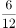，，，，（    ）。分母部分均为12，则所求项分母部分也为12；分子部分为6，5，4，3，是公差为-1的等差数列，则所求项分子部分为2。故所求项为。

故正确答案为B。

---

### 第 2 题　qid 4677894 · 数学运算

（4，12），（8，6），（16，3），（12，x）。x应为（    ）。

- **A**. 2
- **B**. 4　✅
- **C**. 6
- **D**. 8

**答案**：B

**官方解析**

原数列两两一组，考虑组内数字相乘：4×12=48，8×6=48，16×3=48，乘积为固定值48，所以，所求x=4。

故正确答案为B。

---

### 第 3 题　qid 4677908 · 数学运算

，，，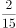，（    ）

- **A**. 

- **B**. 

- **C**. 
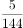
　✅
- **D**. 

**答案**：C

**官方解析**

方法一：数列均为分数，考虑分数数列，分数分子不是递增或递减趋势，考虑反约分。将原数列转化为：，，，，（    ）。分子部分：1，2，3，4，是连续自然数列，则所求项分子为5；每一项分子分母的乘积形成新数列：2，6，24，120，有明显倍数关系，6÷2=3，24÷6=4，120÷24=5，商是公差为1的等差数列，则新数列下一项为120×6=720，则所求项分母为，故所求项为。

方法二：数列均为分数，考虑分数数列，分数分子不是递增或递减趋势，考虑反约分。将原数列转化为：，，，，（    ）。观察发现分子为幂次数列：，，，，则所求项分子为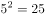；观察发现分母相邻两项有明显倍数关系，为作商数列，后项÷前项得到：3，4，5，则所求项分母为120×6=720，故所求项为。

故正确答案为C。

---

### 第 4 题　qid 4677903 · 数学运算

一条公路沿线顺次有甲、乙、丙、丁、戊5个仓库，相邻仓库间隔100千米。甲仓库有10吨货物，乙仓库有20吨货物，戊仓库有40吨货物，其余两个仓库无货物。现在准备把所有货物集中到一个仓库里，如果每吨货物运输成本是每千米1元运费，那么运费最少是多少元？

- **A**. 9000
- **B**. 10000　✅
- **C**. 11000
- **D**. 12000

**答案**：B

**官方解析**

方法一：
分情况讨论：
全部放到甲仓库：总运费为(20×100+40×400)×1=18000元；
全部放到乙仓库：总费用为(10×100+40×300)×1=13000元；
全部放到丙仓库：总费用为(10×200+20×100+40×200)×1=12000元；
全部放到丁仓库：总费用为(10×300+20×200+40×100)×1=11000元；
全部放到戊仓库：总费用为(10×400+20×300)×1=10000元。
即所有货物集中到戊仓库运费最少，为10000元。
方法二：货物集中问题，最佳方案只与各个仓库的存放量有关，与距离及运费无关。根据甲、乙两个仓库分别有10吨、20吨货物，戊仓库有40吨货物，丙、丁两个仓库无货物。单独看甲、乙两个仓库，同样运输距离下，乙仓库存放量更多，因此应运到乙仓库；合并甲、乙两个仓库之后和戊仓库比较，戊仓库的存放量比甲、乙两个仓库加起来的总和还多，因此应集中到戊仓库。所有货物集中到戊仓库运费为(10×400+20×300)×1=10000元。
故正确答案为B。

---

### 第 5 题　qid 4677907 · 数学运算

从重庆到北京的某列高铁中途要经过11个站，这列高铁要准备多少种不同的车票？

- **A**. 66
- **B**. 78　✅
- **C**. 55
- **D**. 67

**答案**：B

**官方解析**

根据“从重庆到北京的某列高铁中途要经过11个站”，则这列高铁共有13个站。任意两站之间都需要一张单独的车票，且两站之间的发车方向固定，则需要准备的车票数为种。

故正确答案为B。

---

### 第 6 题　qid 34689 · 数学运算

乒乓球比赛的规则是五局三胜制，甲、乙两球员的胜率分别为60%和40%，在一次比赛中，若甲先连胜了前面两局，则甲最后获胜的概率是：

- **A**. 
60%

- **B**. 
在之间

- **C**. 
在之间

- **D**. 
在91%以上
　✅

**答案**：D

**官方解析**

方法一：根据题意“乒乓球比赛的规则是五局三胜制，······若甲先连胜了前面两局，则甲最后获胜的概率”，有以下三种情况：（1）甲第三局胜：60%；（2）乙第三局胜甲第四局胜：；（3）乙第三局、第四局胜甲第五局胜：。因此甲最后获胜的概率为，在91%以上。

方法二：正面情况较多可以从反面考虑，甲获胜的反面是乙获胜，即前面两局甲获胜，后面三局乙获胜，概率为，则甲最后获胜的概率为，在91%以上。

故正确答案为D。 

---

### 第 7 题　qid 4677918 · 数学运算

一批零件，小王单独做需要50天加工完，小李单独做需要75天加工完。为了尽快完成任务，两人合作加工零件，中间小李休息了几天，最后共用了40天把这批零件加工完，那么小李休息了多少天？

- **A**. 25　✅
- **B**. 3
- **C**. 20
- **D**. 15

**答案**：A

**官方解析**

赋值这批零件的工作总量为150，则小王加工零件的效率为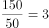，小李加工零件的效率为。设中间小李休息了x天，则小李工作了（40-x）天，根据题意可列方程：3×40+2×（40-x）=150，解得x=25。

故正确答案为A。

---

### 第 8 题　qid 4677917 · 数学运算

甲乙两人分别以不同速度在周长为500米的环形跑道上跑步，甲的速度是180米/分钟。若两人从同一地点同时出发，反向跑步，75秒时第一次相遇；若两人保持各自的速度从同一地点同时出发同向而行，那么乙第一次追上甲时跑的圈数是多少圈？

- **A**. 5
- **B**. 5.5　✅
- **C**. 6
- **D**. 6.5

**答案**：B

**官方解析**

设乙的速度为v米/分钟，两人从同一地点同时出发反向跑步，共同跑完一圈时第一次相遇，则有：，解得v=220。若两人保持各自的速度从同一地点同时出发同向而行，乙要比甲多跑一圈才能第一次追上甲，所用时间为分钟，此时乙跑的路程是220×12.5=2750米，即乙跑的圈数是圈。

故正确答案为B。

---

### 第 9 题　qid 4678570 · 数学运算

某办公室7人中有3人精通德语。如果从中任意选出3人，其中恰有1人精通德语的概率是（    ）。

- **A**. 0.514　✅
- **B**. 0.623
- **C**. 0.544
- **D**. 0.675

**答案**：A

**官方解析**

从办公室7人中任意选出3人，共有种组合方式；而选出的3人中恰有1人精通德语，应从3个精通德语的人中选出1人，从剩下的4人中选出2人，则共有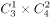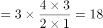种组合方式。故选出的3人中，恰有1人精通德语的概率为：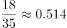。

故正确答案为A。

---

### 第 10 题　qid 4678607 · 数学运算

工厂有一种测量中控工件内径的方法，就是用半径为R的钢珠放在圆柱形内孔上，只要测得钢珠顶端与工件顶端面之间的距离X，就可以求出工件内孔径（如下图所示）。已知X=5cm，R=3cm，那么该工件内径的直径是（    ）。

- **A**. 
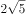cm
　✅
- **B**. 
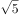cm

- **C**. 
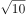cm

- **D**. 
4cm

**答案**：A

**官方解析**

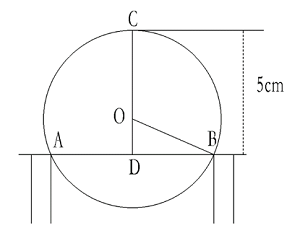

如图所示，连接钢珠与圆柱内径的交点A、B，连接钢珠的圆心O与点B，连接钢珠的最高点C与圆心O，并延长交AB于点D，则三角形ODB为直角三角形。OC、OB为钢珠的半径，OC=OB= 3cm，OD=5-3=2cm。根据勾股定理得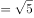cm，则AB的长度为cm，即该工件内径的直径是cm。

故正确答案为A。

---

### 第 11 题　qid 4678614 · 数学运算

某美容美发店有两位理发师，现同时来了5位有不同理发需求的顾客，他们分别需要10分钟、12分钟、15分钟、20分钟和24分钟，那么5人全部理完最少要（    ）。

- **A**. 38分钟
- **B**. 42分钟　✅
- **C**. 46分钟
- **D**. 49分钟

**答案**：B

**官方解析**

若要5人全部理完所用时间最少，则让两位理发师的理发时长尽量接近，则5人全部理完的时间分钟，排除A项。代入B项：当5人全部理完最少要42分钟时，即其中一位理发师（A）的理发时长为42分钟，其顾客的理发时长分别为10分钟、12分钟、20分钟，另外一位理发师（B）的顾客理发时长为15分钟、24分钟，15+24=39分钟&lt;42分钟，符合题意，且为最少时间，当选。

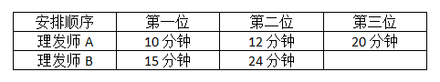

故正确答案为B。

---

### 第 12 题　qid 4678620 · 数学运算

某种细菌在培养过程中，每20分钟分裂一次（一个分裂成2个），经过2小时，这种细菌由3个分裂成（    ）个。

- **A**. 64
- **B**. 96
- **C**. 192　✅
- **D**. 381

**答案**：C

**官方解析**

2小时=60×2分钟=120分钟，则这种细菌共会分裂120÷20=6次，每个细菌分裂次数与分裂后的细菌数量关系如下表所示：

则2小时后3个细菌分裂成个。

故正确答案为C。

---

### 第 13 题　qid 4678637 · 数学运算

某大学生利用课余时间开网店销售某种服装，才开始销售时知名度不高。为了吸引顾客，就按原定售价打对折销售。一段时间后，生意红火起来，他悄悄地加价14.5元出售。一段时间后他发现顾客又少了，于是又降价2.5元以96.4元出售。已知他当初原定售价是在进货价上加40.5元，那么这种服装的进货价是（    ）。

- **A**. 128.65元
- **B**. 64.15元
- **C**. 168.8元
- **D**. 128.3元　✅

**答案**：D

**官方解析**

设这种服装的进货价为x元，原定售价为（x+40.5）元。根据题意可列式：，解得x=128.3，即这种服装的进货价是128.3元。

故正确答案为D。

---

## 判断推理

### 第 1 题　qid 4678594 · 图形推理

根据图形规律，填入问号处最合适的一项是：

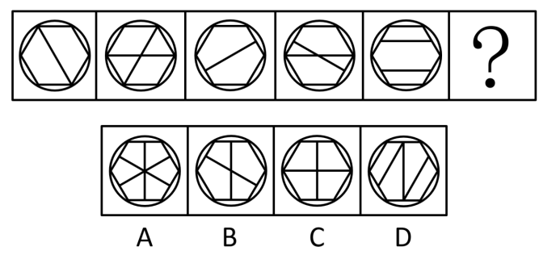

- **A**. A
- **B**. B　✅
- **C**. C
- **D**. D

**答案**：B

**官方解析**

图形元素组成不同，且无明显属性规律，考虑数量规律。观察发现，图形线条交叉明显，考虑交点数。题干图形的交点数分别为6、7、8、9、10、？，因此？处图形的交点数应为11，只有B项符合规律。
故正确答案为B。

---

### 第 2 题　qid 4678606 · 图形推理

根据图形规律，填入问号处最合适的一项是：

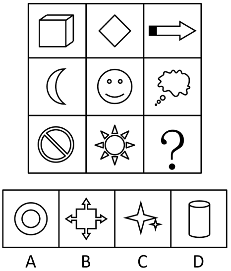

- **A**. A
- **B**. B
- **C**. C
- **D**. D　✅

**答案**：D

**官方解析**

图形元素组成不同，优先考虑属性规律。观察发现，题干出现全直线、全曲线图形，优先考虑曲直性。九宫格优先横行看，第一行图形均由直线组成，第二行图形均由曲线组成，第三行图1和图2均由曲线和直线构成，故？处图形应该由曲线和直线构成，只有D项符合规律。
故正确答案为D。

---

### 第 3 题　qid 4678625 · 图形推理

根据图形规律，填入问号处最合适的一项是：

- **A**. A
- **B**. B
- **C**. C　✅
- **D**. D

**答案**：C

**官方解析**

元素组成不同，九宫格优先横向看，观察发现，第一行汉字的第一笔均为“丶”，第二行汉字的第一笔均为“一”，第三行前两个汉字的第一笔均为“丨”，则问号处应选择第一笔为“丨”的汉字，只有C项符合。
故正确答案为C。

---

### 第 4 题　qid 4678632 · 图形推理

左边给定的是纸盒的外表面，下列哪一项能由它折叠而成？

- **A**. A
- **B**. B
- **C**. C　✅
- **D**. D

**答案**：C

**官方解析**

将原展开图标上序号如下图，逐一进行分析。

A项：选项前面是面e，面e的相对面是面c，相对面不能同时出现，所以选项右面是面d，选项中面e与面d的公共边挨着面e的两个小正方形，而展开图中面e与面d的公共边没有挨着面e的两个小正方形，选项与题干展开图不一致，排除；

B项：选项前面是面f，右面是面e，选项中面f挨着面e的大长方形长边，而展开图中面f没有挨着面e的大长方形长边，选项与题干展开图不一致，排除；

C项：选项由面b、面d与面e构成，选项与题干展开图一致，当选；

D项：选项前面是面b，上面是面a，面a的相对面是面d，相对面不能同时出现，所以选项右面是面c，选项中三个面的公共点（如图所示）引出的1条直线是由面c发出来的，而展开图中，三个面的公共点引出的1条直线是由面b发出来的，选项与题干展开图不一致，排除。

故正确答案为C。

---

### 第 5 题　qid 4678642 · 图形推理

把下面六组图形分成两类，使每一类都有各自的共同特征或规律，分类正确的一项是：

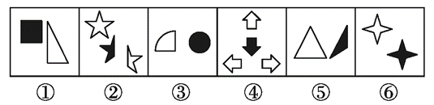

- **A**. ①④⑤，②③⑥
- **B**. ①③⑥，②④⑤　✅
- **C**. ①③⑤，②④⑥
- **D**. ①②③，④⑤⑥

**答案**：B

**官方解析**

本题为分组分类题目。元素组成不同，无明显属性规律，优先考虑数量规律。观察发现，每幅图形均由黑白两部分构成，且图⑥中黑色部分与白色部分面积相等，考虑黑白两部分的面积。图①③⑥中黑色部分与白色部分面积相等，图②④⑤中黑色部分面积为白色部分面积的三分之一。故图①③⑥为一组，图②④⑤为一组。

注：图③当中白色扇形的半径和黑色圆形的直径相等，且扇形圆心角为，假设圆形半径r为1，则扇形半径R为2，可知黑色圆形面积，白色扇形面积，两者面积相等。

故正确答案为B。

---

### 第 6 题　qid 4678648 · 定义判断

重大飞行事故罪，是指航空人员违反规章制度，因而发生重大飞行事故，危及公共安全，造成严重后果的行为。
根据上述定义，下列行为属于重大飞行事故罪的是：

- **A**. 某航空公司飞行员邀请“网红”进入驾驶舱就座。“网红”在驾驶舱拍摄的照片在微博引起热议，当事飞行员被处以终身禁飞
- **B**. 某客机因目的地机场下大雨，不适合降落，被迫在临近机场降落，结果导致乘客延误时间6小时
- **C**. 飞行员违反航空管理的有关规定，在未看见跑道的情况下，违规操纵飞机实施着陆，致使飞机着火坠毁　✅
- **D**. 恐怖分子劫持客机，导致客机坠毁

**答案**：C

**官方解析**

第一步：找出定义关键词。
“航空人员违反规章制度”、“因而发生重大飞行事故，危及公共安全，造成严重后果”。
第二步：逐一分析选项。
A项：飞行员邀请“网红”进入驾驶舱并拍照，违反了规章制度，但是否因此发生了重大飞行事故并未提及，不符合“因而发生重大飞行事故，危及公共安全，造成严重后果”，不符合定义，排除；
B项：客机因天气原因被迫在临近机场降落，航空人员并未违反规章制度，不符合“航空人员违反规章制度”，不符合定义，排除；
C项：飞行员违反航空管理的有关规定违规着陆，符合“航空人员违反规章制度”，致使飞机着火坠毁，符合“因而发生重大飞行事故，危及公共安全，造成严重后果”，符合定义，当选；
D项：恐怖分子劫持客机，导致客机坠毁，造成客机坠毁的原因是恐怖分子的劫持，并未提及航空人员是否违反规章制度，不符合“航空人员违反规章制度”，不符合定义，排除。
故正确答案为C。

---

### 第 7 题　qid 4678651 · 定义判断

罗森塔尔效应亦称“皮格马利翁效应”“人际期望效应”，是一种社会心理效应，指的是教师对学生的殷切希望能戏剧性地收到预期效果的现象。
根据上述定义，下列不属于罗森塔尔效应的是：

- **A**. 某小学一年级学生小明期末考试考了双百分，父母非常高兴，带他去上海迪士尼尽情玩了一周，以资鼓励，希望他再接再厉。果然不负父母所望，第二学期期末考试小明又考了双百分　✅
- **B**. 某小学班主任在选择班干部时，把学习成绩作为重要标准，期望这些班干部能带动班上其他学生的学习积极性。一年以后，这些班干部的成绩继续在班上名列前茅
- **C**. 一名研究者根据某小学的学生名册随机挑选了一些名字组成了一份“最有发展前途者”名单，并以赞许的口吻将其交给了校长和相关老师。一年后，该研究者再次对该小学的学生进行调查，结果显示，名单上的学生成绩都有了较大进步，且都有着很强的求知欲
- **D**. 罗尔斯从小顽皮、逃课、打架、斗殴，无所事事，令人头疼。有一次，当罗尔斯从窗台上跳下时，被校长保罗看见了，校长不但没有责备他，反而对他说：“我一看就知道，你将来是纽约州的州长。”校长的话对他的震动特别大。从此，罗尔斯记下了这句话，并在51岁那年成为纽约州州长

**答案**：A

**官方解析**

第一步：找出定义关键词。
“教师对学生的殷切希望”、“收到预期效果的现象”。
第二步：逐一分析选项。
A项：父母奖励小明并希望他再接再厉，是父母对孩子的殷切希望，不符合关键词“教师对学生的殷切希望”，不符合定义，保留；
B项：班主任期望班干部能带动班上其他学生的学习积极性，符合关键词“教师对学生的殷切希望”，但是一年以后这些班干部的成绩继续名列前茅，不明确是否带动了班上其他学生的学习积极性，不明确项，保留；
C项：研究者给了校长和相关老师一份“最有发展前途者”的学生名单，可能会让相关老师对这些学生产生期望，符合关键词“教师对学生的殷切希望”，最后名单上的学生成绩都有了较大进步，符合关键词“收到预期效果的现象”，符合定义，排除；
D项：校长跟罗尔斯说他将来是纽约州的州长，符合关键词“教师对学生的殷切希望”，罗尔斯在51岁那年确实成为了纽约州的州长，符合关键词“收到预期效果的现象”，符合定义，排除。
对比A、B两项，A项主体不符合，B项只是不明确，对比择优，选择A项。
本题为选非题，故正确答案为A。

---

### 第 8 题　qid 4678653 · 定义判断

湿垃圾，是指日常生活垃圾中在自然条件下容易分解的有机物质部分，其主要来源为家庭厨房、餐厅、饭店、食堂、市场及食品加工企业等。
根据上述定义，以下属于湿垃圾的是：

- **A**. 蛤蜊壳
- **B**. 塑料袋
- **C**. 瓜子壳　✅
- **D**. 口香糖

**答案**：C

**官方解析**

第一步：找出定义关键词。
“在自然条件下容易分解”、“有机物质部分”。
第二步：逐一分析选项。
A项：蛤蜊壳的主要成分是碳酸钙，碳酸钙是无机物，且在自然条件下不容易分解，不符合“在自然条件下容易分解”、“有机物质部分”，不符合定义，排除；
B项：日常生活中常见的塑料袋主要成分为聚丙烯、聚酯、尼龙等有机物质，符合“有机物质部分”，但常见的塑料袋在自然条件下不易降解，不符合“在自然条件下容易分解”，不符合定义，排除；
C项：瓜子壳的主要成分是纤维素、木质素、半木质素及少量的糖类、矿物质等，以有机物为主，符合“有机物质部分”，而且生活中将瓜子壳放置一段时间后易发生霉变，属于易腐垃圾，在自然条件下较容易降解，符合“在自然条件下容易分解”，符合定义，当选；
D项：口香糖的主要成分是胶基，由石油衍生聚合物、天然乳胶、树脂和蜡等大分子有机物混合而成，符合“有机物质部分”，但口香糖进入自然环境后难以降解和清除，不符合“在自然条件下容易分解”，不符合定义，排除。
故正确答案为C。

---

### 第 9 题　qid 4678655 · 定义判断

反事实推理又称反事实思维，是指对过去已经发生的事实进行否定而重新表征，以建构一种可能性假设的思维活动。反事实推理在头脑中是以条件命题的形式表现出来的，包括前提和结果两个部分，其典型形式为：如果当时······，就会（不会）······。
根据上述定义，以下诗句明确表达了反事实推理的是：

- **A**. 若非群玉山头见，会向瑶台月下逢
- **B**. 东风不与周郎便，铜雀春深锁二乔　✅
- **C**. 从今若许闲乘月，拄杖无时夜叩门
- **D**. 忽见陌头杨柳色，悔教夫婿觅封侯

**答案**：B

**官方解析**

第一步：找出定义关键词。
“对过去已经发生的事实进行否定而重新表征”、“以建构一种可能性假设的思维活动”。
第二步：逐一分析选项。
A项：出自唐代李白的《清平调·其一》，意思是如此天姿国色，不是群玉山头所见的飘飘仙子，就是瑶台殿前月光照耀下的神女，“不是······就是······”表示的是选择关系而非可能性假设，也没有对过去已经发生的事实进行否定，不符合“对过去已经发生的事实进行否定而重新表征”、“以建构一种可能性假设的思维活动”，不符合定义，排除；
B项：出自唐代杜牧的《赤壁》，意思是倘若当年东风不帮助周瑜的话，那么铜雀台就会深深地锁住东吴二乔了，此处作者提出了一个与历史事实相反的假设，符合“对过去已经发生的事实进行否定而重新表征”、“以建构一种可能性假设的思维活动”，符合定义，当选；
C项：出自宋代陆游的《游山西村》，意思是今后如果还能乘大好月色出外闲游，我随时会拄着拐杖来敲你的家门，没有对过去已经发生的事实进行否定，不符合“对过去已经发生的事实进行否定而重新表征”，不符合定义，排除；
D项：出自唐代王昌龄的《闺怨》，意思是忽然见到路边杨柳新绿，心中一阵忧愁，悔不该叫夫君去从军建功封爵，没有对过去已经发生的事实进行否定，不符合“对过去已经发生的事实进行否定而重新表征”、“以建构一种可能性假设的思维活动”，不符合定义，排除。
故正确答案为B。

---

### 第 10 题　qid 4678657 · 定义判断

智能投顾是指利用大数据分析、量化模型和算法，根据投资者的个人收益和风险偏好提供匹配的资产组合建议，并自动完成投资交易过程，再根据市场变化情况动态调整，让组合始终处于最优状态的财富管理服务。
根据上述定义，下列属于智能投顾的是：

- **A**. 甲把上个月的工资8000元借给朋友解燃眉之急
- **B**. 乙为低风险偏好者，购买了银行App为其推荐的保本型理财产品　✅
- **C**. 丙因为预算有限，从银行贷款购买了一辆价值12万的小轿车
- **D**. 丁利用信用卡分期付款买了一部苹果手机

**答案**：B

**官方解析**

第一步：找出定义关键词。
“利用大数据分析、量化模型和算法”、“根据投资者的个人收益和风险偏好提供匹配的资产组合建议，并自动完成投资交易过程”。
第二步：逐一分析选项。
A项：甲把工资借给朋友，甲并没有进行投资，不符合“利用大数据分析、量化模型和算法”、“根据投资者的个人收益和风险偏好提供匹配的资产组合建议，并自动完成投资交易过程”，不符合定义，排除； 
B项：银行APP为低风险偏好者推荐了保本型理财产品，符合“利用大数据分析、量化模型和算法”、“根据投资者的个人收益和风险偏好提供匹配的资产组合建议，并自动完成投资交易过程”，符合定义，当选；
C项：丙从银行贷款购买小轿车，丙并没有进行投资，不符合“利用大数据分析、量化模型和算法”、“根据投资者的个人收益和风险偏好提供匹配的资产组合建议，并自动完成投资交易过程”，不符合定义，排除；
D项：丁利用信用卡分期付款购买手机，丁并没有进行投资，不符合“利用大数据分析、量化模型和算法”、“根据投资者的个人收益和风险偏好提供匹配的资产组合建议，并自动完成投资交易过程”，不符合定义，排除。
故正确答案为B。

---

### 第 11 题　qid 4678689 · 逻辑判断

“只有努力才能成功，只有成功才能得到他人的尊重。”
如果上述断定为真，那么以下哪项一定为真？

- **A**. 如果不成功，那么一定没有努力
- **B**. 如果得到他人尊重了，那么一定努力了　✅
- **C**. 如果没有得到他人的尊重，那么一定没有成功
- **D**. 如果成功了，一定会得到他人尊重

**答案**：B

**官方解析**

第一步：翻译题干。

①成功努力；

②得到他人尊重成功；

将①和②串联可以递推出：③得到他人尊重成功努力。

第二步：逐一分析选项。

A项：翻译为：成功努力，是对①的否前，否前无必然结论，无法推出，排除；

B项：翻译为：得到他人尊重努力，是对③的肯前，肯前必肯后，可以推出，当选；

C项：翻译为：得到他人尊重成功，是对②的否前，否前无必然结论，无法推出，排除；

D项：翻译为：成功得到他人尊重，是对②的肯后，肯后无必然结论，无法推出，排除。

故正确答案为B。

---

### 第 12 题　qid 4678694 · 逻辑判断

到安徽旅游过的一名游客说过：“不到黄山，不算游过安徽；不去西递宏村，白来黄山。”
根据这句话，以下最能推出的结果是：

- **A**. 游黄山，只要去西递宏村就行了
- **B**. 西递宏村集中了安徽最精华的自然景观
- **C**. 游黄山，最令人难忘的是西递宏村　✅
- **D**. 游安徽，应该先去西递宏村

**答案**：C

**官方解析**

第一步：翻译题干。

①游过安徽到黄山；

②来黄山去西递宏村；

将①和②串联可以递推出③：游过安徽到黄山去西递宏村。

第二步：逐一分析选项。

A项：翻译为“去西递宏村游黄山”，是对②的肯后，肯后无必然结论，无法推出，排除；

B项：题干没有提及“最精华的自然景观”，无法从题干信息中推出，排除；

C项：选项说的是“游黄山，最令人难忘的是西递宏村”，这句话表达的意思是只有去了西递宏村，才会发现黄山最难忘的景色是什么，所以可以推出“游黄山去西递宏村”，是对②的肯前，肯前推肯后，可以推出，当选；

D项：题干没有提及先后顺序，游安徽只要去了西递宏村就行，故“应该先去西递宏村” 无法从题干信息中推出，排除。

故正确答案为C。

---

### 第 13 题　qid 4678703 · 类比推理

某次数学考试之后，班长跑去向老师打听成绩，老师给了他如下三个结果，并且告诉他，在这三个结果中只有一个是真的。
（1）有的同学考试成绩不及格；
（2）有的同学考试成绩及格了；
（3）数学课代表考试成绩不及格。
以下哪个选项一定为真？

- **A**. 只有数学课代表的考试成绩及格了
- **B**. 数学课代表的考试成绩不及格
- **C**. 班上所有同学的考试成绩都及格了　✅
- **D**. 班上所有同学的考试成绩都不及格

**答案**：C

**官方解析**

第一步：找关系。
（1）有的同学考试成绩不及格；
（2）有的同学考试成绩及格了；
（3）数学课代表考试成绩不及格。
根据条件（1）“有的同学考试成绩不及格”和条件（2）“有的同学考试成绩及格了”分别为“有的不是”、“有的是”的形式，二者中必有一真；再根据“三个结果中只有一个是真的”可知，条件（3）为假。
第二步：看其余。
根据条件（3）为假可知，数学课代表考试成绩及格了，可以推出条件（2）一定为真，那么条件（1）必然为假，则其矛盾命题为真，即所有同学的考试成绩都及格了，对应C项。
故正确答案为C。

---

### 第 14 题　qid 2003164 · 逻辑判断

如果选购了股票，则不能投资期货；只有投资期货，才能投资邮票；或者投资邮票，或者投资外汇；但是最近投资外汇风险太大，不能操作。
据此，可以推出：

- **A**. 选购股票
- **B**. 不选购股票　✅
- **C**. 不投资邮票
- **D**. 不投资期货

**答案**：B

**官方解析**

第一步：翻译题干。

①选购股票-投资期货；

②投资邮票投资期货；

③投资邮票 或 投资外汇；

④-投资外汇。

第二步：根据题干条件进行推理。

从确定信息条件④入手，-投资外汇是对条件③或关系的其中一项进行否定，根据“或关系否一推一”，可以推出投资邮票；投资邮票是对条件②的肯前，肯前必肯后，可以推出投资期货；投资期货是对条件①的否后，否后必否前，可以推出不选购股票，对应B项。

故正确答案为B。

---

### 第 15 题　qid 4678707 · 逻辑判断

基因编辑是指对基因组进行定点修饰的一项新技术，利用该技术，可以精确定位到基因组的某一位点上，在这个位点上剪断靶标DNA片段并插入新的基因片段，此过程既模拟了基因的自然突变，又修改并编辑了原有的基因组。该技术在过去几十年里得到了快速发展。然而，一些学者认为，应尽快采取各种禁止性或限制性措施，以防止对人类造成不可逆的危害。
以下哪项将严重削弱上述学者的观点？

- **A**. 近年来，基因编辑技术在植物、动物、微生物等领域的研究与应用突飞猛进
- **B**. 在人体上进行的基因编辑试验更多是针对体细胞而非生殖细胞，既能实现对疾病的治疗，还避免了被修改的基因遗传的问题　✅
- **C**. 基因编辑技术是一项新技术，存在构建复杂、价格昂贵，以及较大概率的脱靶效应等问题
- **D**. 科学狂人的冲动，有可能让中立的基因编辑技术越界，从而带来无法挽回的风险隐患和伦理悲剧

**答案**：B

**官方解析**

第一步：找出论点和论据。
论点：针对基因编辑技术，应尽快采取各种禁止性或限制性措施，以防止对人类造成不可逆的危害。
论据：无。
本题只有论点没有论据，优先考虑削弱论点，即基因编辑技术不会对人类造成不可逆的危害，或不需要尽快禁止或限制基因编辑技术。
第二步：逐一分析选项。
A项：该项讨论的是基因编辑技术在植物、动物、微生物等领域的研究与应用突飞猛进，而论点讨论的基因编辑技术对人类的影响，讨论的话题不一致，无法削弱，排除；
B项：该项指出人体的基因编辑更多是针对体细胞，以实现疾病的治疗，说明人体的基因编辑具有积极意义，还指出人体的基因编辑并非针对生殖细胞，这避免了被修改的基因遗传的问题，说明人体的基因编辑不会对人类造成不可逆的危害，即不需要禁止和限制基因编辑技术，削弱论点，当选；
C项：该项讨论的是基因编辑技术构建复杂、价格昂贵，较大概率的脱靶效应等问题，并未指出基因编辑技术是否会对人类造成不可逆的危害，以及是否需要尽快禁止或限制基因编辑技术，为无关项，无法削弱，排除；
D项：该项指出科学狂人的冲动可能使基因编辑技术带来无法挽回的风险隐患和伦理悲剧，补充说明了基因编辑技术可能带来的消极影响，即需要禁止或限制基因编辑技术，为加强项，无法削弱，排除。
故正确答案为B。

---

### 第 16 题　qid 4678671 · 逻辑判断

陈燕、李婷和赵伟被同一所大学的英语、经济和法律三个专业录取，对于她们的录取情况，同学们有以下猜测：
甲：陈燕是经济专业的，赵伟是法律专业的；
乙：陈燕是法律专业的，李婷是经济专业的；
丙：陈燕是英语专业的，赵伟是经济专业的；
结果出来后，每位同学都只对了一半。
那么，下列结论正确的是：

- **A**. 陈燕、李婷和赵伟分别是英语、经济和法律专业的　✅
- **B**. 陈燕、李婷和赵伟分别是经济、法律和英语专业的
- **C**. 陈燕、李婷和赵伟分别是英语、法律和经济专业的
- **D**. 陈燕、李婷和赵伟分别是法律、英语和经济专业的

**答案**：A

**官方解析**

题干信息不确定，优先考虑代入法。
A项：代入到题干中，每个人的猜测都对了一半，符合题干要求，当选；
B项：代入到题干中，乙的猜测都是错的，不符合题干要求，排除；
C项：代入到题干中，甲的猜测都是错的，不符合题干要求，排除；
D项：代入到题干中，甲的猜测都是错的，不符合题干要求，排除。
故正确答案为A。

---

### 第 17 题　qid 4678672 · 逻辑判断

王军说：“只有正式代表才可以发言。”刘念说：“不对吧！梁正也是正式代表但他并未发言。”
刘念的回答把王军的话错误地理解为以下哪项？

- **A**. 所有发言的人都是正式代表
- **B**. 所有正式代表都发言了　✅
- **C**. 没有正式代表发言
- **D**. 梁正不是正式代表

**答案**：B

**官方解析**

第一步：翻译题干。

王军的话翻译为：发言正式代表；

刘念的话翻译为：正式代表 且 发言。

题干的问法为刘念的回答把王军的话错误的理解为什么，刘念认为王军的话说错了，故拿梁正举例子反驳王军，所以刘念认为梁正的例子为王军的话的矛盾命题，故找到刘念例子的矛盾命题即为刘念的错误理解。

第二步：逐一分析选项。

A项：翻译为发言正式代表，与刘念的话并非矛盾关系，无法推出，排除；

B项：翻译为正式代表发言，与刘念的话为矛盾关系，即为刘念对王军的话的错误理解，可以推出，当选；

C项：翻译为正式代表发言，与刘念的话并非矛盾关系，无法推出，排除；

D项：翻译为梁正是正式代表，与刘念的话并非矛盾关系，无法推出，排除。

故正确答案为B。

---

### 第 18 题　qid 4678706 · 逻辑判断

甲大学的所有女生都爱吃油炸食品。所有爱吃油炸食品的人都不会嫌弃自己不健康。而只有甲大学的女生才会注意别人的评价。
假设上述论断都是真的，以下哪项也一定是真的？
Ⅰ.所有不嫌弃自己不健康的人都注重别人的评价
Ⅱ.所有注重别人评价的人都爱吃油炸食品
Ⅲ.嫌弃自己不健康的人中没有一个注重别人的评价

- **A**. 仅Ⅰ
- **B**. 仅Ⅱ
- **C**. 仅Ⅰ和Ⅱ
- **D**. 仅Ⅱ和Ⅲ　✅

**答案**：D

**官方解析**

第一步：翻译题干。

①甲大学的女生爱吃油炸食品；

②爱吃油炸食品不会嫌弃自己不健康；

③注意别人的评价甲大学的女生。

以上条件可以递推出：④注意别人的评价甲大学的女生爱吃油炸食品不会嫌弃自己不健康。

第二步：逐一判断选项。

Ⅰ：不嫌弃自己不健康注重别人的评价，是对④的肯后，肯后无法得出确定结论，无法推出，排除；

Ⅱ：注重别人的评价爱吃油炸食品，是对④的肯前，肯前必肯后，可以推出，当选；

Ⅲ：不会嫌弃自己不健康注重别人的评价，是对④的否后，否后必否前，可以推出，当选。

因此仅Ⅱ和Ⅲ可以推出，只有D项符合。

故正确答案为D。

---

### 第 19 题　qid 4678710 · 逻辑判断

小张需要一定数量的特定液体。目前，小张有一个容积为11品脱、装满了该液体且刻度模糊的容器，不满足他的需求，于是他向好友小刚寻求帮助，小刚拿出了两个刻度模糊、容积分别为5品脱和6品脱的容器，说小张将这两个容器都利用到就可以得到想要的液体数量。
由此可以推出，小张需要的液体数量可能是：

- **A**. 5品脱、7品脱、8品脱、10品脱
- **B**. 6品脱、7品脱、8品脱、9品脱
- **C**. 7品脱、8品脱、9品脱、10品脱　✅
- **D**. 8品脱、9品脱、10品脱、11品脱

**答案**：C

**官方解析**

第一步：分析题干条件。

（1）有一个11品脱刻度模糊的容器，且此容器装满了特定溶液；

（2）有两个刻度模糊的容器分别为5品脱和6品脱；

（3）5品脱和6品脱容器都要利用到。

第二步：根据题干条件进行推理。

根据条件（3）可知，5品脱和6品脱的容器都要利用到，不能只使用其中一个，故小张需要的液体数量肯定不能是单独的5品脱、6品脱或11品脱，排除A、B、D三项；而C项中的液体数量都可以利用这三个容器得到，如下表所示：

故正确答案为C。

---

### 第 20 题　qid 4678712 · 逻辑判断

一粒骰子的六面分别是1、2、3、4、5、6点。如果满足：①1的对面是5；②4和6相邻；③2和4相邻这三个条件。
那么下面结论错误的是：

- **A**. 1与4相邻
- **B**. 4的对面是3
- **C**. 2与6相邻　✅
- **D**. 5与3相邻

**答案**：C

**官方解析**

第一步：分析题干条件。

①1的对面是5；

②4和6相邻；

③2和4相邻。

第二步：根据题干条件进行推理。

根据题干信息构建出该骰子的一种情况，如下图所示：

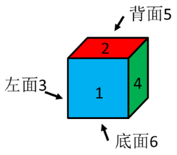

由上图可知，1与4相邻，4的对面是3，2的对面是6，5与3相邻，只有C项错误。

本题为选非题，故正确答案为C。

---

### 第 21 题　qid 4678644 · 类比推理

纸张：钢笔

- **A**. 司机：汽车
- **B**. 牙齿：牙刷　✅
- **C**. 河流：水
- **D**. 森林：树木

**答案**：B

**官方解析**

第一步：判断题干词语间逻辑关系。
用钢笔在纸张上写字，二者为工具和作用对象的对应关系。
第二步：判断选项词语间逻辑关系。
A项：司机驾驶汽车，二者为职业和工具的对应关系，与题干逻辑关系不一致，排除；
B项：用牙刷清理牙齿，二者为工具和作用对象的对应关系，与题干逻辑关系一致，当选；
C项：河流是水资源的一种，二者为包容关系中的种属关系，与题干逻辑关系不一致，排除；
D项：树木是森林的组成部分，二者为包容关系中的组成关系，与题干逻辑关系不一致，排除。
故正确答案为B。

---

### 第 22 题　qid 4678650 · 类比推理

信息：语言

- **A**. 感觉：快乐　✅
- **B**. 教学：教育
- **C**. 状态：水
- **D**. 股东：股份

**答案**：A

**官方解析**

第一步：判断题干词语间逻辑关系。
语言是信息的一种，二者为包容关系中的种属关系。
第二步：判断选项词语间逻辑关系。
A项：快乐是感觉的一种，二者为包容关系中的种属关系，与题干逻辑关系一致，当选；
B项：教学是教育活动的一种，与教育不是种属关系，与题干逻辑关系不一致，排除；
C项：水具有多种状态，如固态、液态、气态，二者为对应关系，与题干逻辑关系不一致，排除；
D项：股东持有股份，二者为主宾关系，与题干逻辑关系不一致，排除。
故正确答案为A。

---

### 第 23 题　qid 4678664 · 类比推理

中国：亚洲

- **A**. 迪拜：亚洲
- **B**. 伊拉克：非洲
- **C**. 墨西哥：南美洲
- **D**. 新西兰：大洋洲　✅

**答案**：D

**官方解析**

第一步：判断题干词语间逻辑关系。
中国是位于亚洲的国家，二者为地点的对应关系。
第二步：判断选项词语间逻辑关系。
A项：迪拜是位于亚洲的城市，而不是国家，与题干逻辑关系不一致，排除；
B项：伊拉克是位于亚洲的国家，而不是非洲，与题干逻辑关系不一致，排除；
C项：墨西哥是位于北美洲的国家，而不是南美洲，与题干逻辑关系不一致，排除；
D项：新西兰是位于大洋洲的国家，二者为地点的对应关系，与题干逻辑关系一致，当选。
故正确答案为D。

---

### 第 24 题　qid 4678677 · 类比推理

压轴：最后一个

- **A**. 七月流火：天气转凉
- **B**. 空穴来风：必有根据
- **C**. 美轮美奂：景色美丽　✅
- **D**. 目无全牛：得心应手

**答案**：C

**官方解析**

第一步：判断题干词语间逻辑关系。
压轴指倒数第二个节目，不是指最后一个。
第二步：判断选项词语间逻辑关系。
A项：七月流火意思是在农历七月天气转凉的时节，天刚擦黑的时候，可以看见大火星从西方落下去，说的就是天气转凉的时候，与题干逻辑关系不一致，排除；
B项：空穴来风比喻消息和传说不是完全没有根据，现多用来指消息和传说毫无根据，两种用法均可，与题干逻辑关系不一致，排除；
C项：美轮美奂形容房屋等建筑高大众多，富丽堂皇，而不是形容景色美丽，与题干逻辑关系一致，当选；
D项：目无全牛形容技艺达到极纯熟的境界，得心应手形容技术纯熟，能运用自如，二者为近义关系，与题干逻辑关系不一致，排除。
故正确答案为C。

---

### 第 25 题　qid 4678692 · 类比推理

往：来：往来

- **A**. 牙：齿：牙齿
- **B**. 去：留：去留　✅
- **C**. 拼：搏：拼搏
- **D**. 耻：辱：耻辱

**答案**：B

**官方解析**

第一步：判断题干词语间逻辑关系。
往和来是反义关系，且二者构成了词语“往来”。
第二步：判断选项词语间逻辑关系。
A项：牙和齿都可以指牙齿，二者不是反义关系，与题干逻辑关系不一致，排除；
B项：去和留是反义关系，且二者构成了词语“去留”，与题干逻辑关系一致，当选；
C项：拼和搏都有奋斗的意思，二者是近义关系，与题干逻辑关系不一致，排除；
D项：耻和辱都有羞耻、羞愧的意思，二者是近义关系，与题干逻辑关系不一致，排除。
故正确答案为B。

---

### 第 26 题　qid 4678681 · 类比推理

黄色：橙色：红色

- **A**. 儿童：成人：老人
- **B**. 小学：大学：中学
- **C**. 晴天：阴天：雨天　✅
- **D**. 语文：数学：英语

**答案**：C

**官方解析**

第一步：判断题干词语间逻辑关系。
黄色、橙色、红色是3种不同的颜色，三者为并列关系，且颜色不断加深。
第二步：判断选项词语间逻辑关系。
A项：成人指成年的人，老人属于成人，二者为种属关系，与题干逻辑关系不一致，排除；
B项：小学、大学、中学是3种不同的学校，三者为并列关系，但小学、中学、大学才是学历的不断加深，选项顺序不对，与题干逻辑关系不一致，排除；
C项：晴天、阴天、雨天是3种不同的天气，三者为并列关系，且天气糟糕程度不断加深，与题干逻辑关系一致，当选；
D项：语文、数学、英语是3种不同的学科，三者为并列关系，但不存在程度的不断加深，与题干逻辑关系不一致，排除。
故正确答案为C。

---

### 第 27 题　qid 4678684 · 类比推理

阅览：阅读：审阅

- **A**. 要求：命令：建议
- **B**. 道理：理论：理据
- **C**. 尊重：尊敬：尊崇　✅
- **D**. 局长：市长：领导

**答案**：C

**官方解析**

第一步：判断题干词语间逻辑关系。
阅览指观看、观赏，阅读指阅览诵读，审阅指审查核阅，三者是近义关系，且程度逐渐加深。
第二步：判断选项词语间逻辑关系。
A项：要求指提出的具体愿望或条件，希望做到或实现，命令指发出号令，使人遵行，建议指向人提出的主张，三者是近义关系，但“建议”的程度比“要求”轻，与题干逻辑关系不一致，排除；
B项：道理指事物的规律；理由、情理，理论指由实践概括出来的有系统的结论，理据指理由、根据，第二个词与第一、三词不是近义关系，与题干逻辑关系不一致，排除；
C项：尊重指重视，尊敬指敬重，尊崇指尊敬推崇，三者是近义关系，且程度逐渐加深，与题干逻辑关系一致，当选；
D项：局长与市长都是领导的一种，前两词与第三词构成种属关系，与题干逻辑关系不一致，排除。
故正确答案为C。

---

### 第 28 题　qid 4678688 · 类比推理

曹雪芹：红楼梦：贾宝玉

- **A**. 罗贯中：三国演义：关二爷　✅
- **B**. 施耐庵：西游记：沙和尚
- **C**. 吴承恩：水浒传：林冲
- **D**. 许仲琳：封神演义：申公豹

**答案**：A

**官方解析**

第一步：判断题干词语间逻辑关系。
曹雪芹是红楼梦的作者，贾宝玉是红楼梦中的人物，三者是作者、作品和人物的对应关系，且红楼梦是四大名著之一。
第二步：判断选项词语间逻辑关系。
A项：罗贯中是三国演义的作者，关二爷是三国演义中的人物，三者是作者、作品和人物的对应关系，且三国演义是四大名著之一，与题干逻辑关系一致，当选；
B项：西游记的作者是吴承恩，而不是施耐庵，前两词不是作者与作品的对应关系，与题干逻辑关系不一致，排除；
C项：水浒传的作者是施耐庵，而不是吴承恩，前两词不是作者与作品的对应关系，与题干逻辑关系不一致，排除；
D项：封神演义的作者是许仲琳存在争议，申公豹是封神演义中的人物，但封神演义不是四大名著之一，与题干逻辑关系不一致，排除。
故正确答案为A。

---

### 第 29 题　qid 4678693 · 类比推理

感冒∶病毒∶传染

- **A**. 花朵∶蜜蜂∶传粉
- **B**. 癌症∶绝症∶化疗
- **C**. 血友病∶基因∶遗传　✅
- **D**. 伤口∶感染∶愈合

**答案**：C

**官方解析**

第一步：判断题干词语间逻辑关系。
感染病毒可能会引起感冒，二者为因果关系，感冒具有传染性，二者为对应关系。
第二步：判断选项词语间逻辑关系。
A项：花朵并非蜜蜂引起，二者不是因果关系，花朵也不具有传粉性，与题干逻辑关系不一致，排除；
B项：癌症并非绝症引起，二者不是因果关系，癌症也不具有化疗性，与题干逻辑关系不一致，排除；
C项：基因突变可能会引起血友病，二者为因果关系，血友病具有遗传性，二者为对应关系，与题干逻辑关系一致，当选；
D项：伤口可能引发感染，二者为因果关系，但和题干顺序相反，与题干逻辑关系不一致，排除。
故正确答案为C。

---

### 第 30 题　qid 4678704 · 类比推理

（    ） 对于 “一国两制” 相当于 马克思 对于 （    ）

- **A**. 邓小平；唯物主义
- **B**. 毛泽东；剩余价值理论
- **C**. 邓小平；剩余价值理论　✅
- **D**. 毛泽东；唯物史观

**答案**：C

**官方解析**

逐一代入选项。
A项：“邓小平”是“一国两制”的提出者，“唯物主义”与“马克思”无明显逻辑关系，前后逻辑关系不一致，排除；
B项：“毛泽东”与“一国两制”无明显逻辑关系，“马克思”是“剩余价值理论”的提出者，前后逻辑关系不一致，排除；
C项：“邓小平”是“一国两制”的提出者，“马克思”是“剩余价值理论”的提出者，前后逻辑关系一致，当选；
D项：“毛泽东”与“一国两制”无明显逻辑关系，“马克思”是“唯物史观”的提出者，前后逻辑关系不一致，排除。
故正确答案为C。

---

## 资料分析

### 材料 1

        据国家统计局测算，妇女就业规模继续扩大。2016年全国女性就业人员占全社会就业人员的比重为43.1%，超过《中国妇女发展纲要（2011-2020年）》规定的40%的目标。

        女职工的合法权益得到进一步维护，为减少和解决女职工在工作中因生理特点造成的特殊困难发挥了积极作用。2016年，执行《女职工劳动保护特别规定》的企业比重明显提高，达73%，比2010年提高18个百分点。

        农村贫困妇女人数大幅度减少，基本实现应保尽保。按照年人均收入2300元的农村贫困标准计算，2016年全国农村贫困人口为4335万人，比2010年减少1.2亿人，其中约一半为女性。2016年农村贫困妇女享受“低保”及农村特困人员人数占全国农村女性贫困人口的比重为38%，比2010年提高4.1个百分点。

        女性生育保障水平有明显提高。《女职工劳动保护特别规定》发布以来，女职工在产假、怀孕流产等各个特殊时期的保护有了明确的规定，女性参加生育保险的人数迅速增加。2016年，女性参加生育保险的人数达8020万人，比2010年增长49%。

        享有基本社会保障的女性人数增加。2016年，全国参加基本养老保险人数8.9亿人，其中女性3.5亿人；参加城镇职工基本养老保险人数3.8亿人，其中女性1.8亿人，占比为46.6%；2016年，参加城乡居民基本养老保险人数5.1亿人，其中女性超过1.7亿人。女性参加失业保险和工伤保险的人数增加，2016年，全国参加失业保险的人数超过1.8亿人，其中女性7551万人，分别比2010年增加4713万人和2402万人，增长35%和47%；参加工伤保险人数2.2亿人，其中女性8129万人，分别增长35%和43%。

#### 第 1 题　qid 4678658 · 比重

2016年全国女性就业人员占比超《中国妇女发展纲要（2011-2020年）》多少个百分点？

- **A**. 4.1
- **B**. 3.1　✅
- **C**. 18
- **D**. 2.1

**答案**：B

**官方解析**

定位材料第一段：2016年全国女性就业人员占全社会就业人员的比重为43.1%，超过《中国妇女发展纲要（2011-2020年）》规定的40%的目标。则2016年全国女性就业人员占比-《中国妇女发展纲要（2011-2020年）》规定占比=43.1%-40%=3.1%，即3.1个百分点。
故正确答案为B。

---

#### 第 2 题　qid 4678665 · 综合

2010年全国农村贫困妇女人数约为多少万人？

- **A**. 4335
- **B**. 7356
- **C**. 2494
- **D**. 8168　✅

**答案**：D

**官方解析**

根据题干“2010年全国农村贫困妇女人数约为多少万人”，结合材料时间为2016年，且材料中给出2010年全国农村贫困人口中贫困妇女占比，可判定本题为基期比重问题。定位文字材料第三段可知：2016年全国农村贫困人口为4335万人，比2010年减少1.2亿人，其中约一半为女性，则2010年全国农村贫困人口=4335+12000=16335万人。根据公式：部分=整体×比重，则2010年全国农村贫困妇女人数万人，与D项最接近。

故正确答案为D。

备注：材料第三段中“其中约一半为女性”可有两种理解：①2016年全国农村贫困人口中女性占比约为一半；②2010年全国农村贫困人口中女性占比约为一半；本题只能按照第二种理解，否则无法计算。

---

#### 第 3 题　qid 4678668 · 综合

2010年农村贫困妇女享受“低保”及农村特困人员人数约为多少万人？

- **A**. 6564
- **B**. 8020
- **C**. 2494
- **D**. 2769　✅

**答案**：D

**官方解析**

根据题干“2010年农村贫困妇女享受‘低保’及农村特困人员人数约为多少万人”，结合材料时间为2016年，且材料中给出相应比重，可判定本题为基期比重问题。定位文字材料第三段可知：2016年农村贫困妇女享受“低保&quot;及农村特困人员人数占全国农村女性贫困人口的比重为38%，比2010年提高4.1个百分点。则2010年农村贫困妇女享受“低保&quot;及农村特困人员人数占全国农村女性贫困人口的比重=38%-4.1%=33.9%，结合本篇资料第2题可知：2010年全国农村贫困妇女人数约为8168万人，故所求万人，与D项最接近。

故正确答案为D。

---

#### 第 4 题　qid 4678669 · 综合

2016年参加城镇职工基本养老保险的男性约占全国参加基本养老保险人数的：

- **A**. 46.6%
- **B**. 38.3%
- **C**. 22.5%　✅
- **D**. 35%

**答案**：C

**官方解析**

根据题干“2016年······占······”，结合材料时间为2016年，可判定本题为现期比重问题。定位文字材料最后一段可知：2016年，全国参加基本养老保险人数8.9亿人，其中女性3.5亿人；参加城镇职工基本养老保险人数3.8亿人，其中女性1.8亿人。则参加城镇职工基本养老保险的男性人数=3.8-1.8=2亿人，根据公式：比重，则2016年参加城镇职工基本养老保险的男性约占全国参加基本养老保险人数的比重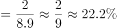，与C项最接近。

故正确答案为C。

---

#### 第 5 题　qid 4678673 · 比重

按2016年参加四种保险的女性占比从大到小排列，正确的顺序为：

- **A**. 城镇职工基本养老保险，城乡居民基本养老保险，失业保险，工伤保险
- **B**. 城镇职工基本养老保险，失业保险，城乡居民基本养老保险，工伤保险
- **C**. 城镇职工基本养老保险，失业保险，工伤保险，城乡居民基本养老保险　✅
- **D**. 失业保险，城镇职工基本养老保险，工伤保险，城乡居民基本养老保险

**答案**：C

**官方解析**

定位材料最后一段可知：2016年，参加城镇职工基本养老保险人数3.8亿人，其中女性1.8亿人，占比为46.6%；参加城乡居民基本养老保险人数5.1亿人，其中女性超过1.7亿人；全国参加失业保险的人数超过1.8亿人，其中女性7551万人；参加工伤保险人数2.2亿人，其中女性8129万人。则2016年，参加四种保险的女性占比分别为：

城镇职工基本养老保险：46.6%；

城乡居民基本养老保险：；

失业保险：；

工伤保险：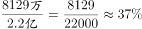。

则从大到小为：城镇职工基本养老保险&gt;失业保险&gt;工伤保险&gt;城乡居民基本养老保险，对应C项。

故正确答案为C。

---

### 材料 2

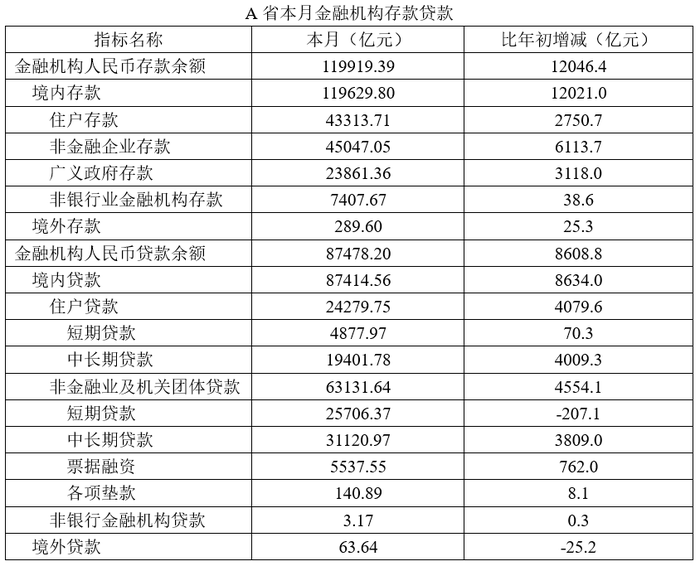

#### 第 6 题　qid 4678699 · 比重

该省年初金融机构人民币贷款余额占存款余额的比重约为：

- **A**. 73.1%　✅
- **B**. 80.5%
- **C**. 90.3%
- **D**. 95.1%

**答案**：A

**官方解析**

根据题干“年初······占······比重约为”，可判定本题为基期比重问题。定位表格材料可知：本月金融机构人民币贷款余额为87478.20亿元，比年初增加8608.8亿元；本月金融机构人民币存款余额为119919.39亿元，比年初增加12046.4亿元。根据公式：基期比重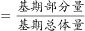，可得所求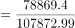，与A项最接近。

故正确答案为A。

---

#### 第 7 题　qid 4678701 · 增长

该省本月金融机构人民币存贷款的下列项目中，余额比年初增加最少的是：

- **A**. 境内存款中的非金融企业存款
- **B**. 境内住户贷款中的短期贷款
- **C**. 金融机构人民币贷款
- **D**. 非金融企业及机关团体贷款中的各项垫款　✅

**答案**：D

**官方解析**

根据题干“······比年初增加最少”，结合表格所给数据，可判定本题为直接找数问题。定位表格材料可知：境内存款中的非金融企业存款增长量为6113.7亿元；境内住户贷款中的短期贷款增长量为70.3亿元；金融机构人民币贷款增长量为8608.8亿元；非金融企业及机关团体贷款中的各项垫款增长量为8.1亿元，故选项中，余额比年初增加最少的是非金融企业及机关团体贷款中的各项垫款（8.1亿元）。
故正确答案为D。

---

#### 第 8 题　qid 4678705 · 比重

该省本月下列项目在金融机构人民币存款余额中的占比较年初增长最小的是：

- **A**. 境内存款
- **B**. 住户存款　✅
- **C**. 非金融企业存款
- **D**. 广义政府存款

**答案**：B

**官方解析**

根据题干“在······中的占比较······增长最小”，可判定本题为两期比重问题。定位表格可知：本月金融机构人民币存款余额为119919.39亿元，比年初增加12046.4亿元；本月境内存款为119629.80亿元，比年初增加12021.0亿元；本月住户存款为43313.71亿元，比年初增加2750.7亿元；本月非金融企业存款为45047.05亿元，比年初增加6113.7亿元；本月广义政府存款为23861.36亿元，比年初增加3118.0亿元。

方法一：根据公式：比重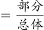可得，境内存款占比较年初增长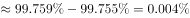，即0.004个百分点；住户存款占比较年初增长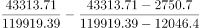，即-1.5个百分点；非金融企业存款占比较年初增长，即1.5个百分点；广义政府存款占比较年初增长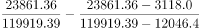，即0.7个百分点；比较可知-1.5个百分点最小，所以该省本月在金融机构人民币存款余额中的占比较年初增长最小的是住户存款。

方法二：根据两期比重结论：部分增长率（a）＞整体增长率（b），则比重上升；部分增长率（a）＜整体增长率（b），则比重下降；部分增长率（a）=整体增长率（b），则比重不变。可得本月金融机构人民币存款余额的增长率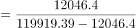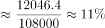，境内存款的增长率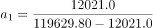，，则比重不变，即两期比重增长近似为零；住户存款的增长率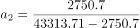，，则比重下降，即两期比重增长为负数；非金融企业存款的增长率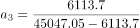，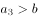，则比重上升，即两期比重增长为正数；广义政府存款的增长率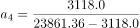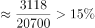，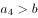，说明比重上升，即两期比重增长为正数，比较可得负数一定最小，即该省本月在金融机构人民币存款余额中的占比较年初增长最小的是住户存款。

故正确答案为B。

---

#### 第 9 题　qid 4678708 · 综合

该省本月金融机构人民币境内住户存贷款之差相比年初约：

- **A**. 减少了1329亿元　✅
- **B**. 增加了1329亿元
- **C**. 减少了1903亿元
- **D**. 增加了1903亿元

**答案**：A

**官方解析**

根据题干“······相比年初约”，结合选项“增加了/减少了······亿元”，可判定本题为增长量计算问题。定位表格材料可知：本月住户存款为43313.71亿元，比年初增加2750.7亿元；本月住户贷款为24279.75亿元，比年初增加4079.6亿元。根据公式：增长量=现期量-基期量，可得所求=（43313.71-24279.75）-[（43313.71-2750.7）-（24279.75-4079.6）]=2750.7-4079.6=-1328.9亿元，即减少了1328.9亿元，与A项最接近。
故正确答案为A。

---

#### 第 10 题　qid 4678711 · 增长

该省本月非银行业金融机构贷款余额同比增长：

- **A**. 10.5%
- **B**. 10.0%
- **C**. 9.5%
- **D**. 不知道　✅

**答案**：D

**官方解析**

根据题干“······同比增长”，结合选项为百分数，可判定本题为增长率计算问题。定位表格材料可知：本月非银行业金融机构贷款余额为3.17亿元，比年初增加0.3亿元。但是未给出同比（上年相同月份）数据，故无法求解其同比增长率。 
故正确答案为D。

---
