# 天津市2020年度定向34所重点高校招录选调生《综合能力测试》

> 选调生 · 2020 年 · 5 个模块 · 共 46 题

- [政治理论](#%E6%94%BF%E6%B2%BB%E7%90%86%E8%AE%BA) · 4 题
- [常识判断](#%E5%B8%B8%E8%AF%86%E5%88%A4%E6%96%AD) · 16 题
- [言语理解与表达](#%E8%A8%80%E8%AF%AD%E7%90%86%E8%A7%A3%E4%B8%8E%E8%A1%A8%E8%BE%BE) · 10 题
- [数量关系](#%E6%95%B0%E9%87%8F%E5%85%B3%E7%B3%BB) · 6 题
- [判断推理](#%E5%88%A4%E6%96%AD%E6%8E%A8%E7%90%86) · 10 题

---

## 政治理论

### 第 1 题　qid 2461692 · 新思想

党的十九大报告指出，必须坚持节约优先、保护优先、自然恢复为主的方针，形成节约资源和保护环境的（    ）、产业结构、生产方式、生活方式，还自然以宁静、和谐、美丽。

- **A**. 横向格局
- **B**. 纵向格局
- **C**. 立体格局
- **D**. 空间格局　✅

**答案**：D

**官方解析**

本题考查政治常识。
党的十九大报告指出：“我们要建设的现代化是人与自然和谐共生的现代化，既要创造更多物质财富和精神财富以满足人民日益增长的美好生活需要，也要提供更多优质生态产品以满足人民日益增长的优美生态环境需要。必须坚持节约优先、保护优先、自然恢复为主的方针，形成节约资源和保护环境的空间格局、产业结构、生产方式、生活方式，还自然以宁静、和谐、美丽。”
故正确答案为D。

---

### 第 2 题　qid 2461693 · 新思想

党的十九大报告指出，世界多极化、（    ）、社会信息化、文化多样化深入发展，全球治理体系和国际秩序变革加速推进，各国相互联系和依存日益加深，国际力量对比更趋平衡，和平发展大势不可逆转。

- **A**. 经济全球化　✅
- **B**. 政治全球化
- **C**. 文化全球化
- **D**. 金融全球化

**答案**：A

**官方解析**

本题考查政治常识。
党的十九大报告指出：“世界正处于大发展大变革大调整时期，和平与发展仍然是时代主题。世界多极化、经济全球化、社会信息化、文化多样化深入发展，全球治理体系和国际秩序变革加速推进，各国相互联系和依存日益加深，国际力量对比更趋平衡，和平发展大势不可逆转。同时，世界面临的不稳定性不确定性突出，世界经济增长动能不足，贫富分化日益严重，地区热点问题此起彼伏，恐怖主义、网络安全、重大传染性疾病、气候变化等非传统安全威胁持续蔓延，人类面临许多共同挑战。”
故正确答案为A。

---

### 第 3 题　qid 2461694 · 新思想

《党章》规定，年满（    ）岁的中国工人、农民、军人、知识分子和其他社会阶层的先进分子，承认党的纲领和章程，愿意参加党的一个组织并在其中积极工作、执行党的决议和按期交纳党费的，可以申请加入中国共产党。

- **A**. 十四
- **B**. 十六
- **C**. 十八　✅
- **D**. 十五

**答案**：C

**官方解析**

本题考查政治常识。
根据《党章》第一条规定：“年满十八岁的中国工人、农民、军人、知识分子和其他社会阶层的先进分子，承认党的纲领和章程，愿意参加党的一个组织并在其中积极工作、执行党的决议和按期交纳党费的，可以申请加入中国共产党。”
故正确答案为C。

---

### 第 4 题　qid 2461718 · 新思想

习近平指出：“只要我们善于聆听时代声音，勇于坚持真理、修正错误，二十一世纪中国的马克思主义一定能够展现出更强大、更有说服力的真理力量！”这说明（    ）

- **A**. 真理和谬误存在着原则界限
- **B**. 真理总是同谬误相比较而存在、相斗争而发展的
- **C**. 真理与谬误的对立只是在非常有限的范围内才具有绝对的意义，超出这个范围，二者的对立就是相对的
- **D**. 认识的发展与真理的获得，正是在对谬误的不断纠正中实现的　✅

**答案**：D

**官方解析**

本题考查政治常识。
A项错误，选项表述正确，但与题干无关。真理与谬误相互对立。在确定的对象和范围内，真理与谬误的对立是绝对的，与对象相符合的认识就是真理，与对象不相符合的认识就是谬误。在确定的条件下，一种认识不能既是真理又是谬误。也就是说，真理和谬误存在着原则界限。
B项错误，选项表述正确，但与题干无关。真理与谬误的对立是相对的，真理总是与谬误相比较而存在，相斗争而发展的。
C项错误，选项表述正确，但与题干无关。真理与谬误的对立是相对的，它们在一定条件下能够相互转化。真理和谬误的对立只是在非常有限的范围内才具有绝对性的意义，超出这个范围，二者的对立就是相对的。
D项正确，谬误是同客观事物及其发展规律相违背的认识，是对客观事物及其发展规律的歪曲反映。坚持和发展真理，就必须同谬误进行斗争。认识的发展与真理的获得，正是在对谬误的不断纠正中实现的。习总书记强调的“勇于坚持真理、修正错误”与这一观点相吻合。
故正确答案为D。

---

## 常识判断

### 第 1 题　qid 2461697 · 人文常识

（    ）是引领发展的第一动力，决定发展的速度、效能、可持续性。

- **A**. 协调
- **B**. 创新　✅
- **C**. 开放
- **D**. 绿色

**答案**：B

**官方解析**

本题考查政治常识。
2019年5月16日出版的第10期《求是》杂志发表了习近平总书记的重要文章《深入理解新发展理念》（文章是习近平总书记2016年1月18日在省部级主要领导干部学习贯彻党的十八届五中全会精神专题研讨班上讲话的一部分），文章指出：“把创新摆在第一位，是因为创新是引领发展的第一动力。发展动力决定发展速度、效能、可持续性。对我国这么大体量的经济体来讲，如果动力问题解决不好，要实现经济持续健康发展和‘两个翻番’是难以做到的。当然，协调发展、绿色发展、开放发展、共享发展都有利于增强发展动力，但核心在创新。抓住了创新，就抓住了牵动经济社会发展全局的‘牛鼻子’。”
故正确答案为B。

---

### 第 2 题　qid 2461699 · 人文常识

以人民为中心的发展思想，体现了人民是推动发展的根本力量的（    ）史观。

- **A**. 唯心
- **B**. 唯物　✅
- **C**. 相对
- **D**. 绝对

**答案**：B

**官方解析**

本题考查政治。
唯心史观和唯物史观是两大史观。唯心史观从社会意识决定社会存在的前提出发，把社会历史看成精神发展史，根本否定社会历史发展的客观规律，根本否定人民群众在社会历史发展中的决定作用。唯物史观认为社会存在决定社会意识，社会意识是社会存在的反映，并对社会存在具有能动作用，社会意识具有相对独立性；认为社会历史发展也有其客观规律；既承认英雄对历史的推进作用，又强调人民群众对历史发展的决定性作用。因此，以人民为中心的发展思想，体现了人民是推动发展的根本力量的唯物史观。
故正确答案为B。

---

### 第 3 题　qid 2461702 · 人文常识

树立开放发展理念，就必须顺应我国经济深度融入世界经济的趋势，奉行（    ）的开放战略，发展更高层次的开放型经济，提高我国在全球经济治理中的制度性话语权，构建广泛的利益共同体。

- **A**. 共同发展
- **B**. 和平发展
- **C**. 互利共赢　✅
- **D**. 互惠互利

**答案**：C

**官方解析**

本题考查政治。
党的十八届五中全会提指出：“坚持开放发展，必须顺应我国经济深度融入世界经济的趋势，奉行互利共赢的开放战略，发展更高层次的开放型经济，积极参与全球经济治理和公共产品供给，提高我国在全球经济治理中的制度性话语权，构建广泛的利益共同体。”
故正确答案为C。

---

### 第 4 题　qid 2461706 · 人文常识

否定之否定阶段：

- **A**. 是向第一阶段“肯定”的直接回归
- **B**. 是同第一阶段“肯定”毫无共同点的新事物
- **C**. 同第一阶段“肯定”具有某些相似的特征　✅
- **D**. 同第一阶段“肯定”在本质上是无异的

**答案**：C

**官方解析**

本题考查政治常识。
A、B、D三项错误，否定之否定是指在事物的发展过程中，往往要经过两次否定，由肯定到否定，再到否定之否定。这种否定不是简单地抛弃，而是辩证的否定，其实质是扬弃，是在否定之中有肯定，是既克服又保留。因此，否定之否定既不是同第一阶段“肯定”无任何共同点，也并非是向第一阶段“肯定”的直接回归，它是将第一阶段“肯定”中的积极因素保留，抛弃其中的否定因素，同第一阶段“肯定”是有本质区别的。
C项正确，事物经过否定之否定之后，第三阶段作为第二阶段的对立面必然与第一阶段有着某些相似特征，但第三阶段经过两次扬弃，吸收了前两个阶段的优点，是更高级的新事物，是一种自我完善。
故正确答案为C。

---

### 第 5 题　qid 2461708 · 人文常识

（    ）是关系我们党执政兴国、关系人民幸福安康、关系党和国家长治久安的重大战略问题，是“四个全面”战略布局的重要组成部分。

- **A**. 全面建成小康社会
- **B**. 全面依法治国　✅
- **C**. 全面从严治党
- **D**. 全面深化改革

**答案**：B

**官方解析**

本题考查政治常识。
2014年10月，习近平总书记在《关于〈中共中央关于全面推进依法治国若干重大问题的决定〉的说明》中指出：“全面推进依法治国是关系我们党执政兴国、关系人民幸福安康、关系党和国家长治久安的重大战略问题，是完善和发展中国特色社会主义制度、推进国家治理体系和治理能力现代化的重要方面。我们要实现党的十八大和十八届三中全会作出的一系列战略部署，全面建成小康社会、实现中华民族伟大复兴的中国梦，全面深化改革、完善和发展中国特色社会主义制度，就必须在全面推进依法治国上作出总体部署、采取切实措施、迈出坚实步伐。”另外，“四个全面”，即全面建成小康社会、全面深化改革、全面依法治国、全面从严治党。
故正确答案为B。

---

### 第 6 题　qid 2461712 · 人文常识

下列属于行政立法主体的是：

- **A**. 天津市人大常委会
- **B**. 天津市高级人民法院
- **C**. 天津市人民检察院
- **D**. 天津市和平区政府　✅

**答案**：D

**官方解析**

本题考查法律常识。
A项错误，《宪法》第一百条规定：“省、直辖市的人民代表大会和它们的常务委员会，在不同宪法、法律、行政法规相抵触的前提下，可以制定地方性法规，报全国人民代表大会常务委员会备案。设区的市的人民代表大会和它们的常务委员会，在不同宪法、法律、行政法规和本省、自治区的地方性法规相抵触的前提下，可以依照法律规定制定地方性法规，报本省、自治区人民代表大会常务委员会批准后施行。”
B项错误，在我国，人民法院是国家审判机关。审判机关就是依照法律规定代表国家独立行使审判权的国家机关。
C项错误，在我国，人民检察院是国家法律监督机关。检察机关是代表国家依法行使检察权的国家机关，其主要职责是追究刑事责任，提起公诉和实施法律监督。
D项正确，行政立法的主体是指依法取得行政立法权，可以制定行政法规或行政规章的国家行政机关。根据我国有关法律规定，行政立法主体包括国务院，国务院各部、各委员会，国务院直属机构，省、自治区、直辖市人民政府，省、自治区人民政府所在地的市级人民政府，国务院批准的较大的市的人民政府，经济特区所在地的市级人民政府。
故正确答案为D。

---

### 第 7 题　qid 2461714 · 人文常识

实践是人类能动地改造世界的社会性的物质活动，具有（    ）三个基本特征。

- **A**. 直接现实性、自觉能动性和客观历史性
- **B**. 直接现实性、自觉能动性和社会历史性　✅
- **C**. 间接现实性、自觉能动性和社会历史性
- **D**. 间接现实性、自觉能动性和客观历史性

**答案**：B

**官方解析**

本题考查政治常识。
实践是人类能动地改造世界的社会性的物质活动，具有以下三个基本特征：一是直接现实性，即人们能够通过实践，将观念中的存在变成现实的存在；二是自觉能动性，即实践是主体有意识、有目的的活动；三是社会历史性，即实践是社会性的、历史性的活动，作为实践主体的人，是处于一定社会关系中的人，并且在一定的社会关系中进行实践活动。
故正确答案为B。

---

### 第 8 题　qid 2461715 · 人文常识

商业资本的职能是：

- **A**. 销售商品和实现商品中的价值与剩余价值　✅
- **B**. 销售商品和创造价值与剩余价值
- **C**. 购买生产资料和劳动力
- **D**. 补偿流通领域中的流通费用

**答案**：A

**官方解析**

本题考查经济常识。
商业资本是从产业资本的运动中分离出来的，在流通领域中独立发挥作用的资本形式，也就是专业从事商品买卖，以获取商业利润为目的的资本。它的运动公式是G—W—G′（货币—商品—较多的货币）。资本家用商业资本（货币）购买生产资料和劳动力（二者属于商品）后，生产新的商品，销售这些商品后，从而赚取利润（获得比资本投入更多的货币），新的商品中包含着的价值和劳动力（工人）创造的剩余价值，都将成为资本家的利润来源。综上，商业资本执行的职能就是通过销售商品，实现商品中包含的价值和剩余价值。
故正确答案为A。

---

### 第 9 题　qid 2461717 · 经济常识

资本主义经济危机爆发的根本原因是：

- **A**. 私人劳动和社会劳动的矛盾
- **B**. 无产阶级和资产阶级的矛盾
- **C**. 资本主义的基本矛盾　✅
- **D**. 使用价值和价值的矛盾

**答案**：C

**官方解析**

本题考查经济常识。
资本主义经济危机爆发的根本原因是资本主义制度固有的基本矛盾，即社会化大生产和生产资料私有制之间的矛盾。生产资料的资本主义私有制决定了资本主义生产的目的是为了剩余价值。激烈的竞争和对于剩余价值的无限贪欲，驱使资本家不断增加积累，改进技术，扩大生产，社会化大生产也有可能迅速地应用新的科学技术成就，扩大生产规模。资本家在改进生产技术，扩大生产规模的同时，总要力图加强对工人的削剥。在资本积累过程中，中小生产者日益贫困破产，工人不断受机器排挤，造成大量的失业人口，使无产阶级的经济地位和生活状况更加恶化。随着资本主义基本矛盾的尖锐化，一方面生产无限扩大，商品堆积如山，另一方面广大劳动群众有支付能力的需求相对缩小，无钱购买。“市场的扩张赶不上生产的扩张，冲突成为不可避免的了”，所以，当生产和消费之间日益加剧的矛盾发展到一定程度，生产过剩的经济危机就必然会爆发。
故正确答案为C。

---

### 第 10 题　qid 2461719 · 人文常识

2019年国际田联世界田径锦标赛于9月27日至10月6日在卡塔尔首都多哈举行。下列关于此次锦标赛描述不正确的选项是：

- **A**. 中国田径队共派出62名运动员
- **B**. 中国选手包揽了女子20公里竞走前三名
- **C**. 中国选手谢文骏在男子百米飞人大战中获得第四名　✅
- **D**. 中国队以3金3银3铜列奖牌榜第四

**答案**：C

**官方解析**

本题考查政治常识。
A项正确，此次世锦赛中，中国田径队共派出62名运动员，参加25个小项的角逐（男子27人12项，女子35人13项）。
B项正确，在女子20公里竞走中，中国选手刘虹、切阳什姐、杨柳静包揽了前三名，这是中国田径队首次在世锦赛单项上包揽前三。
C项错误，本次田径世锦赛男子110米栏决赛中，首次闯入决赛的中国选手谢文骏以13秒29获得第四名，创个人世锦赛最好成绩。选项中百米飞人大战表述错误。
D项正确，本次世锦赛，美国队以14金11银4铜的绝对优势成绩拿下奖牌榜第一，肯尼亚队以5金2银4铜列奖牌榜第二，牙买加队以3金5银4铜列奖牌榜第三，中国队以3金3银3铜列奖牌榜第四。
本题为选非题，故正确答案为C。

---

### 第 11 题　qid 2461723 · 科技常识

2019年11月3日11时22分，我国首颗亚米级高分辨率光学传输型立体测绘卫星高分七号，在太原卫星发射中心发射升空并取得圆满成功。下列关于高分七号描述不正确的选项是：

- **A**. 高分七号卫星是光学立体测绘卫星
- **B**. 在国土测绘、城乡建设、统计调查等方面发挥重要作用
- **C**. 开启我国自主大比例尺航天测绘新时代
- **D**. 高分七号卫星分辨率不仅能够达到亚米级，而且定位精度是目前世界最高的　✅

**答案**：D

**官方解析**

本题考查科技常识。
A项正确，高分七号卫星是光学立体测绘卫星，将在高分辨率立体测绘图像数据获取、高分辨率立体测图、城乡建设高精度卫星遥感和遥感统计调查等领域取得突破。
B项正确，高分七号卫星在国土测绘、城乡建设、统计调查等方面发挥重要作用，为城市群发展规划、农业农村建设提供有力保障，为建设小康社会提供重要支撑。
C项正确，与一般光学遥感卫星只能拍摄平面图像相比，高分七号可以绘制立体图像，一旦投入使用，世界上所有建筑物在地图上不再只是一个方格，而是一个个立体“模型”。不仅能够为规划、环保、税务、国土、农业等部门提供宝贵的信息，而且也是民用导航领域核心竞争力所在，将打破地理信息产业上游的高分辨率立体遥感影像市场大量依赖国外卫星的现状，开启我国自主大比例尺航天测绘新时代。
D项错误，高分七号卫星分辨率不仅能够达到亚米级，而且定位精度是目前国内最高的，能够在太空轻松拍出媲美“阿凡达”的3D影像。投入使用后，将为我国乃至全球的地形地貌绘制出一幅误差在1米以内的立体地图。“世界最高”的说法错误。
本题为选非题，故正确答案为D。

---

### 第 12 题　qid 2461726 · 地理国情

2019年12月17日，我国第一艘国产航空母舰（    ）在海南三亚某军港交付海军。

- **A**. 辽宁舰
- **B**. 山东舰　✅
- **C**. 大连舰
- **D**. 海口舰

**答案**：B

**官方解析**

本题考查政治常识。
中国人民解放军海军山东舰是中国首艘自主建造的国产航母，基于对前苏联库兹涅佐夫级航空母舰、中国辽宁号航空母舰的研究，由中国自行改进研发而成，是中国真正意义上的第一艘国产航空母舰。2019年12月17日，经中央军委批准，中国第一艘国产航母命名为“中国人民解放军海军山东舰”，舷号为“17”。山东舰在海南三亚某军港交付海军。
故正确答案为B。

---

### 第 13 题　qid 2461729 · 人文常识

2019年9月29日，在女排世界杯的最后一轮较量中，中国女排以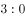轻取（    ），成功夺得女排世界杯冠军，为祖国和人民赢得了荣誉。

- **A**. 阿根廷　✅
- **B**. 美国
- **C**. 巴西
- **D**. 俄罗斯

**答案**：A

**官方解析**

本题考查政治常识。

2019年9月29日，中国女排在以轻取<b>阿根廷</b>的同时，以十一连胜的佳绩卫冕女排世界杯冠军。这是中国女排获得的第十座世界大赛冠军奖杯、第五座女排世界杯冠军奖杯。

故正确答案为A。

---

### 第 14 题　qid 2461730 · 人文常识

华为鸿蒙系统是基于微内核的全场景分布式OS，可按需扩展，实现更广泛的系统安全，主要用于：

- **A**. 移动通讯
- **B**. 手机
- **C**. 互联网
- **D**. 物联网　✅

**答案**：D

**官方解析**

本题考查科技常识。
2019年8月9日，华为公司在广东东莞松山湖举行的华为开发者大会上正式发布自主研发的鸿蒙操作系统。华为消费者业务CEO、华为技术有限公司常务董事余承东介绍，鸿蒙系统是基于微内核的全场景分布式OS，可按需扩展，实现更广泛的系统安全，主要用于物联网，特点是低时延，甚至可到毫秒级乃至亚毫秒级。
故正确答案为D。

---

### 第 15 题　qid 2461731 · 人文常识

下列关于核潜艇描述不正确的是：

- **A**. 是以核反应堆为动力来源设计的潜艇
- **B**. 世界第一艘核潜艇诞生在二战期间的德国　✅
- **C**. 核潜艇可以装有核战略导弹
- **D**. 美国和俄罗斯的核潜艇数最多

**答案**：B

**官方解析**

本题考查科技常识。
A项正确，核潜艇是潜艇中的一种类型，指以核反应堆为动力来源设计的潜艇。
B项错误，1954年1月21日，美国建造的世界上第一艘核潜艇——“鹦鹉螺”号下水，宣告了核动力潜艇的诞生。
C项正确，早期的核潜艇均以鱼雷作为武器。后来由于导弹的进展，出现了携带导弹的核潜艇。核潜艇安上导弹之后，便出现了两种类型：一类是以近程导弹和鱼雷为主要武器的攻击型核潜艇，另一类是以中远程弹道导弹为主要武器的弹道导弹核潜艇，即携带战略核导弹的核潜艇。
D项正确，目前全世界公开宣称拥有核潜艇的国家有6个，分别为美国、俄罗斯、英国、法国、中国、印度。其中美国和俄罗斯拥有核潜艇最多。
本题为选非题，故正确答案为B。

---

### 第 16 题　qid 2461732 · 科技常识

“薛定谔的猫”是奥地利著名物理学家薛定谔提出的一个思想实验，是指将一只猫关在装有少量镭和氰化物的密闭容器里，该实验试图从宏观尺度阐述微观尺度的（    ）叠加原理的问题。

- **A**. 原子
- **B**. 分子
- **C**. 量子　✅
- **D**. 电子

**答案**：C

**官方解析**

本题考查科技常识。
“薛定谔的猫”是奥地利著名物理学家薛定谔提出的一个思想实验，是指将一只猫关在装有少量镭和氰化物的密闭容器里。镭的衰变存在几率，如果镭发生衰变，会触发机关打碎装有氰化物的瓶子，猫就会死；如果镭不发生衰变，猫就存活。根据量子力学理论，由于放射性的镭处于衰变和没有衰变两种状态的叠加，猫就理应处于死猫和活猫的叠加状态。这只既死又活的猫就是所谓的“薛定谔的猫”。该实验试图从宏观尺度阐述微观尺度的量子叠加原理的问题，巧妙地把微观物质在观测后是粒子还是波的存在形式与宏观的猫联系起来，以此求证观测介入时量子的存在形式。
故正确答案为C。

---

## 言语理解与表达

### 第 1 题　qid 2461695 · 逻辑填空

近年来，中国沙漠旅游            ，逐渐受到游人的青睐，从探险家的乐土成为大众的新宠。作为一种独特的旅游资源，沙漠地区以特殊的自然和人文环境为背景，强烈的地域差异和文化差异，满足了游客对回归大自然、返璞原生态的诉求，深受众人喜爱。

- **A**. 方兴未艾
- **B**. 另辟蹊径
- **C**. 异军突起　✅
- **D**. 推陈出新

**答案**：C

**官方解析**

由“逐渐受到游人的青睐，从探险家的乐土成为大众的新宠”可知，此处强调中国沙漠旅游的兴起。B项“另辟蹊径”比喻另创一种风格或方法，D项“推陈出新”指去掉旧事物的糟粕，取其精华，并使它向新的方向发展（多指继承文化遗产），两项均与文意无关，排除。
比较A、C两项，A项“方兴未艾”强调事物正在兴起、发展，一时不会终止；C项“异军突起”强调新的派别或新的力量突然兴起。根据“作为一种独特的旅游资源，沙漠地区······”可知，文段强调的是沙漠旅游独具特色，是有别于其他旅游的新的旅游派别，故用“异军突起”更为恰当，排除A项。
故正确答案为C。
【文段出处】《沙漠旅游：从探险家乐土成大众新宠》

---

### 第 2 题　qid 2461696 · 逻辑填空

一直以来，合成生物学家对人造细胞有很大的期待。与更简单的合成结构相比，例如已经在体内运输某些药物的脂质体，人造细胞可能对环境更        ，并能执行更多种类的工作。未来，人造细胞可以更        地将药物输送到目标、追踪癌细胞、检测有毒化学物质，或者提高诊断测试的准确性。

- **A**. 适应  平稳
- **B**. 友好  巧妙
- **C**. 严格  灵活
- **D**. 敏感  精确　✅

**答案**：D

**官方解析**

本题可从第二空入手，根据“提高诊断测试的准确性”可知，所填词语对应“准确性”，D项“精确”填入最为恰当。A项“平稳”、B项“巧妙”和C项“灵活”均与“准确性”无关，排除。
第一空代入验证，D项“敏感”指生理上或心理上对外界事物反应很快。人造细胞对环境敏感，能够起到精确输送药物、追踪癌细胞等任务，符合语境。
故正确答案为D。
【文段出处】《最逼真人造细胞问世》

---

### 第 3 题　qid 2461698 · 逻辑填空

随着物质生活水平的提高，收藏艺术品的人逐渐多起来。收藏的类别也是          。收藏艺术品讲究以藏养藏，所以很多收藏爱好者都有出售手中宝贝的需求。这种需求容易被无良商家和诈骗团伙利用，各种诈骗手段更是             。

- **A**. 不胜枚举  应运而生
- **B**. 五花八门  层出不穷　✅
- **C**. 眼花缭乱  遍地开花
- **D**. 千差万别  无奇不有

**答案**：B

**官方解析**

第一空，横线处所填成语搭配“类别”。由文意可知，此处应表示收藏的类别很多。B项“五花八门”形容花样繁多或变幻多端，符合文意，保留。A项“不胜枚举”形容同一类的人或事物很多，一般做动词，不做形容词，正确的说法是“收藏的类别不胜枚举”，故搭配不当，排除。C项“眼花缭乱”指眼睛看见复杂纷繁的东西而感到迷乱，一般与人搭配，与“类别”搭配不当，排除。D项“千差万别”形容品种多、差别大，一般搭配具体事物，与“类别”搭配不当，排除。
第二空，代入验证。横线处所填成语搭配“诈骗手段”，B项“层出不穷”指接连不断地出现，没有穷尽，符合文意，搭配恰当，当选。
故正确答案为B。
【文段出处】《艺术品拍卖十大骗术揭秘》

---

### 第 4 题　qid 2461700 · 逻辑填空

《坤舆万国全图》是17世纪初一流中西地图学者密切合作的结晶，不仅奠定了我们中国人        世界的最初视角，也代表了大明王朝对世界的认识广度和深度，甚至有可能重新        世界地理大发现的历史，这样的国宝应该让更多的人认识熟悉。

- **A**. 审视  推翻
- **B**. 观察  书写　✅
- **C**. 理解  定义
- **D**. 描绘  梳理

**答案**：B

**官方解析**

第一空，由后文“最初视角”可知，横线处所填词语应表达“看”之意。A项“审视”指仔细看，B项“观察”指仔细察看（事物或现象），均符合文意，保留。C项“理解”、D项“描绘”与文意不符，排除。
第二空，根据文意可知，横线所在语句应表示有可能改写世界地理大发现的历史，B项“书写”符合文意。A项“推翻”，搭配横线前的“重新”表示之前已推翻过一次，但文段并无此表述，与文意不符，排除。
故正确答案为B。
【文段出处】《古代地图是怎样“画”出来的》

---

### 第 5 题　qid 2461703 · 逻辑填空

写作是语言的精髓、文化的灵魂，它与1和0组成的数据、单词和符号组成的代码看上去            。试问，灵感、直觉和纯熟的语言训练诞生的产物，怎能由数据和代码组成呢？在AI席卷各大行业的浪潮下，写作作为艺术形式的一种，仿佛成为了人们心目中的“            ”。

- **A**. 大相径庭  另类
- **B**. 各有千秋  净土
- **C**. 格格不入  孤岛　✅
- **D**. 迥然不同  圣地

**答案**：C

**官方解析**

第一空，由“试问，灵感、直觉和纯熟的语言训练诞生的产物，怎能由数据和代码组成呢？”可知，此处表示“语言写作”不能由“数据和代码”组成，两者是不相容的，相互对立的。C项“格格不入”形容彼此不协调，不相容，相互抵触，符合文意，当选。A项“大相径庭”、D项“迥然不同”均侧重强调两者存在差异，没有体现“对立、抵触”之意，排除。B项“各有千秋”比喻各人有各人的长处，各人有各人的特色，文段并非比较“语言写作”和“代码”各自的长处，排除。
第二空，由前文可知，“写作”与“数据”并不相容，因此在AI席卷各大行业的浪潮下写作能够独善其身，不随波逐流，C项“孤岛”比喻孤立存在的事物，且与前文“浪潮”构成形象化对应，符合文意，当选。
故正确答案为C。
【文段出处】《AI+写作代替编辑？现阶段只是“不懂装懂”》

---

### 第 6 题　qid 2461705 · 片段阅读

首张黑洞照片，是对人类好奇心和探索欲的褒奖和回馈。与生俱来的好奇心不断催生着人类的探索事业。从100多年前黑洞预测的提出到50年前“黑洞”一词的流传，从100年前两支科学探险队前往非洲海岸和巴西，通过1919年的日食观测光是否会因太阳引力而弯曲，到如今“事件视界望远镜”项目派遣团队前往世界上最高和最偏僻的射电观测台站，去再一次检验对引力的理解，对黑洞的寻找是一场跨越百年的好奇心之旅。这段文字意在说明：

- **A**. 对黑洞的探索源于人类的好奇心　✅
- **B**. 人类对黑洞探索的历程
- **C**. 对黑洞的研究已经历了上百年的时间
- **D**. 对黑洞的研究遍及世界各地

**答案**：A

**官方解析**

文段开篇先指出第一张黑洞照片是对人类好奇心的回馈。紧接着指出人类的好奇心不断催生着人类的探索事业，随后举出例子来论证对黑洞的寻找是人类的好奇心之旅，整个文段是围绕黑洞和好奇心这两个主题词展开，故正确答案中也要包含这两个主题词，对应A项。
B项、C项、D项都缺少主题词“好奇心”，并且B项“探索的历程”、C项“上百年的时间”、D项“研究遍及世界各地”都属于非重点的内容，排除。
故正确答案为A。
【文段出处】《人民日报人民时评：“黑洞”照片让我们看见了什么》

---

### 第 7 题　qid 2461707 · 片段阅读

大气污染是多年积累的结果，治环境污染的沉疴，不能指望药到病除，过程中必然会有曲折和反复。例如，去年秋冬季，由于区域气象条件较差、工业污染物排放量增加等因素，京津冀及周边地区出现PM2.5浓度同比不降反升的现象。这充分说明大气污染防治形势依然很严峻，天不帮忙、排放增加时，雾霾就可能比较重。大气污染防治具有长期性、艰巨性、复杂性，蓝天保卫战是一场大仗、硬仗、苦仗，绝不是吹响冲锋号、打几个冲锋，就能大功告成的。这段文字意在说明：

- **A**. 自然因素影响大气污染防治
- **B**. 大气污染防治是一场艰苦的持久战　✅
- **C**. 大气污染和工业污染物排放量密切相关
- **D**. 雾霾形成的原因是多方面的

**答案**：B

**官方解析**

文段首句提出治理大气污染过程会曲折反复，接下来以京津冀及周边地区情况举例说明，结尾进行总结，指出“大气污染防治具有长期性、艰巨性、复杂性”，对应B项。
A项，“自然因素”对应文中京津冀及周边地区情况中区域气象条件的内容，是例子表述，非重点，排除；
C项，“工业污染物排放量”仅是影响大气污染的因素之一，表述片面，排除；
D项，缺少文段主题词“大气污染”，排除。
故正确答案为B。
【文段出处】《坚定信心，打赢蓝天保卫战》

---

### 第 8 题　qid 2461709 · 片段阅读

正是因为跟上了时代发展的步伐，网络文学才获得了更大的发展空间。从近5年的作品来看，那些阅读量和评论量巨大的作品，有不少都是弘扬家国情怀、彰显奋斗精神、书写人间真情的，作品所体现的历史观、民族观、国家观都是正确而为社会大众所认同的。网络文学创作者对主流价值观的认同、向中华文化的回归、对时代精神的回应，正在从不自觉走向自觉，他们的作品也因此赢得了更广泛的读者。“大浪淘沙始见金”，时代潮流滚滚向前，那些与时代同行的作品与创作者最终走向了无比广阔的大海。这段文字意在说明：

- **A**. 网络文学的题材越来越丰富
- **B**. 网络文学要与时代同行　✅
- **C**. 网络文学的思想性和艺术性不断提高
- **D**. 网络文学作者水平不断提高

**答案**：B

**官方解析**

文段开篇通过程度词“正是”和必要条件关联词“才”重点强调网络文学应当跟上时代发展的步伐。后文以近5年的作品以及网络文学的创作者为例，论述了他们能最终走向无比广阔的大海是因为跟上了时代的潮流，进一步证明了网络文学应跟上时代。故文段为“观点+解释说明”的结构，重点强调网络文学要跟上时代发展的步伐，对应B项。
A项，“网络文学的题材越来越丰富”对应后文举例论证的内容，非重点，排除；
C项，“思想性和艺术性不断提高”文段未提及，无中生有，排除；
D项，“作者”对应后文举例论证的内容，非重点，排除。
故正确答案为B。
【文段出处】《网络文学当与时代同行》

---

### 第 9 题　qid 2461710 · 片段阅读

“环球同此凉热”，没有哪个国家可以成为风景独好的孤岛。有专家指出，热带雨林消失的生态影响难以靠其他地方的绿化来弥补。所以，植绿不是“单边行动”，还得依靠“集团作战”。作为国际合作的推动者，2017年，中国推动建立了“一带一路”防治荒漠化合作机制，共建绿色丝绸之路。从“牢记使命、艰苦创业、绿色发展”的塞罕坝精神，到政府、企业、农牧民、科技四轮驱动的库布其模式，中国智慧“为全球生态文明建设带来希望之光”。下列说法与这段文字不符的是：

- **A**. 全球绿化需要世界各国的参与
- **B**. 热带雨林对生态的影响是最为关键的　✅
- **C**. 保护生态环境是全球面临的共同挑战和责任
- **D**. 中国以自己的成功实践树立了“绿色样板

**答案**：B

**官方解析**

B项，文段只指出“热带雨林消失的生态影响难以靠其他地方的绿化来弥补”，并未与其他对比，故“对生态的影响是最为关键的”为无中生有的表述，与文意不符，当选。
A、C两项，根据“没有哪个国家可以成为风景独好的孤岛······植绿不是‘单边行动’，还得依靠‘集团作战’”可知，A项“需要世界各国的参与”及C项“全球面临的共同挑战和责任”均符合文意，排除。
D项，根据“从‘牢记使命、艰苦创业、绿色发展’的塞罕坝精神，到政府、企业、农牧民、科技四轮驱动的库布其模式，中国智慧‘为全球生态文明建设带来希望之光’”可知，中国的成功带来了“希望之光”，即“树立了‘绿色样板’”，符合文意，排除。
本题为选非题，故正确答案为B。
【文段出处】《中国行动点亮“绿色未来”》

---

### 第 10 题　qid 2461713 · 片段阅读

当前，很多人把人工智能当做科幻中的强人工智能，即达到人脑的能力。然而，未来十几年，最大的机会一定是所谓的弱人工智能，也就是说完全不需要达到人脑的所有功能。人工智能要想完全达到人脑的所有功能是非常困难的，今天所讲的人工智能，简言之，是在某一特定领域，用大量数据来做出比人更精确的判断，来创造价值、创造效率，能够将人类从重复性工作中解放出来，去做更有创意、更有爱的工作。这段文字意在说明：

- **A**. 人们对人工智能的认识存在着误区
- **B**. 弱人工智能是未来的主要发展方向　✅
- **C**. 人工智能并非追求达到人脑的能力
- **D**. 大数据是实现人工智能的首要前提

**答案**：B

**官方解析**

文段开篇交代背景，指出很多人把人工智能当做强人工智能，紧接着通过转折词“然而”、以及程度词“最”强调“未来的发展机会是弱人工智能”，接下来后文具体解释说明为什么弱人工智能是未来的发展方向。故文段重点强调未来最大的机会是弱人工智能，对应B项。
A项“误区”对应到文段第一句话，为转折前的内容，非文段重点，排除；
C项表述错误，弱人工智能不追求达到人脑的能力，而并非是人工智能，排除；
D项“首要前提”无中生有，排除。
故正确答案为B。
【文段出处】《人工智能机遇与挑战 听听专家怎么说》

---

## 数量关系

### 第 1 题　qid 2461721 · 数学运算

，1，，5，，（    ）

- **A**. 
21
　✅
- **B**. 
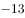

- **C**. 
17

- **D**. 
19

**答案**：A

**官方解析**

观察数列特征，无特征，考虑多级数列作差。后项前项，得到新数列2，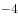，8，，？，可以看出此数列是公比为的等比数列，则？。因此所求项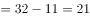。

故正确答案为A。

---

### 第 2 题　qid 2461737 · 数学运算

桌上放着的甲种溶液400ml和的乙种溶液200ml，往甲、乙两种溶液中分别倒入等量的水后两种溶液的浓度相同，那么，倒入甲溶液中水的量相当于原来甲乙两种溶液总量的多少？

- **A**. 

- **B**. 

　✅
- **C**. 
1倍

- **D**. 
2倍

**答案**：B

**官方解析**

设分别往甲、乙溶液中倒入ml的水，根据倒入后甲、乙溶液浓度相同，可列式：，即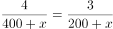，整理得：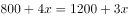，解得ml，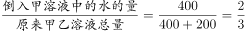。

故正确答案为B。

---

### 第 3 题　qid 2461738 · 数学运算

赵英读一本小说，第一天读了全书的，第二天又读了余下的，这时还有42页没有读完，这本小说共多少页？

- **A**. 245页　✅
- **B**. 255页
- **C**. 265页
- **D**. 275页

**答案**：A

**官方解析**

设这本小说共有页，根据题意可列式：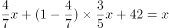，化简得：，解得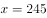页。

故正确答案为A。

---

### 第 4 题　qid 2461739 · 数学运算

小王在甲医院，小赵在乙医院。两人从所在医院同时骑车出发，来回往返于两个医院之间。已知小王骑车速度为205米/分钟，小赵骑车速度为225米/分钟，且经过12分钟后两人第二次相遇。问两家医院相距多少米？

- **A**. 1290
- **B**. 1720　✅
- **C**. 2150
- **D**. 2580

**答案**：B

**官方解析**

设两家医院相距米，根据直线两端多次相遇公式：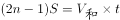，代入公式可得：，解得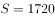米。

故正确答案为B。

---

### 第 5 题　qid 2461740 · 数学运算

某实验室进行连续试验。自试验开始进行第一次观察并计时，随后每隔5小时观察一次，当观察第121次时，计时表显示正好八点。则进行第（    ）次观察时，计时表的时针与分针是在观察试验时第一次呈150角。

- **A**. 5
- **B**. 8　✅
- **C**. 10
- **D**. 11

**答案**：B

**官方解析**

试验开始后每隔5小时观察一次，当观察第121次时，中间间隔120个5小时，共经过600小时，天，经过完整的25天，即进行第一次观察的时间同样为8点。代入A项验证，当进行第5次观察时，经过小时，此时时间为4点，时针与分针呈120，不满足要求；代入B项验证，当进行第8次观察时，经过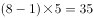小时，此时时间为19点，即晚上7点，时针与分针呈150，满足要求。

故正确答案为B。

---

### 第 6 题　qid 2461741 · 数学运算

某铁路桥长1440米，一列动车从桥上通过，测得动车从开始上桥到完全下桥用了21秒，动车的速度为288km/h，则整列动车完全在桥上的时间为（    ）秒。

- **A**. 18
- **B**. 16
- **C**. 15　✅
- **D**. 12

**答案**：C

**官方解析**

设动车车长为，动车速度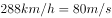，根据火车过桥公式：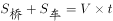，代入数据得：，解得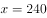米。动车完全在桥上时间秒。

故正确答案为C。

---

## 判断推理

### 第 1 题　qid 2461701 · 图形推理

从所给四个选项中，选择最合适的一个填入问号处，使之呈现一定规律性：

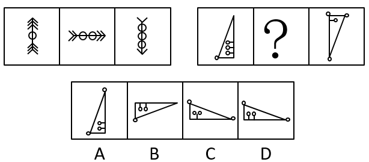

- **A**. A
- **B**. B
- **C**. C
- **D**. D　✅

**答案**：D

**官方解析**

观察发现，第一组图箭头方向依次顺时针旋转90，且圆圈个数在递增，箭头个数在递减；第二组图应用此规律，三角形整体顺时针旋转90，排除A、B两项，继续观察发现，第一个图三角形内部是三个圆圈三条短线，第三个图三角形内部是一个圆圈一条短线，故？处应该选择两个圆圈两条短线，只有D项符合。

故正确答案为D。

---

### 第 2 题　qid 2461704 · 图形推理

从所给四个选项中，选择最合适的一个填入问号处，使之呈现一定规律性：

- **A**. A
- **B**. B
- **C**. C　✅
- **D**. D

**答案**：C

**官方解析**

元素组成相似，优先考虑样式规律。第一组图中，图一和图二求异可以得到图三；第二组图应用此规律，图一和图二求异，只有C项符合。
故正确答案为C。

---

### 第 3 题　qid 2461711 · 图形推理

从所给四个选项中，选择最合适的一个填入问号处，使之呈现一定规律性：

- **A**. A
- **B**. B
- **C**. C
- **D**. D　✅

**答案**：D

**官方解析**

观察图形发现，出现了多个小黑点，小黑点整齐分布，优先考虑小黑点的位置。第一组图中所有的小黑点位置均不重合，故第二组图应用此规律，？处的图形的小黑点应与前两幅图形之间不存在重合，只有D项符合。
故正确答案为D。

---

### 第 4 题　qid 2461716 · 图形推理

从所给四个选项中，选择最合适的一个填入问号处，使之呈现一定规律性：

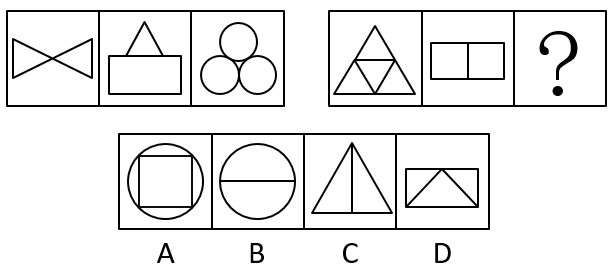

- **A**. A　✅
- **B**. B
- **C**. C
- **D**. D

**答案**：A

**官方解析**

元素组成不同，优先考虑属性规律，出现等腰三角形优先考虑对称性，第一组图形的对称轴数量为：2、1、3，第二组图形的对称轴数量为3、2、？，观察发现，第二组图形的对称轴数量分别比第一组的对称轴数量多1条，故？处图形的对称轴数量应为4条，只有A项符合。
故正确答案为A。

---

### 第 5 题　qid 2461720 · 图形推理

从所给四个选项中，选择最合适的一个填入问号处，使之呈现一定规律性：

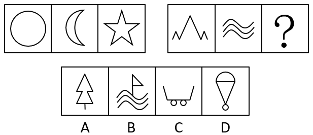

- **A**. A
- **B**. B
- **C**. C
- **D**. D　✅

**答案**：D

**官方解析**

解析一：元素组成不同，且无明显属性规律，优先考虑数量规律。题干出现全曲线图形和单一曲线，考虑曲线数，第一组图中每幅图的曲线数分别为1、2、0，相加之和为3，第二组应用此规律，前两幅图的曲线数分别为0、3，故问号处图形的曲线数应为0，只有A项符合。
故正确答案为A。
解析二：元素组成不同，且无明显属性规律，优先考虑数量规律。题干图形存在明显的封闭空间，优先考虑面数量。第一组图中，面的数量都是1，面数量相加为3，第二组图遵循相同规律，前两幅图面数量均为0，故？处图形的面数量应为3，只有D项符合。
故正确答案为D。
注：该题中图形出现圆、月亮全曲线图形及多条单一曲线组成的图形，数曲线特征明显，故粉笔更倾向根据曲线数量的和择优选择A项，争议题大家了解基本解题思路即可。

---

### 第 6 题　qid 2461724 · 逻辑判断

当前，对党内腐败现象要进行适当的舆论抨击。但要实事求是，不要以偏概全，也不能无中生有。惩治腐败一靠教育，二靠监督，三靠法治，四靠干部自身廉洁奉公，这是反腐倡廉的根本，如果编串话来讽刺党内的腐败现象，党员不解释，不正确引导，反而跟着编说，非但不能增强反腐败斗争的力度，而且让人觉得腐败是普遍的。可见：

- **A**. 腐败是个别现象，不是普遍现象。
- **B**. 某一些舆论对腐败现象报道有失实的现象。　✅
- **C**. 对广大干部进行反腐败教育还不够。
- **D**. 反腐力度还不够。

**答案**：B

**官方解析**

日常结论题，根据题干信息逐一分析选项。
A项：题干仅提到对腐败现象要进行适当的舆论抨击，没有提到腐败现象的多少，无中生有，无法推出，排除；
B项：题干中第二句话出现转折词“但”，转折之后是重点，即对党内腐败现象的舆论抨击要实事求是，不要以偏概全，也不能无中生有，说明目前对腐败的报道确实有一些失实现象，可以推出，当选；
C项：题干第二句话中提到惩治腐败靠教育，并未提到反腐败教育还不够，无中生有，无法推出，排除；
D项：题干并未涉及反腐力度是否足够，无中生有，无法推出，排除。
故正确答案为B。

---

### 第 7 题　qid 2461728 · 逻辑判断

亮亮、明明、强强参加今年高考，都准备报考军事院校。考完后在一起议论自己考试的可能结果，并且各自对自己发表了自己的想法。
亮亮说：“嘻嘻，我肯定能考上重点军事院校。”
明明说：“唉！我肯定考不上重点军事院校了。”
强强说：“啊哈！要是不论重点不重点，我考上肯定是没有问题的。”
高考成绩公布后，三位同学中考上重点军事院校、一般军事院校、没有考上军事院校各一人。此外，三位同学中有一位同学当初预测是正确的，另外两位同学的预测正好相反。由此，可以推断出：

- **A**. 亮亮没考上军事院校，明明考上一般军事院校，强强考上重点军事院校
- **B**. 亮亮没考上军事院校，明明考上重点军事院校，强强考上一般军事院校　✅
- **C**. 亮亮考上一般军事院校，明明没考上军事院校，强强考上重点军事院校
- **D**. 亮亮考上一般军事院校，明明考上重点军事院校，强强没考上军事院校

**答案**：B

**官方解析**

本题考虑代入法。
A项：代入A项，此时亮亮说假话、明明和强强都说真话，与题干条件矛盾，排除；
B项：代入B项，此时亮亮和明明说假话、强强说真话，符合题干条件，当选；
C项：代入C项，此时亮亮说假话、明明和强强都说真话，与题干条件矛盾，排除；
D项：代入D项，此时亮亮、明明和强强都说假话，与题干条件矛盾，排除。
故正确答案为B。

---

### 第 8 题　qid 2461733 · 逻辑判断

2015年，国际环境组织有一份报告称，每年约有200万人死于雾霾中PM2.5所引发的疾病。假如当前以牺牲环境为代价的经济发展方式不改变，到2035年死亡人数将会突破500万人，其中，超过发生于发展中国家。而空气污染所带来的影响已经导致全球GDP下降了。并且，环境污染对世界最贫穷国家影响最大，到2035年将使这些国家GDP平均下降约。据此，可以判断下列哪个选项正确？

- **A**. 空气污染对全球经济发展产生不小的影响　✅
- **B**. 发展速度较快的国家受环境污染的影响非常小
- **C**. 到2035年将有500多万人因雾霾中PM2.5所带来的疾病丧生
- **D**. 以牺牲环境为代价的经济发展方式导致全球变暖

**答案**：A

**官方解析**

日常结论题，根据题干信息逐一分析选项。

A项：根据题干可知，空气污染所带来的影响已经导致全球GDP下降了，可以推出空气污染对全球经济发展产生了不小的影响，当选；

B项：题干中指出，环境污染对世界最贫穷国家影响最大，但未提及对发展速度较快的国家影响如何，无中生有，排除；

C项：题干中指出，假如当前以牺牲环境为代价的经济方式不改变，到2035年死亡人数将会突破500万人，牺牲环境的方式并不等同于雾霾中的PM2.5，偷换概念，排除；

D项：题干中并未提及以牺牲环境为代价的经济发展方式导致全球变暖，无中生有，排除。

故正确答案为A。

---

### 第 9 题　qid 2461734 · 逻辑判断

若赵强同学大学毕业于2010年以后，那么他就必须修过《西方哲学概论》这门课程。从以下哪个选项能推出这一判断？

- **A**. 所有2010年后毕业的大学生都必须修《西方哲学概论》　✅
- **B**. 2010年前没有一个大学生修过《西方哲学概论》
- **C**. 在2010年以前，大学课程中《西方哲学概论》不是必修课
- **D**. 选修过《西方哲学概论》的学生都是2010年后毕业的

**答案**：A

**官方解析**

第一步：翻译题干。

①毕业于2010年以后修过《西方哲学概论》。

第二步：逐一分析选项。

A项：选项翻译为“2010年后毕业修过《西方哲学概论》”，与①一致，可以推出，当选；

B项：选项翻译为“2010年前的大学生修过《西方哲学概论》”，是对①的否前，无法推出确定结论，排除；

C项：“2010年以前”是对条件①的否前，无法确定《西方哲学概论》是否为必修课，无法推出，排除；

D项：选项翻译为“修过《西方哲学概论》2010年后毕业”，是对①的肯后，无法推出确定结论，排除。

故正确答案为A。

---

### 第 10 题　qid 2461735 · 逻辑判断

在一次国际象棋比赛中，参加决赛选手的姓氏是赵、钱、孙、李、周、吴6位选手。观众席上甲、乙、丙对谁将获得冠军进行了预测。乙认为，冠军不是赵就是钱。丙认为冠军绝对不是孙。甲却认为，李和吴不可能取得冠军。比赛结束后发现，这三个观众只有一个人的预测是正确的。那么，获得此次国际象棋比赛冠军的是：

- **A**. 钱
- **B**. 孙　✅
- **C**. 周
- **D**. 赵

**答案**：B

**官方解析**

第一步：找关系。

甲：李且吴；乙：不是赵就是钱；丙：孙。分析三个人的预测发现，没有矛盾和反对关系，考虑采用代入法。

第二步：逐一验证选项。

A项：冠军为钱，可以确定甲的猜测为真，乙的猜测为真，丙的猜测为真，不符合“只有一个人的预测是正确的”，排除；

B项：冠军为孙，可以确定甲的猜测为真，乙的猜测为假，丙的猜测为假，符合题干条件，当选；

C项：冠军为周，可以确定甲的猜测为真，乙的猜测为假，丙的猜测为真，不符合“只有一个人的预测是正确的”，排除；

D项：冠军为赵，可以确定甲的猜测为真，乙的猜测为真，丙的猜测为真，不符合“只有一个人的预测是正确的”，排除。

故正确答案为B。

---
