# 安徽省2020年面向全国重点高校定向招录选调生《行测》题（网友回忆版）

> 选调生 · 2020 年 · 6 个模块 · 共 40 题

- [政治理论](#%E6%94%BF%E6%B2%BB%E7%90%86%E8%AE%BA) · 5 题
- [常识判断](#%E5%B8%B8%E8%AF%86%E5%88%A4%E6%96%AD) · 5 题
- [言语理解与表达](#%E8%A8%80%E8%AF%AD%E7%90%86%E8%A7%A3%E4%B8%8E%E8%A1%A8%E8%BE%BE) · 10 题
- [数量关系](#%E6%95%B0%E9%87%8F%E5%85%B3%E7%B3%BB) · 5 题
- [判断推理](#%E5%88%A4%E6%96%AD%E6%8E%A8%E7%90%86) · 10 题
- [资料分析](#%E8%B5%84%E6%96%99%E5%88%86%E6%9E%90) · 5 题

---

## 政治理论

### 第 1 题　qid 2456415 · 新思想

在“不忘初心，牢记使命”主题教育中，习近平总书记向全党发出了“守初心、担使命、找差距、抓落实”的号召。中国共产党人的初心和使命，就是                。

- **A**. 实现共产主义
- **B**. 建设中国特色社会主义
- **C**. 为中国人民谋幸福，为中华民族谋复兴　✅
- **D**. 建成社会主义现代化强国

**答案**：C

**官方解析**

本题考查政治常识。
习近平总书记在十九大报告中指出：“不忘初心，方得始终。中国共产党人的初心和使命，就是为中国人民谋幸福，为中华民族谋复兴。这个初心和使命是激励中国共产党人不断前进的根本动力。全党同志一定要永远与人民同呼吸、共命运、心连心，永远把人民对美好生活的向往作为奋斗目标，以永不懈怠的精神状态和一往无前的奋斗姿态，继续朝着实现中华民族伟大复兴的宏伟目标奋勇前进。”
故正确答案为C。

---

### 第 2 题　qid 2456420 · 时事政治

党的十九届四中全会审议通过了《中共中央关于坚持和完善中国特色社会主义制度  推进国家治理体系和治理能力现代化若干重大问题的决定》，从党和国家事业发展的全局和长远出发，深刻回答了                这一重大政治问题。

- **A**. 社会主义的本质是什么
- **B**. 坚持和巩固什么，完善和发展什么　✅
- **C**. 实现什么样的发展，怎样发展
- **D**. 我国的根本制度是什么

**答案**：B

**官方解析**

本题考查政治常识。
党的十九届四中全会审议通过的《决定》，从党和国家事业发展的全局和长远出发，深刻回答了“坚持和巩固什么、完善和发展什么”这个重大政治问题，深刻阐明了坚持和完善中国特色社会主义制度、推进国家治理体系和治理能力现代化的重大意义、总体要求、总体目标、重点任务和根本保障，是新时代坚持和完善中国特色社会主义制度、推进国家治理体系和治理能力现代化的政治宣言和行动纲领。
故正确答案为B。

---

### 第 3 题　qid 2456426 · 新思想

“忠而能仁，则国德彰；忠而能智，则国政举。”对于共产党人来说，忠诚是本色，也是灵魂，突出体现了其不可或缺的                 。

- **A**. 文化素养
- **B**. 政治品格　✅
- **C**. 法治意识
- **D**. 爱国情怀

**答案**：B

**官方解析**

本题考查政治常识。
忠诚是共产党人的政治品质。天下至德，莫大乎忠。忠诚干净担当，忠诚始终是第一位的。忠诚是共产党人融入血脉、融入灵魂的本质要求。今天共产党人坚持的初心，就是对共产主义理想的坚定信仰，就是对党和人民事业的永远忠诚。
故正确答案为B。

---

### 第 4 题　qid 2456449 · 时事政治

2019年6月29日，国家主席习近平签署主席特赦令，根据十三届全国人大常委会第十一次会议表决通过的决定，对依据2019年1月1日前人民法院作出的生效判决正在服刑的九类罪犯予以特赦。对此，下列理解错误的是：

- **A**. 这是坚持依法治国和以德治国相结合的具体体现
- **B**. 法治和德治都是治国理政的基本方式　✅
- **C**. 中国特色社会主义道德是中国特色社会主义法治的价值基础
- **D**. 中国特色社会主义法治是中国特色社会主义道德的制度保障

**答案**：B

**官方解析**

本题考查法律常识。
A项正确，党的十八届四中全会提出，国家和社会治理需要法律和道德共同发挥作用，以法治体现道德理念，以道德滋养法治精神。此次特赦的部分罪犯，一是参加过抗日战争、解放战争的；二是中华人民共和国成立后，参加过保卫国家主权、安全和领土完整对外作战的。另二类是“一老一小”，需要国家和社会给予特殊关照的人群。即年满75岁，身体严重残疾且生活不能自理的服刑罪犯，以及犯罪时不满18周岁被判处三年以下有期徒刑或者剩余刑期在一年以下的服刑罪犯。特赦这二类服刑人员既是在强化道德在社会治理中的感染力，也是法治的题中之义，体现了以德治国与依法治国相结合的基本原则。
B项错误，党的十八大提出，法治是治国理政的基本方式，要加快建设社会主义法治国家，全面推进依法治国。法治和德治都是治国理政的方式，但法治是治国理政的基本方式。我国宪法第六十条、第八十条，刑法第六十五条、第六十六条，刑事诉讼法第十五条第三项都对特赦有明确的规定。特赦体现了国家凡属重大举措必有明确法律依据的法治精神，说明法治是治国理政的基本方式。
C项正确，之所以特赦两类人员服刑人员，一是对他们当年反对侵略、维护和平、爱国奉献的肯定，也是对社会主义核心价值观的有力弘扬；二是尊老爱幼、惜老恤贫、宽容厚德是中华民族的传统美德。可见道德为法律树立了鲜明的导向，中国特色社会主义道德是中国特色社会主义法治的价值基础。
D项正确，通过法治可以实现道德由“软性要求”向“硬性规范”的转变，使道德有了可靠的制度保障。对两类罪犯实行特赦，体现了以法治体现道德理念、强化法律对道德建设的促进作用，说明了中国特色社会主义法治是中国特色社会主义道德的制度保障。
本题为选非题，故正确答案为B。

---

### 第 5 题　qid 2456452 · 毛中特

中国共产党成立后，以毛泽东为主要代表的中国共产党人创造性地发展了马克思主义，形成了伟大理论成果——毛泽东思想。确立毛泽东思想为党的指导思想的是         。

- **A**. 中共六大
- **B**. 中共七大　✅
- **C**. 中共七届二中全会
- **D**. 中共八大

**答案**：B

**官方解析**

本题考查毛中特。
1945年4月23日至6月11日，中共七大在延安胜利召开，这是在中国共产党和中国革命历史上占有重要地位、具有重要意义的一次历史性会议。党的七大的一个重要贡献就是第一次明确地把毛泽东思想确立为全党的指导思想，并庄严地写入党章。它标志着马克思主义中国化的进程实现了第一次历史性飞跃，也标志着中国共产党在政治上、思想上和组织上达到了空前的团结、统一和成熟。
故正确答案为B。

---

## 常识判断

### 第 1 题　qid 2456423 · 地理国情

近日，中共中央、国务院印发了《长江三角洲区域一体化发展规划纲要》，作为国家战略，长三角一体化发展为安徽提供了重要战略机遇，其中                   是《规划纲要》对安徽的第一个定位，也是安徽最可作为的主战场。

- **A**. 形成新兴产业聚集地
- **B**. 全面创新改革试验省
- **C**. 打造科技创新策源地　✅
- **D**. 建设绿色发展样板区

**答案**：C

**官方解析**

本题考查政治常识。
《长江三角洲区域一体化发展规划纲要》中指出：“发挥安徽创新活跃强劲、制造特色鲜明、生态资源良好、内陆腹地广阔等优势，推进皖江城市带联动发展，加快合芜蚌自主创新示范区建设，打造具有重要影响力的科技创新策源地、新兴产业聚集地和绿色发展样板区。”立足创新优势，打造科技创新策源地。这是《规划纲要》对安徽的第一个定位，也是安徽最可作为的主战场。
故正确答案为C。

---

### 第 2 题　qid 2456429 · 人文常识

社会主义经济制度与以往一切以私有制为基础的经济制度的根本区别在于消灭剥削和消除两极分化，而实现这一点的制度性保障是                       。

- **A**. 坚持公有制和按劳分配　✅
- **B**. 坚持效率优先，兼顾公平
- **C**. 坚持多种所有制并存
- **D**. 加大收入分配调节力度

**答案**：A

**官方解析**

本题考查政治常识。
社会主义经济制度与以往一切以私有制为基础的社会经济制度的根本区别就在于要消灭剥削和消除两极分化。社会主义要消灭剥削和消除两极分化，必须坚持生产资料公有制和实行按劳分配。这是由于生产资料公有制排除了依靠生产资料私人占有而无偿占有他人剩余劳动的可能性，按劳分配以劳动作为个人收入分配的共同尺度，既承认差别，又不能因为收入的差别而形成贫富悬殊。
故正确答案为A。

---

### 第 3 题　qid 2456447 · 人文常识

2019年是五四运动100周年，下列关于五四运动的说法错误的是：

- **A**. 它孕育了以民主科学为核心的五四精神　✅
- **B**. 它标志着中国人民和中华民族自鸦片战争以来的第一次全面觉醒
- **C**. 它是一场传播新思想新文化新知识的伟大思想启蒙运动和新文化运动
- **D**. 它是一场以先进知识分子为先锋、广大人民群众参加的彻底反帝反封建的伟大爱国革命运动

**答案**：A

**官方解析**

本题考查政治常识。
A项错误，习近平总书记在纪念五四运动100周年大会上发表的重要讲话中指出：“五四运动，孕育了以爱国、进步、民主、科学为主要内容的伟大五四精神，其核心是爱国主义精神。”
B项正确，习近平总书记在纪念五四运动100周年大会上发表的重要讲话中指出：“五四运动以全民族的行动激发了追求真理、追求进步的伟大觉醒，改变了以往只有觉悟的革命者而缺少觉醒的人民大众的斗争状况，实现了中国人民和中华民族自鸦片战争以来第一次全面觉醒。”
C项、D项正确，习近平总书记在纪念五四运动100周年大会上发表的重要讲话中指出：“五四运动爆发于民族危难之际，是一场以先进青年知识分子为先锋、广大人民群众参加的彻底反帝反封建的伟大爱国革命运动，是一场中国人民为拯救民族危亡、捍卫民族尊严、凝聚民族力量而掀起的伟大社会革命运动，是一场传播新思想新文化新知识的伟大思想启蒙运动和新文化运动，以磅礴之力鼓动了中国人民和中华民族实现民族复兴的志向和信心。”
本题为选非题，故正确答案为A。

---

### 第 4 题　qid 2456451 · 经济常识

实体经济是一国经济的立身之本，也是构筑未来发展战略优势的重要支撑，而实体经济的基础是             。

- **A**. 服务业
- **B**. 金融业
- **C**. 制造业　✅
- **D**. 高科技产业

**答案**：C

**官方解析**

本题考查政治常识。
2019年9月17日下午，习近平总书记在郑州煤矿机械集团股份有限公司考察时指出，制造业是实体经济的基础，实体经济是我国发展的本钱，是构筑未来发展战略优势的重要支撑。
故正确答案为C。

---

### 第 5 题　qid 2456453 · 人文常识

当前我国既处于发展的重要战略机遇期，也处于社会矛盾凸显期，在社会稳定中推进改革发展尤为重要。正确处理改革、发展、稳定三者关系的重要结合点是         。

- **A**. 改善人民生活，让人民共享改革和发展的成果　✅
- **B**. 提高综合国力，建设社会主义现代化强国
- **C**. 贯彻新发展理念，建设现代化经济体系
- **D**. 坚持把改革的力度、发展的速度与社会可承受的程度统一起来

**答案**：A

**官方解析**

本题考查政治常识。
胡锦涛总书记在十七大报告中指出：“深入贯彻落实科学发展观，要求我们继续深化改革开放。要把改革创新精神贯彻到治国理政各个环节，毫不动摇地坚持改革方向，提高改革决策的科学性，增强改革措施的协调性。要完善社会主义市场经济体制，推进各方面体制改革创新，加快重要领域和关键环节改革步伐，全面提高开放水平，着力构建充满活力、富有效率、更加开放、有利于科学发展的体制机制，为发展中国特色社会主义提供强大动力和体制保障。要坚持把改善人民生活作为正确处理改革发展稳定关系的结合点，使改革始终得到人民拥护和支持。”因此，改善人民生活，让人民共享改革和发展的成果，是正确处理改革、发展、稳定三者关系的重要结合点。
故正确答案为A。

---

## 言语理解与表达

### 第 1 题　qid 2456400 · 片段阅读

2019年2月19日、20日，故宫博物院举办“紫禁城上元之夜”文化活动。这是600岁的故宫建院94年来首次举办“灯会”，首次在晚间较大规模点亮紫禁城古建筑群，首次在晚间免费对预约公众开放——故宫一口气连刷三个“首次”，确实具有开创性意义。如此大手笔，与其近些年所塑造的“网红”身份毫无违和感。从周边文创产品开发，到增加珍贵文物展，再到推出热门纪录片和综艺节目，这些年故宫“卖得了萌、耍得了酷”，实现名副其实的“高调奢华有内涵”，斩获无数流量和人气。
对这段文字的主旨概括最准确的是：

- **A**. 故宫创新传统文化传播方式效果良好　✅
- **B**. 故宫应充分挖掘其背后的可开发资源
- **C**. 故宫等文化场所应该提高开放水平
- **D**. 对文化最好的保护就是与时俱进

**答案**：A

**官方解析**

文段首先由“紫禁城上元之夜”引出故宫举办文创活动的话题，并指出这次活动连刷三个“首次”，具有开创性意义。接着通过“从······到······再到······”介绍故宫近些年进行的一系列文创活动，最后指出这些文创活动都取得了良好的效果。文段重在说明故宫举办的一系列文创活动取得了良好的效果，对应A项。
B项，“应挖掘其背后的可开发资源”为对策性内容，但文段并未提出对策或指出故宫背后的可开发资源挖掘的不够，选项内容无中生有，排除。
C项，文段并非针对故宫等文化场所开放程度不高、需要提高开放水平的话题展开论述，而是强调故宫的文创活动取得了较好的成效，排除。
D项，偏离文段核心话题“故宫”，排除。
故正确答案为A。
【文段出处】《600岁的故宫“卖萌耍酷”成功走红》

---

### 第 2 题　qid 2456404 · 片段阅读

国家发展改革委、工业信息化部、财政部等十部委联合印发《进一步优化供给推动消费平稳增长促进形成强大国内市场的实施方案（2019年）》，提出要“多措并举促进汽车消费，更好满足居民出行需要”。其中，第三条“促进农村汽车更新换代，有条件的地方，可对农村居民报废三轮汽车，购买3.5吨及以下货车或者1.6升及以下排量乘用车，给予适当补贴，带动农村汽车消费”，被很多人理解为“汽车下乡”政策重启，引发了广泛关注。
这段文字意在说明：

- **A**. “汽车下乡”政策将重启
- **B**. 农村蕴藏着汽车消费的巨大潜力　✅
- **C**. 更好满足居民出行需要是政府的工作重点
- **D**. 政府通过引导汽车产业转型升级推动消费增长

**答案**：B

**官方解析**

文段首先介绍了十部委联合印发文件，提出要“多措并举促进汽车消费，更好满足居民出行需要”。紧接着通过“其中”指出要带动农村地区汽车消费，而这一政策也引发了广泛关注，文段围绕农村汽车消费的话题展开，“带动农村汽车消费”也反映出农村地区居民的出行需求依然没有得到满足，农村蕴藏着汽车消费的巨大潜力，对应B项。
A项，“汽车下乡”政策重启是“很多人”的理解，并不是作者的观点，排除。
C、D两项均偏离文段核心话题“农村汽车消费”，排除。
故正确答案为B。
【文段出处】《促进“汽车下乡”需要新思维》

---

### 第 3 题　qid 2456408 · 片段阅读

师生之间的对话应是教育场域中最普遍存在的互动方式，教师和学生作为两个具有独立人格的精神个体，都带有自身独一无二的经验、先见和背景，对话意味着让他们暂时走进一个共同的生活世界，体验对方的思想、情感与智慧，形成不同视域的交融。由于师生交流的终极意义是对学生认知边界的建构，我们把这种师生间的对话称为建构性对话。这种对话可以帮助学生建构知识体系，也可以促进教师专业发展，让教育的意义和价值在对话的世界中延伸。
这段文字接下来最可能讲述的是：

- **A**. 教育场域中各种常见的互动方式
- **B**. 学生认知边界建构的意义和方法
- **C**. 教师和学生独立人格建构的价值
- **D**. 师生建构性对话成立的前提条件　✅

**答案**：D

**官方解析**

根据提问方式可知，本题为接语选择题。文段开篇介绍了师生之间的对话，并把师生之间的对话称为建构性对话，尾句“这种对话”指代前文建构性对话，并进一步分析了建构性对话的积极意义，根据话题一致的原则，下文应继续围绕“建构性对话”具体展开论述，对应D项。
A、B、C三项：均与文段最后论述的核心话题不一致，排除。
故正确答案为D。
【文段出处】《解释学本体论转向下的教学四重对话关系》

---

### 第 4 题　qid 2456412 · 语句表达

“青水碧于天，人语驿桥边。”第五届世界互联网大会在千年古镇——乌镇开幕，再次点亮“互联网之光”，人们在这里展望一个数字世界的未来。从2014年的4G到2018年的5G，要让数字世界真正造福人类，            。只有互信，才能让虚拟的网络空间进一步凝聚起共识；只有共治，才能让互联网有原则、有规则，数字经济发展才能更强劲。
填入划横线部分最恰当的一句是：

- **A**. 互信和共治互为基石
- **B**. 互信和共治是根本原则　✅
- **C**. 共治是互信的未来
- **D**. 互信是共治的基础

**答案**：B

**官方解析**

横线出现在文段中间，需关注上下文联系。由前文“从2014年的4G到2018年的5G，要让数字世界真正造福人类”可知，横线处所填语句应该是对策的表述，再结合后文两个并列分句，“只有互信，才能让虚拟的网络空间进一步凝聚起共识；只有共治，才能让互联网有原则、有规则，数字经济发展才能更强劲”，可知横线处所填对策应包含“互信和共治”这两个方面，由“互信和共治”共同发挥作用，对应B项。
A项：文段讲的是互信和共治共同发挥作用，而非互信和共治之间的关系，排除。
C、D两项：共治和互信是平等的并列关系，而“共治是互信的未来”、“互信是共治的基础”均变成了条件关系，无中生有，排除。
故正确答案为B。
【文段出处】《乌镇观潮，让数字世界更美好》

---

### 第 5 题　qid 2456416 · 片段阅读

古代史籍中没有真正的匈奴史，只有汉匈关系史。全部的匈奴历史，应包括匈奴在各个发展阶段及其在各个地域的表现，这才是匈奴的整体史。如果只讲与中原对应的内容，那不是匈奴史，而是中原史的一部分。我们应复原每个北方民族的历史完整性，也就是要寻找他们的主体性。而当我们确认其主体性的时候，在地理上，他们生存活动的地域便不再是“边地”，而是一个个不同的亚洲人文“中心”。
这段文字意在说明：

- **A**. 作为中原史的一部分的匈奴史是残缺的
- **B**. 包含关系史的历史才是一个民族的整体史
- **C**. 亚洲人文中心是北方民族生存活动的地域
- **D**. 应通过确认北方民族的主体性，复原其历史的完整性　✅

**答案**：D

**官方解析**

文段首句指出古代史籍只有匈汉关系史，没有匈奴史，之后表明这种情况是有问题的：只讲与中原的对应关系，这不是匈奴史的整体历史，而是中原史的一部分。接着通过对策引导词“应”，给出解决问题的对策：“我们应该复原每个北方民族的历史完整性，寻找他们的主体性”。尾句进一步论述确认其主体性的意义。故文段为“提出问题+解决问题+意义效果”的结构，对策是文段的重点，对应D项。
A项，属于对策前的内容，非重点，排除；
B项，文段重点强调的是“复原每个北方民族的历史完整性，寻找他们的主体性”，而非“包含关系史”，排除；
C项，对应尾句，属于意义表述，非重点，且忽略了前提条件“当我们确认其主体性的时候······”，排除。
故正确答案为D。
【文段出处】《亚洲视野：“边地”的主体性与多元性》

---

### 第 6 题　qid 2456441 · 片段阅读

在欧洲决策界的眼中，中国的地位明显上升。由于经济全球化，中欧之间已经形成较深程度的经济相互依赖关系；同时欧盟清醒意识到需要通过与中国接触，才能更深地进入广阔且具有巨大潜力的东亚市场，进而保持自身的全球经济竞争力。相比于个别国家的贸易保护主义政策，欧盟和欧洲国家仍然信守自由国际主义理念和多边主义手段，赞赏中国领导人近年来反复阐述的包容、持续的经济全球化的观点。但欧洲自身保守的心态、缓慢的改革步伐、内部的不协调和低效率阻碍了欧盟经济竞争力的提升，而中国在全球经济和政治领域的发展带给其很大的不安。
对这段文字的主旨概括最准确的是：

- **A**. 中国在欧洲国家心目中的战略地位明显提升
- **B**. 欧洲国家支持中国经济全球化进程
- **C**. 欧洲国家对中国的快速发展顾虑颇深
- **D**. 欧洲国家对中国既想合作又有顾虑　✅

**答案**：D

**官方解析**

文段开篇指出在欧洲决策界的眼中，中国的地位明显上升，接着指出中欧之间形成经济上相互依赖的关系，欧盟只有与中国接触才能进入东亚市场且保持全球经济竞争力。接着论述通过与个别贸易保护国家相比，欧盟和欧洲国家赞赏中国面对经济全球化的观点。最后，指出欧洲的保守心态阻碍欧盟的发展，中国的发展让其不安。故文段强调欧洲国家既对中国表示赞赏，又对中国有顾虑，对应D项。
A项，“地位明显提升”为文段开篇话题引入的部分，非重点，排除；
B项，“欧洲国家支持中国”无法体现中国给欧洲国家带来的不安，排除；
C项，“顾虑颇深”体现的态度较为单一，不符合客观实际，不及D项概括准确，排除。
故正确答案为D。
【文段出处】《新变局下的中欧关系》

---

### 第 7 题　qid 2456444 · 片段阅读

字库塔，也称字库、惜字塔、焚字炉、敬字亭等等，是古时焚烧字纸（写有文字的纸张）的塔形建筑。古人认为文字神圣而崇高，字纸不应随意丢弃，哪怕废纸也需洗净焚化。所有用过的经史子集，磨损残破之后，要先将其供奉在字库塔内十年八载，然后择良辰吉日行礼祭奠之后，再点火焚化。从明代开始，字库塔在中国南方出现，至清代，敬惜字纸的信仰发展至巅峰，现在遗存的字库塔多为清代建造。
根据这段文字，下列说法正确的是：

- **A**. 字库塔是中国南方特有的建筑
- **B**. 对字纸的敬惜，源于对文字的崇拜　✅
- **C**. 焚烧字纸的完整仪式是从明代开始的
- **D**. 清王朝的推动使敬惜字纸的信仰走向鼎盛

**答案**：B

**官方解析**

文段开头介绍字库塔的别称，以及焚烧字纸的原因，随后详细介绍了焚烧的过程。
A项，“中国南方特有的建筑”无中生有，文段只提到“从明代开始，字库塔在中国南方出现”并未提到是“中国南方特有的建筑”，排除；
B项，根据文意“古人认为文字神圣而崇高，字纸不应随意丢弃，哪怕废纸也需要洗净焚化”可知，“对字纸的敬惜，源于对文字的崇拜”表述正确，当选；
C项，“完整仪式是从明代开始的”无中生有，文段只提到从明代开始，字库塔在南方出现，并未涉及到完整仪式是从什么时候开始，排除；
D项，“清王朝的推动”无中生有，排除。
故正确答案为B项。
【文段出处】《地理知识 | 字库，塔上的文字信仰》

---

### 第 8 题　qid 2456446 · 语句表达

①《诗》与礼、乐结合，借助艺术形式的诠释，就成了礼仪教化的理想载体，旨在培养出美善合一的理想人格。
②“诗教”在周代被广泛应用于现实生活。
③如《仪礼》乡饮酒礼仪式，就伴随着《诗》乐的吟唱和演奏，整个活动就像一场规模宏大的礼乐演出。
④“诗教”也因此逐渐成为社会伦理道德和文化建设的重要部分。
⑤当时社会祭祀、宴饮、举行射礼等场合都要歌《诗》。歌《诗》并配以礼、乐、舞蹈，是为了培养受教育者“动辄以礼”的意识，形成对个人品德、言语、行动的自我约束。
⑥人们通过观看、体验乡饮酒礼歌《诗》的每一个艺术化环节，受到礼乐熏陶，并通过一乡一地的努力，使得普天之下都在礼乐的影响中。
将以上6个句子重新排列，语序正确的是：

- **A**. ①②⑤③⑥④
- **B**. ①⑤③⑥②④
- **C**. ②⑤③⑥①④　✅
- **D**. ②③①⑤⑥④

**答案**：C

**官方解析**

对比选项，判断首句，①指出《诗》与礼、乐结合的目的，②指出引出“诗教”在周代的应用，二者均可做首句，难以判断。进一步观察可知⑤句中出现指代词“当时”，故前文应提到具体时间，②中提及“周代”，故②⑤形成指代词捆绑，排除B、D两项。
对比A、C两项，区别在于①的位置，①中提及《诗》与礼、乐结合，就成了礼仪教化的理想载体，而⑤③具体指出礼仪场合需要《诗》，引出《诗》的话题，对比应该先引出需要《诗》，然后《诗》与礼、乐结合，才成了礼仪教化的理想载体，所以⑤③应该在①之前，对应C项。
故正确答案为C。
【文段出处】《诗经》与“诗教”

---

### 第 9 题　qid 2456448 · 片段阅读

十二世纪后期，泉州及漳州已是中国南部最发达的棉纺织业地区。黄道婆自海南岛乘海船返回松江府，乘坐的应该是泉州的商船，至泉州逗留，然后经海路转至杭州，去松江府；她在松江府“教以做造捍弹纺织之具”的经验亦应传自泉州和漳州，因为南宋时只有泉、漳两地才有“轮车”和“弹弓”的明确记载，而海南、松江则无。黄道婆只有从泉州中转，才可以学到这些工具的制造技术，教会乡人制造、使用。
这段文字的主旨是：

- **A**. 介绍黄道婆自海南岛到松江府的行程
- **B**. 黄道婆纺织工具的制造技术学自泉州
- **C**. 从海南岛乘海船到松江府，需在泉州中转逗留
- **D**. 泉州漳州在十二世纪后期已有发达的棉纺织业　✅

**答案**：D

**官方解析**

文段开篇指出十二世纪后期，泉州及漳州已是中国南部最发达的棉纺织业地区。紧接着介绍黄道婆乘坐泉州商船去松江府，其“教以做造捍弹纺织之具”的经验也应传自泉州和漳州。尾句进一步指出了泉州对于黄道婆传播棉织文明的重要性。故文段为“观点+解释说明”的结构，以黄道婆为例，重点强调首句观点，即十二世纪后期，泉州及漳州的棉纺织业已比较发达，对应D项。
A项，“黄道婆”为后文举例论证的部分，非重点，且未提及文段核心话题“棉纺织业”，选项偏离文段中心，排除；
B项，“黄道婆”为后文举例论证的部分，非重点，且文段不仅介绍“学习纺织工具的制造技术”，还有“教会乡人制造、使用”，选项表述片面，排除；
C项，“需在泉州中转逗留” 为后文举例论证的部分，非重点，且未提及文段核心话题“棉纺织业”，选项偏离文段中心，排除。
故正确答案为D。
【文段出处】《泉州:海上丝路棉织文明传播的中继站》

---

### 第 10 题　qid 2456450 · 片段阅读

人类的任何活动都有可能造成碳排放。温室气体中最主要的气体就是二氧化碳，虽然目前很多研究都专注于将二氧化碳还原成高附加值产品，如化学原料和燃料，但这些方法无法实现永久性碳捕捉，因为合成的燃料只会被用来燃烧。最近澳大利亚研究团队研发了一种液态金属电催化剂，可以在室温下将气态二氧化碳直接转化为含碳固体。研究团队随后将收集得到的固体产物制成超级电容，该超级电容器未来有望成为轻量级电池材料。研究人员指出，此前的碳纳米材料制备方法通常需要几百摄氏度的高温，而他们研发的技术可以帮助降低二氧化碳转化的高能耗需求。科学家认为，这项研究对于去除大气中的二氧化碳具有重要应用价值。
下列说法不符合文意的是：

- **A**. 二氧化碳转化为含碳固体，之前无法实现　✅
- **B**. 二氧化碳的固化有助于控制温室气体的总量
- **C**. 合成的燃料被用来燃烧又会造成碳排放
- **D**. 液态金属电催化剂可降低二氧化碳转化的能耗

**答案**：A

**官方解析**

A项，根据文段“此前的碳纳米材料制备方法······”可知，之前是能够将二氧化碳转化为碳纳米材料的，故该项与文意不符，当选；
B项，根据文段“这项研究对于去除大气中的二氧化碳具有重要应用价值”、以及“温室气体中最主要的气体就是二氧化碳”可知，选项表述与文意相符，排除；
C项，根据文段”无法实现永久性碳捕捉，因为合成的燃料只会被用来燃烧”可知，选项表述与文意相符，排除；
D项，根据文段“而他们研发的技术可以帮助降低二氧化碳转化的高能耗需求”可知，选项表述与文意相符，排除。
本题为选非题，故正确答案为A。
【文段出处】《借助催化剂 室温下气态二氧化碳可转化为碳电池》

---

## 数量关系

### 第 1 题　qid 2456421 · 数学运算

三个人在一个长为300米的环形跑道上的不同位置，同时向同一方向匀速跑步，速度分别为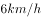、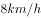、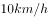。问：多少分钟后，他们恰好第一次同时到达各自的起跑位置？

- **A**. 18分钟
- **B**. 15分钟
- **C**. 12分钟
- **D**. 9分钟　✅

**答案**：D

**官方解析**

由题意，三个人的速度分别为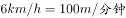、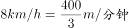、。他们恰好第一次同时到达各自的起跑位置即经过相同的时间各自均跑了整数圈，由于是第一次，从时间最小的选项代入，D项：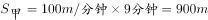；;。可以看出这些路程都是300米的整数倍，即三人均跑了整数圈，满足题意。

故正确答案为D。

---

### 第 2 题　qid 2456427 · 数学运算

台风中心自A地出发，以的速度向东偏北方向移动，距台风中心范围内的地区均受台风影响。城市B在A的正东方向处，则城市B受台风影响持续的时间为：

- **A**. 0.8h　✅
- **B**. 1h
- **C**. 1.5h
- **D**. 1.6h

**答案**：A

**官方解析**

由题意，如图所示，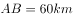，过B作垂线于C点。在直角△ABC中，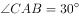，则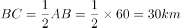。又距台风中心30km范围内的地区均受台风影响，也就是说台风刚好刮过，不形成时间段。

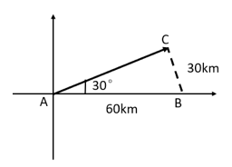

故本题无正确答案，暂以A项代替。

---

### 第 3 题　qid 2456437 · 数学运算

家用小汽车属消耗品。一辆新车购买费用为15万元，根据经验，自购买时算起，第年的维修费用为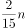万元，每年的油耗等其他费用为1万元，则该车的年平均消耗费用最低为：

- **A**. 
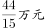

- **B**. 

　✅
- **C**. 
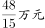

- **D**. 

**答案**：B

**官方解析**

由题意，设该汽车可以使用n年，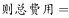，其中维修费是一个公差为的等差数列，根据等差数列求和公式，可得。则该车的年平均消耗费用为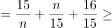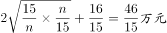。

故正确答案为B。

---

### 第 4 题　qid 2456442 · 数学运算

三组对棱长分别相等的四面体叫等腰四面体。已知一个等腰四面体的三组棱长分别为1、2、3，则其外接球的半径为：

- **A**. 

- **B**. 

- **C**. 
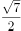
　✅
- **D**. 

**答案**：C

**官方解析**

方法一：由题意，构造一个长方体ABCD- A&#39;B&#39;C&#39;D&#39;，使得，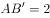，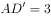，则等腰四面体AB&#39;CD&#39;正好满足对棱相等，棱长分别为1，2，3；该等腰四面体的外接球即长方体的外接球，长方体外接球的半径为体对角线的一半，即。

由勾股定理可得：

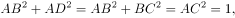

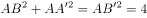,

,

三式相加除以2,可得：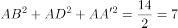，由于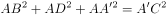，则，那么。

因此该三棱锥外接球的半径为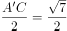。

方法二：等腰四面体模型公式，外接球半径，其中、、为等腰四面体的三组棱长。由题意，，，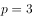，代入公式，。

故正确答案为C。

备注：由于四面体的面为三角形，那么等腰四面体的三组棱长应该也可以构成三角形，但是本题出题人在设置数据时未考虑到这点，所以导致三组棱长1、2、3无法构成三角形。

---

### 第 5 题　qid 2456445 · 数学运算

从4种不同的颜色中选取若干种颜色给图中A、B、C、D、E五个封闭区域涂色，相邻两个区域不同色。问：涂色方法总共有多少种？

- **A**. 108　✅
- **B**. 106
- **C**. 98
- **D**. 96

**答案**：A

**官方解析**

方法一：由题意，如果C、E区域不同色，则4种颜色涂B、C、D、E区域有，A区域只需跟B不同色，从剩下3种选1种即，涂色方法共有。如果C、E区域同色，则B、C、D区域有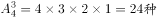，A区域只需跟B不同色，从剩下3种选1种即，涂色方法共有。因此，涂色方法共有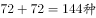。

 方法二：A区域可从4种颜色中选1种有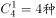；B区域与A区域不同，可从剩下3种颜色中选1种有；C区域与B区域不同，可从剩下3种颜色中选1种有；D区域与B、C区域不同，可从剩下2种颜色中选1种有；E区域与B、D区域不同，可从剩下2种颜色中选1种有；因此涂色方法共有。

故本题无正确选项，暂以A项代替。

---

## 判断推理

### 第 1 题　qid 2456403 · 定义判断

同化效应，是指人们的态度和行为逐渐接近参照群体或参照人员的态度和行为的过程，是个体在潜移默化中对外部环境的一种不自觉的调适。
根据上述定义，下列符合同化效应的是：

- **A**. 人同此心，心同此理
- **B**. 近朱者赤，近墨者黑　✅
- **C**. 人心不同，各如其面
- **D**. 上之所好，下必从之

**答案**：B

**官方解析**

第一步：找出定义关键词。
“态度和行为逐渐接近参照群体或参照人员的态度和行为”、“个体在潜移默化中对外部环境的一种不自觉的调适”。
第二步：逐一分析选项。
A项：指合情合理的事，大家想法都会相同，不符合“态度和行为逐渐接近参照群体或参照人员的态度和行为”，不符合定义，排除； 
B项：靠着朱砂的变红，靠着墨的变黑。比喻接近好人可以使人变好，接近坏人可以使人变坏。符合“态度和行为逐渐接近参照群体或参照人员的态度和行为”、“个体在潜移默化中对外部环境的一种不自觉的调适”，符合定义，当选；
C项：人的内心世界各不相同，不符合“态度和行为逐渐接近参照群体或参照人员的态度和行为”，不符合定义，排除；
D项：在上的人喜欢什么，在下的人就一定会跟着做。是下级跟着上级的喜好做事，不符合“个体在潜移默化中对外部环境的一种不自觉的调适”，不符合定义，排除。
故正确答案为B。

---

### 第 2 题　qid 2456438 · 定义判断

空白效应，是关于艺术作品审美欣赏的概念。它指的是作品留给读者想象和再创造的空间，读者可以凭借自身的文化素养展开思考，从而获得对作品更深层次的理解和把握。
根据上述定义，下列可以反映空白效应的是：

- **A**. 心有灵犀一点通
- **B**. 一片冰心在玉壶
- **C**. 道是无晴却有晴
- **D**. 此时无声胜有声　✅

**答案**：D

**官方解析**

第一步：找出定义关键词。
“作品留给读者想象和再创造的空间”、“读者可以凭借自身文化素养展开思考”、“获得对作品更深层次的理解和把握”。
第二步：逐一分析选项。
A项：心有灵犀一点通，比喻恋爱着的男女双方心心相印，不符合“作品留给读者想象和再创造的空间”、“读者可以凭借自身文化素养展开思考”、“获得对作品更深层次的理解和把握”，不符合定义，排除；
B项：一片冰心在玉壶，意思是“我的心依然像玉壶里的冰一样纯洁，未受功名利禄等世情的玷污”，不符合“作品留给读者想象和再创造的空间”、“读者可以凭借自身文化素养展开思考”、“获得对作品更深层次的理解和把握”，不符合定义，排除；
C项：道是无晴却有晴，这里用双关的修辞法，以“晴”代“情”，暗指郎所唱的歌中看似无感情表白却饱含着对意中恋人的一片深情，不符合“作品留给读者想象和再创造的空间”、“读者可以凭借自身文化素养展开思考”、“获得对作品更深层次的理解和把握”，不符合定义，排除；
D项：此时无声胜有声，指的是默默无声却比有声更感人，符合“作品留给读者想象和再创造的空间”、“读者可以凭借自身文化素养展开思考”、“获得对作品更深层次的理解和把握”，符合定义，当选。
故正确答案为D。

---

### 第 3 题　qid 2456439 · 定义判断

珠蛋白生成障碍性贫血，又称地中海贫血，是一组遗传性溶血性贫血疾病，是由于遗传的基因缺陷致使血红蛋白中一种或一种以上珠蛋白链合成缺失或不足所导致的贫血或病理状态。基因缺陷的复杂性与多样性，使缺乏的珠蛋白链类型、数量及临床症状变异性较大。珠蛋白生成障碍性贫血根据所缺乏的珠蛋白链种类及缺乏程度予以命名和分类。
根据上述定义，下列判断错误的是：

- **A**. 珠蛋白生成障碍性贫血具有遗传性
- **B**. 珠蛋白生成障碍性贫血是基因疾病
- **C**. 珠蛋白生成障碍性贫血高发于地中海地区　✅
- **D**. 珠蛋白生成障碍性贫血可以分为不同类型

**答案**：C

**官方解析**

第一步：找出定义关键词。
“遗传性溶血性疾病”、“由于遗传的基因缺陷致使血红蛋白一种或一种以上珠蛋白链合成缺失或不足所导致的贫血或病理状态”、“根据缺乏的珠蛋白链种类及缺乏程度予以命名和分类”。
第二步：逐一分析选项。
A项：珠蛋白生成障碍性贫血具有遗传性，符合“遗传性溶血性疾病”，符合“由于遗传的基因缺陷”，说明具有遗传性，符合定义，排除；
B项：珠蛋白生成障碍性贫血是基因疾病，符合“由于遗传的基因缺陷所导致的贫血或病理状态”，说明此病是遗传的基因缺陷所致，是基因疾病，符合定义，排除；
C项：珠蛋白生成障碍性贫血高发于地中海地区，题干中只是说此病又称地中海贫血，但不代表高发于地中海地区，不符合定义，当选；
D项：珠蛋白生成障碍性贫血可以分为不同类型，符合“根据缺乏的珠蛋白链种类及缺乏程度予以命名和分类”，既然此病会根据缺乏的种类及程度命名和分类，说明此病可以分为不同类型，符合定义，排除。
本题为选非题，故正确答案为C。

---

### 第 4 题　qid 2456440 · 定义判断

深海恐惧症，属于恐惧症的一种，总的来说与患者过去的恐惧经历有很大的关系。这样的恐惧症患者往往是因为害怕无法逃离所处的情况而感到恐惧。深海恐惧症多数都会让人感觉自己处于一个密闭的空间中难以逃脱。很多人都清楚地知道自己的这种深海恐惧症是过分焦虑的，有时甚至知道这种恐惧感是完全没有必要的，但是却总会不由自主地有一些深海恐惧症的表现。
根据上述定义，下列属于深海恐惧症的是：

- **A**. 小陈在看过有关森林的恐怖片后，便不敢再看有关森林的电影、图片、视频等　✅
- **B**. 小盛在准备首次公务员面试时，总是会梦见自己在面试中因过于紧张而答非所问
- **C**. 小李在参加测试时没有通过，便开始使自己一直处于高强度的学习和焦虑之中
- **D**. 小伍总是不参加单位组织的体检，担心会在体检中查出身体某些地方有问题

**答案**：A

**官方解析**

第一步：找出定义关键词。
“与患者过去的恐惧经历有很大的关系”、“因为害怕无法逃离所处的情况而感到恐惧”、“感觉自己处于一个密闭的空间中难以逃脱”。
第二步：逐一分析选项。
A项：小陈看过森林的恐怖片，符合“过去的恐惧经历”，再不敢看有关森林的电影、图片等，是因为对森林感到恐惧，害怕无法逃离，符合定义，当选；
B项：小盛准备首次公务员面试时，梦到答非所问，说明此时还没有面试，不符合“过去的恐惧经历”，不符合定义，排除；
C项：小李参加测试没有通过，体现了过去的经历，但并非是恐惧的经历，不符合定义，排除；
D项：小伍总不参加单位的体检，担心查出身体问题，没有体现过去的恐惧经历，不符合定义，排除。
故正确答案为A。

---

### 第 5 题　qid 2456443 · 定义判断

挂靠经营，是指企业、合伙组织、个体户或者自然人与另外的一个经营主体达成挂靠协议，然后挂靠的企业、合伙组织、个体户或者自然人以被挂靠的经营主体的名义对外从事经营活动，被挂靠方提供资质、技术、管理等方面的服务并定期向挂靠方收取一定管理费用的经营方式。
根据上述定义，下列不属于挂靠经营的是：

- **A**. 甲将车辆登记在某个具有运输经营权资质的单位名下，以单位的名义进行运营，并支付一定的管理费用
- **B**. 乙加盟了一家连锁奶茶店，按约定乙使用统一的加盟商标对外营业，奶茶店向乙收取材料和技术管理费
- **C**. 丙研究生毕业后在律师事务所工作，一般由律师事务所和委托人签订代理合同并写明费用，然后由丙代理委托人处理相关事务　✅
- **D**. 丁和某公司达成协议，丁按照该公司的质量标准和名义对外供货，该公司向丁收取相应的产品质量管理费

**答案**：C

**官方解析**

第一步：找出定义关键词。
“挂靠方以被挂靠方的名义对外从事经营活动”、“被挂靠方提供资质、技术、管理等方面的服务并向挂靠方收取一定的管理费用”。
第二步：逐一分析选项。
A项：甲以具有运输资质的公司的名义运营，符合“挂靠方以被挂靠方的名义对外从事经营活动”，甲支付一定的管理费用，符合“被挂靠方提供资质、技术、管理等方面的服务并向挂靠方收取一定的管理费用”，符合定义，排除；
B项：乙使用连锁奶茶店统一的加盟商标对外营业，符合“挂靠方以被挂靠方的名义对外从事经营活动”，奶茶店向乙收取一定的材料和技术管理费，符合“被挂靠方提供资质、技术、管理等方面的服务并向挂靠方收取一定的管理费用”，符合定义，排除；
C项：丙研究生毕业后在律师事务所工作，不符合“挂靠方以被挂靠方的名义对外从事经营活动”，不符合定义，当选；
D项：丁按照某公司的质量标准和名义对外供货，符合“挂靠方以被挂靠方的名义对外从事经营活动”，该公司向丁收取质量管理费，符合“被挂靠方提供资质、技术、管理等方面的服务并向挂靠方收取一定的管理费用”，符合定义，排除。
本题为选非题，故正确答案为C。

---

### 第 6 题　qid 2456424 · 逻辑判断

在自闭症小鼠出生三周后给它们喂食一定剂量的罗伊氏乳杆菌，持续四周，然后测试小鼠的社交行为。与没有喂食罗伊氏乳杆菌的自闭症小鼠相比，实验组的社交行为完全恢复到了正常小鼠的水平。如果切断了自闭症小鼠的迷走神经，再对自闭症小鼠使用罗伊氏乳杆菌则完全无法改善它们的社交行为。
以下哪项如果为真，最能解释上述现象？

- **A**. 自闭症小鼠脑中的催产素水平比正常小鼠低
- **B**. 自闭症小鼠的肠道微生物与正常小鼠相比存在明显的差异
- **C**. 罗伊氏乳杆菌通过连接肠道和大脑的“桥梁”迷走神经作用于大脑　✅
- **D**. 经过罗伊氏乳杆菌处理的自闭症小鼠恢复到了正常水平

**答案**：C

**官方解析**

第一步：找出题干矛盾。
自闭症小鼠通过喂食罗伊氏乳杆菌可以恢复正常社交水平，但是切断自闭症小鼠的迷走神经后，罗伊氏乳杆菌无法改善他们的社交行为。
第二步：逐一分析选项。
A项：催产素和罗伊氏乳杆菌以及迷走神经的关系并不清楚，不能解释题干矛盾，排除；
B项：只是说明了自闭症小鼠和正常小鼠的不同之处，但是与迷走神经无关，不能解释题干矛盾，排除；
C项：说明迷走神经是罗伊氏乳杆菌能够通过肠道作用于大脑的关键，没有迷走神经罗伊氏乳杆菌就不能作用于大脑，也就不能影响社交行为，可以解释题干矛盾，当选；
D项：只是重复了题干的内容，但是没有说明与迷走神经的关系，不能解释题干矛盾，排除。
故正确答案为C。

---

### 第 7 题　qid 2456425 · 逻辑判断

冬季来临，某社区的志愿者组织了一场为流浪人员送温暖的义捐活动，在众多义捐物品中，有两床棉被的捐赠者没有留下姓名。根据工作人员回忆，可以断定是小张、小郑、小胡、小黄中的两个人捐的。面对询问，四个人分别说了一句话。小张说：“不是我捐的。”小黄说：“是小胡捐的。”小郑说：“是小黄捐的。”小胡说：“我没有捐。”
如果这四人中，有两人说的是假话，有两人说的是真话，那么以下可能为真的是：

- **A**. 如果小黄是捐赠者，那么小张就不是捐赠者
- **B**. 如果捐赠者不是小张，那就一定是小黄
- **C**. 捐赠棉被的是小郑和小胡　✅
- **D**. 捐赠棉被的是小郑和小黄

**答案**：C

**官方解析**

第一步：找出题干矛盾关系。

①小张：小张捐的

②小黄：小胡捐的

③小郑：小黄捐的

④小胡：小胡捐的

题干第②句“小胡捐的”和第④句“小胡捐的”互为矛盾关系，已知矛盾关系必有一真一假，题干两真两假，故剩下来的第①句“小张捐的”和第③句“小黄捐的”也是一真一假。

第二步：逐一分析选项。

A项：如果小黄是捐赠者，那么小张就不是捐赠者，结合条件等同于如果第③句是真的，那么第①句是真的，与第①句和第③句“一真一假”不符，不能推出，排除；

B项：如果捐赠者不是小张，那就一定是小黄，与A项同理，结合条件等同于如果第①句是真的，那么第③句是真的，与第①句和第③句“一真一假”不符，不能推出，排除；

C项：捐赠棉被的是小郑和小胡，若此句话成立，可知题干第①②句为真、第③④句为假，满足题干已知条件“两真两假”，可以推出，当选；

D项：捐赠棉被的是小郑和小黄，若此句话成立，可知题干第①③④句为真、第②句为假，不满足题干已知条件“两真两假”，不能推出，排除。

故正确答案为C。

---

### 第 8 题　qid 2456430 · 逻辑判断

为了解当下大学生对军事的关注程度，某教授列举了20种军事装备，请30位大学生识别。结果显示，多数人只识别出2到6种装备，极少数人识别出15种以上，甚至有人全部都不能识别。其中“海鹞战斗机”的辨识率最高，30人中有19人识别正确；“舰载式战斗机”所有人都未能识别。20种军事装备的整体识别错误率超过。该实验者由此得出，当代大学生对军事的关注程度并没有提高，甚至有所下降。

以下哪项如果为真，最能对该教授的结论构成质疑？

- **A**. 
教授选取的20种军事装备不具有代表性
　✅
- **B**. 
教授选取的30位大学生均不是军事院校的学生

- **C**. 
“舰载式战斗机”这种战斗装备有些军事迷也未能识别

- **D**. 
教授选取的30位大学生中约有对军事不感兴趣

**答案**：A

**官方解析**

第一步：找出论点和论据。

论点：当代大学生对军事的关注程度并没有提高，甚至有所下降。

论据：某教授所做的让30名大学生识别20种军事装备的实验结果。

本题论点说的当代大学生对军事的关注程度并没有提高，甚至有所下降。而论据是某教授所做的让30名大学生识别20种军事装备的实验结果。论点论据话题一致，并且本题属于论据为实验调查类的题目，因此可以优先考虑削弱论据。

第二步：逐一分析选项。

A项：教授选取的20种军事设备不具有代表性，也就是说实验样本选择不合理，是对论据的削弱，可以削弱，当选；

B项：该项说选取的大学生不是军事院校的，论点就讨论当代大学生对军事的关注程度，选取的样本只要是大学生就可以，至于是不是来自军事学校并不重要，无法削弱，排除；

C项：该项说的是“舰载式战斗机军事迷也不一定认识”，也就是说其中一种军事武器的选择不合理，不具有代表性，有削弱的意思，但是只提出一种武器不具有代表性，不如A项直接明确，排除；

D项：该项说选取的大学生有对军事不感兴趣，说明在选择样本的时候既选了对军事感兴趣的，又选了对军事不感兴趣的，证明了样本选择的多样性，不能削弱，排除。

故正确答案为A。

---

### 第 9 题　qid 2456431 · 逻辑判断

在人工智能计算能力大幅提升的今天，乐观派们认为AI接管医院只是时间问题，然而从实验室到医院的这段路，依然困难重重。
以下哪项如果为真，最有可能削弱上述观点？

- **A**. 人们需要对机器能做什么、不能做什么有清晰的认识。目前AI的主要成就，是给人类医生的判断打底子，而不是自行下达判断
- **B**. 有的病变本身也十分罕见，根本无法形成值得信赖的数据库，现在还无法像训练一个真正的医生一样训练AI
- **C**. 由于糖尿病十分常见，数据积累丰富，再加上对于病变的判定相对简单，使用AI技术诊断糖尿病人的眼底病变已经得以实现　✅
- **D**. 人和机器的决策方式并不相同，传统的自动化系统只能在事先设好的规则内行事，超出规则就无能为力了

**答案**：C

**官方解析**

第一步：找出论点和论据。
论点：从实验室到医院的这段路，依然困难重重。
无明显论据。
本题只有论点，要想削弱，考虑直接否定论点，即实验室到医院这段路，没有困难重重，医院中已经可以使用AI技术。
第二步：逐一分析选项。
A项：强调目前AI还不能自行下达判断，那么确实从实验室到医院的这段路，依然困难重重，具有加强作用，无法削弱，排除；
B项：强调无法像训练医生一样训练AI，那么AI技术确实还不能够很好的使用起来，具有加强作用，无法削弱，排除；
C项：指出AI技术现在已经可以利用AI技术诊断糖尿病人的眼底病变，那么从实验室到医院的这段路，就没有困难重重，举反例否定论点，可以削弱，当选；
D项：强调人和机器的决策方式不同，传统的自动化系统只能在规则内行事，没有涉及AI技术，无关项，排除。
故正确答案为C。

---

### 第 10 题　qid 2456433 · 逻辑判断

人们常认为白色的花比红色的花香味更浓郁。近日有科学家通过对植物花青素含量以及花瓣油细胞数量的研究发现，红花的花瓣油细胞的数量只有白花的一半。由此，他们得出结论：白花比红花香味更浓郁。
以下哪项如果为真，最可能是科学家得出结论的前提？

- **A**. 黄花的花瓣油细胞的数量远高于红花，却与白花很接近
- **B**. 植物的花瓣油细胞的数量与植物的芳香程度呈正相关　✅
- **C**. 红花可用作节日庆典、表达心意等用途，视觉效果较好
- **D**. 白花的花瓣油细胞数量比红花多是因为白花比红花更耐晒

**答案**：B

**官方解析**

第一步：找出论点和论据。
论点：白花比红花香味更浓郁。
论据：红花的花瓣油细胞的数量只有白花的一半。
本题论点论据话题不一致，论证的前提就是在论点和论据之间搭桥。
第二步：逐一分析选项。
A项：黄花不是题干讨论的话题，无关排除；
B项：花瓣油细胞的数量与植物的芳香程度呈正相关，即是在论点和论据之间搭桥，当选；
C项：视觉效果与香味话题不一致，无关排除；
D项：没有提到花的香味，无关排除。
故正确答案为B。

---

## 资料分析

### 材料 1

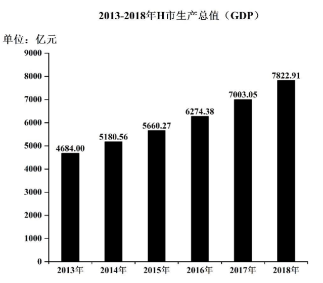

#### 第 1 题　qid 2456402 · 增长

2018年H市第一、第二、第三产业产值增长幅度最大与最小的产业分别是：

- **A**. 第一产业，第三产业
- **B**. 第二产业，第一产业
- **C**. 第三产业，第二产业
- **D**. 第三产业，第一产业　✅

**答案**：D

**官方解析**

根据题干“2018年，……增长幅度最大与最小的产业分别是”，可判定本题为一般增长率的比较问题。定位第二个统计图可知，2018年第一、第二、第三产业占GDP的比重依次是、、，2017年第一、第二、第三产业占GDP的比重依次是、、。设2018年H市GDP为A，2017年H市GDP为B。结合公式：，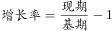，可得第一、第二、第三产业产值增长幅度如下：

第一产业：增长幅度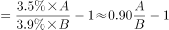；

第二产业：增长幅度；

第三产业：增长幅度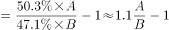；

比较可得，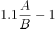，故增长幅度最大的是第三产业，最小的是第一产业。

故正确答案为D。

---

#### 第 2 题　qid 2456405 · 增长

2015-2018年，H市GDP增长最快的年份是：

- **A**. 2015年
- **B**. 2016年
- **C**. 2017年
- **D**. 2018年　✅

**答案**：D

**官方解析**

根据题干“2015-2018年，······增长最快的年份是”，可判定本题为一般增长率的比较问题。定位第一个统计图可知，2014-2018年H市GDP依次为5180.56亿元、5660.27亿元、6274.38亿元、7003.05亿元、7822.91亿元。根据公式：可知，2015-2018年H市GDP的增长率如下：

2015年：增长率；

2016年：增长率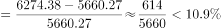；

2017年：增长率；

2018年：增长率。

则增长最快的年份是2018年。

故正确答案为D。

---

#### 第 3 题　qid 2456407 · 增长

2018年H市第三产业产值增加值约为：

- **A**. 321亿元
- **B**. 475亿元
- **C**. 546亿元
- **D**. 637亿元　✅

**答案**：D

**官方解析**

根据题干“2018年H市第三产业产值的增加值约为”，可判定本题为增长量的计算问题。定位统计图可知，2017年、2018年H市GDP分别为7003.05亿元、7822.91亿元；2017年、2018年第三产业占GDP的比重分别为、。根据公式：；，所求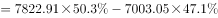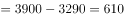亿元，与D项最接近。

故正确答案为D。

备注：本题问法不严谨，因为“增加值”在统计术语中指的就是产值，但本题题干已有“第三产业产值”，故推测这里的“增加值”指的是“增加额”，进而判断本题为增长量计算问题。

---

#### 第 4 题　qid 2456411 · 增长

与2013年相比较，2018年H市第二产业产值大约增长：

- **A**. 

- **B**. 

　✅
- **C**. 

- **D**. 

**答案**：B

**官方解析**

根据题干“与2013年相比较，2018年······大约增长”，结合选项为百分数，可判定本题为一般增长率的计算问题。定位统计图可知，2013年、2018年H市GDP分别为4684.00亿元、7822.91亿元；2013年、2018年第二产业占GDP的比重分别为、。根据公式：；，所求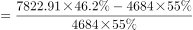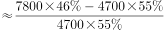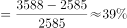，与B项最接近。

故正确答案为B。

---

#### 第 5 题　qid 2456417 · 综合

根据资料，下列判断正确的是：

- **A**. 
2013-2018年，H市生产总值年平均增长幅度超过
　✅
- **B**. 
2013-2018年，H市GDP增加值逐年增加

- **C**. 
2013-2018年，H市第一产业产值占GDP比重下降幅度呈上升趋势

- **D**. 
根据2013-2018年趋势，2019年H市第二产业产值占GDP比重将会下降

**答案**：A

**官方解析**

A项：定位第一个统计图可知，2013年、2018年H市GDP分别为4684.00亿元、7822.91亿元。代入年均增长率公式：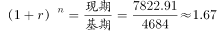，年份差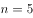，将代入原式，则有，则说明年均增长率，正确；

B项：定位第一个统计图可知，2013-2018年H市GDP依次为4684.00亿元、5180.56亿元、5660.27亿元、6274.38亿元、7003.05亿元、7822.91亿元。2014年GDP的增长量亿元，2015年GDP的增长量亿元，并非上升，错误；（备注：根据38题可知，本篇资料中的“增加值”指的并非“产值”，而是“增加额”）

C项：定位第二个统计图可知，各年份第一产业占GDP的比重。可以计算出2014年较2013年；2018年较2017年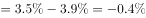。可以看出2013-2018年，H市第一产业产值占GDP比重下降幅度呈上升趋势。正确；（备注：趋势是比较时间段的两端，这样本题就没有唯一正确答案了。）

D项：定位第二个统计图可知，第二产业占GDP的比重为先上升后下降的趋势，因此2019年H市第二产业占GDP的比重不一定会下降，错误。

故正确答案为A。

---
