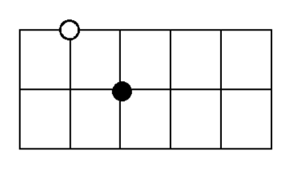
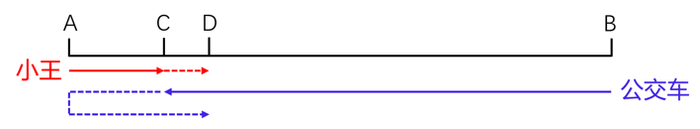
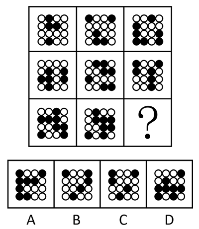
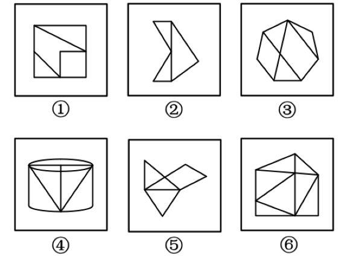
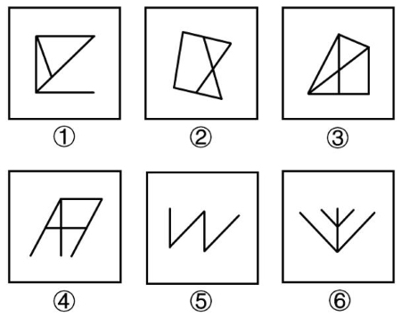
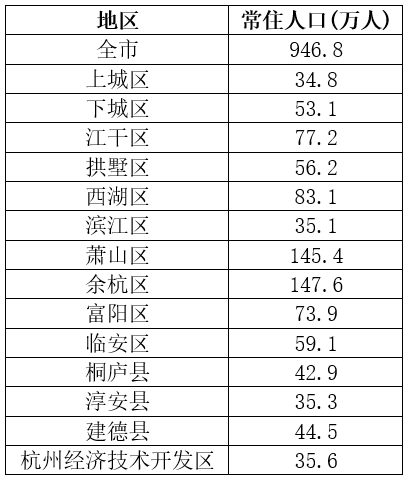

# 2021年度浙江省党政机关选调应届优秀大学毕业生《行测》题（网友回忆版）

> 选调生 · 2021 年 · 4 个模块 · 共 55 题

- [常识判断](#%E5%B8%B8%E8%AF%86%E5%88%A4%E6%96%AD) · 10 题
- [数量关系](#%E6%95%B0%E9%87%8F%E5%85%B3%E7%B3%BB) · 20 题
- [判断推理](#%E5%88%A4%E6%96%AD%E6%8E%A8%E7%90%86) · 15 题
- [资料分析](#%E8%B5%84%E6%96%99%E5%88%86%E6%9E%90) · 10 题

---

## 常识判断

### 第 1 题　qid 5832294 · 人文常识

下列说法不正确的是：

- **A**. 带领人民创造美好生活是党始终不渝的奋斗目标
- **B**. 党的一切工作必须以最广大人民的最根本利益为最高标准
- **C**. 中国共产党人的初心和使命是为中国人民谋幸福，为中华民族谋复兴
- **D**. 全面从严治党中的两个责任指领导班子主要负责人承担主要领导责任，其他班子成员承担重要领导责任　✅

**答案**：D

**官方解析**

本题考查政治常识。
A项正确，党的十九大报告中“八、提高保障和改善民生水平，加强和创新社会治理”部分指出：“全党必须牢记，为什么人的问题，是检验一个政党、一个政权性质的试金石。带领人民创造美好生活，是我们党始终不渝的奋斗目标。必须始终把人民利益摆在至高无上的地位，让改革发展成果更多更公平惠及全体人民，朝着实现全体人民共同富裕不断迈进。”
B项正确，党的十九大报告中“八、提高保障和改善民生水平，加强和创新社会治理”部分指出：“同志们！党的一切工作必须以最广大人民根本利益为最高标准。我们要坚持把人民群众的小事当作自己的大事，从人民群众关心的事情做起，从让人民群众满意的事情做起，带领人民不断创造美好生活！”
C项正确，党的十九大报告中指出：“不忘初心，方得始终。中国共产党人的初心和使命，就是为中国人民谋幸福，为中华民族谋复兴。这个初心和使命是激励中国共产党人不断前进的根本动力。全党同志一定要永远与人民同呼吸、共命运、心连心，永远把人民对美好生活的向往作为奋斗目标，以永不懈怠的精神状态和一往无前的奋斗姿态，继续朝着实现中华民族伟大复兴的宏伟目标奋勇前进。”
D项错误，《关于新形势下党内政治生活的若干准则》中“十二、保持清正廉洁的政治本色”部分指出：“落实党委主体责任和纪委监督责任，强化责任追究。党委（党组）主要负责人要认真履行第一责任人责任。党的各级组织要强化对党内政治生活准则落实情况的督促检查，建立健全问责机制，上级党组织要加强对下级党组织的指导监督检查，各级组织部门和机关党组织要加强日常管理，各级纪律检查机关要严肃查处违反党内政治生活准则的各种行为。”即全面从严治党中的两个责任指党委主体责任和纪委监督责任。
本题为选非题，故正确答案为D。

---

### 第 2 题　qid 5832280 · 人文常识

下列说法不正确的是：

- **A**. 发展是解决我国一切问题的基础和关键，发展必须坚持新发展理念
- **B**. 系统布局新型基础设施，加快第五代移动通信、工业互联网、大数据中心等建设
- **C**. 推进以经济建设为核心的新型城镇化，优化行政区划设置，发挥中心城市和城市群带动作用　✅
- **D**. 降低碳排放强度，支持有条件的地方率先达到碳排放峰值，制定2030年前碳排放达峰行动方案

**答案**：C

**官方解析**

本题考查政治常识。
A项正确，党的十九大报告中“三、新时代中国特色社会主义思想和基本方略”部分指出：“（四）坚持新发展理念。发展是解决我国一切问题的基础和关键，发展必须是科学发展，必须坚定不移贯彻创新、协调、绿色、开放、共享的发展理念。”
B项正确，《中共中央关于制定国民经济和社会发展第十四个五年规划和二〇三五年远景目标的建议》中：“四、加快发展现代产业体系，推动经济体系优化升级”部分指出：“14.统筹推进基础设施建设。构建系统完备、高效实用、智能绿色、安全可靠的现代化基础设施体系。系统布局新型基础设施，加快第五代移动通信、工业互联网、大数据中心等建设。”
C项错误，《国民经济和社会发展第十四个五年规划和2035年远景目标纲要》中“第八篇 完善新型城镇化战略 提升城镇化发展质量”部分指出：“坚持走中国特色新型城镇化道路，深入推进以人为核心的新型城镇化战略，以城市群、都市圈为依托促进大中小城市和小城镇协调联动、特色化发展，使更多人民群众享有更高品质的城市生活······破除资源流动障碍，优化行政区划设置，提高中心城市综合承载能力和资源优化配置能力，强化对区域发展的辐射带动作用。”即“推进以人为核心的新型城镇化战略”而不是“推进以经济建设为核心的新型城镇化”。
D项正确，《中共中央关于制定国民经济和社会发展第十四个五年规划和二〇三五年远景目标的建议》中“十、推动绿色发展，促进人与自然和谐共生”部分指出：“35.加快推动绿色低碳发展······降低碳排放强度，支持有条件的地方率先达到碳排放峰值，制定二〇三〇年前碳排放达峰行动方案。”
本题为选非题，故正确答案为C。

---

### 第 3 题　qid 5832350 · 人文常识

下列说法不正确的是：

- **A**. 四个意识是指政治意识、大局意识、核心意识、看齐意识
- **B**. 四个自信是指道路自信、理论自信、制度自信、文化自信
- **C**. 四个全面是指全面完成脱贫攻坚任务、全面建成小康社会、全面深化改革、全面依法治国　✅
- **D**. 两个维护是指坚决维护习近平总书记党中央的核心、全党的核心地位，坚决维护党中央权威和集中统一领导

**答案**：C

**官方解析**

本题考查政治常识。
A项正确，2016年1月29日，中共中央总书记习近平主持召开中央政治局会议时指出：“只有增强政治意识、大局意识、核心意识、看齐意识，自觉在思想上政治上行动上同以习近平同志为总书记的党中央保持高度一致，才能使我们党更加团结统一、坚强有力，始终成为中国特色社会主义事业的坚强领导核心。”
B项正确，2016年7月1日，中共中央总书记习近平在庆祝中国共产党成立95周年大会上的讲话中指出：“全党要坚定道路自信、理论自信、制度自信、文化自信。当今世界，要说哪个政党、哪个国家、哪个民族能够自信的话，那中国共产党、中华人民共和国、中华民族是最有理由自信的。有了‘自信人生二百年，会当水击三千里’的勇气，我们就能毫无畏惧面对一切困难和挑战，就能坚定不移开辟新天地、创造新奇迹。”
C项错误，《中国共产党第十九届中央委员会第五次全体会议公报》指出：“······协调推进全面建设社会主义现代化国家、全面深化改革、全面依法治国、全面从严治党的战略布局，坚定不移贯彻创新、协调、绿色、开放、共享的新发展理念，坚持稳中求进工作总基调······”
D项正确，《中共中央关于加强党的政治建设的意见》中“三、坚持党的政治领导”部分指出：“（四）坚决做到‘两个维护’。事在四方，要在中央。坚持和加强党的全面领导，最重要的是坚决维护党中央权威和集中统一领导；坚决维护党中央权威和集中统一领导，最关键的是坚决维护习近平总书记党中央的核心、全党的核心地位。”
本题为选非题，故正确答案为C。

---

### 第 4 题　qid 5832307 · 人文常识

下列说法不正确的是：

- **A**. 结婚年龄，男不得早于二十周岁，女不得早于十八周岁　✅
- **B**. 配偶、父母、子女和其他共同生活的近亲属为家庭成员
- **C**. 一方患有重大疾病的，应当在结婚登记前如实告知另一方
- **D**. 家庭应当树立优良家风，弘扬家庭美德，重视家庭文明建设

**答案**：A

**官方解析**

本题考查法律常识。
A项错误，根据《中华人民共和国民法典》第一千零四十七条规定：“结婚年龄，男不得早于二十二周岁，女不得早于二十周岁。”
B项正确，根据《中华人民共和国民法典》第一千零四十五条第三款规定：“配偶、父母、子女和其他共同生活的近亲属为家庭成员。”
C项正确，根据《中华人民共和国民法典》第一千零五十三条第一款规定：“一方患有重大疾病的，应当在结婚登记前如实告知另一方；不如实告知的，另一方可以向人民法院请求撤销婚姻。”
D项正确，根据《中华人民共和国民法典》第一千零四十三条第一款规定：“家庭应当树立优良家风，弘扬家庭美德，重视家庭文明建设。”
本题为选非题，故正确答案为A。

---

### 第 5 题　qid 5832296 · 人文常识

下列说法不正确的是：

- **A**. 二维码能够储存汉字信息
- **B**. 缺失部分区域的二维码仍可能被正确识别
- **C**. 以目前的使用速度，二维码将在10年内消耗殆尽　✅
- **D**. 黑白二维码可以通过添加颜色承载更多信息储存量

**答案**：C

**官方解析**

本题考查科技常识。
A项正确，二维码是用某种特定的几何图形按一定规律在平面（二维方向上）分布的黑白相间的记录数据符号信息的图形。二维码是一种比一维码更高级的条码格式，它能存储汉字、数字、图片等信息。
B项正确，二维码在发明时有“容错度”设计，二维码生成器会将部分信息重复表示来提高其容错度。所以即使缺失部分区域也可以扫描出来。
C项错误，虽然二维码的数量是有限的，但在目前的科技水平下，我们无需担心二维码被用尽的问题。随着科技的不断进步，可以通过改变像素点的大小和颜色等方式，进一步扩大二维码的数量。
D项正确，作为解决二维码技术和应用瓶颈而发展起来的新型条码技术，手机彩码是通过颜色和形状承载信息储存量，所包含的信息量是黑白二维码的几十倍，其应用比黑白二维码更加广泛。
本题为选非题，故正确答案为C。

---

### 第 6 题　qid 5832285 · 人文常识

下列说法不正确的是：

- **A**. 边际替代率——小郑既可以吃米饭，也可以吃面条，作用都是吃饱肚子　✅
- **B**. 机会成本——小刘如果选择养猪就不能选择养鸡，养猪的机会成本就是放弃养鸡的收益
- **C**. 边际效应递减——在小王吃饱的时候再塞给他一片油腻腻的比萨饼，吃到肚子里这块比萨饼的效用没有之前的食物大
- **D**. 沉没成本——如果小李预定了一张电影票，已经付了票款且不能退票，此时小李付的钱已经不能收回且不看电影钱也收不回来

**答案**：A

**官方解析**

本题考查经济常识。
A项错误，边际替代率是指两种物品可以按某种比率替换，在维持满足程度不变的前提下，消费者增加一单位的某一种物品所需放弃的另一种物品的消费数量的比率。米饭和面条的作用都是吃饱肚子，所以二者互为替代品，但所表现的并不是边际替代率的概念。
B项正确，机会成本是指企业为从事某项经营活动而放弃另一项经营活动的机会，或利用一定资源获得某种收入时所放弃的另一种收入。小刘如果选择养猪就不能选择养鸡，养猪的机会成本就是放弃养鸡的收益。
C项正确，边际效应递减是指消费者从该商品连续增加的每一消费单位中所得到的效用增量是递减的。在其他条件不变的前提下，当不断获得某一种同样的东西时，这件东西在个人心中的价值感在达到一定的程度后反而会降低。当小王吃饱之后，再塞给他一片油腻腻的比萨饼，这时比萨饼在小王心中的价值感会降低。
D项正确，沉没成本，或称沉淀成本或既定成本，是指已经付出且不可收回的成本。如果小李无法到达电影院，无法观看电影，因为不能退票所以钱收不回来，电影票所支出的这部分价钱就算作沉没成本。
本题为选非题，故正确答案为A。

---

### 第 7 题　qid 5832291 · 人文常识

下列说法不正确的是：

- **A**. 二十国集团——中国、南非、沙特阿拉伯
- **B**. 上海合作组织——印度、俄罗斯、巴基斯坦
- **C**. 亚太经济合作组织——韩国、美国、墨西哥
- **D**. 北大西洋公约组织——法国、巴西、澳大利亚　✅

**答案**：D

**官方解析**

本题考查经济常识。
A项正确，二十国集团由七国集团财长会议于1999年倡议成立，由中国、阿根廷、澳大利亚、巴西、加拿大、法国、德国、印度、印度尼西亚、意大利、日本、韩国、墨西哥、俄罗斯、沙特阿拉伯、南非、土耳其、英国、美国以及欧洲联盟等二十方组成。
B项正确，上海合作组织是2001年6月15日在中国上海宣布成立的永久性政府间国际组织。9个成员国分别是中国、俄罗斯、塔吉克斯坦、哈萨克斯坦、乌兹别克斯坦、巴基斯坦、伊朗、吉尔吉斯斯坦、印度。
C项正确，亚太经济合作组织，简称亚太经合组织（APEC），是亚太地区重要的经济合作论坛，也是亚太地区最高级别的政府间经济合作机构。截至2019年12月，亚太经济合作组织有21个成员，分别是澳大利亚、文莱、加拿大、智利、中国、中国香港、印度尼西亚、日本、韩国、墨西哥、马来西亚、新西兰、巴布亚新几内亚、秘鲁、菲律宾、俄罗斯、新加坡、中国台北、泰国、美国和越南。
D项错误，北大西洋公约组织，简称北约组织或北约，第二次世界大战后，美国为了遏制苏联，维护其在欧洲的主导地位，联合西欧一些国家于1949年4月4日正式成立了北大西洋公约组织。截至2023年4月4日，北大西洋公约组织有31个成员国：比利时、冰岛、丹麦、德国、法国、荷兰、加拿大、卢森堡、美国、挪威、葡萄牙、土耳其、西班牙、希腊、意大利、英国、波兰、匈牙利、捷克、爱沙尼亚、拉脱维亚、立陶宛、斯洛伐克、斯洛文尼亚、罗马尼亚、保加利亚、阿尔巴尼亚、克罗地亚、黑山、北马其顿、芬兰。
本题为选非题，故正确答案为D。

---

### 第 8 题　qid 5832290 · 人文常识

下列描写秋天的诗句是（    ）。

- **A**. 碧玉妆成一树高，万条垂下绿丝绦
- **B**. 天街小雨润如酥，草色遥看近却无
- **C**. 月落乌啼霜满天，江枫渔火对愁眠　✅
- **D**. 借问酒家何处有，牧童遥指杏花村

**答案**：C

**官方解析**

本题考查人文常识。
A项错误，“碧玉妆成一树高，万条垂下绿丝绦”出自唐代贺知章的《咏柳》，意思是高高的柳树长满了翠绿的新叶，轻柔的柳枝垂下来，就像万条轻轻飘动的绿色丝带。描写的是春天。
B项错误，“天街小雨润如酥，草色遥看近却无”出自唐代韩愈的《早春呈水部张十八员外》，意思是京城的街道上空丝雨纷纷，雨丝就像乳汁般细密而滋润，小草钻出地面，远望草色依稀连成一片，近看时却显得稀疏零星。描写的是春天。
C项正确，“月落乌啼霜满天，江枫渔火对愁眠”出自唐代张继的《枫桥夜泊》，意思是月亮已落下乌鸦啼叫寒气满天，江边枫树与船上渔火，难抵我独自傍愁而眠。描写的是秋天。
D项错误，“借问酒家何处有，牧童遥指杏花村”出自唐代杜牧的《清明》，意思是询问当地之人何处能买酒浇愁，牧童笑而不答指了指杏花深处的村庄。描写的是春天。
故正确答案为C。

---

### 第 9 题　qid 5832301 · 人文常识

下列说法不正确的是（    ）。

- **A**. 我国最早的国别体史书是《战国策》　✅
- **B**. 《左传》《公羊传》《谷梁传》合称“春秋三传”
- **C**. 《资治通鉴》记录的历史起于战国时期三家分晋
- **D**. 二十四史中的前四史分别是《史记》《汉书》《后汉书》《三国志》

**答案**：A

**官方解析**

本题考查人文常识。
A项错误，我国最早的国别体史书是《国语》，相传是春秋时期左丘明所撰的一部国别体著作。该著作记录范围为上起周穆王十二年（公元前990年）西征犬戎（约公元前947年），下至智伯被灭（公元前453年）。《战国策》，又称《国策》，为西汉刘向编订的国别体史书。
B项正确，《春秋三传》，是《春秋左氏传》《春秋公羊传》《春秋谷梁传》三本古代作品的合称。三传为《春秋》做注释，都是编年体史书。
C项正确，《资治通鉴》，是司马光奉宋英宗和宋神宗之命编撰的一部编年体通史。记事上起周威烈王二十三年（公元前403年），截止到后周世宗显德六年（959年），按照时间顺序记载了共16朝1362年的历史。公元前403年（周威烈王二十三年），周威烈王封三家晋大夫为诸侯。司马光的编年体史书《资治通鉴》的记载就从这一事件开始。
D项正确，二十四史是中国古代各朝撰写的二十四部正史的总称，均以纪传体编撰。其中《史记》《汉书》《后汉书》《三国志》，被称为“前四史”。
本题为选非题，故正确答案为A。

---

### 第 10 题　qid 5832286 · 地理国情

下列说法不正确的是：

- **A**. 白令海峡沟通太平洋和北冰洋
- **B**. 麦哲伦海峡沟通印度洋和大西洋　✅
- **C**. 马六甲海峡沟通太平洋和印度洋
- **D**. 直布罗陀海峡沟通地中海和大西洋

**答案**：B

**官方解析**

本题考查地理国情。
A项正确，白令海峡位于亚欧大陆最东端的俄罗斯杰日尼奥夫角和美洲大陆最西端的美国威尔士王子角之间，是沟通太平洋和北冰洋的水上通道，也是两大洲（亚洲和北美洲）、两个国家（俄罗斯和美国）、两个半岛（阿拉斯加半岛和楚科奇半岛）的分界线。
B项错误，麦哲伦海峡位于南美洲大陆最南端，由火地岛等岛屿围合而成，是南大西洋与南太平洋之间最重要的天然航道。苏伊士运河沟通地中海与红海，使大西洋经地中海和苏伊士运河与印度洋和太平洋连接起来，是一条具有重要经济意义和战略意义的国际航运水道。
C项正确，马六甲海峡是位于马来半岛与印度尼西亚的苏门答腊岛之间的漫长海峡，由新加坡、马来西亚和印度尼西亚三国共同管辖。海峡全长约1080千米，西北部最宽达370千米，东南部的新加坡海峡里最窄处只有37千米，是沟通太平洋与印度洋的国际水道。
D项正确，直布罗陀海峡，位于西班牙最南部和非洲西北部之间；最窄处在西班牙马罗基角和摩洛哥西雷斯角之间，宽仅14千米，是沟通大西洋和地中海的狭窄水道。
本题为选非题，故正确答案为B。

---

## 数量关系

### 第 1 题　qid 5832297 · 数学运算

某公园同时接待游客最大数量为6000人。从上午8点开门起，每1.5秒就有1名游客进入公园，每名游客在公园游玩的时间为4小时。公园从10点开始对游客进行限流，问进入公园的速度控制在每多少秒进一个游客，才能保证在中午12点前接待数量不超过最大值的前提下尽可能多地接待游客？

- **A**. 5
- **B**. 6　✅
- **C**. 7.5
- **D**. 9

**答案**：B

**官方解析**

公园上午8点开门，每名游客游玩4小时，即中午12点前没有游客离开公园。要想保证中午12点前接待数量不超过最大值，只需保证中午12点前进入公园的游客总数不超过最大值即可。

设限流后每x秒进一名游客。最初每1.5秒有1名游客进入公园，10点时已有名游客，之后2小时进入公园的游客数需不超过6000-4800=1200人，即，解得，即控制在每6秒进一名游客，才能保证在中午12点前接待数量不超过最大值的前提下尽可能多地接待游客。

故正确答案为B。

---

### 第 2 题　qid 5832292 · 数学运算

甲、乙、丙3人合作完成一项工作，原计划15天完成。甲工作2天后请假离开，剩下两个人又工作8天后正好完成一半工作。此时丙退出，甲再回来，又用15天正好完成工作。问如果丙单独完成工作，需要多少天？

- **A**. 30　✅
- **B**. 36
- **C**. 40
- **D**. 48

**答案**：A

**官方解析**

由题意可知，工作总量=（甲+乙+丙）×15······①；丙退出前，······②；丙退出后，······③。联立①③可得：工作总量=丙×30，则如果丙单独完成工作，需要30天。

故正确答案为A。

---

### 第 3 题　qid 5832313 · 数学运算

一个自然数列的第一项与第二项互质，且第一项的恰好是第二项的，从第三项开始，每一项是前两项之和。问这个数列的第2019项被4除所得的余数是多少？

- **A**. 0
- **B**. 1　✅
- **C**. 2
- **D**. 3

**答案**：B

**官方解析**

由题意可知，，整理为，又因为这两项互质，则第一项与第二项分别为6、7。该数列为6、7、13、20、33、53、86、139、225······，被4除所得的余数依次是2、3、1、0、1、1、2、3、1······，是周期为2、3、1、0、1、1的周期数列。，则第2019项被4除所得的余数是1。

故正确答案为B。

---

### 第 4 题　qid 5832317 · 数学运算

一条货船在静水中的速度是另一条客船的80%。如货船从上游A港口出发前往下游B港口，而客船从B前往A，两船到达目的地，均立刻返航。已知两船正好在AB中点位置第一次相遇，第二次在C点相遇。问BC与AC距离的比值是多少？

- **A**. 4：5
- **B**. 5：9
- **C**. 7：11　✅
- **D**. 12：2

**答案**：C

**官方解析**

设客船静水速度为，则货船静水速度为。货船出发时为顺水，客船为逆水，根据“两船正好在AB中点位置第一次相遇”可知，两条船出发时的速度相同，即，化简得。两船同时到达目的地后，立即返航，此时货船为逆水，行驶速度为，客船为顺水，行驶速度为。时间相同时，速度与路程成正比，则。

故正确答案为C。

---

### 第 5 题　qid 5832318 · 数学运算

如图所示，大正方形ABCD边长16厘米，小正方形DEFG边长8厘米。问以A、B、C、D、E、F、G中的3个点为顶点，构成面积是128平方厘米的三角形一共有多少个？

- **A**. 2
- **B**. 5
- **C**. 6　✅
- **D**. 7

**答案**：C

**官方解析**

若想构成面积是128平方厘米的三角形，则底×高=128×2=256，结合大正方形与小正方形边长，可知所构成的三角形底与高均为16厘米，分别为、、、、、，共6个。

故正确答案为C。

备注：结合选项，推测命题人意图指的三个顶点所构成的三角形应该只考虑了大正方形某一条边为底，连接另一个点构成三角形的情况，因此正确答案应为6个。否则，除了解析当中的6个以外，还包括和，那么答案即为8个，但本题选项并未设置。

---

### 第 6 题　qid 5832315 · 数学运算

如图所示，将一颗白子和一颗黑子放在棋盘线交叉点上，且不在同一条棋盘线上，共有多少种不同的放法？

- **A**. 40
- **B**. 72
- **C**. 90
- **D**. 180　✅

**答案**：D

**官方解析**

由图可知，棋盘上共有18个可以放置棋子的位置，先选定白子的位置，有18种情况，此时与白子不同行不同列的位置还剩下10个，即黑子有10种选择。分步用乘法，可知共有18×10=180种不同的放法。
故正确答案为D。

---

### 第 7 题　qid 5832323 · 数学运算

小张五次输入四位数的手机密码均错误：3850、6409、4965、9576、7694。已知他每次输入的密码中均有两位数字正确，但位置都不对。
问正确的手机密码是多少？

- **A**. 5047　✅
- **B**. 5346
- **C**. 5743
- **D**. 8743

**答案**：A

**官方解析**

方法一：观察这五个四位数发现，数字6和9均在四个位置上分别出现一次。若6和9是正确数字但位置不对，则没有其他位置可选，说明6和9一定不是正确的数字。观察6409、4965、9576、7694这四个数字，6、9不是正确数字，则4、0、5、7是正确密码的四个数字，结合选项，只有A项符合。
方法二：代入排除法。
A项：若正确的手机密码是5047，则五次输入的密码中两位正确数字分别为5和0、4和0、4和5、5和7、7和4，且位置都不对，符合题意，当选；
B项：若正确的手机密码是5346，则第三次输入的密码中正确数字有4、6、5这三个数字，不符合题意，排除；
C项：若正确的手机密码是5743，则第二次输入的密码中正确数字仅有4这一个数字，不符合题意，排除；
D项：若正确的手机密码是8743，则第二次输入的密码中正确数字仅有4这一个数字，不符合题意，排除。
故正确答案为A。

---

### 第 8 题　qid 5832320 · 数学运算

某社区为受灾地区捐款捐物，有80%的人员参加了此项活动，30%的人员捐了物品，70%的人员捐了款，则该社区既捐物品又捐款的人员占该社区人员的比例为多少？

- **A**. 15%
- **B**. 20%　✅
- **C**. 21%
- **D**. 25%

**答案**：B

**官方解析**

根据两集合容斥原理公式：，代入数据可得：30%+70%-既捐物品又捐款的人员占该社区人员的比例=80%，则既捐物品又捐款的人员占该社区人员的比例=20%。

故正确答案为B。

---

### 第 9 题　qid 5832339 · 数学运算

电子狗和机器猫以4：3的速度同时从走廊的A、B两端出发相向而行，相遇后，电子狗的速度降低25％，机器猫的速度增加25％。当电子狗到达走廊B端时，机器猫离走廊A端还有1.5米，那么走廊的A、B两端相距多少米？

- **A**. 21
- **B**. 27
- **C**. 35
- **D**. 42　✅

**答案**：D

**官方解析**

电子狗和机器猫以4：3的速度相向而行，从出发至相遇所用时间相等。根据“时间一定，路程与速度成正比”可得，电子狗和机器猫从出发至相遇所走路程比=速度比=4∶3。设电子狗和机器猫从出发至相遇所走路程分别为4S米、3S米。从相遇至电子狗到达走廊B端这一时间段内，电子狗所走路程为3S米，机器猫所走路程为（4S-1.5）米，电子狗与机器猫的速度比，故可列式：，解得：S=6，则走廊的A、B两端相距4S+3S=7S=7×6=42米。

故正确答案为D。

---

### 第 10 题　qid 5832344 · 数学运算

电商促销期间，某快递网点每天需要分拣的快递量比平时增加了2倍，网点除4名原有的固定分拣员外又招聘了6名临时分拣员，且每名分拣员每天工作时间从8小时增加到12小时才能完成工作。问临时分拣员和固定分拣员的工作效率之比是多少？

- **A**. 1：2
- **B**. 2：3　✅
- **C**. 3：4
- **D**. 4：5

**答案**：B

**官方解析**

赋值每名固定分拣员的工作效率为1，根据题意可知，平时该网点的4名固定分拣员每天工作8小时可完成分拣工作，则平时该网点每天需要分拣的快递量为4×1×8=32。设每名临时分拣员的工作效率为x，电商促销期间每天需要分拣的快递量为（4×1+6x）×12=48+72x。因电商促销期间该网点每天需要分拣的快递量比平时增加了2倍，即每天需要分拣的快递量是平时的3倍，48+72x=32×3，解得，则临时分拣员和固定分拣员的工作效率之比为。

故正确答案为B。

---

### 第 11 题　qid 5832343 · 数学运算

一个两层的陈列柜每层各有4个陈列格，先将3件不同的木雕和4件不同的瓷器分别放入不同的陈列格中，要求任意两件木雕上下左右均不相邻，且空的格子不能在下层。请问不同的陈列方式种数在以下哪个范围内？

- **A**. 不到1000
- **B**. 1000~2000
- **C**. 2001~4000
- **D**. 超过4000　✅

**答案**：D

**官方解析**

根据题意，两层的陈列柜如下图所示：

任意两件木雕上下左右均不相邻，则3件木雕不能放在同一层，可分为上层放有2件木雕或下层放有2件木雕两种情况讨论：

如果任意选择2件木雕放在上层，且因木雕上下左右均不能相邻，只能放在①③、①④或②④陈列格中，情况数为，另外1件木雕放在下层且上方无木雕的陈列格中，情况数为；此时下层有3个空的格子，因空的格子不能在下层，任意选择3件瓷器放在下层，情况数为，另外1件瓷器放在上层（还剩2个空的格子），情况数为。分步用乘法，即如果上层放了2件木雕的陈列方式有种。

如果任意选择2件木雕放在下层，同理，只能放在⑤⑦、⑤⑧或⑥⑧陈列格中，情况数为，另外1件木雕放在上层且下方无木雕的陈列格中，情况数为；此时下层有2个空的格子，因空的格子不能在下层，任意选择2件瓷器放在下层，情况数为，另外2件瓷器放在上层（还剩3个空的格子），情况数为。分步用乘法，即如果上层放了2件木雕的陈列方式有种。

分类用加法，则陈列方式共有1728+2592=4320种。

故正确答案为D。

---

### 第 12 题　qid 5832375 · 数学运算

某企业从年初开始第一代产品的升级换代研发，每次研发的周期为7个月。如果研发成功，立刻开展下一代产品的研发，如果失败，研发需要重新开始。已知第二代产品的研发成功率为80%，往后每代产品的研发成功率都比上一代降低10个百分点。问该企业在第三年年底前成功研发出第五代产品的概率在以下哪个范围内？

- **A**. 不到35%
- **B**. 35%~45%　✅
- **C**. 45%~55%
- **D**. 超过55%

**答案**：B

**官方解析**

根据题意，从第二代到第五代产品，需经历4次研发成功，成功率依次为80%、70%、60%、50%。从年初到第三年年底共有12×3=36个月，每次研发的周期为7个月，最多经历5个研发周期，即最多有1个周期研发失败。分情况讨论：
无研发失败情形，概率为80%×70%×60%×50%=16.8%；
第二代产品研发时失败1次，概率为（1-80%）×80%×70%×60%×50%=0.2×16.8%；
第三代产品研发时失败1次，概率为80%×（1-70%）×70%×60%×50%=0.3×16.8%；
第四代产品研发时失败1次，概率为80%×70%×（1-60%）×60%×50%=0.4×16.8%；
第五代产品研发时失败1次，概率为80%×70%×60%×（1-50%）×50%=0.5×16.8%；
分类用加法，题目所求为（1+0.2+0.3+0.4+0.5）×16.8%=40.32%。
故正确答案为B。

---

### 第 13 题　qid 5832349 · 数学运算

银行向71户农户发放小额扶贫贷款，单户贷款额有2万元、3万元和5万元三种，总计发放贷款218万元。已知贷款额3万元的农户总贷款额是贷款额5万元的农户总贷款额的2倍，请问贷款额2万元和3万元的农户合计平均每户贷款额在以下哪个范围内？

- **A**. 不到2.5万元
- **B**. 2.5~2.6万元
- **C**. 2.6~2.7万元　✅
- **D**. 超过2.7万元

**答案**：C

**官方解析**

根据题意可知，贷款额3万元与贷款额5万元的农户数量之比为，则设贷款额5万元的农户有3x户，贷款额3万元的农户有10x户，贷款额2万元的农户有71-3x-10x=（71-13x）户。根据“总计发放贷款218万元”可列式：2×（71-13x）+3×10x+5×3x=218，解得x=4。贷款额5万元的农户有3x=3×4=12户，其总贷款额为5×12=60万元，故贷款额2万元和3万元的农户合计平均每户贷款额为万元，在C项范围内。

故正确答案为C。

---

### 第 14 题　qid 5832382 · 数学运算

A、B、C三个志愿队分别下乡扶贫，A志愿队每隔5天去一次，B志愿队每隔8天去一次，C志愿队每隔6天去一次。已知三个队周四第一次同时下乡，问第二次同时下乡后A志愿队周几再去下乡？

- **A**. 周二
- **B**. 周三　✅
- **C**. 周四
- **D**. 周五

**答案**：B

**官方解析**

由题可知，A志愿队每6天去一次，B志愿队每9天去一次，C志愿队每7天去一次，三队周期的最小公倍数为126，即每126天三队相遇一次。每周有7天，周，故三队第二次同时下乡也在周四。周四往后推6天为周三，则第二次同时下乡后A志愿队周三再去下乡。

故正确答案为B。

---

### 第 15 题　qid 5832360 · 数学运算

A市某年7月降水的天数比无降水的天数少11天，且任意相邻的3天中至少有1天降水。问该市当年7月中旬（11～20日）绝不可能降水的日子有多少天？

- **A**. 0
- **B**. 3　✅
- **C**. 4
- **D**. 7

**答案**：B

**官方解析**

7月有31天，7月降水的天数比无降水的天数少11天，则无降水天数为21天，降水天数为10天。任意相邻的3天中至少有1天降水，个周期······1天，结合降水天数为10天，可得出每个周期的3天中有且仅有1天降水。

若7月1日开始降水，降水天数为10+1=11天，不符合题意；

若7月2日开始降水，满足降水天数为10天，则中旬有4天降水，即11日、14日、17日、20日这四天；

若7月3日开始降水，满足降水天数为10天，则中旬有3天降水，即12日、15日、18日这三天。

7月中旬（11～20日）共10天，绝不可能降水的日子有10-4-3=3天。

故正确答案为B。

---

### 第 16 题　qid 5832351 · 数学运算

在（1，1，3，3）（2，4，6，8）及（1，4，5，6）这三组数中，能用“+，-，×，÷”运算符号和“（    ）”算出得数是24的有多少组？

- **A**. 0
- **B**. 1
- **C**. 2　✅
- **D**. 3

**答案**：C

**官方解析**

第一组（1，1，3，3）：，不符合“+，-，×，÷”运算规则。

第二组（2，4，6，8）：①6×8÷（4-2）=24，②6×8÷（4÷2）=24，③6×（8÷4+2）=24。

第三组（1，4，5，6）：①6÷（5÷4-1）=24，②4÷（1-5÷6）=24。

因此能用“+，-，×，÷”和“（    ）”算出得数是24的为第二组、第三组，共2组。

故正确答案为C。

---

### 第 17 题　qid 5832361 · 数学运算

三个相同的玻璃杯里装满了不同浓度的酒精溶液，其中酒精和水的质量比分别为1：5，2：3和1：9。现将这三杯酒精溶液倒进一个瓶子里，这瓶酒精溶液里酒精与水的质量比是多少？

- **A**. 2：7　✅
- **B**. 7：9
- **C**. 4：17
- **D**. 4：21

**答案**：A

**官方解析**

根据题意可知，三个玻璃杯容量相同且均装满酒精溶液，则三杯酒精溶液的溶液质量相同，且为1+5=6、2+3=5、1+9=10的倍数，即30的倍数。赋每杯值酒精溶液的溶液质量为30，则三杯酒精溶液中酒精的质量分别为、、。因此三杯酒精溶液倒进一个瓶子后，这瓶酒精溶液里酒精与水的质量之比为（5+12+3）：（30×3-5-12-3）=20：70=2：7。

故正确答案为A。

---

### 第 18 题　qid 5832369 · 数学运算

小王骑自行车从A地出发去B地，1路公交车同时从B地出发往返于AB两地，55分钟后两者相遇。之后又经10分钟，小王被从A地返回的公交车追上。问小王到达B地时共被公交车追上多少次？

- **A**. 5
- **B**. 6　✅
- **C**. 10
- **D**. 12

**答案**：B

**官方解析**

下图所示，小王与公交车55分钟后在C地相遇，又经过10分钟公交车在D地追上小王，则，解得。题目求小王到达B地时被公交车追上的次数，意味着小王与公交车所用时间相同，根据时间一定，路程与速度成正比，可知，则小王到达B地时，公交车行驶了12个AB的距离。公交车每次从A地开往B地，都会追上小王一次，由于公交车起始位置为B地，则公交车BA行驶了6次，AB行驶了6次，最终到达B地，因此小王到达B地时共被公交车追上6次。

故正确答案为B。

---

### 第 19 题　qid 5832373 · 数学运算

如图所示，正方形边长为20厘米，四个半圆直径为10厘米，圆心分别为A、B、C、D，O为正方形的中心点，阴影部分的三角形与半圆形成的角为直角。问阴影部分面积是多少平方厘米？

- **A**. 

- **B**. 

- **C**. 

　✅
- **D**. 

**答案**：C

**官方解析**

下图所示，E、F为圆A与大正方形的切点，则，；由于AE、AF为圆A的半径，则AEFG为正方形，则厘米。OG为大正方形对角线的一半，则厘米，则厘米。因此阴影部分面积=4个半圆的面积+4个直角三角形的面积平方厘米。

故正确答案为C。

---

### 第 20 题　qid 5832356 · 数学运算

20人参加一场象棋大环赛，每轮比赛胜者积3分，负者扣1分，若打平则两名选手均不积分。已知第一轮比赛过后，所有选手积分合计为14分。问首轮比赛中平局的场次为多少场？

- **A**. 3　✅
- **B**. 4
- **C**. 6
- **D**. 7

**答案**：A

**官方解析**

根据题意可知，每场比赛若分出胜负，则本场比赛共积3-1=2分，若打平，则本场比赛共积0分。所有选手积分合计为14分，则分出胜负的有14÷2=7场。20人参加比赛，共有20÷2=10场比赛，因此首轮比赛中平局的场次为10-7=3场。
故正确答案为A。
备注：本题没有明确说明比赛的赛制，结合选项推测为淘汰赛，即选手两两相对，输一场则淘汰出局。

---

## 判断推理

### 第 1 题　qid 5832386 · 逻辑判断

某医生认为，受外伤后不宜食用海鲜。因为海鲜属于“发物”，对人体有刺激性，会导致伤口愈合变慢、伤口复发甚至化脓。
以下哪项如果为真，最能质疑该医生的观点？

- **A**. 传统医学对“发物”的定义并不清晰，其作用机制也缺乏实质性证据
- **B**. 不新鲜或处理不当的海鲜会携带大量致病细菌，食用这种海鲜会使伤口发炎
- **C**. 一些海鲜中富含长链多不饱和脂肪酸，该物质有助于创伤患者修复神经系统
- **D**. 伤口愈合时，身体需要消耗更多的蛋白质，海鲜富含优质蛋白质有利于伤口愈合　✅

**答案**：D

**官方解析**

第一步：找出论点和论据。
论点：受外伤后不宜食用海鲜。
论据：海鲜属于“发物”，对人体有刺激性，会导致伤口愈合变慢、伤口复发甚至化脓。
本题论点说的是受外伤后不宜食用海鲜，论据是对论点的解释说明，二者话题一致，削弱可以考虑削弱论点或削弱论据。
第二步：逐一分析选项。
A项：该项指出传统医学对“发物”的定义并不清晰，其作用机制也缺乏实质性证据，说明无法确定海鲜是否属于“发物”，但未明确指出受外伤是否可以吃海鲜，不明确选项，排除；
B项：该项指出食用不新鲜或处理不当的海鲜会使伤口发炎，讨论的是“不新鲜或处理不当的海鲜”对伤口的影响，而论点说的是“海鲜”对伤口的影响，主体不一致，无法削弱，排除；
C项：该项指出一些海鲜有助于创伤患者修复神经系统，说明有些海鲜有利于创伤患者的恢复，削弱论点，可以削弱，保留；
D项：该项指出海鲜富含优质蛋白质，有利于伤口愈合，说明受外伤后可食用海鲜来促进伤口愈合，削弱论点，可以削弱，保留。
对比C、D两项，C项说“一些”海鲜有助于修复神经系统，但不明确其他海鲜是否对创伤患者有益，而D项直接表明海鲜有利于伤口愈合，且与论证的话题相关度更高，D项的削弱力度更强，当选。
故正确答案为D。

---

### 第 2 题　qid 5832377 · 逻辑判断

研究人员发现一个现象：红外体温测量仪在测量化浓妆的人时会出现较大误差，且测量示数都比测量对象的实际体温低。通过实验，研究人员发现了原因：水类化妆品会因为液体蒸发吸热，导致皮肤表面温度降低；霜类化妆品会在皮肤表面形成一层隔热膜，让红外相机探测到的温度低于皮肤的实际温度。
要得到上述结论，需要补充的重要前提是（    ）。

- **A**. 女性体温一般比男性体温略高
- **B**. 实验所用的化妆品都是市面上常见的产品
- **C**. 这些红外体温测量仪测量的都是面部温度　✅
- **D**. 水类、霜类化妆品的效用都会在4小时内消失

**答案**：C

**官方解析**

第一步：找出论点和论据。
论点：红外体温测量仪在测量化浓妆的人时，测量示数都比测量对象的实际体温低的原因是水类化妆品会因为液体蒸发吸热，导致皮肤表面温度降低；霜类化妆品会在皮肤表面形成一层隔热膜，让红外相机探测到的温度低于皮肤的实际温度。
论据：无。
本题只有论点，没有论据，且提问方式为“前提”，加强优先考虑必要条件。
第二步：逐一分析选项。
A项：该项指出女性体温一般比男性体温略高，讨论的是男女体温差异，而论点讨论的是红外体温测量仪测量化浓妆者的体温低于实际体温的原因，话题不一致，无法加强，排除；
B项：该项指出实验所用的化妆品都是市面上常见的产品，即使不是“常见的”，也能证明化浓妆会导致测量体温低于实际温度，不是论点成立的必要条件，排除；
C项：该项指出这些红外体温测量仪测量的都是面部温度，而实验中提到的化妆品也用于面部，如果红外体温测量仪测量的不是面部温度，就不能得到所测体温低于实际体温的原因是化妆品，是论点成立的必要条件，当选；
D项：该项指出水类、霜类化妆品的效用都会在4小时内消失，讨论的是化妆品的效用时长，而论点没有提到效用时长，话题不一致，无法加强，排除。
故正确答案为C。

---

### 第 3 题　qid 5832393 · 逻辑判断

某课题组在一项调查中发现，家庭收入对子女教育水平有显著影响。年收入超过20万的家庭，其子女考取重点大学的概率是年收入低于10万家庭子女的1.5倍。课题组认为，家庭收入越高，其子女教育水平也越高。
以下哪项如果为真，没有支持该课题组的结论？

- **A**. 很多家境贫寒的学生学习比普通学生更刻苦，但辍学率也更高
- **B**. 普通高中的学生考入高水平大学的概率显著低于重点高中的学生　✅
- **C**. 收入水平高的父母往往对孩子的要求也高，经常会给孩子报补习班
- **D**. 某重点大学中，家庭年收入20万以上的学生占比高于家庭年收入10万以下的学生

**答案**：B

**官方解析**

第一步：找出论点和论据。
论点：家庭收入越高，其子女教育水平也越高。
论据：家庭收入对子女教育水平有显著影响。年收入超过20万的家庭，其子女考取重点大学的概率是年收入低于10万家庭子女的1.5倍。
本题论点论据说的都是“家庭收入”与“子女教育水平”之间的关系，二者话题一致，加强优先考虑补充论据。本题为选非题，将可以加强的选项排除即可。
第二步：逐一分析选项。
A项：该项说的是家境贫寒的学生辍学率更高，那么教育水平自然会降低，说明家庭收入越高其子女教育水平也越高，补充论据，可以加强，排除；
B项：该项将“普通高中”和“重点高中”学生考入高水平大学的概率进行比较，而论点说的是“家庭收入”与“子女教育水平”的关系，话题不一致，无法加强，当选；
C项：该项说的是收入水平高的父母会对孩子有更高的要求，经常给孩子报补习班，这有利于提高孩子的受教育水平，解释了家庭收入越高其子女教育水平也越高的原因，补充论据，可以加强，排除；
D项：该项说的是某重点大学中家庭年收入更高的学生占比更高，举例说明家庭收入越高的学生考上重点大学的几率越大，从而说明家庭收入越高其子女教育水平也越高，补充论据，可以加强，排除。
本题为选非题，故正确答案为B。

---

### 第 4 题　qid 5832392 · 逻辑判断

一项调查显示，若父母均有高血压，子女高血压发病率高达46%，同时约60%的高血压患者有高血压家族史。研究人员据此认为，高血压是会遗传的，所以无法预防。
以下哪项如果为真，最能质疑研究人员的结论？

- **A**. 熬夜、吸烟、喝酒、高钠盐饮食等不健康的生活习惯会引发高血压
- **B**. 若父母中仅有一方患高血压，其子女患高血压的风险也会显著提高
- **C**. 高血压的病因尚不完全明确，治疗方式存在局限性，无法彻底治愈
- **D**. 非高血压人群可以通过慢跑、游泳等有氧运动控制和改善血压水平　✅

**答案**：D

**官方解析**

第一步：找出论点和论据。
论点：高血压是会遗传的，所以无法预防。
论据：若父母均有高血压，子女高血压发病率高达46%，同时约60%的高血压患者有高血压家族史。
本题论点论据均在讨论高血压会遗传，所以无法预防，话题一致，削弱优先考虑削弱论点。
第二步：逐一分析选项。
A项：该项指出不健康的生活习惯会引发高血压，即其他方式也会得高血压，但是与论点讨论的“父母得了高血压会不会遗传给孩子，孩子能不能预防高血压”无关，不能削弱，排除；
B项：该项举例证明高血压与遗传有关系，补充论据加强，无法削弱，排除；
C项：该项指出高血压的病因不明，无法彻底“治愈”，而题干讨论的是高血压的“遗传与预防”，话题不一致，无法削弱，排除；
D项：该项指出“非高血压人群”可以通过运动控制和改善血压，即高血压是可以预防的，可以削弱，当选。
故正确答案为D。

---

### 第 5 题　qid 5832407 · 逻辑判断

专家建议应长期饮用矿泉水，因为矿泉水中有丰富的矿物质元素，可以为身体补充钙质；如果长期饮用纯净水，会导致身体缺钙。
以下哪项如果为真，最能质疑以上论述？

- **A**. 一些矿泉水只是在纯净水中加入了一些矿物质，并非天然矿泉水
- **B**. 矿泉水中的矿物质元素都是以无机状态存在的，不能被人体吸收　✅
- **C**. 正常情况下，人每天从饮水中摄取的钙元素少于从食物中摄取的
- **D**. 纯净水是通过将自来水中的钾、钙等矿物质元素过滤掉而制成的

**答案**：B

**官方解析**

第一步：找出论点和论据。
论点：应长期饮用矿泉水。
论据：矿泉水中有丰富的矿物质元素，可以为身体补充钙质；如果长期饮用纯净水，会导致身体缺钙。
本题论据指出“喝矿泉水可以为身体补充钙质”，论点是据此得出的建议“应长期饮用矿泉水”，二者话题一致，论点为预测或建议时，削弱优先考虑削弱论据。
第二步：逐一分析选项。
A项：该项指出一些矿泉水只是在纯净水中加入了“一些矿物质”，不确定这些矿物质是否包含“钙元素”，为无关项，无法削弱，排除；
B项：该项指出矿泉水中的矿物质元素不能被人体吸收，因此矿泉水中的钙元素也不能被人体吸收，无法起到补充钙质的作用，削弱论据，当选；
C项：该项指出从饮水中摄取的钙元素少于从食物中摄取的钙元素，但并未提及应饮用哪种水来补充钙质，话题不一致，无法削弱，排除；
D项：该项指出“纯净水”不含钙元素，解释了论据中“长期饮用纯净水，会导致身体缺钙”的原因，补充论据，无法削弱，排除。
故正确答案为B。

---

### 第 6 题　qid 5832396 · 类比推理

心脏：器官：毛发

- **A**. 玫瑰：植物：生物
- **B**. 内存：硬件：显示器
- **C**. 水银：金属：钻石　✅
- **D**. 猫：生肖：龙

**答案**：C

**官方解析**

第一步：判断题干词语间逻辑关系。
心脏是器官，前两词为种属关系；毛发不是器官，后两词为反向种属关系。
第二步：判断选项词语间逻辑关系。
A项：玫瑰是植物，植物是生物，前两词与后两词均为种属关系，与题干逻辑关系不一致，排除；
B项：内存和显示器均是硬件，前两词与后两词均为种属关系，与题干逻辑关系不一致，排除；
C项：水银，即汞，是金属，前两词为种属关系；钻石不是金属，后两词为反向种属关系，与题干逻辑关系一致，当选；
D项：猫不是生肖，前两词为反向种属关系；龙是生肖，后两词为种属关系，但第一词和第三词的顺序反了，与题干逻辑关系不一致，排除。
故正确答案为C。

---

### 第 7 题　qid 5832400 · 类比推理

（    ） 对于 引力 相当于 胰脏 对于 （    ）

- **A**. 地球 血糖
- **B**. 距离 肾上腺素
- **C**. 斥力 糖尿病
- **D**. 电磁力 脾脏　✅

**答案**：D

**官方解析**

逐一代入选项。
A项：地球有引力，二者为对应关系；血糖指静脉血浆中的葡萄糖浓度，和胰脏无明显逻辑关系，前后逻辑关系不一致，排除；
B项：距离会影响引力，二者为对应关系；肾上腺素由肾上腺释放，和胰脏无明显逻辑关系，前后逻辑关系不一致，排除；
C项：引力和斥力为并列关系；胰脏分泌胰岛素不足会引发糖尿病，二者为对应关系，前后逻辑关系不一致，排除；
D项：引力和电磁力是两种不同的基本力，除此之外还有弱相互作用力、强相互作用力，因此二者为反对关系；胰脏和脾脏是两种不同的脏器，二者为反对关系，前后逻辑关系一致，当选。
故正确答案为D。

---

### 第 8 题　qid 5832412 · 类比推理

人：稻草人：纸人

- **A**. 花：窗花：塑料花　✅
- **B**. 狗：看门狗：加密狗
- **C**. 车：风车：马车
- **D**. 床：河床：病床

**答案**：A

**官方解析**

第一步：判断题干词语间逻辑关系。
稻草人和纸人都是假人，二者都不是真人，后两个词与第一个词为反向种属关系。
第二步：判断选项词语间逻辑关系。
A项：窗花和塑料花都是假花，二者都不是真花，后两个词与第一个词为反向种属关系，与题干逻辑关系一致，当选；
B项：看门狗是狗，二者为种属关系，与题干逻辑关系不一致，排除；
C项：马车是车，二者为种属关系，与题干逻辑关系不一致，排除；
D项：病床是床，二者为种属关系，与题干逻辑关系不一致，排除。
故正确答案为A。

---

### 第 9 题　qid 5832438 · 类比推理

注册：登录：注销

- **A**. 审问：扣押：释放
- **B**. 起飞：降落：返航
- **C**. 创作：出版：印刷
- **D**. 成立：运营：倒闭　✅

**答案**：D

**官方解析**

第一步：判断题干词语间逻辑关系。
首先注册，其次登录，最后注销，三者为时间先后顺序的对应关系，且三个动作可以是同一主体发出。
第二步：判断选项词语间逻辑关系。
A项：存在先审问，再扣押的情况，也存在先扣押，再审问的情况，二者之间没有必然的时间先后顺序，与题干逻辑关系不一致，排除；
B项：可以先起飞，再降落，最后返航，但也可以先起飞，中途返航，最后降落，降落和返航之间没有必然的时间先后顺序，与题干逻辑关系不一致，排除；
C项：首先创作，其次出版，最后印刷，三者为时间先后顺序的对应关系，创作的主体是作者，出版的主体是出版社，印刷的主体是印刷厂，三者的主体不一致，与题干逻辑关系不一致，排除；
D项：首先成立，其次运营，最后倒闭，三者为时间先后顺序的对应关系，且三个动作可以是同一主体发出，与题干逻辑关系一致，当选。
故正确答案为D。

---

### 第 10 题　qid 5832423 · 类比推理

大熊猫 对于 （    ） 相当于 （    ） 对于 青春

- **A**. 中国 绿色　✅
- **B**. 龙 生命
- **C**. 国宝 大自然
- **D**. 稀有 希望

**答案**：A

**官方解析**

逐一代入选项。
A项：大熊猫是中国的国宝，象征着中国，二者为比喻象征义；绿色象征着青春，二者为比喻象征义，前后逻辑关系一致，当选；
B项：大熊猫是中国的国宝，象征着中国，龙是中国古代传说中的神异动物，象征着中国和中华民族，二者为并列关系；青春可以指青年时期，是生命中的一部分，二者为组成关系，前后逻辑关系不一致，排除；
C项：大熊猫是中国的国宝，二者为种属关系；大自然和青春没有明显的逻辑关系，前后逻辑关系不一致，排除；
D项：大熊猫是稀有动物，稀有是其属性，二者为属性对应关系；青春象征着希望，二者为比喻象征义，前后逻辑关系不一致，排除。
故正确答案为A。

---

### 第 11 题　qid 5832448 · 图形推理

从所给的四个选项中，选择最合适的一个填入问号处，使之呈现一定的规律性（    ）。

- **A**. A
- **B**. B
- **C**. C
- **D**. D　✅

**答案**：D

**官方解析**

元素组成不同，且无明显属性规律，考虑数量规律。题干每幅图形均由黑球和白球构成，且黑球存在明显断开，优先考虑部分数。九宫格优先横向看，观察发现，黑球部分数整体没有规律，考虑白球部分数。第一行中，每幅图形白球的部分数均为1；第二行中，每幅图形白球的部分数均为2；第三行中，前两幅图形白球的部分数均为3，故“？”处应用此规律，白球的部分数应为3，只有D项符合。
故正确答案为D。

---

### 第 12 题　qid 5832468 · 图形推理

把下面六个图形分为两类，使每一类图形都有各自的共同特征或规律，分类正确的一项是：

- **A**. ①②③，④⑤⑥
- **B**. ①②⑤，③④⑥　✅
- **C**. ①③⑥，②④⑤
- **D**. ①④⑤，②③⑥

**答案**：B

**官方解析**

本题为分组分类题目。元素组成不同，且无明显属性规律，考虑数量规律。观察发现，题干出现多个圆相切的变形图，优先考虑笔画数。图①②⑤均为一笔画图形，图③④⑥均为两笔画图形。即图①②⑤为一组，图③④⑥为一组。
故正确答案为B。

---

### 第 13 题　qid 5832444 · 图形推理

从所给的四个选项中，选择最合适的一个填入问号处，使之呈现一定的规律性（    ）。

- **A**. A
- **B**. B
- **C**. C　✅
- **D**. D

**答案**：C

**官方解析**

元素组成相似，优先考虑样式规律。九宫格优先横向看，第一行中，图一和图二求异得到图三；经验证，第二行满足此规律；第三行应用此规律，图一和图二求异，只有C项符合。
故正确答案为C。

---

### 第 14 题　qid 5832459 · 图形推理

把下面六个图形分为两类，使每一类图形都有各自的共同特征或规律，分类正确的一项是（    ）。

- **A**. ①②③，④⑤⑥　✅
- **B**. ①②⑤，③④⑥
- **C**. ①②④，③⑤⑥
- **D**. ①③④，②⑤⑥

**答案**：A

**官方解析**

本题为分组分类题目。元素组成不同，且无明显属性规律，考虑数量规律。观察发现，题干图形均由直线构成，且存在明显的平行线，优先考虑平行线数量。图①②③中，均有一组平行线，图④⑤⑥中，均有两组平行线。即图①②③为一组，图④⑤⑥为一组。
故正确答案为A。

---

### 第 15 题　qid 5832461 · 图形推理

把下面六个图形分为两类，使每一类图形都有各自的共同特征或规律，分类正确的一项是（    ）。

- **A**. ①②③，④⑤⑥
- **B**. ①③⑤，②④⑥
- **C**. ①③⑥，②④⑤　✅
- **D**. ①④⑥，②③⑤

**答案**：C

**官方解析**

本题为分组分类题目。元素组成不同，优先考虑属性规律。观察发现，题干出现多个等腰元素，优先考虑对称性。图①③⑥均为中心对称图形，图②④⑤均为轴对称图形，即图①③⑥为一组，图②④⑤为一组。
故正确答案为C。

---

## 资料分析

### 材料 1

#### 第 1 题　qid 5832470 · 综合

2018年12月，该国核能发电量比3月高多少亿千瓦时？

- **A**. 74.5
- **B**. 88.2　✅
- **C**. 97.6
- **D**. 105.3

**答案**：B

**官方解析**

定位统计图可得：2018年1-2月、3月、11月、12月该国核能发电量累计值分别为393.3亿千瓦时、611.0亿千瓦时、2637.7亿千瓦时、2943.6亿千瓦时。则题干所求=（2943.6-2637.7）-（611.0-393.3）=305.9-217.7=88.2亿千瓦时。
故正确答案为B。

---

#### 第 2 题　qid 5832473 · 增长

2018年3~12月，该国核能发电量累计值同比增速最低的月份，其当月发电量同比约增加多少亿千瓦时？

- **A**. 5
- **B**. 8
- **C**. 13　✅
- **D**. 17

**答案**：C

**官方解析**

根据题干“2018年3~12月······同比约增加······亿千瓦时”，可判定本题为增长量计算问题。定位统计图可得：2018年3~12月，该国核能发电量累计值同比增速最低的月份为4月（10.2%）；2018年3月该国核能发电量累计值为611.0亿千瓦时，累计同比增速为11.6%；4月该国核能发电量累计值为826.8亿千瓦时。

方法一：2018年4月该国核能发电量同比增量=2018年4月累计发电量同比增量-2018年3月累计发电量同比增量。根据公式：增长量，可得题干所求亿千瓦时。

方法二：2018年4月该国核能发电量=826.8-611.0=215.8亿千瓦时。根据公式：基期量，可得2017年4月该国核能发电量亿千瓦时。根据公式：增长量=现期量-基期量，可得2018年4月该国核能发电量同比增加215.8-202.8=13亿千瓦时。

故正确答案为C。

---

#### 第 3 题　qid 5832476 · 综合

2018年3~12月，该国核能发电量超过300亿千瓦时的有几个月？

- **A**. 1　✅
- **B**. 2
- **C**. 3
- **D**. 4

**答案**：A

**官方解析**

定位统计图可得2018年1~2月及3~12月各月该国核能发电量累计值。则2018年3~12月该国核能发电量分别为：3月，611.0-393.3=217.7亿千瓦时；4月，826.8-611.0=215.8亿千瓦时；5月，1062.6-826.8=235.8亿千瓦时；6月，1300.0-1062.6=237.4亿千瓦时；7月，1563.6-1300.0=263.6亿千瓦时；8月，1834.9-1563.6=271.3亿千瓦时；9月，2088.7-1834.9=253.8亿千瓦时；10月，2340.5-2088.7=251.8亿千瓦时；11月，2637.7-2340.5=297.2亿千瓦时；12月，2943.6-2637.7=305.9亿千瓦时。
综上，2018年3~12月该国核能发电量超过300亿千瓦时的只有12月，共1个。
故正确答案为A。

---

#### 第 4 题　qid 5832479 · 综合

2017年，该国核能发电量累计值突破2000亿千瓦时是在几月份？

- **A**. 9月
- **B**. 10月　✅
- **C**. 11月
- **D**. 12月

**答案**：B

**官方解析**

根据“2017年······是在几月份”，结合材料时间为2018年，可判定本题为基期计算问题。定位统计图可得2018年9-12月各月该国核能发电量累计值及累计同比增速。根据公式：基期量，可得2017年9月该国核能发电量累计值亿千瓦时；2017年10月该国核能发电量累计值亿千瓦时，则2017年该国核能发电量累计值突破2000亿千瓦时是在10月份。

故正确答案为B。

---

#### 第 5 题　qid 5832483 · 综合

能够从上述资料中推出的是（    ）。

- **A**. 2018年，该国核能发电量最高的季度是第三季度
- **B**. 2017年第二季度，该国核能发电量超过700亿千瓦时
- **C**. 2018年1~7月，该国核能发电量累计值同比增长了200多亿千瓦时
- **D**. 2018年4~12月，该国核能发电量环比下降的月份有3个　✅

**答案**：D

**官方解析**

A项：定位统计图可得，2018年3月、6月、9月、12月该国核能发电量累计值分别为611.0亿千瓦时、1300.0亿千瓦时、2088.7亿千瓦时、2943.6亿千瓦时。则2018年第一季度该国核能发电量为611.0亿千瓦时；2018年第二季度该国核能发电量为1300.0-611.0=689.0亿千瓦时；2018年第三季度该国核能发电量为2088.7-1300.0=788.7亿千瓦时；2018年第四季度该国核能发电量为2943.6-2088.7=854.9亿千瓦时。故核能发电量最高的季度是第四季度（854.9亿千瓦时），非第三季度，错误；

B项：定位统计图可得，2018年3月该国核能发电量累计值为611.0亿千瓦时、累计同比增速为11.6%；6月该国核能发电量累计值为1300.0亿千瓦时、累计同比增速为12.7%。根据公式：基期量，可得2017年第二季度该国核能发电量亿千瓦时，并非超过700亿千瓦时，错误；

C项：定位统计图可得，2018年7月该国核能发电量累计值为1563.6亿千瓦时，累计同比增速为12.9%。根据公式：增长量，可得所求亿千瓦时，非200多亿千瓦时，错误；

D项：根据本篇材料第三题的计算结果可知，2018年3-12月该国核能发电量分别为：3月217.7亿千瓦时；4月215.8亿千瓦时；5月235.8亿千瓦时；6月237.4亿千瓦时；7月263.6亿千瓦时；8月271.3亿千瓦时；9月253.8亿千瓦时；10月251.8亿千瓦时；11月297.2亿千瓦时；12月305.9亿千瓦时。综上，环比下降的月份有4月、9月、10月，共3个月，正确。

故正确答案为D。

---

### 材料 2

        2017年末，杭州市常住人口为946.8万人，比2016年末增加28.0万人，增幅3.05%。人口出生率为，比上年提高1.4个千分点，死亡率为，自然增长率达到。其中城镇人口为727.14万人，农村人口为219.66万人，农村人口占总人口的23.8%，与2016年相比，降低0.6个百分点。男性为482.11万人，占总人口的50.9%；女性为464.69万人，占总人口的49.1%。性别比（以女性为100，男性对女性的比例）为103.8，比2016年下降0.5个点。0~14岁的人口为116.64万人，占总人口的12.3%；15~64岁的人口为713.82万人，占总人口的75.4%；65岁及以上的人口为116.34万人，占总人口的12.3%。其中60岁及以上人口为180.2万人，占比为19.0%。

#### 第 6 题　qid 5832499 · 综合

2016年末，杭州市男性人口约比女性人口多多少万人？

- **A**. 11
- **B**. 15
- **C**. 17
- **D**. 19　✅

**答案**：D

**官方解析**

根据题干“2016年末······比······多多少万人”，结合材料时间为2017年末，可判定本题为基期和差问题。定位文字材料可得：2017年末，杭州市常住人口为946.8万人，比2016年末增加28.0万人；性别比（以女性为100，男性对女性的比例）为103.8，比2016年下降0.5个点。根据公式：基期量=现期量-增长量，可得2016年末杭州市常住人口=946.8-28.0=918.8万人，2016年末男性对女性的性别比为103.8+0.5=104.3。则2016年末，杭州市男性人口比女性人口多万人，与D项最接近。

故正确答案为D。

---

#### 第 7 题　qid 5832503 · 综合

2016年末，杭州市城镇常住人口约为多少万人？

- **A**. 220
- **B**. 695　✅
- **C**. 705
- **D**. 920

**答案**：B

**官方解析**

根据题干“2016年末······约多少万人”，结合材料给出2017年末杭州市常住人口数及农村人口占总人口比重，可判定本题为基期比重问题。根据本篇材料第1题计算结果可知，2016年末杭州市常住人口为918.8万人。定位文字材料可得：2017年末，农村人口占总人口的23.8%，与2016年相比，降低0.6个百分点。则2016年末农村人口占总人口的比重为23.8%+0.6%=24.4%，城镇人口占总人口的比重为1-24.4%=75.6%。根据公式：部分=整体×比重，则2016年末杭州市城镇常住人口万人，与B项最接近。

故正确答案为B。

---

#### 第 8 题　qid 5832505 · 综合

2017年末，杭州各区、县（市）中，常住人口数量排在第五位的是（    ）。

- **A**. 富阳区　✅
- **B**. 江干区
- **C**. 临安区
- **D**. 西湖区

**答案**：A

**官方解析**

定位表格材料可知2017年末杭州各地区的常住人口数。常住人口数量排名前五位的分别为余杭区（147.6万人）、萧山区（145.4万人）、西湖区（83.1万人）、江干区（77.2万人）、富阳区(73.9万人)，即排在第五位的是富阳区。
故正确答案为A。

---

#### 第 9 题　qid 5832506 · 综合

2017年各年龄段人口中，人数最多的约为人数最少的多少倍？

- **A**. 1.2
- **B**. 3.4
- **C**. 5.5
- **D**. 6.1　✅

**答案**：D

**官方解析**

根据题干“2017年······约为······的多少倍”，可判定本题为现期倍数问题。定位文字材料可得：2017年末杭州市0~14岁的人口为116.64万人，占总人口的12.3%；15~64岁的人口为713.82万人，占总人口的75.4%；65岁及以上的人口为116.34万人，占总人口的12.3%。其中60岁及以上人口为180.2万人，占比为19.0%。则2017年各年龄段人口中，人数最多的是15~64岁的人口、人数最少的是65岁及以上的人口。

方法一：故所求倍数，与D项最接近。

方法二：故所求倍数，与D项最接近。

故正确答案为D。

---

#### 第 10 题　qid 5832508 · 增长

按照2017年的人口增长速度，哪一年杭州市常住人口突破1000万人？

- **A**. 2018
- **B**. 2019　✅
- **C**. 2020
- **D**. 2021

**答案**：B

**官方解析**

根据题干“按照2017年······增长速度，哪一年······突破1000万人”，可判定本题为现期追赶问题。定位文字材料可得：2017年末，杭州市常住人口为946.8万人，比2016年末增加28.0万人，增幅3.05%。根据公式：现期量，则，即，解得，即需要1年多，年份差n向上取整为2，则至少需要2年，即2017+2=2019年杭州市常住人口突破1000万人。

故正确答案为B。

---
