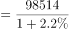
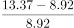
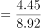
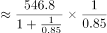
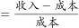

# 2021年湖北省选调生招录考试综合知识和行政职业能力测验试卷（网友回忆版）

> 选调生 · 2021 年 · 6 个模块 · 共 100 题

- [政治理论](#%E6%94%BF%E6%B2%BB%E7%90%86%E8%AE%BA) · 12 题
- [常识判断](#%E5%B8%B8%E8%AF%86%E5%88%A4%E6%96%AD) · 44 题
- [言语理解与表达](#%E8%A8%80%E8%AF%AD%E7%90%86%E8%A7%A3%E4%B8%8E%E8%A1%A8%E8%BE%BE) · 10 题
- [数量关系](#%E6%95%B0%E9%87%8F%E5%85%B3%E7%B3%BB) · 7 题
- [判断推理](#%E5%88%A4%E6%96%AD%E6%8E%A8%E7%90%86) · 16 题
- [资料分析](#%E8%B5%84%E6%96%99%E5%88%86%E6%9E%90) · 11 题

---

## 政治理论

### 第 1 题　qid 5519587 · 时事政治

在第十三届全国人民代表大会第四次会议上，《政府工作报告》指出，过去一年，在以习近平同志为核心的党中央坚强领导下，全国各族人民顽强拼搏，疫情防控取得重大战略成果，在全球主要经济体中唯一实现            ，脱贫攻坚战取得全面胜利，决胜全面建成小康社会取得决定性成就，交出一份人民满意、世界瞩目、可以载入史册的答卷。

- **A**. 经济正增长　✅
- **B**. 经济稳增长
- **C**. 高质量发展
- **D**. 可持续发展

**答案**：A

**官方解析**

本题考查政治常识。
A项正确，B、C、D三项错误，2021年《政府工作报告》中“一、2020年工作回顾”部分指出：“过去一年，在新中国历史上极不平凡。面对突如其来的新冠肺炎疫情、世界经济深度衰退等多重严重冲击，在以习近平同志为核心的党中央坚强领导下，全国各族人民顽强拼搏，疫情防控取得重大战略成果，在全球主要经济体中唯一实现经济正增长，脱贫攻坚战取得全面胜利，决胜全面建成小康社会取得决定性成就，交出一份人民满意、世界瞩目、可以载入史册的答卷。”
故正确答案为A。

---

### 第 2 题　qid 5519569 · 新思想

习近平总书记在全国脱贫攻坚总结表彰大会上强调，在全面建设社会主义现代化国家新征程中，我们必须把促进全体人民            摆在更加重要的位置，脚踏实地、久久为功，向着这个目标更加积极有为地进行努力，促进人的全面发展和社会全面进步，让广大人民群众获得感、幸福感、安全感更加充实、更有保障、更可持续。

- **A**. 美好生活
- **B**. 共同富裕　✅
- **C**. 丰衣足食
- **D**. 全面小康

**答案**：B

**官方解析**

本题考查政治常识。
B项正确，A、C、D三项错误，2021年习近平总书记在全国脱贫攻坚总结表彰大会上强调，在全面建设社会主义现代化国家新征程中，我们必须把促进全体人民共同富裕摆在更加重要的位置，脚踏实地、久久为功，向着这个目标更加积极有为地进行努力，促进人的全面发展和社会全面进步，让广大人民群众获得感、幸福感、安全感更加充实、更有保障、更可持续。
故正确答案为B。

---

### 第 3 题　qid 5519575 · 时事政治

国务院《政府工作报告》提出的2021年发展主要预期目标有：城镇新增就业1100万人以上，城镇调查失业率5.5%左右；居民消费价格涨幅3%左右；进出口量稳质升，国际收支基本平衡；生态环境质量进一步改善，单位国内生产总值能耗下降3%左右，主要污染物排放量继续下降。除上述目标外，还有（    ）。
①国内生产总值增长6%以上
②居民收入稳步增长
③常住人口城镇化率提高到65%
④粮食产量保持在1.3万亿斤以上

- **A**. ①②
- **B**. ①②③
- **C**. ①②④　✅
- **D**. ①②③④

**答案**：C

**官方解析**

本题考查政治常识。
①②④正确，2021年政府工作报告在“三、2021年重点工作”部分指出：“今年发展主要预期目标是：国内生产总值增长6%以上；城镇新增就业1100万人以上，城镇调查失业率5.5%左右；居民消费价格涨幅3%左右；进出口量稳质升，国际收支基本平衡；居民收入稳步增长；生态环境质量进一步改善，单位国内生产总值能耗降低3%左右，主要污染物排放量继续下降；粮食产量保持在1.3万亿斤以上。”
③错误，2021年政府工作报告在“二、‘十三五’时期发展成就和‘十四五’时期主要目标任务”部分指出：“全面推进乡村振兴，完善新型城镇化战略······深入推进以人为核心的新型城镇化战略，加快农业转移人口市民化，常住人口城镇化率提高到65%······”
故正确的有①②④。
故正确答案为C。

---

### 第 4 题　qid 5519595 · 毛中特

2021年2月20日，习近平总书记在党史学习教育动员大会上指出，在全党开展党史学习教育，是党的政治生活中的一件大事。全党要高度重视，提高思想站位，立足实际、守正创新，高标准高质量完成学习教育各项任务。要加强组织领导，树立正确党史观，注重方式方法创新，还要（    ）。

- **A**. 在社会广泛开展党史宣传教育
- **B**. 把学习党史同推动工作结合起来
- **C**. 加强理论引导和观念辨析
- **D**. 切实为群众办实事解难题　✅

**答案**：D

**官方解析**

本题考查政治常识。
A、B、C三项错误，D项正确，2021年2月20日，党史学习教育动员大会在北京召开。中共中央总书记、国家主席、中央军委主席习近平出席会议并发表重要讲话。讲话中指出：“在全党开展党史学习教育，是党的政治生活中的一件大事。全党要高度重视，提高思想站位，立足实际、守正创新，高标准高质量完成学习教育各项任务。一是要加强组织领导。二是要树立正确党史观。三是要切实为群众办实事解难题。四是要注重方式方法创新。”
故正确答案为D。

---

### 第 5 题　qid 5519590 · 时事政治

中央经济工作会议确定，2021年经济工作要抓好的重点任务是：强化国家战略科技力量，增强产业链供应链自主可控能力，坚持扩大内需这个战略基点，全面推进改革开放，解决好种子和耕地问题，以及（    ）。
①强化反垄断和防止资本无序扩张
②实现更加充分更高质量就业
③解决好大城市住房突出问题
④做好碳达峰、碳中和工作

- **A**. ②③
- **B**. ②③④
- **C**. ①③④　✅
- **D**. ①②③④

**答案**：C

**官方解析**

本题考查政治常识。
2020年12月18日闭幕的中央经济工作会议（以下简称会议）部署2021年经济工作，明确八大重点任务。
①正确，会议确定，六是强化反垄断和防止资本无序扩张。国家支持平台企业创新发展、增强国际竞争力，支持公有制经济和非公有制经济共同发展，同时要依法规范发展，健全数字规则。
②错误，会议确定，三是坚持扩大内需这个战略基点。形成强大国内市场是构建新发展格局的重要支撑，必须在合理引导消费、储蓄、投资等方面进行有效制度安排······要完善职业技术教育体系，实现更加充分更高质量就业。此项内容已包含在题干中的“坚持扩大内需这个战略基点”部分。
③正确，会议确定，七是解决好大城市住房突出问题。要坚持房子是用来住的、不是用来炒的定位，因地制宜、多策并举，促进房地产市场平稳健康发展。
④正确，会议确定，八是做好碳达峰、碳中和工作。中国二氧化碳排放力争2030年前达到峰值，力争2060年前实现碳中和。
综上所述，①③④表述正确。
故正确答案为C。

---

### 第 6 题　qid 5519581 · 时事政治

习近平总书记在2021年世界经济论坛“达沃斯议程”对话会特别致辞中提出，我们要解决好这个时代面临的如下课题（    ）。
①加强宏观经济政策协调，共同推动世界经济强劲、可持续、平衡、包容增长
②克服发达国家和发展中国家发展鸿沟，共同推动各国发展繁荣
③摒弃意识形态偏见，共同走和平共处、互利共赢之路
④携手应对全球性挑战，共同缔造人类美好未来

- **A**. ①②
- **B**. ①②③
- **C**. ②③④
- **D**. ①②③④　✅

**答案**：D

**官方解析**

本题考查政治常识。
①②③④均正确，习近平强调，我们要解决好这个时代面临的四大课题：第一，加强宏观经济政策协调，共同推动世界经济强劲、可持续、平衡、包容增长······第二，摒弃意识形态偏见，共同走和平共处、互利共赢之路······第三，克服发达国家和发展中国家发展鸿沟，共同推动各国发展繁荣······第四，携手应对全球性挑战，共同缔造人类美好未来。
故正确答案为D。

---

### 第 7 题　qid 5519627 · 马克思主义

习近平总书记总结了深圳经济特区40年改革开放、创新发展的宝贵经验。其中第二条是：必须坚持和完善中国特色社会主义制度，通过改革实践推动中国特色社会主义制度更加成熟更加定型。根据历史唯物主义，上述经验表明（    ）。

- **A**. 社会主义改革的目的就是解放生产力、发展生产力
- **B**. 社会主义改革是同一种社会形态发展过程中的量变
- **C**. 社会主义改革是社会主义制度的自我完善和自我发展　✅
- **D**. 社会主义改革就是改变与生产力不相适应的生产关系

**答案**：C

**官方解析**

本题考查政治常识。
A项错误，C项正确，社会主义改革的性质是社会主义制度的自我完善、自我发展。其目的是为了解放生产力，发展生产力，促进社会全面进步。题干中“通过改革实践推动中国特色社会主义制度更加成熟更加定型”体现了在改革的过程中通过变革与生产力不相适应的生产关系的某些方面和环节，从而让中国特色社会主义制度更加完善，体现了“社会主义改革是社会主义制度的自我完善和自我发展”。但题干并未强调生产力，故A项不符合题意。
B项错误，改革是同一种社会形态发展过程中的量变，但量变质变原理是辩证唯物主义中的规律，与题干中的历史唯物主义不符。
D项错误，与生产力不相适应的生产关系是社会主义改革的对象，与题干中的强调的“推动中国特色社会主义制度更加成熟更加定型”不符。
故正确答案为C。

---

### 第 8 题　qid 5519652 · 新思想

习近平总书记在十九届中央政治局第八次集体学习时指出，            ，是解决农村一切问题的前提。

- **A**. 人才兴旺
- **B**. 产业兴旺　✅
- **C**. 文化兴旺
- **D**. 组织兴旺

**答案**：B

**官方解析**

本题考查政治常识。
B项正确，A、C、D三项错误，习近平总书记在十九届中央政治局第八次集体学习时指出：“产业兴旺，是解决农村一切问题的前提，从‘生产发展’到‘产业兴旺’，反映了农业农村经济适应市场需求变化、加快优化升级、促进产业融合的新要求。”
故正确答案为B。

---

### 第 9 题　qid 5519654 · 新思想

习近平总书记对新时代推进农村土地制度改革、做好农村承包地管理工作作出重要指示强调，新时代推进农村土地制度改革，要坚持把                    作为出发点和落脚点，坚持农村土地农民集体所有制不动摇，坚持家庭承包经营基础性地位不动摇。

- **A**. 农村集体土地入市
- **B**. 依法维护农民权益　✅
- **C**. 农村承包地确权登记颁证工作
- **D**. 保持农村土地承包关系稳定

**答案**：B

**官方解析**

本题考查政治常识。
B项正确，A、C、D三项错误，习近平对新时代推进农村土地制度改革、做好农村承包地管理工作作出重要指示强调，开展农村承包地确权登记颁证工作，确定了对土地承包经营权的物权保护，让农民吃上长效“定心丸”，巩固和完善了农村基本经营制度。新时代推进农村土地制度改革，要坚持把依法维护农民权益作为出发点和落脚点，坚持农村土地农民集体所有制不动摇，坚持家庭承包经营基础性地位不动摇。
故正确答案为B。

---

### 第 10 题　qid 5519678 · 新思想

2020年12月3日，习近平总书记在中共中央政治局常务委员会会议上指出，经过8年持续奋斗，我们如期完成了新时代脱贫攻坚目标任务，现行标准下农村贫困人口全部脱贫，贫困县全部摘帽，消除了（    ）和区域性整体贫困，近1亿贫困人口实现脱贫。

- **A**. 相对贫困
- **B**. 绝对贫困　✅
- **C**. 农村贫困
- **D**. 普遍性贫困

**答案**：B

**官方解析**

本题考查政治常识。
A、C、D三项错误，B项正确，2020年12月3日，习近平总书记在中共中央政治局常务委员会会议上指出，经过8年持续奋斗，我们如期完成了新时代脱贫攻坚目标任务，现行标准下农村贫困人口全部脱贫，贫困县全部摘帽，消除了绝对贫困和区域性整体贫困，近1亿贫困人口实现脱贫。
故正确答案为B。

---

### 第 11 题　qid 5519822 · 时事政治

2020年的中央经济工作会议提出：增强产业链供应链自主可控能力，产业链供应链安全稳定是构建新发展格局的基础。下面对产业链的理解有误的是（    ）。

- **A**. 产业链是对产业部门间基于技术经济联系而表现出的关联关系的描述
- **B**. 产业链中存在着较多的上下游企业之间的关系和相互价值的交换
- **C**. 产业链实质是不同产业的企业间的关联，即各产业中的企业间的供需关系
- **D**. 产业链同时也是价值链，但占据产业链高端者并不能得到更高的利润　✅

**答案**：D

**官方解析**

本题考查经济常识。
A项正确，产业链是产业经济学中的一个概念，是对产业部门间基于技术经济联系，而表现出的环环相扣的关联关系的形象描述。
B项正确，产业链的本质是用于描述一个具有某种内在联系的企业群结构，它是一个相对宏观的概念，存在两维属性：结构属性和价值属性。产业链中大量存在着上下游关系和相互价值的交换，上游环节向下游环节输送产品或服务，下游环节向上游环节反馈信息。
C项正确，产业链的实质就是不同产业的企业之间的关联，而这种产业关联的实质则是各产业中的企业之间的供给与需求的关系。
D项错误，一般来讲，在产业链没有核心技术的中低端产业存在比较劣势，占据产业链利润库中的份额较少。在产业链中技术创新能力强、掌握了关键技术或核心技术，控制了关键链条环节的高端产业则具有比较优势，在产业链利润库中的份额占有绝对比例。
本题为选非题，故正确答案为D。

---

### 第 12 题　qid 5519827 · 时事政治

2021年中央经济工作会议提出，要坚持扩大内需这个战略基点。关于扩大内需，以下说法正确的是（    ）。
①形成强大的国内市场是构建新发展格局的最重要支撑
②扩大消费最根本的是要促进就业，优化收入分配结构
③把扩大消费与改善人民生活品质相结合；要增强投资增长后劲
④有序取消一些行政性限制消费购买的规定，挖掘县乡消费潜力

- **A**. ①②③④　✅
- **B**. ①②③
- **C**. ②③④
- **D**. ①③④

**答案**：A

**官方解析**

本题考查政治常识。
①正确，形成强大国内市场是构建新发展格局的重要支撑，也是大国经济优势所在。要坚持扩大内需这个战略基点，把实施扩大内需战略同深化供给侧结构性改革有机结合起来，推动形成国民经济良性循环。
②正确，会议指出：“扩大消费最根本的是促进就业，完善社保，优化收入分配结构，扩大中等收入群体，扎实推进共同富裕。”
③④正确，会议指出：“要把扩大消费同改善人民生活品质结合起来，有序取消一些行政性限制消费购买的规定，充分挖掘县乡消费潜力。”“要增强投资增长后劲，继续发挥关键作用。”
故①②③④表述正确。
故正确答案为A。

---

## 常识判断

### 第 1 题　qid 5519572 · 人文常识

党的十九届五中全会提出“十四五”时期经济社会发展，以推动（    ）为主题，以深化供给侧结构性改革为主线，以（    ）为根本动力，以满足人民日益增长的美好生活需要为根本目的。

- **A**. 新格局发展 科技创新
- **B**. 新时代发展 改革开放
- **C**. 高质量发展 改革创新　✅
- **D**. 双循环发展 合作共赢

**答案**：C

**官方解析**

本题考查政治常识。
C项正确，A、B、D三项错误，党的十九届五中全会公报提出了“十四五”时期经济社会发展指导思想和必须遵循的原则，强调要······坚持稳中求进工作总基调，以推动高质量发展为主题，以深化供给侧结构性改革为主线，以改革创新为根本动力，以满足人民日益增长的美好生活需要为根本目的，统筹发展和安全，加快建设现代化经济体系，加快构建以国内大循环为主体、国内国际双循环相互促进的新发展格局，推进国家治理体系和治理能力现代化，实现经济行稳致远、社会安定和谐，为全面建设社会主义现代化国家开好局、起好步······
故正确答案为C。

---

### 第 2 题　qid 5519596 · 人文常识

中华民族是勇于创新、善于创新的民族，伟大事业都基于创新，创新是新事物代替旧事物的过程，抓创新就是抓发展，谋创新就是谋未来。立足科技创新，释放创新驱动的原动力，让创新成为发展基点，拓展发展空间，创造发展新机遇，打造发展新引擎，我们就一定能推动中国号航船劈波斩浪、行稳致远，迎来更加光明的发展前景。
“抓创新就是抓发展，谋创新就是谋未来”的哲学根据是（    ）。

- **A**. 发展是事物带有前进性、上升性方向的运动　✅
- **B**. 发展的实质是新事物的产生和旧事物的灭亡
- **C**. 新事物合乎历史前进方向，有一定发展前途
- **D**. 新事物完全否定了旧事物因而是不可战胜的

**答案**：A

**官方解析**

本题考查政治常识。
A项正确，辩证法是从事物的前进性和方向性出发理解发展的，认为发展是带有前进性和上升性的运动和变化，是能表明事物前进性和方向性的变化。题干中“抓创新就是抓发展，谋创新就是谋未来”意思是创新是发展的基础，只有创新才能促进未来的发展，与选项表述相符。
B项错误，发展的实质是新事物的产生和旧事物的灭亡表述本身正确，但是题干并没有强调新事物的产生和旧事物的灭亡，与题干表述无关。
C项错误，新事物是指合乎历史前进方向、具有远大前途的东西，所以，新事物的发展前途是光明的；旧事物是指丧失历史必然性、日趋灭亡的东西。“新事物有一定发展前途”与题干创新与我们一定能向前发展的积极并不是完全匹配。
D项错误，新事物否定了旧事物中消极的、过时的、腐朽的东西，却吸取、继承了旧事物中积极的、仍然适合新的历史条件的东西，并添加了一些为旧事物所不能容纳的新东西，选项本身表述错误。
故正确答案为A。

---

### 第 3 题　qid 5519603 · 人文常识

奋斗“十四五”、奋进新征程，要发扬艰苦奋斗精神，社会主义是干出来的，新时代是奋斗出来的，世界上没有坐享其成的好事，要幸福就要奋斗，大道至简，实干为要。伟大梦想不是等得来、喊得来的，而是拼出来，干出来的。
从辩证唯物主义看，以上叙述体现的哲学逻辑包括（    ）。
①实践是人类社会的基础，社会生活的本质上是实践的
②实践形成了物质、政治和精神等生活的基本领域
③实践构成社会发展的动力，推动社会历史变迁和进步
④实践是物质世界分化为自然界与人类社会的历史前提

- **A**. ①②
- **B**. ③④
- **C**. ①②③　✅
- **D**. ①②③④

**答案**：C

**官方解析**

本题考查政治常识。
①正确，《马克思主义基本原理》指出：“实践是人类社会的基础，是理解和解释一切社会现象的钥匙。马克思主义确认社会生活在本质上是实践的，也就是把社会生活‘当作实践去理解’”。题干中“新时代是奋斗出来的，世界上没有坐享其成的好事，要幸福就要奋斗”体现了社会生活建立在实践的基础之上，美好的生活要通过奋斗（即实践）实现。
②正确，《马克思主义基本原理》指出：“实践形成了社会生活的基本领域，即社会的物质生活、政治生活和精神生活领域”。题干中“社会主义是干出来的”“伟大梦想不是等得来、喊得来的，而是拼出来，干出来的”体现了实践可以形成社会的物质、政治和精神等生活的基本领域。
③正确，《马克思主义基本原理》指出：“实践构成了社会发展的动力，改造社会的实践推动着社会历史的变迁和进步”。题干中“奋斗‘十四五’、奋进新征程，要发扬艰苦奋斗精神，社会主义是干出来的”体现了通过实践来实现“十四五”和新征程的目标，推动社会进步。
④错误，《马克思主义基本原理》指出：“实践是使物质世界分化为自然界与人类社会的历史前提，又是使自然界与人类社会统一起来的现实基础”。题干中的表述并未涉及到自然界与人类社会的划分问题。
综上，①②③正确。
故正确答案为C。

---

### 第 4 题　qid 5519606 · 人文常识

2020年，我们遭遇了太多变化，见证了许多积极应变、主动求变、在挑战中抓机遇的担当作为。比如，稳外贸压力加大，但直播带货热度不减，内需潜力持续释放；新冠肺炎疫情影响复课复工，但线上教育兴起、线上办公流行······正因为准确识变、科学应变、主动求变，新业态新模式新消费不断涌现，降低了疫情影响，释放了发展新动能。
下列选项中，蕴含在上述应变发展中的原理包括（    ）。
①矛盾无处不在，无时不有
②矛盾就是相互排斥相互否定
③善于发展、认识、研究、解决矛盾
④发挥主观能动性创造条件促使矛盾向有利方面转化发展

- **A**. ②④
- **B**. ①③
- **C**. ①③④　✅
- **D**. ①②③④

**答案**：C

**官方解析**

本题考查政治常识。
①正确，矛盾具有普遍性，指矛盾存在于一切事物中，存在于一切事物的发展过程始终，旧的矛盾解决了，新的矛盾又产生，事物始终在矛盾中运动。即矛盾无处不在，无时不有。在2020年我们遇到的挑战“稳外贸压力加大”“直播带货热度不减”等体现了矛盾的普遍性。
②错误，矛盾具有同一性和斗争性，矛盾的同一性是指矛盾双方相互依存、相互贯通的性质和趋势；矛盾的斗争性是指矛盾双方相互排斥、相互分离的性质和趋势。故说法错误。
③正确，矛盾的普遍性原理要求我们树立矛盾的观点，敢于承认矛盾，正确分析矛盾，坚持矛盾分析法，全面的看问题。2020年遇到种种问题的时候，“准确识变、科学应变、主动求变，新业态新模式新消费不断涌现”体现了善于发展、认识、研究、解决矛盾。
④正确，矛盾双方相互贯通，主要表现为：一是矛盾双方的相互渗透或相互包含，二是矛盾双方在一定条件下相互转化的趋势，即矛盾双方在一定条件下向自己的对立面转化的趋势。在2022各种问题发生的时候，正确认识矛盾，并开展各种线上活动，降低了疫情影响，释放了发展新动能体现了发挥主观能动性创造条件促使矛盾向有利方面转化发展。
综上所述，正确的为①③④。
故正确答案为C。

---

### 第 5 题　qid 5519612 · 人文常识

前进道路上，我们要秉持以人民为中心，永葆初心、牢记使命，始终把人民利益放在最高位置，保持党同人民群众的血肉联系，自觉同人民想在一起、干在一起，解决人民群众最关心最直接最现实的利益问题，促进社会公平，增进民生福祉，不断实现人民对美好生活的向往。
以上叙述依据的哲学原理是（    ）。

- **A**. 一切向人民群众负责
- **B**. 人民群众是历史创造者　✅
- **C**. 从群众中来，到群众中去
- **D**. 一切为了群众，一切依靠群众

**答案**：B

**官方解析**

本题考查政治常识。
A、C、D三项错误，群众路线，就是一切为了群众，一切依靠群众，从群众中来，到群众中去，把党的正确主张变为群众的自觉行动。“一切向人民群众负责”是“一切为了群众，一切依靠群众”的基本观点之一。群众路线是党政机关处理同人民群众关系问题的根本态度、工作方法和思想认识路线，而不是哲学原理。
B项正确，题干中“以人民为中心”“始终把人民利益放在最高位置”“不断实现人民对美好生活的向往”等体现了历史唯物主义中的群众史观，即人民群众是社会历史的主体，是历史的创造者。
故正确答案为B。

---

### 第 6 题　qid 5519614 · 人文常识

世界上没有两片完全相同的树叶，也没有完全相同的历史文化和社会制度。各国历史文化和社会制度各有千秋，没有高低优劣之分，关键在于是否符合本国国情，能否获得人民拥护和支持，能否带来政治稳定、社会进步、民生改善，能否为人类进步事业作出贡献。各国历史文化和社会制度差异自古就存在，是人类文明的内在属性。
从哲学上讲，各国历史文化和社会制度各有千秋是因为（    ）。

- **A**. 每一事物都包含有自己不同于其他事物的特殊矛盾　✅
- **B**. 矛盾存在于一切事物中，存在于事物发展过程始终
- **C**. 矛盾的独立性是使一事物区别于其他事物的内在根据
- **D**. 每一事物的矛盾在不同发展过程和阶段各有不同特点

**答案**：A

**官方解析**

本题考查政治常识。
A项正确，“各国历史文化和社会制度差异自古就存在，是人类文明的内在属性”体现了矛盾的特殊性的一种情形，即不同事物有不同的矛盾，这些不同的矛盾构成了一事物区别于他事物的特殊本质。
B项错误，“矛盾存在于一切事物中，存在于事物发展过程始终”是矛盾普遍性的观点，与题意不符。
C项错误，本质是一事物区别于他事物的内在根据，是组成事物的各个基本要素的内在联系。它是事物的根本性质，本质反映事物的内在联系，这种内在联系是由事物本身所固有的特殊矛盾决定的。选项本身说法错误。
D项错误，“每一事物的矛盾在不同发展过程和阶段各有不同特点”体现了矛盾的特殊性的一种情形，即同一事物在发展的不同过程和不同阶段上有不同的矛盾，这些不同的矛盾形成了事物发展的不同过程和不同阶段。但这体现的是事物同自身的比较，而不是与其他事物的比较，与题意不符。
故正确答案为A。

---

### 第 7 题　qid 5519628 · 人文常识

热爱朗诵的农民诗人、喜爱跳大环舞的钢铁厂维修工、大凉山的少年合唱团······登上人民日报新媒体发起的“你好2021”温暖之夜系列演出活动的这些人，与你我一样，有着日常工作、过着平凡生活。但对责任的坚守、对美好的追求，让他们拥有了自己的一方舞台。他们用各自的故事表明，只要有梦想、有奋斗，每个平凡的人都能书写自己不平凡的人生。上述平凡可以转化为不平凡的哲学依据是（    ）。

- **A**. 在矛盾双方中任何一方的发展都以另一方的发展为条件
- **B**. 矛盾双方相互依存互为存在前提，共处于一个统一体中
- **C**. 矛盾着的对立面相互贯通，在一定条件下可以相互转化　✅
- **D**. 矛盾双方相互吸收有利因素在相互作用中各自得到发展

**答案**：C

**官方解析**

本题考查政治常识。
A、B、D三项错误，题干强调的是矛盾对立面之间的相互转化而不是相互依赖。
C项正确，矛盾的同一性是指矛盾的对立面之间的相互依存、相互吸引、相互贯通的一种趋势和联系。矛盾着的对立面之间，在一定条件下可以相互转化。平凡和不平凡即是一对对立面，“对责任的坚守、对美好的追求”“有梦想、有奋斗”即是平凡向不平凡转化的条件。
故正确答案为C。

---

### 第 8 题　qid 5519617 · 地理国情

2020年9月，云南省L镇境内出现了一群来自邻国的野生亚洲象，共计24头，为有监测数据以来数量最多的一次。监测人员介绍，从2017年以来，随着当地植被和生态环境不断改善野生动物保护力度不断提高、群众动物保护意识不断增强，野象群频频造访，呈现出入境频次高、数量越来越多、迁栖范围越来越广等特点。从哲学上讲，当地不断改善动物生存的硬、软环境是原因，野象群频频造访是结果，L镇现象表明（    ）。
①承认原因与结果联系的客观普遍性，是唯物主义决定论
②原因和结果相互依存，没有无因之果，也没有无果之因
③正确把握因果联系能帮助人们提出解决问题的有效方法
④原因和结果相互作用，一定的原因必然产生一定的结果

- **A**. ②④
- **B**. ②③　✅
- **C**. ①②
- **D**. ①④

**答案**：B

**官方解析**

本题考查政治常识。
①错误，决定论（又称拉普拉斯信条）是一种认为自然界和人类社会普遍存在客观规律和因果联系的理论和学说。唯物主义认为，物质决定意识，经济基础决定上层建筑，这就是自然界和人类社会普遍存在的客观规律和因果联系。所以，称为唯物主义决定论。题干中，提到的L镇现象，属于个体案例，并不能体现原因与结果联系的客观普遍性。
②正确，L镇现象中，当地不断改善动物生存的硬、软环境是原因，野象群频频造访是结果，二者缺一不可，体现了原因和结果相互依存，没有无因之果，也没有无果之因。
③正确，L镇现象说明把握改善环境与动物造访之间的因果关系，可以解决破坏生态环境压缩动物生长空间这一问题，说明正确把握因果联系能帮助人们提出解决问题的有效方法。
④错误，原因和结果相互作用。原因引起一定的结果，结果又反过来作用于原因并引起原因的变化。题干中，仅提到当地不断改善动物生存的硬、软环境造成野象群频频造访，但并未说野象群频频造访的反作用。
故②③正确，①④错误。
故正确答案为B。

---

### 第 9 题　qid 5519622 · 人文常识

英国近代哲学家贝克莱有两个著名观点：“存在就是被感知”“物是感觉的集合”。一次他和友人在花园漫步，友人不留神一脚踢在石头上，痛的龇牙咧嘴。质问贝克莱，这石头难道不存在吗？贝克莱反问，你感觉到痛吗？友人说，当然感觉到痛啦。贝克莱说，你感觉到痛，石头就是存在的。存在就是被感知，物是感觉的集合嘛！
贝克莱的观点是典型的（    ）。

- **A**. 朴素唯心主义
- **B**. 客观唯心主义
- **C**. 朴素唯物主义
- **D**. 主观唯心主义　✅

**答案**：D

**官方解析**

本题考查政治常识。
D项正确，A、B、C三项错误，“存在就是被感知”是典型的主观唯心主义。主观唯心主义把主体的主观精神，如感觉、经验、心灵、意识、观念、意志等看作是意识世界中一切事物产生和存在的根源与基础，而外部世界上的一切事物则是意识体的主观精神所派生的，是这些主观精神的显现。因此，在主观唯心主义者看来，主观精神是本源的、第一性的，而外部世界的事物则是派生的、第二性的。
故正确答案为D。

---

### 第 10 题　qid 5519633 · 人文常识

全党务必充分认识新发展阶段做好“三农”工作的重要性和紧迫性，坚持把解决好“三农”问题作为全党工作重中之重，举全党全社会之力推动乡村振兴，促进农业            、乡村宜居宜业、农民            。

- **A**. 优质高产 安居乐业
- **B**. 增产增效 脱贫致富
- **C**. 高质高效 富裕富足　✅
- **D**. 丰产丰收 持续增收

**答案**：C

**官方解析**

本题考查政治常识。
C项正确，A、B、D三项错误，2020年12月28日至29日，习近平总书记在北京举行的中央农村工作会议上指出：“全党务必充分认识新发展阶段做好‘三农’工作的重要性和紧迫性，坚持把解决好‘三农’问题作为全党工作重中之重，举全党全社会之力推动乡村振兴，促进农业高质高效、乡村宜居宜业、农民富裕富足。”
故正确答案为C。

---

### 第 11 题　qid 5519636 · 人文常识

全面建设社会主义现代化国家，实现中华民族伟大复兴，最艰巨最繁重的任务、最广泛最深厚的基础依然在（    ）。

- **A**. 农业
- **B**. 农村　✅
- **C**. 城镇
- **D**. 农民

**答案**：B

**官方解析**

本题考查政治常识。
B项正确，A、C、D三项错误，2021年中央一号文件指出：“全面建设社会主义现代化国家，实现中华民族伟大复兴，最艰巨最繁重的任务依然在农村，最广泛最深厚的基础依然在农村。”
故正确答案为B。

---

### 第 12 题　qid 5519667 · 人文常识

2021年中央一号文件提出，脱贫攻坚目标任务完成后，对摆脱贫困的县，从脱贫之日起设立5年          ，做到扶上马送一程。

- **A**. 过渡期　✅
- **B**. 观察期
- **C**. 巩固期
- **D**. 稳定期

**答案**：A

**官方解析**

本题考查政治常识。
A项正确，B、C、D三项错误，2021年中央一号文件提出，设立衔接过渡期。脱贫攻坚目标任务完成后，对摆脱贫困的县，从脱贫之日起设立5年过渡期，做到扶上马送一程。过渡期内保持现有主要帮扶政策总体稳定，并逐项分类优化调整，合理把握节奏、力度和时限，逐步实现由集中资源支持脱贫攻坚向全面推进乡村振兴平稳过渡，推动“三农”工作重心历史性转移。
故正确答案为A。

---

### 第 13 题　qid 5519665 · 人文常识

国家支持建设中国特色农产品优势区。中国特色农产品优势区建设应立足区域资源禀赋，以发展（    ）、（    ）、产业融合、市场竞争力强的农业产业为重点，打造“中国第一，世界有名”的特色农产品优势区。

- **A**. 特色鲜明 优势集聚　✅
- **B**. 品牌响亮 地位突出
- **C**. 特色鲜明 人才集聚
- **D**. 自主创新 优势显著

**答案**：A

**官方解析**

本题考查政治常识。
A项正确，B、C、D三项错误，2020年7月，农业农村部办公厅、国家林业和草原局办公室、国家发展改革委办公厅、财政部办公厅、科技部办公厅、自然资源部办公厅、水利部办公厅印发了《中国特色农产品优势区管理办法（试行）》，其中第二条指出：“中国特优区立足区域资源禀赋，以经济效益为中心、农民增收为目的，坚持市场导向、标准引领、品牌号召、主体作为、地方主抓的原则，以发展特色鲜明、优势集聚、产业融合、市场竞争力强的农业产业为重点，打造‘中国第一，世界有名’的特色农产品优势区。”
故正确答案为A。

---

### 第 14 题　qid 5519760 · 人文常识

《关于加快推进乡村人才振兴的意见》提出：建立各类人才定期服务乡村制度；完善乡村高技能人才职业技能等级制度；建立健全乡村人才（    ）评价体系，完善农业农村领域高级职称评审申报条件，探索推行技术标准、专题报告、发展规划、技术方案、试验报告等视同发表论文的评审方式。

- **A**. 特评特聘
- **B**. 分级分类　✅
- **C**. 特岗特聘
- **D**. 职级分离

**答案**：B

**官方解析**

本题考查政治常识。
B项正确，A、C、D三项错误，2021年2月，中共中央办公厅、国务院办公厅印发了《关于加快推进乡村人才振兴的意见》，其中“八、建立健全乡村人才振兴体制机制”提出：“（三十五）建立健全乡村人才分级分类评价体系。坚持‘把论文写在大地上’，完善农业农村领域高级职称评审申报条件，探索推行技术标准、专题报告、发展规划、技术方案、试验报告等视同发表论文的评审方式。对乡村发展急需紧缺人才，可以设置特设岗位，不受常设岗位总量、职称最高等级和结构比例限制。”
故正确答案为B。

---

### 第 15 题　qid 5519668 · 人文常识

根据2021年中央一号文件，以下表述正确的是（    ）。

- **A**. 农业现代化，技术、资源和人才是基础
- **B**. 帮助做好劳务输出工作，鼓励脱贫人口异地就业
- **C**. 加大产业扶持力度，加强对扶贫项目资产的管理和监督　✅
- **D**. 重点以救助、供养方式来加强对低收入人口的全面帮扶

**答案**：C

**官方解析**

本题考查政治常识。
A项错误，2021年中央一号文件“三、加快推进农业现代化”部分指出，“（八）打好种业翻身仗。农业现代化，种子是基础。”
B项错误，2021年中央一号文“二、实现巩固拓展脱贫攻坚成果同乡村振兴有效衔接”部分指出，“（五）接续推进脱贫地区乡村振兴。实施脱贫地区特色种养业提升行动，广泛开展农产品产销对接活动，深化拓展消费帮扶。持续做好有组织劳务输出工作。统筹用好公益岗位，对符合条件的就业困难人员进行就业援助。在农业农村基础设施建设领域推广以工代赈方式，吸纳更多脱贫人口和低收入人口就地就近就业。”
C项正确，2021年中央一号文“二、实现巩固拓展脱贫攻坚成果同乡村振兴有效衔接”部分指出，“（四）持续巩固拓展脱贫攻坚成果······以大中型集中安置区为重点，扎实做好易地搬迁后续帮扶工作，持续加大就业和产业扶持力度，继续完善安置区配套基础设施、产业园区配套设施、公共服务设施，切实提升社区治理能力。加强扶贫项目资产管理和监督。”
D项错误，2021年中央一号文“二、实现巩固拓展脱贫攻坚成果同乡村振兴有效衔接”部分指出，“（六）加强农村低收入人口常态化帮扶。开展农村低收入人口动态监测，实行分层分类帮扶。对有劳动能力的农村低收入人口，坚持开发式帮扶，帮助其提高内生发展能力，发展产业、参与就业，依靠双手勤劳致富。对脱贫人口中丧失劳动能力且无法通过产业就业获得稳定收入的人口，以现有社会保障体系为基础，按规定纳入农村低保或特困人员救助供养范围，并按困难类型及时给予专项救助、临时救助。”
故正确答案为C。

---

### 第 16 题　qid 5519673 · 人文常识

民以食为天。对中国这样一个人口大国来说，保障粮食安全是一个永恒的课题。为此，中央采取了一系列措施坚守18亿亩耕地红线，其中不包括（    ）。

- **A**. 确保15.5亿亩永久基本农田主要种植粮食、瓜菜等一年生作物
- **B**. 落实最严耕地保护制度，遏制耕地“非农化”、防止“非粮化”
- **C**. 建立“辅之以利、辅之以义”的两辅机制保障
- **D**. 鼓励大规模绿化造林以推动土地资源合理利用　✅

**答案**：D

**官方解析**

本题考查政治常识。
《中共中央 国务院关于全面推进乡村振兴加快农业农村现代化的意见》（以下简称《意见》）。
A项正确，根据《意见》，要牢牢守住18亿亩耕地红线，确保15.5亿亩永久基本农田主要种植粮食及瓜菜等一年生作物；确保规划要建成的高标准农田，努力种植粮食等；同时，打好种业翻身仗。
B项正确，D项错误，《意见》“三、加快推进农业现代化”部分指出，“（九）坚决守住18亿亩耕地红线······采取‘长牙齿’的措施，落实最严格的耕地保护制度。严禁违规占用耕地和违背自然规律绿化造林、挖湖造景，严格控制非农建设占用耕地，深入推进农村乱占耕地建房专项整治行动，坚决遏制耕地‘非农化’、防止‘非粮化’。”
C项正确，2021年中央一号文件的国新办新闻发布会上指出，确保粮食安全，还要建立“两辅”的机制保障，即“辅之以利、辅之以义”。“辅之以利”就是要坚持和完善农业价格政策和补贴政策，让农民种粮有钱赚。“辅之以义”就是要压实地方党委政府在粮食安全方面的义务和责任。
本题为选非题，故正确答案为D。

---

### 第 17 题　qid 5519672 · 科技常识

2021年，我国将继续把公共基础设施建设的重点放在农村，着力推进往村覆盖、往户延伸。当前，进一步加强乡村公共基础设施建设需要实施（    ）。
①农村道路畅通工程
②农村供水保障工程
③乡村清洁能源建设工程
④数字乡村建设发展工程
⑤村级综合服务设施提升工程

- **A**. ①②③
- **B**. ②③④
- **C**. ②③④⑤
- **D**. ①②③④⑤　✅

**答案**：D

**官方解析**

本题考查政治常识。
2021年中央一号文件指出：“（十五）加强乡村公共基础设施建设。继续把公共基础设施建设的重点放在农村，着力推进往村覆盖、往户延伸。实施农村道路畅通工程。有序实施较大人口规模自然村（组）通硬化路。加强农村资源路、产业路、旅游路和村内主干道建设······实施农村供水保障工程。加强中小型水库等稳定水源工程建设和水源保护，实施规模化供水工程建设和小型工程标准化改造，有条件的地区推进城乡供水一体化，到2025年农村自来水普及率达到88%······实施乡村清洁能源建设工程。加大农村电网建设力度，全面巩固提升农村电力保障水平。推进燃气下乡，支持建设安全可靠的乡村储气罐站和微管网供气系统。发展农村生物质能源。加强煤炭清洁化利用。实施数字乡村建设发展工程。推动农村千兆光网、第五代移动通信（5G）、移动物联网与城市同步规划建设······实施村级综合服务设施提升工程。加强村级客运站点、文化体育、公共照明等服务设施建设。”
综上，①②③④⑤均正确。
故正确答案为D。

---

### 第 18 题　qid 5519689 · 法律常识

依据法律部门划分的标准和原则，《中华人民共和国国歌法》属于（    ）的范畴。

- **A**. 宪法　✅
- **B**. 行政法
- **C**. 民商法
- **D**. 社会法

**答案**：A

**官方解析**

本题考查法律常识。
A项正确，宪法部门指有关国家机关的组织结构，公民在国家地位等法律规范组成的法律部门。《中华人民共和国国歌法》属于宪法部门。
B项错误，行政法由调整国家行政机关在履行行政管理职能，是和行政相对人产生的权利义务关系的法律规范组成。
C项错误，民商法由调整平等主体之间人身、财产关系的民法和调整商事主体之间商事关系的法律规范组成。
D项错误，社会法由调整劳动、社会保障和社会福利关系等方面的法律规范组成。
故正确答案为A。

---

### 第 19 题　qid 5519686 · 人文常识

法治是人类社会进入现代文明的重要标志，是人类政治文明的重要成果。划分法治与人治最根本的标志是（    ）。

- **A**. 是否社会所有领域有法可依
- **B**. 法的权威是否高于人的权威　✅
- **C**. 是否各类社会事务依法进行
- **D**. 法的适用是否依据社情变化

**答案**：B

**官方解析**

本题考查法律常识。
A、C、D三项错误，B项正确，法治指依法治国，即根据法律治理国家。人治是个人或少数人因历史原因掌握了社会公共权力，以军事、经济、政治、法律、文化、伦理等物质的与精神的手段，对占社会绝大多数的其他成员进行等级统治的社会体制。划分两者最根本的标志是法律与个人意志产生冲突时，是法的权威高于个人权威，还是个人权威高于法的权威。
故正确答案为B。

---

### 第 20 题　qid 5519688 · 法律常识

2021年修订后的《中华人民共和国动物防疫法》规定，城市街道上的流浪犬、猫的控制和处置的主体是（    ）。

- **A**. 社区与居民组织协调居民委员会
- **B**. 街道办事处组织协调居民委员会　✅
- **C**. 区级人民政府组织协调居民委员会
- **D**. 乡级人民政府组织协调村民委员会

**答案**：B

**官方解析**

本题考查法律常识。
A、C、D三项错误，B项正确，根据《中华人民共和国动物防疫法》第三十条第三款规定：“街道办事处、乡级人民政府组织协调居民委员会、村民委员会，做好本辖区流浪犬、猫的控制和处置，防止疫病传播。”由此说明，流浪犬、猫的控制和处置的主体是街道办事处、乡级人民政府组织协调居民委员会、村民委员会，二者分别管理本辖区内的相关事项。题干中表明是“城市街道上”，故由街道办事处组织协调居民委员会控制和处置。
故正确答案为B。

---

### 第 21 题　qid 5519714 · 法律常识

据报道，2020年四季度，中国人民银行依法对16家拒收现金的单位及相关负责人作出经济处罚，处罚金额从500元至50万元不等。被处罚的16家单位主要为公园景区、公共服务机构、停车场、保险公司等。对该经济处罚的准确定性是（    ）。

- **A**. 内部处罚
- **B**. 行业处罚
- **C**. 行政处罚　✅
- **D**. 刑事处罚

**答案**：C

**官方解析**

本题考查法律常识。
A、B、D三项错误，C项正确，根据《中华人民共和国中国人民银行法》第四十六条规定：“本法第三十二条所列行为违反有关规定，有关法律、行政法规有处罚规定的，依照其规定给予处罚；有关法律、行政法规未作处罚规定的，由中国人民银行区别不同情形给予警告，没收违法所得，违法所得五十万元以上的，并处违法所得一倍以上五倍以下罚款；没有违法所得或者违法所得不足五十万元的，处五十万元以上二百万元以下罚款；对负有直接责任的董事、高级管理人员和其他直接责任人员给予警告，处五万元以上五十万元以下罚款；构成犯罪的，依法追究刑事责任。”题干中，16家单位拒收现金的行为违反了执行有关人民币管理规定的行为，中国人民银行依据有关法律、行政法规处以罚款属于行政处罚。
故正确答案为C。

---

### 第 22 题　qid 5519695 · 法律常识

违法行为人的同一个违法行为违反了多个法律规定应当给予罚款处罚的，按照（    ）处罚。

- **A**. 罚款数额低的规定
- **B**. 罚款数额高的规定　✅
- **C**. 多个规定的平均罚款数额
- **D**. 多个规定的合并罚款数额

**答案**：B

**官方解析**

本题考查法律常识。
A、C、D三项错误，B项正确，根据《中华人民共和国行政处罚法》第二十九条规定：“对当事人的同一个违法行为，不得给予两次以上罚款的行政处罚。同一个违法行为违反多个法律规范应当给予罚款处罚的，按照罚款数额高的规定处罚。”
故正确答案为B。

---

### 第 23 题　qid 5519696 · 法律常识

对纳税人首次发生且危害后果轻微并及时改正的部分违法行为，可以依法不予行政处罚。这是国家税务总局在税务执法领域推广的（    ）。

- **A**. “首违不罚”制度　✅
- **B**. “轻罪不罚”制度
- **C**. “无错不罚”制度
- **D**. “从轻处罚”制度

**答案**：A

**官方解析**

本题考查法律常识。
A项正确，B、C、D三项错误，为贯彻落实中共中央办公厅、国务院办公厅《关于进一步深化税收征管改革的意见》、国务院常务会有关部署，深入开展2021年“我为纳税人缴费人办实事暨便民办税春风行动”，推进税务领域“放管服”改革，更好服务市场主体，根据《中华人民共和国行政处罚法》、《中华人民共和国税收征收管理法》及其实施细则等法律法规，国家税务总局制定了《税务行政处罚“首违不罚”事项清单》，自2021年4月1日起施行。对于首次发生清单中所列事项且危害后果轻微，在税务机关发现前主动改正或者在税务机关责令限期改正的期限内改正的，不予行政处罚。
故正确答案为A。

---

### 第 24 题　qid 5519704 · 地理国情

国家对长江流域河湖岸线实施特殊管制，严格控制岸线开发建设，促进岸线合理高效利用。以下做法合法的是（    ）。

- **A**. 长江干流岸线一公里范围内新建化工园区
- **B**. 长江支流岸线一公里范围内扩建化工项目
- **C**. 长江干流岸线三公里范围内新建、改建、扩建尾矿库
- **D**. 汉江岸线一公里范围内以提升安全为目的的尾矿库改建　✅

**答案**：D

**官方解析**

本题考查法律常识。
A、B两项错误，根据《中华人民共和国长江保护法》第二十六条第二款规定：“禁止在长江干支流岸线一公里范围内新建、扩建化工园区和化工项目。”
C项错误，D项正确，根据《中华人民共和国长江保护法》第二十六条第三款规定：“禁止在长江干流岸线三公里范围内和重要支流岸线一公里范围内新建、改建、扩建尾矿库；但是以提升安全、生态环境保护水平为目的的改建除外。”汉江属于长江的重要支流，汉江岸线一公里范围内以提升安全为目的的尾矿库改建，符合法律规定。
故正确答案为D。

---

### 第 25 题　qid 5519708 · 法律常识

越来越多的大型超市使用自助结账，但个别顾客通过不结账、少结账的方式故意盗窃商品。对此，以下说法正确的是（    ）。

- **A**. 被盗物品一般价值较小，不构成违法或者犯罪
- **B**. 被盗的物品不论价值大小，一律构成盗窃犯罪
- **C**. 两年内不扫码“拿走”商品三次即可构成犯罪　✅
- **D**. 因缺少法律常识所致的，只需要进行批评教育

**答案**：C

**官方解析**

本题考查法律常识。
根据《刑法》第二百六十四条规定：“盗窃公私财物，数额较大的，或者多次盗窃、入户盗窃、携带凶器盗窃、扒窃的，处三年以下有期徒刑、拘役或者管制，并处或者单处罚金；数额巨大或者有其他严重情节的，处三年以上十年以下有期徒刑，并处罚金；数额特别巨大或者有其他特别严重情节的，处十年以上有期徒刑或者无期徒刑，并处罚金或者没收财产。”数额较大、多次盗窃、入户盗窃、携带凶器盗窃、扒窃属于认定盗窃罪的五种情形，满足任何之一，就构成盗窃罪。
A、D两项错误，根据《公安部关于修改盗窃案件立案统计办法的通知》规定：“公安机关凡接到报警的盗窃案件，不论盗窃财物数额多少，均应受理、登记并认真查处。其中达到当地规定的盗窃犯罪数额标准的，立为刑事案件；撬门破窗入室盗窃的，扒窃的，使用刀刃等工具或携带凶器盗窃的，不论盗窃财物数额多少，均立为刑事案件；明显是惯犯作案或一人多次作案的，以及其他虽未达到规定的数额标准但情节或者后果比较严重的，也立为刑事案件；其余作为治安案件查处，经过工作发现构成刑事案件的，应及时立为刑事案件。”可知，达到刑事立案标准则的作为刑事案件立案，达不到刑事立案标准的，则按照治安违法案件查处。因此，因缺少法律常识所致的，不能只进行批评教育。
B项错误，根据《最高人民法院 最高人民检察院关于办理盗窃刑事案件适用法律若干问题的解释》第一条第一款规定：“盗窃公私财物价值一千元至三千元以上、三万元至十万元以上、三十万元至五十万元以上的，应当分别认定为刑法第二百六十四条规定的‘数额较大’、‘数额巨大’、‘数额特别巨大’。”可知，只有达到了特定数额标准，才属于刑事案件。
C项正确，根据《最高人民法院 最高人民检察院关于办理盗窃刑事案件适用法律若干问题的解释》第三条第一款规定：“二年内盗窃三次以上的，应当认定为‘多次盗窃’。”
故正确答案为C。

---

### 第 26 题　qid 5519731 · 人文常识

因心情不好，男子刘某将汽车停在高速公路的中间车道，坐在车顶上抽烟、拍照，给途经车辆的行驶安全造成威胁。对刘某的行为，定性准确的是（    ）。

- **A**. 危险驾驶
- **B**. 交通肇事
- **C**. 公路运营安全事故
- **D**. 以危险方法危害公共安全罪　✅

**答案**：D

**官方解析**

本题考查法律常识。
A项错误，根据《中华人民共和国刑法》第一百三十三条之一第一款规定：“在道路上驾驶机动车，有下列情形之一的，处拘役，并处罚金：（一）追逐竞驶，情节恶劣的；（二）醉酒驾驶机动车的；（三）从事校车业务或者旅客运输，严重超过额定乘员载客，或者严重超过规定时速行驶的；（四）违反危险化学品安全管理规定运输危险化学品，危及公共安全的。”题中，刘某的行为不属于上述情形。
B项错误，根据《中华人民共和国刑法》第一百三十三条规定，交通肇事指违反交通运输管理法规，因而发生重大事故，致人重伤、死亡或者使公私财产遭受重大损失的，处三年以下有期徒刑或者拘役；交通运输肇事后逃逸或者有其他特别恶劣情节的，处三年以上七年以下有期徒刑；因逃逸致人死亡的，处七年以上有期徒刑。题中，刘某的行为并未造成损失，不属于交通肇事。
C项错误，公路运营安全事故指公路运营单位或职工违反相关规定，发生事故的行为。题中，刘某的行为不属于公路运营安全事故。
D项正确，根据《中华人民共和国刑法》第一百一十四条规定：“放火、决水、爆炸以及投放毒害性、放射性、传染病病原体等物质或者以其他危险方法危害公共安全，尚未造成严重后果的，处三年以上十年以下有期徒刑。”以危险方法危害公共安全罪指行为危害到了不特定多数人的安全，且其危险程度与放火、决水、爆炸以及投放毒害性、放射性、传染病病原体等物质等行为危险程度相当。题中，刘某在高速公路中间车道停车，足以危害到了不特定多数人的安全，属于以危险方法危害公共安全罪。
故正确答案为D。

---

### 第 27 题　qid 5519733 · 法律常识

以下案件中，可以由人民法院的未成年人案件审判组织审理的是（    ）。

- **A**. 被告人实施被指控的犯罪时不满12周岁的案件
- **B**. 法院立案时已满22周岁的在校大学生犯罪案件
- **C**. 虐待未成年人等侵害未成年人人身权利的犯罪案件　✅
- **D**. 诈骗未成年人父母致未成年人家庭损失的犯罪案件

**答案**：C

**官方解析**

本题考查法律常识。
A项错误，根据《中华人民共和国刑法》第十七条第三款规定：“已满十二周岁不满十四周岁的人，犯故意杀人、故意伤害罪，致人死亡或者以特别残忍手段致人重伤造成严重残疾，情节恶劣，经最高人民检察院核准追诉的，应当负刑事责任。”由此可见，不满十二周岁的人是不负刑事责任的，故A项被告人无需承担刑事责任，不涉及审判组织审理的问题。
B、D两项错误，C项正确，根据《最高人民法院关于适用〈中华人民共和国刑事诉讼法〉的解释》第五百五十条第二款规定：“下列案件可以由未成年人案件审判组织审理：（一）人民法院立案时不满二十二周岁的在校学生犯罪案件；（二）强奸、猥亵、虐待、遗弃未成年人等侵害未成年人人身权利的犯罪案件；（三）由未成年人案件审判组织审理更为适宜的其他案件。”
故正确答案为C。

---

### 第 28 题　qid 5519732 · 法律常识

一日，某小区突然下起“钞票雨”，引发楼下居民的哄抢。经查，楼上一居民精神病发作后意识失控，将近万元现金从阳台上撒下。楼下居民捡走现金的行为（    ）。

- **A**. 属于不当得利，应当予以返还　✅
- **B**. 属于占有遗弃物，不需要返还
- **C**. 属于盗窃，数额较大可追究刑事责任
- **D**. 属于抢夺行为，需要承担行政或刑事责任

**答案**：A

**官方解析**

本题考查法律常识。
A项正确，B项错误，根据《民法典》第九百八十五条规定：“得利人没有法律根据取得不当利益的，受损失的人可以请求得利人返还取得的利益，但是有下列情形之一的除外：（一）为履行道德义务进行的给付；（二）债务到期之前的清偿；（三）明知无给付义务而进行的债务清偿。”本题中，楼上一居民精神病发作后意识失控，从阳台上撒下近万元现金的丢弃行为并不属于有意识的遗弃行为，因此楼下居民哄抢得到的利益没有法律根据，属于不当得利，应当予以返还。
C项错误，盗窃是指以非法占有为目的，窃取公私财物数额较大或者多次盗窃、入户盗窃、携带凶器盗窃、扒窃公私财物的行为。本题楼下居民的哄抢行为不符合盗窃的构成要件。
D项错误，抢夺是指乘人不备，出其不意，公然对财物行使有形力，使他人来不及抗拒，而取得数额较大的财物的行为。本题楼下居民的哄抢行为不符合抢夺的构成要件。
故正确答案为A。

---

### 第 29 题　qid 5519798 · 人文常识

李某在平安超市购买放心食品厂生产的火腿肠一袋，食用后出现腹泻并就医确诊为食物中毒，后发现该火腿肠已过期且变质。对此，以下说法正确的是（    ）。

- **A**. 李某只能向平安超市主张赔偿损失
- **B**. 李某只能向放心食品厂主张赔偿损
- **C**. 李某可以向平安超市或者放心食品厂主张赔偿　✅
- **D**. 接到赔偿要求的平安超市要求先确定责任再赔偿

**答案**：C

**官方解析**

本题考查法律常识。
A、B两项错误，C项正确，根据《民法典》第一千二百零三条第一款规定：“因产品存在缺陷造成他人损害的，被侵权人可以向产品的生产者请求赔偿，也可以向产品的销售者请求赔偿。”因此，李某既可以向平安超市主张赔偿，也可以向放心食品厂主张赔偿。
D项错误，根据《民法典》第一千二百零三条第二款规定：“产品缺陷由生产者造成的，销售者赔偿后，有权向生产者追偿。因销售者的过错使产品存在缺陷的，生产者赔偿后，有权向销售者追偿。”因此，超市作为销售者，应当先向消费者赔偿，之后确定责任，如果确属生产者责任，有权向生产者追偿。
故正确答案为C。

---

### 第 30 题　qid 5519753 · 人文常识

在新冠疫情的防控过程中，某地公布的流调报告只关注病例涉及地点范围，另一地公布的新增病例也隐去了患者的年龄和性别。就此做法，以下说法错误的是（    ）。

- **A**. 病患信息披露应遵循必要关联原则
- **B**. 病患信息披露应遵循最小侵害原则
- **C**. 相关机关有义务向社会公布病患的全部个人信息　✅
- **D**. 病患信息应在可达到传染病防控目的的范围内使用

**答案**：C

**官方解析**

本题考查法律常识。
A、B、D三项正确，C项错误，《中华人民共和国个人信息保护法》第三十四条规定：“国家机关为履行法定职责处理个人信息，应当依照法律、行政法规规定的权限、程序进行，不得超出履行法定职责所必需的范围和限度。”题中，公布病患信息应在合理的范围和限度内，不得公布病患的全部个人信息。
本题为选非题，故正确答案为C。

---

### 第 31 题　qid 5519816 · 人文常识

有监护能力、能够担任无民事行为能力或者限制民事行为能力成年人的监护人的先后顺序，以下排列正确的是（    ）。

- **A**. 配偶—父母子女—兄弟姐妹—其他个人或组织　✅
- **B**. 父母子女—配偶—兄弟姐妹—其他个人或组织
- **C**. 父母子女—兄弟姐妹—配偶—其他个人或组织
- **D**. 配偶—兄弟姐妹—父母子女—其他个人或组织

**答案**：A

**官方解析**

本题考查法律常识。
A项正确，B、C、D三项错误，根据《中华人民共和国民法典》第二十八条规定：“无民事行为能力或者限制民事行为能力的成年人，由下列有监护能力的人按顺序担任监护人：（一）配偶；（二）父母、子女；（三）其他近亲属；（四）其他愿意担任监护人的个人或者组织，但是须经被监护人住所地的居民委员会、村民委员会或者民政部门同意。”
故正确答案为A。

---

### 第 32 题　qid 5519847 · 人文常识

丧偶儿媳对公婆，丧偶女婿对岳父母尽了（    ）赡养义务的，作为第一顺序继承人。

- **A**. 全部
- **B**. 主要　✅
- **C**. 部分
- **D**. 一些

**答案**：B

**官方解析**

本题考查法律常识。
A、C、D三项错误，B项正确，根据《民法典》第一千一百二十九条规定：“丧偶儿媳对公婆，丧偶女婿对岳父母，尽了主要赡养义务的，作为第一顺序继承人。”
故正确答案为B。

---

### 第 33 题　qid 5519802 · 人文常识

2020年12月，中共中央印发《法治社会建设实施纲要（2020-2025年）》，提出要加快推进社会信用体系建设，健全公民和组织守法信用记录，建立以公民身份证号码和（    ）代码为基础的统一社会信用代码制度。

- **A**. 户口所在地
- **B**. 居住地
- **C**. 组织机构　✅
- **D**. 工作单位

**答案**：C

**官方解析**

本题考查政治常识。
A、B、D三项错误，C项正确，《法治社会建设实施纲要（2020-2025年）》中指出：“推进社会诚信建设。加快推进社会信用体系建设，提高全社会诚信意识和信用水平。完善企业社会责任法律制度，增强企业社会责任意识，促进企业诚实守信、合法经营。健全公民和组织守法信用记录，建立以公民身份证号码和组织机构代码为基础的统一社会信用代码制度。”
故正确答案为C。

---

### 第 34 题　qid 5519803 · 人文常识

根据《国务院办公厅关于进一步优化地方政务服务便民热线的指导意见》，到2021年底前，各地区设立的政务服务便民热线以及国务院有关部门设立并在地方接听的政务服务便民热线实现一个号码服务，各地区归并后的热线统一为“            政务服务便民热线”，提供“7×24小时”全天候人工服务。

- **A**. 12345　✅
- **B**. 12315
- **C**. 12366
- **D**. 12328

**答案**：A

**官方解析**

本题考查政治常识。
A项正确，B、C、D三项错误，《国务院办公厅关于进一步优化地方政务服务便民热线的指导意见》中“一、总体要求”部分指出：“（二）工作目标。加快推进除110、119、120、122等紧急热线外的政务服务便民热线归并，2021年底前，各地区设立的政务服务便民热线以及国务院有关部门设立并在地方接听的政务服务便民热线实现一个号码服务，各地区归并后的热线统一为‘12345政务服务便民热线’（以下简称12345热线），语音呼叫号码为‘12345’，提供‘7×24小时’全天候人工服务。”
故正确答案为A。

---

### 第 35 题　qid 5519804 · 人文常识

根据党中央、国务院2021年的决策部署，按照山水林田湖草系统治理要求，为了全面提升森林和草原等生态系统功能，进一步压实地方各级党委和政府保护发展森林草原资源的主体责任，要在全国全面推行            。

- **A**. 林长制　✅
- **B**. 护林员制
- **C**. 生态资源保护制
- **D**. 森林法

**答案**：A

**官方解析**

本题考查政治常识。
A项正确，B、C、D三项错误，2021年1月12日电，近日，中共中央办公厅、国务院办公厅印发了《关于全面推行林长制的意见》，指出森林和草原是重要的自然生态系统，对于维护国家生态安全、推进生态文明建设具有基础性、战略性作用。为全面提升森林和草原等生态系统功能，进一步压实地方各级党委和政府保护发展森林草原资源的主体责任，现就全面推行林长制提出以下意见······
故正确答案为A。

---

### 第 36 题　qid 5519840 · 人文常识

“国家行政人员在履行公务过程中应厉行节约，不能慷国家和人民之慨”“在提供公共服务过程中一视同仁，不偏不倚”。以上几句话强调的是行政道德规范中的（    ）。

- **A**. 科学行政
- **B**. 依法行政
- **C**. 勤政爱民
- **D**. 廉洁行政　✅

**答案**：D

**官方解析**

本题考查管理常识。
A项错误，科学行政的基本要求包括：一要重视调查研究，尊重客观事实；二要坚持真理，敢于纠正错误；三要正确处理意志力与科学的关系。与题干无关。
B项错误，依法行政的基本要求包括：一是任何部门及其工作人员都不得“以言代法”、“以权凌法”；二是国家行政机关及其工作人员都必须严格执法，不得玩忽职守；三是行政机关及其工作人员要严以律己，为人表率。与题干无关。
C项错误，勤政爱民的基本要求包括：一要有坚定的政治立场，忠于国家，拥护政府；二要忠于职守，认真负责，努力工作；三要确保行政质量，促成行政效率的持续提高。与题干无关。
D项正确，廉洁行政的基本要求包括：一要严守法纪，不贪赃枉法；二要秉公执政，不假公济私；三要厉行节约，反对铺张浪费。题干中“国家行政人员在履行公务过程中应厉行节约，不能慷国家和人民之慨”体现了要厉行节约，反对铺张浪费；“在提供公共服务过程中一视同仁，不偏不倚”体现了秉公执政，不假公济私。
故正确答案为D。

---

### 第 37 题　qid 5519820 · 经济常识

中共中央、国务院2021年提出，我国要通过5年左右的时间，基本建成统一开放、竞争有序、制度完备、治理完善的          ，为推动经济高质量发展、加快构建新发展格局、推进国家治理体系和治理能力现代化打下坚实基础。

- **A**. 社会主义市场经济体制
- **B**. 国内大循环市场体系
- **C**. 国内国际双循环市场体系
- **D**. 高标准市场体系　✅

**答案**：D

**官方解析**

本题考查政治常识。
A、B、C三项错误，D项正确，2021年1月，中共中央办公厅、国务院办公厅印发的《建设高标准市场体系行动方案》指出：通过5年左右的努力，基本建成统一开放、竞争有序、制度完备、治理完善的高标准市场体系，为推动经济高质量发展、加快构建新发展格局、推进国家治理体系和治理能力现代化打下坚实基础。
故正确答案为D。

---

### 第 38 题　qid 5519821 · 人文常识

下列不属于垃圾分类回收的经济学基础的是（    ）。

- **A**. 消费经济学　✅
- **B**. 环境经济学
- **C**. 循环经济学
- **D**. 资源经济学

**答案**：A

**官方解析**

本题考查经济常识。
A项错误，消费经济学是以人们的消费关系和消费行为为研究对象的学科。它从消费在社会再生产中的地位和作用、社会公共消费和家庭消费、消费需求、消费水平、消费结构、消费模式等方面探索消费的经济规律。垃圾分类回收与消费关系和行为无关。
B项正确，环境经济学是以经济学理论，尤其是外部性和产权理论为基础，研究人类经济活动与环境保护之间的相互关系，以及改善这种关系的途径的学科。是经济学和环境科学相结合的交叉学科。垃圾分类回收有利于环境保护。
C项正确，循环型经济是以资源节约和循环利用为特征、与环境和谐的经济发展模式。垃圾分类回收体现了循环的特征。
D项正确，资源经济学是以经济学理论为基础，通过经济分析来研究资源的合理配置与最优使用及其与人口、环境的协调和可持续发展等资源经济问题的学科。垃圾分类回收属于资源的重复利用，属于资源经济学。
本题为选非题，故正确答案为A。

---

### 第 39 题　qid 5519833 · 人文常识

下列各组成语中，源于宋代诗词的是（    ）。

- **A**. 青梅竹马 心有灵犀
- **B**. 淡妆浓抹 怒发冲冠　✅
- **C**. 投桃报李 窈窕淑女
- **D**. 万马齐喑 不拘一格

**答案**：B

**官方解析**

本题考查人文常识。
A项错误，“青梅竹马”最早出自唐代李白《长干行》中的：“郎骑竹马来，绕床弄青梅。”“心有灵犀”出自唐代李商隐《无题》中的：“身无彩凤双飞翼，心有灵犀一点通。”
B项正确，“淡妆浓抹”出自宋代苏轼《饮湖上初晴后雨》中的“欲把西湖比西子，淡妆浓抹总相宜。”“怒发冲冠”出自宋代岳飞《满江红·写怀》中的：“怒发冲冠，凭栏处、潇潇雨歇。”
C项错误，“投桃报李”最早出自先秦《诗经·大雅·抑》中的：“投我以桃，报之以李。”“窈窕淑女”出自先秦《诗经·周南·关雎》中的：“窈窕淑女，君子好逑。”
D项错误，“万马齐喑”出自清代龚自珍《己亥杂诗》中的：“九州生气恃风雷，万马齐喑究可哀。”“不拘一格”出自清代龚自珍《己亥杂诗》中的：“我劝天公重抖擞，不拘一格降人才。”
故正确答案为B。
（注：B项“怒发冲冠”最早出自战国·庄子的《庄子·盗跖》，该选项不太严谨。）

---

### 第 40 题　qid 5519842 · 人文常识

下列诗文与作者对应不正确的是（    ）。

- **A**. 李白——黄鹤楼中吹玉笛，江城五月落梅花
- **B**. 王维——楚塞三湘接，荆门九派通
- **C**. 孟浩然——山水观形胜，襄阳美会稽
- **D**. 杜甫——上党碧松烟，夷陵丹砂末　✅

**答案**：D

**官方解析**

本题考查人文常识。
A项正确，诗句出自唐代李白的《与史郎中钦听黄鹤楼上吹笛》，意思是黄鹤楼上传来了一声声《梅花落》的笛声，在这五月的江城好似见到纷落的梅花。
B项正确，诗句出自唐代王维的《汉江临泛》，意思是汉江流经楚塞又折入三湘，西起荆门往东与九江相通。
C项正确，诗句出自出自唐代孟浩然的《登望楚山最高顶》，意思是观山水重在形势之胜，襄阳之美超过会稽。
D项错误，诗句出自唐代李白的《酬张司马赠墨》，“上党碧松烟”指的是上党所产用优质松烟加珍贵香料制成的墨，“夷陵丹砂末”指的是夷陵（今湖北宜昌一带）所产的丹砂墨。
本题为选非题，故正确答案为D。

---

### 第 41 题　qid 5519920 · 人文常识

下列剧种与经典曲目对应不正确的是（    ）。

- **A**. 黄梅戏——《天仙配》
- **B**. 豫剧——《花木兰》
- **C**. 越剧——《红楼梦》
- **D**. 昆曲——《女驸马》　✅

**答案**：D

**官方解析**

本题考查人文常识。
A项正确，黄梅戏，原名黄梅调、采茶戏等，起源于湖北黄梅，发展壮大于安徽安庆。黄梅戏与京剧、越剧、评剧、豫剧并称“中国五大戏曲剧种”，也是安徽省的主要地方戏曲剧种。黄梅戏的优秀剧目有《天仙配》《牛郎织女》《槐荫记》《女驸马》《孟丽君》《夫妻观灯》等。
B项正确，豫剧，是中国五大戏曲剧种之一、中国第一大地方剧种，是主要流行于河南、河北、山东，流传中国各地的传统戏剧，国家级非物质文化遗产之一。代表剧目有《花木兰》《穆桂英挂帅》《秦雪梅》《桃花庵》等。
C项正确，越剧是中国第二大剧种，有第二国剧之称。发源于浙江嵊州，发祥于上海。越剧长于抒情，以唱为主，声音优美动听，表演真切动人，唯美典雅，极具江南灵秀之气；多以“才子佳人”题材为主。越剧的代表作品有《梁山伯与祝英台》《红楼梦》《西厢记》《祥林嫂》等。
D项错误，昆曲原名“昆山腔”（简称“昆腔”），是中国古老的戏曲声腔、剧种，现又被称为“昆剧”，是汉族传统戏曲中最古老的剧种之一。其中有影响而又经常演出的剧目如：王世贞的《鸣凤记》，汤显祖的《牡丹亭》《紫钗记》《邯郸记》《南柯记》，沈璟的《义侠记》等。《女驸马》是黄梅戏的经典曲目。
本题为选非题，故正确答案为D。

---

### 第 42 题　qid 5519859 · 人文常识

中国现代画家与其作品的对应不正确的是（    ）。

- **A**. 齐白石——墨虾
- **B**. 徐悲鸿——盛夏图　✅
- **C**. 张大千——长江万里图
- **D**. 黄宾虹——山居烟雨

**答案**：B

**官方解析**

本题考查人文常识。
A项正确，齐白石，名璜，字萍生，号白石、白石翁等，是我国20世纪著名的书画大师和书法篆刻巨匠。他的作品刚柔兼济，工书俱佳。他将中国画的精神与时代的精神统一得完美无瑕，为现代中国绘画史创造了一个质朴清新的艺术世界。代表作有《蛙声十里出山泉》《墨虾》等。
B项错误，徐悲鸿，画家，美术教育家。在绘画上，徐悲鸿主张现实主义美术，强调写实，提倡师法造化。“尽精微、致广大”。反对因循守旧，注重兼蓄并收，对中国画主张“古法之佳者守之，垂绝者继之，不佳者改之，未足者增之，西方绘画可采入者融之”。擅长素描、油画、中国画。代表作有油画《田横五百士》《九方皋》《漓江春雨》《晨曲》《泰戈尔像》《奔马》等。《盛夏图》是1981年李苦禅创作的绘画。
C项正确，张大千，别号大千居士，二十世纪中国画坛最具传奇色彩的人物。绘画、书法、篆刻、诗词无所不通。早期研习古人书画，后旅居海外，在山水画方面卓有成就。画风工写结合，晚期重彩、水墨融为一体，开创了泼墨泼彩的新风格。代表作品有《荷花图》《爱痕湖》《长江万里图》《秋曦图》等。
D项正确，黄宾虹，字朴存，祖籍安徽歙县，出生于金华。美术家，山水画大师，与齐白石合称“南黄北齐”。自少喜绘画、篆刻，是中国近现代美术史上的开派巨匠，被誉为“千古以来第一用墨大师”。代表作品有《山居烟雨》《新安江舟中作》等。
本题为选非题，故正确答案为B。

---

### 第 43 题　qid 5519862 · 科技常识

下列说法不正确的是（    ）。

- **A**. 虚拟现实技术是一种可以创建和体验虚拟世界的计算机仿真系统，它利用计算机生成一种虚假环境　✅
- **B**. 超级计算机是能够执行一般个人电脑无法处理的大数据量与高速运算的电脑，是计算机中功能最强、运算速度最快、存储容量最大的一类计算机
- **C**. 光纤通信是光导纤维通信的简称，原理是利用光导纤维传输信号，以实现信息传递的一种通信方式
- **D**. 基因工程又称基因拼接技术和DNA重组技术，是以分子遗传学为理论基础，改变生物原有的遗传特性，获得新品种的技术

**答案**：A

**官方解析**

本题考查科技常识。
A项错误，虚拟现实技术（VR），又称虚拟实境或灵境技术，是20世纪发展起来的一项全新的实用技术。虚拟现实技术囊括计算机、电子信息、仿真技术，其基本实现方式是以计算机技术为主，利用并综合三维图形技术、多媒体技术、仿真技术、显示技术、伺服技术等多种高科技的最新发展成果，借助计算机等设备产生一个逼真的三维视觉、触觉、嗅觉等多种感官体验的虚拟世界，从而使处于虚拟世界中的人产生一种身临其境的感觉。从理论上来讲，虚拟现实技术（VR）是一种可以创建和体验虚拟世界的计算机仿真系统，它利用计算机生成一种模拟环境，使用户沉浸到该环境中。选项中“虚假环境”的表述错误。
B项正确，超级计算机，是指能够执行一般个人电脑无法处理的大量资料与高速运算的电脑。就超级计算机和普通计算机的组成而言，构成组件基本相同，但在性能和规模方面却有差异。超级计算机是计算机中功能最强、运算速度最快、存储容量最大的一类计算机，是国家科技发展水平和综合国力的重要标志。
C项正确，光纤即为光导纤维的简称，光纤通信是光导纤维通信的简称，光纤通信是以光波作为信息载体，用光导纤维传输信号，以实现信息传递的一种通信方式。可以把光纤通信看成是以光导纤维为传输媒介的“有线”光通信。
D项正确，基因工程又称基因拼接技术和DNA重组技术，是以分子遗传学为理论基础，以分子生物学和微生物学的现代方法为手段，将不同来源的基因按预先设计的蓝图，在体外构建杂种DNA分子，然后导入活细胞，以改变生物原有的遗传特性、获得新品种、生产新产品的遗传技术。基因工程技术为基因的结构和功能的研究提供了有力的手段。
本题为选非题，故正确答案为A。

---

### 第 44 题　qid 5519864 · 科技常识

关于我国南方低山丘陵区的农业，下列表述错误的是（    ）。

- **A**. 季风活动频繁且具有不稳定性，常伴随多种农业气候灾害发生
- **B**. 人均耕地较少，宜发展立体农业，促进林业、畜牧业等的发展
- **C**. 气候、生物、土壤的垂直分布明显，利于农业的分层立体布局
- **D**. 红壤呈强碱性，肥力强，分布广，可增施有机肥保持土壤肥力　✅

**答案**：D

**官方解析**

本题考查地理国情。
A项正确，南方低山丘陵区位于我国亚热带、热带季风气候区，季风活动频繁且具有不稳定性，降水量的季节变化和年际变化大，常常造成旱涝灾害。且东南部靠近海洋，台风等气象灾害频发，严重影响农业生产。
B、C两项正确，南方低山丘陵区主要指淮河以南、云贵高原以东、雷州半岛以北的低山丘陵地区，不包括这一范围内长江中下游平原、珠江三角洲等面积较大的平原。这里是我国最为低矮的大面积连片山区，地形上山丘比重大，可耕地少，但因山区的垂直地带性，气候、生物、土壤的垂直分布明显，适合发展立体农业，多层次布局农林牧各业，也有利于改善环境，建立良性循环，并充分发挥丘陵山地土地资源的潜力，实现综合开发。
D项错误，南方低山丘陵区红壤分布面积较大，红壤有机质少，酸性强，土质黏重，是我国南方主要的低产土壤之一，需要大力改良。
本题为选非题，故正确答案为D。

---

## 言语理解与表达

### 第 1 题　qid 5518343 · 逻辑填空

江南，说不尽。只有一个江南，但江南有无数个        。它是一个复杂的集合体——地理的、历史的、社会的、经济的和文化的江南的同构和相互纠缠。从蛮夷之地到人间天堂，从单纯的地理空间演化为人文社会空间，它是一个在现实时空中不断形变的有形物质空间，也是一个在历史演变的累积和坍塌中得以反复        的精神空间。
依次填入划横线处的词语，最恰当的一项是（    ）。

- **A**. 面容  塑造
- **B**. 面相  修正
- **C**. 面孔  重塑　✅
- **D**. 相貌  改写

**答案**：C

**官方解析**

本题可从第二空入手，搭配“精神空间”，并根据“不断形变”“在历史演变的累积和坍塌中得以反复”可知，横线处词语应表达江南的精神空间不断变化的意思，C项“重塑”指重新塑造，与“精神空间”搭配恰当，且符合文意，保留。A项“塑造”指用语言文字等艺术手段描写人物形象，无法体现出“不断变化”的意思，排除；B项“修正”指改正，修改使正确，文段无对错之分，与文意不符，排除；D项“改写”指修改，常搭配“论文”“剧本”“人生”等，与“精神空间”搭配不当，排除。
第一空，代入验证，根据“它是一个复杂的集合体”“它是一个在现实时空中不断形变的有形物质空间”可知，横线处词语需表示江南有多种表现形式，C项“面孔”指脸，容貌，符合文意，当选。
故正确答案为C。
【文段出处】中华读书报《指认与重述：人文江南的精神史》

---

### 第 2 题　qid 5518357 · 逻辑填空

作为一个普通人，也许在平凡的生活中，我们没有辉煌的人生，但看到明媚灿烂的阳光，接到随风飘舞的落叶，闻到刚刚出炉的比萨味道，听到地铁里流浪艺人的歌声，        到轻轻抚过脚面的海水······只要我们还怀有对生活一点一滴的热爱和眷恋，哪怕只是换个视角去重新看待平日早已麻木或者        的一切，那这人间就值得。
依次填入划横线处的词语，最恰当的一项是（    ）。

- **A**. 接触  讨厌
- **B**. 感受  厌倦　✅
- **C**. 体验  厌烦
- **D**. 感觉  倦怠

**答案**：B

**官方解析**

第一空，搭配“海水”，且由前文可知，横线处所填词语需表达海水抚过脚面时人们的一种感知。B项“感受”指受到（影响）或接受，D项“感觉”指感官对外界发生某种反应，强调亲身感受，均符合文意，保留。A项“接触”强调的是触碰，不能体现出人们感受到海水抚过脚面，与文意不符，排除；C项“体验”指通过实践，从自己的感受中认识、了解事物（多指感性事物），搭配对象通常为“生活”“感觉”“文化”等，与“海水”搭配不当，排除。
第二空，根据“麻木”以及文意可知，横线处所填词语需体现人们对平日的生活感到乏味，失去兴趣。B项“厌倦”指对某种活动或事情感到乏味而不愿继续下去，符合文意，当选。D项“倦怠”形容疲乏困倦，与文意不符，排除。
故正确答案为B。
【文段出处】潇湘晨报《&lt;心灵奇旅&gt;借银幕“奇旅”疗愈你我“心灵”》

---

### 第 3 题　qid 5518378 · 逻辑填空

人终归不是机器，没有        的生活会损失后劲儿。过分满的        ，就像行列整齐的人工林，树下的落叶也被扫得干干净净，而不是自然形成的森林，高低交错，各种生物隐藏其间，有完整的生态，充斥着各种可能。人生漫漫，慢慢来，或许反而会比较快。
依次填入划横线处的词语，最恰当的一项是（    ）。

- **A**. 悠闲  设计
- **B**. 休闲  填充
- **C**. 休息  日程
- **D**. 闲暇  规划　✅

**答案**：D

**官方解析**

本题可从第二空入手，根据横线前“人终归不是机器······损失后劲儿”以及横线后“就像行列整齐的人工林······慢慢来，或许反而会比较快”可知，横线处所在句子应表达人生安排得过满之意。C项“日程”指按日排定的行事程序，D项“规划”指比较全面的长远的发展计划，均符合文意，保留。A项“设计”指在正式做某项工作之前，根据一定的目的要求，预先制定方法、图样等，B项“填充”指填补（某个空间），均与文意不符，排除。

第一空，根据横线后“过分满的······”可知，横线处所填词语应与“过分满”语义相反，表达生活应有一定的空闲之意。D项“闲暇”指空闲，C项“休息”指暂时停止工作、学习或活动，以消除疲劳、恢复体力和脑力，一般用于工作、劳动的语境，相比之下，D项“闲暇”与后文“过分满”对应更为恰当，当选。
故正确答案为D。
【文段出处】《越努力，越焦虑？人生漫漫慢慢来！》

---

### 第 4 题　qid 5518399 · 逻辑填空

传统文人画萌芽自唐，盛于宋元，讲究画外功夫。士大夫借笔墨抒胸中逸气，倡导通过绘画呈现        生命与精神境遇，与宫廷画院、民间绘画有显著差异。历来传统文人画的发展莫不在笔意图式上        ，在取材上以山水花鸟、梅兰竹菊等为传统表现题材。而丰子恺的作品，打破了传统文人画发展到后期取材狭窄的限制以及风格的程式化，生命历程中一切可爱、可喜、可悲、可怒诸相皆可用水墨速写表现。
依次填入划横线处的词语，最恰当的一项是（    ）。

- **A**. 群体  用功
- **B**. 集体  入手
- **C**. 个体  着墨　✅
- **D**. 个人  落笔

**答案**：C

**官方解析**

第一空，根据“丰子恺的作品······生命历程中一切可爱、可喜、可悲、可怒诸相皆可用水墨速写表现”可知，文人画侧重对于自我生命历程中情感的表达，故横线处所填词语应体现绘画呈现的是个人生命与精神境遇之意。C项“个体”指单个儿人或生物，泛指单个事物，D项“个人”指一个人，均符合文意，保留。A项“群体”泛指本质上共同的个体所组成的整体，B项“集体”指许多人有组织的整体，均不符合文意，排除。
第二空，根据“历来传统文人画的发展莫不在笔意图式上······在取材上以山水花鸟、梅兰竹菊等为传统表现题材”可知，横线处所填词语应体现历来传统文人画的发展注重笔意图式之意。C项“着墨”指用文字来描述或用笔墨绘画，“在某件事上着墨”侧重强调对某件事比较关注、对某件事下功夫，D项“落笔”指下笔，可引申为做某事或做某事的切入点，相比之下，C项“着墨”更能体现出文人画关注笔意图示的语义，当选。
故正确答案为C。
【文段出处】光明日报《以心入画 思进美善——丰子恺和他的新文人画》

---

### 第 5 题　qid 5518359 · 片段阅读

计算机科学作为一门真正要深入到中小学教育中的科学，被赋予了促进公平的更多责任和期待。从教育对象的全纳性出发，作为计算机科学分支的人工智能，应贯穿从小学到高中的连续学校教育过程。以科学或信息技术课为载体的人工智能教育，不应只是部分学生的“特长”、部分学校的“增光项目”、部分地区的“优先权”，而应是面向所有学生的普及教育、扎根于日常课堂教学中的基本素养和必修学科，注重可教性、可学性与可获得性。越是欠发达地区，越应落实课程的普及化开设和差异化教学，并将其作为促进公平、提高学校吸引力的抓手。
这段文字意在强调（    ）。

- **A**. 人工智能教育应注重公平　✅
- **B**. 人工智能教育能促进公平
- **C**. 计算机科学教学应该普及
- **D**. 计算机科学教育的社会责任

**答案**：A

**官方解析**

文段开篇介绍了计算机科学被赋予了促进公平的责任与期待，紧接着将话题过渡到“人工智能”之上，并通过对策标志词“应”强调人工智能教育需贯穿教育全过程。后文围绕这一观点进一步进行解释，通过“不应······而应······”表明人工智能教育的覆盖对象要全面，要让所有学生得到普及教育，不可偏颇，尾句指出欠发达地区更要注重课程的开设与教学，即要落实人工智能教育的全面普及，以保证公平性。故文段意在强调人工智能教育应该重视普及教育，确保公平性，对应A项。
B项，文段重点强调的是“人工智能教育”在公平性上应该落实到位，并未强调人工智能教育对公平性的积极作用，且“能促进公平”表述过于绝对，排除；
C、D两项，“计算机科学”对应文段首句部分，非重点且偏离文段核心话题“人工智能教育”，均排除。
故正确答案为A。
【文段出处】光明日报《人工智能基础教育该怎么做》

---

### 第 6 题　qid 5518366 · 片段阅读

面对新冠疫情，与其展望2021年会发生什么，倒不如参看1918年大流感之后，当时的世界发生了哪些变化。虽然时代不一样，但社会发展的基本逻辑没有改变。1918年大流感出现后，有报道称大流感期间出生的婴儿更容易出现心脏病等疾病，而且这个阶段出生的婴儿身高要稍微矮一些，这可能与他们母亲在怀孕时遭受的压力有一定的关系。直到1920年，人们才逐渐从大流感中走出来，一个明显的变化是：各国的公共卫生得到了显著加强。和100年前的情况类似，新冠疫情发生后，大学里公共卫生学院纷纷创立，各国加大了对公共卫生的财政投入。
这段文字的主旨是（    ）。

- **A**. 面对疫情，知往鉴今　✅
- **B**. 回顾1918年的大流感
- **C**. 比较两个大的疫情
- **D**. 1918年大流感的影响

**答案**：A

**官方解析**

文段首先提出新冠疫情可以参考1918年大流感。接着论述1918年大流感后“新生儿的健康有些异常”等具体内容，并指出最大变化是流感后各国的公共卫生得到了显著加强，尾句也指出现在与100年前情况类似，新冠疫情发生后公共卫生也得到了进一步的重视和加强，故文段为总分结构，先引出观点，之后具体分析了1918年大流感对新冠疫情的可参考之处，故强调1918年大流感对现在新冠疫情的借鉴意义，对应A项。
B、D两项，均仅提到“1918年大流感”，未涉及现在的新冠疫情，偏离文段核心话题，排除；
C项，“比较两个大的疫情”表述过于笼统，A、C两项对比，A项更为明确，排除。
故正确答案为A。
【文段出处】《下一个10年，我们不仅要同病毒做斗争，还要从“机器”那里赢得生存空间》

---

### 第 7 题　qid 5518347 · 片段阅读

稳定脱贫靠产业。消费扶贫就是要通过消费助力扶贫产业。在我国广大农村，消费扶贫起步好，潜力大，但要真正把巨大的市场潜力变成强大的致富动力，贫困地区还需要“强壮”扶贫产业，不仅让广大消费者成为特色农产品的“头回客”，更让其成为“回头客”。具体而言，当前要完善产业链各环节，在产品质量和特色上下更大功夫；改善通信基础设施，以畅通消费扶贫渠道；不断提高物流通达率，以打通消费扶贫堵点；尤其要加强质量安全检测，把好消费扶贫质量关。
以下各项中，最适合作为上述语段标题的是：

- **A**. 消费扶贫，让群众挑起电商销售“金扁担”
- **B**. 消费扶贫，让乡村振兴有可靠的产业支撑
- **C**. 消费扶贫，为扶贫产业提质增效创机遇
- **D**. 消费扶贫，让“头回客”变成“回头客”　✅

**答案**：D

**官方解析**

本题为标题填入题。文段开篇引入消费扶贫的话题，并指出我国广大农村消费扶贫起步好，潜力大，紧接着通过转折关联词“但”进行转折，并通过“需要”提出对策，强调贫困地区还需要让扶贫产业变强，让广大消费者成为特色农产品的“回头客”，然后通过“具体而言”列举具体的做法。故文段重在提对策，即强调要让扶贫产业变强来增强消费扶贫的致富动力，让广大消费者成为特色农产品的“回头客”，对应D项。
A项，“电商销售‘金扁担’”文段并未提及，无中生有，排除；
B项，文段通过提对策强调农村消费扶贫产业需进一步壮大，“让乡村振兴有可靠的产业支撑”并非文段重点，排除；
C项，“提质增效创机遇”文段并未提及，无中生有，排除。
故正确答案为D。
【文段出处】光明网《消费扶贫，让“头回客”变“回头客”（话说新农村）》

---

### 第 8 题　qid 5518362 · 语句表达

“十四五”规划提出我国要大力建设韧性城市。什么是韧性城市？简言之，                    。2020年突如其来的一场新冠疫情，就让我们对城市韧性有了更感性的认识，对城市如何在风险中正常运行并保持韧性，有了更理性的思考。一方面，疫情期间，城市服务与供给模式全面向线上化转变，城市居住、交通等空间的功能形态与使用模式均面临重新定义。另一方面，疫情在一定意义上是对一系列泛智慧城市技术的检验。新兴技术最终为各级城市管理者的高效精准治理、医疗工作的有序开展、企业的远程运维及公众群体的积极参与等提供了全方位的重要支持和保障，大幅度减少了城市各方面所受的负面影响，进而从多维度提升了城市的韧性。
最适合填入上述文字划横线处的是（    ）。

- **A**. 就是共享经济作为对传统经济的补充，与传统经济互助以抵御各项灾害的城市
- **B**. 就是能凭自身能力抗灾减损，合理调配资源，以从灾害中快速恢复过来的城市　✅
- **C**. 就是政府倡导建设、科技企业积极参与其中的泛智慧城市技术广泛应用的城市
- **D**. 就是能借助大数据有效地应对变化，并能引导科技向善、技术趋利避害的城市

**答案**：B

**官方解析**

横线出现在文段中间，需结合上下文分析。横线前提出“什么是韧性城市”这一问题，根据横线前“简言之”可知，横线处要具体论述“韧性城市”的内涵。横线后围绕“新冠疫情下，城市如何在风险中保持韧性”论述，具体说明韧性城市是指在灾难来临时，能够通过向线上化转变、利用新兴技术等方式减少城市的负面影响，保证城市的正常运行。B项“凭自身能力抗灾减损”及“从灾害中快速恢复过来”符合文段语境，且话题一致，当选。
A项，“共享经济”文段中未提及，无中生有，排除；
C、D两项，均和“风险”“灾害”话题无关，与后文话题不一致，排除。
故正确答案为B。
【文段出处】《“十四五”新词典：“韧性城市”》

---

### 第 9 题　qid 5518354 · 片段阅读

一款智能手机就可能把相当一部分老年人“甩出”现代世界，更何况现代社会的介质不仅仅是手机。随时刷新着的节奏日益把很多老年人变成“局外人”，他们的生活很难对接时代，对接社会上无数个点和面，而一个个生命可以顺畅对接的社会才是真正的友好型社会。要想实现无障碍对接，仅仅从居住场所、城市公共设施等方面进行适老化改造是远远不够的，因为我们首先要做的，其实是拆除“心墙”：改变我们的内心理念和价值观，改变老年人社会语境处于弱势的现状，消除数字化带给老年人的“不友好”感觉。我们都将老去，今日社区花坛边、农家墙根下那些孤独的身影，其实正是我们未来的画像。对现实友好，就是与未来和解，与我们自己和解。
以下各项中，最适合作为上述语段标题的是（    ）。

- **A**. 让老年人更好地安放“暮年”
- **B**. 适老化改造需先拆“心墙”　✅
- **C**. 与未来和解，请从现在做起
- **D**. 创建无障碍“友好型社会”

**答案**：B

**官方解析**

文段开篇指出社会节奏的加快使老年人变成“局外人”的问题，随后提出对策，即首先要做的就是拆除“心墙”，并进行具体解释说明，尾句进一步补充其意义，故文段的重点为拆除“心墙”这一对策，对应B项。
A项，“让老年人更好地安放‘暮年’”为对策的意义表述，非重点，排除；
C项，“请从现在做起”偏离文段重点，且缺少文段核心话题“老年人”，排除；
D项，表述不明确，且缺少文段核心话题“老年人”，排除。
故正确答案为B。
【文段出处】《适老化改造要先拆“心墙”》

---

### 第 10 题　qid 5518356 · 语句表达

①元素周期表最初只有63个成员，后来逐步扩充到目前的118个
②这些元素的原子核外包裹着层层电子，每层可填充的电子数不同
③如此一个个一层层地填充下去，就构成了目前我们已知的元素
④元素周期表中，有90种元素是自然元素，其余的则是人工合成元素
⑤时至今日，科学家们依然可以通过元素周期表获得各种启迪
⑥元素周期表的诞生是现代科学最重要、最具影响力的成就之一
将以上6个句子重新排列，语序正确的是（    ）。

- **A**. ①②③④⑥⑤
- **B**. ④②③①⑤⑥
- **C**. ⑤①③②⑥④
- **D**. ⑥⑤①④②③　✅

**答案**：D

**官方解析**

对比选项，确定首句。①句介绍“元素周期表最初的成员”，④句介绍“元素周期表的元素”，⑤句介绍“元素周期表”在当今的意义，⑥句介绍“元素周期表的诞生”，根据时间顺序，“元素周期表的诞生”应在最前面，先引出元素周期表的话题，后面再具体介绍元素周期表的成员（元素），故⑥句更适合作为首句，锁定D项。
故正确答案为D。
【文段出处】人民网《元素的前世今生（科技大观）》

---

## 数量关系

### 第 1 题　qid 5518367 · 数学运算

某工程队甲、乙、丙三组承担了一公路修筑任务，甲组单独完成需要24天，乙组单独完成需要28天，丙组单独完成需要36天，且各组日工作量恒定。现按甲、乙、丙的顺序轮班工作，每组工作1天后换班。问工程最后一天是哪组工程队施工，需要完成其日工作量的多少？

- **A**. 
甲；

- **B**. 
乙；
　✅
- **C**. 
丙；

- **D**. 
甲；

**答案**：B

**官方解析**

根据题意，赋值工程总量为504，则甲组的效率为，乙组的效率为，丙组的效率为。按甲、乙、丙的顺序轮班工作一个周期的工作量为21+18+14=53，个周期······27，甲组工作一天完成21，剩余工作量为27-21=6，工程最后一天是乙组工程队施工，需要完成其日工作量的。

故正确答案为B。

---

### 第 2 题　qid 5518414 · 数学运算

某品牌店购入400件同款春装，2月以吊牌价售出200件，3月以吊牌价的8折售出100件，4月以吊牌价的6折售出70件，最后30件以吊牌价的3折清仓处理完，总共获利32750元。已知春装吊牌价是进价的2倍，则这批春装的单件进价为多少元？

- **A**. 110
- **B**. 120
- **C**. 125　✅
- **D**. 144

**答案**：C

**官方解析**

设这批春装的单件进价为x元，则单件吊牌价为2x元。根据公式：总售价-总成本=总利润，可列式为：，解得x=125，即这批春装的单件进价为125元。

故正确答案为C。

---

### 第 3 题　qid 5518397 · 数学运算

某宿舍有6名学生，建立一个聊天群最少需要3名学生，则该宿舍最多可以建多少个聊天群？（人员相同时算同一个群）

- **A**. 32
- **B**. 35
- **C**. 42　✅
- **D**. 45

**答案**：C

**官方解析**

6名学生建立不少于3人的聊天群，聊天群的人数可能为3人、4人、5人、6人：

①3人聊天群可以建个；

②4人聊天群可以建个；

③5人聊天群可以建个；

④6人聊天群可以建个。

则该宿舍最多可以建20+15+6+1=42个聊天群。

故正确答案为C。

---

### 第 4 题　qid 5518402 · 数学运算

考试的综合成绩=（能力测试成绩×0.6+专业测试成绩×0.4）×0.4+面试成绩×0.6。已知小张的能力测试成绩、专业测试成绩分别比小黄高出4分、3分，则小黄的面试成绩至少要超过小张多少分，他的综合成绩才可能超过小张？

- **A**. 2.4　✅
- **B**. 3
- **C**. 4.8
- **D**. 7

**答案**：A

**官方解析**

方法一：设小黄能力测试成绩为a分，专业测试成绩为b分，面试成绩为c分，小张的面试成绩为d分。则小黄考试的综合成绩=（a×0.6+b×0.4）×0.4+c×0.6······①，小张考试的综合成绩=[（a+4）×0.6+（b+3）×0.4]×0.4+d×0.6······②。要想小黄的综合成绩超过小张，则①＞②，化简可得：c-d＞2.4，即小黄的面试成绩至少要超过小张2.4分。

方法二：考试的综合成绩是各部分成绩加权计算的结果。考试的综合成绩=（能力测试成绩×0.6+专业测试成绩×0.4）×0.4+面试成绩×0.6=能力测试成绩×0.24+专业测试成绩×0.16+面试成绩×0.6。小张的能力测试成绩比小黄高出4分，加权后小张比小黄高4×0.24=0.96分；小张的专业测试成绩比小黄高出3分，加权后小张比小黄高3×0.16=0.48分。要想小黄的综合成绩超过小张，则面试成绩加权后，小黄至少超过小张0.96+0.48=1.44分，未加权的面试成绩至少超过分。

故正确答案为A。

---

### 第 5 题　qid 5518371 · 数学运算

某厂计划2020年每月生产同样数量的产品，年底正好完成任务。在1月正常生产结束后，受疫情影响停产了2个月，从4月开始复工，4月的产能只有原来的60%，后面每月逐渐增加计划产能的10%，达到原来的100%产能后，保持不变。则该厂2020年实际生产的产品仅完成全年任务的多少？

- **A**. 60%
- **B**. 65%
- **C**. 72%
- **D**. 75%　✅

**答案**：D

**官方解析**

赋值该厂计划每月产能为10件产品，则全年任务为10×12=120件产品。“4月的产能只有原来的60%”，则4月的产能为10×60%=6件产品；“后面每月逐渐增加计划产能的10%”，则每月增加量为10×10%=1件产品，直到产能达到原来的100%。

方法一：2020年各月产能列表如下：

2020年生产的产品数为10×6+6+7+8+9=90件，则该厂2020年实际生产的产品仅完成全年任务的。

方法二：停产2个月，少生产2×10=20件产品。4月少生产10-6=4件产品，此后在达到原来100%的产能前每个月依次少生产3、2、1件产品，2020年共少生产20+4+3+2+1=30件产品，则该厂2020年实际生产的产品仅完成全年任务的。

故正确答案为D。

---

### 第 6 题　qid 5518368 · 数学运算

某次“集五福，迎新春”活动中，有爱国福、富强福、和谐福、友善福和敬业福五种福卡。小鲁当前共有7张福卡，只缺敬业福就能集齐五种福卡，则他当前的福卡有多少种不同的组合？

- **A**. 18
- **B**. 20　✅
- **C**. 24
- **D**. 30

**答案**：B

**官方解析**

根据题意可知，小鲁当前的7张福卡中，爱国福、富强福、和谐福、友善福四种福卡每种至少有1张。根据插板法可知，他当前的福卡有种不同的组合。

故正确答案为B。

---

### 第 7 题　qid 5518388 · 数学运算

某场篮球比赛结束后，小陈的命中率（命中球数÷投球数）正好为50%，已知他上半场的命中率为40%，而下半场比上半场多投了2球、多命中3球，问小陈本场比赛一共命中多少球？

- **A**. 9
- **B**. 11　✅
- **C**. 13
- **D**. 15

**答案**：B

**官方解析**

设小陈上半场投了x球，则上半场命中了（）球，下半场投了（x+2）球、命中了（0.4x+3）球。根据题意可列式：，解得：x=10，则小陈本场比赛一共命中0.4×10+0.4×10+3=11球。 

故正确答案为B。

---

## 判断推理

### 第 1 题　qid 5518363 · 图形推理

从下列所给四个选项中选择最合适的一个填入问号处，使之呈现一定的规律性（    ）。

- **A**. A
- **B**. B
- **C**. C
- **D**. D　✅

**答案**：D

**官方解析**

方法一：元素组成不同，且无明显属性规律，考虑数量规律。观察发现，题干图形均为一部分，故“？”处图形也应为一部分，只有D项符合。
方法二：元素组成不同，且无明显属性规律，考虑数量规律。观察发现，图1为明显的一笔画图形，图三为“日”字变形图，考虑笔画数。题干图形均为一笔画图形，故“？”处图形也应为一笔画图形，只有D项符合。
故正确答案为D。

---

### 第 2 题　qid 5518369 · 图形推理

从下列所给四个选项中选择最合适的一个填入问号处，使之呈现一定的规律性（    ）。

- **A**. A
- **B**. B
- **C**. C
- **D**. D　✅

**答案**：D

**官方解析**

元素组成不同，且无明显属性规律，考虑数量规律。观察发现，题干图形都存在曲线，且图2和图4均有单一曲线，优先考虑数曲线。题干图形的曲线数依次为1、2、3、4，故“？”处图形的曲线数应为5，只有D项符合。
故正确答案为D。

---

### 第 3 题　qid 5518386 · 定义判断

建设高标准农田，是巩固和提高粮食生产能力、保障国家粮食安全的关键举措。高标准农田是指土地平整、土壤肥沃、集中连片、设施配套、旱涝保收、节水高效、稳产高产、生态友好，与现代农业生产和经营方式相适应的永久基本农田。
根据上述定义，以下属于高标准农田建设的是（    ）。

- **A**. 高村流转360亩土地种水稻，通过机械化种植和精细化管理，亩均单产达到1200斤，户均增收700元
- **B**. 杨村农田经改造，实现了肥土成片、沟渠相连、主辅路通、旱灌涝排、机械耕种、网络管理和绿色丰产　✅
- **C**. 李村集中撂荒稻田，购置旋耕机、开沟机、插秧机、收割机、机动喷雾器等农机具，实施大规模水稻种植
- **D**. 严村加强高标准农田建设，推动规模化种植、标准化生产和产业化经营，助力种植业绿色高质量的发展

**答案**：B

**官方解析**

第一步：找出定义关键词。
“土地平整、土壤肥沃、集中连片、设施配套、旱涝保收、节水高效、稳产高产、生态友好，与现代农业生产和经营方式相适应的永久基本农田”。
第二步：逐一分析选项。
A项：高村通过机械化种植和精细化管理实现水稻高产，只涉及了“设施配套、稳产高产”，未体现“土壤肥沃、集中连片、生态友好”等关键词，定义关键词不全面，不符合定义，排除；
B项：杨村农田经改造后“肥土成片”体现了“土地平整、土壤肥沃、集中连片”，“沟渠相连、主辅路通、旱灌涝排”体现了“设施配套、旱涝保收、节水高效”，“机械耕种、网络管理”体现了“与现代农业生产和经营方式相适应”，“绿色丰产”体现了“稳产高产、生态友好”，定义关键词全面，符合定义，当选；
C项：李村“购置旋耕机、开沟机、插秧机、收割机、机动喷雾器等农机具，实施大规模水稻种植”，只涉及了“设施配套”，未体现“土地平整、土壤肥沃、集中连片、旱涝保收、节水高效、稳产高产、生态友好”，定义关键词不全面，不符合定义，排除；
D项：严村只是推行了“高标准农田建设”，但并未体现严村推行后是否达到结果，没有明确体现是否符合定义关键词，而B项实现了“高标准农田建设”，明确符合定义关键词，优于D项，排除。
故正确答案为B。

---

### 第 4 题　qid 5518400 · 定义判断

农业生产时间是从农业劳动力和农业生产资料投入生产过程开始，到产品出售前所需要的全部劳动时间，即劳动、资本或资金处在生产过程中的时间，包括：生产准备和劳动者使用生产工具作用于劳动对象的时间；劳动过程中断时，动植物自然生长发育时间、酒类等自然发酵时间；原材料、燃料、种子、肥料等储备时间、产品库存待售时间。
根据上述定义，以下不属于农业生产时间的是（    ）。

- **A**. 晨曦下，M农场的职工在高标准水田中，驾着插秧机抢插早稻秧
- **B**. 晴空下，M农场一望无际的田野里稻花飘香，稻浪起伏硕果累累
- **C**. 又是一个丰收之年，M农场收获的稻谷堆满粮仓，职工们喜洋洋
- **D**. 车轮滚滚，县粮站干部职工服务上门，将M农场早稻粮收购运走　✅

**答案**：D

**官方解析**

第一步：找出定义关键词。
“劳动、资本或资金处在生产过程中的时间”、“生产准备和劳动者使用生产工具作用于劳动对象的时间”、“劳动过程中断时，动植物自然生长发育时间、酒类等自然发酵时间”、“原材料、燃料、种子、肥料等储备时间、产品库存待售时间”。
第二步：逐一分析选项。
A项：该项中职工驾驶插秧机插秧花费的时间属于生产过程中的时间，符合“劳动、资本或资金处在生产过程中的时间”、“生产准备和劳动者使用生产工具作用于劳动对象的时间”，符合定义，排除；
B项：该项中稻花飘香，稻浪起伏硕果累累，说明稻子在自然成长，符合“劳动、资本或资金处在生产过程中的时间”、“劳动过程中断时，动植物自然生长发育时间、酒类等自然发酵时间”，符合定义，排除；
C项：该项中稻谷堆满粮仓属于产品库存待售时间，符合“劳动、资本或资金处在生产过程中的时间”、“原材料、燃料、种子、肥料等储备时间、产品库存待售时间”，符合定义，排除；
D项：该项中早稻粮被收购运走，说明产品已经被售出运走，不属于生产过程中的时间，不符合“劳动、资本或资金处在生产过程中的时间”，不符合定义，当选。
本题为选非题，故正确答案为D。

---

### 第 5 题　qid 5518383 · 逻辑判断

规模互借是一种小城市抱团发展的现象，指地理临近且联系紧密的小城市由于相互联合，使企业获得资本和技术集聚效应，灵活的劳动力市场、仓储和商业服务等功能，也使小城市居民可以享有大规模城市才有的公共设施和服务，从而具有与同等规模的单一特大城市相同的经济社会发展功能。
以下体现了规模互借定义的是（    ）。

- **A**. 长三角城市已实现品牌效应互借，如乌镇举办世界互联网大会，借助了上海城市品牌和信息技术产业
- **B**. 小城市能借力周边大城市促进自身发展，如昆山市没有机场，其制造业蓬勃发展受益于上海虹桥机场
- **C**. 规模互借不一定要求城市在地理上相互临近，空间分离的各单元也可以凭借信息化紧密地联系在一起
- **D**. 研究表明，长三角108个小城市已形成优势和功能互补，其公共设施和服务水平不亚于一些省会城市　✅

**答案**：D

**官方解析**

第一步：找出定义关键词。
“地理临近且联系紧密的小城市”、“相互联合”、“具有与同等规模的单一特大城市相同的经济社会发展功能”。
第二步：逐一分析选项。
A项：长三角城市如乌镇和上海实现品牌效应互借，但上海属于特大城市，不符合“地理临近且联系紧密的小城市”，不符合定义，排除；
B项：小城市（昆山）能借力周边大城市（上海）促进自身发展，不符合“地理临近且联系紧密的小城市”、“相互联合”，不符合定义，排除；
C项：空间分离的各单元也可以凭借信息化紧密地联系在一起，既不符合地理相邻，也没有提及城市规模，不符合“地理临近且联系紧密的小城市”，不符合定义，排除；
D项：长三角108个小城市已形成优势和功能互补，符合“地理临近且联系紧密的小城市”、“相互联合”，其公共设施和服务水平不亚于一些省会城市，符合“具有与同等规模的单一特大城市相同的经济社会发展功能”，符合定义，当选。
故正确答案为D。

---

### 第 6 题　qid 5518403 · 定义判断

《中国康养产业发展报告》指出我国养老产业发展潜力巨大，到2030年即将达到22万亿元产业规模，康养产业是以维护、改善和促进人民群众身心健康为目的，为社会公众特别是老年群众提供身心健康直接或间接相关的产品或服务的生产经营活动。
根据上述定义，以下属于康养产业的是（    ）。

- **A**. 健康知识教育与健康科技普及
- **B**. 个别旅游景点“三无”保健品销售
- **C**. 老年人专用手机的生产和销售
- **D**. 老年医疗卫生和养老照护服务　✅

**答案**：D

**官方解析**

第一步：找出定义关键词。
“维护、改善和促进人民群众身心健康”、“社会公众特别是老年群众”、“提供身心健康直接或间接相关的产品或服务的生产经营活动”。
第二步：逐一分析选项。
A项：健康知识教育与健康科技普及一般是公益活动，且没有提及针对人群，不符合“社会公众特别是老年群众”、“提供身心健康直接或间接相关的产品或服务的生产经营活动”，不符合定义，排除；
B项：个别旅游景点“三无”保健品销售，“三无”保健品很有可能不利于身体健康，不符合“维护、改善和促进人民群众身心健康”、“提供身心健康直接或间接相关的产品或服务的生产经营活动”，不符合定义，排除；
C项：老年人专用手机的生产和销售，该手机是通讯工具，没有体现出身心健康，不符合“维护、改善和促进人民群众身心健康”、“提供身心健康直接或间接相关的产品或服务的生产经营活动”，不符合定义，排除；
D项：老年医疗卫生和养老照护服务是与老年人身体健康直接相关的服务，符合“维护、改善和促进人民群众身心健康”、“社会公众特别是老年群众”、“提供身心健康直接或间接相关的产品或服务的生产经营活动”，符合定义，当选。
故正确答案为D。

---

### 第 7 题　qid 5518364 · 类比推理

聚沙：成塔

- **A**. 山积：而高
- **B**. 集腋：为裘　✅
- **C**. 滴水：穿石
- **D**. 绳锯：木断

**答案**：B

**官方解析**

第一步：判断题干词语间逻辑关系。
聚沙成塔指把细沙堆积成宝塔，比喻积少成多。“聚沙”是为了“成塔”，二者为方式目的的对应关系，且均为动宾结构。
第二步：判断选项词语间逻辑关系。
A项：山积而高指山是由土石日积月累而高耸起来的。“山积”和“而高”均不是方式目的的对应关系，且均不是动宾结构，与题干逻辑关系不一致，排除；
B项：集腋为裘指狐狸腋下的皮虽很小，但聚集起来就能制一件皮袍，比喻积少成多。“集腋”是为了“为裘”，二者为方式目的的对应关系，且均为动宾结构，与题干逻辑关系一致，当选；
C项：滴水穿石指水滴不断地滴，可以滴穿石头，比喻坚持不懈，集细微的力量也能成就难能的功劳。“滴水”导致“穿石”，二者为因果的对应关系，与题干逻辑关系不一致，排除；
D项：绳锯木断指用绳当锯子，也能把木头锯断，比喻力量虽小，只要坚持下去，事情就能成功。“绳锯”导致“木断”，二者为因果的对应关系，且均不是动宾结构，与题干逻辑关系不一致，排除。
故正确答案为B。

---

### 第 8 题　qid 5518376 · 类比推理

文化：乡村：乡村文化

- **A**. 历史：城市：城市历史　✅
- **B**. 习俗：民间：民间习俗
- **C**. 风气：社会：社会风气
- **D**. 作风：机关：机关作风

**答案**：A

**官方解析**

第一步：判断题干词语间逻辑关系。
文化和乡村构成偏正短语乡村文化，且乡村是具体的人类居住场所之一。
第二步：判断选项词语间逻辑关系。
A项：历史和城市构成偏正短语城市历史，且城市是具体的人类居住场所之一，与题干逻辑关系一致，当选；
B项：习俗和民间构成偏正短语民间习俗，但民间不是具体的人类居住场所之一，与题干逻辑关系不一致，排除； 
C项：风气和社会构成偏正短语社会风气，但社会不是具体的人类居住场所之一，与题干逻辑关系不一致，排除；
D项：作风和机关构成偏正短语机关作风，但机关不是具体的人类居住场所之一，与题干逻辑关系不一致，排除。
故正确答案为A。

---

### 第 9 题　qid 5518381 · 类比推理

抗疫情：稳经济：保民生

- **A**. 治弱项：补短板：强基础
- **B**. 数字化：网络化：智能化
- **C**. 信仰坚：能力强：作风硬
- **D**. 集民智：聚人心：共事业　✅

**答案**：D

**官方解析**

第一步：判断题干词语间逻辑关系。
抗疫情和稳经济，二者为并列关系；抗疫情和稳经济的目的都是保民生，前两个词均与第三个词构成方式目的对应关系。
第二步：判断选项词语间逻辑关系。
A项：治弱项和补短板均指针对不足之处进行提高，二者意思相近，且治弱项和补短板的目的并非强基础，与题干逻辑关系不一致，排除；
B项：数字化、网络化和智能化，三者为并列关系，与题干逻辑关系不一致，排除；
C项：信仰坚、能力强和作风硬，三者为并列关系，与题干逻辑关系不一致，排除；
D项：集民智和聚人心，二者为并列关系；集民智和聚人心的目的都是共事业（共同承担事业），前两个词均与第三个词构成方式目的对应关系，与题干逻辑关系一致，当选。
故正确答案为D。

---

### 第 10 题　qid 5518408 · 类比推理

（    ）对于 孺子牛 相当于 艰苦奋斗、吃苦耐劳 对于（    ）

- **A**. 创新发展、攻坚克难；探索者
- **B**. 为民服务、无私奉献；老黄牛　✅
- **C**. 奋楫笃行、锐意进取；拓荒牛
- **D**. 勤于探索、勇于实践；志愿者

**答案**：B

**官方解析**

逐一代入选项。
A项：孺子牛比喻为民服务、无私奉献的人，与创新发展、攻坚克难无必然逻辑关系；探索者是指探究未知事物的人，艰苦奋斗、吃苦耐劳可以用来修饰探索者，二者为偏正关系，前后逻辑关系不一致，排除；
B项：孺子牛比喻为民服务、无私奉献的人，二者为比喻象征义；老黄牛比喻艰苦奋斗、吃苦耐劳的人，二者为比喻象征义，前后逻辑关系一致，当选；
C项：孺子牛比喻为民服务、无私奉献的人，与奋楫笃行、锐意进取无必然逻辑关系；拓荒牛比喻有开拓精神、意志坚韧不拔的人，与艰苦奋斗、吃苦耐劳无必然逻辑关系，前后逻辑关系不一致，排除；
D项：孺子牛比喻为民服务、无私奉献的人，与勤于探索、勇于实践无必然逻辑关系；志愿者是指自愿为社会公益活动、赛事、会议等服务的人，艰苦奋斗、吃苦耐劳可以用来修饰志愿者，二者为偏正关系，前后逻辑关系不一致，排除。
故正确答案为B。

---

### 第 11 题　qid 5518394 · 逻辑判断

一些国际著名投资者称，只有经济持续快速增长才能吸引更多国际投资，而任何经济体保持经济持续快速增长的主要基础，是其自身市场消费需求旺盛。有鉴于此，2021年以来，这些国际投资者纷纷把自己对中国资本市场的投资，在其投资组合中的比例提高到前所未有的水平。
这些国际投资者积极投资中国市场，主要是他们看到了什么？

- **A**. 中国决胜全面建成小康社会取得决定性成就
- **B**. 中国消费者信心越来越强，消费需求越来越旺盛　✅
- **C**. 国际机构纷纷预测，2021年中国GDP将增长8.3%
- **D**. 中国可能在2028年重新成为世界上最大的经济体

**答案**：B

**官方解析**

第一步：翻译题干。

①吸引更多国际投资经济持续快速增长；

②经济持续快速增长自身市场消费需求旺盛；

①和②串联可以得到③：吸引更多国际投资经济持续快速增长自身市场消费需求旺盛。

第二步：根据题干条件进行推理。

题干中已知“国际投资者积极投资中国市场”，即“中国市场吸引了更多国际投资”，是对③的肯前，肯前必肯后，可以得到“中国自身市场消费需求旺盛”的结论，对应B项。A、C、D三项所述内容题干均未提及，排除。

故正确答案为B。

---

### 第 12 题　qid 5518416 · 逻辑判断

政府债券是投资者寻求收益和有效对冲股市普遍下跌的工具。国内外媒体报道说，2020年，中国政府债券表现出避风港的效用，在美国、欧洲和日本等主要经济体政府债券收益率普遍下跌的情况下，外国投资人持有的中国债券规模激增至创纪录的1.79万亿元人民币。媒体预测，未来3年内，中国政府债券都是外国投资人首选的投资产品。
以下各项如果为真，最能支持媒体预测的是？

- **A**. 中国人民银行不会跟随发达国家央行全面实施货币宽松政策以贬值货币
- **B**. 中国央行不是像其他国家那样压低收益率，而是限制抛售并提供稳定性
- **C**. 中国债券相对其他主权债券处于有利地位，可以提供正收益和风险对冲　✅
- **D**. 国外许多有影响的投资者2020年都卖了其他政府债券，转投中国债券

**答案**：C

**官方解析**

第一步：找出论点和论据。
论点：未来3年内，中国政府债券都是外国投资人首选的投资产品。
论据：2020年，中国政府债券表现出避风港的效用，在美国、欧洲和日本等主要经济体政府债券收益率普遍下跌的情况下，外国投资人持有的中国债券规模激增至创纪录的1.79万亿元人民币。
论点和论据都在讨论“外国投资人选择投资中国政府债券”，二者话题一致，加强优先考虑补充论据。
第二步：逐一分析选项。
A项：该项指出中国人民银行不会全面实施货币宽松政策以贬值货币，即中国政府债券的收益率不会走低，但投资者投资政府债券的主要目的是寻求收益和有效对冲股市风险，该项无法确定未来3年内中国政府债券是否为外国投资人首选的投资产品，无法加强，排除；
B项：该项指出中国央行不会压低收益率，而会限制抛售并提供稳定性，但投资者投资政府债券的主要目的是寻求收益和有效对冲股市风险，该项无法确定未来3年内中国政府债券是否为外国投资人首选的投资产品，无法加强，排除；
C项：该项指出中国债券相对其他主权债券处于有利地位，可以提供正收益和风险对冲，这符合投资者投资政府债券的主要目的，并且中国债券比其他主权债券有优势，解释了未来3年内中国政府债券是外国投资人首选投资产品的原因，补充论据，可以加强，当选；
D项：该项指出国外许多有影响的投资者2020年都卖了其他政府债券，转投中国债券，说的是2020年的情况，无法说明未来3年内中国政府债券是否会成为外国投资人首选的投资产品，无法加强，排除。
故正确答案为C。

---

### 第 13 题　qid 5518505 · 逻辑判断

几年来，某产粮基地种的都是适合当地气候的长粒型优质“香优6203”水稻，亩产650公斤以上，为每年粮食丰收作出显著贡献。有关人士表示，目前，我国粮食生产良种覆盖率在96%以上，一粒小小的良种，对我国粮食连年丰收和重要农产品稳产保供，起着战略支撑作用。
以上叙述如果为真，能推出的结论是（    ）。

- **A**. 良种资源是保障国家粮食安全与重要农产品供给的战略性资源　✅
- **B**. 加强良种培育和供给保障才能保障粮食安全和重要农产品供给
- **C**. 有好种子才能产好粮、多产粮，没有好种子就不会有粮食丰收
- **D**. 落实藏粮于地、藏粮于技战略的出路就在于培育优质种子资源

**答案**：A

**官方解析**

日常结论题，根据题干信息逐一分析选项。
A项：根据题干最后一句话可知，良种资源是保障国家粮食安全和重要农产品供给的战略性资源，可以推出，当选；
B项：题干提及了良种资源对我国粮食连年丰收和重要农产品稳产保供，起着战略支撑作用，但是并没有提及只有加强良种培育和供给保障才能保障粮食安全和重要农产品供给，无中生有，无法推出，排除；
C项：题干提及了良种资源对我国粮食连年丰收起着战略支撑作用，但是并没有提及没有好种子的情况，无中生有，无法推出，排除；
D项：题干没有提及落实藏粮于地、藏粮于技战略的出路在哪，无中生有，无法推出，排除。
故正确答案为A。

---

### 第 14 题　qid 5518506 · 逻辑判断

国外某航空航天公司目前发射了世界上第一枚使用生物燃料的火箭。该公司负责人表示，相比传统火箭燃料，该公司使用的生物燃料能减少二氧化碳和二氧化硫排放，完全无毒无污染。有专业人士则反驳说，太空生物燃料在发射过程中排放的氮氧化物比传统燃料多出10%，所以并不是无毒无污染的。
以下各项如果为真，最能支持上述反驳的是：

- **A**. 该公司的生物燃料能减少二氧化碳和二氧化硫排放，不等于零排放
- **B**. 生物燃料对植物油的用量远高于传统燃料，污染会比传统燃料更高
- **C**. 实验证明，氮氧化物都具有不同程度的毒性，对人体存在多种危害　✅
- **D**. 制作生物燃料需砍伐大量森林，二氧化碳排放量也将随之大幅增加

**答案**：C

**官方解析**

第一步：找出论点和论据。
论点：太空生物燃料不是无毒无害无污染的。
论据：太空生物燃料发射过程中排放的氮氧化物比传统燃料多10%。
本题论点说太空生物燃料和无毒无害无污染的关系，论据说太空生物燃料和氮氧化物的关系，话题不一致，考虑搭桥。
第二步：逐一分析选项。
A项：该项说明生物燃料能减少二氧化碳和二氧化硫的排放，是在讨论排放量的问题，但论点讨论的是太空生物燃料是否有毒有污染，话题不一致，无法加强，排除；
B项：该项说明生物燃料对植物油的用量远高于传统燃料，污染更高，能够证明生物燃料确实有污染，但论点讨论的是太空生物燃料是否有毒有污染，该项中生物燃料对植物油的用量一方面并不明确是否用在发射过程中，另一方面也没有提到氮氧化物，属于不明确项，无法加强，排除；
C项：在氮氧化物和毒性之间建立联系，搭桥项，当选；
D项：该项说明制作生物燃料需砍伐大量森林，二氧化碳排放量也将随之大幅增加，但论点讨论的是太空生物燃料本身是否有毒有污染，而非制作过程是否有污染，话题不一致，无法加强，排除。
故正确答案为C。

---

### 第 15 题　qid 5518519 · 逻辑判断

2021年2月2日是第25个世界湿地日。湿地被称为“淡水之源”“地球之肾”，是重要生态资源。以我国为例，湿地保存着96%的可利用淡水资源，全国共有湿地植物4220种、湿地植被483个群系，脊椎动物2312种，是名副其实的“物种基因库”。最新研究认为，湿地还能发挥降解水体污染的生态功能。
以下各组合为真，最能支持上述新研究结论的是？
①研究证明，氮和磷是地表水主要的污染源
②多省市已制订氮磷污染源水污染防治方案
③每公顷湿地每年可去除水体中1000多公斤氮和130多公斤磷
④为遏制地表水氮磷污染加剧势头，须用法律和科技守护好湿地

- **A**. ①③　✅
- **B**. ②④
- **C**. ①②③
- **D**. ①②③④

**答案**：A

**官方解析**

第一步：找出论点和论据。
论点：湿地还能发挥降解水体污染的生态功能。
论据：无。
本题只有论点，没有论据，加强优先考虑补充论据。
第二步：逐一分析选项。
题干给出了4个条件，逐一分析4个条件。
①指出氮和磷是水体主要的污染源；
②指出多省市已制订防治氮磷污染水体的方案；
③指出湿地去除水体中氮和磷的能力；
④指出须用法律和科技守护好湿地，遏制氮磷污染水体；
将①和③进行组合，可以得到氮和磷是水体主要的污染源，而湿地具有去除氮和磷的能力，可以解释为什么湿地能发挥降解水体污染的生态功能，补充论据，可以加强，A项当选；
②中提到的“防治方案”和④中提到的“用法律和科技守护湿地”均与论点讨论的湿地能发挥降解水体污染的生态功能无关，为无关项，无法加强，排除B、C、D三项。
故正确答案为A。

---

### 第 16 题　qid 5518513 · 逻辑判断

过去50多年，全球山地冰川在快速消融。为阻止这一趋势，2020年8月，某研究团队尝试了给冰川盖“被子”的新方法，即用一块超薄超强、防水、隔热和反光的高分子合成纤维材料在青藏高原达古冰川覆盖了一块500平方米的分离区域。团队年底宣布，实验证明，这种新方法能够减缓冰川消融，对阻止小型山地冰川融化具有普遍适用性。
以下各组合如果为真，最能支持上述实验结论的是？
①实验结果一：覆盖区域与未覆盖区域的冰体相比，减少冰川消融厚度达1米
②实验结果二：达古冰川受太阳直接辐射影响，运动相对频繁、消退速度较快
③实验结果三：“被子”材料抗腐蚀、抗生物破坏，可回收利用，对环境无害
④实验结果四：新方法投入人、财、物少，可在小型山地冰川大规模推广应用

- **A**. ①③
- **B**. ②④
- **C**. ①③④　✅
- **D**. ①②③④

**答案**：C

**官方解析**

第一步：找出论点和论据。
论点：实验证明，这种新方法能够减缓冰川消融，对阻止小型山地冰川融化具有普遍适用性。
论据：某研究团队尝试了给冰川盖“被子”的新方法，即用一块超薄超强、防水、隔热和反光的高分子合成纤维材料在青藏高原达古冰川覆盖了一块500平方米的分离区域。
本题论据说的是针对冰川消融开展了一项实验，而论点说的是根据实验结果所得出的结论，二者话题一致，都是在讨论新方法是否可以减缓冰川消融，加强优先考虑补充论据。
第二步：逐一分析选项。
题干给出了4个条件，逐一分析4个条件。
①指出覆盖区域比未覆盖区域的冰体少消融了达1米的厚度；
②指出达古冰川的运动相对频繁、消退速度较快；
③指出实验采用的材料并不会对环境造成负面影响；
④指出新方法的成本小，可在小型山地冰川大规模推广应用；
将①、③和④进行组合，其中①补充了实验结果，说明这种新方法确实能够减缓冰川消融，补充论据，可以支持实验结论；③和④指出实验采用的材料抗腐蚀、抗生物破坏，可回收利用，对环境无害以及新方法的成本小，可在小型山地冰川大规模推广应用，这两项是新方法能推广的必要条件，可以支持实验结论。
②中提到“达古冰川正在消融”是冰川的基本情况，与论点讨论的新方法能否有效减缓冰川消融无关，为无关项，无法支持实验结论。
故正确答案为C。

---

## 资料分析

### 材料 1

#### 第 1 题　qid 5519033 · 综合

2019年全国规模以上文化及相关产业企业营业收入为多少亿元？

- **A**. 96346
- **B**. 96393　✅
- **C**. 100681
- **D**. 100730

**答案**：B

**官方解析**

根据题干“2019年······为多少亿元”，结合材料时间为2020年，可判定本题为基期计算问题。定位统计表可得：2020年全国规模以上文化及相关产业企业营业收入98514亿元，比上年增长2.2%。根据公式：基期量，则所求亿元。

注：本题由于选项差距很小，故需要精确计算。

故正确答案为B。

---

#### 第 2 题　qid 5519035 · 比重

2019年全国规模以上文化及相关产业企业营业收入中，文化核心领域收入所占比重区间为（    ）。

- **A**. 50%~59%
- **B**. 60%~69%　✅
- **C**. 70%~79%
- **D**. 80%~89%

**答案**：B

**官方解析**

根据题干“2019年······中······所占比重区间为”，结合材料时间为2020年，可判定本题为基期比重问题。定位统计表可得：2020年全国规模以上文化及相关产业企业营业收入比上年增长2.2%（b），文化核心领域收入比上年增长3.8%（a），所占比重61.2%（）。根据公式：基期比重，则题干所求，在B项范围内。

故正确答案为B。

---

#### 第 3 题　qid 5519037 · 增长

按行业类别分，2020年全国规模以上文化及相关产业企业营业收入绝对额同比实现正增长的行业类别个数为：

- **A**. 6　✅
- **B**. 7
- **C**. 8
- **D**. 9

**答案**：A

**官方解析**

定位统计表可得，2020年全国规模以上文化及相关产业企业营业收入绝对额同比实现正增长的行业有：新闻信息服务（18.0%）、内容创作生产（4.7%）、创意设计服务（11.1%）、文化投资运营（2.8%）、文化装备生产（1.1%）、文化消费终端生产（5.1%），共6个。
故正确答案为A。

---

#### 第 4 题　qid 5519044 · 综合

2019年全国规模以上文化及相关产业企业营业收入中，以下行业类别营业收入绝对额的大小关系正确的是：

- **A**. 创意设计服务>文化传播渠道>文化辅助生产和中介服务
- **B**. 创意设计服务>文化辅助生产和中介服务>文化传播渠道
- **C**. 文化辅助生产和中介服务>创意设计服务>文化传播渠道　✅
- **D**. 文化传播渠道>创意设计服务>文化辅助生产和中介服务

**答案**：C

**官方解析**

根据题干“2019年······以下行业类别营业收入绝对额的大小关系······”，结合材料时间为2020年，可判定本题为基期比较问题。定位统计表可得，2020年创意设计服务营业收入15645亿元，同比增速为11.1%，文化传播渠道营业收入10428亿元，同比增速为-11.8%，文化辅助生产和中介服务营业收入13519亿元，同比增速为-6.9%。根据公式：基期量可知，2019年创意设计服务营业收入亿元，文化传播渠道营业收入亿元，文化辅助生产和中介服务营业收入亿元。从大到小排序为：文化辅助生产和中介服务&gt;创意设计服务&gt;文化传播渠道。

故正确答案为C。

---

#### 第 5 题　qid 5519051 · 综合

对于2020年全国规模以上文化及相关产业企业营业收入，能够从上述资料中推出的是：

- **A**. 按行业类别分，服务类的营业收入比重不超过40%
- **B**. 按产业类型分，文化制造与文化服务业营业收入差距相比上年进一步减小
- **C**. 按行业类别分，内容创作生产营业收入增长的绝对额最多
- **D**. 按区域分，西部地区相比上年增长率最大　✅

**答案**：D

**官方解析**

A项：定位统计表可得，2020年，按行业类别分，新闻信息服务营业收入占比9.5%、创意设计服务营业收入占比15.9%、文化娱乐休闲服务营业收入占比1.1%，文化辅助生产和中介服务营业收入占比13.7%。则服务类的营业收入比重为9.5%＋15.9%＋1.1%＋13.7%=40.2%&gt;40%，错误；

B项：定位统计表可得，2020年，文化制造业营业收入37378亿元，同比增速为-0.9%，文化服务业营业收入45964亿元，同比增速为7.5%。2020年文化制造与文化服务业营业收入差距为45964-37378=8586亿元，2019年差距为亿元＜2020年差距（8586亿元），则2020年收入差距相比上年进一步增大，错误；

C项：定位统计表可得，2020年，新闻信息服务营业收入9382亿元，同比增速为18.0%，内容创作生产营业收入23275亿元，同比增速为4.7%。根据公式：增长量，可得新闻信息服务营业收入的同比增量亿元；内容创作生产营业收入的同比增量亿元。内容创作生产营业收入增长的绝对额（1058亿元）&lt;新闻信息服务营业收入增长的绝对额（1422亿元），错误；

D项：定位统计表可得，2020年，东部、中部、西部、东北地区营业收入的同比增速分别为2.3%、1.4%、4.1%、-8.6%。西部地区相比上年增长率最大，正确。

故正确答案为D。

---

### 材料 2

        2020年1~12月，中国新能源汽车市场共计72家动力电池企业实现装车配套，其中排名前3家、前5家、前10家的企业动力电池装车量分别占总装车量的71.3%、82.1%和91.8%。

#### 第 6 题　qid 5519058 · 综合

2020年我国新能源汽车市场实现装车配套的动力电池企业中，排名第6~10的企业，其动力电池装车总量是排名前五企业的：

- **A**. 17%
- **B**. 15%
- **C**. 12%　✅
- **D**. 9%

**答案**：C

**官方解析**

根据题干“2020年······是······的”，结合选项为百分数，可判定本题为比值计算问题。定位文字材料可得：2020年我国新能源汽车市场实现装车配套的动力电池企业中，排名前5家、前10家的企业动力电池装车量分别占总装车量的82.1%和91.8%。则题干所求。

故正确答案为C。

---

#### 第 7 题　qid 5519061 · 增长

2018~2020年间，12月份动力电池装车量的环比增速超过50%的年度有几个？

- **A**. 0个
- **B**. 1个　✅
- **C**. 2个
- **D**. 3个

**答案**：B

**官方解析**

根据题干“······环比增速超过50%的年度有几个”，可判定本题为一般增长率问题。定位图形材料可知2018~2020年各年11月份、12月份的动力电池装车量。根据公式：增长率，则2018~2020年间，12月份动力电池装车量的环比增速分别为：

2018年，；

2019年，；

2020年，。

综上，环比增速超过50%的年度仅有2019年，共1个。

故正确答案为B。

---

#### 第 8 题　qid 5519064 · 综合

2019年12月，我国插混客车的日均动力电池装车量约为（    ）。

- **A**. 2.4MWh　✅
- **B**. 2.6MWh
- **C**. 2.8MWh
- **D**. 3.1MWh

**答案**：A

**官方解析**

根据题干“2019年12月······日均······约为”，结合材料给出2020年12月相关数据，可判定本题为基期平均数问题。定位表格材料可得：2020年12月，我国插混客车动力电池装车量为9.8MWh，同比增速为-86.9%。根据公式：基期量，可得2019年12月我国插混客车动力电池装车量MWh，12月有31天，则题干所求MWh。

故正确答案为A。

---

#### 第 9 题　qid 5519067 · 增长

2020年1~12月，我国动力电池装车量同比差值最大的月份，装车量同比增长近（    ）。

- **A**. 七成　✅
- **B**. 六成
- **C**. 五成
- **D**. 四成

**答案**：A

**官方解析**

根据题干“2020年1~12月······同比增长近”，结合选项为成数，可判定本题为一般增长率问题。定位图形材料可得2019年1~12月和2020年1~12月我国动力电池月度装车量。则2020年1~12月我国动力电池装车量同比差值分别为：1月，4.97-2.32=2.65GWh；2月，2.24-0.6=1.64GWh；3月，5.09-2.77=2.32GWh；4月，5.41-3.59=1.82GWh；5月，5.68-3.51=2.17GWh；6月，6.62-4.7=1.92GWh；7月，5.02-4.7=0.32GWh；8月，5.13-3.46=1.67GWh；9月，6.58-3.95=2.63GWh；10月，5.87-4.07=1.8GWh；11月，10.61-6.29=4.32GWh；12月，12.95-9.71=3.24GWh。比较可知，2020年11月同比差值最大，根据公式：增长率，可得2020年11月我国动力电池装车量同比增长率，即增长近七成。

故正确答案为A。

---

#### 第 10 题　qid 5519072 · 综合

据所给资料推断，下列表述正确的是（    ）。

- **A**. 2020年下半年，我国动力电池装车量月平均增长约1.3GWh
- **B**. 2018～2020年各年中，我国动力电池的装车量都是逐季度递增
- **C**. 2020年12月我国动力电池装车量同比递增主要归功于插混乘用车
- **D**. 2020年12月我国动力电池装车量中纯电动车电池装车量占比超95%　✅

**答案**：D

**官方解析**

A项：定位图形材料可得2020年6-12月我国动力电池装车量。根据公式：增长量=现期量-基期量，由于2020年下半年为7月1日-12月31日，则现期为12月末，基期为7月初（即6月末）。则2020年下半年，我国动力电池装车量月均增长量GWh，错误；

B项：定位图形材料可得2018~2020年我国动力电池月度装车量。则2019年二季度我国动力电池装车量=5.41+5.68+6.62=17.71GWh，三季度我国动力电池装车量=4.7+3.46+3.95=12.11GWh，比较可知，我国动力电池的装车量并非逐季度递增，错误；

C项：定位表格材料可得，2020年12月我国插混乘用车动力电池装车量为546.8MWh，同比增长118.3%；纯电动乘用车动力电池装车量为8429.6MWh，同比增长87.2%。根据公式：增长量，则2020年12月插混乘用车动力电池装车量同比增量MWh，纯电动乘用车同比增量MWh，前者低于后者，则2020年12月我国动力电池装车量同比递增并非主要归功于插混乘用车，错误；

D项：定位表格材料可得，2020年12月我国动力电池装车量为12952.4MWh，其中，纯电动乘用车动力电池装车量为8429.6MWh，纯电动客车动力电池装车量为3066.3MWh，纯电动专用车动力电池装车量为873.4MWh。根据公式：比重，则2020年12月我国动力电池装车量中纯电动车电池装车量占比，正确。

故正确答案为D。

注：A项，在题干无明确说明的情况下一般问与“月”相关默认为“环比”；与“年”相关默认为“同比”。

---

#### 第 11 题　qid 5518365 · 增长

某企业2020年营业收入比上年降低了10%，但国家减税降费政策使成本比上年降低了20%。若2019年该企业的利润率为20%，则2020年该企业的利润率为多少？

- **A**. 25%
- **B**. 30%
- **C**. 35%　✅
- **D**. 40%

**答案**：C

**官方解析**

赋值该企业2019年的成本为100，根据题干条件可列表如下：

根据公式“利润率”，则2020年该企业的利润率。

故正确答案为C。

---
