# 2021年重庆市选调优秀大学生到基层工作考试《行测》题

> 选调生 · 2021 年 · 6 个模块 · 共 98 题

- [政治理论](#%E6%94%BF%E6%B2%BB%E7%90%86%E8%AE%BA) · 7 题
- [常识判断](#%E5%B8%B8%E8%AF%86%E5%88%A4%E6%96%AD) · 8 题
- [言语理解与表达](#%E8%A8%80%E8%AF%AD%E7%90%86%E8%A7%A3%E4%B8%8E%E8%A1%A8%E8%BE%BE) · 30 题
- [数量关系](#%E6%95%B0%E9%87%8F%E5%85%B3%E7%B3%BB) · 13 题
- [判断推理](#%E5%88%A4%E6%96%AD%E6%8E%A8%E7%90%86) · 30 题
- [资料分析](#%E8%B5%84%E6%96%99%E5%88%86%E6%9E%90) · 10 题

---

## 政治理论

### 第 1 题　qid 4674833 · 时事政治

关于今年重庆市“两会”上公布的重庆市人民政府工作报告内容，说法错误的是（    ）。

- **A**. “十三五”时期，最具里程碑意义的是，党中央作出推动成渝地区双城经济圈建设的重大决策部署，为重庆赋予了战略使命、带来了重大机遇
- **B**. “十三五”时期，最具根本性意义的是，我市经济由高速增长转向高质量发展
- **C**. 刚刚过去的2020年，面对前所未有的挑战，我们全力以赴战疫情、战复工、战脱贫、战洪水
- **D**. 展望2035年，我市经济总量和城乡居民收入将较“十三五”时期翻一番以上　✅

**答案**：D

**官方解析**

本题考查政治常识。
A、B两项正确，2021年重庆市政府工作报告中的“一、‘十三五’时期和2020年工作回顾”部分指出：“‘十三五’时期是全面建成小康社会决胜阶段，是重庆发展进程中极不平凡的五年。最具战略指引意义的是，习近平总书记两次亲临重庆视察指导并对重庆提出系列重要指示要求，为我们指明了前进方向、注入了强大动力；最具里程碑意义的是，党中央作出推动成渝地区双城经济圈建设的重大决策部署，为重庆赋予了战略使命、带来了重大机遇；最具历史性意义的是，脱贫攻坚战取得重大胜利，重庆人民与全国人民一道，告别延续千年的绝对贫困；最具根本性意义的是，我市经济由高速增长转向高质量发展，发展质量效益不断提升；最具标志性意义的是，城乡面貌发生显著变化，人民生活水平大幅提高。”
C项正确，2021年重庆市政府工作报告中的“一、‘十三五’时期和2020年工作回顾”部分指出：“刚刚过去的2020年，是‘十三五’规划收官之年。这一年，疫情突如其来，汛情历史罕见，世情错综复杂······面对前所未有的挑战，我们坚决贯彻落实党中央决策部署，全力以赴战疫情、战复工、战脱贫、战洪水，统筹推进疫情防控和经济社会发展，全市抗疫斗争取得重大战略成果，经济运行逐季恢复、稳定转好，全年地区生产总值增长3.9%，固定资产投资、社会消费品零售总额、进出口总值分别增长3.9%、1.3%、12.5%，规上工业增加值增长5.8%，规上工业企业利润达到1318.8亿元、增长17.3%，全体居民人均可支配收入达到30824元、增长6.6%。”
D项错误，2021年重庆市政府工作报告中的“二、‘十四五’时期主要目标任务和二〇三五年远景目标”部分指出：“展望2035年，我市将与全国一道基本实现社会主义现代化，经济总量和城乡居民收入较2020年翻一番以上，重庆‘三个作用’发挥更加突出，进入现代化国际都市行列；成渝地区建成实力雄厚、特色鲜明的双城经济圈，成为具有国际影响力的活跃增长极和强劲动力源。”
本题为选非题，故正确答案为D。

---

### 第 2 题　qid 4674840 · 新思想

习近平总书记指出，现在，各种经济学理论五花八门，但我们政治经济学的根本只能是（    ）政治经济学，而不能是别的什么经济理论。

- **A**. 马克思主义　✅
- **B**. 社会主义
- **C**. 共产主义
- **D**. 古典主义

**答案**：A

**官方解析**

本题考查政治常识。
A项正确，B、C、D三项错误，2020年8月16日第16期《求是》杂志刊登了文章《不断开拓当代中国马克思主义政治经济学新境界》，这是习近平2015年11月23日主持十八届中央政治局就马克思主义政治经济学基本原理和方法论进行第二十八次集体学习时的讲话。文章指出：“马克思主义政治经济学是马克思主义的重要组成部分，也是我们坚持和发展马克思主义的必修课。马克思、恩格斯根据辩证唯物主义和历史唯物主义的世界观和方法论，批判继承历史上经济学特别是英国古典政治经济学的思想成果，通过对人类经济活动的深入研究，创立了马克思主义政治经济学，揭示了人类社会特别是资本主义社会经济运动规律。恩格斯说，无产阶级政党的‘全部理论来自对政治经济学的研究’。列宁把政治经济学视为马克思主义理论‘最深刻、最全面、最详尽的证明和运用’。现在，各种经济学理论五花八门，但我们政治经济学的根本只能是马克思主义政治经济学，而不能是别的什么经济理论。”
故正确答案为A。

---

### 第 3 题　qid 4674831 · 时事政治

中共中央印发的《法治中国建设规划（2020-2025年）》提出，到（    ），法治国家、法治政府、法治社会基本建成，中国特色社会主义法治体系基本形成，人民平等参与、平等发展权利得到充分保障，国家治理体系和治理能力现代化基本实现。

- **A**. 2020年
- **B**. 2025年
- **C**. 2030年
- **D**. 2035年　✅

**答案**：D

**官方解析**

本题考查政治常识。
D项正确，A、B、C项错误，《法治中国建设规划（2020-2025年）》在“一、坚定不移走中国特色社会主义法治道路，奋力建设良法善治的法治中国”的“（三）总体目标”中指出：“到2035年，法治国家、法治政府、法治社会基本建成，中国特色社会主义法治体系基本形成，人民平等参与、平等发展权利得到充分保障，国家治理体系和治理能力现代化基本实现。”
故正确答案为D。

---

### 第 4 题　qid 4674839 · 时事政治

2020年年底召开的中央经济工作会议提出解决好种子和耕地问题。作为世界第二大种子大国，下列哪些种源是我国能够做到完全自给自足且有竞争力的？
①水稻   ②小麦   ③玉米   ④大豆

- **A**. ①
- **B**. ①②　✅
- **C**. ①②③
- **D**. ①②③④

**答案**：B

**官方解析**

本题考查政治常识。
①②正确，农业农村部披露的数据显示，近10年，我国已审定、登记农作物品种3.9万个，农作物良种覆盖率逾96%。尤其是水稻、小麦两大口粮作物品种实现完全自给，杂交水稻亩产潜力突破1000公斤并保持国际领先，有较强的竞争力。数据同时显示，玉米和大豆种子虽然基本自给，但受育种及栽培等因素影响，单产与世界先进水平还有差距；少数蔬菜品种还不能很好满足市场的多样化需求，尤其是一些适宜设施栽培、加工专用的蔬菜品种仍需要进口。
故正确答案为B。

---

### 第 5 题　qid 4674841 · 新思想

2020年4月，习近平总书记在陕西考察秦岭生态保护时强调，秦岭和合南北，泽被天下，是我国的中央水塔，是中华民族的祖脉和中华文化的重要象征。下列关于秦岭的描述，正确的一项是（    ）。

- **A**. 秦岭—淮河作为中国南北分界线，汉中盆地在其北、四川盆地在其南
- **B**. 长江的支流汉江、嘉陵江、渭河均发源于秦岭
- **C**. 秦岭南北温度、气候、地形特点迥异，北面年降水量高于南面
- **D**. 栖息在秦岭的野生动物包括朱鹦、大熊猫、金丝猴、羚牛等　✅

**答案**：D

**官方解析**

本题考查地理国情。
A项错误，秦岭-淮河线是中国地理区分北方地区和南方地区的地理分界线。在此线的北面和南面，自然条件、地理风貌、农业生产或是人民生活习俗，均有明显不同。汉中盆地，位于陕西省西南部的汉中市，北依秦岭，在秦岭和大巴山之间，汉江上游。四川盆地位于中国西南部四川省境内，由青藏高原、大巴山、华蓥山、云贵高原环绕而成。汉中盆地和四川盆地均位于秦岭-淮河线以南。
B项错误，秦岭，西起昆仑，中经陇南、陕南，东至鄂豫皖-大别山以及蚌埠附近的张八岭，是长江和黄河流域的分水岭。秦岭北坡是黄河一级支流渭河的主要水源地，南坡是长江一级支流嘉陵江和汉江的源头区，东段的崤山、熊耳山和伏牛山则是黄河一级支流伊洛河和淮河一级支流颍河的源头区。秦岭为我国黄河、长江、淮河三大流域提供了水源保障，是名副其实的中央水塔。
C项错误，秦岭以南属亚热带气候，自然条件为南方型；秦岭以北属暖温带气候，自然条件为北方型。秦岭-淮河是800毫米年等降水量线的界限。秦岭-淮河以南降水量大于800毫米；秦岭-淮河以北降水量小于800毫米。因此，秦岭北面年降水量低于南面。
D项正确，秦岭地区野生动物中有大熊猫、金丝猴、羚牛等珍贵品种，鸟类有国家一类保护对象朱鹮和黑鹳。还藏匿着鬣羚、斑羚、野猪、黑熊、林麝、小麂、刺猬、竹鼠、鼯鼠、松鼠等数不清的哺乳动物，以及堪称世上最为丰富的雉鸡类族群。其中，大熊猫、金丝猴、羚牛、朱鹮被并称为“秦岭四宝”。
故正确答案为D。

---

### 第 6 题　qid 4674842 · 新思想

习近平总书记在政治、经济、外交等诸多场合，常常将古人诗词信手拈来，或吟诵明理，或录写寄意，使得文章熠熠生辉，讲话平添精彩。下列总书记曾引用过的古典名句，出处有误的一项是：

- **A**. “苟利国家生死以，岂因祸福避趋之”出自清代林则徐《赴戍登程口占示家人》
- **B**. “先天下之忧而忧，后天下之乐而乐”出自宋代范仲淹《岳阳楼记》
- **C**. “富贵不能淫，贫贱不能移，威武不能屈”出自春秋时期孔子《论语·为政》　✅
- **D**. “为政之要，莫先于用人”出自宋代司马光《资治通鉴·魏纪五》

**答案**：C

**官方解析**

本题考查人文常识。
A项正确，“苟利国家生死以，岂因祸福避趋之”出自清代林则徐《赴戍登程口占示家人》，意思是如果对国家有利，我将不顾生死。难道能因为有祸就躲避、有福就上前迎受吗？1842年，林则徐被遣戍新疆伊犁，在西安与家人告别时，做了题为《赴戍登程口占示家人》七律二首。
B项正确，“先天下之忧而忧，后天下之乐而乐”出自宋代范仲淹《岳阳楼记》，意思是先于天下人的忧去忧，晚于天下人的乐去乐。《岳阳楼记》是范仲淹应好友巴陵郡太守滕子京之请为重修岳阳楼而创作的一篇散文。
C项错误，“富贵不能淫，贫贱不能移，威武不能屈”出自战国《孟子·滕文公下》，意思是在富贵时，能使自己节制而不挥霍；在贫贱时不要改变自己的意志；在强权下不能改变自己的态度，这样才是大丈夫。
D项正确，“为政之要，莫先于用人”出自宋代司马光《资治通鉴·魏纪五》，意思是治理国家的关键，没有比用人更重要的了。
本题为选非题，故正确答案为C。

---

### 第 7 题　qid 4674846 · 新思想

今年2月，国家主席习近平通过视频方式主持中国-中东欧国家领导人峰会并发表主旨讲话。中国与中东欧17国领导人会晤机制，又称“17+1”合作，下列国家中，不是“17+1”合作成员国家的是（    ）。

- **A**. 捷克
- **B**. 俄罗斯　✅
- **C**. 波兰
- **D**. 阿尔巴尼亚

**答案**：B

**官方解析**

本题考查政治常识。
B项错误，A、C、D三项正确，“17+1”合作是根据中国同中东欧国家的共同愿望打造的跨区域合作平台。2012年，随着首次中国-中东欧国家领导人会晤在波兰华沙举行，中国-中东欧国家合作正式启动。当时共有16个中东欧国家加入，也被称为“16+1”合作。随着2019年新成员希腊加入，“16+1”扩容为“17+1”。其成员国家是中国和中东欧17国，包括阿尔巴尼亚、波黑、保加利亚、克罗地亚、捷克、爱沙尼亚、希腊、匈牙利、拉脱维亚、立陶宛、黑山、北马其顿、波兰、罗马尼亚、塞尔维亚、斯洛伐克和斯洛文尼亚。
本题为选非题，故正确答案为B。

---

## 常识判断

### 第 1 题　qid 4674834 · 人文常识

今年2月，全国脱贫攻坚总结表彰大会在北京人民大会堂隆重举行。下列说法错误的是（    ）。

- **A**. 脱贫攻坚伟大斗争，锻造形成了“上下同心、尽锐出战、精准务实、开拓创新、攻坚克难、不负人民”的脱贫攻坚精神
- **B**. 党中央、国务院决定，授予毛相林等10名同志，河北省塞罕坝机械林场等10个集体“全国脱贫攻坚楷模”荣誉称号
- **C**. 党的十九大以来，党中央把脱贫攻坚摆在治国理政的重要位置，把脱贫攻坚作为全面建成小康社会的决定性任务　✅
- **D**. 脱贫攻坚战的全面胜利，标志着我们党在团结带领人民创造美好生活、实现共同富裕的道路上迈出了坚实的一大步

**答案**：C

**官方解析**

本题考查政治常识。
A项正确，习近平总书记在全国脱贫攻坚总结表彰大会上发表重要讲话并指出：“脱贫攻坚伟大斗争，锻造形成了‘上下同心、尽锐出战、精准务实、开拓创新、攻坚克难、不负人民’的脱贫攻坚精神。脱贫攻坚精神，是中国共产党性质宗旨、中国人民意志品质、中华民族精神的生动写照，是爱国主义、集体主义、社会主义思想的集中体现，是中国精神、中国价值、中国力量的充分彰显，赓续传承了伟大民族精神和时代精神。”
B项正确，为隆重表彰激励先进，大力弘扬民族精神、时代精神和脱贫攻坚精神，充分激发全党全国各族人民干事创业的责任感、使命感、荣誉感，汇聚更强大的力量推进全面建设社会主义现代化国家，在全国脱贫攻坚总结表彰大会上，党中央、国务院决定，授予毛相林等10名同志，河北省塞罕坝机械林场等10个集体“全国脱贫攻坚楷模”荣誉称号。
C项错误，党的十八大以来，党中央把脱贫攻坚摆在治国理政的突出位置，把脱贫攻坚作为全面建成小康社会的底线任务。
D项正确，习近平总书记在全国脱贫攻坚总结表彰大会上发表重要讲话并指出：“脱贫攻坚战的全面胜利，标志着我们党在团结带领人民创造美好生活、实现共同富裕的道路上迈出了坚实的一大步。同时，脱贫摘帽不是终点，而是新生活、新奋斗的起点。”
本题为选非题，故正确答案为C。

---

### 第 2 题　qid 4674836 · 人文常识

今年中共中央、国务院印发的《关于全面推进乡村振兴加快农业农村现代化的意见》，指出（    ）。

- **A**. “十四五”时期，是乘势而上开启全面建设社会主义现代化国家新征程、向第一个百年奋斗目标进军的第一个五年
- **B**. 到2025年，农业农村现代化取得重要进展，彻底实现农业基础设施现代化、农村生活设施便利化、城乡基本公共服务均等化
- **C**. 脱贫攻坚目标任务完成后，对摆脱贫困的县，从脱贫之日起设立5年过渡期，做到扶上马送一程　✅
- **D**. 吸引城市各方面人才到农村创新创业，参与脱贫攻坚和现代农村建设

**答案**：C

**官方解析**

本题考查政治常识。
A项错误，《关于全面推进乡村振兴加快农业农村现代化的意见》在开头部分指出：“‘十四五’时期，是乘势而上开启全面建设社会主义现代化国家新征程、向第二个百年奋斗目标进军的第一个五年。”
B项错误，《关于全面推进乡村振兴加快农业农村现代化的意见》在“一、总体要求”中的“（二）目标任务”部分指出：“到2025年，农业农村现代化取得重要进展，农业基础设施现代化迈上新台阶，农村生活设施便利化初步实现，城乡基本公共服务均等化水平明显提高。”
C项正确，《关于全面推进乡村振兴加快农业农村现代化的意见》在“二、实现巩固拓展脱贫攻坚成果同乡村振兴有效衔接”中的“（三）设立衔接过渡期”部分指出：“脱贫攻坚目标任务完成后，对摆脱贫困的县，从脱贫之日起设立5年过渡期，做到扶上马送一程。过渡期内保持现有主要帮扶政策总体稳定，并逐项分类优化调整，合理把握节奏、力度和时限，逐步实现由集中资源支持脱贫攻坚向全面推进乡村振兴平稳过渡，推动‘三农’工作重心历史性转移。”
D项错误，《关于全面推进乡村振兴加快农业农村现代化的意见》在“三、加快推进农业现代化”中的“（十三）推进现代农业经营体系建设”部分指出：“突出抓好家庭农场和农民合作社两类经营主体，鼓励发展多种形式适度规模经营。实施家庭农场培育计划，把农业规模经营户培育成有活力的家庭农场······吸引城市各方面人才到农村创业创新，参与乡村振兴和现代农业建设。”
故正确答案为C。

---

### 第 3 题　qid 4674835 · 人文常识

下列关于党史的描述，错误的是（    ）。

- **A**. 1921年7月，中国共产党第一次全国代表大会在上海召开
- **B**. 1927年8月，毛泽东在“八七会议”上提出“枪杆子里面出政权”的重要思想
- **C**. 1944年9月，毛泽东在追悼白求恩的会上发表了《为人民服务》的讲话　✅
- **D**. 1923年6月，中国共产党在广州举行第三次全国代表大会，决定共产党员以个人身份加入国民党

**答案**：C

**官方解析**

本题考查毛中特。 
A项正确，1921年7月23日，中国共产党第一次全国代表大会在上海开幕，最后一天的会议转移到浙江嘉兴南湖举行。大会通过中国共产党的第一个纲领和决议，选举产生中央局，陈独秀为中央局书记。中共一大标志着中国共产党正式成立，从此中国出现了以马克思列宁主义为行动指南的统一的无产阶级政党。
B项正确，1927年8月7日，在共产国际的帮助下，中共中央在湖北汉口召开紧急会议，即八七会议。毛泽东在会上第一次旗帜鲜明地提出了“枪杆子里面出政权”的著名论断。
C项错误，1944年9月8日，毛泽东在中央警备团战士张思德的追悼会上发表了著名演讲《为人民服务》。他系统阐述了为人民服务思想：一是为人民服务要树立正确的生死观，二是为人民服务要正确对待批评，三是为人民服务要搞好团结。此后，毛泽东在不同场合多次题写“为人民服务”，不断展现其蕴含的精神力量。
D项正确，1923年6月12日至20日，中国共产党第三次全国代表大会在广州召开，会议决定：共产党员以个人身份加入国民党；同时保持政治、思想、组织上的独立性。中共三大促进了国共第一次合作的实行。
本题为选非题，故正确答案为C。

---

### 第 4 题　qid 4674837 · 人文常识

2020年12月7日，国际奥委会执委会召开会议，同意2024年巴黎奥运会增设四个比赛项目，其中不包括（    ）。

- **A**. 高尔夫　✅
- **B**. 霹雳舞
- **C**. 攀岩
- **D**. 滑板

**答案**：A

**官方解析**

本题考查政治常识。
2020年12月7日，国际奥委会执委会召开会议，同意2024年巴黎奥运会增设霹雳舞、滑板、攀岩、冲浪四个大项。四个项目中，滑板、攀岩、冲浪三项已经是东京奥运会正式比赛项目。霹雳舞则是首次进入奥运会。
本题为选非题，故正确答案为A。

---

### 第 5 题　qid 4674838 · 科技常识

执行中国首次火星探测任务的“天问一号”探测器于2020年7月23日在文昌航天发射场发射升空，并于2021年2月24日成功实施第三次近火制动，进入火星停泊轨道。选择在去年7月发射，是因为此时（    ）。

- **A**. 恰好是最佳窗口期　✅
- **B**. 发射探测器能最快飞抵火星
- **C**. 发射场有最好的气象条件
- **D**. 地球与火星的距离最近

**答案**：A

**官方解析**

本题考查科技常识。
A项正确，B、C、D三项均错误，我们所处的地球与火星之间的距离并不是一成不变的，根据地火在太阳系的相对运动关系，约26个月出现一次从地球发射探测器到火星的机会，这就是所谓的“窗口期”，一旦错过就需要等待两年多。2020年7月是发射火星探测器的最佳窗口期，此时地球和火星之间的距离缩短，能大大降低燃料消耗和飞行成本，有效提高发射成功率。
故正确答案为A。

---

### 第 6 题　qid 4674844 · 人文常识

下列行为中，应以故意泄露国家秘密罪定罪处罚的是（    ）。

- **A**. 张某为某国家部委办公室干部，通过微信将该部门尚未公布的涉密经济数据透露给某证券公司工作人员　✅
- **B**. 李某为科研院所工作人员，被境外情报机构收买，向其出售所掌握的大量绝密、机密级国家秘密
- **C**. A化工厂技术科科长王某，违反厂里保密规定，向B公司提供其掌握的技术资料并收取报酬
- **D**. 陈某为某乡镇政府公务员，因多年来未曾提拔心有怨气，故编造抹黑党和政府的信息并向境外媒体散布

**答案**：A

**官方解析**

本题考查法律常识。
A项正确，D项错误，根据《中华人民共和国刑法》第三百九十八条第一款规定：“国家机关工作人员违反保守国家秘密法的规定，故意或者过失泄露国家秘密，情节严重的，处三年以下有期徒刑或者拘役；情节特别严重的，处三年以上七年以下有期徒刑。”A项中，张某作为国家机关工作人员，故意将未公布的涉密经济数据透露给证券公司工作人员，构成故意泄露国家秘密罪。D项中，编造的抹黑党和政府的信息不属于国家秘密，陈某不构成故意泄露国家秘密罪。
B项错误，根据《中华人民共和国刑法》第一百一十一条规定：“为境外的机构、组织、人员窃取、刺探、收买、非法提供国家秘密或者情报的，处五年以上十年以下有期徒刑；情节特别严重的，处十年以上有期徒刑或者无期徒刑；情节较轻的，处五年以下有期徒刑、拘役、管制或者剥夺政治权利。”题中，李某向境外非法出售国家绝密、机密级国家秘密，应以为境外非法提供国家秘密罪定罪处罚。
C项错误，根据《中华人民共和国刑法》第二百一十九条第一、二款规定：“有下列侵犯商业秘密行为之一，情节严重的，处三年以下有期徒刑，并处或者单处罚金；情节特别严重的，处三年以上十年以下有期徒刑，并处罚金：（一）以盗窃、贿赂、欺诈、胁迫、电子侵入或者其他不正当手段获取权利人的商业秘密的；（二）披露、使用或者允许他人使用以前项手段获取的权利人的商业秘密的；（三）违反保密义务或者违反权利人有关保守商业秘密的要求，披露、使用或者允许他人使用其所掌握的商业秘密的。明知前款所列行为，获取、披露、使用或者允许他人使用该商业秘密的，以侵犯商业秘密论。”题中，王某作为化工厂工作人员，属于非国家机关工作人员，并且泄露的是商业秘密，而不是国家秘密，应以侵犯商业秘密罪定罪处罚。
故正确答案为A。

---

### 第 7 题　qid 4674845 · 科技常识

2021年2月，经国务院批准，调整后的《国家重点保护野生动物名录》正式发布。根据该名录，下列不属于国家一级保护野生动物的是（    ）。

- **A**. 长江江豚
- **B**. 黑叶猴
- **C**. 豺
- **D**. 小熊猫　✅

**答案**：D

**官方解析**

本题考查政治常识。
A、B、C三项正确，D项错误，《国家重点保护野生动物名录》于2021年2月5日经国务院批准，自公布之日起施行。新国家重点保护野生动物名录正式公布，新增517种（类）野生动物，大斑灵猫、黑叶猴等43种列为国家一级保护野生动物，狼、小熊猫等474种（类）列为国家二级保护野生动物。豺、长江江豚等65种由国家二级保护野生动物升为国家一级。
本题为选非题，故正确答案为D。

---

### 第 8 题　qid 4674847 · 科技常识

下列概念正确的一项是（    ）。

- **A**. 核酸检测是一种检查唾液、鼻腔和咽喉中是否存在病毒DNA的手段
- **B**. 无症状感染者是指无临床症状，但病毒病原学检测呈阳性者　✅
- **C**. 气溶胶是指长时间停留在空气中、直径小于1微米的颗粒
- **D**. 灭活病毒是指经医学处理后死亡的病毒

**答案**：B

**官方解析**

本题考查科技常识。
A项错误，核酸检测是查找患者的呼吸道标本、血液或粪便中是否存在外来入侵的病毒的核酸，来确定是否被病毒感染。因此一旦检测为核酸“阳性”，即可证明患者体内有病毒存在。所有生物都含有核酸，核酸包括脱氧核糖核酸（DNA）和核糖核酸（RNA），因此，并不是所有核酸检测都是检测DNA。如新型冠状病毒是一种仅含有RNA的病毒，病毒中特异性RNA序列是区分该病毒与其它病原体的标志物。
B项正确，无症状感染者是指无相关临床症状（如发热、咳嗽、咽痛等可自我感知或可临床识别的症状与体征），呼吸道等标本病毒病原学或血清特异性免疫球蛋白M（IgM）抗体检测阳性者。
C项错误，气溶胶是指悬浮在气体介质中的固态或液态颗粒所组成的气态分散系统。这些固态或液态颗粒的密度与气体介质的密度可以相差微小，也可以悬殊很大。气溶胶颗粒大小通常在0.01-10微米之间。
D项错误，灭活病毒是指病毒蛋白的高级结构受到破坏，蛋白不再有生理活性，所以失去感染、致病和繁殖能力，但仍有融合活性，因此不是死亡的病毒。
故正确答案为B。

---

## 言语理解与表达

### 材料 1

        “大量研究表明，睡眠及睡眠障碍与心脑血管疾病、糖尿病、呼吸疾病等多种慢性疾病密切相关。”中国医科大学航空总医院中医治未病科副主任张慧在接受科技日报记者采访时表示，睡眠不足轻者可影响人的注意力、判断力等，长期睡眠不足可增加罹患疾病的危险，如心脏病、高血压、抑郁症等，直接危害人体的健康，重者还会增加死亡的风险。

        “近年来，精神类疾病发病率持续增高，缺乏睡眠是‘帮凶’之一。”中国医科大学航空总医院心身医学科主任喻小念在接受科技日报记者采访时表示，长期睡眠不足可能与所有的精神疾病有关，有些情况下，二者甚至互为因果，即睡眠不足引发精神障碍，精神障碍又会让人睡不着、睡不好，从而形成恶性循环。长期睡眠不足，可能引起抑郁症、焦虑症等疾病，儿童阶段长期睡眠不足甚至可能诱发智力发育迟缓或情绪心理问题等。

        为什么睡眠不足会带来一系列隐患？“人的大脑需要一定的兴奋和抑制节律调节来保障其活动的正常运行，长期睡眠不足就是对这种节律的破坏，在本质上会引起大脑运作不畅，从而表现出整个人意识不清醒、思维迟缓并伴发情绪不良等外在行为，严重者甚至还会出现精神失常。”喻小念表示。有关研究发现，长期睡眠不足的人群在统计学层面上的抑郁症、焦虑症、自杀等风险是普通人群的1.4倍以上。

        “睡不足有隐患，睡得过多也不见得是好事，然而很多人还没有意识到这个问题。”喻小念指出，医学上有一种以睡眠过多为主要特征的病症，即嗜睡症。患者会不分场合地表现出经常困乏嗜睡，出现不同程度、不可抗拒的入睡，白天睡眠过多或睡眠后达到完全觉醒状态的过渡时间延长等。过多的睡眠不仅会降低工作、生活质量，也会有认知功能方面的退化，如近事记忆减退、思维能力下降、学习新事物能力下降，更可能是其他躯体疾病的表现。

#### 第 1 题　qid 4674887 · 片段阅读

关于主题的概括以下最恰当的是：

- **A**. 睡眠不足可增加罹患疾病的危险
- **B**. 睡眠不足或睡得过多均有风险　✅
- **C**. 睡眠过多也是一种睡眠障碍
- **D**. 睡眠障碍与精神疾病互为因果

**答案**：B

**官方解析**

本题为中心理解题，通读全文，文章第一段交代睡眠及睡眠障碍与多种慢性疾病密切相关，并说明睡眠不足会影响注意力、判断力等，还会危害身体健康，甚至增加死亡风险；第二段进一步介绍睡眠不足与精神疾病之间互为因果的关系，长期睡眠不足会引起心理疾病；第三段具体解释了睡眠不足引发一系列隐患的原因；第四段介绍睡眠过多同样不是好事，并说明睡眠过多也是一种病，即嗜睡症，过多的睡眠也会带来一些隐患。故文段围绕睡眠这一话题，重点强调睡眠不足和睡得过多都会带来一系列隐患，对应B项。
A项，“睡眠不足”仅为文段强调的一个方面，表述片面，排除；
C项，“睡眠过多”仅为文段强调的一个方面，表述片面，排除；
D项，文段强调的是“睡眠不足”与“精神疾病互为因果”，“睡眠障碍”范围扩大，且文段还介绍了睡眠障碍与慢性疾病密切相关，表述片面，排除。
故正确答案为B。
【文段出处】科普时报《睡眠不足或过多都不好》

---

#### 第 2 题　qid 4674888 · 片段阅读

根据文段内容，以下说法正确的是：

- **A**. 睡眠过多比睡眠不足更有害身体健康
- **B**. 抑郁症的发生可能与长期睡眠不足有关　✅
- **C**. 如果使人脑保持兴奋即使长期失眠也不会有太大影响
- **D**. 儿童视力发育延缓往往是睡眠不足所导致

**答案**：B

**官方解析**

A项，文中前三段介绍了睡眠不足的危害，最后一段介绍了睡眠过多的危害，但并未将二者进行比较，无关对比，排除；
B项，根据第二段末尾“长期睡眠不足，可能引起抑郁症、焦虑症等疾病”与第三段末尾“有关研究发现，长期睡眠不足的人群在统计学层面上的抑郁症、焦虑症、自杀等风险是普通人群的1.4倍以上”可知，表述正确，当选；
C项，根据第三段“人的大脑需要一定的兴奋和抑制节律调节来保障其活动的正常运行，长期睡眠不足就是对这种节律的破坏”可知，长期睡眠不足会破坏兴奋和抑制节律调节，不能保障大脑的正常运行，“不会有太大影响”表述错误，排除；
D项，文段并未涉及“视力发育”的内容，无中生有，排除。
故正确答案为B。
【文段出处】科普时报《睡眠不足或过多都不好》

---

### 材料 2

阅读以下材料，回答38-39题。

        近日，武汉市园林科学研究院和中科院武汉植物园携手研发出翻译荷花遗传密码的莲基因组数据库。日前，该数据库在国际知名学术期刊公布，供各国荷花研究人员免费共享。据介绍，水生植物莲是地球上最早出现的开花植物之一。研究发现，早在约1.4亿年前蕨类植物和恐龙称霸地球的时代，在北半球许多水域已有莲的分布。

        武汉市园林科学研究院具有悠久的荷花研究传统与历史，目前收集、栽培国内300多个荷花品种，2018年以来还引进栽培了美洲莲、澳洲莲，以及印度、泰国、越南等国的莲品种。中科院武汉植物园在莲属植物的研究上全国领先，2013年完成了中国古代莲的基因组测序和分析，绘制了基因组框架图谱。2019年12月，两家单位的学者联手打造的基因数据库问世。2020年9月该数据库取得国家版权局授予的计算机软件著作权。2021年1月，该数据库在国际知名学术期刊《Scientific Data》在线发表。中科院武汉植物园李会博士和武汉市园林科学研究院杨星宇博士为论文并列第一作者。目前，研究样本基因组相关数据已上传至全球通用的NCBI数据平台，对全球学术用途公开。

        杨星宇表示，该数据库有助于莲的群体遗传学和分子育种的相关研究，以及全面了解莲全基因组的遗传变异特征。通过数据追溯了解莲的栽培驯化历史，以便培育高产、优质的新品种，同时提高育种技术水平和速度。从这个意义上讲，<u>                    </u>。

#### 第 3 题　qid 4674890 · 片段阅读

填入划线部分最恰当的是：

- **A**. 水生植物莲在莲的遗传学和育种研究方面意义重大
- **B**. 基因组测序和分析是莲基因组数据库的最重要价值
- **C**. 该莲基因组数据库引领了全球关于莲属植物的研究
- **D**. 该数据库是一把破解荷花分子遗传密码的“金钥匙”　✅

**答案**：D

**官方解析**

本题为语句填空题，横线位于文段结尾，根据“从这个意义上讲”可知，横线处所填内容对前文进行总结概括。文章第三段开篇指出翻译荷花遗传密码的基因组数据库有助于研究和了解莲在遗传学诸多方面的内容。随后具体介绍该数据库通过数据对莲展开追溯并取得研究成果。故前文强调的是该数据库在研究荷花的遗传信息方面发挥的重要作用，对应D项。
A项，文章第三段的核心话题是“该数据库”，与前文话题不一致，无法衔接，排除；
B项，文章第三段未提及“基因组测序和分析”，无中生有，且“最重要”表述绝对，排除；
C项，文章第三段未提及“引领全球”，无中生有，排除。
故正确答案为D。
【文段出处】《中国学者公布莲基因组数据库》

---

#### 第 4 题　qid 4674891 · 片段阅读

根据题干内容，以下说法正确的是：

- **A**. 水生植物莲与蕨类植物同时代产生
- **B**. 水生植物莲最早出现在北半球水域
- **C**. 通过莲基因组数据能破解荷花遗传密码　✅
- **D**. 莲基因组数据库一经公布便可免费使用

**答案**：C

**官方解析**

C项，根据第三段“该数据库有助于莲的群体遗传学和分子育种的相关研究，以及全面了解莲全基因组的遗传变异特征”可知，莲基因组数据可破解其相关遗传信息，荷花即莲的别称，故符合文意，当选；
A项，根据第一段“早在约1.4亿年前蕨类植物和恐龙称霸地球的时代，在北半球许多水域已有莲的分布”可知，二者只是在同一时代出现过，是否为同时代产生，文段并未提及，无中生有，排除；
B项，根据第一段“研究发现，早在约1.4亿年前蕨类植物和恐龙称霸地球的时代，在北半球许多水域已有莲的分布”可知，水生植物莲在北半球水域出现过，但是否为“最早”出现，文段并未提及，无中生有，排除；
D项，根据第二段“目前，研究样本基因组相关数据已上传至全球通用的NCBI数据平台，对全球学术用途公开”可知，数据库只对学术用途公开，并非所有人均可免费使用，表述错误，排除。
故正确答案为C。
【文段出处】《中国学者公布莲基因组数据库》

---

### 材料 3

阅读以下材料，回答40-42题。

        农业文化遗产是人与自然环境长期协同进化的结果，是农村生计、多样化粮食系统、农业生物多样性保护和可持续利用的来源。这些<u>        </u>久远的生产与生活系统以及其中的本土知识和生态原则，经受住了千百年的考验，具有极高的适应性。

        我国的传统农业之所以能在生存资源极度短缺的自然条件下，滋养着中华民族繁衍生息，孕育了不曾间断的华夏文明，正是得益于<u>        </u>了数千年的农耕智慧。就观念层面而言，“天人合一”的哲学思想、五行相生相克的辩证认识，深度影响了人们的生产与生活实践。从经验层面而论，不同季节作物种植的安排、有机肥料的使用方法、各种旱作技术、稻田生产技术、选种和积肥技术等，无不蕴含着丰富的科学道理。以物种多样性为例，稻田养鱼，鱼撞击稻禾，50%的稻飞虱掉下来被鱼吃掉，排泄物可以养地。鱼身上分泌的黏滑物质还可以控制水稻的纹枯病，这是利用物种之间的吃与被吃关系进行的食物链模式。北方棉田间作玉米，玉米可以吸引棉铃虫的天敌瓢虫、蜘蛛等，从而有效减少棉花遭受危害，这是利用生物之间的化学关系进行的相生相克的害虫防治模式。除了这些农耕技术的传统知识外，我国各民族的文化体系都蕴含着人与自然和谐共处的生态观。“有了森林才会有水，有了水才会有田地，有了田地才会有粮食，有了粮食才会有人的生命。”这样的生态观对于森林保护和农业的永续发展发挥了重要作用。而山林祭祀、农事庆典、农耕礼俗、乡规民约等，均体现着对大自然的呵护意识，成为维护生态平衡的重要资源。

        农业文化遗产保护不只是对传统的存留，还必须考虑到农业生态系统中农民生活水平的提高和生活质量的改善。因此，保护农业文化遗产是对农业特性、对乡村价值的再评估，是对人类未来生存和发展机会的战略性保护，其终极指向是现代化背景下的乡村建设。

#### 第 5 题　qid 4674893 · 逻辑填空

依次填入划线部分最恰当的是：

- **A**. 继承 汇聚
- **B**. 承载 凝聚
- **C**. 承接 集聚
- **D**. 传承 积聚　✅

**答案**：D

**官方解析**

本题可从第二空入手，根据前文“孕育了不曾间断的华夏文明”及后文“数千年的农耕智慧”可知，华夏文明是农耕智慧累积数千年而形成的，故横线处所填词语需体现出通过时间来累积的含义，D项“积聚”指逐渐聚集，且“积”侧重通过时间来累积，符合文意，保留。A项“汇聚”指会在一处，没有分开的意思，侧重强调多方面的汇总，B项“凝聚”指凝结、集中，C项“集聚”指集合，聚集，三项均无法体现长时间累积的含义，与文意不符，排除。
第一空，代入验证，D项“传承”指长期以来流传下来的，置于此处表达生产与生活系统及其中的本土知识和生态原则是长期流传下来的，符合文意，当选。
故正确答案为D。
【文段出处】《植根土地的文化追寻——农业文化遗产的永续价值与保护实践》

---

#### 第 6 题　qid 4674894 · 片段阅读

以下说法与原文不相符的是：

- **A**. “天人合一”的哲学思想是农耕智慧的重要体现　✅
- **B**. 稻田养鱼利用了物种之间吃与被吃的食物链关系
- **C**. 棉田间种植玉米利用了生物间化学关系相生相克
- **D**. 农耕传统知识蕴含着人与自然和谐共处的生态观

**答案**：A

**官方解析**

A项，根据第二段“就观念层面而言，‘天人合一’的哲学思想、五行相生相克的辩证认识，深度影响了人们的生产与生活实践”可知，文段强调农耕智慧体现着“天人合一”的哲学思想，选项偷换逻辑，当选；
B项，根据第二段“以物种多样性为例，稻田养鱼······这是利用物种之间的吃与被吃关系进行的食物链模式”可知，表述正确，排除；
C项，根据第二段“北方棉田间作玉米······这是利用生物之间的化学关系进行的相生相克的害虫防治模式”可知，表述正确，排除；
D项，根据第二段“除了这些农耕技术的传统知识外，我国各民族的文化体系都蕴含着人与自然和谐共处的生态观”可知，农耕传统知识和各民族的文化体系都蕴含着人与自然和谐共处的生态观，表述正确，排除。
本题为选非题，故正确答案为A。
【文段出处】《植根土地的文化追寻——农业文化遗产的永续价值与保护实践》

---

#### 第 7 题　qid 4674895 · 片段阅读

根据文段内容，接下来最有可能阐述的是：

- **A**. 农业文化遗产种类的多样性
- **B**. 农业文化遗产中的生态智慧
- **C**. 农业文化遗产保护和利用的价值
- **D**. 农业文化遗产保护的创造性转化　✅

**答案**：D

**官方解析**

根据提问方式可知，本题为接语选择题，重点关注文章最后论述的核心话题。文章第一段开篇引出农业文化遗产的话题，第二段介绍我国的传统农业能够滋养中华民族、孕育华夏文明得益于农耕智慧，最后一段指出农业文化遗产保护必须考虑到农业生态系统中农民生活水平的提高和生活质量的改善，并通过“因此”得出结论，强调农业文化遗产保护的终极目标是为了现代化背景下的乡村建设，故农业文化遗产保护不应只保护传统，还应结合时代背景为乡村建设提供助力。故下文应围绕农业文化遗产保护如何与时代背景相结合展开论述，对应D项。
A项“农业文化遗产种类”、B项“农业文化遗产中的生态智慧”，均与文章结尾话题不一致，排除；
C项“利用的价值”文章第二段已论述过，后文不会再论述，排除。
故正确答案为D。
【文段出处】《植根土地的文化追寻——农业文化遗产的永续价值与保护实践》

---

### 材料 4

阅读以下材料，回答43-45题。

        大数据的产生，简化了人们对世界的认知。通过将人的行为转化成为无数个可以量化的数据节点，从而为人提供了一个“数据画像”。然而，目前的一些大数据应用还停留在标签化的层面，忽略了个体的差异，容易导致千人一面的结果。

        如果说大数据关注的是总体和大致规律，那么<u>                    </u>。和大数据相比，小数据的价值在于它来源于各类社会行为的细节，更贴近人们的个体感受，对需求的呈现也更精准。比如，按照大数据画像，婴儿尿布可能会和奶粉、玩具等商品相关联，啤酒的消费者可能会同时选购花生米、薯片等零食。而国外一家零售商依据小数据的分析显示，男性顾客在购买婴儿尿片时，常会顺便搭配几瓶啤酒来犒劳自己，于是尝试推出了将啤酒和尿布摆在一起的促销手段，竟然取得了成功。

        不论是大数据还是小数据，最重要的是对数据的分析。举一个古代的例子，在马陵之战中，庞涓善于数据分析，而孙膑通过编造“使齐军入魏地为十万灶，明日为五万灶，又明日为三万灶”的数据，反其道而用之，对庞涓实施诱杀。这就是庞涓惯用“灶”的大数据，而忽视对脚印等小数据的分析而导致的。要达成对事物的更深入理解，就需要把大数据思维和小数据细节相结合。

        关于未来趋势，有专家预言，在不久的将来，大数据、小数据的界限或将被消除，取而代之的是“全数据”或全量数据，也就是所有数据。比如，未来在智能交通领域，将有可能用全量实时的数据，来感知城市每辆车所在的具体位置、每个红绿灯路口的车辆信息，并对这些情况进行全局调控，从而大幅提升城市交通运营效率。而实现这一目的，离不开对数据的挖掘和分析，以及人工智能的深度学习。

#### 第 8 题　qid 4674900 · 片段阅读

填入划线部分最恰当的一项是：

- **A**. 标签化和个体差异的消失则是其结果
- **B**. 个体的差异和生活的细节则往往被忽略
- **C**. 小数据关注的则是个体和细腻的事实　✅
- **D**. 小数据关注的则是细枝末节的琐碎事务

**答案**：C

**官方解析**

定位原文，横线处于文段开头，且属于开头的分句，需对前后文的内容进行把握。根据“如果说大数据关注的是总体和大致规律”、“和大数据相比，小数据的价值在于······对需求的呈现也更精准”可知，横线处应该体现的是“小数据”的价值所在。C项与横线前后均可形成呼应，当选；
A、B两项均未体现“小数据”，偏离主题，排除；
D项，“关注的则是细枝末节的琐碎事务”感情色彩偏消极，横线处是想体现“小数据”的价值所在，感情色彩与文段不符，排除。
故正确答案为C。
【文段出处】《大数据、小数据与全数据》

---

#### 第 9 题　qid 4674902 · 片段阅读

根据文段内容，以下属于应用小数据原理的是：

- **A**. 孕婴店同时售卖奶粉和童装
- **B**. 超市将奶瓶与磨牙棒摆放在同一个货架上
- **C**. 海底捞为消费者备用婴儿床　✅
- **D**. 手机浏览器常为用户推荐相似主题的新闻

**答案**：C

**官方解析**

C项，依据第二段“如果说大数据关注的是总体和大致规律，那么······。和大数据相比，小数据的价值在于它来源于各类社会行为的细节，更贴近人们的个体感受，对需求的呈现也更精准”可知，“海底捞为消费者备用婴儿床”体现了海底捞在关注个体消费者饮食需求的同时也关注到了消费者细腻的需要照顾小孩的事实，精准地满足了消费者的需求，应用了小数据的原理，当选；
A项，依据第二段“如果说大数据关注的是总体和大致规律”以及“按照大数据画像，婴儿尿布可能会和奶粉、玩具等商品相关联”可知，售卖奶粉和童装是孕婴店的大致规律，属于对大数据原理的应用，不符合小数据原理，排除；
B项，依据第二段“如果说大数据关注的是总体和大致规律”以及“按照大数据画像，婴儿尿布可能会和奶粉、玩具等商品相关联”可知，“奶瓶与磨牙棒摆放在同一个货架上”是大多数超市的总体、大致的规律，属于对大数据原理的应用，不符合小数据原理，排除；
D项，依据第二段“如果说大数据关注的是总体和大致规律”可知，“为用户推荐相似主题的新闻”是手机浏览器总体、大致的规律，属于对大数据原理的应用，不符合小数据原理，排除。
故正确答案为C。
【文段出处】人民日报《大数据、小数据与全数据》

---

#### 第 10 题　qid 4674904 · 片段阅读

根据文段内容，以下说法不正确的是：

- **A**. 对数据的挖掘和分析是各类数据应用的共性要求
- **B**. 大数据思维和小数据细节相结合能加深对事物的理解
- **C**. 小数据能够更精准地呈现客户的差异化需求
- **D**. 全数据时代人工智能将取代数据分析的重要性　✅

**答案**：D

**官方解析**

A项，根据第三段“不论是大数据还是小数据，最重要的是对数据的分析”可知，说法正确，排除；
B项，根据第三段“要达成对事物的更深入理解，就需要把大数据思维和小数据细节相结合”可知，说法正确，排除；
C项，根据第一段“目前的一些大数据应用还停留在标签化的层面，忽略了个体的差异”和第二段“和大数据相比，小数据的价值在于它来源于各类社会行为的细节，更贴近人们的个体感受，对需求的呈现也更精准”可知，说法正确，排除；
D项，根据第四段“在不久的将来，大数据、小数据的界限或将被消除，取而代之的是‘全数据’或全量数据······而实现这一目的，离不开对数据的挖掘和分析，以及人工智能的深度学习”可知，全数据时代我们既需要分析数据，又需要人工智能，“人工智能将取代数据分析”表述不正确，当选。
本题为选非题，故正确答案为D。
【文段出处】《大数据、小数据与全数据》

---

#### 第 11 题　qid 4674861 · 逻辑填空

深化职业院校、应用型高校教育教学改革，学校专业规划、教学设计、实习实训等人才培养环节的实施效果如何，取决于双师型教师的素质和水平。应贯彻落实《关于全面深化新时代教师队伍建设改革的意见》，        “分类施策”原则，建构一整套适应职业教育、高等教育应用型人才培养要求的双师型教师制度体系。
填入划横线部分最恰当的是：

- **A**. 秉承
- **B**. 坚持
- **C**. 坚守
- **D**. 秉持　✅

**答案**：D

**官方解析**

横线处所填词语搭配“原则”且体现以“分类施策”为指导开展工作之意。D项“秉持”指掌握、执守、依照标准做事，符合文意，且“秉持原则”搭配得当，当选。B项“坚持”指坚决保持住或进行下去，从对比择优角度，不如“秉持”合适，排除；A项“秉承”指接受、承接，常见搭配为“秉承旨意”“秉承指示”，C项“坚守”指坚决守卫、坚定遵守，常见搭配为“坚守岗位”“坚守承诺”，均与“原则”搭配不当，排除。
故正确答案为D。
【文段出处】《双师型教师队伍建设须双管齐下》

---

#### 第 12 题　qid 4674863 · 逻辑填空

诚然，传统美术史写作确实存在这些问题，但它是孕育于中国文化脉息中的。如唐代张彦远的《历代名画记》，它与现代意义上的美术史著作相去甚远，是一部包蕴了画史、画家传记、作品著录、技法论、鉴藏论等多项内容的极为通融的画学文献。这种写作模式和潜在的价值系统被学界认为是中国传统美术史的“超稳定结构”，        了之后历代的画史修撰，对当前的美术史写作依然具有启发意义。
填入划横线部分最恰当的是：

- **A**. 泽溉　✅
- **B**. 影响
- **C**. 桎梏
- **D**. 引领

**答案**：A

**官方解析**

由“对当前的美术史写作依然具有启发意义”可知，横线处所填词语应体现写作模式和价值系统对之后历代的画史修撰也起到积极作用，A项“泽溉”指恩泽灌溉，可体现写作模式和价值系统对画史修撰的积极作用，当选。B项“影响”指对他人或周围事物起作用，为中性词，无法体现促进作用，排除；C项“桎梏”指脚镣和手铐，比喻束缚人或事物的东西，为贬义词，与文段感情色彩不符，排除；D项“引领”指带动事物跟随他或他们向某一方向运动、发展，无法体现积极作用，排除。
故正确答案为A。
【文段出处】《美术史应彰显本土立场》

---

#### 第 13 题　qid 4674859 · 逻辑填空

互联网已经成为人们学习生活工作的重要平台，与此同时，网民"首次触网年龄"明显提前，青少年沉迷网瘾的现象            。在全国两会上，加强未成年人网络保护成为共识。代表委员纷纷建言，让青少年摆脱网瘾，健康上网。
填入划横线部分最恰当的是：

- **A**. 少见多怪
- **B**. 习以为常
- **C**. 屡见不鲜　✅
- **D**. 熟视无睹

**答案**：C

**官方解析**

横线处搭配“现象”，且根据后文“加强未成年人网络保护成为共识”可知，横线处体现青少年沉迷网瘾的现象较为普遍之意。C项“屡见不鲜”指经常看见，并不新奇，置于此处可体现青少年沉迷网瘾的现象普遍，符合文意，当选。A项“少见多怪”意思是见闻少的人遇到不常见的事物就觉得奇怪，后常用来嘲笑见识浅陋的人，与文意无关，排除；B项“习以为常”指常做某种事情或常见某种现象，就觉得很平常了，常与“人”搭配，置于此处搭配不当，排除；D项“熟视无睹”指看惯了却像没看见一样，形容对事物漫不经心或不重视，文段并无对青少年沉迷网瘾现象不重视之意，与文意不符，排除。
故正确答案为C。
【文段出处】《让青少年健康上网重在社会共治》

---

#### 第 14 题　qid 4674865 · 逻辑填空

在世界新一轮科技革命和产业变革同我国转变发展方式的历史性交汇期，我们既面临着            的时代机遇，又面临着差距拉大的严峻挑战。此时，关键核心技术的攻关、突破与创新比以往任何时候都更为重要、更为迫切。
填入划横线部分最恰当的是：

- **A**. 屈指可数
- **B**. 千载难逢　✅
- **C**. 凤毛麟角
- **D**. 百里挑一

**答案**：B

**官方解析**

横线处搭配“机遇”，根据“历史性交汇期”“更为重要、更为迫切”可知，文意强调此刻的机遇十分难得，程度较重，B项“千载难逢”形容机会极其难得、非常罕见，符合文意，且与“机遇”为常见搭配，当选。A项“屈指可数”形容数目很少，侧重强调少，无法体现出“难得”之意，且置于此处程度较轻，排除；C项“凤毛麟角”比喻稀少而可贵的人或事物，D项“百里挑一”形容出众不可多得，均与“机遇”搭配不当，排除。
故正确答案为B。
【文段出处】《高校应担起“卡脖子”技术攻关的时代重任》

---

#### 第 15 题　qid 4674864 · 逻辑填空

电影《流浪地球》票房突破46亿的消息，再次受到关注。这部国产科幻电影之所以受到欢迎，不仅因为它        了中国"硬科幻"电影类型的空白，更重要的是它        了中国传统价值和当代价值，体现着"人类命运共同体"理念。
依次填入划横线部分最恰当的是：

- **A**. 填充 开解
- **B**. 弥补 解释
- **C**. 添补 疏解
- **D**. 填补 诠释　✅

**答案**：D

**官方解析**

第一空，搭配“空白”，A项“填充”指填补、补充，C项“添补”指增添补充，D项“填补”指补足空缺或缺欠，均与“空白”搭配恰当，保留。B项“弥补”指把不够的部分填足，通常搭配“缺陷”“损失”等，与“空白”搭配不当，排除。
第二空，搭配“价值”，且根据横线后“体现着‘人类命运共同体’理念”可知，横线处应体现出《流浪地球》这部科幻电影可以表达价值，彰显“人类命运共同体”理念之意，D项“诠释”指说明、解释，符合文意，且搭配恰当，当选。A项“开解”指开导、劝解，通常搭配“人”，C项“疏解”指疏通、调解，通常搭配“客流”“误会”等，均与“价值”搭配不当，排除。
故正确答案为D。
【文段出处】《人民日报：彰显新时代文艺价值和光辉》

---

#### 第 16 题　qid 4674877 · 逻辑填空

“江海不择细流，故能就其深。”文明如水，就在于任何一种文明，都是以平等包容的精神进行交流互鉴，以            的态度成其博大精深。不同国家、民族的思想文化，只有多元多样之别，而无高低优劣之分。面对不同文明，我们需要如大海般宽广的胸怀。多样带来交流，交流孕育融合，融合产生进步，当不同的文明可以相互尊重、和谐共处，我们才能从多样的文明中寻求智慧、汲取营养，        更加灿烂的文明图谱。
依次填入划横线部分最恰当的是：

- **A**. 海纳百川 绘就　✅
- **B**. 博采众长 刻画
- **C**. 集思广益 绘就
- **D**. 兼收并蓄 刻画

**答案**：A

**官方解析**

第一空，根据“江海不择细流，故能就其深”“以平等包容的精神进行交流互鉴”可知，横线处应体现对其他文明的接纳、包容之意。A项“海纳百川”形容胸怀宽广，能包容一切，B项“博采众长”意为广泛地采纳各家的长处，D项“兼收并蓄”意为把内容不同、性质相反的东西都吸收进来，均与文意相符，保留。C项“集思广益”意为集中众人的智慧，广泛吸收有益的意见，强调对别人意见的采纳，与文意不符，排除。
第二空，搭配“图谱”，A项“绘就”意为描绘出来，与“图谱”搭配恰当，当选。B、D两项，“刻画”意为用文字描写或用其他艺术手段表现（人物的形象、性格），与“图谱”搭配不当，排除。
故正确答案为A。
【文段出处】《文明如水，润物无声》

---

#### 第 17 题　qid 4674870 · 逻辑填空

受多种因素影响，部分网贷机构出现风险。各省区市第一时间进行动员部署，多措并举，维护社会稳定和金融稳定，保护出借人合法权益。依法打击转移资金、跑路等恶性退出行为；        资金流向，        高管人员，        问题机构良性退出；依法缉捕外逃人员，全力做好追赃挽损；回应和解决群众合理诉求。
依次填入划线部分最恰当的是：

- **A**. 监管 掌控 引导
- **B**. 掌控 监测 强迫
- **C**. 引导 监测 监管
- **D**. 监测 管控 引导　✅

**答案**：D

**官方解析**

第一空，搭配“资金流向”，根据“依法打击转移资金、跑路等恶性退出行为”可知，政府需要实时掌握资金的动向，A项“监管”指监督管理，D项“监测”指监视检测，二者侧重于对资金动向的了解，符合文意，保留。B项“掌控”指掌握控制，C项“引导”指带领，使跟随，二者侧重于对资金流向的指导和控制，文段并非让政府直接去干涉、控制资金的动向，排除。
第二空，搭配“高管人员”，D项“管控”指管理控制，与“人员”搭配恰当，保留。A项“掌控”侧重于表达“掌握”之意，与“人员”搭配的完整形式多为“掌控人员信息”“掌控人员动向”等，鲜与“人员”直接搭配，排除。
第三空，代入验证，D项“引导问题机构良性退出”体现政府面对网贷风险时积极、主动的作为，与“第一时间进行动员部署，多措并举”“打击······恶性退出行为”等内容相呼应，当选。
故正确答案为D。
【文段出处】《做好专项整治工作 十项举措应对网贷风险》

---

#### 第 18 题　qid 4674878 · 逻辑填空

从孔子庭训"不学礼无以立"，到诸葛亮诫子"静以修身，俭以养德"，从岳母刺字激励精忠报国，到朱子家训"恒念物力维艰"，一个个家训故事、一句句家风箴言，            着祖辈对后代的希望与嘱托，也蕴含着丰富的人生智慧与美德。中国人自古以来重视家风建设，注重在家庭的            、耳濡目染中塑造子女的人生观与敬畏心。虽然时代在不断变迁，但社会的道德要求与价值坚守未变，传统家庭美德不应成为            的冰冷道理，让其潜移默化更多心灵，全社会都会充盈风清气正、和谐美好的正能量。
依次填入画横线部分最恰当的是：

- **A**. 承载 言传身教 束之高阁　✅
- **B**. 承受 事必躬亲 置若罔闻
- **C**. 承袭 现身说法 等闲视之
- **D**. 承担 为人师表 无人问津

**答案**：A

**官方解析**

第一空，横线处要体现“故事”“家风箴言”和“希望”“嘱托”的关系。A项“承载”指承受负载，与文意相符，保留。B项“承受”指支承或经受（重量或压力），与“希望和嘱托”搭配不当，排除；C项“承袭”指沿袭继承，一般搭配制度或基业，与“希望和嘱托”搭配不当，排除；D项“承担”指敢于担当的责任与义务，通常与人搭配，与“故事”“家风箴言”搭配不当，排除。
第二空，代入验证，顿号表并列，A项“言传身教”指言语行为起模范作用，能够与“耳濡目染”构成并列，并能够体现“家庭”对“子女”的教育作用，符合文意，保留。
第三空，代入验证，A项“束之高阁”指比喻放着不用，也比喻把某事或某种主张、意见、建议等搁置起来，不予理睬和办理，能够与“冰冷道理”搭配，符合文意，当选。
故正确答案为A。
【文段出处】《加强家庭家教家风建设》

---

#### 第 19 题　qid 4674866 · 语句表达

，我们党根基在人民、血脉在人民，必须把人民放在心中最高位置，始终以百姓心为心。共产党的干部要坚持当“老百姓的官”，把自己也当成老百姓，不要做官当老爷，在这一点上，年轻干部从一开始就要想清楚，而且要终身牢记。
填入划横线部分最恰当的一句是：

- **A**. 人民是我们党的力量源泉　✅
- **B**. 中国共产党的历史反复证明
- **C**. 对党忠诚是共产党人首要的政治品质
- **D**. 年轻干部要接过艰苦奋斗的接力棒

**答案**：A

**官方解析**

横线出现在文段开头，需结合后文内容进行分析。横线后首先指出，党的根基、血脉都在人民，要把人民放在心中最高位置。接着论述了共产党的干部要把自己当成老百姓，当成人民。故文段重在强调，党与人民之间的关系。A项“人民是我们党的力量源泉”是对全文的概括，当选。
B项“中国共产党的历史反复证明”，C项“对党忠诚是共产党人首要的政治品质”，D项“年轻干部要接过艰苦奋斗的接力棒”，均没有提及党与人民的关系，无法概括后文内容，排除。
故正确答案为A。
【文段出处】《习近平在中央党校（国家行政学院）中青年干部培训班开班式上发表重要讲话》

---

#### 第 20 题　qid 4674872 · 语句表达

下列各句中加下划线的成语，使用最正确的一项是：

- **A**. 
王英杰就读于美国一所著名大学，作为一名<u>莘莘学子</u>，他心中一直有一个想法，那就是博士毕业后一定要回到祖国建设家园

- **B**. 
不可否认，娱乐明星确实为大众带来了欢乐，但近年来娱乐明星们的出场费动辄上千万的现象已<u>蔚然成风</u>，造成了不良的影响

- **C**. 
刘大柱是一个瘦瘦高高的中年人，面颊黝黑，眼眉低垂，一见到陌生的外乡人就紧张，两腮通红，嘴里也<u>期期艾艾</u>说不出话来
　✅
- **D**. 
他俩一个是体坛的巨星，一个是时尚界的宠儿，婚后家里家外的日子过得顺风顺水，夫妻俩<u>相濡以沫</u>，生儿育女，成就一段佳话

**答案**：C

**官方解析**

A项“莘莘学子”指众多的学生，前面不能用数量词“一名”修饰，用法不当，排除；
B项“蔚然成风”形容一种事物逐渐发展、盛行，形成风气，多用于积极的语境中，而文段强调“造成了不良的影响”，感情色彩偏消极，与文段感情色彩不符，排除；
C项“期期艾艾”形容人口吃，说话不流利，能体现“一见到陌生的外乡人就紧张，两腮通红”的状态，使用正确，当选；
D项“相濡以沫”比喻在困难中以微小的力量互相帮助，而文段说的是“日子过得顺风顺水”，没有体现困难的处境，用法不当，排除。
故正确答案为C。

---

#### 第 21 题　qid 4674871 · 片段阅读

将下列句子按语序先后排列最恰当的一项是：
①以色列学者尤瓦尔·赫拉利将数据化未来世界的座右铭描述为，“如果你体验到了什么，就记录下来。如果你记录下了什么，就上传。如果你上传了什么，就分享”
②因此，网络文艺时代，在记录、分享、上传的技术操作中，重新确认个人内心体验的价值和重要性，才不至于在数据系统中迷失人的主体价值
③通过信息分享和数据交换作为价值判断的标准，是对人类主体性的放逐
④在巨大的数据系统中，个人对艺术、世界、人类的感受和体验，将被放逐于数据系统
⑤互联网时代，网络文艺作为文化艺术产品，已经成为用户自我表达和展示的重要出口，也是用户参与世界的重要方式
⑥反观传统文艺阅读欣赏，关注读者内心的艺术体验，以此为基础思考人类，探索和理解世界

- **A**. ⑤①④③⑥②　✅
- **B**. ①③④⑥⑤②
- **C**. ④③⑤①②⑥
- **D**. ③⑤④①⑥②

**答案**：A

**官方解析**

对比选项，判断首句。①句介绍了以色列学者对数据化未来世界的描绘，③句论述了以信息分享和数据交换作为价值判断的标准是对人类主体性的放逐，④句介绍在数据系统中个人的感受和体验将被放逐于数据系统，⑤句论述互联网时代下网络文艺产品的重要性，首句不好直接判断，故不进行排除。但是通过观察可以发现③句和④句均提到了“放逐”这一概念，③④两句应紧紧相连，但无法确定顺序，排除D项。
对比其余三项，②句由“因此”引出结论，并给出对策“重新确认个人内心体验的价值和重要性”，与⑥句介绍传统文艺阅读欣赏相比，②句更适合作尾句，排除C项。
观察A、B两项，⑥句论述的话题是“反观传统文艺阅读欣赏”，说明⑥句之前均为现代文艺欣赏。而①③④⑤句论述的话题均为“网络时代的文艺欣赏与表达”，故①③④⑤句应在⑥句之前，锁定A项。
故正确答案为A。
【文段出处】《读者变为用户，别掉进算法的“陷阱”》

---

#### 第 22 题　qid 4674879 · 片段阅读

8月13日、14日，云南省通海县连续发生两次5.0级地震。记者从应急管理部获悉，14日晚，应急管理部从中央救灾物资昆明储备库，向云南省紧急调拨3000顶帐篷、1.2万张折叠床、1.2万床（件）衣被等中央救灾物资，用于支持通海地震灾区受灾群众紧急转移安置和过渡期生活救助等工作，确保受灾群众基本生活。此前，应急管理部已派出工作组紧急赶赴地震灾区现场，指导和协调地方做好抗震救灾各项工作。截至目前，地震已造成通海县等4县（区）7.6万人受灾，24人受伤，转移安置3.9万人，部分房屋受损，具体灾情仍在进一步统计核查中。
最适合做这段文字标题的是：

- **A**. 云南省通海县连续发生两次5.0级地震
- **B**. 应急管理部工作组紧急赶赴地震灾区现场
- **C**. 应急管理部调拨中央救灾物资
- **D**. 应急管理部向云南通海调拨中央救灾物资　✅

**答案**：D

**官方解析**

文段开篇引出云南省通海县连续发生两次5.0级地震的话题，随后强调应急对策，即应急管理部从中央救灾物资昆明储备库调拨救灾物资，且进行具体解释说明。最后说明工作组赶赴地震灾区现场，以及灾情核查统计情况。故文段重在强调云南省通海县发生地震，应急管理部做出相应的救援工作，对应D项。
A项，仅提及云南省发生地震，未提及应急管理部做出救援工作，排除；
B、C两项，均仅提及应急管理部，未提及地震发生的地点云南省通海县，缺少主题词，排除。
故正确答案为D。
【文段出处】人民网《应急管理部向云南通海调拨中央救灾物资》

---

#### 第 23 题　qid 4674868 · 片段阅读

英国格拉斯哥大学发布的一项新研究说，40岁以下患2型糖尿病的人群，患心血管疾病或因此死亡的风险比其他同龄人更高。该校研究人员领衔的团队在美国《循环》期刊上报告说，他们利用瑞典一个糖尿病人群数据库进行了对比研究，其中涉及31.8万多名2型糖尿病患者和157万多名对照组人员，跟踪调查他们在1998年到2014年间罹患心血管疾病的情况。分析结果显示，在40岁之前被诊断患2型糖尿病的人，得中风、心肌梗死、心脏衰竭以及心房颤动的风险更高，且女性糖尿病患者与男性患者相比这一风险相对更高。报告主要作者格拉斯哥大学教授纳韦德·萨塔尔说，这一结果说明，在年龄不大的2型糖尿病人群中应更积极地去控制心血管疾病风险因素，并鼓励中年2型糖尿病高危人群改变生活方式，以尽可能推后患糖尿病的时间。
根据上述文段，可以推知：

- **A**. 女性比男性更容易患心血管疾病
- **B**. 2型糖尿病与心血管疾病存在关联风险　✅
- **C**. 年轻人比年长者更容易患糖尿病
- **D**. 糖尿病患者不可避免会引发心血管疾病

**答案**：B

**官方解析**

A项，由“在40岁之前被诊断患2型糖尿病的人，得中风、心肌梗死、心脏衰竭以及心房颤动的风险更高，且女性糖尿病患者与男性患者相比这一风险相对更高”可知，患2型糖尿病的女性患心血管疾病的风险相对更高，“女性”范围扩大，排除；
B项，由“40岁以下患2型糖尿病的人群，患心血管疾病或因此死亡的风险比其他同龄人更高”可知，2型糖尿病与心血管疾病之间确实存在关联风险，表述正确，当选；
C项，文段并未涉及年轻人与年长者患糖尿病的比较，无关比较，排除；
D项，由“40岁以下患2型糖尿病的人群，患心血管疾病或因此死亡的风险比其他同龄人更高”可知，患2型糖尿病的人群患心血管疾病的风险更高，“不可避免”表述过于绝对，排除。
故正确答案为B。
【文段出处】新华网《研究：40岁以下2型糖尿病患者应警惕心血管病风险》

---

#### 第 24 题　qid 4674874 · 语句表达

脱贫攻坚战的全面胜利，标志着我们党在团结带领人民创造美好生活、实现共同富裕的道路上迈出了坚实的一大步。同时，                    。解决发展不充分问题、缩小城乡区域发展差距、实现人的全面发展和全体人民共同富裕仍然任重道远。我们没有任何理由骄傲自满、松劲歇脚，必须乘势而上、再接再厉、接续奋斗。
填入划横线部分最恰当的一句是：

- **A**. 要切实做好巩固拓展脱贫攻坚成果同乡村振兴有效衔接各项工作
- **B**. 全党全国全社会都要大力弘扬脱贫攻坚精神
- **C**. 脱贫摘帽不是终点，而是新生活、新奋斗的起点　✅
- **D**. 这些重要经验和认识，是我国脱贫攻坚的理论结晶，必须长期坚持并不断发展

**答案**：C

**官方解析**

横线位于文段中间，故横线处所填句子应起到承上启下的作用，需结合上下文进行分析。横线前指出脱贫攻坚的全面胜利标志着向创造美好生活、实现共同富裕迈出了一大步，横线后指出实现全面发展和全体人民共同富裕仍任重道远，我们不能松劲歇脚，需要接续奋斗。故横线处应体现出脱贫攻坚取得了一定的成绩，但是要实现共同富裕我们仍需继续奋斗，C项“脱贫摘帽不是终点，而是新生活、新奋斗的起点”既对应横线前脱贫攻坚取得的成绩，又对应横线后所强调的要继续奋斗，起到承上启下的作用，当选。
A项，“脱贫攻坚成果”可对应横线前的内容，但“乡村振兴”与横线后话题不一致，衔接不当，排除；
B项，“脱贫攻坚精神”仅对应横线前的内容，与横线后的“任重道远”“接续奋斗”无法衔接，排除；
D项，“这些重要经验和认识”横线前并未提及经验和认识，无中生有，排除。
故正确答案为C。
【文段出处】《全国脱贫攻坚总结表彰大会在京隆重举行 习近平向全国脱贫攻坚楷模荣誉称号获得者等颁奖并发表重要讲话》

---

#### 第 25 题　qid 4674882 · 片段阅读

迄今为止，基因治疗已经不断尝试了近三十年。其方法是将人为改变基因的细胞或是正常的基因输入人体内，用以治疗疾病。虽然这种方法并不是直接治疗出现问题的基因，但也有报道称，通过“补充”正常的基因使病情得到了快速改善。将这种基因治疗的概念再次发展延伸后，就是被称作终极治疗的基因组编辑治疗。基因组编辑是能够精确改写或替换某个特定基因的技术，通过灵活运用这一技术，就能对导致疾病的基因本身改写或替换，也就是通常所说的修复基因。这种治疗的操作方法类似口服药物或注射药物，而其得到的治疗效果与手术效果相近。
能够从上述文字推断出的是：

- **A**. 基因组编辑治疗与药物治疗都能在细胞中发挥作用
- **B**. 基因组编辑治疗与手术治疗可谓旗鼓相当　✅
- **C**. 基因组编辑治疗的主要受益者是无法通过药物或手术治疗的先天疾病患者
- **D**. 被称作终极治疗，意味着患者只需一次基因组编辑治疗就能彻底根治

**答案**：B

**官方解析**

A项，文段没有指出“药物治疗”能在细胞中发挥作用，无中生有，排除；
B项，对应尾句“这种治疗······而其得到的治疗效果与手术效果相近”，表述正确，当选；
C项，文段没有提到基因组编辑治疗的“主要受益者”，无中生有，排除；
D项，“只需一次基因组编辑治疗就能彻底根治”文段并未提及，无中生有，排除。
故正确答案为B。

---

#### 第 26 题　qid 4674876 · 片段阅读

中国人民大学教育学院教授程方平指出，相较于传统线下教育，在线教育在这方面的优势十分突出，它突破时间和空间的限制，满足了移动互联网时代用户学习时间碎片化的需求，提升了学习效率。在线教育还可以跨越因地域等方面造成的教育资源不平等分配问题，使教育资源共享化，降低了学习的门槛。
根据这段文字可知，划线文句要表达的意思是：

- **A**. 在线教育能够改变教育资源分配不平等状况
- **B**. 在线教育满足了移动互联网时代用户学习时间碎片化的需求
- **C**. 在线教育在一定程度上可以缓解由教育资源分配不平等带来的后果　✅
- **D**. 在线教育提升了学习效率

**答案**：C

**官方解析**

根据“还”可知，划线句主要介绍在线教育的另一方面作用。由划线句中结论词“使”可知，该句重点在“使”引导的内容，强调在线教育“使教育资源共享化，降低了学习的门槛”，即缓解由教育资源分配不平等带来的后果，对应C项。
A项，“能够改变”表述错误，文段只是说“可以跨越······教育资源不平等分配问题”，即教育资源不平等分配的问题仍然存在，在线教育并不能解决这一问题，排除；
B、D两项，均对应划线前的内容，非划线文句要表达的意思，排除。
故正确答案为C。
【文段出处】《在线教育之乱，“愿打愿挨”不是理由》

---

#### 第 27 题　qid 4674880 · 片段阅读

马克思曾说∶“英国的入侵······摧毁了印度原有的经济基础，解构了那些半野蛮半原始的社会结构······虽然对此我们会心怀悲伤，但是我们一定不能忘记，正是这些看起来平和的田园牧歌式的乡村社会结构构成了东方专制主义最坚实的基础，它极大地禁锢了人们的思想。”
对这段话理解最准确的是：

- **A**. 文化交流和文化开放可能带来文化损失
- **B**. 不是每一种文化的所有要素都值得保护　✅
- **C**. 一些传统文化因为文化传播被逐步淘汰
- **D**. 文化的开放使得一些弱势文化趋于灭亡

**答案**：B

**官方解析**

文段论述的是马克思的一句话，首先指出英国的入侵摧毁了印度原有的经济基础和社会结构，随后通过“但是”转折指出，印度原先的乡村社会结构禁锢了人们的思想，换句话说印度原有的那种禁锢人们思想的乡村文化是应该被摧毁的，不值得惋惜，由此可知文化中的一些落后要素是没必要保护的，对应B项。
A项，“文化交流和文化开放”无中生有，且“文化损失”与文意相悖，排除；
C项，“文化传播”无中生有，且“淘汰”感情倾向与文段不符，排除；
D项，印度的传统文化并不意味着就是弱势文化，“弱势文化”无中生有，排除。
故正确答案为B。
【文段出处】高中历史

---

#### 第 28 题　qid 4674884 · 片段阅读

文明的水平不过反映了各文明的演进阶段。一个文明形成之初，其人民往往生气勃勃，充满活力，粗悍，具有流动性和扩张性，他们相对来说是不文明的。随着文明的演进，人们日益定居下来，并发展了使其变得更为文明的技术和工艺。随着其主要组成部分之间竞争的减少和普遍国家的出现，该文明便达到了文明的最高水平，即它的"黄金时代"，道德、艺术、文学、哲学、技术以及军事、经济和政治能力均达到鼎盛时期。当它作为一个文明开始衰落时，其文明的水平亦开始下降，直至它在另一个水平较低但蓬勃发展的文明的进攻下消失。
对上述文意理解有误的一项是：

- **A**. 作者认同文明是循环式的发展
- **B**. 当一个文明开始衰落时，其道德、艺术、文学、哲学、技术以及军事、经济和政治能力就开始下降
- **C**. "黄金时代"的文明往往不具备扩张性　✅
- **D**. 人们定居下来，会更加有可能将文明演化为更高水平

**答案**：C

**官方解析**

A项，根据“一个文明形成之初······相对来说是不文明的。随着文明的演进······该文明便达到了文明的最高水平······当它作为一个文明开始衰落时，其文明的水平亦开始下降，直至······消失”可知，文明的发展符合周而复始的变化规律，即循环式发展，符合文意，排除；
B项，根据“该文明便达到了文明的最高水平······道德、艺术、文学、哲学、技术以及军事、经济和政治能力均达到鼎盛时期。当······文明开始衰落时，其文明的水平亦开始下降”可知，符合文意，排除；
C项，文段并未提及“黄金时代”的文明是否具备扩张性，无中生有，当选；
D项，根据“随着文明的演进，人们日益定居下来，并发展了使其变得更为文明的技术和工艺。随着其主要组成部分之间竞争的减少和普遍国家的出现，该文明便达到了文明的最高水平”可知，符合文意，排除。
本题为选非题，故正确答案为C。
【文段出处】《&lt;文明的冲突与世界秩序的重建&gt;丨文明的共性》

---

#### 第 29 题　qid 4674885 · 片段阅读

中秋节是农历八月最重要的节日。作为民间大节，中秋节的民俗活动十分丰富，包括拜月、赏月等。圆月与人间的团圆、丰收联系了起来，赋予了节日美满、喜庆的气氛。俗话说，民以食为天，中秋节的食俗也是多种多样，各地的中秋美食令人无限神往。
由此可推，作者接下来最可能重点写作的内容是：

- **A**. 各地的中秋美食　✅
- **B**. 概括中秋节的民俗活动
- **C**. 各地的中秋赏月活动
- **D**. 各地中秋节的民俗活动

**答案**：A

**官方解析**

本题为接语选择题。文段开篇点明中秋节的意义，随后列举中秋节的相关民俗活动，尾句强调中秋美食令人无限神往，故接下来应围绕“中秋美食”展开论述，对应A项。
B项和D项的“民俗活动”、C项的“赏月活动”均与文段最后谈论的核心话题“中秋美食”不一致，排除。
故正确答案为A。
【文段出处】《舌尖上的中秋》

---

#### 第 30 题　qid 4674892 · 片段阅读

随着新冠肺炎肆虐全球，作为治疗新冠肺炎重症患者的终极手段，ECMO（体外膜肺氧合）得到了越来越多的关注。目前，ECMO已经在重症心肺功能衰竭的治疗中起到了关键的呼吸和循环支持作用。ECMO可分为静脉—静脉ECMO（VV ECMO）和静脉—动脉ECMO（VA ECMO）两种模式。呼吸衰竭是各种原因引起的肺功能严重障碍，不能进行有效的气体交换，导致缺氧以至不能满足机体代谢需要的综合征。仅有严重呼吸衰竭的患者可采用VV ECMO模式。此时ECMO就相当于一个“人工肺”，只有呼吸支持作用。可用于各种原因所致的急性呼吸衰竭，如新生儿胎粪吸入综合征、新生儿先天性膈疝、各种肺炎等。心力衰竭是各种原因引起的心脏泵血功能减弱，心输出量下降，以至不能满足机体代谢需要的综合征。患者有严重心力衰竭或心肺同时衰竭可采用VA ECMO，此时ECMO就相当于“人工心”加“人工肺”，同时具有呼吸和循环支持作用。可用于各种原因所致的急性心脏衰竭，如心源性休克，以及心脏或肺手术后、传统心肺复苏后严重心肺功能不全等。
从上述文段可推出：

- **A**. VV ECMO模式无需自体心脏输送血液
- **B**. ECMO是一种人工体外心、肺支持系统　✅
- **C**. 治疗新冠肺炎主要采用VV ECMO模式
- **D**. ECMO还不能彻底替代人体自身的心肺

**答案**：B

**官方解析**

A项，根据“仅有严重呼吸衰竭的患者可采用VV ECMO模式······只有呼吸支持作用”可知，“VV ECMO模式”只有呼吸支持作用，是需要自体心脏输送血液的，故“无需”表述错误，排除；
B项，根据“目前，ECMO已经在重症心肺功能衰竭的治疗中起到了关键的呼吸和循环支持作用”“此时ECMO就相当于‘人工心’加‘人工肺’，同时具有呼吸和循环支持作用”可知，表述正确，当选；
C项，根据“作为治疗新冠肺炎重症患者的终极手段······ECMO可分为······两种模式”可知，ECMO可分为两种模式，而文段并未提及“主要采用VV ECMO模式”，无中生有，排除；
D项，根据“患者有严重心力衰竭或心肺同时衰竭可采用VA ECMO······同时具有呼吸和循环支持作用”可知，文段并未提及ECMO是否可以“彻底替代人体自身的心肺”，无中生有，排除。
故正确答案为B。
【文段出处】《ECMO：跨越生死的“桥梁”》

---

## 数量关系

### 第 1 题　qid 4674782 · 数学运算

-7，9，-5，13，3，（    ）

- **A**. 29　✅
- **B**. -29
- **C**. 17
- **D**. -17

**答案**：A

**官方解析**

观察数列，无明显特征，且作差无规律，考虑作和。相邻两项相加得到新数列：2，4，8，16，（    ），是公比为2的等比数列，新数列下一项为16×2=32。故原数列所求项=32-3=29。
故正确答案为A。

---

### 第 2 题　qid 4674791 · 数学运算

－1，2，－8，48，－384，（    ），－46080

- **A**. -3072
- **B**. 3072
- **C**. -3840
- **D**. 3840　✅

**答案**：D

**官方解析**

观察数列，发现相邻项间有明显的倍数关系，考虑作商。后项÷前项可得新数列：-2，-4，-6，-8，（    ），（    ），是公差为-2的等差数列，则新数列接下来两项为-10和-12，则原数列所求项=-384×（-10）=3840。代入验证，-46080÷3840=-12，符合规律。
故正确答案为D。

---

### 第 3 题　qid 4674794 · 数学运算

一个数列1，，1，，，，1，，，，，，1，，，，······，根据该数列的排列规律，请问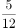第二次出现是第（    ）个数。

- **A**. 120
- **B**. 126
- **C**. 140　✅
- **D**. 146

**答案**：C

**官方解析**

将原数列反约分，根据相同分母分组可表示为：，，，，，，，，，，，，，，，，······。观察分母发现：分母为1、2、3、4的各组分数分别有1个、3个、5个、7个，即分母为n的分数有（2n-1）个，也就是分数个数是公差为2的等差数列；观察分子发现：各组的分子以1为公差，依次由1向n递增，再递减回1。

综上规律可知：根据该数列的排列规律，以12为分母的分数有2×12-1=23个。根据等差数列公式：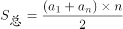，可得从1至12为分母的分数总个数为个。以12为分母的分数分别为：，······，，······，，······，，，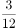，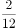，。即第二次出现后面还有4个分数，则第二次出现是原数列中第144-4=140个数。

故正确答案为C。

---

### 第 4 题　qid 4674828 · 数学运算

一个筐里装有2160个苹果，如果不是一次全部拿出，也不是一个一个地拿，要求每次拿的个数相同，拿到最后正好取完，那么共有（    ）种不同的拿法。

- **A**. 30
- **B**. 36
- **C**. 38　✅
- **D**. 40

**答案**：C

**官方解析**

根据题意：总数=每次拿的个数×次数，每次拿出的苹果个数为2160的因子，故不同的因子对应不同的拿法。因为，那么2160的因子，包含2的情况可以分为0个2，1个2，2个2，3个2，4个2，有5种；包含3的情况可以分为0个3，1个3，2个3，3个3，有4种；包含5的情况可以分为0个5，1个5，有2种。所以2160的因子个数为5×4×2=40个，其中包含1和2160这两个因子，根据题意，去掉1与2160这两个因子，符合题意的因子共有40-2=38个，即38种不同的拿法。

故正确答案为C。

---

### 第 5 题　qid 4674830 · 数学运算

一名工人操作切割机可以一次性切割很多根钢管，并且无论一次切割多少根钢管，每次切割所需要的时间都一样。如果用最高效方式把一根很长的钢管切成16段要8分钟，那么用一次只切割一根钢管的方式把这根完整的钢管切成32段需要：

- **A**. 10分钟
- **B**. 16分钟
- **C**. 1小时4分钟
- **D**. 1小时2分钟　✅

**答案**：D

**官方解析**

根据题意，若用最高效方式，则钢管每次被切割，数量会变成原来的2倍，因为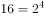，所以切成16段需要4次，可得切割一次所需时间为8÷4=2分钟。若一次只切割一根钢管，则变成2段需要1次，再变成4段需要2次，再变成8段需要4次，再变成16段需要8次，再变成32段需要16次，故共计1+2+4+8+16=31次，所需时间为31×2=62分钟，即1小时2分钟。

故正确答案为D。

---

### 第 6 题　qid 4674827 · 数学运算

为评选扶贫工作先进项目案例，某乡镇举行优秀扶贫项目案例评选活动，共邀请71名评委参加投票评选，从甲、乙、丙、丁、戊五个案例中评选“最佳案例”，最终甲得选票35张，乙得选票为第二名，丙、丁票数一样，戊得选票8张为最少，那么乙得选票（    ）张。

- **A**. 8
- **B**. 9
- **C**. 10　✅
- **D**. 11

**答案**：C

**官方解析**

设乙得票数为x张，丙和丁得票数均为y张，根据题意可列方程：35+x+2y+8=71，整理可得x+2y=28。2y与28均为偶数，则x必为偶数，排除B、D两项，且乙为第二名，得票数应高于戊，排除A项。代入C项验证，当乙得票10张时，y=（28-10）÷2=9张，符合题意。
故正确答案为C。

---

### 第 7 题　qid 4674832 · 数学运算

在平面直角坐标系中，如果点P（4a-7，16-19a）在第三象限内，其横、纵坐标都是整数，则点P的坐标是：

- **A**. （-3，-1）
- **B**. （-3，-3）　✅
- **C**. （-1，-3）
- **D**. （-7，-3）

**答案**：B

**官方解析**

点P在直角坐标系第三象限内，即横、纵坐标均为负数，代入选项验证。
当横坐标4a-7=-3时，解得a=1，代入纵坐标16-19a=-3，排除A项，B项当选。
同理，当纵坐标16-19a=-3时，横坐标必为-3，排除C、D两项。
故正确答案为B。

---

### 第 8 题　qid 4674829 · 数学运算

一项工程，甲单独完成需要15天，乙单独完成需要30天，丙单独完成需要60天，如果按照甲乙丙的顺序交替进行每人做一天，那么需要（    ）天能完成。

- **A**. 25　✅
- **B**. 26
- **C**. 27
- **D**. 28

**答案**：A

**官方解析**

赋值工程总量为60，则甲的效率为60÷15=4，乙的效率为60÷30=2，丙的效率为60÷60=1。若按照甲乙丙的顺序交替进行每人做一天，那么3天为一周期，一周期内完成工作量=4+2+1=7，因为个周期······4个工作量，余下的工作量正好由甲做一天即可完成，所以整个工作过程共需8×3+1=25天。

故正确答案为A。

---

### 第 9 题　qid 4674799 · 数学运算

某机关下午2点整派车去党校接某教授作党史教育专题授课，往返需1小时，该教授在下午1点整就离开党校向该机关步行走来，途中遇到接他的车，便乘上车去该机关，于下午2点50分到达，不考虑上下车时间，汽车的速度是教授步行速度的（    ）。

- **A**. 12倍
- **B**. 13倍
- **C**. 15倍
- **D**. 17倍　✅

**答案**：D

**官方解析**

根据题意，某机关下午2点整派车去党校接教授，往返需1小时，可推出汽车到党校时间为下午2：30。但汽车2点从机关出发去接教授，2：50便已返回，则可推出汽车遇到教授时为2：25，少走了5分钟的路程。教授从1点出发，遇到汽车时已行走了2：25-1:00=85分钟的路程。汽车少走的路程即为教授步行的路程。当路程一定时，时间与速度成反比，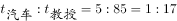，则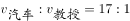。因此汽车的速度是教授步行速度的17倍。

故正确答案为D。

---

### 第 10 题　qid 4674801 · 数学运算

某单位在编一本年鉴，其页数需要用6893个数字，那么这本年鉴共有（    ）页。

- **A**. 1999
- **B**. 1994
- **C**. 2000　✅
- **D**. 2004

**答案**：C

**官方解析**

根据选项可确定该年鉴的页数在1000页以上，但不到10000页。根据页码所需数字个数分情况计算：

①1-9页，共有9页，每页1个数字，共需9×1=9个数字；

②10-99页，共有90页，每页2个数字，共需90×2=180个数字；

③100-999页，共有900页，每页3个数字，共需900×3=2700个数字。

此时还剩6893-9-180-2700=4004个数字，从1000页开始，每页4个数字，有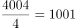页，999+1001=2000页，即这本年鉴共有2000页。

故正确答案为C。

---

### 第 11 题　qid 4674802 · 数学运算

不到30岁的哥哥今年的年龄正好是弟弟年龄的5倍，若干年后哥哥的年龄就是弟弟的4倍，又过了若干年，哥哥的年龄将是弟弟的3倍，则今年两兄弟的年龄差是（    ）岁。

- **A**. 12　✅
- **B**. 13
- **C**. 14
- **D**. 15

**答案**：A

**官方解析**

方法一：根据题意，设今年弟弟的年龄为n，则哥哥的年龄为5n，那么两人的年龄差为4n，即为4的倍数，观察选项，只有A项符合。
方法二：根据“不到30岁的哥哥今年的年龄正好是弟弟年龄的5倍”可知，今年哥哥与弟弟的年龄可能分别为5岁与1岁、10岁与2岁、15岁与3岁、20岁与4岁、25岁与5岁，则今年两兄弟的年龄差可能是4岁、8岁、12岁、16岁、20岁。只有A项符合。
故正确答案为A。

---

### 第 12 题　qid 4674804 · 数学运算

如图，一块正方形的花园ABCD的面积是120平方米，为了种植不同种类的花将其划分成一些小区域，其中，E是AB的中点，F是BC的中点，则四边形区域BGHF的面积是（    ）平方米。

- **A**. 14　✅
- **B**. 16
- **C**. 18
- **D**. 20

**答案**：A

**官方解析**

因为E是AB的中点，所以为正方形ABCD面积的，即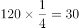平方米。因为，且，则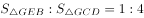。因为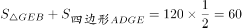平方米，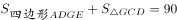平方米，因此平方米，则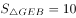平方米。

因为，，所以，因此。则，其中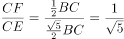，则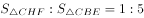，故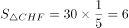平方米。则四边形BGHF的面积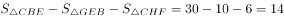平方米。

故正确答案为A。

---

### 第 13 题　qid 4674805 · 数学运算

制药厂有一条疫苗生产线、一座仓库和若干相同的货车、流水线，每天的产量不变，产品均存入仓库。仓库的疫苗可供19辆货车送货24天，或17辆货车送货30天，那么用（    ）辆货车送货6天后，坏了4辆车，剩下的货车又送了2天刚好把所有的疫苗送完。

- **A**. 30
- **B**. 40　✅
- **C**. 50
- **D**. 60

**答案**：B

**官方解析**

假设1辆货车1天可运送1支疫苗，制药厂每天生产疫苗x支。根据牛吃草公式Y=（N-x）T，可列式：Y=（19-x）×24=（17-x）×30，解得x=9，Y=240。设所求货车为N辆，则可列式：Y=（N-9）×6+[（N-4）-9]×2=240，解得N=40。
故正确答案为B。

---

## 判断推理

### 第 1 题　qid 4675361 · 图形推理

从所给四个选项中，选择最合适的一个填入问号处，使之呈现一定的规律：

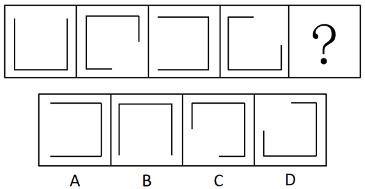

- **A**. A
- **B**. B　✅
- **C**. C
- **D**. D

**答案**：B

**官方解析**

元素组成相同，优先考虑位置关系。观察发现，线条在以正方形为路径按顺时针方向平移，且每次平移1.5个正方形边长，故？处图形线条的位置如下图所示，对应B项。

故正确答案为B。

---

### 第 2 题　qid 4675382 · 图形推理

从所给四个选项中，选择最合适的一个填入问号处，使之呈现一定规律性：

- **A**. A
- **B**. B
- **C**. C
- **D**. D　✅

**答案**：D

**官方解析**

观察题干图形，发现图1和图2的外框不变，内部图形位置变化，图2与图3的内部图形不变，外框变化。第二组图应用此规律，图1和图2的外框不变，内部图形位置变化，图2与图3的内部图形不变，外框变化，只有D符合该规律。
故正确答案为D。

---

### 第 3 题　qid 4675394 · 图形推理

把下面六个图形分为两类，使每一个图形都有各自共同特征或规律，分类最合理的一项是：

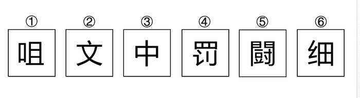

- **A**. ①②③，④⑤⑥
- **B**. ①④⑤，②③⑥
- **C**. ①③⑥，②④⑤　✅
- **D**. ①④⑥，②③⑤

**答案**：C

**官方解析**

本题为分组分类题目。元素组成不同，且无明显属性规律，考虑数量规律。观察发现，题干图形均由汉字组成，且存在封闭区域，考虑面数量，但整体数面无法分组。再次观察发现，题干图形面数量依次为4、1、2、3、5、4，图①③⑥面数量为偶数个，图②④⑤面数量为奇数个，故图①③⑥为一组，图②④⑤为一组。
故正确答案为C。

---

### 第 4 题　qid 4675381 · 图形推理

左边给定的是纸盒外表的展开图，右边哪一项能由它折叠而成？

- **A**. A
- **B**. B　✅
- **C**. C
- **D**. D

**答案**：B

**官方解析**

将题干展开图标上序号，如下图所示，逐一分析选项。

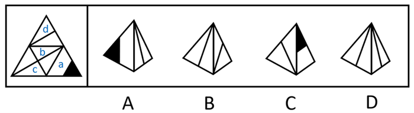

A项：选项的左侧面是面a，右侧面挨着面a中白色梯形的长底边，因此右侧面是面b。如下图所示，分别在题干和选项中，以面b中的线条与面顶点的交点为起点，绕着面b顺时针画边。在题干中，边1挨着面a，但在选项中，边3挨着面a，选项与题干不一致，排除；

B项：选项包含面c和面d，选项与题干一致，当选；

C项：选项的右侧面是面a，如下图所示，分别在题干和选项中，以面a中黑色三角形与面顶点的交点为起点，绕着面a顺时针画边。在题干中，边3挨着面d，且与面d内线条相交于边3的中点，在选项中，边3挨着左侧面，但不与左侧面内线条相交于边3的中点，选项与题干不一致，排除；

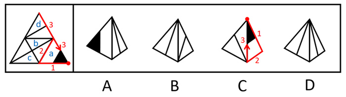

D项：选项中的两个面是面b、面c或面d，如下图所示，选项左侧面和右侧面内的线条相交，且相交于面顶点的位置，在题干的面b、面c或面d中，面内线条相交的只有面c和面b，但并不相交于面的顶点位置，选项和题干不一致，排除。

故正确答案为B。

---

### 第 5 题　qid 4675354 · 图形推理

从所给选项中，选择最合适的一个填入问号处，使之呈现一定规律：

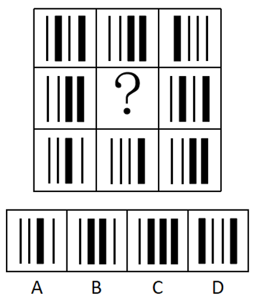

- **A**. A　✅
- **B**. B
- **C**. C
- **D**. D

**答案**：A

**官方解析**

元素组成相似，优先考虑样式规律，黑白运算无规律，考虑其他加减同异规律。横向观察发现，题干图形满足下列二进制加法规则：右侧为小单位，左侧为大单位（已按照千位、百位、十位、个位依次标注），黑色粗线条代表1，黑色细线条代表0，根据二进制加法规则“0+0=0、0+1=1、1+0=1、1+1=10（0进位为1）”进行运算。在第一行中，第一个图为“0101”，第二个图为“0011”，先从个位加起，为“1+1=10”，此时需要往前进1位，十位相加为“0+1=1”，再与个位进上来的“1”进行相加为“1+1=10”，因此需要继续往前进1位，百位相加为“1+0=1”，再与十位进上来的“1”进行相加为“1+1=10”，需要继续往前进1位，千位相加为“0+0=0”，再与百位进上来的“1”进行相加为“0+1=1”，故第三个图为“1000”；第三行验证规律，在第三行中，第一个图为“0010”，第二个图为“0001”，先从个位加起，为“0+1=1”，十位相加为“1+0=1”，百位和千位相加均为“0+0=0”，故第三个图为“0011”，经验证符合规律。在第二行中，第一个图为“0011”，第三个图为“0101”，故？处应选择图为“0010”的选项，只有A项符合规律。

故正确答案为A。

---

### 第 6 题　qid 4675370 · 定义判断

水军，是网络水军的简称，是指那些被雇佣的、针对特定内容发布特定信息的网络写手。他们通常活跃在电子商务网站、论坛、微博等社变网络平台中，通过伪装成普通网民或消费者来转发或传播特定信息，以对正常用户产生影响，从而达到特定目的。
根据上述定义，以下不属于水军的是：

- **A**. 某主播雇网友在该平台另一个主播的直播间发带侮辱性词汇的弹幕
- **B**. 某电影上映后，电影制作方号召其员工在各大影评网站刷分
- **C**. 某电视剧开播后，该剧主演的粉丝纷纷到各大影评网站发帖评论，以提高该剧的收视率　✅
- **D**. 某明星人设崩塌，其代言品牌的公司员工在网上大肆传播该明星的正面事例，试图挽回人设

**答案**：C

**官方解析**

第一步：找出定义关键词。
“被雇佣的、针对特定内容发布特定信息的网络写手”。
第二步：逐一分析选项。
A项：该项中某主播雇网友来侮辱另一个主播，被雇佣的网友符合“被雇佣的、针对特定内容发布特定信息的网络写手”，符合定义，排除；
B项：该项中电影制作方号召其员工在各大影评网站刷分，电影制作方的员工符合“被雇佣的、针对特定内容发布特定信息的网络写手”，符合定义，排除；
C项：该项中该剧主演的粉丝纷纷到各大影评网站发帖评论，发帖是粉丝对偶像的一种自发的支持行为，该剧主演的粉丝不符合“被雇佣的、针对特定内容发布特定信息的网络写手”，不符合定义，当选；
D项：该项中代言品牌的公司员工为挽回明星的人设而在网上大肆传播该明星的正面事例，代言品牌的公司员工符合“被雇佣的、针对特定内容发布特定信息的网络写手”，符合定义，排除。
本题为选非题，故正确答案为C。

---

### 第 7 题　qid 4675355 · 定义判断

虚拟现实技术（Virtual Reality，缩写为VR），又称灵境技术，是20世纪发展起来的一项全新的实用技术。虚拟现实技术将计算机科学、电子信息、仿真技术融于一体，以实现计算机模拟虚拟环境从而给人以环境沉浸感。用户可以在虚拟现实世界体验到最真实的感受，其模拟的环境与现实世界难辨真假，让人有身临其境的感觉；同时，它具有超强的仿真系统，真正实现了人机交互，使人在操作过程中，可以随意操作并且得到环境最真实的反馈。
根据上述定义，以下不属于虚拟现实技术应用的是：

- **A**. 小红去影院观看了最新的5D电影，随着电影情节的发展，电影院会通过吹风、喷水、震动，以及3D画面模拟出相应的场景，让小红感觉自己就是影片的亲历者　✅
- **B**. 小张购买了一台头戴设备和一个手柄，从此他只需要在房间里就能玩网球游戏，除了没有拿网球拍那么累之外，其它就和在网球场打球的感觉一样
- **C**. 医学专家们利用计算机在虚拟空间中模拟出人体组织和器官，让学生在其中进行模拟操作，学生能真切感受到手术刀切入人体肌肉组织、触碰到骨头的感觉
- **D**. 人们利用计算机的统计模拟，在虚拟空间中重现了现实中的航天飞机与飞行环境，使飞行员不需要真实的航天飞机就可以进行飞行训练和实验操作，极大地降低了实验经费和实验危险系数

**答案**：A

**官方解析**

第一步：找出定义关键词。
“将计算机科学、电子信息、仿真技术融于一体”、“实现计算机模拟虚拟环境”、“给人以环境沉浸感”。
第二步：逐一分析选项。
A项：小红去影院观看了最新的5D电影，电影院通过吹风、喷水、震动，以及3D画面模拟出相应的场景，让小红感觉自己就是影片的亲历者。5D电影通过吹风、喷水、震动，以及3D画面模拟出相应的场景，而非通过计算机进行模拟，不符合“将计算机科学、电子信息、仿真技术融于一体”、“实现计算机模拟虚拟环境”，不符合定义，当选；
B项：小张通过头戴设备和手柄在房间里玩网球游戏，获得在网球场上打球一样的感觉，符合“将计算机科学、电子信息、仿真技术融于一体”、“实现计算机模拟虚拟环境”、“给人以环境沉浸感”，符合定义，排除；
C项：医学专家们利用计算机在虚拟空间中模拟出人体组织和器官，让学生在其中进行模拟操作，学生能真切感受到手术刀切入人体肌肉组织、触碰到骨头的感觉，符合“将计算机科学、电子信息、仿真技术融于一体”、“实现计算机模拟虚拟环境”、“给人以环境沉浸感”，符合定义，排除；
D项：人们利用计算机的统计模拟，在虚拟空间中重现了现实中的航天飞机与飞行环境，使飞行员不需要真实的航天飞机就可以进行飞行训练和实验操作，符合“将计算机科学、电子信息、仿真技术融于一体”、“实现计算机模拟虚拟环境”、“给人以环境沉浸感”，符合定义，排除。
本题为选非题，故正确答案为A。

---

### 第 8 题　qid 4675366 · 定义判断

内卷，指当一个群体所拥有的资源无法满足所有人的需求时，人们通过竞争来争夺资源。然而这种竞争不但对整个群体并无益处，反而会因为边际收益递减，导致内耗加剧，损害整个群体的利益。
根据上述定义，以下现象属于内卷的是：

- **A**. 前些年运力紧张，为买到车票，购票者不得不加价从“黄牛”手中购票，“黄牛”见有利可图，于是更加疯狂地购买车票，车票价格更加水涨船高　✅
- **B**. 工厂工人张师傅琢磨出一种提高产品质量、提高加工效率的新工艺并推广到全公司，根据奖励制度，该厂要付出张师傅加薪1000元的成本
- **C**. T公司每立项一款产品，都会交给两个以上部门独立研发，然后内部比拼，只有胜利者才被推向市场，失败者惨淡出局，公司投入打了“水漂”
- **D**. 艺术家对完美有一种近乎偏执的执着，宁可毁掉自己的作品，也坚决不把他认为有任何一点瑕疵的作品公诸于世，最终艺术家潦倒一生

**答案**：A

**官方解析**

第一步：找出定义关键词。
“当一个群体所拥有的资源无法满足所有人的需求时”、“人们通过竞争来争夺资源”、“这种竞争不但对整个群体并无益处、反而会因为边际收益递减”、“导致内耗加剧，损害整个群体的利益”。
第二步：逐一分析选项。
A项：运力紧张，符合“当一个群体所拥有的资源无法满足所有人的需求时”，购票者为买到车票加价购票，符合“人们通过竞争来争夺资源”，但车票价格更加水涨船高，符合“这种竞争不但对整个群体并无益处、反而会因为边际收益递减”、“导致内耗加剧，损害整个群体的利益”，符合定义，当选；
B项：张师傅琢磨出可以提高产品质量和加工效率的新工艺，工厂给予奖励，没有涉及到通过竞争争夺资源，也没有损害群体的利益，不符合“人们通过竞争来争夺资源”、“这种竞争不但对整个群体并无益处、反而会因为边际收益递减”、“导致内耗加剧，损害整个群体的利益”，不符合定义，排除；
C项：公司让两个以上部门竞争研发同一款产品，部门之间的良性竞争能让公司推出更好的产品，不符合“这种竞争不但对整个群体并无益处、反而会因为边际收益递减”、“导致内耗加剧，损害整个群体的利益”，不符合定义，排除；
D项：艺术家对于作品的完美追求，不是通过竞争争夺资源，不符合“人们通过竞争来争夺资源”，并且艺术家因此能塑造出更完美的作品，不符合“这种竞争不但对整个群体并无益处、反而会因为边际收益递减”、“导致内耗加剧，损害整个群体的利益”，不符合定义，排除。
故正确答案为A。

---

### 第 9 题　qid 4675378 · 定义判断

纯粹接触效应，是指某一外在刺激，仅仅因为呈现的次数越频繁（个体能够接触到该刺激的机会越多），个体对该刺激将越喜欢。
根据上述定义，以下属于纯粹接触效应的是:

- **A**. 某网络红人为博取眼球，经常发表各种标新立异的奇怪言论，引起社会广泛热议的同时也给他带来了不菲的收入
- **B**. 新人小李特别较真，最初与同事相处并不融治，但随着深入接触，大家发现了小李对事不对人，关系也逐渐融治
- **C**. 小陈刚拿到驾照的时候开车小心翼翼，后来随着驾龄的增长，他的技术也越来越好，面对各种突发情况都能妥善处置
- **D**. 小赵每天上下班都要路过商场，橱窗里展示的一件裙子，初看平平无奇，但小赵却越看越觉得喜欢　✅

**答案**：D

**官方解析**

第一步：找出定义关键词。
“仅仅因为个体能够接触到该刺激的机会越多”、“个体对该刺激将越喜欢”。
第二步：逐一分析选项。
A项：某网络红人因为经常发表标新立异的言论而引起社会热议，引起社会热议可以是积极的也可以是消极的，不代表社会就会越来越喜欢，不符合“个体对该刺激将越喜欢”，不符合定义，排除；
B项：同事随着深入的接触发现小李对事不对人的品质，但是同事并非仅仅因为接触小李而喜欢他，而是因为在接触的过程中发现了小李对事不对人的品质才喜欢他，不符合“仅仅因为个体能够接触到该刺激的机会越多”，不符合定义，排除；
C项：小陈的驾驶技术因为驾龄增长变得越来越好，面对突出情况能够妥善处置，但是并不代表小陈喜欢突发情况，不符合“个体对该刺激将越喜欢”，不符合定义，排除；
D项：小赵仅仅因为每天上下班都要看见橱窗里面的裙子，然后就越看越喜欢，原因就是看的次数多了，所以喜欢，符合“仅仅因为个体能够接触到该刺激的机会越多”、“个体对该刺激将越喜欢”，符合定义，当选。
故正确答案为D。

---

### 第 10 题　qid 4675357 · 定义判断

表见代理是指行为人虽无代理权，但由于本人的行为，造成了足以使善意第三人相信其有代理权的表现，而与善意第三人进行的、由本人承担法律后果的代理行为。
根据上述定义，下列选项不属于表见代理的是：

- **A**. 李某原为海生公司的业务员，2000年被公司解聘。李某在清理办公室期间发现了两份盖有公章的空白合同书并带走。同月，李某使用该空白合同书以海生公司的名义与三环公司订立购买合同。当海生公司获知后，遂发函三环公司要求其不要发货，但三环公司仍坚持发货　✅
- **B**. 陆某是本市一套房屋的产权人，去年5月，陆某儿子拿着他的印章、身价证和房屋产权证原件委托一家房产中介公司出售房屋。中介公司很快找到了下家徐某。陆某儿子便拿陆某印章和徐某签了房屋买卖合同，并到房地产交易中心办理了房屋过户手续
- **C**. 张某是甲商贸公司员工，曾长期代表甲公司与乙公司签订家电购销合同。2016年3月，张某被甲公司解聘，但甲公司并未收回给张某的尚在有效期内的授权委托书，4月，张某凭借授权委托书与乙公司签订了10万元的家电购买合同
- **D**. 甲公司因业务需要，将原圆型合同专用章更换成方型合同专用章，但当时未登记收回或销毁，由李某保管，两个月后，李某辞职，并用其同一家商场订立了购销合同

**答案**：A

**官方解析**

第一步：找出定义关键词。

“行为人无代理权”、“由于本人的行为”、“造成了足以使善意第三人相信其有代理权的表现”、“与善意第三人进行的、由本人承担法律后果的代理行为”。

第二步：逐一分析选项。

A项：当海生公司获知被解聘的李某拿着原公司盖有公章的空白合同与三环公司订立购买合同后，遂发函三环公司要求其不要发货，但三环公司仍坚持发货，说明三环公司在明知道李某没有代理权后，依然坚持发货，此时三环公司不符合“善意第三人”，不符合定义，当选；

B项：陆某儿子不是房屋产权人，不能代表陆某，符合“行为人无代理权”，但陆某儿子拿着陆某的印章、身价证和房屋产权证原件让徐某误相信其具有代理权，符合“由于本人的行为”、“造成了足以使善意第三人相信其有代理权的表现”，最终双方签订了房屋买卖合同，说明代理行为成立，符合“与善意第三人进行的、由本人承担法律后果的代理行为”，符合定义，排除；

C项：被解聘的张某拿着原公司尚在有效期内的授权委托书与乙公司签订家电购销合同，张某已被解雇，说明张某已不具有原公司的代理权，符合“行为人无代理权”，但张某因持有原公司有效期内的授权委托书而使乙公司误相信其具有代理权，符合“由于本人的行为”、“造成了足以使善意第三人相信其有代理权的表现”，最终双方签订了购销合同，说明代理行为成立，符合“与善意第三人进行的、由本人承担法律后果的代理行为”，符合定义，排除；

D项：已辞职的李某拿着原公司未回收的合同专用章与商场签订购销合同，李某已辞职，说明李某已不具有原公司的代理权，符合“行为人无代理权”，但李某因持有原公司未收回的合同专用章而使商场误相信其具有代理权，符合“由于本人的行为”、“造成了足以使善意第三人相信其有代理权的表现”，最终双方签订了购销合同，说明代理行为成立，符合“与善意第三人进行的、由本人承担法律后果的代理行为”，符合定义，排除。

注：如下图，表见代理的成立，要求相对人必须是善意且无过失。A项中三环公司在明知道李某没有代理权后依然坚持发货，属于已经知晓没有代理权，但仍要继续合同，故不符合表见代理。

本题为选非题，故正确答案为A。

---

### 第 11 题　qid 4675356 · 类比推理

2019年8月，一个天文观测团队用引力波探测到一个2.6倍太阳质量天体。此前，人们发现的最小黑洞为5倍太阳质量，而最重的中子星质量不超过2.5倍太阳质量。由于中子星是质量“不达标”（不足以形成黑洞）的恒星在寿命终结时坍缩形成的一种星体，天文学家便把2.5倍和5倍太阳质量之间的差距称为“质量间隙”。现在探测到这个2.6倍太阳质量的天体，说明：

- **A**. “质量间隙”或许并不存在　✅
- **B**. 该天体是黑洞的可能性更大
- **C**. 该天体是中子星的可能性更大
- **D**. 该天体不能以黑洞或中子星来定义

**答案**：A

**官方解析**

日常结论题，根据题干信息逐一分析选项。
A项：题干已知“2.5倍和5倍太阳质量之间的差距称为‘质量间隙’”，而现在探测到的天体是2.6倍太阳质量，即“质量间隙”中存在天体，说明“质量间隙”或者不是现有理论中的“2.5倍和5倍之间的差距”，或者可能不存在，选项可以推出，当选；
B项：题干已知“人们发现的最小黑洞为5倍太阳质量，而最重的中子星质量不超过2.5倍太阳质量”，而现在探测到的天体是2.6倍太阳质量，不能按照现有理论做出判定，故可能性大小无法推出，排除；
C项：题干已知“人们发现的最小黑洞为5倍太阳质量，而最重的中子星质量不超过2.5倍太阳质量”，而现在探测到的天体是2.6倍太阳质量，不能按照现有理论做出判定，故可能性大小无法推出，排除；
D项：题干已知“人们发现的最小黑洞为5倍太阳质量，而最重的中子星质量不超过2.5倍太阳质量”，而现在探测到的天体是2.6倍太阳质量，但题干并没有给出黑洞和中子星的定义，因此该天体不能按现有理论进行判定，选项过于绝对，无法推出，排除。
故正确答案为A

---

### 第 12 题　qid 4675360 · 逻辑判断

一遇强降雨，横断山脉山区就会多发滑坡和泥石流等地质灾害，因此每逢阴雨连绵，横断山脉地区的道路抢险部门都严阵以待。
上述结论成立所需要的假设是（    ）。

- **A**. 我国黄土高原地区也是滑坡和泥石流的多发区域
- **B**. 滑坡和泥石流很容易导致道路损毁和堵塞　✅
- **C**. 横断山脉地区一年中都有滑坡和泥石流发生
- **D**. 横断山脉地区在夏季总是阴雨连绵

**答案**：B

**官方解析**

第一步：找出论点和论据。
论点：每逢阴雨连绵，横断山脉地区的道路抢险部门都严阵以待。
论据：一遇强降雨，横断山脉山区就会多发滑坡和泥石流等地质灾害。
本题论点讨论的是雨天横断山脉地区道路抢修部门都严阵以待，论据讨论的是雨天横断山脉山区多发生滑坡和泥石流等地质灾害，论点论据话题不一致，且提问方式为“假设”，优先考虑搭桥，即建立“滑坡和泥石流等地质灾害”和“道路抢险”的联系。
第二步：逐一分析选项。
A项：该项指出我国滑坡和泥石流的多发区域地点，而论点讨论的是雨天横断山脉地区道路抢修部门都严阵以待，话题不一致，无法加强，排除；
B项：该项指出滑坡和泥石流很容易导致道路损毁和堵塞，即“滑坡和泥石流”会导致“道路隐患”，从而需要“道路抢险部门严阵以待”以便道路抢险，属于搭桥项，可以加强，当选；
C项：该项指出横断山脉地区滑坡和泥石流的发生频率，而论点讨论的是雨天横断山脉地区道路抢修部门都严阵以待，话题不一致，无法加强，排除；
D项：该项指出横断山脉地区在夏季总是阴雨连绵，而论点讨论的是雨天横断山脉地区道路抢修部门都严阵以待，话题不一致，无法加强，排除。
故正确答案为B。

---

### 第 13 题　qid 4675363 · 逻辑判断

海洋中珊瑚的美丽颜色来自于其体内与之共生的藻类生物，其中虫黄藻是最重要的一类单细胞海藻。二者各取所需，相互提供食物。全球气候变暖造成的海水升温导致虫黄藻等藻类大量死亡，进而造成珊瑚本身死亡，引发白化现象。然而研究发现，珊瑚能通过选择耐热的其他藻类生物等途径，来应对气候变暖带来的挑战。
以下哪项如果为真，将削弱这一研究发现?

- **A**. 一些虫黄藻能够比耐热的其他藻类耐受更高的海水温度
- **B**. 有些藻类耐热性的形成需要一个长期的过程
- **C**. 有些虫黄藻逐渐适应了海水温度的升高并存活下来
- **D**. 有些已白化的珊瑚礁中也发现了死去的耐热藻类生物　✅

**答案**：D

**官方解析**

第一步：找到论点和论据。
论点：珊瑚能通过选择耐热的其他藻类生物等途径，来应对气候变暖带来的挑战。
论据：无。
本题只有论点，没有论据，削弱优先考虑削弱论点，即珊瑚不能通过选择耐热的其他藻类生物等途径，来应对气候变暖带来的挑战。
第二步：逐一分析选项。
A项：指出一些虫黄藻比其他耐热藻类耐热性强，但一些不代表全部，无法判断具体数量，可能大部分虫黄藻耐受的海水温度并没有耐热的其他藻类高，只是一种可能性的削弱，保留；
B项：选项说的是藻类耐热性形成时间，与通过耐热的其他藻类生物能否应对气候变暖无关，无法削弱，排除；
C项：选项说的是一些虫黄藻的耐热性较高，而论点说的是“耐热的其他藻类生物”，属于无关项，无法削弱，排除；
D项：指出有些选择了其他耐热藻类的珊瑚也出现了白化现象，举反例证明这些耐热的其他藻类生物不能帮助珊瑚来应对气候变暖，削弱论点，削弱力度大于A项，当选。
故正确答案为D。

---

### 第 14 题　qid 4675380 · 类比推理

真真家的电话号码是一个5位数。并且由5个完全不同的数字组成。
善善猜测道：“它是84261"；
美美猜测道：“它是49280"；
诚诚猜测道：“它是26048”。
真真笑着说:“你们每个人都猜对了位置不相邻的两个数字”。则真真家的电话号码是：

- **A**. 62804
- **B**. 82406
- **C**. 64208
- **D**. 86240　✅

**答案**：D

**官方解析**

第一步：分析题干条件。
（1）善善：84261；
（2）美美：49280；
（3）诚诚：26048；
（4）真真：每个人都猜对了位置不相邻的两个数字。
第二步：逐一验证选项。
题干信息不确定，选项信息充分，优先考虑代入法。
代入A项：善善没有猜对数字，不符合条件（4），排除；
代入B项：善善只猜对了1个数字，不符合条件（4），排除；
代入C项：善善猜对了“4”和“2”，但位置相邻，不符合条件（4），排除；
代入D项：善善猜对了“8”和“2”，美美猜对了“2”和“0”，诚诚猜对了“6”和“4”，且位置均不相邻，满足条件（4），当选。
故正确答案为D。

---

### 第 15 题　qid 4675369 · 逻辑判断

所有与新型冠状病毒肺炎患者接触的人都被隔离了。所有被隔离的人都与王五接触过。
假设这个命题为真，则下面命题（    ）也是真的。

- **A**. 可能有人没有接触过新型冠状病毒肺炎患者，但接触过王五　✅
- **B**. 王五是新型冠状病毒肺炎患者
- **C**. 所有与王五接触过的人都被隔离了
- **D**. 所有新型冠状病毒肺炎患者都与王五接触过

**答案**：A

**官方解析**

第一步：翻译题干。

①与新型冠状病毒肺炎患者接触的人被隔离；

②被隔离与王五接触过；

由①②可以递推出：③与新型冠状病毒肺炎患者接触的人被隔离与王五接触过。

第二步：逐一分析选项。

A项：“没有接触过新型冠状病毒肺炎患者”，是对③的否前，可以推出可能性结论，因此“可能有人没有接触过新型冠状病毒肺炎患者，但接触过王五”，可以推出，当选；

B项：题干并未涉及新型冠状病毒肺炎患者，无法确定王五是否为新型冠状病毒肺炎患者，无法推出，排除；

C项：翻译为：与王五接触过被隔离，是对③的肯后，肯后得不到确定性的结论，无法推出，排除；

D项：题干并未涉及新型冠状病毒肺炎患者，无法得出新型冠状病毒肺炎患者是否与王五接触过，无法推出，排除。

故正确答案为A。

---

### 第 16 题　qid 4675379 · 逻辑判断

目前认为造成白垩纪末期（约6600万年前）包括恐龙在内的大量生物灭绝的原因是，一颗直径约10千米的巨大陨石撞击了地球。1991年，陨石撞击的重要证据——陨石坑在墨西哥尤卡坦半岛附近发现。有学者提出假说如下：陨石撞击地球后，岩石等产生的尘埃造成植物无法进行光合作用，气候变得寒冷，恐龙等生物无法适应这种环境变化，从而灭绝。
以下说法最能有力驳斥上述恐龙灭绝原因的是：

- **A**. 陨石撞击产生的岩石尘埃粒径约为0.1毫米，停留在大气中最多也就1周左右，阳光仅被阻挡1周的环境变化不至于引起生物灭绝　✅
- **B**. 在加拿大西部艾伯塔省的一个地区，发现大约8000万年前生活于此的恐龙有45种，但就在陨石撞击之前不久，种类已减少到只有6种
- **C**. 白垩纪末期的印度地区发生了大规模火山运动，在全球范围内带来了巨大的环境变化
- **D**. 目前尚不确定6600万年前在地球上撞出巨大陨石坑的是哪一颗小行星，因此也不清楚造成恐龙灭绝的始作俑者

**答案**：A

**官方解析**

第一步：找出论点和论据。
论点：目前认为造成白垩纪末期（约6600万年前）包括恐龙在内的大量生物灭绝的原因是，一颗直径约10千米的巨大陨石撞击了地球。
论据：陨石撞击地球后，岩石等产生的尘埃造成植物无法进行光合作用，气候变得寒冷，恐龙等生物无法适应这种环境变化，从而灭绝。
本题论点论据讨论的都是陨石撞击地球与造成恐龙等生物的灭绝之间的关系，论点论据话题一致，削弱可以优先考虑削弱论点，即指出陨石撞击地球不会造成恐龙等生物的灭绝。
第二步：逐一分析选项。
A项：该项说的是陨石撞击最多只会产生1周的环境变化，而这不至于引起生物灭绝，说明陨石撞击带来的影响很快就会结束，不会造成恐龙等生物的灭绝，削弱论点，可以削弱，当选；
B项：该项说的是8000万年前某一地区的恐龙种类在陨石撞击之前就已减少，而题干讨论的是白垩纪末期（约6600万年前）恐龙等生物灭绝的原因，话题不一致，无法削弱，排除；
C项：该项说的是白垩纪末期的印度地区发生的大规模火山运动给全球带来了巨大的环境变化，而题干讨论的是陨石撞击地球是否会造成恐龙等生物灭绝，话题不一致，无法削弱，排除；
D项：该项说的是目前尚不清楚造成恐龙灭绝的始作俑者，不明确项，无法削弱，排除。
故正确答案为A。

---

### 第 17 题　qid 4675367 · 类比推理

小赵早起去上课，室友们让小赵帮忙占一下座位。
①小钱说：我还要坐昨天的老位置，就和昨天一样在小孙和小李后面就好，他俩帮我挡着。
②小孙说：我还是往前点吧，昨天坐的地方太靠后，看不清黑板。
③小李说∶我都行，这次别让我像昨天一样坐第四排就好。
④小周说：小吴个子太高了，这次我不要坐他后面了，顺便给我带杯奶茶，谢谢。
⑤小吴说：我都行，和昨天一样，我们五个人在不同的排就好了。
小赵于是按照室友们的要求，给五个室友占好了座位。
到上课前，小吴先来到教室，看见总共五排桌子的教室里，第一排放着笔袋，第二排放着奶茶，第三排放着书包，第四排放着水杯，第五排放着一本书，都是小赵占座的东西，虽然小赵没在里面，但聪明的小吴很快就推断出自己应该坐在：

- **A**. 笔袋的位置
- **B**. 书包的位置
- **C**. 水杯的位置　✅
- **D**. 一本书的位置

**答案**：C

**官方解析**

第一步：分析题干条件。
①小钱和昨天位置相同，在小孙和小李后面；
②小孙比昨天靠前；
③小李昨天在第四排，今天不在第四排；
④小周不在小吴后面，要奶茶；
⑤和昨天一样，五个人在不同排；
⑥第一排放着笔袋，第二排放着奶茶，第三排放着书包，第四排放着水杯，第五排放着一本书。
第二步：根据题干条件进行推理。
结合条件④和⑥可知，小周在第二排放着奶茶的位置，而小周不在小吴的后面，则小吴不能在第一排放着笔袋的位置，排除A项。根据条件③可知小李昨天在第四排，再结合条件①可知小钱昨天和今天都在第五排，则小吴不能在第五排放着一本书的位置，排除D项。结合条件①③⑤可知，小李昨天在第四排，小钱昨天在第五排，则小孙昨天在前三排，而条件②说小孙比昨天还要靠前，则小孙今天在第一排或第二排，已知小周今天在第二排，所以小孙今天在第一排。另外已经推出小钱今天在第五排，那么今天只剩第三排和第四排，而条件③小李今天不在第四排，可知小李今天在第三排，则小吴今天在第四排，即放着水杯的位置，B项错误，C项正确。
故正确答案为C。

---

### 第 18 题　qid 4675371 · 逻辑判断

因为所有包装精美的歌碟都是制作很好的歌碟，所有中国风歌碟都是情调高雅的歌碟，所有这家音响店中我不推荐去听的歌碟都是情调不高雅的歌碟。因此，所有中国风歌碟都是制作很好的歌碟。
上述推论得以成立的前提条件是（    ）。

- **A**. 所有情调高雅的歌碟都是包装精美的歌碟　✅
- **B**. 所有包装不精美的歌碟都是我不可能会推荐去听的歌碟
- **C**. 所有情调高雅的歌碟都是中国风歌碟
- **D**. 所有我不推荐去听的歌碟都不是中国风歌碟

**答案**：A

**官方解析**

第一步：找出论点和论据。

论点：中国风歌碟制作很好的歌碟。

论据：包装精美的歌碟制作很好的歌碟，中国风歌碟情调高雅的歌碟，这家音响店中不推荐去听的歌碟情调不高雅的歌碟（根据逆否规则可将后两句串联推出：中国风歌碟情调高雅的歌碟这家音响店中推荐去听的歌碟）。

本题论点要得出中国风歌碟是制作很好的歌碟的结论，而论据中中国风歌碟与制作很好的歌碟之间没有直接关系，要使推论得以成立，需建立“中国风歌碟”与“制作很好的歌碟”之间的联系。

第二步：逐一分析选项。

A项：翻译为：情调高雅的歌碟包装精美的歌碟，将其补充到论据，可以得到：中国风歌碟情调高雅的歌碟包装精美的歌碟制作很好的歌碟，因此可以得到论点，可以加强，当选；

B项：翻译为：包装精美的歌碟会推荐去听的歌碟，根据逆否可以推出：推荐去听的歌碟包装精美的歌碟，但论据中限定了是“这家音响店中”会推荐去听的歌碟，而选项中会推荐去听的歌碟并不明确是否指的是在论据中的这家店，为不明确项，因此无法加强，排除；

C项：翻译为：情调高雅的歌碟中国风歌碟，将其补充到题干中，无法得到论点，因此无法加强，排除；

D项：翻译为：推荐去听的歌碟中国风歌碟，根据逆否可以推出：中国风歌碟推荐去听的歌碟，将其补充到题干中，无法得到论点，因此无法加强，排除。

故正确答案为A。

---

### 第 19 题　qid 4675358 · 逻辑判断

并非所有人都能够去当人民教师，除非有教师资格证。
如果这个假设为真，则以下哪项一定为假？

- **A**. 所有没有教师资格证的人都不能去当人民教师
- **B**. 即使有教师资格证也不一定能去当人民教师
- **C**. 没有人能够没有教师资格证就去当人民教师
- **D**. 有的人能去当人民教师，他们并没有教师资格证　✅

**答案**：D

**官方解析**

第一步：翻译题干。

题干可等价替换为“除非有教师资格证，否则有的人不能去当人民教师”。这里有无教师资格证和是否当人民教师都是同一部分人。主体一致，则可翻译为：当人民教师有教师资格证。

第二步：逐一分析选项。

A项：翻译为“有教师资格证当人民教师”，否后推否前，根据逆否等价原则可以推出，该项和题干都为真，排除；

B项：“有教师资格证”是肯定了题干的后件，肯后无法推出确定结论，该项真假不确定，排除；

C项：即所有人都需要有教师资格证才能当人民教师。翻译为“当人民教师有教师资格证”，肯前必肯后，该项和题干都为真，排除；

D项：翻译为有的人“当人民教师 且 有教师资格证”，与题干是矛盾关系，则该项为假，当选。

本题为选非题，故正确答案为D。

---

### 第 20 题　qid 4675359 · 逻辑判断

在驾驶证考试过程中，只有通过了科目一、二、三、四，才能获得机动车驾驶证，李四获得了机动车驾驶证，可见李四通过了科目一、二、三、四。
下述推理中，哪项与上述推理在形式上是相同的？

- **A**. 只有物体间发生摩擦，物体才会生热。物体间已发生了摩擦，所以物体必然要生热
- **B**. 只有年满18岁的公民，才有选举权。赵某已年满18岁了，所以他有选举权
- **C**. 只有在适当的温度下，鸡蛋才能孵出小鸡。现在，鸡蛋已经孵出了小鸡，可见温度是适当的　✅
- **D**. 我国《刑法》规定：致人重伤的处三年以上七年以下有期徒刑。被告已致人重伤，因此，他应处三年以上七年以下的有期徒刑

**答案**：C

**官方解析**

第一步：分析题干推理形式。

题干推理形式为：a（获得机动车驾驶证）b（通过了科目一、二、三、四），已经有a，所以有b。

第二步：逐一分析选项。

A项：a（生热）b（发生摩擦），已经有b，所以有a，与题干推理形式不一致，排除；

B项：a（有选举权）b（年满18岁的公民），已经有b，所以有a，与题干推理形式不一致，排除；

C项：a（孵出小鸡）b（适当的温度），已经有a，所以有b，与题干推理形式一致，当选；

D项：a（致人重伤）b（处三年以上七年以下有期徒刑），已经有a，应该有b，与题干推理形式不一致，排除。

故正确答案为C。

---

### 第 21 题　qid 4675372 · 类比推理

茕茕孑立：孤单

- **A**. 差强人意：差劲
- **B**. 望其项背：接近　✅
- **C**. 侧目而视：轻蔑
- **D**. 昨日黄花：过时

**答案**：B

**官方解析**

第一步：判断题干词语间逻辑关系。
茕茕孑立指孤零零一人站在那里，形容孤单，无依无靠，与孤单为近义关系。
第二步：判断选项词语间逻辑关系。
A项：差强人意指大体上还能使人满意，与差劲不是近义关系，与题干逻辑关系不一致，排除；
B项：望其项背指能够望见别人的颈的后部和脊背，表示赶得上或比得上，与接近为近义关系，与题干逻辑关系一致，当选；
C项：侧目而视指不敢从正面看，斜着眼睛看，形容畏惧而又愤恨，与轻蔑不是近义关系，与题干逻辑关系不一致，排除；
D项：昨日黄花是对词语“明日黄花”的误用，明日黄花用来比喻已失去新闻价值的报道或已失去应时作用的事物，指的是过时的事物，而非过时，与过时不是近义关系，与题干逻辑关系不一致，排除。
故正确答案为B。

---

### 第 22 题　qid 4675374 · 类比推理

刘彻：汉武帝

- **A**. 李隆基：贞观
- **B**. 朱棣：明成祖　✅
- **C**. 赵匡胤：宋太宗
- **D**. 爱新觉罗·玄烨：康熙

**答案**：B

**官方解析**

第一步：判断题干词语间逻辑关系。
汉武帝是指刘彻，二者是全同关系。
第二步：判断选项词语间逻辑关系。
A项：贞观是唐太宗李世民统治时期的年号，故李隆基与贞观不是全同关系，与题干逻辑关系不一致，排除；
B项：明成祖是指朱棣，二者是全同关系，与题干逻辑关系一致，保留；
C项：宋太宗是指赵光义，故赵匡胤与宋太宗不是全同关系，与题干逻辑关系不一致，排除；
D项：康熙是指爱新觉罗·玄烨，二者是全同关系，与题干逻辑关系一致，保留。
对比B、D两项，题干中汉武帝是刘彻的谥号，B项中明成祖是朱棣的庙号，D项中康熙是爱新觉罗·玄烨在位时的年号，其中谥号和庙号是古代帝王去世之后，后人给予的称号，年号则是古代帝王在位时用来纪年的一种名号，因此B项与题干逻辑关系更一致，当选。
故正确答案为B。

---

### 第 23 题　qid 4675362 · 类比推理

中国：东亚

- **A**. 迪拜：西亚
- **B**. 墨西哥：南美
- **C**. 阿尔及利亚：北非　✅
- **D**. 马尔代夫：东南亚

**答案**：C

**官方解析**

第一步：判断题干词语间逻辑关系。
中国是东亚的一个国家，二者为组成关系。
第二步：判断选项词语间逻辑关系。
A项：迪拜处于西亚地区，是阿拉伯联合酋长国的一个城市，不是一个国家，与题干逻辑关系不一致，排除；
B项：墨西哥位于北美洲，不是南美的组成部分，与题干逻辑关系不一致，排除；
C项：阿尔及利亚是非洲北部的一个国家，是北非的组成部分，与题干逻辑关系一致，当选；
D项：马尔代夫位于南亚，不是东南亚的组成部分，与题干逻辑关系不一致，排除。
故正确答案为C。

---

### 第 24 题　qid 4675368 · 类比推理

负荆请罪：廉颇

- **A**. 韦编三绝：孔子　✅
- **B**. 讳疾忌医：华佗
- **C**. 纸上谈兵：赵奢
- **D**. 一鼓作气：孙武

**答案**：A

**官方解析**

第一步：判断题干词语间逻辑关系。
“负荆请罪”讲述的是战国时，廉颇和蔺相如同在赵国做官。蔺相如因功大，拜为上卿，位在廉颇之上。廉颇不服，想侮辱蔺相如。蔺相如为了国家的利益，处处退让。后来廉颇知道了，感到很惭愧，就脱了上衣，背着荆条，向蔺相如请罪，请他责罚的故事。“廉颇”是“负荆请罪”的主人公，两者是历史典故与历史人物的对应关系。
第二步：判断选项词语间逻辑关系。
A项：“韦编三绝”讲述的是孔子晚年很爱读《周易》，翻来覆去地读，使穿连《周易》竹简的皮条断了好几次的故事。“孔子”是“韦编三绝”的主人公，二者是历史典故与历史人物的对应关系，与题干逻辑关系一致，当选；
B项：“讳疾忌医”讲述的是蔡桓公害怕生病而多次拒绝扁鹊给他诊治的故事。主人公是“蔡桓公”和“扁鹊”，而非“华佗”，与题干逻辑关系不一致，排除；
C项：“纸上谈兵”讲述的是赵括熟读兵书，却不能活用的故事。主人公是“赵括”，而非“赵奢”，与题干逻辑关系不一致，排除；
D项：“一鼓作气”讲述的是春秋时期，齐国发兵攻打鲁国，曹刿深通兵法，帮助鲁国大胜齐国的故事。主人公是“曹刿”，而非“孙武”，与题干逻辑关系不一致，排除。
故正确答案为A。

---

### 第 25 题　qid 4675364 · 类比推理

新华社：中国

- **A**. 路透社：俄罗斯
- **B**. 共同社：英国
- **C**. 埃菲社：法国
- **D**. 安莎社：意大利　✅

**答案**：D

**官方解析**

第一步，判断题干词语间逻辑关系。
新华社，是新华通讯社的简称，是中国的新闻机构，二者为新闻机构和国家的对应关系。
第二步，判断选项词语间逻辑关系。
A项：路透社是英国的新闻机构，与俄罗斯没有明显逻辑关系，与题干逻辑关系不一致，排除；
B项：共同社，是共同通讯社的简称，是日本的新闻机构，与英国没有明显逻辑关系，与题干逻辑关系不一致，排除；
C项：埃菲社是西班牙的新闻机构，与法国没有明显逻辑关系，与题干逻辑关系不一致，排除；
D项：安莎社，是安莎通讯社的简称，是意大利的新闻机构，二者为新闻机构和国家的对应关系，与题干逻辑关系一致，当选。
故正确答案为D。

---

### 第 26 题　qid 4675375 · 类比推理

氢气：氧气：燃烧

- **A**. 核燃料棒：发热：发电
- **B**. 黑火药：氧：爆炸
- **C**. 太阳：核聚变：发光
- **D**. 金属镁：二氧化碳：燃烧　✅

**答案**：D

**官方解析**

第一步：判断题干词语间逻辑关系。
氢气可以在氧气中燃烧，三者之间为对应关系。
第二步：判断选项词语间逻辑关系。
A项：核燃料棒是由铀混合物粉末烧结成的二氧化铀陶瓷芯块，它在燃烧过程中会发热，是核电站用于发电的燃料，与题干逻辑关系不一致，排除；
B项：氧是一种化学元素，黑火药可以在氧构成的氧气中爆炸，但黑火药不能在氧中爆炸，与题干逻辑关系不一致，排除；
C项：太阳内部发生着核聚变反应，二者为对应关系，发光是太阳的属性，二者为属性对应关系，与题干逻辑关系不一致，排除；
D项：金属镁可以在二氧化碳中燃烧，三者之间为对应关系，与题干逻辑关系一致，当选。
故正确答案为D。

---

### 第 27 题　qid 4675365 · 类比推理

手：足：手足

- **A**. 拼：凑：拼凑
- **B**. 光：明：光明
- **C**. 鹰：犬：鹰犬　✅
- **D**. 出：入：出入

**答案**：C

**官方解析**

第一步：判断题干词语间逻辑关系。
手和足均是人体部位，二者为并列关系，手足由手和足组成，且手足可以比喻象征兄弟。
第二步：判断选项词语间逻辑关系。
A项：拼和凑都是动作，二者为并列关系，拼凑由拼和凑组成，但拼凑没有比喻象征义，与题干逻辑关系不一致，排除；
B项：光是名词，明是形容词，二者不是并列关系，与题干逻辑关系不一致，排除；
C项：鹰和犬均是动物，二者为并列关系，鹰犬由鹰和犬组成，且鹰犬可以比喻象征走狗，与题干逻辑关系一致，当选；
D项：出和入都是动作，二者为并列关系，出入由出和入组成，但出入没有比喻象征义，与题干逻辑关系不一致，排除。
故正确答案为C。

---

### 第 28 题　qid 4675377 · 类比推理

西药：中药：康复

- **A**. 医生：手术：病人
- **B**. 实验：化学：物理
- **C**. 米饭：面条：吃饱　✅
- **D**. 政治：经济：文化

**答案**：C

**官方解析**

第一步：判断题干词语间逻辑关系。
西药和中药为并列关系，二者都可以令人康复，前两词与第三词为功能的对应关系。
第二步：判断选项词语间逻辑关系。
A项：医生为病人做手术，三者为对应关系，与题干逻辑关系不一致，排除；
B项：化学和物理为并列关系，与题干顺序相反，且与实验不是功能的对应关系，与题干逻辑关系不一致，排除；
C项：米饭和面条为并列关系，二者都可以令人吃饱，前两词与第三词为功能的对应关系，与题干逻辑关系一致，当选；
D项：政治、经济和文化都是社会生活的基本领域，三者为并列关系，与题干逻辑关系不一致，排除。
故正确答案为C。

---

### 第 29 题　qid 4675373 · 类比推理

合肥 对于 （    ） 相当于 南京 对于 （    ）

- **A**. 邺城：汝南
- **B**. 合州：柴桑
- **C**. 徽州：会稽
- **D**. 庐州：建业　✅

**答案**：D

**官方解析**

逐一代入选项。
A项：邺城，古代著名都城，遗址范围包括今河北临漳县西（邺北城、邺南城遗址等）、河南安阳市北郊（曹操高陵等）一带，与合肥无明显逻辑关系；汝南，一般指汝南县，位于河南省驻马店市，与南京无明显逻辑关系，前后逻辑关系不一致，排除；
B项：历史上有多个合州，合肥的古称为合州，二者是全同关系；柴桑，原名九江县，为江西省九江市市辖区，与南京无明显逻辑关系，前后逻辑关系不一致，排除；
C项：徽州，为浙江省最早雏形唐末两浙道的组成部分，今徽州分属安徽省与江西省，与合肥无明显逻辑关系；会稽是绍兴的古称，与南京无明显逻辑关系，前后逻辑关系不一致，排除；
D项：庐州是合肥的古称，二者是全同关系；建业是南京的古称，二者是全同关系，前后逻辑关系一致，当选。
故正确答案为D。

---

### 第 30 题　qid 4675376 · 类比推理

商场 对于 （    ） 相当于 （    ） 对于 产品

- **A**. 盈利：设备
- **B**. 货物：工厂　✅
- **C**. 顾客：价格
- **D**. 价值：工人

**答案**：B

**官方解析**

逐一代入选项。
A项：商场可能会实现盈利，二者为对应关系，设备是工业购买者用在生产经营过程中的工业产品，二者为种属关系，前后逻辑关系不一致，排除；
B项：在商场里摆放货物，二者为地点对应关系，在工厂里生产产品，二者为地点对应关系，前后逻辑关系一致，当选；
C项：商场里有顾客，二者为地点对应关系，产品有相应的价格，二者不是地点对应关系，前后逻辑关系不一致，排除；
D项：商场和价值二者无明显逻辑关系，工人生产产品，二者为主宾关系，前后逻辑关系不一致，排除。
故正确答案为B。

---

## 资料分析

### 材料 1

        2017年，M省固定资产投资（不含农户）31328.1亿元，比上年增长13.1%。其中，民间投资18759.6亿元，增长14.5%，占固定资产投资的比重为59.9%。分经济类型看，国有投资10395.0亿元，增长12.3%；非国有投资20933.0亿元，增长13.6%。分投资方向看，民生投资3015.9亿元，增长12.8%；生态投资1402.5亿元，增长12.5%；基础设施投资8517.4亿元，增长15.9%；高新技术产业投资2213.0亿元，增长24.7%；工业技改投资6130.2亿元，增长3.9%；战略性新兴产业投资7258.4亿元，增长13.5%。分区域看，A地区投资12395.3亿元，增长13.2%；B地区投资7110.4亿元，增长13.5%；C地区投资5232.7亿元，增长13.8%；D地区投资6429.4亿元，增长14.0%。施工项目共有58178个，比上年增长16.4%。其中，新开工项目43966个，增长7.5%。投产项目42862个，增长28.4%。2017年，M省房地产开发投资3426.1亿元，比上年增长15.9%，其中，住宅投资2194.4亿元，增长17.3%。商品房销售面积8532.3万平方米，增长5.5%，其中，住宅销售面积7368.3万平方米，增长2.5%。商品房销售额4460.7亿元，增长18.9%，其中，住宅销售额3570.8亿元，增长14.7%。年末商品房待售面积2015.5万平方米，下降30.5%，比上年末减少886.0万平方米。

#### 第 1 题　qid 4674806 · 综合

2016年M省固定资产投资（不含农户）约为（    ）亿元。

- **A**. 27699.5　✅
- **B**. 31328.1
- **C**. 27712.2
- **D**. 28233.6

**答案**：A

**官方解析**

根据题干“2016年······约为······亿元”，结合材料时间为2017年，可判定本题为基期计算问题。定位文字材料可得：2017年，M省固定资产投资（不含农户）31328.1亿元，比上年增长13.1%。根据公式：基期量，则2016年M省固定资产投资（不含农户）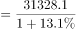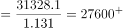亿元，对应A项。

故正确答案为A。

---

#### 第 2 题　qid 4674807 · 比重

2016年M省固定资产投资（不含农户）中，民间投资占比约为（    ）。

- **A**. 59.76%
- **B**. 62.18%
- **C**. 59.15%　✅
- **D**. 33.58%

**答案**：C

**官方解析**

根据题干“2016年······中······占比约为”，结合材料时间为2017年，可判定本题为基期比重计算问题。定位文字材料可得：2017年，M省固定资产投资（不含农户）31328.1亿元（B），比上年增长13.1%（b）。其中，民间投资18759.6亿元（A），增长14.5%（a），占固定资产投资的比重为59.9%（）。根据公式：基期比重，则所求比重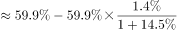，与C项最接近。

故正确答案为C。

---

#### 第 3 题　qid 4674808 · 增长

2017年M省固定资产投资（不含农户）中，基础设施投资同比增量约为（    ）亿元。

- **A**. 1150
- **B**. 1168　✅
- **C**. 1263
- **D**. 1190

**答案**：B

**官方解析**

根据题干“2017年······同比增量约为（    ）亿元”，可判定本题为增长量计算问题。定位文字材料可得：2017年，基础设施投资8517.4亿元，增长15.9%。根据公式：增长量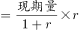，则2017年M省固定资产投资（不含农户）中，基础设施投资同比增量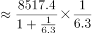亿元，与B项最接近。

故正确答案为B。

---

#### 第 4 题　qid 4674810 · 增长

2017年M省固定资产投资（不含农户）中，从投资方向看，下列增幅最小的是：

- **A**. 民生投资
- **B**. 生态投资
- **C**. 基础设施投资
- **D**. 工业技改投资　✅

**答案**：D

**官方解析**

定位文字材料可得：2017年，M省固定资产投资（不含农户）31328.1亿元，分投资方向看，民生投资3015.9亿元，增长12.8%；生态投资1402.5亿元，增长12.5%；基础设施投资8517.4亿元，增长15.9%；工业技改投资6130.2亿元，增长3.9%。比较可知，增幅最小的为工业技改投资（3.9%）。
故正确答案为D。

---

#### 第 5 题　qid 4674811 · 增长

以下描述中不正确的个数有（    ）。
（1）2017年M省房地产开发投资增量比住宅投资增量多100亿元以上
（2）2016年M省固定资产投资（不含农户）中，高新技术产业投资增速最大
（3）2017年M省固定资产投资（不含农户）中，分区域看，A地区投资增长率最快
（4）2017年M省每平方米商品房销售均价低于6000元

- **A**. 1个
- **B**. 2个　✅
- **C**. 3个
- **D**. 4个

**答案**：B

**官方解析**

（1）定位文字材料可得：2017年M省房地产开发投资3426.1亿元，比上年增长15.9%，其中，住宅投资2194.4亿元，增长17.3%。根据公式：增长量，则2017年M省房地产开发投资增量比住宅投资增量多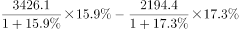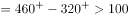亿元，正确；

（2）材料中只给出了2017年M省固定资产投资（不含农户）中各产业投资的现期量和同比增速，故无法比较2016年M省固定资产投资（不含农户）中各产业投资的同比增速，错误；

（3）定位文字材料可得：2017年M省固定资产投资（不含农户）31328.1亿元，分区域看，A地区投资12395.3亿元，增长13.2%；B地区投资7110.4亿元，增长13.5%；C地区投资5232.7亿元，增长13.8%；D地区投资6429.4亿元，增长14.0%。比较可知，A地区投资增长率（13.2%）最慢，错误；

（4）定位文字材料可得：2017年M省商品房销售面积8532.3万平方米，商品房销售额4460.7亿元。则2017年M省每平方米商品房销售均价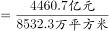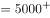元/平方米元/平方米，正确。

综上所述，不正确的有（2）（3），共2个。

故正确答案为B。

---

### 材料 2

        某市学生招生毕业均在9月份，2019年末有普通高校2所，普通本专科（不含成人）在校生22555人。高考文理本科达线率为50.14%。各类中等职业教育（不含技工学校）16所，在校生16079人。普通高中19所，在校生20387人，高中阶段毛入学率108.51%。普通初中101所，在校生33552人，初中阶段适龄人口入学率100%。小学129所，在校生68523人，小学学龄儿童入学率100%。幼儿园176所，在校生36719人，学前三年毛入园率102.01%。特殊教育学校2所，在校生112人。

#### 第 6 题　qid 4674812 · 综合

2019年末该市每所小学约有多少人？

- **A**. 531　✅
- **B**. 332
- **C**. 1073
- **D**. 1005

**答案**：A

**官方解析**

根据题干“2019年末······每所小学约有多少人”，可判定本题为现期平均数问题。定位文字材料可得，2019年末该市小学129所，在校生68523人。根据公式：平均数，则每所小学人数人。

故正确答案为A。

---

#### 第 7 题　qid 4674813 · 综合

该市高校毕业生数比招生数少：

- **A**. 508人
- **B**. 627人
- **C**. 8.24%　✅
- **D**. 8.99%

**答案**：C

**官方解析**

根据题干“······毕业生数比招生数少”，结合选项为多少人及百分数，可判定本题为简单加减计算及增长率计算问题。定位表格材料可得，2019年该市普通本专科（高校）招生数6283人，毕业生数5765人，则毕业生数比招生数少6283-5765=518人，排除A、B两项；毕业生数比招生数少，与C项最接近。

故正确答案为C。

---

#### 第 8 题　qid 4674814 · 综合

2019年初该市普通高中在校生数是多少人？

- **A**. 20387
- **B**. 33552
- **C**. 19627
- **D**. 21147　✅

**答案**：D

**官方解析**

定位文字及表格材料可得，2019年末该市普通高中在校生20387人，2019年普通高中招生数6475人，毕业生数7235人，则2019年初在校生数=2019年末在校生数-2019年招生数+2019年毕业生数=20387-6475+7235=21147人。
故正确答案为D。

---

#### 第 9 题　qid 4674815 · 综合

2019年末该市各类教育在校生人数共有多少人？

- **A**. 197927　✅
- **B**. 212365
- **C**. 186524
- **D**. 201386

**答案**：A

**官方解析**

定位文字材料可得，2019年末该市普通本专科（不含成人）在校生22555人，各类中等职业教育（不含技工学校）在校生16079人，普通高中在校生20387人，普通初中在校生33552人，小学在校生68523人，幼儿园在校生36719人，特殊教育学校在校生112人，则各类教育在校生共有22555+16079+20387+33552+68523+36719+112=197927人。
（可通过计算尾数为7，快速排除B、C、D三项。）
故正确答案为A。

---

#### 第 10 题　qid 4674816 · 综合

下列说法正确的是：

- **A**. 2019年末该市各类在校生人数最少的是中等职业教育学校
- **B**. 2019年该市小学毕业生数比普通本专科毕业生数约多2倍
- **C**. 根据表格资料，毕业生数与招生数相差最多的是普通本专科
- **D**. 2019年末该市各类教育共有445所　✅

**答案**：D

**官方解析**

A项：定位文字材料可得，2019年末该市各类中等职业教育（不含技工学校）在校生16079人，特殊教育学校在校生112人，在校生人数最少的是特殊教育学校，不是中等职业教育学校，错误；

B项：定位表格材料可得，2019年该市小学毕业生数11519人，普通本专科毕业生数5765人，前者比后者多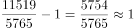倍，错误；

C项：定位表格材料可得，2019年该市普通本专科招生数6283人，毕业生数5765人，毕业生数与招生数相差6283-5765=518人；中等职业教育招生数5424人，毕业生数4797人，毕业生数与招生数相差5424-4797=627人＞518人，则相差最多的不是普通本专科，错误；

D项：定位文字材料可得，2019年末该市有普通高校2所，各类中等职业教育（不含技工学校）16所，普通高中19所，普通初中101所，小学129所，幼儿园176所，特殊教育学校2所，则各类教育共有2+16+19+101+129+176+2=445所，正确。

故正确答案为D。

---
