# 2022年湖北省选调生招录考试综合知识和行政职业能力测验试卷（网友回忆版）

> 选调生 · 2022 年 · 6 个模块 · 共 100 题

- [政治理论](#%E6%94%BF%E6%B2%BB%E7%90%86%E8%AE%BA) · 9 题
- [常识判断](#%E5%B8%B8%E8%AF%86%E5%88%A4%E6%96%AD) · 39 题
- [言语理解与表达](#%E8%A8%80%E8%AF%AD%E7%90%86%E8%A7%A3%E4%B8%8E%E8%A1%A8%E8%BE%BE) · 12 题
- [数量关系](#%E6%95%B0%E9%87%8F%E5%85%B3%E7%B3%BB) · 9 题
- [判断推理](#%E5%88%A4%E6%96%AD%E6%8E%A8%E7%90%86) · 20 题
- [资料分析](#%E8%B5%84%E6%96%99%E5%88%86%E6%9E%90) · 11 题

---

## 政治理论

### 第 1 题　qid 4808440 · 新思想

2022年1月29日，习近平总书记在同党外人士共迎新春时强调，我们坚持人民至上、生命至上，坚持外防输入、内防（    ），坚持科学精准、（    ），慎终如始抓好新冠肺炎疫情常态化防控，积极开展抗疫国际合作，经济发展和疫情防控保持全球领先地位。

- **A**. 扩散 动态清零
- **B**. 反弹 动态清零　✅
- **C**. 输出 持续清零
- **D**. 扩散 持续清零

**答案**：B

**官方解析**

本题考查政治常识。
B项正确，A、C、D三项错误，习近平总书记强调，我们坚持人民至上、生命至上，坚持外防输入、内防反弹，坚持科学精准、动态清零，慎终如始抓好新冠肺炎疫情常态化防控，积极开展抗疫国际合作，经济发展和疫情防控保持全球领先地位。
故正确答案为B。

---

### 第 2 题　qid 4808444 · 时事政治

第十三届全国人民代表大会第五次会议上，《政府工作报告》指出，过去一年强化创新引领，稳定产业链供应链。据此，以下说法正确的是（    ）。
①加强国家实验室建设，推进重大科技项目实施
②改革完善中央财政科研经费管理，提高直接费用比例，扩大科研自主权
③强化知识产权保护
④开展重点产业强链补链行动
⑤传统产业数字化智能化改造加快，新兴产业保持良好发展势头

- **A**. ①②④⑤
- **B**. ①③④⑤　✅
- **C**. ②③④⑤
- **D**. ①②③⑤

**答案**：B

**官方解析**

本题考查政治常识。
②错误，①③④⑤正确。《政府工作报告》在“一、2021年工作回顾”部分指出：“四是强化创新引领，稳定产业链供应链。加强国家实验室建设，推进重大科技项目实施。改革完善中央财政科研经费管理，提高间接费用比例，扩大科研自主权。延续实施研发费用加计扣除政策，将制造业企业研发费用加计扣除比例提高到100%。强化知识产权保护。开展重点产业强链补链行动。传统产业数字化智能化改造加快，新兴产业保持良好发展势头。”
故正确答案为B。

---

### 第 3 题　qid 4808418 · 时事政治

一百年来，中国共产党领导人民进行伟大奋斗，在进取中突破，于挫折中奋起，从总结中提高，积累了宝贵的历史经验。这些经验是：坚持党的领导，坚持人民至上，坚持理论创新，坚持独立自主，坚持中国道路，坚持胸怀天下，坚持开拓创新，坚持敢于斗争，以及（    ）。
①坚持统一战线
②坚持自我革命
③坚持实事求是
④坚持改革开放

- **A**. ①②　✅
- **B**. ③④
- **C**. ①②④
- **D**. ①②③④

**答案**：A

**官方解析**

本题考查政治常识。
党的十九届六中全会通过了《中共中央关于党的百年奋斗重大成就和历史经验的决议》（以下简称《决议》），《决议》在“六、中国共产党百年奋斗的历史经验”部分指出：一百年来，党领导人民进行伟大奋斗，积累了宝贵的历史经验，这就是：坚持党的领导，坚持人民至上，坚持理论创新，坚持独立自主，坚持中国道路，坚持胸怀天下，坚持开拓创新，坚持敢于斗争，坚持统一战线，坚持自我革命。
故正确答案为A。

---

### 第 4 题　qid 4808492 · 时事政治

第十三届全国人民代表大会第五次会议上，《政府工作报告》提出了2022年我国经济社会发展总体要求和政策取向。下列相关说法不准确的是（    ）。

- **A**. 我国发展面临的风险挑战明显增多，必须爬坡过坎
- **B**. 2022年我国国内生产总值预期增长目标为6.5%左右　✅
- **C**. 面对新的下行压力，要把稳增长放在更加突出的位置
- **D**. 积极的财政政策要提升效能，稳健的货币政策要灵活适度

**答案**：B

**官方解析**

本题考查政治常识。
A项正确，《政府工作报告》在“二、2022年经济社会发展总体要求和政策取向”部分指出：“综合研判国内外形势，今年我国发展面临的风险挑战明显增多，必须爬坡过坎。越是困难越要坚定信心、越要真抓实干。”
B项错误，《政府工作报告》在“二、2022年经济社会发展总体要求和政策取向”部分指出：“今年发展主要预期目标是：国内生产总值增长5.5%左右；城镇新增就业1100万人以上，城镇调查失业率全年控制在5.5%以内；居民消费价格涨幅3%左右；居民收入增长与经济增长基本同步；进出口保稳提质，国际收支基本平衡；粮食产量保持在1.3万亿斤以上；生态环境质量持续改善，主要污染物排放量继续下降；能耗强度目标在‘十四五’规划期内统筹考核，并留有适当弹性，新增可再生能源和原料用能不纳入能源消费总量控制。”
C项正确，《政府工作报告》在“二、2022年经济社会发展总体要求和政策取向”部分指出：“今年工作要坚持稳字当头、稳中求进。面对新的下行压力，要把稳增长放在更加突出的位置。各地区各部门要切实担负起稳定经济的责任，积极推出有利于经济稳定的政策。要统筹稳增长、调结构、推改革，加快转变发展方式，不搞粗放型发展。”
D项正确，《政府工作报告》在“二、2022年经济社会发展总体要求和政策取向”部分指出：“要保持宏观政策连续性，增强有效性。积极的财政政策要提升效能，更加注重精准、可持续。稳健的货币政策要灵活适度，保持流动性合理充裕。就业优先政策要提质加力。政策发力适当靠前，及时动用储备政策工具，确保经济平稳运行。”
本题为选非题，故正确答案为B。

---

### 第 5 题　qid 4808447 · 马克思主义

在庆祝中国共产党成立一百周年大会上，习近平总书记代表党和人民庄严宣告，经过全党全国各族人民持续奋斗，我们实现了第一个百年奋斗目标，在中华大地上全面建成了小康社会，历史性地解决了绝对贫困问题，正在意气风发向着全面建成社会主义现代化强国的第二个百年奋斗目标迈进。
以上叙述体现的哲学道理主要是：

- **A**. 量变达到一定程度引起质变，新质基础上进行新的量变　✅
- **B**. 世界是永恒发展的，发展是有规律的，规律又是客观的
- **C**. 人生价值是奉献与索取的统一，奉献是人生价值的标志
- **D**. 社会存在决定社会意识，社会意识又反作用于社会存在

**答案**：A

**官方解析**

本题考查政治常识。
A项正确，量变质变原理中指出量变是质变的必要准备，质变是量变的必然结果，量变达到一定的程度必然引起质变，量变和质变相互渗透，量变达到一定程度引起质变，新质基础上进行新的量变。“我们实现了第一个百年奋斗目标，在中华大地上全面建成了小康社会，历史性地解决了绝对贫困问题”体现了“量变达到一定程度引起质变”，“正在意气风发向着全面建成社会主义现代化强国的第二个百年奋斗目标迈进”体现了“新质基础上进行新的量变”。
B项错误，辩证法表明世界是发展的，发展的实质是新事物的产生和旧事物的灭亡，事物发展的总方向、总趋势是前进的、上升的，事物发展的具体道路又是曲折的、迂回的。与题干无关。
C项错误，人的价值分为社会价值和个人价值两个方面。社会价值是人对社会的积极的、肯定性的作用和奉献，就是个人的创造活动对社会需要的满足。个人价值是个人存在和行为对于自身的价值，就是人通过自己的活动满足自己的需要。人的价值是社会价值和个人价值的统一。与题干无关。
D项错误，社会存在决定社会意识，社会存在决定社会意识的内容和形式，决定社会意识的产生和发展。社会意识是社会存在反映，并反作用于社会存在。先进的社会意识反映了社会发展的趋势和要求，对社会发展起着积极的促进作用；落后的社会意识不符合社会发展的趋势和要求，对社会发展起着消极的阻碍作用。与题干无关。
故正确答案为A。

---

### 第 6 题　qid 4808446 · 马克思主义

当代中国正经历着我国历史上最为广泛而深刻的社会变革，也正在进行着人类历史上最为宏大独特的实践创新。这是一个需要理论并一定能够产生理论的时代，是一个需要思想并一定能够产生思想的时代。习近平新时代中国特色社会主义思想正是在这样的伟大时代中应运而生、顺势而成的，是立足时代之基、回答时代之问、引领时代之变的科学理论。
从实践与理论的辩证关系看，以上论述体现的哲学原理是：
①实践是理论的基础，对理论具有决定作用
②人们只有通过实践才能准确把握事物规律
③理论服务于实践，对实践具有能动的作用
④理论只有回到实践中去才能得到检验发展

- **A**. ①③
- **B**. ②④
- **C**. ①②③　✅
- **D**. ①②③④

**答案**：C

**官方解析**

本题考查政治常识。
①②正确，实践决定认识，实践是认识的来源，就一个人的知识来说，一部分是通过亲身实践得来的，即来源于直接经验；另一部分是从书本和他人那儿学到的间接经验。人们只有通过实践才能准确把握事物规律。“当代中国正经历着我国历史上最为广泛深刻的社会变革，也正在进行着人类历史上最为宏大独特的实践创新。这是一个需要理论并一定能够产生理论的时代，是一个需要思想并一定能够产生思想的时代”体现了实践是认识的基础，对理论具有决定作用，人们只有通过实践才能准确把握事物规律。
③正确，认识对实践具有反作用，正确的认识对实践起着积极的促进作用，错误的认识则对实践起消极的阻碍作用，甚至导致实践的失败。“习近平新时代中国特色社会主义思想正是在这样的伟大时代中应运而生、顺势而成的，是立足时代之基、回答时代之问、引领时代之变的科学理论”体现了认识对实践的反作用。
④错误，实践是检验认识是否具有真理性的唯一标准，人们从实践中获得的对客观世界的认识，是否与客观对象相符合、相一致，是否正确地反映了客观事物的本质及其规律，必须通过实践的检验才能得到证明，唯有实践才是检验认识真理性的标准。该说法本身是正确的，但是题中论述并未体现这一哲理。
故①②③正确。
故正确答案为C。

---

### 第 7 题　qid 4808458 · 新思想

习近平总书记看望了参加全国政协十三届五次会议的农业界、社会福利和社会保障界委员，并参加联组会，听取意见和建议。他强调，实施乡村振兴战略，必须把确保重要农产品特别是（    ）供给作为首要任务。把提高（    ）放在更加突出的位置，把“藏粮于地、藏粮于技”真正落实到位。

- **A**. 主粮 农业现代化生产能力
- **B**. 粮食 农业现代化生产能力
- **C**. 粮食 农业综合生产能力　✅
- **D**. 主粮 农业综合生产能力

**答案**：C

**官方解析**

本题考查政治常识。
2022年3月6日下午，习近平总书记看望参加全国政协十三届五次会议的农业界、社会福利和社会保障界委员，并参加联组会，听取意见和建议。总书记强调，实施乡村振兴战略，必须把确保重要农产品特别是粮食供给作为首要任务，把提高农业综合生产能力放在更加突出的位置，把“藏粮于地、藏粮于技”真正落实到位。
故正确答案为C。

---

### 第 8 题　qid 4808468 · 新思想

习近平总书记指出，中国现代化离不开农业现代化，农业现代化关键在科技、在人才。要把发展农业科技放在更加突出的位置，大力推进农业机械化、智能化，给农业现代化插上科技的翅膀。以下做法体现了农业现代化的是：
①农户E现在操作无人机，不用出门，一天能打1500亩地农药
②农户F实现浸种、育秧、插秧、田间管理、收获全过程智能化
③农户G有352亩水稻田，但种田有机械，农闲时还出门去旅游
④农户H根据多年种植经验，为自家每块地定制统一的施肥方案

- **A**. ①②
- **B**. ③④
- **C**. ①②③　✅
- **D**. ①②③④

**答案**：C

**官方解析**

本题考查政治常识。
题干所述为习近平总书记在北大荒建三江国家农业科技园区考察时指出的。
农业现代化是指由传统农业转变为现代农业，把农业建立在现代科学的基础上，用现代科学技术和现代工业来装备农业，用现代经济科学来管理农业，创造一个高产、优质、低耗的农业生产体系和一个合理利用资源、又保护环境的、有较高转化效率的农业生态系统。农业现代化可以概括为“四化”，即机械化、科学化、水利化和电气化。将机械化排在农业现代化的首要位置。
①无人机的使用和②全过程智能化都体现了农业科学化；③352亩水稻田用机械种植体现了机械化；④体现不出农业现代化的特征。
故正确答案为C。

---

### 第 9 题　qid 4808590 · 新思想

习近平总书记指出，一些干部错误理解“和为贵”，一味讲“宽容”、讲“和气”，当老好人，对政治原则问题含含糊糊，对大是大非问题做“开明绅士”，对不良现象听之任之。实际上，这种“好好先生”违背了（    ）的党员干部要求。

- **A**. 注重实际、实事求是
- **B**. 坚持原则、敢于斗争　✅
- **C**. 信念坚定、对党忠诚
- **D**. 勤学苦练、增强本领

**答案**：B

**官方解析**

本题考查政治常识。
B项正确，A、C、D三项错误，2022年2月1日出版的《求是》杂志发表中共中央总书记、国家主席、中央军委主席习近平的重要文章《努力成为可堪大用能担重任的栋梁之才》，指出：“第四，坚持原则、敢于斗争。坚持原则是共产党人的重要品格，是衡量一个干部是否称职的重要标准。现在，一些干部错误理解‘和为贵’，一味讲‘宽容’、讲‘和气’，当老好人，对政治原则问题含含糊糊，对大是大非问题做‘开明绅士’，对不良现象听之任之，还有的八面玲珑、左右逢源，说话办事看来头、看风向，随波漂，随风倒，这同党性原则是背道而驰的，必须坚决纠正。”
故正确答案为B。

---

## 常识判断

### 第 1 题　qid 4808436 · 人文常识

2022年2月4日晚，北京冬奥会开幕式盛大举行。在北京提交的《申办报告》中提出的三大理念，“以（    ）为中心、（    ）发展、节俭办赛”，同中国的治国理政新思想新实践一脉相承。

- **A**. 运动员 可持续　✅
- **B**. 运动员 绿色
- **C**. 冰雪产业 可持续
- **D**. 冰雪产业 绿色

**答案**：A

**官方解析**

本题考查政治常识。
A项正确，B、C、D三项错误，北京冬奥会申办委员会提交的《申办报告》中指出“贯彻中央精神、遵循国际惯例、借鉴往届经验、突出京张特色”，将“纯洁的冰雪，激情的约会”愿景贯穿报告始终，将“以运动员为中心、可持续发展、节俭办赛”三大理念贯穿报告始终，将“京津冀协同发展”作为国家战略贯穿报告始终。
故正确答案为A。

---

### 第 2 题　qid 4808487 · 人文常识

中央网信办等十部门发布《数字乡村发展行动计划（2022-2025年）》。下列不属于其制定依据的是（    ）。

- **A**. 《数字乡村发展战略纲要》
- **B**. 《“十四五”国家信息化规划》
- **C**. 《乡村网络文化振兴行动纲要》　✅
- **D**. 《中华人民共和国国民经济和社会发展第十四个五年规划和2035年远景目标纲要》

**答案**：C

**官方解析**

本题考查政治常识。
C项错误，A、B、D三项正确，《数字乡村发展行动计划（2022-2025年）》在第一段指出：“为贯彻落实《中华人民共和国国民经济和社会发展第十四个五年规划和2035年远景目标纲要》《数字乡村发展战略纲要》《“十四五”国家信息化规划》部署要求，加快推进数字乡村建设，充分发挥信息化对乡村振兴的驱动引领作用，整体带动和提升农业农村现代化发展，促进农业全面升级、农村全面进步、农民全面发展，特制定本行动计划。”
本题为选非题，故正确答案为C。

---

### 第 3 题　qid 4808431 · 人文常识

《关于加强新时代廉洁文化建设的意见》指出，强调反对腐败、建设廉洁政治，是我们党一贯坚持的鲜明政治立场，是党（    ）必须长期抓好的重大政治任务。把加强廉洁文化建设作为一体推进不敢腐、不能腐、不想腐的（    ）工程抓紧抓实抓好，为推进全面从严治党向纵深发展提供重要支撑。

- **A**. 牢记使命 系统性
- **B**. 自我革命 基础性　✅
- **C**. 作风建设 战略性
- **D**. 廉政建设 先导性

**答案**：B

**官方解析**

本题考查政治常识。
B项正确，A、C、D三项错误，《关于加强新时代廉洁文化建设的意见》指出，党中央高度重视廉洁文化建设，强调反对腐败、建设廉洁政治，是我们党一贯坚持的鲜明政治立场，是党自我革命必须长期抓好的重大政治任务。全面从严治党，既要靠治标，猛药去疴，重典治乱；也要靠治本，正心修身，涵养文化，守住为政之本。必须站在勇于自我革命、保持党的先进性和纯洁性的高度，把加强廉洁文化建设作为一体推进不敢腐、不能腐、不想腐的基础性工程抓紧抓实抓好，为推进全面从严治党向纵深发展提供重要支撑。
故正确答案为B。

---

### 第 4 题　qid 4808435 · 人文常识

农村人居环境整治的工作原则之一是，坚持因地制宜，突出分类施策。同区域气候条件和地形地貌相匹配，同地方经济社会发展能力和水平相适应，同当地文化和风土人情相协调，实事求是、自下而上、分类确定治理标准和目标任务。上述工作原则的哲学根据是（    ）。
①矛盾普遍性和特殊性是统一的
②事物之间存在着因果必然联系
③任何事物的矛盾都具有特殊性
④解决矛盾的方式都具有特殊性

- **A**. ①③
- **B**. ③④
- **C**. ②④
- **D**. ①③④　✅

**答案**：D

**官方解析**

本题考查政治常识。
①③正确，矛盾的普遍性是指矛盾存在于一切事物中，存在于一切事物发展过程的始终，事物始终在矛盾中运动。矛盾的特殊性是指各个具体事物的矛盾、每一个矛盾的各个方面在发展的不同阶段上各有其特点。矛盾的普遍性和特殊性是辩证统一的关系：矛盾的普遍性即矛盾的共性，矛盾的特殊性即矛盾的个性。任何现实存在的事物的矛盾都是共性和个性的有机统一，共性寓于个性之中，没有离开个性的共性，也没有离开共性的个性。“坚持因地制宜，突出分类施策”是具体问题具体分析，体现了矛盾的特殊性。“同区域气候条件和地形地貌相匹配，同地方经济社会发展能力和水平相适应······”体现了矛盾普遍性和特殊性的统一。
②错误，在事物的普遍联系中，引起某种现象的现象就是原因；被某种现象所引起的现象就是结果。在事物因果联系的长链中，任何原因都必然引起一定的结果；任何结果都是由一定的原因引起的。选项表述正确，但与题干无关。
④正确，矛盾的特殊性是指不同事物有不同的矛盾、具体事物的矛盾及每一个矛盾的各个方面都有其特点、各个具体事物的矛盾及每一个矛盾的各方面在发展的不同阶段也各有特点。这种特殊的矛盾构成一事物区别于他事物的特殊本质。任何矛盾都有自己特殊的质，不同质的矛盾只有用不同质的方法才能正确解决，所以在处理问题时要具体问题具体分析，即解决矛盾的方式都具有特殊性。题干中的“坚持因地制宜，突出分类施策”正是体现了解决矛盾的方式都具有特殊性。
故正确答案为D。

---

### 第 5 题　qid 4808449 · 人文常识

马克思主义为人类社会发展进步指明了方向，是我们认识世界、把握规律、追求真理、改造世界的强大思想武器。同时，马克思主义理论不是教条，而是行动指南，必须随着实践的变化而发展。根据辩证唯物主义真理观，以上论述表明：

- **A**. 人类认识就是不断从相对真理走向绝对真理的过程
- **B**. 真理都只是对客观世界和事物一定程度的正确反映
- **C**. 否认真理相对性，就会在实际工作中导致教条主义
- **D**. 真理具有相对性，必须不断在实践中检验完善发展　✅

**答案**：D

**官方解析**

本题考查政治常识。
A项错误，真理具有相对性，从广度上看，任何真理都会受到人类实践水平、范围以及认识能力的限制，因此是有条件的、有限的。但是人类认识是一个不断深化的过程，是从相对性真理走向绝对性真理，接近绝对性真理的过程。该项说法正确，但与题干表述无关。
B项错误，真理具有相对性，从深度上看，真理反映客观对象的正确程度也是有条件的、有限的。任何特定的真理不仅所反映的对象在范围上是有限的，而且其正确程度也是有限的。由于条件的限制，任何真理对认识对象的反映只能是相对正确的，即在认识的深刻程度上、精确度上都是有限的，或者是近似性的。该项说法正确，但与题干表述无关。
C项错误，教条指要求人盲目信奉、接受或引用的原则、原理。教条主义即是把马克思主义的书面个别词句当作僵死的教条，生搬硬套，拒绝对具体问题进行具体分析。是夸大了理性认识的作用，否认了真理的相对性。该项说法正确，但题干是承认真理的相对性而非否定。
D项正确，真理具有相对性，即在一定条件下，人们对事物的客观过程及其发展规律的正确认识总是有局限的、不完全的。这要求我们坚持真理相对性和绝对性的辩证统一，在实践中检验和发展真理。马克思主义的真理必须与中国革命的具体实践相结合。
故正确答案为D。

---

### 第 6 题　qid 4808433 · 人文常识

历史充分证明，江山就是人民，人民就是江山，人心向背关系党的生死存亡。赢得人民信任，得到人民支持，党就能够克服任何困难，就能够无往而不胜。反之，我们将一事无成，甚至走向衰败。根据历史唯物主义，这是因为：

- **A**. 人民群众是社会变革的决定力量
- **B**. 人民群众是社会物质财富的创造者
- **C**. 人民群众是社会精神财富的创造者
- **D**. 人民群众是社会历史的主体，是历史的创造者　✅

**答案**：D

**官方解析**

本题考查政治常识。
D项正确，A、B、C三项错误。唯物史观认为，人民群众是历史的创造者，是社会历史的主体。人民群众是社会物质财富的创造者，是社会精神财富的创造者，是社会变革的决定力量。A、B、C三项都是D项表述的具体表现，人民是创造历史的根本动力，所以江山就是人民，人民就是江山。
故正确答案为D。

---

### 第 7 题　qid 4808437 · 人文常识

“两个结合”即把马克思主义基本原理同中国具体实际相结合、同中华优秀传统文化相结合。它是我们党百年来推进马克思主义中国化的宝贵经验，也是我们以史为鉴、开创未来，继续推进马克思主义中国化，继续发展当代中国马克思主义、21世纪马克思主义的重要遵循。
“两个结合”蕴含的哲学原理主要是：

- **A**. 物质与意识辩证关系
- **B**. 运动与静止辩证关系
- **C**. 两点论与重点论辩证关系
- **D**. 矛盾普遍性与特殊性辩证关系　✅

**答案**：D

**官方解析**

本题考查政治常识。
A项错误，物质和意识的辩证关系表明物质决定意识，意识是客观存在在人脑中的映象；同时，意识又具有能动作用，正确的意识对客观事物的发展具有促进作用，错误的意识对事物的发展起阻碍作用，要求我们一切从实际出发实事求是，并重视发挥意识的能动作用。与题干无关。
B项错误，运动与静止的辩证关系指出，世界上的事物都是绝对运动和相对静止的统一，是动中有静，静中有动；物质世界的运动是无条件的、永恒的、绝对的，静止是有条件的、暂时的、相对的。与题干无关。
C项错误，两点论，就是在研究复杂事物的发展过程时，既要研究主要矛盾，又要研究非主要矛盾；在研究某一种矛盾时，既要研究矛盾的主要方面，又要研究矛盾的次要方面。重点论，就是在研究复杂事物的发展过程时，要着重地把握它的主要矛盾；在研究某一种矛盾时，要着重地把握它的主要方面。与题干无关。
D项正确，矛盾的普遍性即矛盾的共性，矛盾的特殊性即矛盾的个性。矛盾的共性是无条件的、绝对的，矛盾的个性是有条件的、相对的。矛盾的普遍性和特殊性的关系，也就是共性与个性、一般与个别的关系，它们是辩证统一的。“马克思主义基本原理同中国具体实际相结合、同中华优秀传统文化相结合”即共性与个性、一般与个别的关系，马克思主义基本原理和中国具体实际是辩证统一的。
故正确答案为D。

---

### 第 8 题　qid 4808459 · 地理国情

湖北省H县地处北纬黄金产茶带，种茶史绵延千年，茶叶从西晋到明清，沿着茶马古道远销欧美。H县尊重和依托自己的地理、产业和历史文化优势，确定本县乡村振兴战略不仅是继承发展而且是创造性地继承发展茶产业，提出争创中国有机茶第一县的目标。如今，全县有机茶种植面积达40万亩，“H县有机茶”已成为响亮的市场品牌，H县成为全国茶叶全域有机示范县。

H县实践所遵循的哲学道理是：

①物质决定意识，意识反作用于物质

②尊重客观规律是正确发挥主观能动性的前提

③意识都具有指导实践正确有效改造客观世界的作用

④只有充分发挥主观能动性，才能正确认识和利用客观规律

- **A**. ②④
- **B**. ②③④
- **C**. ①②④　✅
- **D**. ①②③④

**答案**：C

**官方解析**

本题考查政治常识。

①正确，物质决定意识，意识是客观存在在人脑中的映象；同时，意识又具有能动作用，湖北省H县地处北纬黄金产茶带，种茶史绵延千年，H县产茶并且依托优势，提出争创中国有机茶第一县的目标，如今全县有机茶种植面积达40万亩，体现了物质决定意识，意识对物质的反作用。

②④正确，意识对物质具有反作用，要求我们重视发挥主观能动性，一方面，尊重客观规律是正确发挥主观能动性的前提；另一方面，只有充分发挥主观能动性，才能正确认识和利用客观规律。“H县尊重和依托自己的地理、产业和历史文化优势，确定本县乡村振兴战略不仅是继承发展而且是创造性地继承发展茶产业”体现了尊重客观规律是正确发挥主观能动性的前提，“提出争创中国有机茶第一县的目标”体现了H县充分发挥主观能动性认识事物。

③错误，意识具有能动作用，正确的意识对客观事物的发展具有促进作用，错误的意识对事物的发展起阻碍作用。故错误的意识不可以指导实践正确有效改造客观世界。

综上，①②④正确。

故正确答案为C。

---

### 第 9 题　qid 4808472 · 人文常识

经济全球化是时代潮流。大江奔腾向海，总会遇到逆流，但任何逆流都阻挡不了大江东去。动力助其前行，阻力促其强大。尽管出现了很多逆流、险滩，但经济全球化方向从未改变、也不会改变。
以上论述蕴含的哲理是：
①事物发展的总趋势是前进、上升的
②事物的联系是普遍、客观和多样的
③事物发展具体道路是曲折、迂回的
④事物发展是前进性和曲折性的统一

- **A**. ①④
- **B**. ②③
- **C**. ①③④　✅
- **D**. ①②③④

**答案**：C

**官方解析**

本题考查政治常识。
①③④正确，否定之否定规律表明：事物发展的总方向、总趋势是前进的、上升的，事物发展的具体道路又是曲折的、迂回的。即事物的发展过程是前进性和曲折性的统一。“经济全球化是时代潮流”体现了事物发展的总方向、总趋势是前进的、上升的。“大江奔腾向海，总会遇到逆流，但任何逆流都阻挡不了大江东去”体现了事物发展的具体道路又是曲折的、迂回的。“尽管出现了很多逆流、险滩，但经济全球化方向从未改变、也不会改变”体现了事物的发展过程是前进性和曲折性的统一。
②错误，联系是指事物之间以及事物内部诸要素之间的相互影响、相互作用和相互制约，联系具有普遍性、客观性、条件性、多样性。与题干无关。
故正确答案为C。

---

### 第 10 题　qid 4808495 · 人文常识

2022年中央一号文件强调，要把（    ）和（    ）目标任务作为刚性指标实行严格考核、一票否决、终身追责。

- **A**. 农业用地保有量 高标准农田建设
- **B**. 农业用地保有量 永久基本农田保护
- **C**. 耕地保有量 高标准农田建设
- **D**. 耕地保有量 永久基本农田保护　✅

**答案**：D

**官方解析**

本题考查政治常识。
文件《中共中央 国务院关于做好2022年全面推进乡村振兴重点工作的意见》在“二、强化现代农业基础支撑”部分指出：“（六）落实‘长牙齿’的耕地保护硬措施。实行耕地保护党政同责，严守１８亿亩耕地红线。按照耕地和永久基本农田、生态保护红线、城镇开发边界的顺序，统筹划定落实三条控制线，把耕地保有量和永久基本农田保护目标任务足额带位置逐级分解下达，由中央和地方签订耕地保护目标责任书，作为刚性指标实行严格考核、一票否决、终身追责。”
故正确答案为D。

---

### 第 11 题　qid 4808454 · 人文常识

国务院印发《“十四五”推进农业农村现代化规划》，对“十四五”时期推进农业农村现代化的战略导向、主要目标、重点任务和政策措施等作出全面安排，增强农业农村对经济社会发展的支撑保障能力和“压舱石”的稳定作用，持续提高：

- **A**. 农业技术水平
- **B**. 农民生活水平　✅
- **C**. 农村环境质量
- **D**. 农村建设水平

**答案**：B

**官方解析**

本题考查政治常识。
国务院印发《“十四五”推进农业农村现代化规划》（以下简称《规划》），对“十四五”时期推进农业农村现代化的战略导向、主要目标、重点任务和政策措施等作出全面安排，增强农业农村对经济社会发展的支撑保障能力和“压舱石”的稳定作用，持续提高农民生活水平。
故正确答案为B。

---

### 第 12 题　qid 4808457 · 人文常识

党的农村工作必须坚持党对农村工作的全面领导，确保党在农村工作中总揽全局、（    ），保证农村改革发展沿着正确的方向前进。

- **A**. 制定政策
- **B**. 组织推进
- **C**. 协调各方　✅
- **D**. 检查督办

**答案**：C

**官方解析**

本题考查政治常识。
A、B、D三项错误，C项正确，《中国共产党农村工作条例》第四条第一项规定：“党的农村工作必须遵循以下原则：（一）坚持党对农村工作的全面领导，确保党在农村工作中总揽全局、协调各方，保证农村改革发展沿着正确的方向前进。”
故正确答案为C。

---

### 第 13 题　qid 4808460 · 人文常识

2022年2月13日，全国春季农业生产暨加强冬小麦田间管理工作会议召开。会议指出，当前冬小麦苗情偏弱，促弱转壮任务繁重，要（    ）抓好春季田管，做好病虫害防控和极端天气应对防范，力争夏粮再获丰收。

- **A**. 因苗施策
- **B**. 因时制宜
- **C**. 因地制宜
- **D**. 因地因苗　✅

**答案**：D

**官方解析**

本题考查政治常识。
A、B、C三项错误，D项正确，2022年2月13日，全国春季农业生产暨加强冬小麦田间管理工作会议在山东省德州市召开。中共中央政治局常委、国务院总理李克强作出重要批示。批示指出：做好春耕备耕工作，对于确保全年粮食丰收至关重要。各地区各部门要坚持以习近平新时代中国特色社会主义思想为指导，认真贯彻党中央、国务院决策部署，落实粮食安全党政同责，扎实抓好春季农业生产，为经济社会平稳健康发展提供有力支撑。当前冬小麦苗情偏弱，促弱转壮任务繁重，要因地因苗抓好春季田管，做好病虫害防控和极端天气应对防范，力争夏粮再获丰收。
故正确答案为D。

---

### 第 14 题　qid 4808464 · 人文常识

“十四五”时期我国农业农村现代化的主要目标有，粮食等重要农产品供给有效保障，农业质量效益和竞争力稳步提高，农村基础设施建设取得新进展，乡村治理能力进一步增强，脱贫攻坚成果巩固拓展，以及：
①农村人居环境整治提升
②农业现代科技支撑加强
③农村生态环境明显改善
④农村居民收入稳步增长

- **A**. ①②
- **B**. ③④　✅
- **C**. ①②③
- **D**. ①②③④

**答案**：B

**官方解析**

本题考查政治常识。
2021年11月12日，国务院印发《“十四五”推进农业农村现代化规划》。
①错误，“农村人居环境整治提升”是《“十四五”推进农业农村现代化规划》“第五章 实施乡村建设行动 建设宜居宜业乡村”中“第四节 加快数字乡村建设”中“乡村公共基础设施建设工程”的内容。
②错误，“强化现代农业科技支撑”是《“十四五”推进农业农村现代化规划》“第三章 推进创新驱动发展 提升农业质量效益和竞争力”中第一节的标题。
③④正确，根据《“十四五”推进农业农村现代化规划》“第一章 开启农业农村现代化新征程”中“第五节 主要目标”可知，到2025年，农业基础更加稳固，乡村振兴战略全面推进，农业农村现代化取得重要进展。梯次推进有条件的地区率先基本实现农业农村现代化，脱贫地区实现巩固拓展脱贫攻坚成果同乡村振兴有效衔接。1.粮食等重要农产品供给有效保障；2.农业质量效益和竞争力稳步提高；3.农村基础设施建设取得新进展；4.农村生态环境明显改善；5.乡村治理能力进一步增强；6.农村居民收入稳步增长；7.脱贫攻坚成果巩固拓展。展望2035年，乡村全面振兴取得决定性进展，农业农村现代化基本实现。
故正确答案为B。

---

### 第 15 题　qid 4808474 · 人文常识

“十四五”时期，我国将深入实施（    ）传承保护工程，加强农业文化遗产发掘认定和转化创新。加强历史文化名村名镇、传统村落、少数民族特色村寨、传统民居、农村文物、地名文化遗产和古树名木保护。振兴传统农业节庆，办好中国农民（    ）。

- **A**. 农耕文化 丰收节　✅
- **B**. 特色文化 播种节
- **C**. 民俗文化 播种节
- **D**. 乡村文化 丰收节

**答案**：A

**官方解析**

本题考查政治常识。
A项正确，B、C、D三项错误，2021年11月12日，国务院印发《“十四五”推进农业农村现代化规划》，其中“第七章 加强和改进乡村治理 建设文明和谐乡村”中“第三节 加强新时代农村精神文明建设”中指出，“繁荣发展乡村优秀文化。深入实施农耕文化传承保护工程，加强农业文化遗产发掘认定和转化创新。加强历史文化名村名镇、传统村落、少数民族特色村寨、传统民居、农村文物、地名文化遗产和古树名木保护。继承发扬优秀传统乡土文化，建设乡村非物质文化遗产传习所（点）。振兴传统农业节庆，办好中国农民丰收节。”
故正确答案为A。

---

### 第 16 题　qid 4808479 · 经济常识

关于我国的农民专业合作社，以下表述正确的是：

- **A**. 农民专业合作社不是法人
- **B**. 农民专业合作社不能得到国家财政直接补助
- **C**. 农民专业合作社成员不得使用非货币财产出资
- **D**. 农民专业合作社成员不能用对该社其他成员的债权充抵出资　✅

**答案**：D

**官方解析**

本题考查法律常识。
A项错误，《中华人民共和国农民专业合作社法》第五条第一款规定，“农民专业合作社依照本法登记，取得法人资格。”
B项错误，《中华人民共和国农民专业合作社法》第五条第二款规定，“农民专业合作社对由成员出资、公积金、国家财政直接补助、他人捐赠以及合法取得的其他资产所形成的财产，享有占有、使用和处分的权利，并以上述财产对债务承担责任。”
C项错误，《中华人民共和国农民专业合作社法》第十三条第一款规定，“农民专业合作社成员可以用货币出资，也可以用实物、知识产权、土地经营权、林权等可以用货币估价并可以依法转让的非货币财产，以及章程规定的其他方式作价出资；但是，法律、行政法规规定不得作为出资的财产除外。” 
D项正确，《中华人民共和国农民专业合作社法》第十三条第二款规定，“农民专业合作社成员不得以对该社或者其他成员的债权，充抵出资；不得以缴纳的出资，抵销对该社或者其他成员的债务。”
故正确答案为D。

---

### 第 17 题　qid 4808480 · 人文常识

自2022年3月12日起施行的修正后的《地方各级人民代表大会和地方各级人民政府组织法》规定，地方各级人民政府应当坚持以人民为中心，全心全意为人民服务，提高行政效能，建设：

- **A**. 服务型政府　✅
- **B**. 廉洁型政府
- **C**. 法治型政府
- **D**. 效能型政府

**答案**：A

**官方解析**

本题考查法律常识。
A项正确，B、C、D三项错误，根据《地方各级人民代表大会和地方各级人民政府组织法》第六十三条规定：“地方各级人民政府应当坚持以人民为中心，全心全意为人民服务，提高行政效能，建设服务型政府。”
故正确答案为A。

---

### 第 18 题　qid 4808498 · 法律常识

依照法律规定，设区的市的人民代表大会及其常务委员会可以制定：

- **A**. 地方性规章
- **B**. 地方性法规　✅
- **C**. 行政规章
- **D**. 行政法规

**答案**：B

**官方解析**

本题考查法律常识。
B项正确，A、C、D三项错误，根据《中华人民共和国立法法》第七十二条第二款规定：“设区的市的人民代表大会及其常务委员会根据本市的具体情况和实际需要，在不同宪法、法律、行政法规和本省、自治区的地方性法规相抵触的前提下，可以对城乡建设与管理、环境保护、历史文化保护等方面的事项制定地方性法规······”
故正确答案为B。

---

### 第 19 题　qid 4808469 · 法律常识

中华人民共和国公民在法律面前一律平等。以下做法符合该原则的是：

- **A**. 某企业财务部门招聘条件设置“男性优先”
- **B**. 某单位招聘条件限定报考者的身高、体重
- **C**. 某机构招聘音乐老师、舞蹈老师时只考虑女性
- **D**. 矿山、深井、水下等特殊岗位招聘中明确只招录男性　✅

**答案**：D

**官方解析**

本题考查法律常识。
D项正确，A、B、C三项错误，根据《宪法》第三十三条第二款规定：“中华人民共和国公民在法律面前一律平等。”法律面前一律平等包括：所有公民都平等地享有宪法和法律规定的权利；所有公民都平等地履行宪法和法律规定的义务；国家司法机关和行政机关在适用法律时，对所有公民的合法权益都平等地予以保护；任何组织或者个人都不得有超越宪法和法律的特权。根据《劳动法》第三条第一款规定：“劳动者享有平等就业和选择职业的权利、取得劳动报酬的权利、休息休假的权利、获得劳动安全卫生保护的权利、接受职业技能培训的权利、享受社会保险和福利的权利、提请劳动争议处理的权利以及法律规定的其他劳动权利。”根据《女职工劳动保护特别规定》附件的规定，女职工禁忌从事的劳动范围包括：（一）矿山井下作业；（二）体力劳动强度分级标准中规定的第四级体力劳动强度的作业；（三）每小时负重6次以上、每次负重超过20公斤的作业，或者间断负重、每次负重超过25公斤的作业。A、B、C三项均侵犯了劳动者平等就业的权利，违反了法律面前一律平等的原则。D项所列举工作明显不适合女性从事，符合行政法规的规定，体现了法律面前一律平等的原则。
故正确答案为D。

---

### 第 20 题　qid 4808486 · 法律常识

我国宪法规定，公民有言论的自由。以下不属于言论自由的是：

- **A**. 甲对上班期间玩手机的同事提出批评
- **B**. 乙向街道疫情防控工作人员提出建议
- **C**. 丙在单位遭受批评后回家向家人抱怨
- **D**. 丁与同事发生矛盾后在网上诋毁同事　✅

**答案**：D

**官方解析**

本题考查法律常识。
A、B、C三项正确，D项错误，根据《宪法》第五十一条规定：“中华人民共和国公民在行使自由和权利的时候，不得损害国家的、社会的、集体的利益和其他公民的合法的自由和权利。”A、B、C三项的甲乙丙均是在行使言论自由，D项的丁诋毁同事，侵犯了同事的名誉权，属于侵权行为，而非行使言论自由。
本题为选非题，故正确答案为D。

---

### 第 21 题　qid 4808513 · 法律常识

甲经营一个农家小院，某日一伙人将小院整包下来，甲明知这伙人在利用信息网络实施犯罪，但考虑到收入不菲，仍为其提供互联网接入、支付结算等服务。甲的行为属于：

- **A**. 违法但不构成犯罪
- **B**. 电信网络诈骗罪共犯
- **C**. 非法利用网络信息罪
- **D**. 帮助信息网络犯罪活动罪　✅

**答案**：D

**官方解析**

本题考查法律常识。
D项正确，A、B、C三项错误，根据《刑法》第二百八十七条之二第一款规定：“明知他人利用信息网络实施犯罪，为其犯罪提供互联网接入、服务器托管、网络存储、通讯传输等技术支持，或者提供广告推广、支付结算等帮助，情节严重的，处三年以下有期徒刑或者拘役，并处或者单处罚金。”题中，甲明知这伙人在利用信息网络实施犯罪，仍为其提供互联网接入，支付结算等服务构成帮助信息网络犯罪活动罪。
故正确答案为D。

---

### 第 22 题　qid 4808521 · 法律常识

有些犯罪行为的追诉需要履行特殊程序，以下需要经最高人民检察院核准追诉的是：

- **A**. 19周岁的甲，精神失常当街持刀砍人
- **B**. 17周岁的乙，多次入室盗窃数额巨大
- **C**. 15周岁的丙，实施投放危险物质行为
- **D**. 13周岁的丁，实施杀人行为情节恶劣　✅

**答案**：D

**官方解析**

本题考查法律常识。
D项正确，A、B、C三项错误，根据《刑法》第十七条第三款规定：“已满十二周岁不满十四周岁的人，犯故意杀人、故意伤害罪，致人死亡或者以特别残忍手段致人重伤造成严重残疾，情节恶劣，经最高人民检察院核准追诉的，应当负刑事责任。”D项中，丁仅13周岁，实施杀人行为情节恶劣，需要经最高人民检察院核准追诉才承担刑事责任。
故正确答案为D。

---

### 第 23 题　qid 4808499 · 经济常识

因购房缺钱，甲向乙借款30万元，约定三年借款期限及利息。两年后，甲决定提前返还借款。两人当初未约定提前还款的利率计算方式，甲应当支付乙30万元借款和：

- **A**. 两年利息　✅
- **B**. 三年利息
- **C**. 两年利息加违约金
- **D**. 三年利息减违约金

**答案**：A

**官方解析**

本题考查法律常识。
A项正确，B、C、D三项错误，根据《民法典》第六百七十七条规定：“借款人提前返还借款的，除当事人另有约定外，应当按照实际借款的期间计算利息。”第五百八十五条第一款规定：“当事人可以约定一方违约时应当根据违约情况向对方支付一定数额的违约金，也可以约定因违约产生的损失赔偿额的计算方法。”题中，甲、乙之间并未约定违约金，甲仅需支付乙30万元借款和两年利息。
故正确答案为A。

---

### 第 24 题　qid 4808508 · 人文常识

父母离婚对子女的影响，以下说法正确的是：

- **A**. 离婚时子女已满18周岁的，应尊重其真实意愿决定归属
- **B**. 离婚后，子女由父亲直接抚养的，母亲不承担任何责任
- **C**. 离婚后，不满3周岁的子女以由母亲直接抚养为原则
- **D**. 父母与子女的关系，不因父母离婚而变更或消除　✅

**答案**：D

**官方解析**

本题考查法律常识。
A、C两项错误，根据《民法典》第一千零八十四条第三款规定：“离婚后，不满两周岁的子女，以由母亲直接抚养为原则。已满两周岁的子女，父母双方对抚养问题协议不成的，由人民法院根据双方的具体情况，按照最有利于未成年子女的原则判决。子女已满八周岁的，应当尊重其真实意愿。”
B项错误，根据《民法典》第一千零八十四条第二款规定：“离婚后，父母对于子女仍有抚养、教育、保护的权利和义务。”
D项正确，根据《民法典》第一千零八十四条第一款规定：“父母与子女间的关系，不因父母离婚而消除。离婚后，子女无论由父或者母直接抚养，仍是父母双方的子女。”
故正确答案为D。

---

### 第 25 题　qid 4808515 · 法律常识

姚老太病故后遗留下60万元遗产，遗嘱明确函：患小儿麻痹症的小儿子王五继承20万元，遗赠隔壁对自己照顾颇多的李大嫂10万元，剩下的30万元没有明确归属。遗产分割过程中，发现姚老太尚有40万元债务未清偿，对此，以下说法正确的是：

- **A**. 姚老太己病故且其遗嘱并未提及债务，因此40万元债务不再需要清偿
- **B**. 30万元法定继承额清偿债务后，未得到清偿的10万元不需要继续清偿
- **C**. 60万元遗产清偿债务后，王五、李大嫂和法定继承人平均分配20万元
- **D**. 法定继承额清偿后，王五和李大嫂按比例以所得遗产清偿余下10万债务　✅

**答案**：D

**官方解析**

本题考查法律常识。
D项正确，A、B、C三项错误，根据《中华人民共和国民法典》第一千一百六十三条规定：“既有法定继承又有遗嘱继承、遗赠的，由法定继承人清偿被继承人依法应当缴纳的税款和债务；超过法定继承遗产实际价值部分，由遗嘱继承人和受遗赠人按比例以所得遗产清偿。”题中，姚老太遗留下60万元遗产，立有遗嘱称小儿子王五继承20万元，李大嫂获赠10万元，尚有40万元债务未清偿，依法应以法定继承额30万元清偿债务后，剩余10万元由遗嘱继承人王五和受遗赠人李大嫂按比例进行清偿。
故正确答案为D。

---

### 第 26 题　qid 4808522 · 人文常识

甲的汽车达到报废标准拟报废，乙介绍甲以五千元价格将汽车直接转交给丙使用。后丙酒后驾车撞人造成损害，谁承担赔偿责任？

- **A**. 由甲和丙承担连带责任　✅
- **B**. 甲、乙、丙承担连带责任
- **C**. 丙违章驾驶独立承担责任
- **D**. 汽车所有人甲独立承担责任

**答案**：A

**官方解析**

本题考查法律常识。
A项正确，B、C、D三项错误，根据《中华人民共和国民法典》第一千二百一十四条规定：“以买卖或者其他方式转让拼装或者已经达到报废标准的机动车，发生交通事故造成损害的，由转让人和受让人承担连带责任。”题中，甲的汽车已经达到报废标准，丙以五千元价格买入，后丙酒后驾车造成他人损害，二人依法承担连带责任。
故正确答案为A。

---

### 第 27 题　qid 4808551 · 人文常识

对被告人在第一审程序中未认罪认罚，在第二审程序中认罪认罚的案件，二审法院应当：

- **A**. 拒绝接受认罪认罚者
- **B**. 接受认罪但不从宽
- **C**. 确定从宽幅度与一审程序认罪认罚保持一致
- **D**. 确定从宽幅度与一审程序认罪认罚有所区别　✅

**答案**：D

**官方解析**

本题考查法律常识。
D项正确，A、B、C三项错误，《关于适用认罪认罚从宽制度的指导意见》“十、审判程序和人民法院的职责”中指出：“50.第二审程序中被告人认罪认罚案件的处理。被告人在第一审程序中未认罪认罚，在第二审程序中认罪认罚的，审理程序依照刑事诉讼法规定的第二审程序进行。第二审人民法院应当根据其认罪认罚的价值、作用决定是否从宽，并依法作出裁判。确定从宽幅度时应当与第一审程序认罪认罚有所区别。”
故正确答案为D。

---

### 第 28 题　qid 4808554 · 法律常识

根据《噪声污染防治法》的规定，以下属于社会生活噪声的是：

- **A**. 炼钢厂晚上加班锅炉噪声
- **B**. 建筑工地搅拌机工作噪声
- **C**. 城市渣土车快速行驶噪声
- **D**. 步行街商家高音喇叭噪声　✅

**答案**：D

**官方解析**

本题考查法律常识。
A项错误，根据《噪声污染防治法》第三十四条规定：“本法所称工业噪声，是指在工业生产活动中产生的干扰周围生活环境的声音。”炼钢厂晚上加班锅炉噪声属于工业噪声。
B项错误，根据《噪声污染防治法》第三十九条规定：“本法所称建筑施工噪声，是指在建筑施工过程中产生的干扰周围生活环境的声音。”建筑工地搅拌机工作噪声属于建筑噪声。
C项错误，根据《噪声污染防治法》第四十四条规定：“本法所称交通运输噪声，是指机动车、铁路机车车辆、城市轨道交通车辆、机动船舶、航空器等交通运输工具在运行时产生的干扰周围生活环境的声音。”城市渣土车快速行驶噪声属于交通运输噪声。
D项正确，根据《噪声污染防治法》第五十九条规定：“本法所称社会生活噪声，是指人为活动产生的除工业噪声、建筑施工噪声和交通运输噪声之外的干扰周围生活环境的声音。”步行街商家高音喇叭噪声属于社会生活噪声。
故正确答案为D。

---

### 第 29 题　qid 4808598 · 法律常识

伴随着冬奥会的召开，2022年北京冬季奥运会吉祥物冰墩墩受到群众喜爱。以下未经授权使用冰墩墩行为，符合法律规定的是：

- **A**. 美甲店为顾客制作冰墩墩造型的美甲图案
- **B**. 软件商将冰墩墩改编成漫画形象、表情包
- **C**. 艺校美术教师让学生临摹冰墩墩的形象图　✅
- **D**. 理发店理发师给顾客剪冰墩墩形象的发型

**答案**：C

**官方解析**

本题考查法律常识。
C项正确，A、B、D三项错误，根据《中华人民共和国著作权法》第二十四条规定：“在下列情况下使用作品，可以不经著作权人许可，不向其支付报酬，但应当指明作者姓名或者名称、作品名称，并且不得影响该作品的正常使用，也不得不合理地损害著作权人的合法权益：······（六）为学校课堂教学或者科学研究，翻译、改编、汇编、播放或者少量复制已经发表的作品，供教学或者科研人员使用，但不得出版发行；······”艺校美术教师让学生临摹冰墩墩的形象图不需要授权，其他各项均属于商业行为，需要取得授权。
故正确答案为C。

---

### 第 30 题　qid 4808602 · 法律常识

下列各项中，属于代理行为的是：

- **A**. 公司法定代表人马某以公司名义对外签订合同
- **B**. 李某将未成年儿子压岁钱以儿子名义存入银行　✅
- **C**. 收发室孙某将一封重要商业信件交予同事签收
- **D**. 某公司以自己名义卖出委托人委托代卖的产品

**答案**：B

**官方解析**

本题考查法律常识。
根据《中华人民共和国民法典》第一百六十二条规定：“代理人在代理权限内，以被代理人名义实施的民事法律行为，对被代理人发生效力。”第一百六十三条规定：“代理包括委托代理和法定代理。委托代理人按照被代理人的委托行使代理权。法定代理人依照法律的规定行使代理权。”
A项错误，根据《中华人民共和国民法典》第六十一条第一款、第二款规定：“依照法律或者法人章程的规定，代表法人从事民事活动的负责人，为法人的法定代表人。法定代表人以法人名义从事的民事活动，其法律后果由法人承受。”公司法定代表人马某以公司名义对外签订合同不属于代理。
B项正确，李某将未成年儿子压岁钱以儿子名义存入银行属于法定代理。
C项错误，收发室孙某将一封重要商业信件交予同事签收不属于代理。
D项错误，某公司以自己名义卖出委托人委托代卖的产品不属于代理。
故正确答案为B。

---

### 第 31 题　qid 4808595 · 人文常识

负面清单管理模式指的是政府规定哪些经济领域不开放，除了清单上的禁区，其他行业、领域和经济活动都准许市场主体进入。下列关于负面清单管理模式，说法错误的是：
①为市场主体营造良好的国际环境，有利于我国企业走出去
②给予市场主体充分的自主权和准入机会，有利于激发市场活力
③是政府简政放权、优化职能，合理处理政府与市场关系的体现
④从原来正面清单的事中事后监管，转向负面清单的事前行政审批

- **A**. ①②
- **B**. ①④　✅
- **C**. ②③
- **D**. ③④

**答案**：B

**官方解析**

本题考查政治常识。
①错误，我国政府规定的负面清单是针对国内经济领域的，而我国企业走出去走向的是世界市场，与我国的负面清单并无直接联系。
②正确，在负面清单管理模式下，规定哪些经济领域不开放，除了清单上的禁区，其他行业、领域和经济活动都准许市场主体进入，给予了市场主体充分的自主权和准入机会，有利于激发市场活力。
③正确，优化负面清单管理模式作为我国创新宏观政策调控方式的重要内容，有助于简政放权、优化职能，处理好政府与市场的关系，放宽市场准入，激发市场活力和经济发展内生动力，稳定企业预期，调动民间投资的积极性，促进中国经济转型。
④错误，实施负面清单管理，并不意味着取消事中事后监管，除了清单上的禁区，其他行业、领域和经济活动都准许市场主体进入，也不是一种事前的行政审批，而是放开准入门槛。
故①④说法错误，②③说法正确。
本题为选非题，故正确答案为B。

---

### 第 32 题　qid 4808599 · 人文常识

古代亭台楼阁往往留下文人墨客的珍贵足迹和绚烂诗文，以下楼阁与名句对应错误的一项是：

- **A**. 黄鹤楼：晴川历历汉阳树，芳草萋萋鹦鹉洲
- **B**. 滕王阁：落霞与孤鹜齐飞，秋水共长天一色
- **C**. 岳阳楼：先天下之忧而忧，后天下之乐而乐
- **D**. 芙蓉楼：总为浮云能蔽日，长安不见使人愁　✅

**答案**：D

**官方解析**

本题考查人文常识。
A项正确，“晴川历历汉阳树，芳草萋萋鹦鹉洲”出自唐代崔颢的《黄鹤楼》，该句意为阳光照耀下的汉阳树木清晰可见，更能看清芳草繁茂的鹦鹉洲。描写的是黄鹤楼处的景观。
B项正确，“落霞与孤鹜齐飞，秋水共长天一色”出自唐代王勃的《滕王阁序》，该句意为落日映射下的彩霞与孤独的野鸭一齐飞翔，秋天的江水和辽阔的天空连成一片，浑然一色。描写的是滕王阁处的景象。
C项正确，“先天下之忧而忧，后天下之乐而乐”出自北宋范仲淹的《岳阳楼记》，该句意为先于天下人的忧去忧，晚于天下人的乐去乐。是范仲淹作《岳阳楼记》时发出的感慨。
D项错误，“总为浮云能蔽日，长安不见使人愁”出自唐代李白的《登金陵凤凰台》，该句意为那些悠悠浮云总是遮蔽太阳的光辉，登高不见长安城，怎么不让人内心沉痛忧郁。描写的是位于江苏南京的凤凰台。芙蓉楼位于江苏镇江。
本题为选非题，故正确答案为D。

---

### 第 33 题　qid 4808603 · 人文常识

下列各项所描写的人物中，与其他三项不处于同一阵营的是∶

- **A**. 年少万兜鍪，坐断东南战未休
- **B**. 羽扇纶巾，谈笑间，樯橹灰飞烟灭
- **C**. 出师未捷身先死，长使英雄泪满襟　✅
- **D**. 若无子敬心相似，争得乌林破魏师

**答案**：C

**官方解析**

本题考查人文常识。
A项正确，该句出自宋代辛弃疾的《南乡子·登京口北固亭有怀》，意为想当年孙权在青年时代，已统领着千军万马。坐镇东南，连年征战，没有向敌人低过头。描写的是三国时期孙吴开国皇帝孙权。
B项正确，该句出自宋代苏轼的《念奴娇·赤壁怀古》，意为手摇羽扇头戴纶巾，谈笑之间，就把强敌的战船烧得灰飞烟灭。描写的是三国时期的吴国名将周瑜。
C项错误，该句出自唐代杜甫的《蜀相》，意为可惜出师伐魏还没有取得最后的胜利就先去世了，常使后代英雄感慨泪湿衣襟！描写的是三国蜀汉丞相诸葛亮。其他三项均为三国时期吴国人。
D项正确，该句出自唐代孙元晏的《吴·鲁肃》，大意为如果没有鲁肃衷心谏主，怎么会有赤壁之战大破曹军呢？子敬是三国时期吴国名臣鲁肃的字。
本题为选非题，故正确答案为C。

---

### 第 34 题　qid 4808583 · 人文常识

“鱼，我所欲也；熊掌，亦我所欲也。二者不可得兼，舍鱼而取熊掌者也。”体现的经济学常识是：

- **A**. 边际效用
- **B**. 机会成本　✅
- **C**. 逆向选择
- **D**. 需求弹性

**答案**：B

**官方解析**

本题考查经济常识。
“鱼，我所欲也；熊掌，亦我所欲也。二者不可得兼，舍鱼而取熊掌者也。”出自《孟子·告子上》，意为鱼，是我所想要的；熊掌，也是我所想要的。如果这两种东西不能同时都得到的话，那么我就只好放弃鱼而选取熊掌了。
A项错误，边际效用是指某种物品的消费量每增加一单位所增加的满足程度。边际效用递减规律是现代经济学发现的一个重要规律。它的基本内容是，在一定时间内，在其他商品的消费数量保持不变的条件下，消费者从某种物品连续增加的每一消费单位中所得到的效用增量是递减的，即边际效用是递减的。与题干表述无关。
B项正确，机会成本是指在经济决策过程中，因选取某一方案而放弃另一方案所付出的代价或丧失的潜在利益。选择了熊掌就得放弃鱼，体现的是机会成本。
C项错误，逆向选择是指市场交易的一方如果能够利用多于另一方的信息使自己受益而对方受损时，信息劣势的一方便难以顺利地做出买卖决策，于是价格便随之扭曲，并失去了平衡供求、促成交易的作用，进而导致市场效率的降低。与题干表述无关。
D项错误，需求弹性是指在一定时期内商品需求量的相对变动对于该商品价格的相对变动的反应程度。市场中需求弹性的大小，是由需求量在价格的一定程度的下跌时增加多少以及在价格的一定程度的上涨时减少的多少而决定的。与题干表述无关。
故正确答案为B。

---

### 第 35 题　qid 4808588 · 科技常识

近年来自热小火锅因其便捷美味的特性被广大消费者所喜爱，其加热原理是利用发热包内的物质与水接触，释放出热量，从而使得上层食材锅内的食物吸收热量后温度升高。下列最有可能作为发热包物质的是：

- **A**. 氧化铜
- **B**. 生石灰　✅
- **C**. 石灰石
- **D**. 高锰酸钾

**答案**：B

**官方解析**

本题考察科技常识。

A项错误，氧化铜是一种无机物，化学式CuO，不溶于水，与水接触后不会产生热量。

B项正确，生石灰，又称烧石灰，主要成分为氧化钙（CaO），生石灰能够与水反应，生成熟石灰（氢氧化钙），同时放出大量热量。自热火锅的发热包中可加入生石灰，与水接触后产生大量热量，从而煮熟食物。

C项错误，石灰石主要成分为碳酸钙（），大量用于建筑材料、工业原料。不溶于水，与水接触不产生热量。

D项错误，高锰酸钾是一种强氧化剂，化学式为，溶于水。高锰酸钾溶于水后形成紫红色溶液，热量变化不明显。且高锰酸钾有一定的腐蚀性，吸入后可引起呼吸道损害，浓溶液或结晶对皮肤有腐蚀性，对组织有刺激性。

故正确答案为B。

---

### 第 36 题　qid 4808592 · 科技常识

化学与我们的生活是息息相关的，下列说法中正确的是：

- **A**. 为防止月饼等食物氧化变质，常在包装袋里放入烧碱
- **B**. 海水中加入净水剂明矾能够使海水淡化达到饮用水的标准
- **C**. 糖类物质是食物中重要的组成部分，同时也是产生能量最多的物质
- **D**. 维生素C有较强的还原性，高温烹饪青菜会导致其维生素C流失　✅

**答案**：D

**官方解析**

本题考查科技常识。

A项错误，氢氧化钠，化学式，也称烧碱、苛性钠，是一种强碱，腐蚀性极强，对纤维、皮肤、玻璃、陶瓷等有腐蚀作用，遇水和水蒸气大量放热，形成腐蚀性溶液。由于氢氧化钠具有一定的危险性，不能将其放在月饼的包装袋中。为了防止月饼氧化变质，应在包装袋中加入无危险性的还原剂，如铁粉。

B项错误，十二水硫酸铝钾，又称明矾，化学式为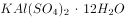。明矾净水的原理是明矾在水中能够电离出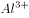离子，离子很容易水解，生成氢氧化铝胶体，氢氧化铝胶体的吸附能力很强，可以吸附水里悬浮的杂质，并形成沉淀，使水澄清。向海水中加入明矾只能吸附水中的悬浮杂质，无法去除海水中的盐分（海水中的氯离子和钠离子），即明矾不能用于海水淡化。

C项错误，糖类是自然界中广泛分布的一类重要的有机化合物，日常食用的蔗糖、粮食中的淀粉等均属糖类，糖类是人体维持生命活动的主要能量来源。人体也可以从脂肪中获取能量，相同质量的油脂在体内完全氧化时提供的能量比糖类约高一倍。但要注意，油脂分解比糖类难，因此油脂的主要作用是储能。

D项正确，维生素C又叫抗坏血酸，具有很强的还原性，易溶于水，广泛存在于新鲜蔬菜水果中。高温烹饪青菜会导致其维生素C有所流失，高温长时间加热的情况下，维生素C损失更多。

故正确答案为D。

---

### 第 37 题　qid 4808623 · 经济常识

我国特高压输电技术诞生了“中国标准”，实现了“中国制造”和“中国引领”，是电力工业发展史上的重要里程碑，被中国生产力学会评选为中国生产力发展十大标志性成就之一，特高压输电技术是指交流（    ）千伏、直流（    ）千伏及以上电压等级的输电技术。

- **A**. 
220 

- **B**. 
500 

- **C**. 
1000 

- **D**. 
1000 
　✅

**答案**：D

**官方解析**

本题考查科技常识。

特高压输电技术是指交流1000千伏、直流千伏及以上电压等级的输电技术，与较低电压输电方式相比具有长距离、大容量、低损耗、节约土地资源的优势。我国第一条特高压输电工程于2009年1月6日正式投入运行，标志着我国电力输送技术达到世界领先水平，是我国能源革命的标志性技术成果和我国先进生产力发展的重大突破。

故正确答案为D。

---

### 第 38 题　qid 4808633 · 人文常识

下列诗句不属于唐诗的是：

- **A**. 报得三春晖
- **B**. 心有灵犀一点通
- **C**. 人面桃花相映红
- **D**. 应似飞鸿踏雪泥　✅

**答案**：D

**官方解析**

本题考查人文常识。唐诗，泛指唐朝诗人创作的诗。
A项正确，该句出自唐代孟郊的《游子吟》，意思是能报答得了像春晖普泽的慈母恩情。《游子吟》是一首五言唐诗。
B项正确，该句出自唐代李商隐的《无题·昨夜星辰昨夜风》，意思是你我内心像灵犀一样，感情息息相通。《无题·昨夜星辰昨夜风》是一首七言律诗。
C项正确，该句出自唐代崔护的《题都城南庄》，意思是美丽的脸庞和桃花彼此相互映衬的绯红。《题都城南庄》是一首七言绝句。
D项错误，该句出自宋代苏轼的《和子由渑池怀旧》，意思是（人的一生奔走）应该像飞鸿踏在雪地吧。不属于唐诗。
本题为选非题，故正确答案为D。

---

### 第 39 题　qid 4808636 · 人文常识

下列著名历史人物，按其出现的年代先后排列，正确的是：

- **A**. 司马懿——司马迁——司马光
- **B**. 王昭君——王安石——王羲之
- **C**. 李广——李白——李煜　✅
- **D**. 刘邦——刘备——刘秀

**答案**：C

**官方解析**

本题考查人文常识。
A项错误，司马懿是三国时期曹魏政治家、军事谋略家、权臣，西晋王朝的奠基人之一；司马迁是西汉史学家、文学家、思想家，代表作《史记》；司马光是北宋政治家、史学家、文学家，主持编纂了《资治通鉴》。故正确顺序应为司马迁——司马懿——司马光。
B项错误，王昭君是西汉汉元帝时期的宫女，后出塞与匈奴和亲；王安石是北宋时期政治家、文学家、改革家，主持了熙宁变法；王羲之是东晋大臣、书法家，有“书圣”之称。故正确顺序应为王昭君——王羲之——王安石。
C项正确，李广是西汉汉武帝时期抗击匈奴名将、民族英雄；李白是唐代伟大的浪漫主义诗人，被后人誉为“诗仙”；李煜是南唐末代君主，著名词人。按出现的年代先后排列正确。
D项错误，刘邦是汉朝开国皇帝，对汉族的发展以及中国的统一有突出贡献；刘备是三国时期蜀汉开国皇帝；刘秀是东汉开国皇帝，统治期间出现“光武中兴”。故正确顺序应为刘邦——刘秀——刘备。
故正确答案为C。

---

## 言语理解与表达

### 第 1 题　qid 4807713 · 逻辑填空

AI语音技术正在        ，但现阶段，“检索式回答”是大多虚拟助手的主要人机交互方式之一，对话内容局限于模型自建库和互联网数据。用户的单个问题体量大且无法穷尽，依据互联网数据回答用户提问命中率低，这种整个行业普遍存在的情况因为大模型的加入得到了        。AI助手在听、看和感受等方面都因它获得了长足进步，变得越发“博学”，功能不多、语音识别不准、语音唤醒困难等种种不智能的表现正在一一        。
依次填入划横线处的词语，最恰当的一项是：

- **A**. 升级 解决 优化
- **B**. 改善 发展 解决
- **C**. 改变 关注 进化
- **D**. 发展 改善 消除　✅

**答案**：D

**官方解析**

第一空，横线后“但”字转折，前后表意相反，后文指出技术存在局限性，故横线处应体现技术向好发展的意思，A项“升级”指升到比原来高的等级或班级，B项“改善”指使原来的状况变得好些，D项“发展”指事物由小到大、由简单到复杂、由低级到高级的变化，均符合文意，保留。C项“改变”指事物变得和原来不一样，不一定是变好了，与文意不符，排除。
第二空，横线前指出AI技术对话内容较局限、回答用户问题命中率低等问题，横线后表明AI助手因为大模型的加入获得了长足进步，横线处应体现问题好转之意，A项“解决”指处理使有结果，D项“改善”指使原来的状况变得好些，均符合文意，保留。B项“发展”指事物由小到大、由简单到复杂、由低级到高级的变化，文段想表达普遍存在的问题有改善，并不是问题得到发展，排除。
第三空，横线前表达AI助手变得“博学”，所以横线处应表达以前的一系列问题就不复存在了的意思，D项“消除”指除去，使不存在，符合文意，当选。 A项“优化”指采取一定的措施变得更优秀，侧重比以前更好，而文段侧重强调解决之前的问题，故“优化”与“不智能的表现”搭配不当，排除。
故正确答案为D。
【文段出处】《低成本、高智商，博学的AI助手上岗》

---

### 第 2 题　qid 4807707 · 逻辑填空

现阶段我国正全力推进智慧农业发展，将“智慧”赋能于农业生产的各个环节，从        、田间管理到收获，从靠        到看        ，实现了由传统农业“看天”向智慧农业看“屏幕”的转变。
依次填入划横线处的词语，最恰当的一项是：

- **A**. 选种 老天 技术
- **B**. 播种 天气 政策
- **C**. 春播 人力 技术
- **D**. 播种 经验 数据　✅

**答案**：D

**官方解析**

第一空，根据文意可知，横线处所填词语是田间管理的前一个环节，B、D两项“播种”、C项“春播”均符合文意，保留。A项“选种”指选择品种，并不是田间管理的前一个环节，排除。
第二空，根据文意可知，横线处表达农民通过“看天”进行农业生产，B项“天气”、D项“经验”均符合文意，保留。C项“人力”指人为的力量，从事劳作的人口，与后文“看天”无法对应，排除。
第三空，根据文意可知，横线处表达随着智慧农业的发展，现在农民通过看“屏幕”进行农业生产，D项“数据”与文意相符，当选。B项“政策”无法体现智慧农业的作用，排除。
故正确答案为D。
【文段出处】《扎赉特旗：智慧农业描绘田野新画卷》

---

### 第 3 题　qid 4807705 · 逻辑填空

近年来，国产精品剧            ，主旋律作品“爆款”频出，一部《山海情》实现了电视遥控器在家庭的代际统一，我们今天的幸福生活就是《觉醒年代》的续集，观众的真心点赞和真切感慨，体现了优秀国产剧的深厚观众缘，也证明了好作品的强大          。
依次填入划横线处的词语，最恰当的一项是：

- **A**. 异军突起 感召力
- **B**. 拨云见日 凝聚力
- **C**. 数不胜数 创造力
- **D**. 层出不穷 生命力　✅

**答案**：D

**官方解析**

第一空，搭配“国产精品剧”，且根据“主旋律作品‘爆款’频出”可知，横线处所填成语意在表达国产精品剧数目较多且频繁出现。D项“层出不穷”表示接连不断地出现，没有穷尽，符合文意，保留。A项“异军突起”强调新的派别或新的力量突然兴起，B项“拨云见日”比喻疑团消除，心里顿时明白，均不能体现国产精品剧数目较多且频繁出现之意，不符合文意，排除；C项“数不胜数”指数都数不过来，形容数量极多，很难计算，程度过重，排除。
第二空，代入验证。D项“生命力”指支配和统制生命的活动力，填入此处可表达国产精品剧生存发展的能力之强，符合文段语境，当选。
故正确答案为D。
【文段出处】《培厚电视剧高质量发展土壤》

---

### 第 4 题　qid 4807739 · 逻辑填空

冬奥题材美术创作，绝不仅仅是将冰雪自然景观与冰雪运动        简单地组合或叠加，而是需要在深入理解奥林匹克精神的基础上，实现力与美“一加一大于二”的融合，是视觉上的绽放，也是精神上的        。
依次填入划横线处的词语，最恰当的一项是：

- **A**. 景象 提升
- **B**. 形象 升华　✅
- **C**. 健儿 超越
- **D**. 场景 提炼

**答案**：B

**官方解析**

本题可从第二空入手，搭配“精神”，B项“升华”比喻事物的境界提升，C项“超越”指超出、越过，均与“精神”搭配恰当，保留。A项“提升”指使位置、程度、水平、数量、质量等方面比原来高，如提升品质，与“精神”搭配不当，排除；D项“提炼”指用化学方法或物理方法从化合物或混合物中提取（所要的东西）或比喻文艺创作和语言艺术等弃芜求精的过程，如提炼精华，与“精神”搭配不当，排除。
第一空，搭配“冰雪运动”，且根据文意可知，文段强调冬奥题材美术创作不仅要展现“冰雪自然景观”与“冰雪运动”的组合或叠加，B项“形象”指能引起人的思想或感情活动的具体形态或姿态，既能体现出“冬奥题材美术创作”中运动员展现的风姿，又可与后文“视觉”“精神”形成对应，当选。C项“健儿”单单指“人”，对比B、C两项，B项填入文段更符合“美术创作”的特点，故排除。
故正确答案为B。
【文段出处】《记录这场逐梦旅程》

---

### 第 5 题　qid 4807746 · 逻辑填空

冬日晴空下，绵延上百公里的黄河湿地三门峡段，一群群“白衣仙客”悠然自得地        ，时而引吭高歌，时而            ，时而凌空亮翅，时而翩翩起舞，形成全国罕见的城市生态风景线。在三门峡，白天鹅与山水，与城市，与人，融为一体，创造着“天鹅之城”诗意栖居的日常生活场景。
依次填入划横线处的词语，最恰当的一项是：

- **A**. 散步 飞上云霄
- **B**. 飞翔 闲庭信步
- **C**. 徜徉 婉转低鸣　✅
- **D**. 玩耍 一飞冲天

**答案**：C

**官方解析**

第一空，根据上下文可知，“白衣仙客”指白天鹅，横线处词语是对后文内容“时而引吭高歌······时而凌空亮翅，时而翩翩起舞”的概括，故横线处所填词语既需要涵盖白天鹅吟唱、飞翔等动作，又需要符合“悠然自得”，C项“徜徉”指陶醉于某事物当中，形容白天鹅在三门峡的景色中陶醉，D项“玩耍”即做轻松愉快的活动，均符合文意，保留。A项“散步”无法体现“白天鹅”的状态，排除；B项“飞翔”只能对应“时而凌空亮翅，时而翩翩起舞”，无法概括后文内容，排除。
第二空，根据相同句式表并列，且“凌空亮翅”与“翩翩起舞”均形容白天鹅飞翔的状态可知，横线处词语应与“引吭高歌”构成并列，共同形容白天鹅吟唱的状态，C项“婉转低鸣”形容天鹅低声鸣叫，抑扬动听，符合文意，当选。D项“一飞冲天”意为鸟儿展翅一飞，直冲云霄，常比喻平时没有特殊表现，一下做出了惊人的成绩，与吟唱无关，排除。
故正确答案为C。
【文段出处】光明日报《河南三门峡：黄河岸边 天鹅蹁跹》

---

### 第 6 题　qid 4807737 · 逻辑填空

中国人的时间        与世界上其他国家的人一样，经历了自然时间向社会时间的转变，但中国是有着悠久农业传统的国家，依赖自然条件的农业生活，使中国人的时间观念，有着浓厚的          特点，季节岁时的感觉特别强烈。
依次填入划横线处的词语，最恰当的一项是：

- **A**. 感悟 天然性
- **B**. 感觉 农业性
- **C**. 体验 生态性
- **D**. 感知 自然性　✅

**答案**：D

**官方解析**

第一空，搭配“时间”，且根据后文“经历了自然时间向社会时间的转变”可知，横线处词语需体现出中国人对时间的理解和认知，B项“感觉”指客观事物在人大脑中引起的直接反应，D项“感知”指利用感官对物体获得的有意义的印象，均符合文意，保留。A项“感悟”指有所感触而领悟，文段并未体现出有所感触而领悟到一些道理，与文意不符，排除；C项“体验”指通过实践来认识周围的事物或亲身经历，侧重“实践”，与文意不符，排除。
第二空，根据后文“季节岁时的感觉特别强烈”可知，中国人的时间观念应体现出四季、时令、节气的特点，D项“自然性”指的是自然界存在的，符合文意，当选。B项“农业性”指的是通过人工培育来获得农产品的产业，与文意无关，排除。
故正确答案为D。
【文段出处】《中国人最温暖的时间》

---

### 第 7 题　qid 4807718 · 片段阅读

牙釉质是人体中最坚硬的天然生物材料，可实现高硬、高弹、高强、高韧等多种相悖力学性能的结合。牙釉质结构复杂、无法再生，修复牙釉质一直是仿生领域的一项艰巨挑战：难以获得与天然釉质多级结构相同的大面积修复层，也难以复刻天然牙齿的各项性能。据了解，牙釉质主要是由规则平行排列的羟基磷灰石纳米线复合少量生物蛋白质组装而成，对其结构的精细解析表明羟基磷灰石纳米线间还具有无机非晶间质层，这种多级微纳结构是牙釉质具有优异力学性能的关键。由于缺乏一维纳米线的宏观尺寸可控组装的方法，以及无机非晶纳米材料在制备及形貌调控方面的技术瓶颈，多尺度模仿牙釉质的多级结构以期在人造工程材料中实现甚至超过牙釉质的优异力学性能是一个巨大的挑战。
这段文字意在说明：

- **A**. 修复牙釉质的挑战　✅
- **B**. 人体牙釉质的特点
- **C**. 牙釉质的独特结构
- **D**. 天然的事物难以仿制

**答案**：A

**官方解析**

文段开篇引出“牙釉质”这一话题，介绍了牙釉质的特点，接着提出观点，即修复牙釉质是仿生领域的挑战，后文通过冒号进行解释说明，表示难以获得与天然釉质多级结构相同的修复层，难以复刻天然牙齿的性能，并围绕这一解释说明的内容展开详细论述，先介绍了牙釉质具有优异力学性能的关键所在，随后指出由于缺乏相应的方法以及存在技术瓶颈，难以模仿牙釉质的多级结构，难以超越牙釉质的优异力学性能。故后文内容均为对文段观点的解释说明，文段重点强调了修复牙釉质是仿生领域的挑战，对应A项。
B项，对应文段首句的内容，属于话题引入部分，非重点，排除；
C项，属于解释说明的内容，非重点，排除；
D项，文段围绕“牙釉质”展开论述，“天然的事物”范围扩大，排除。
故正确答案为A。
【文段出处】《我国人工牙釉质研究取得突破》

---

### 第 8 题　qid 4807730 · 片段阅读

通过气候灾害风险教育和灾种自救互救是提升基层民众在气候巨灾中的逃生技能、自救互救能力和风险防范意识的主要途径。随着自媒体的蓬勃发展，可非常方便地通过气候灾害风险教育和灾种自救互救能力提升来实现灾害的自救互救，但气候巨灾风险在网络平台中引发的“气候巨灾风险舆情”对灾害风险治理和社会稳定的影响也令人关注，尤其是“气候巨灾风险舆情”一旦偏离事实本质，往往会影响社会稳定、经济发展，甚至国家安全。
根据上述文字，作者接下来最可能阐述的是：

- **A**. 气候巨灾风险的人文防御能力分析
- **B**. 气候巨灾风险的舆情影响因素分析　✅
- **C**. 气候巨灾风险设防能力的基础建设
- **D**. 气候巨灾风险防御能力的网络建设

**答案**：B

**官方解析**

本题为接语选择题，通读全文，重点关注文段最后谈论的核心话题。文段开篇介绍“气候灾害风险教育”和“灾种自救互救”是提升民众风险防范意识的主要途径，并通过提升它们的能力能够实现灾害的自救互救。随后通过转折词“但”强调网络平台引发的“气候巨灾风险舆情”的影响也令人关注，尾句通过反面论证表明“气候巨灾风险舆情”影响的重要性。因此文段接下来应继续围绕“气候巨灾风险舆情”的话题展开论述，对应B项。
A项“气候巨灾风险的人文防御能力”、C项“气候巨灾风险设防能力”、D项“气候巨灾风险防御能力”均与文段最后谈论的核心话题不一致，与前文衔接不当，排除。
故正确答案为B。

---

### 第 9 题　qid 4807735 · 语句表达

①叔向称，“先王”时期，就已“严断刑罚以威其淫”，但用不着制订法律条文
②夏商周三代，就有了《禹刑》《汤刑》和《九刑》三部未公布公示的法典
③从社会历史发展的角度来看，夏朝是我国历史上建立的第一个国家
④“法”这一概念，其实在我国很早就已经产生
⑤国家统治集团为进行统治管理，需要规范的法律条款，此时产生法典亦是情理之中
⑥郑国子产铸刑书，将法以律条的形式固定并颁布于民，首启法律公布公示之肇端
将上述文字重新排序，最为恰当的是：

- **A**. ②③⑤⑥④①
- **B**. ④⑤⑥①②③
- **C**. ④⑥①③②⑤
- **D**. ⑥④①②③⑤　✅

**答案**：D

**官方解析**

对比选项，确定首句。②句指出夏商周三代就已经有了三部未公布公示的法典，④句介绍“法”的概念其实在我国很早就已经产生，⑥句表明郑国子产铸刑书是法律公布公示的开端，均合适作首句，不易判断。
继续观察，寻找线索，发现③句指出夏朝是我国历史上建立的第一个国家，⑤句指出国家统治集团为进行统治管理需要规范的法律条款，应先建立国家，再出现国家的统治管理需要，且论述话题一致，故③⑤两句捆绑，排除B、C两项。
对比A、D两项，区别在于②③⑤三句和⑥④①三句的顺序，寻找提示两者先后顺序的信息。其中①句指出“严断刑罚”，但用不着制订法律条文，而②句通过夏商周“三部未公布公示的法典”对其举例论证，故①句在②句之前，排除A项，锁定D项。
故正确答案为D。

---

### 第 10 题　qid 4807790 · 片段阅读

据某团队负责人介绍，受自然界变色龙智能变色机制启发，他们将动态共价硼酸酯键引入主链型胆甾相液晶弹性体中，同时利用热激发动态B-O键交换特性，实现了变色薄膜的任意颜色和三维形状可控编程，并且其形状和颜色能够通过改变温度实现可逆调控，成功研发新型智能材料——“智能变色液晶高分子薄膜”。这种新材料厚度只有200微米，兼具力致变色、形状可编程和优异的室温自修复能力：在被拉伸时可以发生颜色变化；被切断后在断口处加几滴水，一段时间后材料就能重新愈合，从而具有更长的使用寿命。该材料还拥有“记忆编程”特性，可以被拉伸成任意二维或三维形状并保持不变，当材料加热到相变温度以上后，又能恢复到最初的形状。
这段文字的主题是：

- **A**. 智能变色液晶高分子薄膜的研发
- **B**. 智能变色液晶高分子薄膜的特点　✅
- **C**. 运用变色龙变色机制研发智能材料
- **D**. 智能变色液晶高分子薄膜的变色功能

**答案**：B

**官方解析**

文段开篇引出话题，指出某团队成功研发新型智能材料——“智能变色液晶高分子薄膜”，后文重点介绍这种材料所具备的特性，即变色、形状可编程、优异的室温自修复能力和“记忆编程”特性，故文段重在强调智能变色液晶高分子薄膜的特性，对应B项。
A项，“智能变色液晶高分子薄膜的研发”对应前文引出话题部分，非重点，排除；
C项，“运用变色龙变色机制”对应前文引出话题部分，非重点，且缺少核心话题“智能变色液晶高分子薄膜”，排除；
D项，“变色功能”仅为智能变色液晶高分子薄膜的特性之一，表述片面，排除。
故正确答案为B。
【文段出处】《受变色龙启发，科学家成功研发可愈合的“超级皮肤”》

---

### 第 11 题　qid 4807736 · 片段阅读

一个建筑一旦建成，不管你喜欢不喜欢，它都在那里。建筑的美丑会潜移默化地影响公共审美。精美的建筑是城市的亮丽风景线，装点着城市的外在形象，传承着城市甚至国家的文脉。我们看到斗兽场，就会想到古罗马；看到巴洛克建筑，就会想到意大利文艺复兴；看到榫卯结构的木构建筑，就不由自主地赞叹中国古人的智慧。这些流传至今的优秀建筑其实是承载民族叙事的有形容器，无声地向世人诉说着本民族的历史文化。
这段文字意在强调：

- **A**. 建筑美丑会影响公共审美
- **B**. 精美的建筑是城市的风景线
- **C**. 精美的建筑传承着地域的文脉　✅
- **D**. 精美的建筑代表城市甚至国家形象

**答案**：C

**官方解析**

文段开篇指出建筑一旦建成便是客观存在的事物且其美丑会影响公共审美，接下来指出精美的建筑传承着城市、国家的文脉，并从三方面举例论证精美建筑和文化的关系，尾句通过指代词“这些”再次点明观点，即精美的、优秀的建筑承载着当地历史文化，故文段强调“精美的建筑”与“文化/文脉”二者之间的关系，对应C项。
A项，“建筑美丑会影响公共审美”对应文段引出话题的部分，非重点，排除；
B、D两项均偏离文段核心话题“文化/文脉”，排除。
故正确答案为C。
【文段出处】《建筑艺术应守住公共审美底线》

---

### 第 12 题　qid 4807745 · 语句表达

时间有价值，但时间本身无法增值。有“一万小时定律”，从平凡到卓越需经历一万时的锤炼；也有关于“一万小时定律”的反例，看似忙忙碌碌，到头来却一事无成。怎么让时间成为成功者的“加持”，取决于人们对待时间的态度。张驰有度、轻重分明、取舍果断，都是驾驭时间的妙招。时间中蕴藏着经济效益，但这并不意味着每一种争分夺秒都算得上利用时间的“最优解”。弦总绷紧会断，车总开快容易失控，积劳容易成疾，                    。
填入划横线处最恰当的一项是：

- **A**. 急躁冒进、好大喜功、违背科学，实际上是对时间资源的任性挥霍　✅
- **B**. 时间作为一种最为特殊的资源，既需要充分利用，又需要精准度量
- **C**. 我们既需惜时如金以增进财富储量，也需因时制宜来掌控发展变量
- **D**. 分清楚实绩与虚功、苦干与蛮干的差别，时间才能浇灌得梦想花开

**答案**：A

**官方解析**

横线出现在文段结尾，起到总结前文的作用。文段开篇引出时间的话题，指出“一万小时定律”以及它的反例，之后又介绍了一系列“驾驭时间的妙招”，随后通过转折词“但”强调“争分夺秒”不是最好的方法。尾句通过“弦总绷紧会断，车总开快容易失控，积劳容易成疾”强调过于紧张、过于冒进会带来问题，横线处属于尾句的一个分句，根据话题一致原则，横线处也要体现过于紧张、过于冒进是错误利用时间的方式，对应A项。
B项，“精准度量”即利用好每分每秒，与文意相悖，排除；
C项，“惜时如金”“因时制宜”无中生有，文段未提及，排除；
D项，“分清楚实绩与虚功、苦干与蛮干的差别”指的是不能“简单化”“不作为”“乱作为”，无法解决文段问题，且与前文衔接不紧密，排除。
故正确答案为A。
【文段出处】《善用“时间资源”》

---

## 数量关系

### 第 1 题　qid 4808267 · 数学运算

某城市燃气收费标准如下，一档：每户年度用气0~360立方米（含360立方米），收费2.5元/立方米；二档：每户年度用气360~600立方米（含600立方米），收费3元/立方米；三档：每户年度用气600立方米以上，收费3.5元/立方米。已知某用户今年燃气费平均每立方米3元，那么今年该用户二、三档燃气费平均每立方米多少元？

- **A**. 3.1
- **B**. 3.2
- **C**. 3.3　✅
- **D**. 3.4

**答案**：C

**官方解析**

一档用气收费低于3元，二档用气收费等于3元，则一二档用气的平均燃气费应低于3元。而该用户今年燃气费平均每立方米等于3元，说明该用户今年年度用气一定达到了三档。设该用户今年三档用气x立方米，根据题意可得：2.5×360+3×（600-360）+3.5x=3×（600+x），解得x=360，则今年该用户二、三档燃气费平均为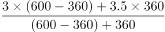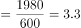元/立方米。

故正确答案为C。

---

### 第 2 题　qid 4808253 · 数学运算

小王购买某燃油车A，四年行驶6万公里，平均每公里燃油费为0.54元，4年税费和保养费用花费2.3万元，最后以车价的50%卖出。小李以同样的价格购买一款纯电动车B，同样四年行驶6万公里，平均每公里电费为0.14元，4年税费和保养费用花费0.5万元，最后以车价的20%卖出。刚好两人的实际使用费用（实际使用费用=车价+燃油费或电费+税费和保养费－卖出车价）相同。请问小王四年的实际使用费用为多少万元？

- **A**. 10.14
- **B**. 11
- **C**. 12.54　✅
- **D**. 14

**答案**：C

**官方解析**

设小王、小李购买时的车价均为10x万元。结合题中所给关系：实际使用费用=车价+燃油费或电费+税费和保养费-卖出车价，则小王的实际使用费用为10x+6×0.54+2.3-50%×10x=5x+5.54万元，小李的实际使用费用为10x+6×0.14+0.5-20%×10x=8x+1.34万元。两人的实际使用费用相同，则有：5x+5.54=8x+1.34，解得x=1.4，则小王四年的实际使用费用为5×1.4+5.54=12.54万元。
故正确答案为C。

---

### 第 3 题　qid 4808262 · 数学运算

将一满容器浓度为24%的溶液放置太阳下暴晒一段时间，经过一段时间蒸发水分后溶液浓度变为36%且无沉淀。然后再用浓度为12%的溶液将容器加满。请问容器内溶液浓度变为多少？

- **A**. 24%
- **B**. 28%　✅
- **C**. 30%
- **D**. 32%

**答案**：B

**官方解析**

蒸发时水分减少，溶质不变，将容器中原有溶质量赋值为72g。根据公式：溶液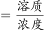，可得容器装满时溶液量为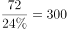g，蒸发一段时间后溶液量为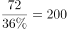g，即水的蒸发量为300-200=100g，则将容器加满需再加入100g溶液。根据公式：浓度，此时容器内溶液浓度变为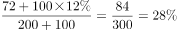。

故正确答案为B。

---

### 第 4 题　qid 4808287 · 数学运算

某工厂一机器需要同类零件分别安装在A和B处。已知零件安装在A处可工作600小时报废，安装在B处可工作900小时报废。两零件分别安装在A、B两处工作一段时间后，交换零件位置继续工作。这时零件恰好同时报废，忽略安装和更换零件的时间，请问这两个零件使机器工作了多少小时？

- **A**. 640
- **B**. 720　✅
- **C**. 800
- **D**. 840

**答案**：B

**官方解析**

将总量赋值为1800，则零件在A处的损耗效率为，零件在B处的损耗效率为。

方法一：设两个零件先分别在A、B两处工作x小时，交换零件位置继续工作y小时。两个零件恰好同时报废，则有：3x+2y=1800······①，2x+3y=1800······②，可得：x+y=720，即这两个零件使机器工作了720小时。

方法二：两个零件同时安装，同时报废，即在同一段时间内，两个零件分别在A、B两处损耗殆尽，则这段时间为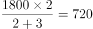小时，即这两个零件使机器工作了720小时。

故正确答案为B。

---

### 第 5 题　qid 4808295 · 数学运算

某单位有三个人数相等的科室甲、乙、丙，已知甲科室的党员人数等于乙科室的非党员人数，丙科室的党员人数占全单位党员的40%。那么该单位党员人数比非党员人数：

- **A**. 少20%
- **B**. 少25%
- **C**. 多20%
- **D**. 多25%　✅

**答案**：D

**官方解析**

方法一：根据题意，设全单位党员人数为5x，甲科室党员人数为y，则各科室党员人数与非党员人数见下表。

因此，该单位党员人数比非党员人数多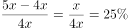。

方法二：由“甲科室的党员人数等于乙科室的非党员人数”，则甲、乙两科室的党员总人数即为每个科室的人数。将全单位党员人数赋值为100。则甲、乙科室的党员人数为100×（1-40%）=60，即每个科室的人数为60，全单位总人数为60×3=180，非党员人数为180-100=80。因此，该单位党员人数比非党员人数多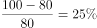。

故正确答案为D。

---

### 第 6 题　qid 4808275 · 数学运算

设一边长为3的正三角形S1，将S1的每条边三等分，在中间的线段上向形外作正三角形，去掉中间的线段后所得到的图形记为S2；同理将S2的每条边三等分，并重复上述过程所得到的图形记作S3。那么S3与S1的周长之比为多少？

- **A**. 64：27
- **B**. 16：9　✅
- **C**. 4：3
- **D**. 2：1

**答案**：B

**官方解析**

观察下图可知：S1的周长为3×3=9；S2是将S1的每条边先三等分，再由中间线段做等边三角形，即变为4段，共有3×4=12条边，边长均为1，周长为12×1=12；S3也是将S2的每条边变为4段，共有12×4=48条边，边长均为，周长为。则S3与S1的周长之比为16：9。

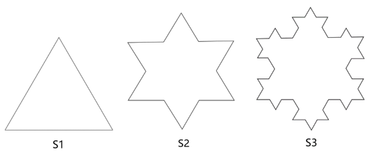

故正确答案为B。

---

### 第 7 题　qid 4808290 · 数学运算

小贝计划到银行兑换面值5元、10元、20元人民币若干。已知小贝恰好用5张面值100元人民币兑换上述面值人民币45张，那么请问有多少种兑换方法？

- **A**. 14　✅
- **B**. 15
- **C**. 16
- **D**. 18

**答案**：A

**官方解析**

设小贝兑换面值5元人民币x张，兑换面值10元人民币y张，兑换面值20元人民币z张。根据题意可列方程：x+y+z=45······①；5x+10y+20z=5×100······②。②式可化简为x+2y+4z=100······③，③-①×2可得2z-x=10，x、y、z均为自然数，则分情况讨论列表如下：

则共有14种兑换方法。

故正确答案为A。

备注：本题不严谨，题干为“兑换面值5元、10元、20元人民币若干”，即5元、10元、20元均应兑换，按照表中所列应为13种，但无正确答案，故加上第一种情况（0，40，5），共有14种兑换方法。

---

### 第 8 题　qid 4808282 · 数学运算

某单位组织员工参加业务培训，小王和小李所在部门员工10人在同一排就坐，一排正好10个座位，假设座位是随机安排的。问小王和小李之间相隔人数小于等于3人的概率为多少？

- **A**. 

- **B**. 

- **C**. 

- **D**. 

　✅

**答案**：D

**官方解析**

根据题意可得，总情况数为小王与小李从10个座位中选择2个，共有种情况。满足条件情况数为小王与小李之间相隔人数小于等于3的情况，分情况讨论为：

①小王与小李相邻：10个座位中可选择座位的情况分别为：（1，2）、（2，3）、（3，4）、（4，5）、（5，6）、（6，7）、（7，8）、（8，9）、（9，10），则情况数共9种；

②小王与小李相隔1人：10个座位中可选择座位的情况分别为：（1，3）、（2，4）、（3，5）、（4，6）、（5，7）、（6，8）、（7，9）、（8，10），则情况数共8种；

同理可得：

③小王与小李相隔2人，10个座位中可选择座位的情况数共7种；

④小王与小李相隔3人，10个座位中可选择座位的情况数共6种。

由此可知，所求概率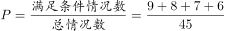。

故正确答案为D。

---

### 第 9 题　qid 4808307 · 数学运算

为庆祝北京奥运会，小静和小北分别收集了若干个冬奥会吉祥物冰墩墩的联名款玩偶。若小静给小北三个冰墩墩，则小北的冰墩墩是小静的n倍，若小北给小静n个冰墩墩，则小静的冰墩墩是小北的3倍，假设n为大于3的整数，请问小北和小静共有多少个冰墩墩？

- **A**. 15
- **B**. 16　✅
- **C**. 24
- **D**. 30

**答案**：B

**官方解析**

设小静有（x＋3）个冰墩墩，则小北有（nx-3）个冰墩墩。根据题意可列方程为：3（nx-3-n）＝x＋3＋n，整理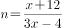。由题意可知n为大于3的整数，则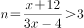，解得，故x＝2，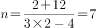。所以小静有2＋3＝5个冰墩墩，小北有7×2-3＝11个冰墩墩，小北和小静共有5＋11＝16个冰墩墩。

故正确答案为B。

---

## 判断推理

### 第 1 题　qid 4808791 · 图形推理

从下列所给四个选项中选择最合适的一个填入问号处，使之呈现一定的规律性：

- **A**. A
- **B**. B
- **C**. C　✅
- **D**. D

**答案**：C

**官方解析**

元素组成不同，且无属性规律，考虑数量规律。观察发现，题干图2和图4都有圆，图3含有明显曲线，考虑曲线数。题干图形的曲线数依次为0、1、2、3，故问号处应填入有4条曲线的图形，只有C项符合。
故正确答案为C。

---

### 第 2 题　qid 4808801 · 图形推理

从下列所给四个选项中选择最合适的一个填入问号处，使之呈现一定的规律性：

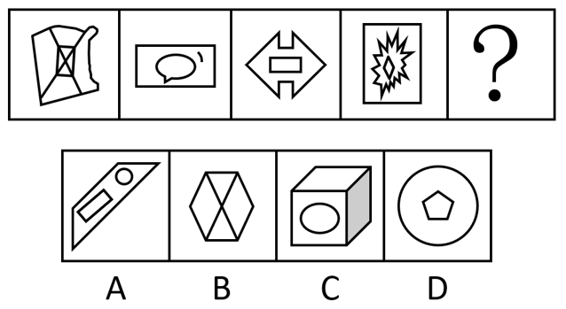

- **A**. A　✅
- **B**. B
- **C**. C
- **D**. D

**答案**：A

**官方解析**

元素组成相似，且某些元素不止一次出现在各图形中，优先考虑样式规律中的遍历。比较相邻图形发现，题干已知图形都包含长方形元素，故问号处图形也应满足此规律，只有A项符合。
故正确答案为A。

---

### 第 3 题　qid 4808789 · 定义判断

越来越多的年轻人不再满足于专一职业生活方式，而是尝试拥有多重职业和身份的多元生活，体验不同的工作经历，感悟多重人生。在这种背景下，“斜杠青年”概念应运而生。“斜杠青年”指从事多种职业，体验多元化工作和生活的青年群体。在自我介绍时，他们会用“/”来区分多重职业身份。
根据上述定义，以下为“斜杠青年”的是：

- **A**. 甲，男，21岁，在校本科生/通信专业/辅修软件设计
- **B**. 乙，女，35岁，普通高中高级教师/班主任/年级主任
- **C**. 丙，女，30岁，播音主持教师/插画师/网络小说作家　✅
- **D**. 丁，男，75岁，新闻传播学教授/自由拟稿人/花艺师

**答案**：C

**官方解析**

第一步：找出定义关键词。
“从事多种职业”、“青年群体”。
第二步：逐一分析选项。
A项：甲是一名在校学生，“/”前后是所学的专业，不符合“从事多种职业”，不符合定义，排除； 
B项：乙是一名教师，“/”前后是教师职责不同角度的体现，不符合“从事多种职业”，不符合定义，排除；
C项：丙的年龄是30岁，符合“青年群体”，“/”前后为3个不同的职业身份，符合“从事多种职业”，符合定义，当选；
D项：丁的年龄是75岁，不符合“青年群体”，不符合定义，排除。
故正确答案为C。

---

### 第 4 题　qid 4808857 · 定义判断

无废城市是以创新、协调、绿色、开放、共享的新发展理念为引领，通过推动形成绿色发展方式和生活方式，持续推进固体废物源头减量和资源化利用，最大限度减少填埋量，将固体废物环境影响降至最低的城市发展模式。
根据上述定义，以下与无废城市建设无关的是：

- **A**. 著名滨海旅游城市甲市，在全市范围内开展绿色机关、绿色社区、绿色校园、绿色酒店争创活动；禁止一次性不可降解塑料袋和塑料餐具生产、销售和使用，减少塑料污染
- **B**. 乙市是有色金属基地，2018年以前，工业固体废物年均产生量约1500吨，年均综合利用量不足10吨。经努力，现在废物产生量降至1450吨以下，综合利用量超过1200吨
- **C**. 丙市对建筑废物作减法，推动建成装配式建筑产业基地，力促具备条件的新建建筑采用装配方式进行建设，既发展了生产技术，又提高了绿色建筑比例，减少了建筑废物
- **D**. 丁市矿产资源丰富，近年来大力治理因长期粗放开发导致的生态危机，城市绿化覆盖率恢复到37.9%，建成4A级景区4个，3A级景区2个，被评为省森林城市和国家园林城市　✅

**答案**：D

**官方解析**

第一步，找出定义关键词。
“推动形成绿色发展方式和生活方式，持续推进固体废物源头减量和资源化利用”、“最大限度减少填埋量”、“将固体废物环境影响降至最低的城市发展模式”。
第二步，逐一分析选项。
A项：甲市禁止一次性不可降解塑料袋和塑料餐具生产、销售和使用，减少塑料污染就是减少固体废物的污染，符合“推动形成绿色发展方式和生活方式，持续推进固体废物源头减量和资源化利用”、“最大限度减少填埋量”、“将固体废物环境影响降至最低的城市发展模式”，符合定义，排除；
B项：乙市的工业固体废物产量下降，综合利用量增加，符合“推动形成绿色发展方式和生活方式，持续推进固体废物源头减量和资源化利用”、“最大限度减少填埋量”、“将固体废物环境影响降至最低的城市发展模式”，符合定义，排除；
C项：丙市提高了绿色建筑比例，减少建筑废物是减少固体废物的一种手段，符合“推动形成绿色发展方式和生活方式，持续推进固体废物源头减量和资源化利用”、“最大限度减少填埋量”、“将固体废物环境影响降至最低的城市发展模式”，符合定义，排除；
D项：丁市经过治理，城市绿化覆盖率增加，未提及针对固体废物的具体解决情况，不符合“推动形成绿色发展方式和生活方式，持续推进固体废物源头减量和资源化利用”、“将固体废物环境影响降至最低的城市发展模式”，不符合定义，当选。
本题为选非题，故正确答案为D。

---

### 第 5 题　qid 4808782 · 定义判断

锁定是指因某些原因，导致从一个系统（可能是一种技术、产品或是标准）转换到另一个系统的转移成本大到转移不经济，从而很难从该系统退出的状态。
根据上述定义，下列情形属于锁定的是：

- **A**. 甲用某电脑操作系统多年，如改用另一操作系统就得学习和适应该系统的使用方法，他觉得费事不愿改　✅
- **B**. 乙吃饭时习惯了边吃边喝饮料，尽管他知道这个习惯对身体很不好，但是他改变不了这个不好的习惯
- **C**. 丙的电视看了多年，已经很老旧了，儿子一直劝他买一台新的，但是他觉得使用频率不高，没必要换
- **D**. 丁正在追一部电视剧，当朋友向他推荐一热播新剧时，他并不想放弃该剧

**答案**：A

**官方解析**

第一步：找出定义关键词。
“从一个系统（可能是一种技术、产品或是标准）转换到另一个系统的转移成本大到转移不经济”、“很难从该系统退出”。
第二步：逐一分析选项。
A项：甲因为觉得费事而不愿更换使用多年的电脑操作系统，转移的成本是要重新学习和适应新的操作系统，“费事”说明这些时间和精力上的转移成本对于甲来说是难以接受的，符合“从一个系统（可能是一种技术、产品或是标准）转换到另一个系统的转移成本大到转移不经济”、“很难从该系统退出”，符合定义，当选；
B项：乙无法改变边吃饭边喝饮料的习惯，并没有体现转移的成本，不符合“从一个系统（可能是一种技术、产品或是标准）转换到另一个系统的转移成本大到转移不经济”，不符合定义，排除；
C项：丙因为使用频率不高而拒绝更换电视，转移的成本可能是花费，没有明确转移成本对丙来说是否是难以接受的，不符合“从一个系统（可能是一种技术、产品或是标准）转换到另一个系统的转移成本大到转移不经济”，不符合定义，排除；
D项：丁不想放弃正在追的电视剧，并没有体现转移的成本，不符合“从一个系统（可能是一种技术、产品或是标准）转换到另一个系统的转移成本大到转移不经济”，不符合定义，排除。
故正确答案为A。

---

### 第 6 题　qid 4808788 · 定义判断

质量成本是指企业为了保证和提高产品或服务质量而支出的一切费用，以及因未达到产品质量标准，不能满足用户和消费者需要而产生的一切损失。
根据上述定义，下列情形不符合质量成本含义的是：

- **A**. 甲市行政服务中心为进一步提高窗口服务质量购置便民办公设备　✅
- **B**. 乙公司卖出的产品在保修期内出现质量问题，公司免费维修
- **C**. 丙公司拨付专款让员工学习产品质量管理国际标准体系
- **D**. 丁工厂投入巨资研制出一条优化产品性能的生产线

**答案**：A

**官方解析**

第一步：找出定义关键词。
“企业”、“为了保证和提高质量而支出的费用”、“因未达到质量标准，不能满足需要而产生的损失”。
第二步：逐一分析选项。
A项：甲市行政服务中心不符合“企业”，不符合定义，当选；
B项：乙公司产品在保修期内出现质量问题，公司免费维修，免费维修需要耗费企业成本，符合“企业”、“因未达到质量标准，不能满足需要而产生的损失”，符合定义，排除；
C项：丙公司拨付专款让员工学习国际标准体系，是为了保证和提高产品质量，符合“企业”、“为了保证和提高质量而支出的费用”，符合定义，排除；
D项：丁工厂投入巨资研制生产线，是为了优化产品性能，符合“企业”、“为了保证和提高质量而支出的费用”，符合定义，排除。
本题为选非题，故正确答案为A。

---

### 第 7 题　qid 4808755 · 定义判断

叙事性舞蹈又称“情节舞”，是通过舞蹈中不同人物的行动所构成的情节事件来塑造人物，表现作品主题的舞蹈。抒情性舞蹈又称“情绪舞”，是在特定的环境中以鲜明生动的舞蹈语言来直接抒发舞者的思想情感，以此表达舞蹈家对生活的感受和评价的舞蹈。
根据上述定义，下列不属于叙事性舞蹈的是：

- **A**. 舞蹈演员在表演中模仿农民耕地插秧的动作
- **B**. 舞蹈演员用各种动作来表达农民的喜怒哀乐　✅
- **C**. 男女舞蹈演员用舞蹈来演绎悲欢离合的故事
- **D**. 舞蹈演员用舞蹈再现了红军长征的感人篇章

**答案**：B

**官方解析**

第一步：找出定义关键词。
叙事性舞蹈：“通过舞蹈中不同人物的行动所构成的情节事件”、“塑造人物，表现作品主题”；
抒情性舞蹈：“在特定的环境中以鲜明生动的舞蹈语言”、“来直接抒发舞者的思想情感，表达舞蹈家对生活的感受和评价”。
第二步：逐一分析选项。
A项：舞蹈演员通过模仿耕地插秧的动作来塑造农民的人物形象，符合“通过舞蹈中不同人物的行动所构成的情节事件”、“塑造人物，表现作品主题”，符合叙事性舞蹈的定义，排除；
B项：舞蹈演员用各种动作来表达农民的喜怒哀乐，强调了情感的抒发，没有体现情节的叙述，不符合“通过舞蹈中不同人物的行动所构成的情节事件”，不符合叙事性舞蹈的定义，当选；
C项：男女舞蹈演员用舞蹈来演绎悲欢离合的故事，“演绎故事”对应着“情节事件”，符合“通过舞蹈中不同人物的行动所构成的情节事件”、“塑造人物，表现作品主题”，符合叙事性舞蹈的定义，排除；
D项：舞蹈演员用舞蹈再现了红军长征的感人篇章，再现了红军的形象和精神，符合“通过舞蹈中不同人物的行动所构成的情节事件”、“塑造人物，表现作品主题”，符合叙事性舞蹈的定义，排除。
本题为选非题，故正确答案为B。

---

### 第 8 题　qid 4808767 · 类比推理

青春：奋斗：幸福

- **A**. 韶华：建功：立志
- **B**. 青年：开拓：创新
- **C**. 科技：发展：驱动
- **D**. 人生：耕耘：收获　✅

**答案**：D

**官方解析**

第一步：判断题干词语间逻辑关系。
“青春”需要“奋斗”，二者为对应关系，“奋斗”带来“幸福”，二者为因果的对应关系。
第二步：判断选项词语间逻辑关系。
A项：“建功”和“立志”没有因果关系，与题干逻辑关系不一致，排除；
B项：“开拓”和“创新”没有因果关系，与题干逻辑关系不一致，排除；
C项：“科技”需要“发展”，二者为对应关系，但“发展”和“驱动”没有因果关系，与题干逻辑关系不一致，排除；
D项：“人生”需要“耕耘”，二者为对应关系，“耕耘”带来“收获”，二者为因果的对应关系，与题干逻辑关系一致，当选。
故正确答案为D。

---

### 第 9 题　qid 4808780 · 类比推理

知足：不辱

- **A**. 甚爱：大费
- **B**. 多藏：厚亡
- **C**. 知止：不殆　✅
- **D**. 知难：不退

**答案**：C

**官方解析**

第一步：判断题干词语间逻辑关系。
“知足不辱”意思是知道满足，就不会受到羞辱。因为知足，所以不辱，二者是因果对应关系，且不辱是积极的结果。
第二步：判断选项词语间逻辑关系。
A项：“甚爱大费”意思是过分贪欲必然会导致更大的耗费。因为甚爱，所以大费，二者是因果对应关系，但大费是消极的结果，与题干逻辑关系不一致，排除；
B项：“多藏厚亡”意思是过分积聚财物必然会导致过多的损失。因为多藏，所以厚亡，二者是因果对应关系，但厚亡是消极的结果，与题干逻辑关系不一致，排除；
C项：“知止不殆”意思是知道适可而止就不会遇到危险。因为知止，所以不殆，二者是因果对应关系，且不殆是积极的结果，与题干逻辑关系一致，当选；
D项：“知难不退”意思是碰到困难也不退缩。二者不是因果对应关系，与题干逻辑关系不一致，排除。
故正确答案为C。

---

### 第 10 题　qid 4808802 · 类比推理

认识世界：把握规律：追求真理

- **A**. 修正错误：发扬经验：吸取教训
- **B**. 铭记历史：传承基因：坚毅前行
- **C**. 创新理论：指导实践：推动工作　✅
- **D**. 启迪智慧：砥砺品格：坚定信念

**答案**：C

**官方解析**

第一步：判断题干词语间逻辑关系。
先认识世界，然后把握规律，最后追求真理，三者为时间先后顺序的对应关系。
第二步：判断选项词语间逻辑关系。
A项：发扬经验应在吸取教训之后，与题干逻辑关系不一致，排除；
B项：铭记历史和传承基因不存在必然的先后顺序，与题干逻辑关系不一致，排除；
C项：先创新理论，然后用理论指导实践，最后推动工作，三者为时间先后顺序的对应关系，与题干逻辑关系一致，当选；
D项：启迪智慧、砥砺品格和坚定信念三者不存在必然的先后顺序，与题干逻辑关系不一致，排除。
故正确答案为C。

---

### 第 11 题　qid 4808793 · 类比推理

读书 对于 （    ） 相当于 （    ） 对于 本领

- **A**. 知识；历练　✅
- **B**. 成才；奋斗
- **C**. 理想；担当
- **D**. 研究；切磋

**答案**：A

**官方解析**

逐一代入选项。
A项：通过“读书”可以得到“知识”，通过“历练”可以得到“本领”，二者均是方式的对应关系，前后逻辑关系一致，当选；
B项：“读书”可能会“成才”，“奋斗”可能会获得“本领”，但“成才”是动宾结构，“本领”是名词，前后逻辑关系不一致，排除；
C项：通过“读书”可能会实现“理想”，“本领”与“担当”之间无明显逻辑关系，前后逻辑关系不一致，排除；
D项：“读书”的过程中需要“研究”，“切磋”可能会增强“本领”，前后逻辑关系不一致，排除。
故正确答案为A。

---

### 第 12 题　qid 4808795 · 类比推理

冬奥会∶夏奥会∶残奥会

- **A**. 男演员∶女演员∶小演员　✅
- **B**. 运动员∶裁判员∶监督员
- **C**. 红衣服∶蓝衣服∶黄衣服
- **D**. 推土机∶挖土机∶挖掘机

**答案**：A

**官方解析**

第一步：判断题干词语间逻辑关系。
冬奥会和夏奥会分别是冬季奥林匹克运动会和夏季奥林匹克运动会，二者为并列关系；残奥会是残疾人奥林匹克运动会，冬奥会和夏奥会是从举办季节的角度划分的，残奥会是从参赛人员的角度划分的，前两个词分别与第三个词构成交叉关系。
第二步：判断选项词语间逻辑关系。
A项：男演员和女演员是不同性别的演员，二者为并列关系；小演员是年龄较小的演员，男演员和女演员是从性别的角度划分的，小演员是从年龄的角度划分的，前两个词分别与第三个词构成交叉关系，与题干逻辑关系一致，当选；
B项：运动员是体育比赛的参赛人员，裁判员是运动竞赛过程中依据竞赛规程和竞赛规则评定运动员成绩、胜负和名次的人员，监督员是起监督作用的工作人员，三者为并列关系，与题干逻辑关系不一致，排除；
C项：红衣服、蓝衣服、黄衣服是三种不同颜色的衣服，三者为并列关系，与题干逻辑关系不一致，排除；
D项：推土机和挖土机是两种不同的工程机械，二者为并列关系，挖掘机别称挖土机，二者为全同关系，与题干逻辑关系不一致，排除。
故正确答案为A。

---

### 第 13 题　qid 4808886 · 逻辑判断

2021年，人民币汇率小幅升值2.3%。展望2022年，中国外贸顺差仍将维持在较高水平，对人民币汇率形成较强支撑；人民币资产吸引力仍强，海外资金净流入中国也将支撑人民币汇率。不过，美联储货币政策收紧将导致美元阶段性走强、中美利差收窄，人民币又存在一定贬值压力。有专家据此预测，2022年人民币汇率将有降有升、保持双向波动特征。
以下各项如果为真，最能支持上述预测的是：

- **A**. 全球经济金融形势复杂多变，人民币汇率可能会出现单向波动
- **B**. 我国将会积极引导市场预期，避免人民币对美元汇率单向波动
- **C**. 我国将采取稳健的货币政策，降低货币单边升值或贬值的概率　✅
- **D**. 坚持风险中性理念，有效规避汇率风险，更好应对内外部冲击

**答案**：C

**官方解析**

第一步：找出论点和论据。
论点：2022年人民币汇率将有降有升、保持双向波动特征。
论据：展望2022年，中国外贸顺差仍将维持在较高水平，对人民币汇率形成较强支撑；人民币资产吸引力仍强，海外资金净流入中国也将支撑人民币汇率。不过，美联储货币政策收紧将导致美元阶段性走强、中美利差收窄，人民币又存在一定贬值压力。
论点和论据都在讨论人民币可能会升值也可能会贬值，将保持双向波动特征，二者话题一致，加强优先考虑补充论据。
第二步：逐一分析选项。
A项：该项指出人民币汇率可能会出现单向波动，而论点说的是人民币汇率将保持双向波动，有一定的削弱力度，无法加强，排除；
B项：该项指出我国会采取措施避免人民币对美元汇率的单向波动，但论点讨论的是人民币整体汇率的情况，为不明确项，无法加强，排除；
C项：该项指出我国会采取稳健的货币政策降低人民币汇率单向波动的概率，即让人民币汇率保持双向波动，补充论据，可以加强，当选；
D项：该项指出如何应对内外部冲击对人民币汇率的影响，没有明确说明人民币汇率的变化情况，为无关项，无法加强，排除。
故正确答案为C。

---

### 第 14 题　qid 4808888 · 逻辑判断

商务部数据显示，2021年前11个月，我国吸收外资突破1万亿元，超过2020年全年金额；整个2021年，我国实际使用外资11493.6亿元，同比增长14.9%；有专家据此认为，中国对外资的吸引力将不断提升。
以下各项如果为真，最能支持专家观点的是：

- **A**. 国际权威机构最新调查显示，97%的受访外企打算继续扩大在华投资
- **B**. 调研显示，99%的受访在华日企表示，未来3至5年会加大对华投资
- **C**. 中国经济持续增长、市场庞大、供应链发达完善、不断优化营商环境　✅
- **D**. 2021年全球跨国投资疲弱，唯有中国吸收外资增长率保持两位数

**答案**：C

**官方解析**

第一步：找出论点和论据。
论点：中国对外资的吸引力将不断提升。
论据：商务部数据显示，2021年前11个月，我国吸收外资突破1万亿元，超过2020年全年金额；整个2021年，我国实际使用外资11493.6亿元，同比增长14.9%。
论点和论据均在讨论“中国对外资的吸引力”，二者话题一致，加强优先考虑补充论据，即解释中国对外资的吸引力将不断提升的原因或举例证明。
第二步：逐一分析选项。
A项：举例说明大部分受访外企将继续扩大在华投资，即中国对外资的吸引力将不断提升，属于举例加强，可以加强，保留；
B项：举例说明大部分在华日企会加大对华投资，即中国对外资的吸引力将不断提升，属于举例加强，可以加强，保留；
C项：解释说明中国经济持续增长等原因促使中国对外资的吸引力将不断提升，属于解释原因，可以加强，保留；
D项：举例说明中国吸收外资增长率保持着高水平，即中国对外资的吸引力将不断提升，属于举例加强，可以加强，保留；
对比A、B、C、D四项，C项解释原因的力度强于A、B、D三项举例加强，C项当选。
故正确答案为C。

---

### 第 15 题　qid 4808805 · 逻辑判断

2021年我国进出口总值39.1万亿元，同比增长21.4%。其中对东盟、欧盟、美国、日本和韩国，进出口总值分别为5.67万亿元、5.35万亿元、4.88万亿元、2.4万亿元和2.34万亿元，同比分别增长19.7%、19.1%、20.2%、9.4%和18.4%。同期，对“一带一路”沿线国家和地区进出口同比增长23.6%。
根据以上叙述可推出的结论是：

- **A**. 2021年，韩国是我国的第五大贸易伙伴
- **B**. 2021年，“一带一路”沿线国家和地区经济得到了发展
- **C**. 2021年，我国外贸进出口实现较快增长，质量稳步提升
- **D**. 2021年，我国对“一带一路”沿线国家和地区进出口同比增速高于整体同比增速　✅

**答案**：D

**官方解析**

日常结论题，根据题干信息逐一分析选项。
A项：根据题干信息只能得知我国对东盟、欧盟、美国、日本和韩国的进出口情况，但题干未提到我国对外贸易进出口总值排在前五的是否为这五个贸易伙伴，无法推出，排除；
B项：根据题干信息只能得知我国对“一带一路”沿线国家和地区进出口值有增长，但题干未提到这些国家和地区的经济是否得到了发展，无法推出，排除；
C项：根据题干信息只能得知我国进出口总值有所增长，但并未提到质量是否有提升，无法推出，排除；
D项：根据题干第一句和最后一句可知2021年我国进出口整体的同比增速为21.4%，对“一带一路”沿线国家和地区进出口同比增速为23.6%，后者高于前者，即对“一带一路”沿线国家和地区进出口同比增速高于整体同比增速，可以推出，当选。
故正确答案为D。

---

### 第 16 题　qid 4808817 · 逻辑判断

进入21世纪后，中国经济总量逐步上升到世界第二位。由此，有人认为：“加入WTO对一个国家的经济增长具有明显的加速作用。”
以下各项如果为真，最能质疑上述观点的是：

- **A**. 中国进入经济高增长轨道与加入WTO几乎同时发生
- **B**. 中国的大国基础结构对经济增长具有十分重要作用
- **C**. 印度、巴西在加入WTO前后经济增速无明显变化　✅
- **D**. 中国有较低劳动成本和较高技能结合的竞争优势

**答案**：C

**官方解析**

第一步：找出论点和论据。
论点：加入WTO对一个国家的经济增长具有明显的加速作用。
论据：进入21世纪后，中国经济总量逐步上升到世界第二位。
论点讨论的是加入WTO可以让国家经济增长加快，论据讨论的是进入21世纪后，中国经济总量逐步上升，论点论据讨论的话题一致，削弱优先考虑削弱论点，即说明加入WTO无法让国家经济增长加快。（注：中国于2001年12月11日加入WTO，故题干中“进入21世纪”包括加入WTO前。）
第二步：逐一分析选项。
A项：说明中国进入经济高增长轨道与加入WTO几乎同时发生，但几乎同时发生并不能明确加入WTO是否能加速经济增长，为不明确项，无法削弱，排除；
B项：说明中国的大国基础结构对经济增长有重要作用，但与论点讨论的加入WTO是否能加速经济增长无关，为无关项，无法削弱，排除；
C项：说明印度和巴西加入WTO后经济增速没变，举例说明加入WTO并不能让一个国家的经济增长加速，举例削弱论点，可以削弱，当选；
D项：说明中国具有竞争优势，但是否有竞争优势与论点讨论的加入WTO是否能加速经济增长无关，为无关项，无法削弱，排除。
故正确答案为C。

---

### 第 17 题　qid 4808796 · 逻辑判断

序贯加强免疫策略实施后，只有完成全程接种国药中生北京公司、北京科兴公司、国药中生武汉公司新冠病毒灭活疫苗满6个月的18岁以上的目标人群，才可以进行一次同源加强免疫接种，或者选择智飞龙科马的重组蛋白疫苗或康希诺的腺病毒载体疫苗进行序贯加强免疫。
据此可推出的结论是：

- **A**. 序贯加强免疫策略优于同源加强免疫
- **B**. 同时进行序贯和同源加强免疫效果更佳
- **C**. 重组蛋白疫苗为序贯加强免疫研发生产
- **D**. 完成全程接种且满足规定条件者可进行加强免疫接种　✅

**答案**：D

**官方解析**

日常结论题，根据题干信息逐一分析选项。
A项：根据题干可知，完成全程接种且满足条件的人群可以进行一次同源加强免疫接种，或者进行序贯加强免疫，但是没有提及这两种免疫方式哪种更优，无中生有，排除；
B项：根据题干可知，对于目标人群来说，同源加强免疫接种和序贯加强免疫选择一种即可，但是没有提及同时进行序贯加强免疫和同源加强免疫的效果如何，无中生有，排除；
C项：题干仅提及采用重组蛋白疫苗或腺病毒载体疫苗均可以进行序贯加强免疫，但没有提及重组蛋白疫苗对序贯加强免疫的研发生产有何作用，无中生有，排除；
D项：根据题干可知，只有完成全程接种并且满6个月的18岁以上的目标人群，才可以进行一次同源加强免疫接种，或者选择进行序贯加强免疫，可以推出完成全程接种且满足规定条件者可进行加强免疫接种，当选。
故正确答案为D。

---

### 第 18 题　qid 4808803 · 逻辑判断

据预测，未来20到25年，行驶在公路上的汽车大概会有75%为无人驾驶汽车。有人认为，在这一趋势下，致命汽车事故会明显减少。
以下各项如果为真，最能加强上述观点的是：

- **A**. 世界上每年在汽车事故中丧生的人数大概为130万
- **B**. 致命汽车事故中有90%是由人为操作失误造成的　✅
- **C**. 致命汽车事故中不到1%是因技术缺陷导致的
- **D**. 致命汽车事故中有9%是因环境条件引起的

**答案**：B

**官方解析**

第一步：找出论点和论据。
论点：在这一趋势下，致命汽车事故会明显减少。
论据：未来20到25年，行驶在公路上的汽车大概会有75%为无人驾驶汽车。
本题论点讨论的是致命汽车事故会减少，论据讨论的是未来75%的汽车都是无人驾驶汽车，论点和论据话题不一致，加强优先考虑搭桥。
第二步：逐一分析选项。
A项：该项指出每年在汽车事故中丧生的人数，与致命汽车事故是否会减少无关，无关项，无法加强，排除；
B项：该项指出致命汽车事故中有90%是人为原因造成的，所以当未来75%的汽车都是无人驾驶的汽车时，致命汽车事故自然就会减少，建立了论点和论据的联系，搭桥项，当选；
C项：该项指出因技术缺陷导致的致命事故不到1%，与致命汽车事故是否会减少无关，无关项，无法加强，排除；
D项：该项指出因环境条件引起的致命事故有9%，与致命汽车事故是否会减少无关，无关项，无法加强，排除。
故正确答案为B。

---

### 第 19 题　qid 4808845 · 逻辑判断

研究者把36名健康受试者分为两组，让他们分别在手机和纸质书上阅读同一部小说的前6页，同时监测他们的呼吸和大脑活动。受试者读完后进行阅读理解测试。实验数据显示，和休息时比，两组受试者阅读时的呼吸都变得更短、更浅，手机阅读组更甚；两组受试者阅读所花时间无显著差异，但手机组在阅读测试中的得分显著低于纸质书组。研究者认为，手机阅读组得分低是由手机阅读时人的认知负担加重造成的。
研究者的观点如要成立，最需补充以下哪项前提？

- **A**. 更短、更浅的呼吸会使阅读者的认知负担加重　✅
- **B**. 更短、更浅的呼吸使阅读者神经紧张影响得分
- **C**. 手机阅读者的认知注意力比纸质阅读者更难集中
- **D**. 手机阅读和纸质阅读都会有认知负担只是程度不同

**答案**：A

**官方解析**

第一步：找出论点和论据。
论点：手机阅读组得分低是由手机阅读时人的认知负担加重造成的。
论据：研究者把36名健康受试者分为两组，让他们分别在手机和纸质书上阅读同一部小说的前6页，同时监测他们的呼吸和大脑活动。受试者读完后进行阅读理解测试。实验数据显示，和休息时比，两组受试者阅读时的呼吸都变得更短、更浅，手机阅读组更甚；两组受试者阅读所花时间无显著差异，但手机组在阅读测试中的得分显著低于纸质书组。
论据阐述了两个现象：手机阅读组呼吸比纸质书阅读组更短、更浅，手机组阅读测试得分低于纸质书组，而论点讨论手机阅读使人的认知负担加重进而导致了得分低，论点与论据话题不一致，问法为“前提”，加强优先考虑搭桥。
第二步：逐一分析选项。
A项：该项指出更短、更浅的呼吸会使阅读者的认知负担加重，在论据中的“呼吸”与论点中的“认知负担”间建立了联系，搭桥项，可以加强，当选；
B项：该项指出更短、更浅的呼吸使阅读者神经紧张影响得分，但不明确认知负担和神经紧张的关系，不明确项，无法加强，排除；
C项：该项指出手机阅读者的认知注意力比纸质阅读者更难集中，但并不明确这是否会导致得分低，不明确项，无法加强，排除；
D项：该项指出手机阅读和纸质阅读都会有认知负担只是程度不同，但不清楚二者谁的认知负担更重，而且也不明确认知负担是否导致了得分低，不明确项，无法加强，排除。
故正确答案为A。

---

### 第 20 题　qid 4808851 · 逻辑判断

研究人员测量了从2009年到2019年南极仅有的两种本土开花植物——南极德尚和南极漆姑草的生长情况。发现这些植物不仅密度越来越大，而且它们的生长速度也在逐年加快。德尚在这10年间增长的数量与1960年到2009年的50年一样多，而漆姑草在同一时期增长了5倍以上。研究人员认为这是气候变暖造成的。
以下哪项如果为真，最能质疑研究人员的观点？

- **A**. 2009年到2019年间南极的温度并没有明显上升　✅
- **B**. 2009年到2019年间食用这两种植物的海狗数量有所减少
- **C**. 2009年到2019年间德尚与漆姑草的增长数量存在明显差异
- **D**. 2009年到2019年间降水的增加也可能造成这两种植物的增加

**答案**：A

**官方解析**

第一步：找出论点和论据。
论点：气候变暖造成了2009年到2019年间南极德尚和南极漆姑草的密度越来越大，生长速度逐年加快。
论据：无。
本题只有论点没有论据，且论点存在因果关系，削弱可以考虑否定论点也可以考虑因果倒置或他因削弱。
第二步：逐一分析选项。
A项：该项指出2009年到2019年间南极的温度没有明显上升，温度没有明显上升说明气候几乎没有变暖，那植物生长情况变化就不是气候变暖导致的，否定论点，可以削弱，保留；
B项：该项指出2009年到2019年间食用这两种植物的海狗数量减少了，海狗数量变少和气候变暖发生在同一时间，在气候变暖的基础上增加了另外一个同时存在的原因，他因削弱，可以削弱，保留；
C项：该项指出两种植物的增长数量存在明显差异，而论点在讨论气候变暖导致两种植物密度大和生长速度加快，话题不一致，无关项，无法削弱，排除；
D项：该项指出2009年到2019年间降水增加也可能造成这两种植物的增加，降水增加与气候变暖发生在同一时间，在气候变暖的基础上增加了另外一个同时存在的原因，他因削弱，可以削弱，保留。
对比A、B、D三项，否定论点的力度比他因削弱的力度大，A项更合适。
故正确答案为A。

---

## 资料分析

### 材料 1

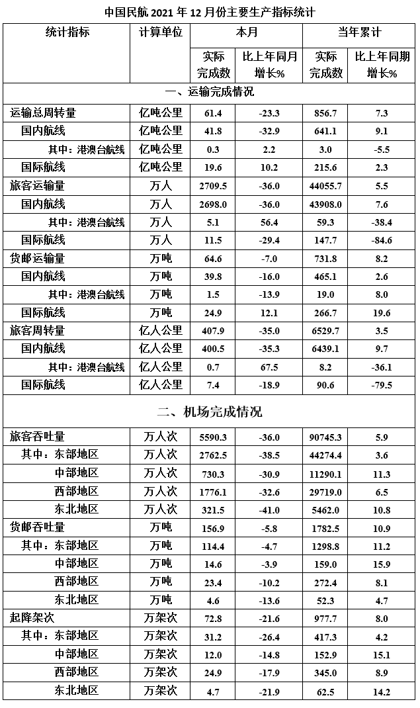

#### 第 1 题　qid 4808271 · 平均数

2021年12月货邮运输量比前11个月平均数约高百分之几？

- **A**. 4.5
- **B**. 5.5
- **C**. 6.5　✅
- **D**. 7.5

**答案**：C

**官方解析**

根据题干“······比······约高百分之几”，判定本题为一般增长率问题。定位表格材料可得：2021年，全年累计货邮运输量为731.8万吨，12月货邮运输量为64.6万吨。则前11个月货邮运输量的平均数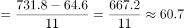万吨，根据公式：增长率，可得所求增长率，与C项最接近。

故正确答案为C。

---

#### 第 2 题　qid 4808276 · 比重

以下哪个项目2020年12月占全年比例最低？

- **A**. 运输总周转量国际航线
- **B**. 旅客运输量国际航线　✅
- **C**. 货邮运输量国内航线
- **D**. 旅客周转量港澳台航线

**答案**：B

**官方解析**

根据题干“······2020年12月占全年比例最低”，结合材料时间为2021年，可判定本题为基期比重问题。定位表格材料可得各项目2021年12月和全年的运输值及增长率。根据公式：基期比重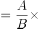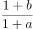，可得2020年12月运输总周转量国际航线占全年比例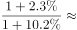；旅客运输量国际航线占全年比例；货邮运输量国内航线占全年比例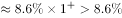；旅客周转量港澳台航线占全年比例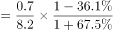。比较可得，2020年12月旅客运输量国际航线占全年比例最低。

故正确答案为B。

---

#### 第 3 题　qid 4808281 · 比重

旅客吞吐量、货邮吞吐量、起降架次分东部、中部、西部、东北地区共12项中，2021年12月数据占全年累计的比例超过的有多少个？

- **A**. 4　✅
- **B**. 5
- **C**. 6
- **D**. 7

**答案**：A

**官方解析**

根据题干“······2021年12月数据占全年累计的比例······”，可判定本题为现期比重问题。定位表格材料可得2021年12月及全年各地区的旅客吞吐量、货邮吞吐量、起降架次的完成数据。根据公式：比重，则12月数据占全年数据的比例大于，即12月数据×12＞全年数据。代入数据验证可得：旅客吞吐量东部地区为2762.5×12=33150＜44274.4；中部地区为；西部地区为；东北地区为321.5×12=3858＜5462.0。货邮吞吐量东部地区为；中部地区为；西部地区为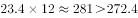；东北地区为。起降架次东部地区为；中部地区为12.0×12=144＜152.9；西部地区为；东北地区为。综上，只有四个地区的货邮吞吐量的2021年12月数据占全年累计数据的比例超过。

故正确答案为A。

---

#### 第 4 题　qid 4808286 · 比重

起降架次当年累计数东部地区占比，2021年比2020年：

- **A**. 低1个多点　✅
- **B**. 低3个多点
- **C**. 高1个多点
- **D**. 高3个多点

**答案**：A

**官方解析**

根据题干“······占比，2021年比2020年”，结合选项“低/高几个多点”，判定本题为两期比重问题。定位表格材料可得：2021年累计中国民航起降架次为977.7万架次（B），同比增长8.0%（b），其中累计东部地区起降架次为417.3万架次（A），同比增长4.2%（a）。根据公式：两期比重差，则所求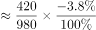，即低1个多点。

故正确答案为A。

---

#### 第 5 题　qid 4808291 · 综合

从上述资料中能够推出的是：

- **A**. 2021年12月的货邮吞吐量低于2021年全年平均数
- **B**. 港澳台航线旅客运输量2021年每个月比上年同月均有正增长
- **C**. 2021年国际航线旅客周转量比上年降低了不超过300亿人公里
- **D**. 2021年12月，西部地区旅客吞吐量、货邮吞吐量在全国占比低于起降架次在全国占比　✅

**答案**：D

**官方解析**

A项：定位表格材料可得：2021年12月中国民航货邮吞吐量为156.9万吨，全年累计货邮吞吐量为1782.5万吨。则2021年全年货邮吞吐量平均数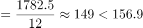，即12月货邮吞吐量高于全年平均数，错误；

B项：定位表格材料可得：2021年12月港澳台航线旅客运输量同比增长56.4%，全年同比下降38.4%。全年旅客运输量=1-11月旅客运输量+12月旅客运输量，根据混合增长率口诀“混合居中不正中”，可知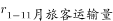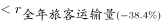，即1-11月旅客运输量同比下降，故其中一定有月份同比为负增长，错误；

C项：定位表格材料可得：2021年国际航线旅客周转量为90.6亿人公里，同比下降79.5%。根据公式：增长量，可得所求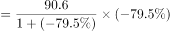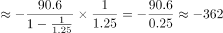亿人公里，即下降超过300亿人公里，错误；

D项：定位表格材料可得：2021年12月全国旅客吞吐量、货邮吞吐量和起降架次分别为5590.3万人次、156.9万吨和72.8万架次；西部地区分别为1776.1万人次、23.4万吨和24.9万架次。则2021年12月西部地区旅客吞吐量在全国占比；货邮吞吐量占比；起降架次占比，比较可得，起降架次占比最高，正确。

故正确答案为D。

---

### 材料 2

        2021年上半年，湖北省规模以上信息传输、软件和信息技术服务业（以下简称“规上信息软件业”）保持较快增长，推动全省规上服务业稳步发展。

        2021年上半年，湖北省676家规上信息软件业企业中营业收入前20的企业共实现营业收入355.46亿元，同比增长8.3%，拉动规上服务业营业收入增长1.1个百分点。

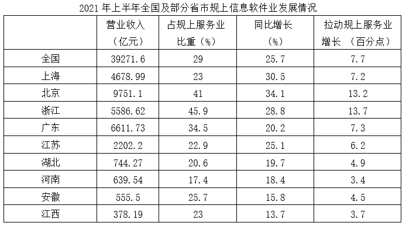

#### 第 6 题　qid 4808340 · 平均数

2021年上半年湖北省规上信息软件业中营业收入前20的企业，平均每家每月营业收入约为多少亿元？

- **A**. 1.18
- **B**. 2.25
- **C**. 2.32
- **D**. 2.96　✅

**答案**：D

**官方解析**

根据题干“2021年上半年······平均每家每月营业收入约为多少亿元”，结合材料时间为2021年上半年，可判定本题为现期平均数问题。定位文字材料第二段：2021年上半年，湖北省676家规上信息软件业企业中营业收入前20的企业共实现营业收入355.46亿元。则所求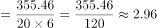亿元。

故正确答案为D。

---

#### 第 7 题　qid 4808342 · 比重

2020年上半年湖北省规上信息软件业主要细分行业营业收入中，应用软件开发占软件和信息技术服务业的比例比互联网其他信息服务占互联网和相关服务业的比例约低多少个百分点？

- **A**. 17
- **B**. 26
- **C**. 31　✅
- **D**. 45

**答案**：C

**官方解析**

根据题干“2020年上半年······比例比······低多少个百分点”，结合材料时间为2021年上半年，可判定本题为基期比重问题。定位表格材料：2021年上半年互联网和相关服务业、互联网其他信息服务营业收入分别为109.23亿元、89.51亿元，同比增速分别为23.5%、16.9%；软件和信息技术服务业、应用软件开发营业收入分别为329.91亿元、191.59亿元，同比增速分别为26.8%、33.2%。根据基期比重公式：，则2020年上半年所求比重差值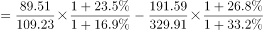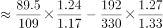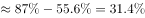，与C项最接近。

故正确答案为C。

---

#### 第 8 题　qid 4808344 · 比重

2021年上半年，湖北、河南、安徽、江西四省规上信息软件业营业收入占规上服务业比重由高到低的排名与拉动规上服务业增长由高到低的排名相同的有几个省份？

- **A**. 1　✅
- **B**. 2
- **C**. 3
- **D**. 4

**答案**：A

**官方解析**

定位表格材料可得，四省规上信息软件业营业收入占规上服务业比重分别为：湖北20.6%、河南17.4%、安徽25.7%、江西23%，拉动规上服务业增长分别为：湖北4.9%、河南3.4%、安徽4.5%、江西3.7%。比重排名由高到低分别为：安徽＞江西＞湖北＞河南，拉动增长排名由高到低分别为：湖北＞安徽＞江西＞河南，排名相同的有1个省份，河南均为第四名。
故正确答案为A。

---

#### 第 9 题　qid 4808347 · 综合

以下四组地区中，哪组2021年上半年规上服务业营业收入之差最小？

- **A**. 北京和上海
- **B**. 浙江和广东
- **C**. 河南和江西
- **D**. 湖北和安徽　✅

**答案**：D

**官方解析**

根据题干“······2021年上半年规上服务业营业收入······”，结合材料时间是2021年上半年，同时给出了各地区营业收入及其占规上服务业比重，可判定本题为现期比重问题。定位统计表2可知各地区2021年上半年营业收入及其占规上服务业比重，根据公式：整体，可知各选项分别为：

A项，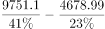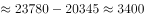亿元；

B项，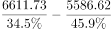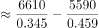亿元；

C项，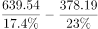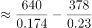亿元；

D项，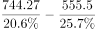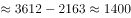亿元。

故正确答案为D。

---

#### 第 10 题　qid 4808350 · 综合

下列说法不正确的是：

- **A**. 2021年上半年，北京规上服务业营业收入占全国的比例比上海多5%以内
- **B**. 2020年上半年，江苏、湖北、河南、安徽、江西五省规上信息软件业企业营业收入之和比上海低　✅
- **C**. 2021年上半年湖北比河南规上信息软件业营业收入多，规上服务业营业收入少
- **D**. 2020年上半年湖北省规上信息软件业企业中营业收入前20的企业总营业收入，与2021年上半年湖北省规上信息软件业中软件和信息技术服务业营业收入的差在5亿元以内

**答案**：B

**官方解析**

A项：定位统计表2可知，全国的营业收入为39271.6亿元，占规上服务业营业收入比重为29%；北京的营业收入为9751.1亿元，占规上服务业营业收入比重为41%；上海的营业收入为4678.99亿元，占规上服务业营业收入比重为23%。根据公式：整体，可知全国的规上服务业营业收入亿元；北京的规上服务业营业收入比上海多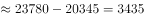亿元，则其占比较上海高约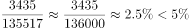，正确；

B项：定位统计表2可知，各省2021年上半年规上信息软件业企业营业收入及其同比增长率，根据公式：基期量，可以分别得到各省2020年上半年规上信息软件业企业营业收入如下：上海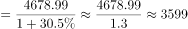亿元、江苏亿元、湖北亿元、河南亿元、安徽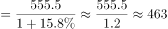亿元、江西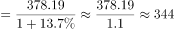亿元。1694+620+533+463+344=3654&gt;3599，即2020年上半年，江苏、湖北、河南、安徽、江西五省规上信息软件业企业营业收入之和高于上海，错误；

C项：定位统计表2可知，湖北2021年上半年规上信息软件业企业营业收入744.27亿元，占规上服务业营业收入比重为20.6%；河南2021年上半年规上信息软件业企业营业收入639.54亿元，占规上服务业营业收入比重为17.4%，则2021年上半年湖北比河南规上信息软件业营业收入多。根据公式：整体，可知2021年上半年湖北规上服务业营业收入与河南相比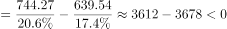，则2021年上半年湖北比河南规上服务业营业收入少，正确；

D项：定位文字资料可知，2021年上半年湖北省规上信息软件业企业中营业收入前20的企业营业收入为355.46亿元，同比增长8.3%；定位统计表1可知，2021年上半年湖北省规上信息软件业中软件和信息技术服务业营业收入为329.91亿元。根据公式：基期量，可知2020年上半年湖北省规上信息软件业企业中营业收入前20的企业营业收入亿元，与2021年上半年湖北省规上信息软件业中软件和信息技术服务业营业收入的差在5亿元以内，正确。

本题为选非题，故正确答案为B。

---

#### 第 11 题　qid 4808272 · 增长

去年某厂的电解镍出厂价格为15万元/吨。今年年初镍矿价格暴涨，因此该厂将电解镍的产能扩大了25%。假设今年和去年生产的产品都全部售出，利润率与出厂价格之比为常数，该厂为实现今年电解镍利润同比翻一番，请问今年该厂电解镍出厂价格为多少万元/吨？

- **A**. 

- **B**. 

- **C**. 

　✅
- **D**. 
20

**答案**：C

**官方解析**

设今年该厂电解镍出厂价格为x万元/吨，赋值去年产能为4，则今年产能为5，赋值去年总利润为20，则今年应实现的总利润为20×2=40。根据公式：利润率，可知去年利润率，今年利润率。根据“利润率与出厂价格之比为常数”，可列等式：，整理为：，，即今年该厂电解镍出厂价格为万元/吨。

故正确答案为C。

备注：本题出厂价格默认为成本价格，如将出厂价格当成销售价格则没有正确答案。

---
