# 2023年度浙江省党政机关选调应届优秀大学毕业生《行测》题（网友回忆版）

> 选调生 · 2023 年 · 5 个模块 · 共 50 题

- [政治理论](#%E6%94%BF%E6%B2%BB%E7%90%86%E8%AE%BA) · 2 题
- [常识判断](#%E5%B8%B8%E8%AF%86%E5%88%A4%E6%96%AD) · 8 题
- [数量关系](#%E6%95%B0%E9%87%8F%E5%85%B3%E7%B3%BB) · 15 题
- [判断推理](#%E5%88%A4%E6%96%AD%E6%8E%A8%E7%90%86) · 15 题
- [资料分析](#%E8%B5%84%E6%96%99%E5%88%86%E6%9E%90) · 10 题

---

## 政治理论

### 第 1 题　qid 5797229 · 时事政治

下列与党的二十大报告中“增进民生福祉，提高人民生活品质”的内容表述不一致的是：

- **A**. 提高劳动报酬在初次分配中的比重
- **B**. 推动基本医疗保险、失业保险、工伤保险全国统筹　✅
- **C**. 建立生育支持政策体系，降低生育、养育、教育成本
- **D**. 加快建立多主体供给、多渠道保障、租购并举的住房制度

**答案**：B

**官方解析**

本题考查政治常识。
A项正确，党的二十大报告中的“九、增进民生福祉，提高人民生活品质”部分指出：“（一）完善分配制度。分配制度是促进共同富裕的基础性制度。坚持按劳分配为主体、多种分配方式并存，构建初次分配、再分配、第三次分配协调配套的制度体系。努力提高居民收入在国民收入分配中的比重，提高劳动报酬在初次分配中的比重。”
B项错误，D项正确，党的二十大报告中的“九、增进民生福祉，提高人民生活品质”部分指出：“（三）健全社会保障体系。社会保障体系是人民生活的安全网和社会运行的稳定器。健全覆盖全民、统筹城乡、公平统一、安全规范、可持续的多层次社会保障体系。完善基本养老保险全国统筹制度，发展多层次、多支柱养老保险体系。实施渐进式延迟法定退休年龄。扩大社会保险覆盖面，健全基本养老、基本医疗保险筹资和待遇调整机制，推动基本医疗保险、失业保险、工伤保险省级统筹······坚持房子是用来住的、不是用来炒的定位，加快建立多主体供给、多渠道保障、租购并举的住房制度。”故“推动基本医疗保险、失业保险、工伤保险省级统筹”而不是“全国统筹”。
C项正确，党的二十大报告中的“九、增进民生福祉，提高人民生活品质”部分指出：“（四）推进健康中国建设。人民健康是民族昌盛和国家强盛的重要标志。把保障人民健康放在优先发展的战略位置，完善人民健康促进政策。优化人口发展战略，建立生育支持政策体系，降低生育、养育、教育成本。”
本题为选非题，故正确答案为B。

---

### 第 2 题　qid 5797213 · 时事政治

党的二十大报告指出，全面建设社会主义现代化国家，是一项伟大而艰巨的事业，前途光明，任重道远。前进道路上，必须牢牢把握5条重大原则，下列不属于这5条重大原则的是：

- **A**. 坚持以人民为中心的发展思想
- **B**. 坚持深化改革开放
- **C**. 坚持科教兴国人才强国　✅
- **D**. 坚持发扬斗争精神

**答案**：C

**官方解析**

本题考查政治常识。
C项错误，A、B、D三项正确，党的二十大报告中“三、新时代新征程中国共产党的使命任务”部分指出：“全面建设社会主义现代化国家，是一项伟大而艰巨的事业······前进道路上，必须牢牢把握以下重大原则。坚持和加强党的全面领导······坚持中国特色社会主义道路······坚持以人民为中心的发展思想······坚持深化改革开放······坚持发扬斗争精神。”
本题为选非题，故正确答案为C。

---

## 常识判断

### 第 1 题　qid 5797199 · 经济常识

2022年5月24日，国务院印发了《扎实稳住经济的一揽子政策措施》。下列不属于该文件提出的六个方面33项措施的有：
①继续推动实际贷款利率稳中有降
②降低地方政府专项债券发行规模
③加快推进重大外资项目积极吸引外商投资
④提高煤炭储备能力
⑤稳定增加汽车、家电等大宗消费

- **A**. 0项
- **B**. 1项　✅
- **C**. 2项
- **D**. 3项

**答案**：B

**官方解析**

本题考查政治常识。
①③④⑤正确，②错误，《扎实稳住经济的一揽子政策措施》包括六个方面33项措施。一是财政政策。进一步加大增值税留抵退税政策力度，预计新增留抵退税1420亿元，加快财政支出进度，加快地方政府专项债券发行使用并扩大支持范围，今年新增国家融资担保基金再担保合作业务规模1万亿元以上，加大稳岗支持和政府采购支持中小企业力度，扩大实施社保费缓缴政策。二是货币金融政策。鼓励对中小微企业和个体工商户、货车司机贷款及受疫情影响的个人住房与消费贷款等实施延期还本付息，加大普惠小微贷款支持力度，继续推动实际贷款利率稳中有降，提高资本市场融资效率，加大金融机构对基础设施建设和重大项目的支持力度。三是稳投资促消费等政策。加快推进一批论证成熟的水利工程项目，加快推动交通基础设施投资，继续推进城市地下综合管廊建设，稳定和扩大民间投资，促进平台经济规范健康发展，稳定增加汽车、家电等大宗消费。四是保粮食能源安全政策。健全完善粮食收益保障等政策，在确保安全清洁高效利用的前提下有序释放煤炭优质产能，抓紧推动实施一批能源项目，提高煤炭、原油等能源资源储备能力。五是保产业链供应链稳定政策。降低市场主体用水用电用网等成本，推动阶段性减免市场主体房屋租金，加大对民航等受疫情影响较大行业企业的纾困支持力度，优化企业复工达产政策，完善交通物流保通保畅政策，统筹加大对物流枢纽和物流企业的支持力度，加快推进重大外资项目积极吸引外商投资。六是保基本民生政策。实施住房公积金阶段性支持政策，完善农业转移人口和农村劳动力就业创业支持政策，完善社会民生兜底保障措施。
故不属于的有②，共1项。
本题为选非题，故正确答案为B。

---

### 第 2 题　qid 5797200 · 地理国情

2022年是香港回归祖国25周年。下列关于香港的说法不正确的是：

- **A**. 与南京、武汉的气候类型均相同
- **B**. 维多利亚港是世界三大天然良港之一
- **C**. 东方之珠、香洲、香江都是香港的别称　✅
- **D**. 最早记录香港这一地名的文献出自明代

**答案**：C

**官方解析**

本题考查地理国情。

A项正确，香港、南京、武汉的气候类型都是亚热带季风气候，亚热带季风气候出现在亚热带大陆东岸，纬度间，如中国秦岭—淮河以南，青藏高原以东，热带季风气候以北的地区。

B项正确，维多利亚港简称维港，是位于中华人民共和国香港特别行政区的香港岛和九龙半岛之间的海港，是世界三大天然良港之一。维多利亚港一直影响香港的历史和文化，主导中国香港的经济和旅游业发展，是中国香港成为国际化大都市的关键之一。

C项错误，香港特别行政区，简称“港”，全称中华人民共和国香港特别行政区，位于中国南部、珠江口以东，西与澳门隔海相望，北与深圳相邻，别名有香江、香岛、东方之珠等。香洲区，隶属于广东省珠海市，位于南海之滨、珠江口西岸。

D项正确，香港地区历史悠久，但“香港”作为地名出现在史籍中却比较晚。最早记载“香港”一名的文献是明朝万历年间郭棐所著的《粤大记》。该书所载《广东沿海图》中，标有香港及赤柱、黄泥涌、尖沙咀等地名。

本题为选非题，故正确答案为C。

---

### 第 3 题　qid 5797214 · 人文常识

2022年6月7日，我国首艘全国产化的百吨级无人艇在舟山海域顺利完成了首次海上自主航行试验。下列关于我国航空母舰的说法，正确的是：

- **A**. 山东舰和福建舰都属于大型航空母舰
- **B**. 我国三艘航空母舰的舷号分别为8、9、10
- **C**. 福建舰以常规动力驱动，采用了电磁弹射技术　✅
- **D**. 辽宁舰是我国第一艘完全自主设计、建造、配套的航空母舰

**答案**：C

**官方解析**

本题考查科技常识。
A项错误，大型航空母舰指排水量在6万吨以上的航空母舰。山东舰的标准排水量为5.9万吨，福建舰的标准排水量为8万吨，因此山东舰为中型航空母舰，而福建舰为大型航空母舰。
B、D两项错误，辽宁舰，舷号16，是中国人民解放军海军隶下的一艘可以搭载固定翼飞机的航空母舰，也是中国第一艘服役的航空母舰；山东舰，舷号17，是中国第一艘完全自主设计、自主建造、自主配套的国产航空母舰；福建舰，舷号18，是中国完全自主设计建造的首艘弹射型航空母舰。
C项正确，福建舰是中国完全自主设计建造的首艘弹射型航空母舰，配置电磁弹射和阻拦装置。电磁弹射直接利用电力能更准确地调控输出功率，有利于针对不同型号和任务的飞机进行精确加速。福建舰采用的是常规动力，而不是核动力，因为核动力航母研制的成本高，技术难，而且核动力航母在作战的时候，即便防护得很好，一旦出现核泄漏，对周边环境威胁也非常大。
故正确答案为C。

---

### 第 4 题　qid 5797217 · 经济常识

下列国务院组成部门与职责对应正确的是:

- **A**. 财政部——制定和执行货币政策、信贷政策
- **B**. 交通运输部——承担公路、水路建设市场监管责任　✅
- **C**. 自然资源部——负责监督管理国家减排目标的落实
- **D**. 民政部——统筹推进建立覆盖城乡的多层次社会保障体系

**答案**：B

**官方解析**

本题考查管理常识。
A项错误，中国人民银行简称央行，中国人民银行主要职责为：······（三）制定和执行货币政策、信贷政策，完善货币政策调控体系，负责宏观审慎管理······财政部的主要职责为：（一）拟订财税发展战略、规划、政策和改革方案并组织实施。分析预测宏观经济形势，参与制定宏观经济政策，提出运用财税政策实施宏观调控和综合平衡社会财力的建议。拟订中央与地方、国家与企业的分配政策，完善鼓励公益事业发展的财税政策······
B项正确，交通运输部的职责为：······（六）承担公路、水路建设市场监管责任······
C项错误，生态环境部的职责为：······（三）负责监督管理国家减排目标的落实······自然资源部的主要职责与自然资源的调查监测评价、确权登记、合理开发利用等相关。
D项错误，人力资源和社会保障部门的主要职责为：······（四）统筹推进建立覆盖城乡的多层次社会保障体系······民政部门的保障职责主要为：······（三）拟订社会救助政策、标准，统筹社会救助体系建设，负责城乡居民最低生活保障、特困人员救助供养、临时救助、生活无着流浪乞讨人员救助工作······（十）拟订儿童福利、孤弃儿童保障、儿童收养、儿童救助保护政策、标准，健全农村留守儿童关爱服务体系和困境儿童保障制度······
故正确答案为B。

---

### 第 5 题　qid 5797239 · 人文常识

我国于2020年实施首次火星探测任务，下列有关说法不正确的是：

- **A**. 火星在我国古代称为启明星　✅
- **B**. 火星属于类地行星，比地球小
- **C**. 我国火星探测将一次性实现“绕、落、巡”三大任务
- **D**. 从地球视角看，火星和地球的会合周期大约是26个月

**答案**：A

**官方解析**

本题考查科技常识。
A项错误，B项正确，火星是距离太阳第四近的行星，也是太阳系中仅次于水星的第二小的行星，为太阳系里四颗类地行星之一。古汉语中则因为它荧荧如火，位置和亮度时常变动而称之为荧惑。金星在中国古代被称为太白金星，清晨在东方天空出现被称为“启明星”，晚间在西方天空出现被称为“长庚星”或“昏星”。
C项正确，2020年4月，中国国家航天局明确计划通过长征五号遥四运载火箭发射“天问一号”探测器。天问一号由一部轨道飞行器和一辆火星车构成。天问一号火星探测任务要一次性完成“绕、落、巡”三大任务。
D项正确，从地球视角看，火星和地球的会合周期大约是26个月，即每隔26个月两颗行星互相接近一次，出现一次“宝贵”的火星探测发射窗口期。
本题为选非题，故正确答案为A。

---

### 第 6 题　qid 5797258 · 人文常识

下列诗句与其所涉及的历史人物，对应不正确的是：

- **A**. 博浪椎挥四海惊，虎狼虽暴已无秦——张良
- **B**. 三顾频烦天下计，两朝开济老臣心——诸葛亮
- **C**. 东风不与周郎便，铜雀春深锁二乔——周瑜
- **D**. 来孙却见九州同，家祭如何告乃翁——岳飞　✅

**答案**：D

**官方解析**

本题考查人文常识。
A项正确，“博浪椎挥四海惊，虎狼虽暴已无秦”出自宋代徐钧的《张良》，意思是博浪椎指挥四海震惊，虎狼虽暴虐已经没有秦国，诗句前半句指的是张良在博浪沙刺杀秦始皇一事。涉及的是张良。
B项正确，“三顾频烦天下计，两朝开济老臣心”出自唐代杜甫的《蜀相》，意思是定夺天下先主曾三顾茅庐拜访，辅佐两朝开国与继业忠诚满腔。涉及的是诸葛亮。
C项正确，“东风不与周郎便，铜雀春深锁二乔”出自唐代杜牧的《赤壁》，意思是假如东风不给周瑜以方便，结局恐怕是曹操取胜，二乔被关进铜雀台了。涉及的是周瑜。
D项错误，“来孙却见九州同，家祭如何告乃翁”出自宋代林景熙的《书陆放翁诗卷后》，意思是陆游啊，你的后辈虽然见到了九州一统，可统治者是胡虏，在家祭时怎么开口禀告你这泉下的老翁？涉及的是陆游而不是岳飞。
本题为选非题，故正确答案为D。

---

### 第 7 题　qid 5797260 · 人文常识

中国古代有七十二候之说，以五日为候，三候为气，各候均与一个物候现象对应。下列不属于二十四节气中“大暑”物候的是：

- **A**. 大雨时行
- **B**. 土润溽暑
- **C**. 鸿雁来宾　✅
- **D**. 腐草为萤

**答案**：C

**官方解析**

本题考查人文常识。
A、B、D三项正确，C项错误，大暑三候为：一候腐草为萤；二候土润溽暑；三候大雨时行。一侯是说每到大暑时节，由于气温偏高又有雨水，细菌容易滋生，许多枯死的植物潮湿腐化，到了夜晚，经常可以看到萤火虫在腐草败叶上飞来飞去寻找食物。二侯是说土壤高温潮湿，很适宜水稻等喜水作物的生长。三候是说在这雨热同季的潮热天气，天空中随时都会形成雨水落下。鸿雁来宾是寒露三候之一。
本题为选非题，故正确答案为C。

---

### 第 8 题　qid 5797262 · 人文常识

钱塘江最早见名于《山海经》，因流经古钱塘县（今杭州）而得名，是吴越文化的主要发源地之一。关于钱塘江，下列说法不正确的是：

- **A**. 京杭大运河经过钱塘江
- **B**. 钱塘江的河口呈喇叭形
- **C**. 江潮的形成与天体引力和地球自转有关
- **D**. “山随平野尽，江入大荒流”中的“江”是指钱塘江　✅

**答案**：D

**官方解析**

本题考查地理国情。
A项正确，京杭大运河始建于春秋时期，是世界上里程最长、工程最大的古代运河。大运河南起余杭（今杭州），北到涿郡（今北京），途经今浙江、江苏、山东、河北四省及天津、北京两市，贯通海河、黄河、淮河、长江、钱塘江五大水系。
B项正确，钱塘江河口是典型的河口湾，平面外形呈喇叭形，河口区上自潮区界芦茨埠，下至杭州湾口，全长274km。
C项正确，钱塘江大潮形成的原因是天体引力和地球自转的离心作用，加上杭州湾钱塘江喇叭口的特殊地形所造成的特大涌潮。
D项错误，“山随平野尽，江入大荒流”出自唐代李白的《渡荆门送别》，意思是山随着平坦广阔的原野的出现逐渐消失，江水在一望无际的原野中奔流。该诗句里的“江”指的是长江。
本题为选非题，故正确答案为D。

---

## 数量关系

### 第 1 题　qid 5801959 · 数学运算

某网店促销活动中，原价为25元/瓶的洗发水按50元/3瓶出售。理发店以促销价购买了若干瓶洗发水，比按原价购买节约了200元。那么理发店购买了多少瓶洗发水？

- **A**. 18
- **B**. 21
- **C**. 24　✅
- **D**. 27

**答案**：C

**官方解析**

设理发店购买了x瓶洗发水，根据以促销价购买洗发水比按原价购买节约了200元，可列式：，解得x=24。

故正确答案为C。

---

### 第 2 题　qid 5801965 · 数学运算

甲、乙合作完成一项工程，甲的效率是乙的1.5倍。工程开始后，甲先单独工作5天，接着乙单独工作10天，剩余工作还需合作5天完成。如果这项工程全程由甲、乙合作完成，需要多少天？

- **A**. 10
- **B**. 12　✅
- **C**. 15
- **D**. 18

**答案**：B

**官方解析**

赋值乙的效率为2，则甲的效率为2×1.5=3。根据题意，可得工程总量为5×3+10×2+5×（2+3）=60。则这项工程全程由甲、乙合作完成需要天。

故正确答案为B。

---

### 第 3 题　qid 5801974 · 数学运算

小王阅读一本小说，每天均阅读偶数页，前3天共阅读了34页，且第一天、第二天和第三天阅读的页数分别为5的倍数、4的倍数和3的倍数。那前3天他阅读页数最多的一天最多可能阅读了多少页？

- **A**. 16
- **B**. 18
- **C**. 20　✅
- **D**. 24

**答案**：C

**官方解析**

小王每天均阅读偶数页且第一天、第二天和第三天阅读的页数分别为5的倍数、4的倍数和3的倍数，则小王第一天、第二天和第三天阅读的页数应分别为2×5=10的倍数、4的倍数和2×3=6的倍数。细分情况较多，考虑从多到少代入进行验证：
D项：小王阅读页数最多的一天最多阅读了24页，这一天可能是第二天，则第一天和第三天共阅读了34-24=10页，无法满足第一天、第三天阅读的页数分别为5的倍数、3的倍数；这一天可能是第三天，则第一天和第二天共阅读了34-24=10页，无法满足第一天、第二天阅读的页数分别为5的倍数、4的倍数，不符合题意，排除；
C项：小王阅读页数最多的一天最多阅读了20页，这一天可能是第一天，则第二天和第三天共阅读了34-20=14页，当第二天阅读8页、第三天阅读6页时总和恰为14页，符合题意，当选。
因本题所问为阅读页数最多的一天最多可能阅读了多少页，所以无需再验证其他答案。
故正确答案为C。

---

### 第 4 题　qid 5801971 · 数学运算

某角色对战游戏的规则如下：对战双方依次轮流进攻，造成的伤害为进攻方攻击能力减去防御方防御能力且最少伤害为0；生命值先降至0或更低则失败。已知你控制的角色“生命值100，攻击能力10，防御能力10”，那么下面哪个角色你无法战胜？

- **A**. 生命值90，攻击能力16，防御能力5　✅
- **B**. 生命值5，攻击能力150，防御能力0
- **C**. 生命值100，攻击能力21，防御能力0
- **D**. 生命值144，攻击能力12，防御能力7

**答案**：A

**官方解析**

代入各选项，依次进行验证：

A项：我的角色每次进攻对其造成的伤害为10-5=5，需次进攻可将其战胜；对方角色每次对我的角色进攻造成的伤害为16-10=6，生命值，需17次进攻可战胜我的角色。18&gt;17，则我的角色无法战胜该角色，当选。

故正确答案为A。

备注：对其他选项进行代入验证如下。

B项：我的角色每次进攻对其造成的伤害为10-0=10，，需1次进攻可将其战胜；对方角色每次对我的角色进攻造成的伤害为150-10=140，，需1次进攻可战胜我的角色。若我的角色先攻击则可战胜该角色；

C项：我的角色每次进攻对其造成的伤害为10-0=10，需次进攻可将其战胜；对方角色每次对我的角色进攻造成的伤害为21-10=11，生命值，需10次进攻可战胜我的角色。若我的角色先攻击则可战胜该角色；

D项：我的角色每次进攻对其造成的伤害为10-7=3，需次进攻可将其战胜；对方角色每次对我的角色进攻造成的伤害为12-10=2，需次进攻可战胜我的角色。48&lt;50，则我的角色可战胜该角色。

---

### 第 5 题　qid 5801967 · 数学运算

甲从A地，乙从B地同时出发相向而行。甲、乙速度之比为4：3，两人第一次相遇在C处后继续前行，甲到B处、乙到A处后立即返回，两人第二次相遇在D处。已知C、D两地相距20km，那么A、B两地的距离为：

- **A**. 56km
- **B**. 60km
- **C**. 63km
- **D**. 70km　✅

**答案**：D

**官方解析**

甲、乙速度之比为4：3，根据时间相等时，路程和速度成正比，可知AC：BC=4：3。设AC、BC长度分别为4S、3S，BD=BC+CD=3S+20km。两人从第一次相遇到第二次相遇所走路程为第一次相遇所走路程的2倍，则第一次相遇到第二次相遇，甲所走路程为BC+BD=2AC，即3S+3S+20=2×4S，解得S=10km。A、B两地的距离为4S+3S=70km。

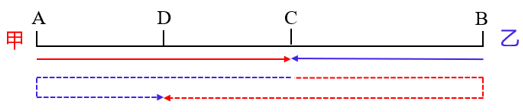

故正确答案为D。

---

### 第 6 题　qid 5801999 · 数学运算

A、B、C3个志愿队分别下乡帮扶，A队每隔5天去一次，B队每8天去一次，C队每隔6天去一次，3个队伍周四第一次同时下乡，那么第二次同时下乡后A队周几再去？

- **A**. 周三　✅
- **B**. 周四
- **C**. 周五
- **D**. 周六

**答案**：A

**官方解析**

A队每隔5天去一次，即每6天去一次；B队每8天去一次；C队每隔6天去一次，即每7天去一次，3个队伍下乡周期的最小公倍数为168，即每168天3个队伍相遇一次。3个队伍周四第一次同时下乡，经过周再次相遇，即第二次同时下乡的日期为周四，之后A队间隔5天再去，即周三。

故正确答案为A。

---

### 第 7 题　qid 5801981 · 数学运算

某个小镇的道路如下图所示，其中标注的数字表示经过该条道路所需的时间（单位：分钟）。已知只能向上、左两个方向前进，那么从右下角A点到左上角B点至少需要多少分钟？

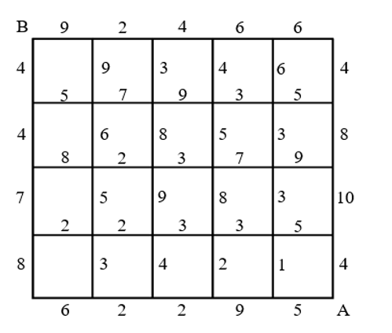

- **A**. 28
- **B**. 31　✅
- **C**. 34
- **D**. 37

**答案**：B

**官方解析**

因为只能向上、左两个方向前进，则从右下角A点到左上角B点需要向上走4条道路，向左走5条道路。要想花费时间最短，则向上走的道路和向左走的道路所需时间均应尽量短。观察可知，向左走的道路中所需时间最短的5条依次为5分钟、3分钟、3分钟、2分钟、2分钟，此路径中向上走的道路所需时间依次为1分钟、7分钟、4分钟、4分钟，如图，最短花费时间=5+1+3+3+2+2+7+4+4=31分钟。

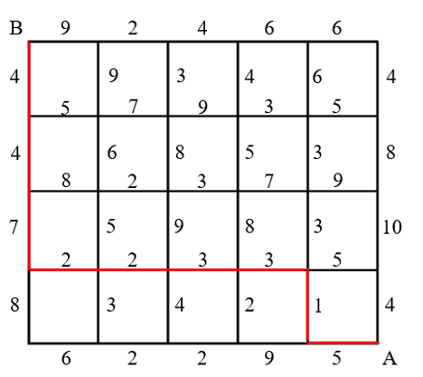

故正确答案为B。

---

### 第 8 题　qid 5801979 · 数学运算

某网球比赛是五局三胜制。甲乙两球员在彼此对战中单局胜率分别为57%和43%。如果甲先胜了前两局，那么甲最后获胜的概率：

- **A**. 70%以下
- **B**. 70%~80%
- **C**. 80%~90%
- **D**. 90%以上　✅

**答案**：D

**官方解析**

方法一：根据比赛是五局三胜制，且甲先胜了前两局，分情况讨论如下：

（1）甲第三局胜，概率=57%；

（2）乙第三局胜，甲第四局胜，概率=43%×57%=24.51%；

（3）乙第三局、第四局胜，甲第五局胜，概率。

则甲最后获胜的概率=57%+24.51%+10.54%=92.05%，在D项范围内。

方法二：正面情况较多，从反面考虑。反面情况为乙最后获胜，即后面三局均为乙胜，概率，则甲最后获胜的概率=1-反面概率=1-7.95%=92.05%，在D项范围内。

故正确答案为D。

---

### 第 9 题　qid 5801977 · 数学运算

木块和塑料块的质量均为30克，如果将木块和氦气球绑在一起，称得的重量刚好是绑在氢气球上的塑料块称得的重量的1.5倍，而把氢气球、氦气球都绑在塑料块上，称得的重量正好是15克。那么把木块、塑料块和氦气球绑在一起时称得的重量是多少克？

- **A**. 45
- **B**. 48
- **C**. 54
- **D**. 57　✅

**答案**：D

**官方解析**

受浮力影响，设氦气球可使所称重量下降x克，氢气球可使所称重量下降y克。则木块和氦气球绑在一起称得的重量为（30-x）克，绑在氢气球上的塑料块称得的重量为（30-y）克，结合题意可列式：30-x=1.5（30-y），整理可得1.5y-x=15······①；把氢气球、氦气球都绑在塑料块上，称得的重量为30-y-x=15克，整理可得x+y=15······②，联立①②两式，解得x=3。因此，把木块、塑料块和氦气球绑在一起时称得的重量是30+30-3=57克。
故正确答案为D。

---

### 第 10 题　qid 5802017 · 数学运算

某工厂去年生产某种产品每月盈利20万元。今年1月、2月车间设备升级改造，期间没有盈利且每月额外投入5万元。如果升级改造后，其他成本不变，那么今年3月起，每月盈利比去年提高多少，才能保证今年的总盈利比去年提高10%？

- **A**. 25%
- **B**. 31%
- **C**. 37%　✅
- **D**. 42%

**答案**：C

**官方解析**

设今年3月起，该工厂每月盈利比去年提高x，能保证今年的总盈利比去年提高10%。根据今年还剩12-2=10个月，结合题意可列式：，解得x=37%。

故正确答案为C。

---

### 第 11 题　qid 5801993 · 数学运算

甲、乙两车同时出发匀速从A地前往B地，甲车的速度是乙车的1.5倍。1小时后，甲车因故需要原速返回A地，之后立即提速重新匀速前往B地。已知甲车返回A地时乙车行驶了全程的，甲车比乙车晚30分钟到达B地，那么甲车第二次前往B地的速度是第一次的多少倍？

- **A**. 

　✅
- **B**. 

- **C**. 

- **D**. 

**答案**：A

**官方解析**

设乙车的速度为x，甲车第一次前往B地的速度为1.5x，从A地到B地全程距离为S。根据“1小时后，甲车因故需要原速返回A地”，可得甲车从出发到返回A地用时1×2=2小时，即乙车用时2小时行驶了全程的，即，则S=3x，乙车到达B地用时小时，根据“甲车比乙车晚30分钟到达B地”，可得甲车到达B地用时3.5小时，则甲车第二次前往B地用时3.5小时-2小时=1.5小时，第二次前往B地的速度，所求倍。

故正确答案为A。

---

### 第 12 题　qid 5802007 · 数学运算

兄弟姐妹四人年龄各不相同，大哥和小妹的年龄之和正好是三弟年龄的两倍，大哥和二姐年龄之和比三弟和小妹年龄之和的两倍大2岁，三弟15岁。那么二姐最大多少岁？

- **A**. 18
- **B**. 19
- **C**. 20　✅
- **D**. 21

**答案**：C

**官方解析**

年龄问题，考虑用代入排除法解题，由于求最大，则从大到小依次代入，设大哥、小妹的年龄分别为x岁、y岁。

代入D项：二姐为21岁，则有：x+y=2×15······①，x+21=（15+y）×2+2······②，联立①②，解得、，年龄应为整数，不满足题意，排除；

代入C项：二姐为20岁，则有：x+y=2×15······①，x+20=（15+y）×2+2······②，联立①②，解得x=24、y=6，即大哥、二姐、三弟、小妹的年龄分别为24岁、20岁、15岁、6岁，满足题干所有条件，当选。

故正确答案为C。

---

### 第 13 题　qid 5802064 · 数学运算

3个正方体骰子一起掷，如果朝上的点数都不相同，则计2分：如果朝上的点数有且仅有两个相同，则计3分；如果三个都相同，则计5分。那么连掷两次，共得5分的概率为多少？

- **A**. 

- **B**. 

- **C**. 

　✅
- **D**. 

**答案**：C

**官方解析**

根据题意可知，每掷1个正方体骰子，点数可以为1、2、3、4、5、6，共6种可能，则3个正方体骰子一起掷，连掷两次，总的情况数有种。由于朝上的点数都不相同、朝上的点数有且仅有两个相同、三个都相同包含了连掷两次的所有可能性，故若想共得5分，则满足条件的情况有两种：①第一次得2分、第二次得3分；②第一次得3分、第二次得2分。得2分的情况数有种；得3分时需先从3个骰子中选2个令其点数相同，再从6个点数中选2个，有种，满足条件的情况数有种，所求。

故正确答案为C。

---

### 第 14 题　qid 5802074 · 数学运算

单排队列有5个人，现重新安排他们的位置，要保证至少有1个人的位置与原来不同，且至少有两个原来相邻的人位置不变。那么共有多少种不同的安排法？

- **A**. 11
- **B**. 14
- **C**. 17　✅
- **D**. 18

**答案**：C

**官方解析**

假设队列中的5个人分别为甲、乙、丙、丁、戊，根据题意可知，若要保证至少有1个人的位置与原来不同，且至少有两个原来相邻的人位置不变，则分情况讨论如下：

（1）3个人的位置与原来不同，有种情况；其余2个原来相邻的人位置不变，可以为甲乙、乙丙、丙丁、丁戊位置不变，有4种情况，共有2×4=8种情况；

（2）2个人的位置与原来不同，先从5个人中选2个人，有种情况；除选出来的两人为乙丁，使没有人相邻这1种情况外，均可保证2个或3个原来相邻的人位置不变，共有10-1=9种情况。

综上可知，共有8+9=17种安排法。

故正确答案为C。

---

### 第 15 题　qid 5802069 · 数学运算

如果某个月1号为周一，则该月哪天是周几就可以很快计算出来。那么一年最多能有多少个这样的月份?

- **A**. 2
- **B**. 3　✅
- **C**. 4
- **D**. 5

**答案**：B

**官方解析**

根据每个大月（1月、3月、5月、7月、8月、10月、12月）有31天，，即每经过一个大月，星期数加3；每个小月（4月，6月，9月，11月）有30天，，即每经过一个小月，星期数加2；平年2月有28天，，即每经过一个平年2月，星期数不变；闰年2月有29天，，即每经过一个闰年2月，星期数加1。假设1月1号星期数为N，分情况讨论如下：

（1）若该年为平年，则每个月份1号的星期数情况可列表如下：

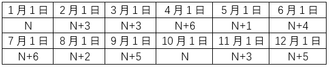

则该年中每月1号出现最多的相同星期数为N+3，有2月、3月、11月共3个月，若这3个月1号均为周一，则题目所求情况最多有3个月。

（2）若该年为闰年，则每个月份1号的星期数情况可列表如下：

则该年中每月1号出现最多的相同星期数为N，有1月、4月、7月共3个月，若这3个月1号均为周一，则题目所求情况最多有3个月。

综上可知，一年最多能有3个1号为周一的月份。

故正确答案为B。

---

## 判断推理

### 第 1 题　qid 5797289 · 类比推理

白雪：雪白

- **A**. 爱心：心爱
- **B**. 金黄：黄金
- **C**. 刷牙：牙刷
- **D**. 名著：著名　✅

**答案**：D

**官方解析**

第一步：判断题干词语间逻辑关系。
白雪是雪白的，二者为属性对应关系。
第二步：判断选项词语间逻辑关系。
A项：爱心与心爱没有明显的逻辑关系，与题干逻辑关系不一致，排除；
B项：黄金是金黄的，二者为属性对应关系，但顺序与题干相反，与题干逻辑关系不一致，排除；
C项：刷牙需要使用牙刷，二者为工具对应关系，与题干逻辑关系不一致，排除；
D项：名著是著名的，二者为属性对应关系，与题干逻辑关系一致，当选。
故正确答案为D。

---

### 第 2 题　qid 5797306 · 类比推理

儿童玩具：益智玩具

- **A**. 航母舰队：潜艇舰队
- **B**. 艺术雕塑：宗教雕塑
- **C**. 女式西装：通勤西装　✅
- **D**. 医用棉签：化妆棉签

**答案**：C

**官方解析**

第一步：判断题干词语间逻辑关系。
有的儿童玩具是益智玩具，有的儿童玩具不是益智玩具，有的益智玩具是儿童玩具，有的益智玩具不是儿童玩具，二者为交叉关系。
第二步：判断选项词语间逻辑关系。
A项：航母舰队和潜艇舰队是两种不同的海上舰队，二者为并列关系，与题干逻辑关系不一致，排除；
B项：艺术雕塑从题材上可以分为纪念性雕塑、城市园林雕塑、宗教雕塑、陈列性雕塑等形式。宗教雕塑属于艺术雕塑，二者为种属关系，与题干逻辑关系不一致，排除；
C项：有的女式西装是通勤西装，有的女式西装不是通勤西装，有的通勤西装是女式西装，有的通勤西装不是女式西装，二者为交叉关系，与题干逻辑关系一致，当选；
D项：医用棉签和化妆棉签是两种不同用途的棉签，二者为并列关系，与题干逻辑关系不一致，排除。
故正确答案为C。

---

### 第 3 题　qid 5797314 · 类比推理

维生素：人体：蛋白质

- **A**. 质子：原子：电子　✅
- **B**. 病人：医院：病房
- **C**. 软件：手机：应用
- **D**. 气囊：汽车：油门

**答案**：A

**官方解析**

第一步：判断题干词语间逻辑关系。
维生素和蛋白质均是人体生存的必要物质，第一词和第三词均与第二词构成必要条件的对应关系。
第二步：判断选项词语间逻辑关系。
A项：质子和电子均是形成原子的必要物质，第一词和第三词均与第二词构成必要条件的对应关系，与题干逻辑关系一致，当选；
B项：病房指病人居住的房间，病房是医院的组成部分，但有的小型的医院（比如社区医院）就没有病房，因此病房不是医院的必要组成部分，与题干逻辑关系不一致，排除；
C项：软件和应用均为手机的组成部分，第一词和第三词均与第二词构成组成关系，但软件不是手机的必要组成部分，如非智能手机中不需要手机软件，与题干逻辑关系不一致，排除；
D项：气囊和油门均为汽车的组成部分，第一词和第三词均与第二词构成组成关系，但气囊不是汽车的必要组成部分，与题干逻辑关系不一致，排除。
故正确答案为A。

---

### 第 4 题　qid 5797315 · 类比推理

地震：山体滑坡：交通堵塞

- **A**. 政策支持：求贤若渴：人才引进
- **B**. 酒后驾车：交通事故：人员伤亡　✅
- **C**. 自助洗车：技术革新：经济发展
- **D**. 免费食品：人满为患：管理不当

**答案**：B

**官方解析**

第一步：判断题干词语间逻辑关系。
地震会导致山体滑坡，山体滑坡会导致交通堵塞，三者构成因果对应关系。
第二步：判断选项词语间逻辑关系。
A项：求贤若渴指慕求贤才，有如口渴急于饮水，因为求贤若渴所以进行人才引进，二者构成因果对应关系；人才引进的时候需要政策支持，二者构成对应关系，与题干逻辑关系不一致，排除；
B项：酒后驾车会导致交通事故，交通事故会导致人员伤亡，三者构成因果对应关系，与题干逻辑关系一致，当选；
C项：自助洗车是一种技术革新，二者构成种属关系；技术革新会带来经济发展，二者构成对应关系，与题干逻辑关系不一致，排除；
D项：免费食品会吸引顾客从而导致人满为患，管理不当也会导致人满为患，第一个词和第三个词均与第二个词构成因果对应关系，与题干逻辑关系不一致，排除。
故正确答案为B。

---

### 第 5 题　qid 5797357 · 类比推理

（    ）对于 保险 相当于 航天飞机 对于 (    )

- **A**. 银行  空间站
- **B**. 股票  燃料
- **C**. 医保  航天器　✅
- **D**. 理财  卫星

**答案**：C

**官方解析**

逐一代入选项。
A项：银行是保险公司销售保险产品的一种渠道，二者构成对应关系；航天飞机是指能单独进行航天活动，也能往返于地面和空间站之间运送人员或物资、设备的航天器，空间站是一种在近地轨道长时间运行、可供多名航天员巡访、长期工作和生活的载人航天器，二者都是航天器，构成并列关系，前后逻辑关系不一致，排除；
B项：股票和保险无明显逻辑关系；航天飞机需要使用燃料，二者构成对应关系，前后逻辑关系不一致，排除；
C项：医保是一种保险，二者构成种属关系；航天飞机是一种航天器，二者构成种属关系，前后逻辑关系一致，当选；
D项：通过保险可以进行理财，二者构成方式目的的对应关系；卫星是指在围绕一颗行星轨道并按闭合轨道做周期性运行的天然天体，人造卫星一般亦可称为卫星，其可以搭载航天飞机发射到太空，二者不构成方式目的的对应关系，前后逻辑关系不一致，排除。
故正确答案为C。

---

### 第 6 题　qid 5797381 · 图形推理

从所给的四个选项中，选择最合适的一个填入问号处，使之呈现一定的规律性：

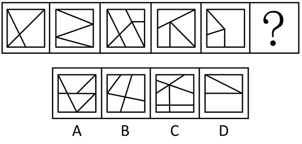

- **A**. A
- **B**. B
- **C**. C
- **D**. D　✅

**答案**：D

**官方解析**

元素组成不同，且无明显属性规律，考虑数量规律。观察发现，题干每幅图都存在直线相交且出现明显的直角，优先考虑数直角数。题干图形直角数分别为1、2、3、4、5，故？处图形的直角数应为6，只有D项符合。
故正确答案为D。

---

### 第 7 题　qid 5797404 · 图形推理

从所给的四个选项中，选择最合适的一个填入问号处，使之呈现一定的规律性：

- **A**. A
- **B**. B
- **C**. C　✅
- **D**. D

**答案**：C

**官方解析**

元素组成不同，且无明显属性规律，考虑数量规律。观察发现，题干图形封闭面较多，可优先考虑面数量，但整体数面无规律。继续观察发现，题干图形存在多个封闭面相交，均为“多圆相切”的变形图，考虑笔画数，题干图形均为一笔画图形，故？处应选择一个一笔画图形，只有C项符合。
故正确答案为C。

---

### 第 8 题　qid 5797387 · 图形推理

从所给的四个选项中，选择最合适的一个填入问号处，使之呈现一定的规律性：

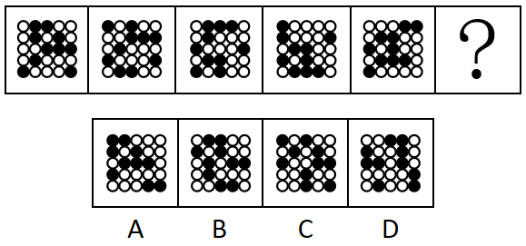

- **A**. A　✅
- **B**. B
- **C**. C
- **D**. D

**答案**：A

**官方解析**

元素组成相同，优先考虑位置规律。题干图形中黑球较多，单独看不易发现规律，考虑相邻比较。观察发现，从图一至图五，前一幅图中每行的黑球均整体向上平移一行（循环走），平移到第一行时均再向左平移一格（循环走），即可得到后一幅图。故？处图形应符合上述规律，如下图所示，只有A项符合。

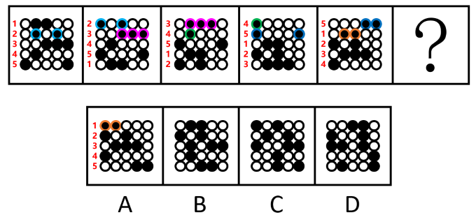

故正确答案为A。

---

### 第 9 题　qid 5797408 · 图形推理

把下面的六个图形分为两类，使每一类都有各自的共同特征或规律，分类正确的一项是：

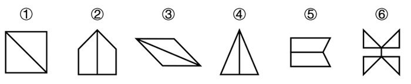

- **A**. ①②③，④⑤⑥
- **B**. ①③⑤，②④⑥
- **C**. ①②⑥，③④⑤
- **D**. ①③⑥，②④⑤　✅

**答案**：D

**官方解析**

本题为分组分类题目。元素组成不同，优先考虑属性规律。观察发现，题干出现多个“等腰”图形，考虑对称性。图①③⑥均为既轴对称又中心对称图形，图②④⑤均为轴对称图形。即图①③⑥为一组，图②④⑤为一组。
故正确答案为D。

---

### 第 10 题　qid 5797484 · 图形推理

左边给定的是多面体的外表面展开图，右边哪一项能由它折叠而成?

- **A**. A
- **B**. B　✅
- **C**. C
- **D**. D

**答案**：B

**官方解析**

将原展开图标上序号，如下图所示，逐一进行分析。

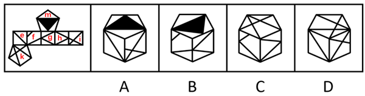

A项：选项由面e、面i和面m构成，展开图中面e和面i的公共边为展开图左右两端的两条边，且公共边挨着面i中较大的三角形，而选项中面e和面i的公共边没有挨着面i中较大的三角形，选项与题干展开图不一致，排除；

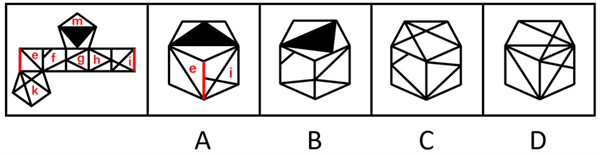

B项：选项由面f、面g和面m构成，选项与题干展开图一致，当选；

C项：选项中左侧面为无中生有面，选项与题干展开图不一致，排除；

D项：选项由面e、面i和面k构成，展开图中面e和面k的公共边挨着面k中的等腰三角形，而选项中面e与面k的公共边没有挨着面k中的等腰三角形，选项与题干展开图不一致，排除。

故正确答案为B。

---

### 第 11 题　qid 5797450 · 逻辑判断

妈妈对小明说：“除非你好好学习，否则你考不上理想的大学。”小明说：“那我好好学习，一定能考上北大。”
下列选项中所犯逻辑错误与上述推理最为相似的是:

- **A**. 总管：“如果你继续玩忽职守，你就等着被辞退吧。”小王：“小李每天摸鱼，为什么没被辞退？”
- **B**. 爸爸：“你只有勤于动笔，日积月累，才能写出好的文章。”小红：“太好了，我每天写随笔，就能写出好文章来啦。”　✅
- **C**. 小赵：“面对机遇，要有勇于面对的勇气，否则机会就会溜走。”小张：“只有勇气还不够，还需要前期做好充足的准备。”
- **D**. 赵大妈：“社区新建的广场真不错，空间大，设备多。”李大爷：“是啊，没有党的好政策，我们也过不上这么好的生活。”

**答案**：B

**官方解析**

第一步：分析题干。

题干两人的对话可以翻译为：

妈妈：考上理想的大学好好学习；

小明：好好学习考上北大（考上理想的大学）。

小明所犯的逻辑错误为：肯后推肯前。

第二步：逐一分析选项。

A项：翻译为：总管：继续玩忽职守被辞退；小王：每天摸鱼（每天玩忽职守） 且 被辞退，小王的回答与总管的话是矛盾关系，与题干所犯的逻辑错误不同，排除；

B项：翻译为：爸爸：写出好文章勤于动笔；小红：每天写随笔（勤于动笔）写出好文章，小红所犯的逻辑错误为：肯后推肯前，与题干所犯的逻辑错误相同，当选；

C项：翻译为：小赵：机会溜走有面对机遇的勇气；小张：有面对机遇的勇气 且 前期做好充足的准备，小张的回答只涉及肯后，未涉及肯前，与题干所犯的逻辑错误不同，排除；

D项：翻译为：赵大妈：社区广场空间大 且 设备多；李大爷：党的好政策过上好生活，李大爷的回答不是肯后推肯前，与题干所犯的逻辑错误不同，排除。

故正确答案为B。

---

### 第 12 题　qid 5797430 · 逻辑判断

甲、乙、丙3人去看画展，看到一幅画。甲说：“这不是莫奈画的，也不是梵高画的。”乙说：“这不是莫奈画的，而是达芬奇画的。”丙说：“这不是达芬奇画的，而是莫奈画的。”画展管理员说：“三人中，一个人的判断都对；一个人的判断都错；一个人的判断一对一错。”由此可知：

- **A**. 这幅画是莫奈画的　✅
- **B**. 这幅画是梵高画的
- **C**. 这幅画是达芬奇画的
- **D**. 不是上述三位画家画的

**答案**：A

**官方解析**

第一步：分析题干条件。

（1）甲：莫奈，梵高；

（2）乙：莫奈，达芬奇；

（3）丙：达芬奇，莫奈；

（4）一个人的判断都对；一个人的判断都错；一个人的判断一对一错。

第二步：根据题干条件进行推理。

代入A项：若这幅画是莫奈画的，则甲一对一错，乙全错，丙全对，符合要求，当选；

代入B项：若这幅画是梵高画的，则甲、乙、丙均为一对一错，与条件（4）矛盾，排除；

代入C项：若这幅画是达芬奇画的，则甲和乙均为全对，丙全错，与条件（4）矛盾，排除；

代入D项：若不是上述三位画家画的，则甲全对，乙和丙均为一对一错，与条件（4）矛盾，排除。

故正确答案为A。

---

### 第 13 题　qid 5797458 · 逻辑判断

营养协会发布的膳食指南告诉我们，减肥需要成年人减少从食物和饮料中获得的热量，并通过体育活动消耗更多热量。这种体重管理方法是基于具有百年历史的“能量平衡模型”，该模型指出，体重增加是由于摄入的能量多于消耗的能量。因此，暴饮暴食正在推动肥胖症的流行。
以下哪项如果为真，最能质疑上述观点?

- **A**. 低碳饮食的减肥效果比低脂饮食明显
- **B**. 部分青少年每天摄入1000卡路里的食物，是因为生长突增导致饥饿和暴饮暴食
- **C**. 几十年来公共卫生信息鼓励人们少吃多运动，但肥胖和肥胖相关疾病的发病率却稳步上升
- **D**. 多碳水化合物的现代饮食结构从根本上改变我们的新陈代谢，导致脂肪储存、体重增加和肥胖　✅

**答案**：D

**官方解析**

第一步：找出论点和论据。
论点：暴饮暴食正在推动肥胖症的流行。
论据：体重增加是由于摄入的能量多于消耗的能量。
本题论点和论据均在讨论肥胖与食物摄入量的关系，论点论据话题一致，削弱优先考虑削弱论点，且论点存在因果关系，可以考虑因果倒置和他因削弱。
第二步：逐一分析选项。
A项：该项说的是低碳饮食的减肥效果比低脂饮食明显，而论点说的是暴饮暴食是肥胖的原因，话题不一致，无法削弱，排除；
B项：该项说的是部分青少年因为生长突增导致饥饿和暴饮暴食，但没有明确是否会导致肥胖，不明确选项，无法削弱，排除；
C项：该项说的是即便鼓励人们少吃多运动，但肥胖和肥胖相关疾病的发病率却稳步上升，而论点说的是暴饮暴食是肥胖的原因，话题不一致，无法削弱，排除；
D项：论点说“暴饮暴食”推动肥胖症流行，选项说“多碳水的饮食结构”导致了肥胖，即是“多碳水”推动了肥胖症流行，直接否定了题干论点，可以削弱，当选。
故正确答案为D。

---

### 第 14 题　qid 5797433 · 逻辑判断

某城市为解决市中心乱停车的问题，出台了提高市中心公共车位停车费的政策，以此“赶”长期占用市中心公共车位的私家车，让真正有停车需求的市民能把车停进公共车位，不再乱停车。政策推出一个月后，市中心乱停车的问题并未得到缓解，反而更加严重了。
以下哪项如果为真，最能解释上述现象？

- **A**. 该市的机动车保有量和停车位数量和去年同期基本持平
- **B**. 该市近期利用市中心的闲置地块修建了多处临时停车场
- **C**. 停车费升幅较大，市民宁愿乱停车也不愿意停在公共车位　✅
- **D**. 市中心公共车位数量过少，无法满足全市市民的停车需求

**答案**：C

**官方解析**

第一步：找出题干矛盾。
某城市出台了提高市中心公共车位停车费的政策，政策推出一个月后，市中心乱停车的问题并未得到缓解，反而更加严重了。
第二步：逐一分析选项。
A项：该项说明机动车保有量和停车位数量与去年相比基本没有变化，但是不能解释为什么该市出台政策后乱停车的问题反而更加严重了，不能解释题干矛盾，排除；
B项：该项说明停车场变多了，但是不能解释为什么该市出台政策后乱停车的问题反而更加严重了，不能解释题干矛盾，排除；
C项：该项指出正是因为停车费的升幅较大，所以市民宁愿乱停车也不愿意停在公共车位，可以解释为什么该市出台政策后乱停车的问题反而更加严重了，可以解释题干矛盾，当选；
D项：该项指出市民乱停车的原因是公共车位较少，但是不能解释为什么该市出台政策后乱停车的问题反而更加严重了，不能解释题干矛盾，排除。
故正确答案为C。

---

### 第 15 题　qid 5797468 · 逻辑判断

小刘发现袋子里的米有一部分已经发霉，打算放在通风处晾晒一下继续煮食，小李急忙制止：“已经霉变的大米不能再吃了，否则会严重危害健康！”小刘笑着回应道：“没事，这些米只要晾一晾、晒一晒，就变得跟新米一样了。”
以下哪项如果为真，最能说服小刘？

- **A**. 经过阳光曝晒的大米会逐渐流失水分，影响食用口感
- **B**. 刚刚变质的大米，及时摊晾、通风、加盐淘洗后可以食用
- **C**. 霉变后的大米会滋生毒性极强的黄曲霉素，食用后会致癌
- **D**. 发霉大米中的霉菌毒素耐高温，晾晒和烹饪均不能将其裂解　✅

**答案**：D

**官方解析**

第一步：找出论点和论据。
论点：已经霉变的大米只要晾一晾、晒一晒，就变得跟新米一样了，不会严重危害健康。
论据：无。
本题提问方式为“说服”小刘，即对小刘的观点进行削弱，故小刘的观点为论点，前面小李的话与小刘的观点相反，且本题只有论点，没有论据，削弱优先考虑否定论点，即霉变的大米经过晾晒也无法变成新米，也会严重危害健康。
第二步：逐一分析选项。
A项：讨论的是经过阳光曝晒的大米会流失水分，影响食用口感，而题干讨论的是霉变后经过晾晒的大米是否会影响健康，为无关项，无法削弱，排除；
B项：讨论的是“刚刚变质的大米”，而题干讨论的是“已经霉变的大米”，主体不一致，且该项只是说可以食用，并未提及是否会影响健康，无法削弱，排除；
C项：讨论的是霉变后的大米食用后会致癌，但并未明确说明这些大米经过晾晒后是否仍会影响健康，为不明确项，无法削弱，排除；
D项：直接指出发霉大米中的霉菌毒素耐高温，晾晒和烹饪均不能将其裂解，说明发霉的大米即使经过晾晒也会影响健康，削弱论点，可以削弱，当选。
故正确答案为D。

---

## 资料分析

### 材料 1

        2020年，J省城镇新增就业46.17万人，完成全年计划的124.8%；城镇失业人员再就业17.67万人，完成全年计划的147.3%；就业困难人员就业4.67万人，完成全年计划的155.6%；新增转移农村劳动力58.86万人，完成全年计划的117.7%，其中省内新增转移40.41万人，完成全年计划的115.5%。

        2020年，J省新增发放创业担保贷款192.7亿元，同比增长24.4%，完成全年计划的175.2%，其中直接扶持个人创业149.37亿元，同比增长23.1%，完成全年计划的226.3%。通过创业担保贷款直接扶持个人创业13.78万人次，同比增长25.3%，带动就业51.43万人次。到期贷款回收率达99.95%，高于全年计划。2020年企业职工岗位技能培训73.52万人，完成全年计划的408.5%；创业培训16.66万人，完成全年计划的138.8%。

        到2020年底，J省城镇职工基本养老保险、城乡居民基本养老保险、失业保险和工伤保险参保人数达4095.49万人，比上年末增加280.56万人。参加城镇职工基本养老保险1167.42万人，比上年增加70.52万人，完成全年计划的108.6%。参加城乡居民基本养老保险2077.99万人，比上年增加189.1万人，完成全年计划的115.4%。参加失业保险292.1万人，比上年增加2.42万人，完成全年计划的100.7%。参加工伤保险557.98万人，比上年增加18.55万人，完成全年计划的104.3%，全年享受工伤保险待遇人数4.67万人，比上年增加0.51万人，建筑业新开工项目工伤保险参保率为100%，实现全覆盖。2020年，J省城镇职工基本养老险、城乡居民基本养老保险、失业保险、工伤保险基金收入分别为1072.26亿元、130.58亿元、13.89亿元、15.21亿元；基金累计结余分别为724.02亿元、305.36亿元、68.6亿元、53.19亿元。

#### 第 1 题　qid 5802084 · 综合

2020年，J省城镇失业人员再就业全年计划人数约是就业困难人员就业全年计划人数的多少倍？

- **A**. 3.8
- **B**. 4.0　✅
- **C**. 4.2
- **D**. 4.4

**答案**：B

**官方解析**

根据题干“2020年······是······的多少倍”，可以判定本题为现期倍数问题。定位文字材料第一段可得：2020年，J省城镇失业人员再就业17.67万人，完成全年计划的147.3%；就业困难人员就业4.67万人，完成全年计划的155.6%。则所求倍数倍。

故正确答案为B。

---

#### 第 2 题　qid 5802085 · 增长

2020年，J省新增发放创业担保贷款约比上年增长了多少亿元？

- **A**. 37.8　✅
- **B**. 39.6
- **C**. 41.2
- **D**. 43.5

**答案**：A

**官方解析**

根据题干“2020年······比上年增长了多少亿元”，可以判定本题为增长量计算问题。定位文字材料第二段可得：2020年，J省新增发放创业担保贷款192.7亿元，同比增长24.4％。根据公式：增长量，可得所求亿元，与A项最为接近。

故正确答案为A。

---

#### 第 3 题　qid 5802087 · 平均数

2020年，J省通过创业担保贷款直接扶持个人创业平均每人次获得的创业担保贷款比上年同期：

- **A**. 高不到3000元
- **B**. 高3000元以上
- **C**. 低不到3000元　✅
- **D**. 低3000元以上

**答案**：C

**官方解析**

根据题干“2020年······平均每······比上年同期”，结合选项带单位，可以判定本题为平均数的增长量问题。定位文字材料第二段可得：2020年，J省新增发放创业担保贷款······其中直接扶持个人创业149.37亿元（A），同比增长23.1%（a）······通过创业担保贷款直接扶持个人创业13.78万人次（B），同比增长25.3%（b）。根据公式：平均数的增长量，则平均每人次获得的创业担保贷款增长量元，即低不到3000元。

故正确答案为C。

---

#### 第 4 题　qid 5802088 · 增长

到2020年底，J省四种保险的参保人数同比增速最快的是：

- **A**. 失业保险
- **B**. 工伤保险
- **C**. 城镇职工基本养老保险
- **D**. 城乡居民基本养老保险　✅

**答案**：D

**官方解析**

根据题干“到2020年底······同比增速最快的是”，可以判定本题为一般增长率比较问题。定位文字材料第三段可得：到2020年底，参加城镇职工基本养老保险1167.42万人，比上年增加70.52万人；参加城乡居民基本养老保险2077.99万人，比上年增加189.1万人；参加失业保险292.1万人，比上年增加2.42万人；参加工伤保险557.98万人，比上年增加18.55万人。根据公式：增长率，可得各项增长率分别为：

A项；

B项；

C项；

D项。

比较可得，城乡居民基本养老保险的同比增速最快。

故正确答案为D。

---

#### 第 5 题　qid 5802089 · 综合

能够从上述资料中推出的是：

- **A**. 到2020年底，J省四种保险参保总人数同比增速超过5%　✅
- **B**. 2020年，J省全年计划企业职工岗位技能培训超过20万人
- **C**. 2020年，J省四种保险基金支出最大的是城镇职工基本养老保险
- **D**. 2020年，J省省内新增转移农村劳动力占新增转移农村劳动力的比重超过70%

**答案**：A

**官方解析**

A项：定位文字材料第三段可得，到2020年底，J省城镇职工基本养老保险、城乡居民基本养老保险、失业保险和工伤保险参保人数达4095.49万人，比上年末增加280.56万人。根据公式：增长率，可得所求增速，正确；

B项：定位文字材料第二段可得，2020年企业职工岗位技能培训73.52万人，完成全年计划的408.5％。则2020年J省全年计划企业职工岗位技能培训人数万人&lt;20万人，错误；

C项：定位文字材料第三段可得，材料中只给出了2020年J省四种保险基金的收入和累计结余，并没有给出2020年的支出，故无法判断J省各险种2020年支出的大小，错误；

D项：定位文字材料第一段可得，2020年新增转移农村劳动力58.86万人······其中省内新增转移40.41万人。根据公式：比重，可得所求，错误。

故正确答案为A。

---

### 材料 2

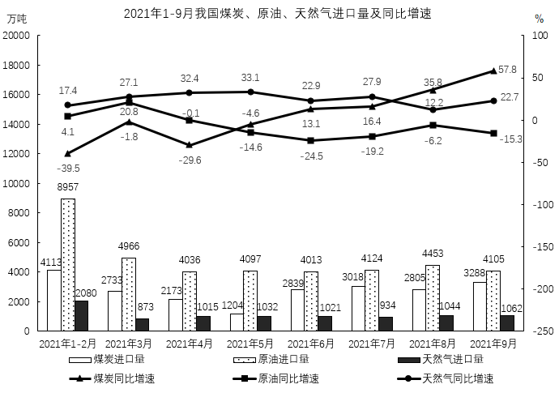

#### 第 6 题　qid 5802111 · 综合

2021年上半年，我国日均进口天然气约为：

- **A**. 33万吨　✅
- **B**. 35万吨
- **C**. 37万吨
- **D**. 39万吨

**答案**：A

**官方解析**

根据题干“2021年上半年，我国日均进口天然气约为”，可判定本题为现期平均数问题。定位统计图可得：2021年1-2月、3月、4月、5月、6月我国天然气进口量分别为2080万吨、873万吨、1015万吨、1032万吨、1021万吨。则所求平均数万吨。

故正确答案为A。

---

#### 第 7 题　qid 5802113 · 综合

2020年3-9月，我国进口原油最多的月份是：

- **A**. 3月
- **B**. 6月　✅
- **C**. 7月
- **D**. 9月

**答案**：B

**官方解析**

根据题干“2020年3-9月，我国进口原油最多的月份是”，结合材料时间为2021年1-9月，可判定本题为基期比较问题。定位统计图可得：2021年3月，我国原油进口量为4966万吨，同比增长20.8%；6月为4013万吨，同比增长-24.5%；7月为4124万吨，同比增长-19.2%；9月为4105万吨，同比增长-15.3%。根据公式：基期量，可得2020年3月原油进口量万吨；2020年6月原油进口量万吨；2020年7月原油进口量万吨；2020年9月原油进口量万吨。比较可知，2020年3-9月，我国进口原油最多的月份是6月。

故正确答案为B。

---

#### 第 8 题　qid 5802114 · 增长

2021年三季度，我国煤炭进口总量同比增长约为：

- **A**. 35%　✅
- **B**. 40%
- **C**. 45%
- **D**. 50%

**答案**：A

**官方解析**

根据题干“2021年三季度······同比增长约为”，可判定本题为一般增长率问题。定位统计图可得：2021年7月，我国煤炭进口量为3018万吨，同比增长16.4%，8月为2805万吨，同比增长35.8%，9月为3288万吨，同比增长57.8%。根据公式：基期量，可得2020年7月煤炭进口量万吨；2020年8月煤炭进口量万吨；2020年9月煤炭进口量万吨。根据公式：增长率，可得2021年三季度，我国煤炭进口总量同比增长率。

故正确答案为A。

注：考场思维可运用混合增长率求解，2021年7月、8月、9月煤炭进口量之比为，则所求增长率，最接近A项。

---

#### 第 9 题　qid 5802118 · 增长

2021年二、三季度，我国原油、天然气进口量均环比增加的月份个数有：

- **A**. 2个　✅
- **B**. 3个
- **C**. 4个
- **D**. 5个

**答案**：A

**官方解析**

定位统计图可得：2021年3-9月，我国原油进口量分别为：4966、4036、4097、4013、4124、4453、4105万吨，则2021年二、三季度，当月原油进口量大于上月进口量的月份有：5月、7月、8月；2021年3-9月，我国天然气进口量分别为873、1015、1032、1021、934、1044、1062万吨，则2021年二、三季度，当月天然气进口量大于上月进口量的月份有：4月、5月、8月、9月。通过比较可知，2021年二、三季度，我国原油、天然气进口量均环比增加的月份为5月、8月，共2个。
故正确答案为A。

---

#### 第 10 题　qid 5802136 · 综合

下列饼图中，能准确表示2021年1-9月我国煤炭（黑）、原油（白）、天然气（灰）进口总量构成的是：

- **A**. 

- **B**. 

- **C**. 

　✅
- **D**. 

**答案**：C

**官方解析**

根据题干“下列饼图中，能准确表示2021年1-9月······进口总量构成的是”，可判定本题为现期比重问题。定位统计图可得：2021年1-2月、3月、4月、5月、6月、7月、8月、9月原油进口量均大于对应月份的煤炭进口量或天然气进口量，即2021年1-9月原油进口总量（白）应为最大。且通过观察统计图可知，2021年1-9月原油进口总量＞2021年1-9月煤炭进口总量+2021年1-9月天然气进口总量，故2021年1-9月原油进口总量占比（白）＞50%，只有C项符合。
故正确答案为C。

---
