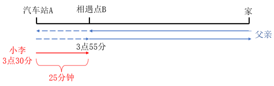
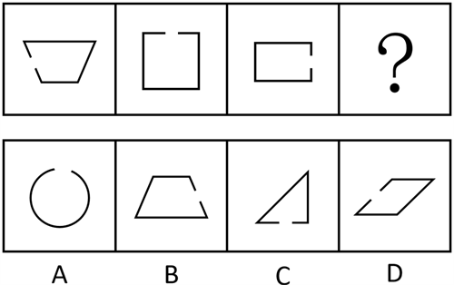
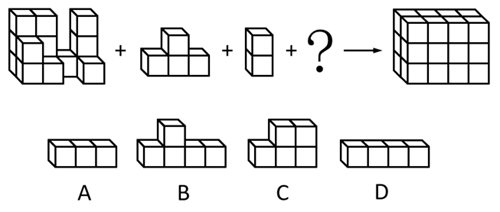
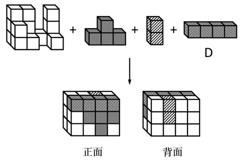
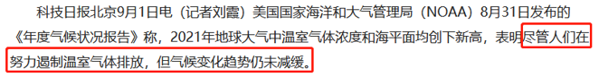
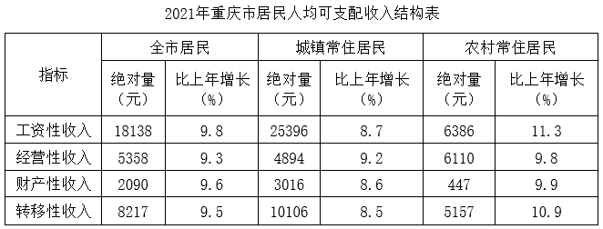

# 2023年重庆市选调优秀大学生到基层工作考试《行测》题

> 选调生 · 2023 年 · 6 个模块 · 共 100 题

- [政治理论](#%E6%94%BF%E6%B2%BB%E7%90%86%E8%AE%BA) · 5 题
- [常识判断](#%E5%B8%B8%E8%AF%86%E5%88%A4%E6%96%AD) · 15 题
- [言语理解与表达](#%E8%A8%80%E8%AF%AD%E7%90%86%E8%A7%A3%E4%B8%8E%E8%A1%A8%E8%BE%BE) · 30 题
- [数量关系](#%E6%95%B0%E9%87%8F%E5%85%B3%E7%B3%BB) · 10 题
- [判断推理](#%E5%88%A4%E6%96%AD%E6%8E%A8%E7%90%86) · 30 题
- [资料分析](#%E8%B5%84%E6%96%99%E5%88%86%E6%9E%90) · 10 题

---

## 政治理论

### 第 1 题　qid 17058600 · 新思想

下列不符合习近平总书记关于“正确认识和把握中长期经济社会发展重大问题”叙述的是（    ）。

- **A**. 以深化科技体制改革来激发新发展活力　✅
- **B**. 要以畅通国民经济循环为主构建新发展格局
- **C**. 要以辩证思维看待新发展阶段的新机遇新挑战
- **D**. 要以高水平对外开放打造国际合作和竞争新优势

**答案**：A

**官方解析**

本题考查政治常识。
2021年1月16日出版的第2期《求是》杂志发表了中共中央总书记、国家主席、中央军委主席习近平的重要文章《正确认识和把握中长期经济社会发展重大问题》。
A项错误，文章中指出：“第四，以深化改革激发新发展活力。改革是解放和发展社会生产力的关键，是推动国家发展的根本动力。”
B项正确，文章中指出：“第二，以畅通国民经济循环为主构建新发展格局。今年以来，我多次讲，要推动形成以国内大循环为主体、国内国际双循环相互促进的新发展格局。”
C项正确，文章中指出：“第一，以辩证思维看待新发展阶段的新机遇新挑战。党的十九大以来，我多次讲，当今世界正经历百年未有之大变局。当前，新冠肺炎疫情全球大流行使这个大变局加速变化，保护主义、单边主义上升，世界经济低迷，全球产业链供应链因非经济因素而面临冲击，国际经济、科技、文化、安全、政治等格局都在发生深刻调整，世界进入动荡变革期。”
D项正确，文章中指出：“第五，以高水平对外开放打造国际合作和竞争新优势。当前，国际社会对经济全球化前景有不少担忧。我们认为，国际经济联通和交往仍是世界经济发展的客观要求。”
本题为选非题，故正确答案为A。

---

### 第 2 题　qid 17058602 · 时事政治

习近平总书记在党的十九届四中全会上指出，确保十九届四中全会精神贯彻落实主要抓好3件事。下列不属于这3件事的是（    ）。

- **A**. 严格遵守和执行制度
- **B**. 抓好新时代干部队伍建设　✅
- **C**. 毫不动摇坚持和巩固中国特色社会主义制度
- **D**. 与时俱进完善和发展中国特色社会主义制度和国家治理体系

**答案**：B

**官方解析**

本题考查政治常识。
A项正确，习近平在十九届四中全会第二次全体会议上的讲话中指出：“第三，严格遵守和执行制度。制度的生命力在于执行。有的人对制度缺乏敬畏，根本不按照制度行事，甚至随意更改制度；有的人千方百计钻制度空子、打擦边球；有的人不敢也不愿遵守制度，甚至极力逃避制度的监管，等等。因此，必须强化制度执行力，加强对制度执行的监督。”
B项错误，“抓好新时代干部队伍建设”不属于习近平总书记指出的确保十九届四中全会精神贯彻落实主要抓好的3件事。
C项正确，习近平在十九届四中全会第二次全体会议上的讲话中指出：“第一，毫不动摇坚持和巩固中国特色社会主义制度。中国特色社会主义制度是一个严密完整的科学制度体系，起四梁八柱作用的是根本制度、基本制度、重要制度，其中具有统领地位的是党的领导制度。”
D项正确，习近平在十九届四中全会第二次全体会议上的讲话中指出：“第二，与时俱进完善和发展中国特色社会主义制度和国家治理体系。‘万物得其本者生，百事得其道者成。’随着中国特色社会主义进入新时代，我国发展处于新的历史方位······”
本题为选非题，故正确答案为B。

---

### 第 3 题　qid 17058601 · 新思想

《中国共产党第十九届中央委员会第六次全体会议公报》指出，中国共产党领导人民创造了新民主主义革命的伟大成就，不仅成立了中华人民共和国，实现了民族独立、人民解放，而且实现了“四个彻底”。下列关于“四个彻底”说法错误的是（    ）。

- **A**. 彻底改变了经济世界　✅
- **B**. 彻底结束了旧中国半殖民地半封建社会的历史
- **C**. 彻底结束了极少数剥削者统治广大劳动人民的历史
- **D**. 彻底废除了列强强加给中国的不平等条约和帝国主义在中国的一切特权

**答案**：A

**官方解析**

本题考查政治常识。
A项错误，B、C、D三项正确，《中国共产党第十九届中央委员会第六次全体会议公报》中指出：“党领导人民浴血奋战、百折不挠，创造了新民主主义革命的伟大成就，成立中华人民共和国，实现民族独立、人民解放，彻底结束了旧中国半殖民地半封建社会的历史，彻底结束了极少数剥削者统治广大劳动人民的历史，彻底结束了旧中国一盘散沙的局面，彻底废除了列强强加给中国的不平等条约和帝国主义在中国的一切特权，实现了中国从几千年封建专制政治向人民民主的伟大飞跃，也极大改变了世界政治格局，鼓舞了全世界被压迫民族和被压迫人民争取解放的斗争。”
本题为选非题，故正确答案为A。

---

### 第 4 题　qid 17058604 · 时事政治

习近平总书记在2022年7月召开的中央统战工作会议上明确指出，做好新时代党的统一战线工作，必须处理好“四大关系”。下列不属于“四大关系”的是（    ）。

- **A**. 潜绩和显绩的关系
- **B**. 民生和团结的关系　✅
- **C**. 原则性和灵活性的关系
- **D**. 固守圆心和扩大共识的关系

**答案**：B

**官方解析**

本题考查政治常识。
A、C、D三项正确，B项错误，习近平总书记在2022年7月召开的中央统战工作会议上明确指出，做好新时代党的统一战线工作，要把握好固守圆心和扩大共识的关系，不断增进共识，真正把不同党派、不同民族、不同阶层、不同群体、不同信仰以及生活在不同社会制度下的全体中华儿女都团结起来。要把握好潜绩和显绩的关系，坚持正确政绩观，推动党的统战事业行稳致远。要把握好原则性和灵活性的关系，善于把方针政策的原则性和对策举措的灵活性结合起来，既站稳政治立场、坚守政治底线，又具体问题具体分析，注重工作方式方法。要把握好团结和斗争的关系，又要善于斗争、增强斗争本领，努力形成牢不可破的真团结。
本题为选非题，故正确答案为B。

---

### 第 5 题　qid 17058618 · 时事政治

2022年4月，习近平总书记在博鳌亚洲论坛开幕式上发表《携手迎接挑战，合作开创未来》的主旨演讲。下列符合演讲主旨的说法有几项？
①共同守护人类生命健康，各国要相互支持，完善全球公共卫生治理
②共同促进经济复苏，坚持建设开放型世界经济，促进全球平衡、协调、包容发展
③共同维护世界和平安宁，坚持共同、综合、合作、可持续的安全观，共同维护世界和平和安全
④共同应对全球治理挑战，践行共商共建共享的全球治理观，弘扬全人类共同价值，倡导不同文明交流互鉴

- **A**. 1
- **B**. 2
- **C**. 3
- **D**. 4　✅

**答案**：D

**官方解析**

本题考查政治常识。
①正确，习近平总书记指出，我们要共同守护人类生命健康。人民生命安全和身体健康是人类发展进步的前提。人类彻底战胜新冠肺炎疫情还需付出艰苦努力。各国要相互支持，加强防疫措施协调，完善全球公共卫生治理，形成应对疫情的强大国际合力。
②正确，习近平总书记指出，我们要共同促进经济复苏。我们要坚持建设开放型世界经济，把握经济全球化发展大势，加强宏观政策协调，运用科技增强动能，维护全球产业链供应链稳定，防止一些国家政策调整产生严重负面外溢效应，促进全球平衡、协调、包容发展。
③正确，习近平总书记指出，我们要共同维护世界和平安宁。为了促进世界安危与共，中方愿在此提出全球安全倡议：我们要坚持共同、综合、合作、可持续的安全观，共同维护世界和平和安全。
④正确，习近平总书记指出，我们要共同应对全球治理挑战。我们要践行共商共建共享的全球治理观，弘扬全人类共同价值，倡导不同文明交流互鉴。
故①②③④表述正确，共4项。
故正确答案为D。

---

## 常识判断

### 第 1 题　qid 17058608 · 经济常识

区域全面经济伙伴关系协定（RCEP）于2022年1月1日生效。下列关于区域全面经济伙伴关系协定（RCEP）说法正确的是（    ）。
①协定的生效实施，标志着全球人口最多、经贸规模最大、最具发展潜力的自由贸易区正式落地
②协定体现了各方共同维护双边主义和自由贸易，促进区域经济一体化的信心和决心
③协定生效后，共有10个成员国正式开始实施此协定
④协定生效后，将推进贸易投资自由化、便利化，将其打造成为东南亚经贸合作大通道

- **A**. ①②
- **B**. ①③　✅
- **C**. ②④
- **D**. ③④

**答案**：B

**官方解析**

本题考查政治常识。
①正确，2022年1月1日，《区域全面经济伙伴关系协定》（RCEP）正式生效，标志着全球人口最多、经贸规模最大、最具发展潜力的自由贸易区正式落地。
②错误，RCEP如期生效，充分体现了各方共同维护多边主义和自由贸易、促进区域经济一体化的信心和决心，将为区域乃至全球贸易投资增长、经济复苏和繁荣发展作出重要贡献。
③正确，2022年1月1日，《区域全面经济伙伴关系协定》（RCEP）正式生效，文莱、柬埔寨、老挝、新加坡、泰国、越南等6个东盟成员国和中国、日本、新西兰、澳大利亚等4个非东盟成员国正式开始实施协定。
④错误，协议生效后，中国将与RCEP成员方一道，积极参与和支持RCEP机制建设，为RCEP经济技术合作作出贡献，共同推动提高协定的整体实施水平，持续提升区域贸易投资自由化便利化，将RCEP打造成为东亚经贸合作主平台。
故①③表述正确。
故正确答案为B。

---

### 第 2 题　qid 17058606 · 人文常识

下列关于《三国演义》中出现的古地名与现在所在省份对成错误的是（    ）。

- **A**. 诸葛亮火烧新野——河南
- **B**. 武侯显圣定军山——湖北　✅
- **C**. 邓士载偷渡阴平——甘肃
- **D**. 曹操平定汉中地——陕西

**答案**：B

**官方解析**

本题考查人文常识。
A项正确，“诸葛亮火烧新野”出自《三国演义》第四十回。诸葛亮第一把火烧博望坡，夏侯惇大败，曹操便亲自领兵伐新野（今河南省南阳市新野县）。刘备放弃了新野，到樊城以避曹军。曹操的部将曹仁领的兵到新野，见城门洞开，城中无人，便引军进城中驻扎。夜来时分，就被火烧了。
B项错误，“武侯显圣定军山”出自《三国演义》第一百一十六回。魏将钟会率大军伐蜀，途径定军山时，诸葛亮之灵显圣，告诫钟会勿乱杀无辜。钟会敬畏之下，立誓保国安民，所到之处秋毫无犯，汉中百姓亦出城相迎。定军山，在今陕西汉中勉县城南十里的诸葛村，属巴山支脉。
C项正确，“邓士载偷渡阴平”出自《三国演义》第一百一十七回。偷渡阴平是三国末期，曹魏灭蜀汉之战中的一次决定性的军事行动。邓艾偷渡阴平，成功杀入蜀汉腹地，立下了灭亡蜀汉的首功。阴平，在剑门关以北（现今甘肃省文县境内）。
D项正确，“曹操平定汉中地”出自《三国演义》第六十七回。曹操举兵西征，张鲁派人退敌结果失败，阎圃向张鲁推荐了庞德。曹操利用贾诩的计策，让庞德归顺于自己，张鲁最终兵败投降，曹操平定汉中。三国中的汉中指的是陕西省南部的汉中盆地，也就是今天的陕西省汉中市。
本题为选非题，故正确答案为B。

---

### 第 3 题　qid 17058627 · 人文常识

“白也诗无敌，飘然思不群。清新庾开府，俊逸鲍参军。渭北春天树，江东日暮云。何时一尊酒，重与细论文。”这是唐代大诗人杜甫的作品。下列相关说法错误的是（    ）。

- **A**. “渭北”所指区域大体位于黄土高原
- **B**. “俊逸鲍参军”中的“参军”是官名
- **C**. “江东”地区在古代也被称为“江左”
- **D**. 诗中的“白”生活在唐太宗统治时期　✅

**答案**：D

**官方解析**

本题考查人文常识。
A项正确，渭北，古代地名，指的是渭河水以北。渭河发源于甘肃省渭源县的鸟鼠山，由陕西省潼关汇入黄河，流域包括甘肃、宁夏、陕西三省区。现在的渭北主要指陕西省大部，位于黄土高原之上。
B项正确，“俊逸鲍参军”指李白的诗作有鲍照作品那种俊逸之风。鲍照曾为南朝宋临海王刘子顼刑狱参军，世称鲍参军，因此“参军”是官名。
C项正确，江东是中国历史的地理概念，属于汉族地区的一部分，指长江以东地区。古人以东为左，以西为右，所以江东又称江左。
D项错误，李白（701年到762年）生活的时期一共有六位皇帝在位，分别是：李显、李旦、武曌（武则天）、李重茂、李隆基（唐玄宗）、李亨（唐肃宗）。唐太宗李世民是唐朝第二位皇帝（626年9月3日—649年7月10日在位）。
本题为选非题，故正确答案为D。

---

### 第 4 题　qid 17058603 · 人文常识

下列关于古代工具书说法错误的是（    ）。

- **A**. 《康熙字典》是迄今为止收录汉字最多的字典
- **B**. 《四库全书总目》是唐太宗下令编纂的图书目录　✅
- **C**. 《礼部韵略》是古代科举考试中诗赋用韵的依据
- **D**. 《说文解字》开创了以部首统率汉字的字典编纂法

**答案**：B

**官方解析**

本题考查人文常识。
A项正确，《康熙字典》是迄今为止世界上收录汉字最多的一部大字典，是清朝康熙年间文华殿大学士张玉书、陈廷敬等三十多位著名学者奉诏编撰的一部具有深远影响的汉字辞书。
B项错误，《四库全书总目》简称《四库总目》或《四库提要》，共二百卷，是中国清代乾隆皇帝令纪昀等人编纂的一部大型解题书目，是中国古典目录学方法的集大成者。也是现有最大的一部传统目录书。
C项正确，北宋景祐四年（1037）丁度等奉敕编纂的《礼部韵略》一直是两宋科举考试中诗赋考试的最权威官韵，被后世奉为圭臬。
D项正确，《说文解字》简称《说文》，东汉许慎著，是我国规存最早的字典。全书分汉字为540部，开创了以部首统率汉字的字典编纂法，收字以小篆为主。
本题为选非题，故正确答案为B。

---

### 第 5 题　qid 17058613 · 人文常识

某博物馆以“历史上的将星”为主题，介绍古代名将事迹。下列名将事迹与人物对应正确的是（    ）。

- **A**. 四面楚歌——王翦
- **B**. 围魏救赵——韩信
- **C**. 暗度陈仓——白起
- **D**. 破釜沉舟——项羽　✅

**答案**：D

**官方解析**

本题考查人文常识。
A项错误，“四面楚歌”发生于秦朝末年的垓下之战，与韩信有关。公元前202年，项羽被困垓下，韩信使用“四面楚歌”的计谋，命令军队都唱起楚地的民歌，使得项羽和将士们以为汉军已经得到了楚地，于是军心大乱、丧失斗志。王翦是战国时期秦国将领，与白起、李牧、廉颇并称“战国四大名将”。
B项错误，“围魏救赵”发生于战国时期的桂陵之战，与孙膑有关。公元前354年，魏围攻赵都邯郸，次年赵向齐求救。齐王命田忌、孙膑率军援救。孙膑认为魏以精锐攻邯郸，国内空虚，于是率军围攻魏都大梁，使魏将庞涓赶回应战。孙膑在桂陵伏袭，打败魏军。
C项错误，“暗度陈仓”发生于秦朝末年的楚汉之争，与韩信有关。公元前206年，刘邦从汉中出兵攻打项羽时，大将军韩信故意明修栈道，迷惑对方，暗中绕道奔袭陈仓，取得胜利。白起是战国时期秦国名将，指挥过长平之战。
D项正确，“破釜沉舟”发生于秦朝末年的巨鹿之战，与项羽有关。公元前207年，项羽和章邯在漳河发生大战之前，项羽率领全部军队渡过漳河，把船只全部弄沉，把锅碗全部砸破，把军营全部烧毁，只带上三天的干粮，以此向士卒表示一定要决死战斗，毫无退还之心。
故正确答案为D。

---

### 第 6 题　qid 17058605 · 人文常识

古代诗词中包含着很多机械能原理。下列属于重力势能转化成动能的是（    ）。

- **A**. 将军夜引弓
- **B**. 大漠孤烟直
- **C**. 大鹏一日同风起
- **D**. 飞流直下三千尺　✅

**答案**：D

**官方解析**

本题考查科技常识。
动能指的是物体由于运动而具有的能量，动能与物体的质量和速度平方成正比。重力势能指的是物体由于被举高而具有的能量，重力势能与物体的质量、重力加速度和高度成正比。
A项错误，“将军夜引弓”出自唐代卢纶的《塞下曲》，意思是将军在夜色中连忙开弓射箭。属于弓的弹性势能转化为箭的动能和重力势能。
B项错误，“大漠孤烟直”出自唐代王维的《使至塞上》，意思是浩瀚的沙漠中孤烟直上云霄。
C项错误，“大鹏一日同风起”出自唐代李白的《上李邕》，意思是大鹏总有一天会和风起飞，凭借风力直上九天云外。属于风的动能和大鹏的化学能转化为大鹏的动能和势能。
D项正确，“飞流直下三千尺”出自唐代李白的《望庐山瀑布》，意思是高崖上飞腾直落的瀑布好像有几千尺。瀑布在下落的过程中高度减小，重力势能减小，速度变大，动能变大，属于重力势能转化成动能。
故正确答案为D。

---

### 第 7 题　qid 17058609 · 科技常识

我们日常食用的许多蔬菜属于十字花科植物。下列不属于十字花科的是（    ）。

- **A**. 油菜、甘蓝
- **B**. 芹菜、胡萝卜　✅
- **C**. 萝卜、西蓝花
- **D**. 大白菜、花椰菜

**答案**：B

**官方解析**

本题考查科技常识。
B项错误，A、C、D三项正确，十字花科植物绝大多是草本植物，少部分呈亚灌木状，其主要特征为花冠呈十字形状。常见的十字花科植物有油菜、甘蓝、萝卜、西蓝花、大白菜、小白菜、花椰菜、紫菜薹、红菜薹、菜花、卷心菜、芥菜等。伞形科是伞形目下的一科，是一类具有伞形花序的植物。常见的伞形科植物有芹菜、香菜、胡萝卜、当归、白芷等。
本题为选非题，故正确答案为B。

---

### 第 8 题　qid 17058607 · 人文常识

下列关于飞机黑匣子说法错误的是（    ）。

- **A**. 现代商用飞机一般装有两部黑匣子
- **B**. 黑匣子的外表面通常涂成橙色或黄色
- **C**. 黑匣子能在发动机停止后继续记录数据
- **D**. 黑匣子记录飞行数据和机舱内的录音数据　✅

**答案**：D

**官方解析**

本题考查科技常识。
A项正确，D项错误，黑匣子的学名是飞行数据记录仪，主要用来记录飞机飞行期间的详细信息资料。现代商用飞机一般安装两部黑匣子，分别是“驾驶舱语音记录器”和“飞行数据记录器”。驾驶舱语音记录器从飞行开始后不停地记录驾驶舱内的各种声音，但只保留停止录音前30分钟内的声音。飞行数据记录器将飞机上的各种数据即时记录在磁带上，现在“黑匣子”记录的数据已可达到60种以上，包括飞机加速度、姿态、推力、油量、操纵面位置等重要数据，记录的时间范围是最近25小时。
B项正确，黑匣子并不黑，外形也不像个匣子。大多数黑匣子被漆成橙色或黄色，并带有反光条，便于飞行事故发生后很快被搜寻到。叫黑匣子的一种普遍流传的说法是，空难事故发生后，飞机往往解体，甚至被烈火烧毁，原本橙色或黄色“外衣”被烧灼成黑色，再加上人们对空难的忌讳，“橙盒子”也就变成了黑匣子。
C项正确，驾驶舱语音记录器安装在货仓尾部，在飞机通电时开始记录，断电后停止记录。飞行数据记录器安装在客舱尾部，在发动机启动时开始记录，发动机停车后停止记录，记录时长25小时左右。
本题为选非题，故正确答案为D。

---

### 第 9 题　qid 17058615 · 地理国情

下列关于重庆市情说法正确的是（    ）。

- **A**. 位于中国内陆西南部、长江上游地区，面积8.24万平方公里，地貌以丘陵、山地为主　✅
- **B**. 常住人口近2000万，城镇化率超过70%，以汉族为主，少数民族主要有土家族、苗族
- **C**. 长江横贯全境，与嘉陵江、乌江等河流交汇，因乌江古称“渝水”，故重庆又简称“渝”
- **D**. 1996年6月18日，重庆直辖市正式挂牌；2012年6月18日，重庆两江新区挂牌成立

**答案**：A

**官方解析**

本题考查地理国情。
A项正确，重庆位于中国内陆西南部、长江上游地区。面积8.24万平方公里，地貌以丘陵、山地为主，其中山地占76%。
B项错误，重庆辖38个区县（26区、8县、4自治县）。常住人口3213.3万人、城镇化率70.96%。人口以汉族为主、占93.23%，少数民族主要有土家族、苗族等。
C项错误，重庆是一座独具特色的“山城、江城”，长江横贯全境，流程691公里，与嘉陵江、乌江等河流交汇。因嘉陵江古称“渝水”，故重庆又简称“渝”。
D项错误，为带动西部地区及长江上游地区经济社会发展、统一规划实施百万三峡移民，1997年3月八届全国人大五次会议批准设立重庆直辖市；1997年6月18日，重庆直辖市正式挂牌。重庆两江新区于2010年6月18日挂牌，是中国第三个、内陆第一个国家级开发开放新区。
故正确答案为A。

---

### 第 10 题　qid 17058610 · 地理国情

《长江经济带发展规划纲要》确立了长江经济带“一轴、两翼、三极、多点”的发展新格局。下列相关说法错误的是（    ）。

- **A**. “多点”是指发挥三大城市群以外地级城市的支撑作用
- **B**. “两翼”分别指南翼沪蓉运输通道和北翼沪瑞运输通道　✅
- **C**. “三极”指的是长江三角洲、长江中游和成渝三个城市群
- **D**. “一轴”是以长江黄金水道为依托，构建沿江绿色发展轴

**答案**：B

**官方解析**

本题考查政治常识。《长江经济带发展规划纲要》由中共中央政治局于2016年3月25日审议通过，确立了长江经济带“一轴、两翼、三极、多点”的发展新格局。
A项正确，“多点”是指发挥三大城市群以外地级城市的支撑作用，以资源环境承载力为基础，不断完善城市功能，发展优势产业，建设特色城市，加强与中心城市的经济联系与互动，带动地区经济发展。
B项错误，“两翼”是指发挥长江主轴线的辐射带动作用，向南北两侧腹地延伸拓展，提升南北两翼支撑力。南翼以沪瑞运输通道为依托，北翼以沪蓉运输通道为依托，促进交通互联互通，加强长江重要支流保护，增强省会城市、重要节点城市人口和产业集聚能力，夯实长江经济带的发展基础。
C项正确，“三极”是指以长江三角洲城市群、长江中游城市群、成渝城市群为主体，发挥辐射带动作用，打造长江经济带三大增长极。
D项正确，“一轴”是指以长江黄金水道为依托，发挥上海、武汉、重庆的核心作用，以沿江主要城镇为节点，构建沿江绿色发展轴。
本题为选非题，故正确答案为B。

---

### 第 11 题　qid 17058617 · 人文常识

下列关于工伤认定说法错误的是（    ）。

- **A**. 重庆某企业职工李某，因参加重庆市山火救援导致受伤，李某应当被认定为工伤
- **B**. 某企业员工赵某在上班途中，因驾车失误追尾受到伤害，赵某应当被认定为工伤　✅
- **C**. 某企业员工钱某在车间操作时，因重大违规操作导致受伤，钱某不应被认定为工伤
- **D**. 某建筑工地工人孙某在施工过程中，因心脏病突发死亡，孙某应当被认定为工伤

**答案**：B

**官方解析**

本题考查法律常识。
A项正确，根据《工伤保险条例》第十五条第一款第二项规定：“职工有下列情形之一的，视同工伤：（二）在抢险救灾等维护国家利益、公共利益活动中受到伤害的。”选项中，某企业职工李某因参加重庆市山火救援导致受伤，属于在抢险救灾中维护国家利益、公共利益而受伤，应当被认定为工伤。
B项错误，根据《工伤保险条例》第十四条第六项规定：“职工有下列情形之一的，应当认定为工伤：（六）在上下班途中，受到非本人主要责任的交通事故或者城市轨道交通、客运轮渡、火车事故伤害的。”选项中，某企业员工赵某在上班途中，因驾车失误追尾受到伤害，属于本人主要责任导致，因此，不应被认定为工伤。
C项正确，根据《工伤保险条例》第十六条第一项规定：“职工符合本条例第十四条、第十五条的规定，但是有下列情形之一的，不得认定为工伤或者视同工伤：（一）故意犯罪的。”选项中，某企业员工钱某在车间操作时，因重大违规操作导致受伤，属于故意犯罪，不应被认定为工伤。
D项正确，根据《工伤保险条例》第十五条第一款第一项规定：“职工有下列情形之一的，视同工伤：（一）在工作时间和工作岗位，突发疾病死亡或者在48小时之内经抢救无效死亡的。”选项中，某建筑工地工人孙某在施工过程中，因心脏病突发死亡，属于在工作时间和工作岗位，突发疾病死亡，应当被认定为工伤。
本题为选非题，故正确答案为B。

---

### 第 12 题　qid 17058611 · 人文常识

甲、乙、丙三人共同设立一家有限合伙企业，后因经营管理需要，普通合伙人甲转为有限合伙人，有限合伙人乙转为普通合伙人并负责执行合伙事务，丙仍然是有限合伙人，同时丁以有限合伙人的身份加入合伙企业。下列相关说法正确的是（    ）。

- **A**. 甲对转变身份前的合伙企业债务承担有限责任
- **B**. 乙对转变身份前的合伙企业债务承担有限责任
- **C**. 丁对加入前的合伙企业债务在其出资限额内承担责任　✅
- **D**. 丙对甲、乙转变身份前的合伙企业债务承担无限连带责任

**答案**：C

**官方解析**

本题考查法律常识。
A项错误，根据《中华人民共和国合伙企业法》第八十四条规定：“普通合伙人转变为有限合伙人的，对其作为普通合伙人期间合伙企业发生的债务承担无限连带责任。”因此，甲对转变身份前的合伙企业债务承担无限连带责任。
B项错误，根据《中华人民共和国合伙企业法》第八十三条规定：“有限合伙人转变为普通合伙人的，对其作为有限合伙人期间有限合伙企业发生的债务承担无限连带责任。”因此，乙对转变身份前的合伙企业债务承担无限连带责任。
C项正确，根据《中华人民共和国合伙企业法》第七十七条规定：“新入伙的有限合伙人对入伙前有限合伙企业的债务，以其认缴的出资额为限承担责任。”
D项错误，根据《中华人民共和国合伙企业法》第二条第三款规定：“有限合伙企业由普通合伙人和有限合伙人组成，普通合伙人对合伙企业债务承担无限连带责任，有限合伙人以其认缴的出资额为限对合伙企业债务承担责任。”因此，丙对甲、乙转变身份前的合伙企业债务以其认缴的出资额为限承担责任，而不是无限连带责任。
故正确答案为C。

---

### 第 13 题　qid 17058614 · 科技常识

色盲是指缺乏或完全没有辨别色彩的能力。下列相关说法错误的是（    ）。

- **A**. 色觉检查是入学前体检时的常规项目
- **B**. 基因遗传的色盲没有办法医治或改变　✅
- **C**. 最常见的是对绿色缺乏辨别力的绿色盲
- **D**. 先天性色盲属于伴X染色体隐性遗传疾病

**答案**：B

**官方解析**

本题考查科技常识。
A项正确，入学前体检一般会检查身高、体重、视力、听力、口腔、心肺等。色觉检查就是检查患者的色觉是否正常。常见的色觉检查有假同色图（色盲本）检查、色相排列检测和色盲镜等。色觉检查是入学前体检时的常规项目，可以及时发现异常情况并进行干预，对未来的职业规划具有重大意义。
B项错误，基因遗传的色盲即遗传性色盲，指有色盲基因的父母通过染色体将基因传给子代的一种遗传性疾病。这种色盲基本上是没办法治疗的，但是可以通过佩戴眼镜来矫正。
C项正确，绿色盲亦称“乙型色盲”，视觉障碍，红绿色盲的一种，由于锥体细胞中缺乏分辨绿的绿色素所致。患者虽然相对光谱敏感度曲线大致正常，但对绿光的感受性差，尤其是分辨不清紫红和绿色，并把二者看成是黄白色。临床上把红色盲与绿色盲统称为红绿色盲，患者较常见，平常说的色盲一般就是指红绿色盲。
D项正确，先天性色盲不能分辨自然光谱中的各种颜色或某种颜色，色盲通常是伴X染色体隐性遗传疾病，具有隔代交叉遗传、男性发病率高于女性的特点。
本题为选非题，故正确答案为B。

---

### 第 14 题　qid 17058626 · 人文常识

中国古代有许多统治者重用贤才，下列君主与所用贤才对应正确的是（    ）。

- **A**. 周宣王——伊尹
- **B**. 秦穆公——商鞅
- **C**. 秦昭王——范雎　✅
- **D**. 周武王——百里奚

**答案**：C

**官方解析**

本题考查人文常识。
A项错误，商汤在伊尹的辅佐下，灭亡夏王朝，建立了商朝。商朝建立初期，伊尹帮助商汤制定典章制度，对中国古代政治、军事、经济、文化、教育等领域做出了卓越贡献。
B项错误，商鞅辅佐秦孝公，积极实行变法，使秦国成为富裕强大的国家，史称“商鞅变法”。
C项正确，范雎，中国战国时期秦昭王相。范雎提出“远交近攻”的策略被秦昭王采纳，深得秦昭王信用，后秦昭王拜范雎为相，封于应（今河南平顶山西），号为应侯。
D项错误，百里奚是春秋秦穆公时期的著名政治家、思想家。主持秦国国政期间，百里奚“谋无不当，举必有功”，辅佐秦穆公倡导文明教化，实行“重施于民”的政策，内修国政，外图霸业，促进了秦国的崛起。
故正确答案为C。

---

### 第 15 题　qid 17058630 · 人文常识

足球是一项风靡全球的运动。下列关于踢球过程中包含的科学原理说法正确的是（    ）。

- **A**. 球员在奔跑过程中，最直接的供能物质是血糖
- **B**. 球员在急速转弯时，转弯的向心力由地面对脚的摩擦力提供　✅
- **C**. 守门员在扑球时，球发生了变形，此时弹性势能转化成动能
- **D**. 球员踢出“香蕉球”，是因为足球受到重力作用改变了运动方向

**答案**：B

**官方解析**

本题考查科技常识。
A项错误，ATP也称为三磷酸腺苷，是生物体内最常见的直接供能物质，其结构简式为A-P~P~P。ATP分子中含有两个高能磷酸键，当ATP水解时，释放的能量直接用于各项生命活动，因此它比葡萄糖、脂肪或蛋白质等其他能源物质更直接地为细胞提供能量。
B项正确，为避免摔倒，球员在急速转弯时会将身体倾斜，地面会对脚产生指向内侧的摩擦力，这为球员转弯提供了向心力。
C项错误，物体由于运动而具有的能量，称为物体的动能。发生弹性形变的物体的各部分之间，由于有弹力的相互作用，也具有势能，这种势能叫做弹性势能。守门员在扑球时，球发生了变形，此时球所具有的动能转化为了弹性势能。
D项错误，“香蕉球”又叫弧旋球，指的是运动员运用脚法，踢出球后并使球在空中向前作弧线运行的踢球技术。足球运动员踢出的“香蕉球”，首先是通过控制力的大小、方向、作用点来使球旋转，在球运动过程中，由于气流的作用，使球两边产生压力差，而使球的运动状态发生改变，主要原理是伯努利原理。足球最终落地是由于重力的作用。
故正确答案为B。

---

## 言语理解与表达

### 第 1 题　qid 17058738 · 逻辑填空

父亲在孩子的教育上，不妨            ，注重把握核心的原则与要求，比如责任心的建立，比如自律、认真等习惯的培养。不要给孩子提过多、过高的要求，这样不仅干扰主要目标的达成，还会对孩子的自信心产生不利影响。
填入画横线部分最恰当的一项是：

- **A**. 抓大放小　✅
- **B**. 特立独行
- **C**. 宽严相济
- **D**. 以身作则

**答案**：A

**官方解析**

根据横线后“注重把握核心的原则与要求”“不要给孩子提过多、过高的要求”可知，横线处所填成语应表达父亲在教育孩子时应注重把握核心原则与要求，即抓住重点之意。A项“抓大放小”意思是抓住主要矛盾和矛盾的主要方面，对次要矛盾和矛盾的次要方面进行微观调节，符合文意，当选。
B项“特立独行”指有操守、有见识，不随波逐流，C项“宽严相济”指宽大和严厉相互补充，互相促成，D项“以身作则”指用自己的行动做出榜样，文段强调的是父亲在孩子的教育上要“抓住重点”，均与文意不符，排除。
故正确答案为A。
【文段出处】中国教育新闻网-中国教育报《做一个有心有智有为的父亲》

---

### 第 2 题　qid 17058759 · 逻辑填空

众所周知，德国的职业教育非常成功，学生在初中阶段就可能进行        ，有一些孩子进入高中，有一些孩子进入职业学校，而他们毕业之后，无论在就业、收入、社会地位方面，都能够得到平等的        ，同样可以让人生出彩。德国的经验，为我们的职业教育改革提供了诸多启发。
依次填入画横线部分最恰当的一项是：

- **A**. 重组 权利
- **B**. 区分 处理
- **C**. 分散 待遇
- **D**. 分流 对待　✅

**答案**：D

**官方解析**

第一空，根据“有一些孩子进入高中，有一些孩子进入职业学校”可知，横线处应表达学生并未在一起，而是进入不同学习路径之意，B项“区分”指辨别，分开，D项“分流”原指河水分道而流，后比喻分为不同情况或流派，也常指学生在后续的学习阶段分为不同教育路径，均符合文意，保留。A项“重组”指企业、机构等重新组合，文段并未提及重新组合，C项“分散”指分开、散开，侧重强调空间范围的散开，均与文意不符，排除。
第二空，根据“无论在就业、收入、社会地位方面，都能够得到平等”“同样可以让人生出彩”可知，无论学生进入高中还是职业学校，毕业之后在就业、收入、社会地位方面都会以平等的态度被看待，D项“对待”指以特定方式或某种态度看待，符合文意，当选。B项“处理”常指安排、处置或处罚、惩戒，与文意无关，排除。
故正确答案为D。
【文段出处】光明网文摘报《教育公平问题要治标又治本》

---

### 第 3 题　qid 17058797 · 逻辑填空

打卡的本意是        人们按时完成相应任务或活动，培养良好的学习生活习惯，确实有不少人因此受益良多。只是，对未成年人来说，频繁打卡对其自身和家长来说都可能是一种        。比如个别打卡活动难度大、不符合孩子的年龄特征，需家长配合才能完成；一些打卡活动还有额外支出，可能会增加家庭经济压力。
依次填入画横线部分最恰当的一项是：

- **A**. 督促 负担　✅
- **B**. 监督 累赘
- **C**. 鞭策 包袱
- **D**. 催促 义务

**答案**：A

**官方解析**

本题可从第二空入手，根据“比如个别打卡活动难度大······可能会增加家庭经济压力”可知，横线处词语应体现频繁打卡增加了家长的任务和经济压力，A项“负担”指所承当的工作、责任、费用等，符合文意，保留。B项“累赘”指多余的负担、麻烦，侧重“多余”，文段并非强调频繁打卡是多余的，而是强调频繁打卡使得家长所要承担的内容增加了，与文意不符，排除；C项“包袱”指用布包起来的衣物包裹，比喻精神上的负担，文段并非只强调精神方面的负担，还有经济负担，排除；D项“义务”指公民按法律规定应尽的责任，与文意无关，排除。
第一空，代入验证，根据“按时完成相应任务或活动，培养良好的学习生活习惯”可知，横线处词语应体现打卡是为了监督、约束人们按时完成任务或活动之意，A项“督促”指监督催促，符合文意，当选。
故正确答案为A。
【文段出处】光明网《“打卡”困惑》

---

### 第 4 题　qid 13255201 · 逻辑填空

两汉时期，造纸工艺不断        ，笏作为记事工具的功用受到了极大冲击。然而，从周朝到秦汉，近千年的历史已经让官员习惯了笏的存在，于是笏反而在记事工具革新的冲击中焕发新生，        了“书其上，备忽忘”的原始功用，转而成为单纯的“朝位班序”的象征。
依次填入画横线部分最恰当的一项是：

- **A**. 进化 失去
- **B**. 改动 分离
- **C**. 改进 剥离　✅
- **D**. 修改 剥落

**答案**：C

**官方解析**

第一空，搭配“造纸工艺”，且根据“笏作为记事工具的功用受到了极大冲击”可知，横线处词语应体现造纸工艺不断进步之意，且感情色彩偏积极。A项“进化”是事物由简单到复杂、由低级到高级而逐渐变化的过程，C项“改进”指改变原有状况，使得到提高，感情色彩均偏积极，且与“工艺”搭配恰当，保留。B项“改动”意思是在原有基础上的变动或更改，D项“修改”指改动、删节或增添，均常搭配“文字”“内容”等，与“造纸工艺”搭配不当，且感情色彩偏中性，与文段感情色彩不符，排除。
第二空，根据文意可知，由于造纸工艺的不断改进，官员在纸上进行记录，笏作为记事工具的功用受到了极大冲击，故笏记事的功能不再被官员使用，转而成为单纯的“朝位班序”的象征。C项“剥离”指脱落，分开，置于此处可表示笏已经不被官员用于记事，符合文意，当选。A项“失去”指原有的不再具有，置于此处可表示笏不再具有记事功能，文段表明官员不再用笏进行记事，并非笏本身不再具有记事功能，与文意不符，排除。
故正确答案为C。
【文段出处】中国普法网《当年笏满床：一枚礼器的三个侧影》

---

### 第 5 题　qid 17058768 · 逻辑填空

建设全国统一大市场的过程中用好产业发展的牵引作用，以加强产业协作，助力破除阻碍资源要素顺畅流动的各种        ，使产业发展与统一市场建设            。
依次填入画横线部分最恰当的一项是：

- **A**. 壁垒 各得其所
- **B**. 落篱 相得益彰
- **C**. 樊篱 相促相长　✅
- **D**. 桎梏 共生互利

**答案**：C

**官方解析**

第一空，搭配“破除”，且根据“阻碍资源要素顺畅流动”可知，横线处应体现“阻断性”。A项“壁垒”指古时军营的围墙，泛指防御工事，现在多用来比喻对立的事物和界限，C项“樊篱”指篱笆，比喻对事物的限制，均可体现“阻断性”，保留。B项“落篱”词语本身有误，正确表述应为“篱落”，排除；D项“桎梏”指中国古代的刑具，类似于现代的手铐、脚镣，引申为束缚、压制之意，无法体现“阻断性”，且横线处仅表达起到阻碍的作用，“桎梏”为强制性的约束，置于此处程度过重，排除。
第二空，搭配“产业发展与统一市场建设”，且根据“建设全国统一大市场的过程中用好产业发展的牵引作用”可知，横线处应体现产业与统一市场建设共同发展之意。C项“相促相长”指两者相互促进，相互发展，不断壮大，符合文意，当选。A项“各得其所”指每个人或事物都得到恰当的位置或安排，与文意不符，排除。
故正确答案为C。
【文段出处】中国经济网《以强化产业协作促统一大市场建设》

---

### 第 6 题　qid 17058790 · 逻辑填空

着眼于口味或与文化结合的月饼创新是增强竞争力的手段。但盲目追求奢华包装或是借创新的名义乱搭乱售，有            之嫌，月饼创新回归食品品质、回归文化传承，才能为更加务实的市场所        。
依次填入画横线部分最恰当的一项是：

- **A**. 哗众取宠 认可
- **B**. 本末倒置 支持
- **C**. 博人眼球 肯定
- **D**. 喧宾夺主 接纳　✅

**答案**：D

**官方解析**

第一空，根据“月饼创新回归食品品质、回归文化传承”可知，“食品品质”“文化传承”才是主要的，“盲目追求奢华包装或是借创新的名义乱搭乱售”是将主次颠倒的做法。B项“本末倒置”比喻把主要的和次要的、根本的和非根本的关系弄颠倒了，D项“喧宾夺主”比喻客人占据了主人的地位，或外来的、次要的事物占了原来的、主要的事物的位置，均符合文意，保留。A项“哗众取宠”指以浮夸的言行迎合群众，骗取群众的信赖和支持，C项“博人眼球”指吸引别人的注意，均无法体现主次颠倒之意，与文意不符，排除。
第二空，根据文意可知，相比于“盲目追求奢华包装或是借创新的名义乱搭乱售”，“月饼创新回归食品品质、回归文化传承”才是更加务实的做法，这样的月饼才能被更加务实的市场接受。D项“接纳”指对事物容纳而不排斥，符合文意，当选。B项“支持”指支援、赞同鼓励，文段并无支持之意，与文意不符，排除。
故正确答案为D。
【文段出处】《人民财评：月饼销售创新不可喧宾夺主》

---

### 第 7 题　qid 17058756 · 逻辑填空

引起的审美疲劳，是古装偶像剧被诟病的一大原因。一些剧集在人物设定、剧情发展以及环境场景等方面都很相似。古装剧要获得观众认可就得            ，从扎堆的玄幻剧和清宫剧中跳出来，以丰富的历史知识和深厚的文化内涵带给观众堪称惊喜的收获。
依次填入画横线部分最恰当的一项是：

- **A**. 大众化 独树一帜
- **B**. 公式化 自成一派
- **C**. 程式化 标新立异
- **D**. 同质化 另辟蹊径　✅

**答案**：D

**官方解析**

第一空，根据后文“一些剧集在人物设定、剧情发展以及环境场景等方面都很相似”可知，横线处所填词语应体现出“很相似”之意，B项“公式化”指文艺创作时，在表现人物、架构、情节等方面套用固定格式，C项“程式化”指按照一定的程序、规则或标准进行操作或表现，D项“同质化”指多个事物在某些方面或特点上呈现出相似或相同的情况，均符合文意，保留。A项“大众化”指人群中普遍的现象或事物，侧重于广泛流行，与是否相似无关，排除。
第二空，根据后文“从扎堆的玄幻剧和清宫剧中跳出来，以丰富的历史知识和深厚的文化内涵带给观众堪称惊喜的收获”可知，横线处所填成语应体现出古装剧想要获得观众认可就得跳出固定的模式，并带给观众新的惊喜，C项“标新立异”指提出新奇的见解、主张，表示与一般不同，有时也指敢于打破旧框框，进行革新创造，D项“另辟蹊径”比喻另创一种风格或方法，均符合文意，保留。B项“自成一派”意思是自己有一套解决问题的方法，侧重强调“自成体系”，无法体现“跳出固定的模式”之意，与文意不符，排除。
对比第一空，根据后文“审美疲劳”“古装偶像剧被诟病”可知，文段感情色彩偏消极，C项“程式化”的感情色彩为中性，D项“同质化”的感情色彩偏消极，故D项与文段对应更为恰当，当选。
故正确答案为D。
【文段出处】光明日报《【文化评析】古装偶像剧：尊重观众才是“流量密码”》

---

### 第 8 题　qid 17058788 · 逻辑填空

人才使用要坚决避免            、论资排辈、一把尺子衡量等问题，努力营造人尽其才、各展其能的用才环境。因此，一定要坚持慧眼识才的发现机制，推动人岗        匹配，把每一位人才的潜能发挥到最大，能力发挥到最高，为推动高水平科技自立自强注入强大动能。
依次填入画横线部分最恰当的一项是：

- **A**. 求全责备 精准　✅
- **B**. 吹毛求疵 精湛
- **C**. 洗垢求瘢 精确
- **D**. 百般挑剔 精辟

**答案**：A

**官方解析**

第一空，根据顿号可知，横线处成语应与“论资排辈、一把尺子衡量”语义相近，且根据“努力营造人尽其才、各展其能的用才环境”可知，横线处成语应体现出未给人才提供宽松的环境、氛围之意，A项“求全责备”指对人或事要求完美无缺，D项“百般挑剔”指在细节上过分苛刻指责，均符合文意，保留。B项“吹毛求疵”比喻故意挑剔毛病，硬找差错，C项“洗垢求瘢”比喻过分挑剔别人的错误，文段并未体现要挑错之意，均与文意不符，排除。
第二空，搭配“匹配”，根据“把每一位人才的潜能发挥到最大，能力发挥到最高”可知，横线处词语应体现出人、岗一一对应，即人才的能力与岗位相适配之意，A项“精准”指非常准确，精确，与“匹配”搭配恰当，且符合文意，当选。D项“精辟”指见解、理论深刻，透彻，与“匹配”搭配不当，排除。
故正确答案为A。
【文段出处】中国青年报《着力破除体制机制障碍 激发科技人才创新活力》

---

### 第 9 题　qid 17058775 · 逻辑填空

与《红楼梦》等文人案头文学相比，《西游记》的特殊之处在于，这是一部世代累积型集体创作小说。千百年来，街头坊间的            ，戏班乐坊的            ，早已让西游故事初具规模。玉在石中，只待巧手打磨。
依次填入画横线部分最恰当的一项是：

- **A**. 口耳相传 浅吟低唱　✅
- **B**. 辗转相传 千古绝唱
- **C**. 薪火相传 鸾吟凤唱
- **D**. 衣钵相传 山吟泽唱

**答案**：A

**官方解析**

第一空，搭配“街头坊间”，且根据前文“这是一部世代累积型集体创作小说”可知，横线处所填成语应体现西游故事一直在街头坊间流传之意，A项“口耳相传”指口说耳听，递相传授，B项“辗转相传”指多次转移传布，均与文意相符，且与“街头坊间”搭配恰当，保留。C项“薪火相传”比喻学问和技艺代代相传，D项“衣钵相传”比喻师徒、父子之间思想、技能、学问的继承和传授，文段并未体现学问、技能的传承，与文意不符，排除。
第二空，横线处成语与第一空构成并列关系，应填入动词且体现西游故事在戏班乐坊传唱之意，A项“浅吟低唱”形容小声哼着抒情歌曲，与文意相符，当选。B项“千古绝唱”指从来少有的绝妙佳作，为名词，且文段并未体现西游故事的绝妙之处，与文意不符，排除。
故正确答案为A。
【文段出处】中国青年网《&lt;西游记&gt;为什么成为经典》

---

### 第 10 题　qid 17058801 · 逻辑填空

在“内卷化”时代，我们会倾向于在舒适区里            ，虽然看起来很努力，但却并没有什么用。而行动中反思，不仅要求我们通过行动来获取认知，并且要在行动中去反思自己获得的认知，            ，改良我们的行动，然后真正地让我们的认知升级。
依次填入画横线部分最恰当的一项是：

- **A**. 敷衍了事 披沙拣金
- **B**. 故步自封 有的放矢
- **C**. 得过且过  知行合一
- **D**. 画地为牢 去伪存真　✅

**答案**：D

**官方解析**

第一空，根据“虽然看起来很努力，但却并没有什么用”可知，横线处所填成语应体现努力但却徒劳无功，走不出自己的舒适区之意，B项“故步自封”比喻守着老一套，不求进步，D项“画地为牢”比喻只许在规定好的范围内活动，均符合文意，保留。A项“敷衍了事”指办事马马虎虎，只求应付过去就算完事，C项“得过且过”指马马虎虎地混日子，也指对工作敷衍了事，不负责任，均与后文“看起来很努力”表意相悖，排除。
第二空，根据“要在行动中去反思自己获得的认知······改良我们的行动，然后真正地让我们的认知升级”可知，横线处所填成语应体现通过反思自己的认知，认识到自身的错误，然后改良自身的行动之意，D项“去伪存真”指去除虚假的，留存真实的，置于此处可表达反思和改良之意，符合文意，当选。B项“有的放矢”比喻说话做事有针对性，与文意无关，排除。
故正确答案为D。
【文段出处】微信公众号《“内卷化”的时代，我们该如何实现人生跃迁？》

---

### 第 11 题　qid 17058776 · 逻辑填空

数字技术的进步不仅        了电影叙事手段，也        了电影艺术的表达空间。数字技术的革新带来的体验，超越了日常生活体验，受到观众的        。
依次填入画横线部分最恰当的一项是：

- **A**. 创新 改变 关注
- **B**. 细化 延伸 青睐
- **C**. 丰富 拓展 追捧　✅
- **D**. 优化 重构 喜爱

**答案**：C

**官方解析**

第一空，搭配“手段”，且根据文意可知，横线处应表达数字技术的进步对电影叙事手段的积极影响，A项“创新”指创立或创造新的，C项“丰富”指种类多或数量大，D项“优化”指使变得更好，均与“手段”搭配恰当，且符合文意，保留。B项“细化”指精细划分，与文意无关，排除。
第二空，搭配“空间”，C项“拓展”指开拓扩展，与“空间”搭配恰当，保留。A项“改变”指事物变得和原来不一样，与“空间”搭配不当，排除；D项“重构”指重新塑造，侧重于彻底地改变，文段意在表达数字技术的进步给电影艺术的表达空间带来的改变，置于此处程度过重，排除。
第三空，代入验证，根据文意可知，横线处应表达数字技术革新带来的全新观影体验受到观众的认可与喜爱，C项“追捧”指追逐捧场，符合文意，当选。
故正确答案为C。
【文段出处】人民网《人民艺起评：理性看待数字技术在电影中的应用》

---

### 第 12 题　qid 13255208 · 逻辑填空

人们必须对谎言保持警惕。如果人们对谎言越宽容，说谎者的道德成本就越低，这可能会帮助塑造一个谎话满天飞的社会，            ，现实中很多谎言是以“奉承”“夸张”“沉默”等形式包装后呈现的，谎言本身便不易识别。        ，在日常生活中，无论是面对公共事务，还是人际关系，对已经识别出的谎言应该有清醒的认识。如果对方引导你从道德上去接受谎言等操作，保持警惕，        应该意识到自己对谎言的道德判断力可能受到了影响。
依次填入画横线部分最恰当的一项是：

- **A**. 另一方面 所以 多少
- **B**. 并且 因为 起码
- **C**. 更何况 因而 至少　✅
- **D**. 除此之外 通常 也许

**答案**：C

**官方解析**

本题可从第二空入手，根据文意可知，“谎言本身便不易识别”和“对已经识别出的谎言应该有清醒的认识”之间构成因果关系，且横线处词语引导的是结果，故应填入表示结果的关联词，A项“所以”、C项“因而”均为因果关联词中表示结果的关联词，符合文段逻辑关系，保留。B项“因为”表示原因，D项“通常”意思是一般，惯常，均不符合文段逻辑关系，排除。
第三空，根据文意可知，“应该意识到自己对谎言的道德判断力可能受到了影响”是当“对方引导你从道德上去接受谎言等操作”时，“保持警惕”带来的最基本的结果，C项“至少”表示最小的限度，符合文段逻辑关系，保留。A项“多少”指或多或少，不符合文段逻辑关系，排除。
第一空，代入验证，横线前论述人们对谎言宽容会帮助塑造一个谎话满天飞的社会，横线后指出“谎言本身便不易识别”，两者论述的话题相同，且程度进一步提升，C项“更何况”表示递进关系，符合文段逻辑关系，当选。
故正确答案为C。
【文段出处】南方周末《人为什么会从道德上接受谎言？》

---

### 第 13 题　qid 17058763 · 逻辑填空

只需要一把剪刀一张纸的中国民俗剪纸，成本低廉，制作        ，画面         美丽，寓意吉祥。一代接一代的劳动人民贡献的中国民俗剪纸，其数量之多令其他中国剪纸品类            。
依次填入画横线部分最恰当的一项是：

- **A**. 简便 质朴 望尘莫及　✅
- **B**. 简单 繁复 难以媲美
- **C**. 精良 雅致 望其项背
- **D**. 精巧 自然 不能抗衡

**答案**：A

**官方解析**

本题可从第三空入手，根据前文“一代接一代······之多令其他中国剪纸品类”可知，横线处成语应表达中国民俗剪纸数量非常多，远超其他品类，A项“望尘莫及”形容望着远去的人马行走时扬起的阵阵尘土，却不能追上他们，比喻远远地落在了别人的后面，相差甚远，无法追上，符合文意，保留。B项“难以媲美”指无法与某人或某事物相比美，形容某人或某事物非常出色、优秀，无法与之相比较，文段强调的是数量多，并非“出色”“优秀”，与文意不符，排除；C项“望其项背”指望见他的颈项和后背，指赶得上，与文意相悖，排除；D项“不能抗衡”指不能相对等，多用于对抗语境，文段并未强调中国民俗剪纸与其他剪纸品类处于对抗之中，与文段语境不符，排除。
第一空，代入验证，根据前文“只需要一把剪刀一张纸的中国民俗剪纸”可知，横线处词语应表达民俗剪纸制作很容易，A项“简便”指简单容易，符合文意，保留。
第二空，代入验证，A项“质朴”指朴实，搭配“画面”体现画面很朴实简单，符合文意，当选。
故正确答案为A。
【文段出处】中国社会科学网《探寻剪纸文化本源：谈&lt;中国民俗剪纸史&gt;》

---

### 第 14 题　qid 17058798 · 逻辑填空

随着今天社会文化生活进入“5G时代”，电影的供应和发行方式也亟需转型升级。一方面，不能            ，观念和行为依旧停留在传统工业和平面视觉输出阶段，        新工具新技术带来的发展红利；另一方面，一味迷信互联网工具，乃至完全被新的信息算法所锚定，跌进新的思想        。
依次填入画横线部分最恰当的一项是：

- **A**. 自我封闭 错过 禁锢
- **B**. 固守陈规 坐等 陷阱
- **C**. 陈陈相因 放弃 泥淖
- **D**. 抱残守缺 坐失 樊笼　✅

**答案**：D

**官方解析**

本题可从第二空入手，根据“电影的供应和发行方式也亟需转型升级”和“观念和行为依旧停留在传统工业和平面视觉输出阶段”可知，横线处所填词语应体现电影供应和发行方式若不转型升级，就会失去新技术带来的发展红利之意。A项“错过”指失去时机，D项“坐失”指不积极主动采取行动而失掉（时机），均符合文意，保留。B项“坐等”指守候等待，形容不主动，处事非常淡定、悠闲，与文意相悖，排除；C项“放弃”指丢掉，不想坚持，文段并未体现不想享受发展红利之意，与文意不符，排除。
第三空，搭配“跌进”，D项“樊笼”意思是关鸟兽的笼子，比喻受束缚而不自由的境地，与“跌进”搭配恰当，保留。A项“禁锢”指束缚、强力限制，与“跌进”搭配不当，排除。
第一空，代入验证，根据“观念和行为依旧停留在传统工业和平面视觉输出阶段”可知，横线处所填成语应体现守旧、不创新之意。D项“抱残守缺”指抱着残破陈旧的事物，不肯放弃，形容泥古守旧，不愿革新，符合文意，当选。
故正确答案为D。
【文段出处】解放日报《电影投放有“道”更需应“变”》

---

### 第 15 题　qid 17058751 · 逻辑填空

这种平均时速只有四五十公里、每站必停、票价低廉的绿皮普快列车，它的存在与高速发展的时代相比，显得有些             。但在高铁还没有抵达的地方，“慢火车”连通了山区经济发展的“最后一公里”，是实实在在的民生红利。“慢火车”在新征程中以别样的“慢情怀”        时代的温情、        民生。
依次填入画横线部分最恰当的一项是：

- **A**. 格格不入 诠释 惠及　✅
- **B**. 不合时宜 体现 照拂
- **C**. 时过境迁 抒发 造福
- **D**. 背道而驰 演绎 谋利

**答案**：A

**官方解析**

第一空，根据前文可知，横线处将绿皮普快列车与高速发展的时代作对比，体现出绿皮普快列车有些不适合高速发展的时代之意，A项“格格不入”指有抵触，不投合，B项“不合时宜”指不符合当时的需要或情况，均符合文意，保留。C项“时过境迁”指随着时间的推移，境况发生变化，D项“背道而驰”指方向、目标完全相反，均与文意无关，排除。
第二空，根据文意可知，横线处应体现“慢火车”表现出了时代的温情之意，A项“诠释”指说明，解释，B项“体现”指某种性质或现象在某一事物上具体表现出来，均符合文意，保留。
第三空，搭配“民生”，A项“惠及”指把好处给予某人或某地，与“民生”搭配恰当，当选。B项“照拂”指照料，照顾，与“民生”搭配不当，排除。
故正确答案为A。
【文段出处】中国青年网《公益“慢火车”，以别样情怀诠释时代温情》

---

### 第 16 题　qid 17058770 · 片段阅读

作为促进学生发展的活动载体，本科生科研是受就读院校和学科环境影响、聚焦专业知识习得与应用、注重师生团队交流与互动的综合性实践活动。具体科研参与中，本科生需利用所学专业知识和既有学习与理解能力，发现有价值的研究选题、构建缜密科学的研究设计、寻找有效可靠的论证依据、批判性分析研究结果、整合或更新甚至颠覆已有知识、反思研究存在的问题与不足等。上述这些，都要求本科生在科研过程中习得并运用理解、分析、论证、解释等认知技能。这些正是批判性思维能力的核心技能。
这段文字意在强调（    ）。

- **A**. 本科生科研是一种综合性科研实践活动
- **B**. 科研参与能提升本科生批判性思维能力　✅
- **C**. 本科生具有批判性思维能力的核心技能
- **D**. 批判性思维能力的产生依赖于知识基础

**答案**：B

**官方解析**

文段开篇介绍本科生科研是一种怎样的综合性实践活动，紧接着指出在具体科研参与中，本科生需要怎么做。随后说明本科生在科研中可以获得的认知技能，并说明这些认知技是批判性思维能力的核心技能，故整个文段在讨论“科研参与能提升本科生批判性思维能力”，对应B项。
A项，缺少主题词“批判性思维能力”，排除；
C项，文段并未论述本科生是否具有批判性思维能力，而是强调在科研过程中能提升批判性思维能力，无中生有，排除；
D项，“依赖于知识基础”文段并未提及，无中生有，排除。
故正确答案为B。
【文段出处】中国科学报《科学网—怎样的科研参与更能提升本科生批判性思维能力》

---

### 第 17 题　qid 17058760 · 语句表达

有些商家宣称无菌蛋富含有机硒、卵磷脂、优质蛋白、不饱和脂肪酸、维生素、氨基酸等物质，但这些物质也并非无菌蛋所特有。鸡蛋本身就富含优质蛋白、卵磷脂和维生素A、氨基酸等营养物质。                    ，甚至生吃无菌蛋不如熟吃普通蛋。
填入画横线部分最恰当的一项是（    ）。

- **A**. 无菌蛋内部其实仍含有少量细菌
- **B**. 将无菌蛋称为“少菌蛋”更合适
- **C**. 鸡蛋的营养价值与鸡的种类无关
- **D**. 无菌蛋的营养价值与普通蛋无异　✅

**答案**：D

**官方解析**

横线在结尾，且后文有分句，故应结合上下文进行分析。横线前首先指出商家宣称无菌蛋富含许多营养物质，接着通过转折词“但”指出这些营养物质不是无菌蛋所特有，鸡蛋本身就具有。横线后“甚至”表递进，指出生吃无菌蛋不如熟吃普通蛋。故横线处要比后文程度轻，再结合前文可知，横线处应体现无菌蛋与普通鸡蛋的营养价值类似，对应D项。
A项“无菌蛋内部······少量细菌”及B项“少菌蛋”均围绕无菌蛋有少量“细菌”来论述，而文段并未提及，无中生有，排除；
C项，“鸡的种类”文段未提及，无中生有，且无法与后文分句形成递进关系，排除。
故正确答案为D。
【文段出处】金坛日报《无菌蛋并非完全没菌 营养价值与普通蛋相当》

---

### 第 18 题　qid 17058800 · 片段阅读

“网红城市”往往对应的是消费者的“打卡”，这是典型的符号消费。但对于城市来说，以高质量的产业和服务，吸引消费者“沉浸”，营造持续的心流体验，远比拍摄几张美照、几段点赞量高的短视频，更能让人产生长久的城市认同。这需要在城市形象建设中科学处理“虚实”业态的关系，将虚拟空间造景和实体空间造境有机结合，合理配比“吃住行游购娱”等文旅产业和商业服务，始终将城市的文化品格作为价值追寻。
最适合做这段文字标题的是（    ）。

- **A**. “网红城市”的流量秘钥
- **B**. 合理配比城市的商业服务
- **C**. 如何构建城市文化品格
- **D**. “网红城市”该如何“长红”　✅

**答案**：D

**官方解析**

文段开篇引出话题“网红城市”，并指出消费者打卡“网红城市”是典型的符号消费，随后通过转折词“但”指出以高质量的产业和服务，营造持续的心流体验等更能让人产生长久的城市认同，后文通过“这”指代上文，并通过“需要”给出多方面对策，科学处理“虚实”业态的关系、合理配比文旅产业和商业服务、将城市的文化品格作为价值追寻。故文段重在对“网红城市”如何让人产生长久的城市认同给出对策，对应D项。
A项，“流量秘钥”表述不够明确，且偏离文段重点，文段重点强调“网红城市”如何让人产生长久的城市认同，排除；
B项，“合理配比城市的商业服务”仅对应尾句对策之一，表述片面，排除；
C项，“构建城市文化品格”仅对应尾句对策之一，表述片面，排除。
故正确答案为D。
【文段出处】人民日报《“网红城市”该如何“长红”》

---

### 第 19 题　qid 17058755 · 片段阅读

人类的情景记忆受主观情绪感受影响，情绪越强烈，记忆越深刻，而被主观“改造”的程度也就越强；如果情绪不够强烈，那么记忆的深刻程度就会浮皮潦草，结果是当我们回忆起来总是模模糊糊的。而当人们像翻阅照片一样回顾情景记忆时，大脑的奖励机制就会启动，为这份记忆增加体验感和意义感。
根据这段文字，下列说法不符合作者观点的是（    ）。

- **A**. 记忆受主观情绪感受的影响
- **B**. 记忆的深刻程度具有随机性　✅
- **C**. 人的情景记忆不一定很准确
- **D**. 大脑的奖励机制会影响记忆

**答案**：B

**官方解析**

A项，根据“人类的情景记忆受主观情绪感受影响”可知，与作者观点相符，排除；
B项，根据“情绪越强烈，记忆越深刻”“如果情绪不够强烈，那么记忆的深刻程度就会浮皮潦草，结果是当我们回忆起来总是模模糊糊的”可知，记忆的深刻程度受主观情绪的影响，而非是随机的，与作者观点不符，当选；
C项，根据“人类的情景记忆受主观情绪感受影响······而被主观‘改造’的程度也就越强”“如果情绪不够强烈······结果是当我们回忆起来总是模模糊糊的”可知，人的情景记忆可能会被“改造”，或者回忆的是模糊的记忆，所以不一定准确，与作者观点相符，排除；
D项，根据“而当人们像翻阅照片一样回顾情景记忆时，大脑的奖励机制就会启动，为这份记忆增加体验感和意义感”可知，大脑的奖励机制会影响记忆，与作者观点相符，排除。
本题为选非题，故正确答案为B。
【文段出处】文摘报《人的记忆大多不准确》

---

### 第 20 题　qid 13255191 · 片段阅读

患有心盲症的人虽然几乎无法想象任何事物，但奇特的是，他们对所见的事物的记忆完好，而且还能用语言描述。假设让一位心盲症患者观看“书桌上有一台电脑”这样一幅图，他们几乎无法回忆起这幅图的样子，但是他可以清楚地告诉你“这幅图里有一张桌子，桌子上有一台电脑”，也正是因为语言和记忆的完好，导致了即使是心盲症患者本身也难以发现他们和普通人之间的区别。
根据这段文字，下列说法正确的是（     ）。

- **A**. 心盲症患者能发现他与普通人的区别
- **B**. 心盲症患者能回忆看过的图像的样子
- **C**. 心盲症患者能清楚描述图像细节
- **D**. 心盲症患者能够用语言描述事物　✅

**答案**：D

**官方解析**

A项，根据“导致了即使是心盲症患者本身也难以发现他们和普通人之间的区别”可知，表述过于绝对，排除；
B项，根据“假设让一位心盲症患者······他们几乎无法回忆起这幅图的样子”可知，表述错误，排除；
C项，文段中并未体现心盲症患者是否能“能清楚描述图像细节”，无中生有，排除；
D项，根据“患有心盲症的人······他们对所见的事物的记忆完好，而且还能用语言描述”可知，表述正确，当选。
故正确答案为D。
【文段出处】大科技《奇怪的心盲症：无法想象任何事物》

---

### 第 21 题　qid 17058779 · 片段阅读

自闭症是一种先天性的神经发育障碍，所有糟糕的亲子关系、不良的教养方式、幼年的创伤性经历、接种疫苗等都不会引起自闭症。有研究指出，家族中有自闭症病史的儿童发生自闭症的风险率是家族中没有自闭症病史的儿童的18.6倍。这足以说明自闭症的遗传性。当然，自闭症的产生也与家庭经济地位无关。高学历、高收入、高社会地位的“三高”家庭或者精英家庭都不是导致自闭症的原因。只是这些家庭有更多的渠道和能力去为自己的孩子发声，因而容易获得更高的社会关注度。
根据这段文字，作者认为导致自闭症的原因是（    ）。

- **A**. 家庭经济
- **B**. 家族遗传　✅
- **C**. 教养方式
- **D**. 亲子关系

**答案**：B

**官方解析**

A项，根据“自闭症的产生也与家庭经济地位无关”可知，“家庭经济”不是导致自闭症的原因，排除；
B项，根据“家族中有自闭症病史的儿童发生自闭症的风险率是家族中没有自闭症病史的儿童的18.6倍。这足以说明自闭症的遗传性”可知，“家族遗传”是导致自闭症的原因，当选；
C、D两项，根据“所有糟糕的亲子关系、不良的教养方式、幼年的创伤性经历、接种疫苗等都不会引起自闭症”可知，“教养方式”“亲子关系”均不是导致自闭症的原因，排除。
故正确答案为B。
【文段出处】《教养方式不会导致自闭症的发生》

---

### 第 22 题　qid 17058805 · 语句表达

①水的颜色来源于水对太阳光的散射、反射和吸收，由于波长不同，水对不同光波的吸收率也不一样。
②蓝光难以被水吸收，最容易被散射和反射，可以在深不见底的海洋中传播很远，这样就形成了海水的蓝色
③如果我们的视线像鸟儿一样升上高空，俯瞰地球，会发现这是一颗充满水的星球
④海洋、河流、湖泊散布各处，海洋的碧蓝色构成了地球的主色调
⑤当白色的太阳光射入海中，其中的红光、黄光、绿光容易被水吸收，逐渐消失不见
⑥在人们的印象里，海洋是蓝色的，然而，当我们从中舀起一瓢海水，却是无色透明的液体，这究竟是为什么呢？
将以上6个句子重新排列，语序正确的是（    ）。

- **A**. ①②⑥⑤③④
- **B**. ②③⑥⑤①④
- **C**. ③④⑥①⑤②　✅
- **D**. ④③⑤⑥②①

**答案**：C

**官方解析**

对比选项，确定首句。①句指出水的颜色来源于水对太阳光的散射、反射和吸收，即水的颜色与太阳光有关，②句介绍了海水是蓝色的原因，③句指出地球是一颗充满水的星球，④句指出地球的主色调是海洋的碧蓝色，按照日常逻辑顺序，应先介绍地球中充满了水这一情况，再引出海洋的碧蓝色构成了地球的主色调，随后解释海水为何是蓝色的，故③句应置于④句之前，④应放在②句之前，排除A、B、D三项，锁定C项。
验证C项，③句先指出地球是一颗充满水的星球，④句指出海洋的碧蓝色是地球的主色调，⑥句提出问题，为什么水是无色的，而海洋是蓝色的，①⑤②三句围绕这一问题进行回答，因为水的颜色来源于水对太阳光的散射、反射和吸收，太阳光中的红光、黄光、绿光容易被水吸收，但蓝光难以被水吸收，最容易被散射和反射，可以在深不见底的海洋中传播很远，所以形成了海水的蓝色，C项逻辑恰当，当选。
故正确答案为C。
【文段出处】《春来江水绿如蓝：春天的江水到底是绿还是蓝》

---

### 第 23 题　qid 17058767 · 语句表达

①提克塔利克鱼的胸鳍比当时已知的任何化石鱼类都更加先进，它既有发达的长骨支撑“手臂”，还演化出了灵活的腕关节
②2004年，美国芝加哥大学的尼尔·舒宾和同事在加拿大北极圈内发现了一种独特的鱼类化石，这就是提克塔利克鱼
③作为一种生活在约3.8亿年前的泥盆纪的鱼类，提克塔利克鱼却呈现出非常接近四足动物的形态
④提克塔利克鱼的头骨也非常独特，拥有长而扁平的吻部和类似四足动物的脑颅
⑤从此之后，提克塔利克鱼几乎成了“从鱼到螈”的代名词，展现了从鱼到四足动物演化的关键阶段
⑥2006 年，这项研究发表在《自然》杂志上，引发了极大的轰动 
将以上6个句子重新排列，语序正确的是（   ）。

- **A**. ①⑥③④⑤②
- **B**. ②③①④⑥⑤　✅
- **C**. ③②①④⑤⑥
- **D**. ④①⑥⑤②③

**答案**：B

**官方解析**

对比选项，判断首句。首句分别为①、②、③、④句，①句中出现指代词“当时”，④句出现并列关联词“也”，均不适合作为首句，排除A、D两项；②句介绍美国研究者发现提克塔利克鱼，以下定义的方式引出提克塔利克鱼的话题，适合作为首句，B项保留；③句具体介绍提克塔利克鱼形态上接近四足动物，按照逻辑顺序，应首先介绍提克塔利克鱼被发现，引出话题，再进一步具体论述其形态，故③句应在②句之后，排除C项，B项当选。
故正确答案为B。
【文段出处】《如果我们的祖先选择回到水里，会发生什么？》

---

### 第 24 题　qid 17058781 · 片段阅读

当学生尚没有形成自发内在学习动机时，教师从外界给予激励，以推动学生的学习动力，这种奖励是必要和有效的。但是，如果学习活动本身已经使学生感到很有兴趣，此时再给学生奖励不仅是多此一举，还有可能适得其反。一味奖励会使学生把奖励看成学习目的，导致学习目标的转移，而只专注于当前的名次和奖赏物。
根据这段文字，下列说法错误的是（    ）。

- **A**. 奖励弊大于利　✅
- **B**. 要正确使用奖励
- **C**. 一味奖励可能会形成误导
- **D**. 过多奖励可能会适得其反

**答案**：A

**官方解析**

A项，题干并未涉及奖励的“利”“弊”比较，故“弊大于利”为无关对比，当选；
B项，根据“当学生尚没有形成自发内在学习动机时······这种奖励是必要和有效的。但是，如果学习活动本身已经使学生感到很有兴趣，此时再给学生奖励不仅是多此一举”可知，使用奖励应该根据情况具体而定，故“要正确使用奖励”表述正确，排除；
C项，根据“一味奖励会使学生把奖励看成学习目的，导致学习目标的转移，而只专注于当前的名次和奖赏物”可知，表述正确，排除；
D项，根据“如果学习活动本身已经使学生感到很有兴趣，此时再给学生奖励不仅是多此一举，还有可能适得其反”可知，表述正确，排除。
本题为选非题，故正确答案为A。
【文段出处】《德西效应》

---

### 第 25 题　qid 17058782 · 片段阅读

有研究认为，在发芽时间固定为春季的前提下，冬季不落叶可以延长叶子的寿命，使其在冬季也能持续进行光合作用，并把养分转移给新萌发的叶子。只有冬季比较温暖的地方，才可能出现这样的植物。但黄葛树的落叶时间有很大的个体差异，有时相邻两棵树，一棵已经全秃，另一棵还浓荫匝地。古人认为，黄葛树“以某月种，每岁必某月始芽”, 即换叶时间与移栽时间相吻合。这暗示着黄葛树的落叶能对水分条件变化做出响应。
根据这段文字，下列说法正确的是（    ）。

- **A**. 树木移栽时间不同，落叶时间也不同
- **B**. 冬季比较温暖的地方，树木不会落叶
- **C**. 四月移栽的黄葛树，每年四月发新芽　✅
- **D**. 黄葛树冬季不会因水分的变化而落叶

**答案**：C

**官方解析**

A项，根据“古人认为，黄葛树‘以某月种，每岁必某月始芽’, 即换叶时间与移栽时间相吻合”可知，文段仅论述黄葛树的换叶时间与移栽时间，“树木”范围扩大，排除；
B项，根据“冬季不落叶可以延长叶子的寿命，使其在冬季也能持续进行光合作用，并把养分转移给新萌发的叶子。只有冬季比较温暖的地方，才可能出现这样的植物”可知，文段表述为“可能出现这样的植物”，表述过于绝对，排除；
C项，根据“古人认为，黄葛树‘以某月种，每岁必某月始芽’, 即换叶时间与移栽时间相吻合”可知，黄葛树移栽时间与发新芽时间相吻合，表述正确，当选；
D项，根据“这暗示着黄葛树的落叶能对水分条件变化做出响应”可知，黄葛树可能因水分的变化而落叶，表述与文意相悖，排除。
故正确答案为C。
【文段出处】果壳网《被半斤重的英雄花砸中就是英雄了？我也是啊！》

---

### 第 26 题　qid 17058803 · 片段阅读

“河”在很长一段时间内都专指黄河，就如同泾、渭、洛，淮一样，是不同河流的一个名称。“黄河”一词，最早出现在东汉班固所著的《汉书·地理志》当中，因常年呈现明显的黄色而得名。黄河水患严重，而黄河的每一次改道，都会侵夺其他河道，对于被其侵夺河流的称呼便会出现问题。汉武帝元光三年（132年），黄河夺泗水河道，经泗水入淮水，经淮水入海。原来的泗水、淮水现在变成了河水，因而形成“泗河”“淮河”的说法，即“泗（淮）水河道上的河水”。黄河的频繁改道，使得这一地区的河流渐渐又从“某水”变成“某河”，河的称呼也在北方地区开始扩散。
根据这段文字，可以推出（    ）。

- **A**. 泗河、淮河曾是黄河的支流
- **B**. 黄河曾是中国最古老的河流
- **C**. 被黄河夺道的河流才称为河
- **D**. “河水”是黄河以前的名称　✅

**答案**：D

**官方解析**

A项，根据“汉武帝元光三年（132年），黄河夺泗水河道，经泗水入淮水，经淮水入海”可知，文段仅阐述黄河曾经经泗水、淮水改道入海，并未提及支流一事，选项无中生有，排除；
B项，“最古老的河流”无中生有，排除；
C项，根据“黄河的频繁改道，使得这一地区的河流渐渐又从‘某水’变成‘某河’，河的称呼也在北方地区开始扩散”可知，并不是被黄河夺道的河流才称为河，选项表述有误，排除；
D项，根据“‘河’在很长一段时间内都专指黄河”可知，选项表述正确，当选。
故正确答案为D。
【文段出处】《中国河流那么多：南方叫江，北方叫河，东北也叫江》

---

### 第 27 题　qid 13255181 · 语句表达

随着长城遗址遗迹的发掘和文物史料的收集、鉴定、解读、阐释，越来越多历史场景将得以重建和复原，                    。借由历史场景的重建和历史文化知识体系的构建，                    。那些附着于长城之上的历史文化知识，或者说历史、文化、精神和价值意义上的“长城”，                    。
将下列句子填入文中画横线部分，语序正确的是（    ）。
①长城也将获得新的生命
②引领我们穿越历史河流，回到鲜活的历史现场
③将有望超越物理形态的脆弱性，得到永恒的、愈益扩展深化的生命力

- **A**. ①②③
- **B**. ①③②
- **C**. ③②①
- **D**. ②①③　✅

**答案**：D

**官方解析**

对比选项，确定首句。本题为语句填空题和语句排序题综合考查的题目，所以，横线处需要与前后文衔接。
第一空，横线前指出对长城遗址遗迹和文物史料的发掘，重建和复原历史场景，横线后仍在论述重建历史场景，对比首句，②句指出引领我们回到鲜活的历史现场，可以与横线前后重建历史场景对应，D项保留。①句指出获得新的生命，③句指出有望超越这些物理形态，得到永恒的生命力，均无法对应历史场景，排除A、B、C三项。
验证第二空，横线处应体现通过重建历史场景和构建历史文化知识体系之后的结果，①句指出长城也将获得新的生命，逻辑恰当，D项保留。
验证第三空，横线前论述附着于长城之上的历史文化知识，或者说历史、文化、精神和价值意义上的“长城”，③句指出有望超越物理形态，得到永恒的生命力，可以对应超越长城的物理形态，让文化、精神等永恒存在，逻辑恰当，D项当选。
故正确答案为D。
【文段出处】《科技越强大，长城越“年轻”》

---

### 第 28 题　qid 13255195 · 片段阅读

我国几乎所有与人为活动相关的环境污染物——二氧化硫和氮氧化物排放源、50%左右的VOCs排放源和85%左右的一次PM2.5排放源（不含扬尘源）都和温室气体二氧化碳排放源高度一致；以重化工为主的产业结构、以煤为主的能源结构和以公路货运为主的交通运输结构，是造成环境污染和温室气体排放的重要原因。
下列选项与这段文字意思相符合的是（    ）。

- **A**. 环境污染与温室效应的根本源头是人类的活动
- **B**. 我国环境污染物和温室气体的构成成分高度趋同
- **C**. 我国环境污染物和温室气体排放具有高度的同源性　✅
- **D**. 产业结构不合理是产生环境污染物与温室气体的主因

**答案**：C

**官方解析**

A项，文段仅指出与人为活动相关的环境污染物与温室气体二氧化碳排放源高度一致，并未指出人类的活动是“根本源头”，表述过于绝对，排除；
B项，文段表述为“几乎所有与人为活动相关的环境污染物······都和温室气体二氧化碳排放源高度一致”，强调“排放源”一致，而非“构成成分”趋同，且二氧化硫和氮氧化物等环境污染物与二氧化碳的构成成分一致与实际不符，排除；
C项，对应文段“几乎所有与人为活动相关的环境污染物······都和温室气体二氧化碳排放源高度一致”，表述正确，当选；
D项，文段表述为“······的能源结构和······的交通运输结构，是造成环境污染和温室气体排放的重要原因”，“产业结构不合理”仅为并列的一个方面，故“主因”属并列偷换，排除。
故正确答案为C。
【文段出处】《系列报道②：减污降碳——减污降碳协同增效走向深入》

---

### 第 29 题　qid 13255178 · 片段阅读

在高大乔木刚刚演化出来的时候，树干主要是由纤维素和木质素构成。对于当时的微生物而言，木质素没有办法被代谢，就只能不断累积，地球的碳循环就被打乱，大气中的二氧化碳越来越少，通过树木转化为木质素的碳元素却越来越多，最终深埋于地下变成煤炭。这个循环直到上亿年以后才得到修复，因为地球上总算演化出了能够分解木质素的微生物。而在这段时间里，大气由于缺乏二氧化碳，而氧气却远比现在更丰富，很多物种都被淘汰，气候变化剧烈。
这段文字意在强调（    ）。

- **A**. 碳元素丰富的乔木形成煤炭
- **B**. 木质素通过微生物得以分解
- **C**. 地球循环是可以自行修复的
- **D**. 地球的碳物质循环十分重要　✅

**答案**：D

**官方解析**

文段首先指出高大乔木刚演化出来时，因树干中的木质素没有办法被代谢，地球的碳循环被打乱，树木最终深埋于地下变成煤炭，接下来指出上亿年以后地球碳循环才得到了修复，最后指出地球碳循环被打乱且未被修复产生的危害，即很多物种被淘汰，气候变化剧烈。故文段围绕“地球碳循环”这一核心话题展开论述，主要强调地球碳循环的重要性，对应D项。
A项，“形成煤炭”强调煤炭的形成过程，偏离文段核心话题“地球碳循环”，排除；
B项，“木质素”偏离文段核心话题“地球碳循环”，排除；
C项，文段核心话题为“地球碳循环”，“地球循环”范围扩大，排除。
故正确答案为D。
【文段出处】《不仅极地和大气，就连人体内也发现了微塑料，这会造成危害吗？》

---

### 第 30 题　qid 13255199 · 片段阅读

距今大约八千年前，随着地球明显回暖，原始农业先后在中东、东亚和中南美地区出现。4200年前，干冷气候突变，造成粮食减产和苏美尔、埃及、印度河与中国良渚等古文化崩溃。中国历代王朝兴衰，很大程度上与气候变化和粮食产量密切相关。粮食增产和国力强盛的秦汉、隋唐都处于相对暖期，而游牧民族大举南侵的南北朝、北宋末期及明末清初，大都伴随气候变冷、干旱频繁和粮食歉收。清朝所谓“康乾盛世”，也与气候回暖、降水增多有关，清朝后期再度变冷，灾害与饥荒又频繁发生。
对这段文字概括最准确的一项是（    ）。

- **A**. 回顾历史上的气候变迁过程
- **B**. 强调气候对粮食生产的意义
- **C**. 揭示气候变化对人类社会的影响　✅
- **D**. 说明气候是影响王朝兴衰的因素

**答案**：C

**官方解析**

文段首先指出八千年前随着地球气候回暖，人们开始从事原始农业。接着指出4200年前干冷气候突变，造成粮食减产以及多个人类古文化崩溃。随后又指出中国历代王朝兴衰，与气候变化和粮食产量有关，并通过秦汉、隋唐、南北朝、北宋末期、明末清初时期以及清朝时期进行举例论证。故文段为并列结构，需对文段进行全面概括，强调气候变化影响人类社会的发展，对应C项。
A项，“气候变迁过程”偏离文段中心，文段重点强调气候变化对人类社会的影响，排除；
B项，“气候”范围扩大，文段强调“气候变化”，并且未提及气候变化对人类社会的影响，偏离文段中心，排除；
D项，“王朝兴衰”为并列结构中的一部分内容，表述片面，排除。
故正确答案为C。
【文段出处】知识分子《气候变暖=汉唐重现？》

---

## 数量关系

### 第 1 题　qid 13255437 · 数学运算

某单位计划举办一次体育比赛，该单位共有100名员工，比赛项目有三项，分别是跳绳、投篮和跑步，其中参加跳绳的有35人，参加投篮的有48人，参加跑步的有45人，既参加跳绳又参加投篮的有13人，既参加跳绳又参加跑步的有15人，既参加投篮又参加跑步的有16人，有2人三项都没参加，问三项都参加的有多少人?（    ）

- **A**. 12
- **B**. 14　✅
- **C**. 18
- **D**. 20

**答案**：B

**官方解析**

根据题意，设三项都参加的有x人，由三集合容斥原理标准型公式：，可得：35+48+45-13-15-16+x=100-2，解得：x=14人，即三项都参加的有14人。

故正确答案为B。

注：本题存在争议，三项都参加的人数（14人）比既参加跳绳又参加投篮的人数（13人）还多，不符合常理，存在矛盾，应为出题时出现疏漏。考场上建议按公式进行计算。

---

### 第 2 题　qid 13255436 · 数学运算

某中学计划从10名一线教师候选人中投票选出2名优秀教师予以表彰，规定每位投票人只能从10名候选人中选2名。那么该校至少应有多少人参加投票，才能够保证其中至少有2人投了2名相同的候选人?（    ）

- **A**. 46　✅
- **B**. 48
- **C**. 50
- **D**. 52

**答案**：A

**官方解析**

根据每位投票人只能从10名候选人中选2名，则共有种情况。根据最不利原则，至少有2人投了2名相同的候选人的票，最不利的情况是每种情况均有1人投票，此时再有1人投票，必然会出现2人投相同候选人的情况，故至少要1×45+1=46人参加投票。

故正确答案为A。

---

### 第 3 题　qid 13255438 · 数学运算

某地区燃气公司对管辖范围内的居民天然气实行“阶梯式”收费方式，其中规定每月用气量不高于15立方米，按照每立方米4元收费，若用气量超过15立方米，超过部分每立方米加收一部分费用。已知某户居民1月份所交气费是91.5元，9月份所交气费是56元，9月份的用气量是1月份的三分之二，则用气量超过15立方米部分天然气的价格是多少元？（    ）

- **A**. 4.15
- **B**. 4.3
- **C**. 5
- **D**. 5.25　✅

**答案**：D

**官方解析**

根据题意可知，居民用气量15立方米时，收费为15×4=60元，56元&lt;60元，则这户居民9月份的用气量为立方米，1月份的用气量为立方米。1月份的用气量超过15立方米部分为21-15=6立方米，收费为91.5-60=31.5元，则超出15立方米部分天然气的价格是元。

故正确答案为D。

---

### 第 4 题　qid 13255452 · 数学运算

某地火灾被扑灭之后组织了一批环保志愿者上山清运遗留垃圾。假设需要清运的垃圾总量是80吨，开工后由于附近居民的积极参与，实际清运的速度是原计划的4倍，结果提前5小时完成任务。问这批志愿者原计划每小时清运的垃圾吨数是多少？（    ）

- **A**. 10
- **B**. 12　✅
- **C**. 16
- **D**. 18

**答案**：B

**官方解析**

根据题意，垃圾总量一定，原计划清运速度与实际清运速度之比为1：4，则原计划清运时间与实际清运时间之比为4：1，原计划比实际多用的3份时间对应5小时，则原计划清运时间为小时，原计划清运的效率为，即这批志愿者原计划每小时清运垃圾12吨。

故正确答案为B。

---

### 第 5 题　qid 13255456 · 数学运算

为了改善社区医疗卫生条件，某医院计划拆除一部分旧楼，建设新楼。假设拆除旧楼每平方米需要60元，建造新楼每平方米需要600元。原计划拆除旧楼和建造新楼的面积总共为2000平方米，但在施工过程中更改了计划，增加了部分绿化面积，使得新楼建造面积只完成了原计划的90%，而拆除旧楼面积刚好超过了原计划的10%，结果恰好使得拆除旧楼和建造新楼的总面积仍是2000平方米。如果每平方米绿化面积需要100元，则将实际拆除和建造工程中结余的资金用于绿化建设，最多可以绿化多少平方米？（    ）

- **A**. 270
- **B**. 540　✅
- **C**. 980
- **D**. 1200

**答案**：B

**官方解析**

根据题意，设医院拆除旧楼x平方米，建造新楼y平方米，可列式为：x+y=2000······①，（1+10%）x+90%y=2000······②，联立①②两式，解得x=1000，y=1000。原计划拆除和建造工程的总费用为60×1000+600×1000=660000元，实际拆除和建造工程的总费用为60×（1+10%）×1000+600×90%×1000=66000+540000=606000元，则结余的资金为660000-606000=54000元，可以绿化平方米。

故正确答案为B。

---

### 第 6 题　qid 13255442 · 数学运算

某地甲、乙、丙三家企业的库房中都闲置着型号、用途不同的6台设备，决定互相间调剂设备。第1次乙、丙间交换1台，第2次甲、丙间交换2台，第3次甲、乙间交换3台，第4次乙、丙间交换4台，第5次甲、丙间交换5台，经过5次调剂后三家企业刚巧都还有6台设备。如果每次调剂中，都是一方卖给另一方，问在5次调剂中，丙作为买方的有几次？（    ）

- **A**. 0
- **B**. 1
- **C**. 2　✅
- **D**. 3

**答案**：C

**官方解析**

根据题意可知，丙在五次交换中的变化量分别为1台、2台、0台、4台和5台，若要满足调剂后企业设备数不变，则说明丙在这五次交换中作为买方购进设备的总台数与作为卖方卖出设备的总台数相等，观察发现，满足买进总台数和卖出总台数相等的组合只有（1，5）和（2，4），满足1+5=2+4，因此在这个组合中满足题意的情况分析如下：

由上表可知，无论哪种假设，丙作为买方的次数都是2。

故正确答案为C。

---

### 第 7 题　qid 13255446 · 数学运算

甲乙两人分别从A地、B地同时出发晨练，甲从A地骑车到B地，乙从B地跑步到A地。甲乙在离B地480米时相遇，休息2分钟后又同时继续前行，到达终点后均休息5分钟后返回。当他们第二次相遇时，甲距A地240米，如果骑车和跑步均为匀速运动，且骑车速度大于跑步速度，则甲骑车速度与乙跑步速度之比为（    ）。

- **A**. 4：3
- **B**. 3：2　✅
- **C**. 2：1
- **D**. 5：2

**答案**：B

**官方解析**

由于甲、乙在两次相遇过程中休息时间均为2+5=7分钟，且二人同时出发，所以二人去掉休息时间的行进时间相同，具体行进过程如下图（甲行进路线为实线，乙为虚线）：

如图所示，甲、乙第一次相遇时，二人共走；第二次相遇时，二人共走。假设第一次相遇用时为t，由于二人速度不变且匀速，因此第二次相遇时二人去掉休息时间的行进总用时应为3t。对于乙来说，第一次相遇时用t的时间跑步480米，则第二次相遇时用3t的时间应跑步3×480=1440米。根据乙的行进路线（上图虚线部分）可知，，解得米，则第一次相遇时甲骑车路程为1200-480=720米。第一次相遇时，二人所用时间相同，则速度与路程成正比，故，即甲骑车速度与乙跑步速度之比为3：2。

故正确答案为B。

---

### 第 8 题　qid 13255447 · 数学运算

小李每周六到县城学习，学习结束后乘公交车于下午4点到达镇汽车站，此时小李父亲骑自行车刚好到达汽车站接他回家，他们每次都在同一时间回到家中。某周六学习提前结束，小李乘早一班的车提前30分钟到达镇汽车站，于是他先步行回家，直到中途与父亲相遇，再坐自行车回家，结果提前10分钟到家。假定小李父亲无论是否搭乘小李骑车速度都一样，问小李步行了多少分钟与父亲相遇？

- **A**. 20
- **B**. 25　✅
- **C**. 30
- **D**. 40

**答案**：B

**官方解析**

根据“提前10分钟到家”可知，父亲少行驶了10分钟，且少行驶的路程刚好是路程AB的2倍（一去一回），说明父亲行驶AB（单程）用时10÷2=5分钟，则父亲接到小李时比平时提前了5分钟，即4点-5分钟=3点55分接上小李。小李4点-30分钟=3点30分开始步行，与父亲相遇时是3点55分，则他步行的时间是3点55分-3点30分=25分钟。

故正确答案为B。

---

### 第 9 题　qid 13255444 · 数学运算

一次台风袭击了有90户家庭的小岛，造成巨大损失。76户损失了牛群，60户损失了羊群，65户的猪被洪水冲走，70户的粮仓损毁。问在这次灾难中，最多有多少户的牛、羊、猪与粮仓都遭受损失？（    ）

- **A**. 14
- **B**. 30
- **C**. 60　✅
- **D**. 65

**答案**：C

**官方解析**

根据题意可知，要使牛、羊、猪与粮仓都遭受损失的户数最多，需满足牛、羊、猪与粮仓遭受损失的家庭有最大的交集。假设牛、羊、猪与粮仓都遭受损失的户数为x户，则需要同时满足四个条件：、、、，四个条件的交集为，所以最多有60户的牛、羊、猪与粮仓都遭受损失。

故正确答案为C。

---

### 第 10 题　qid 13255450 · 数学运算

已知四边形ABCD，E、F为AB边的三等分点，G、H为CD边的三等分点，则四边形ABCD的面积与四边形EFHG的面积之比是（    ）。

- **A**. 2：1
- **B**. 3：1　✅
- **C**. 3：2
- **D**. 4：3

**答案**：B

**官方解析**

根据题干可知，，；根据图形可知，四边形ABCD与四边形EFHG的高相等。设四边形ABCD与四边形EFHG的高为h，根据梯形面积公式：，则，，即四边形ABCD的面积与四边形EFHG的面积之比是3：1。

故正确答案为B。

---

## 判断推理

### 第 1 题　qid 17058543 · 图形推理

从所给四个选项中，选择最合适的一个填入问号处，使之呈现一定规律性（    ）。

- **A**. A
- **B**. B
- **C**. C　✅
- **D**. D

**答案**：C

**官方解析**

题干每幅图均由带缺口的多边形构成，且缺口位置不同，优先考虑位置规律。观察发现，题干图形的缺口位置依次在左方、上方、右方，问号处应用此规律，缺口位置应该在下方，只有C项符合。
故正确答案为C。

---

### 第 2 题　qid 17058551 · 图形推理

从所给四个选项中，选择最合适的一个填入问号处，使之呈现一定规律性（    ）。

- **A**. A
- **B**. B
- **C**. C
- **D**. D　✅

**答案**：D

**官方解析**

元素组成相似，且相同线条重复出现，优先考虑样式规律中的加减同异。观察发现，第一行中的图1、图2和图3相加得到图4；第二行应用此规律，只有D项符合。 
故正确答案为D。

---

### 第 3 题　qid 17058547 · 图形推理

从四个选项中选择三个使之能组成题干图形（    ）。

- **A**. ①②③　✅
- **B**. ①③④
- **C**. ①②④
- **D**. ②③④

**答案**：A

**官方解析**

本题考查平面拼合，可采用平行且等长相消的方式解题。图①、图②、图③消去平行且等长的线段后进行组合即可得到题干轮廓图。平行且等长相消的方式如下图所示：

故正确答案为A。

---

### 第 4 题　qid 17058593 · 图形推理

从四个选项中选择一个填入问号处，使之能组成箭头右侧的图形（    ）。

- **A**. A
- **B**. B
- **C**. C
- **D**. D　✅

**答案**：D

**官方解析**

本题考查立体拼合。根据题干箭头右侧图形可知，总共需要2×3×4=24个小立方体进行拼合，观察题干发现，箭头左侧的3个图形分别由14个、4个、2个小立方体构成，故应补充一个由4个小立方体构成的图形，只有D项符合。具体组合方式如下图所示：

故正确答案为D。

---

### 第 5 题　qid 17058596 · 图形推理

从所给的四个选项中，选择最合适的一个填入问号处，使之呈现一定规律性（    ）。

- **A**. A
- **B**. B　✅
- **C**. C
- **D**. D

**答案**：B

**官方解析**

元素组成不同，且无明显属性规律，考虑数量规律。观察发现，题干图形封闭区域明显，优先考虑数面。题干图形的面数量均为5，问号处应用此规律，只有B项符合。
故正确答案为B。

---

### 第 6 题　qid 17058616 · 定义判断

法律条文是表达和传递立法者意图、立法目的和法典基本内容的文字载体。其中的定义性条款是对特定法律概念的内涵和外延，进行整体或单独阐释和具体说明的法律条文。概念内涵指概念所反映对象的本质属性或特有属性，外延指概念所反映的对象。
下列各项均为《中华人民共和国民法典》中的法律条文，根据上述定义，不属于定义性条款的是（    ）。

- **A**. 法人是具有民事权利能力和民事行为能力，依法独立享有民事权利和承担民事义务的组织
- **B**. 物权是权利人依法对特定的物享有直接支配和排他的权利，包括所有权、用益物权和担保物权
- **C**. 民事权利可以依据民事法律行为、事实行为、法律规定的事件或者法律规定的其他方式取得　✅
- **D**. 兄弟姐妹，包括同父母的兄弟姐妹、同父异母或者同母异父的兄弟姐妹、养兄弟姐妹、有扶养关系的继兄弟姐妹

**答案**：C

**官方解析**

第一步：找出定义关键词。
法律条文：“表达和传递立法者意图、立法目的和法典基本内容的文字载体”；
定义性条款：“对特定法律概念的内涵和外延，进行整体或单独阐释和具体说明的法律条文”；
内涵：“概念所反映对象的本质属性或特有属性”；
外延：“概念所反映的对象”。
第二步：逐一分析选项。
A项：具有民事权利能力和民事行为能力，依法独立享有民事权利和承担民事义务，是“法人”这个概念的属性，符合“概念所反映对象的本质属性或特有属性”，符合“对特定法律概念的内涵和外延，进行整体或单独阐释和具体说明的法律条文”，符合“定义性条款”定义，排除；
B项：权利人依法对特定的物直接支配和排他，是“物权”这个概念的属性，符合“概念所反映对象的本质属性或特有属性”，所有权、用益物权和担保物权是“物权”这个概念所包含的子项，符合“概念所反映的对象”，符合“对特定法律概念的内涵和外延，进行整体或单独阐释和具体说明的法律条文”，符合“定义性条款”定义，排除；
C项：该项说的是“民事权利”的获得方式，没有对其内涵和外延进行阐释和具体说明，不符合“对特定法律概念的内涵和外延，进行整体或单独阐释和具体说明的法律条文”，不符合“定义性条款”定义，当选；
D项：该项列举了“兄弟姐妹”这个概念所包含的子项，是对“兄弟姐妹”这个概念的外延进行具体说明，符合“概念所反映的对象”，符合“对特定法律概念的内涵和外延，进行整体或单独阐释和具体说明的法律条文”，符合“定义性条款”定义，排除。
本题为选非题，故正确答案为C。

---

### 第 7 题　qid 17058560 · 定义判断

她经济也称女性经济，是围绕女性形成的一种经济现象。一方面，因为越来越独立、自信、精致、自在、多元，女性成为消费需求旺盛、消费能力强大、不断引领新型消费趋势，为市场提供无限商机并推动经济持续增长的重要力量。另一方面，有关政府部门和各类市场主体纷纷针对女性需求，规划区域经济发展，开发新产品和服务。
根据上述定义，下列不涉及她经济的是（    ）。

- **A**. “十三五”以来，甲市围绕女性化妆品做强特色产业，成为了女性化妆品产业之都
- **B**. 乙市寰宇美谷集团公司成立了“女性需求”研究中心，开发特色产品和新型服务
- **C**. 新经济报告称，中国中产女性消费趋势指数达130点，远超整体平均水平115点
- **D**. 近年来丙市通过举办女性创新创业大赛，成立女性创客联盟，支持女性创业就业　✅

**答案**：D

**官方解析**

第一步：找出定义关键词。
“女性消费需求旺盛、消费能力强大、不断引领新型消费趋势”、“有关政府部门和各类市场主体针对女性需求，规划区域经济发展，开发新产品和服务”。
第二步：逐一分析选项。
A项：甲市围绕女性化妆品做强特色产业，符合“有关政府部门和各类市场主体针对女性需求，规划区域经济发展，开发新产品和服务”，符合定义，排除；
B项：乙市寰宇美谷集团公司成立了“女性需求”研究中心，开发特色产品和新型服务，符合“有关政府部门和各类市场主体针对女性需求，规划区域经济发展，开发新产品和服务”，符合定义，排除；
C项：中国中产女性消费趋势指数远超整体平均水平，符合“女性消费需求旺盛、消费能力强大、不断引领新型消费趋势”，符合定义，排除；
D项：丙市举办女性创新创业大赛，支持女性创业就业，不涉及女性消费，不符合“女性消费需求旺盛、消费能力强大、不断引领新型消费趋势”，也不涉及针对女性需求开发新产品和服务，不符合“有关政府部门和各类市场主体针对女性需求，规划区域经济发展，开发新产品和服务”，不符合定义，当选。
本题为选非题，故正确答案为D。

---

### 第 8 题　qid 17058567 · 定义判断

农村经济指农村中各项经济活动及由此产生的经济关系。在封闭式的自然经济条件下，其主要内容是种植业、家畜饲养业及家庭副业。随着商品经济的发展和城市的兴起，其发展出新内容，除农业外，还有农村工业和手工业、交通运输业、商业、信贷、生产和生活服务等。其特点是，这些经济活动都同农业有直接或间接的关系。
根据上述定义，下列不属于农村经济的是（    ）。

- **A**. 2022年夏粮产量2948亿斤，比上年增加28.7亿斤
- **B**. 农业银行上半年针对农户新增发放小额信贷415.5亿元
- **C**. 快递公司的业务已进村入户，打通了商品下行的最后一公里　✅
- **D**. 每个脱贫县已培育2至3个优势突出、变现能力强的经济作物品种

**答案**：C

**官方解析**

第一步：找出定义关键词。
“农村中各项经济活动及由此产生的经济关系”、“同农业有直接或间接的关系”。
第二步：逐一分析选项。
A项：该项指出具体的夏粮产量和增量，其中生产粮食属于种植业，是与农业直接相关的经济活动，符合“农村中各项经济活动及由此产生的经济关系”、“同农业有直接或间接的关系”，符合定义，排除；
B项：该项指出农业银行对农户发放小额信贷，针对农户的信贷说明与农业相关，属于与农业有直接或间接关系的经济活动，符合“农村中各项经济活动及由此产生的经济关系”、“同农业有直接或间接的关系”，符合定义，排除；
C项：该项指出快递业务已进村入户，未明确体现快递业务本身与农业有直接或间接的关系，不符合“同农业有直接或间接的关系”，不符合定义，当选；
D项：该项指出脱贫县已培育出变现能力强的经济作物品种，其中培育经济作物可增加农业产值，是与农业直接相关的经济活动，符合“农村中各项经济活动及由此产生的经济关系”、“同农业有直接或间接的关系”，符合定义，排除。
本题为选非题，故正确答案为C。

---

### 第 9 题　qid 17058554 · 定义判断

退化林分是指因环境变化、自然灾害、林业有害生物等因素影响，林木提前或加速进入生理衰退阶段，出现林木枯死、濒死、生长不良等现象，稳定性降低，生态防护功能退化甚至丧失，难以通过自然能力更新恢复的防护林。
根据上述定义，下列属于退化林分的是（    ）。

- **A**. 甲镇312国道两侧的速生杨树病虫害严重，起风易断，不仅降低了防风效果，还对道路安全造成隐患　✅
- **B**. 乙县今年计划实施1万亩防护林修复工程，主要栽植品质更好、档次更高的丁香、海棠、樱桃等苗木
- **C**. 丙村将原来的纯杨树林换成杨树和胡杨的混交林，起到了分层防风效果，降低了干热风对果园的侵害
- **D**. 丁防护林经40年时间，开始出现树木枯死现象，管理方将加大20万亩果园周边防护林种植修复力度

**答案**：A

**官方解析**

第一步：找出定义关键词。
“因环境变化、自然灾害、林业有害生物等因素影响”、“出现林木枯死、濒死、生长不良等现象”、“生态防护功能退化甚至丧失，难以通过自然能力更新恢复”。
第二步：逐一分析选项。
A项：甲镇312国道两侧的速生杨树病虫害严重，符合“因环境变化、自然灾害、林业有害生物等因素影响”，起风易断，降低了防风效果，符合“出现林木枯死、濒死、生长不良等现象”、“生态防护功能退化甚至丧失，难以通过自然能力更新恢复”，符合定义，当选；
B项：乙县今年计划实施1万亩防护林修复工程，栽植苗木，但不明确修复防护林的原因，不符合“因环境变化、自然灾害、林业有害生物等因素影响”，不符合定义，排除；
C项：丙村将原来的纯杨树林换成杨树和胡杨的混交林，未提到更换树木品种的原因以及树木的状况，不符合“因环境变化、自然灾害、林业有害生物等因素影响”、“出现林木枯死、濒死、生长不良等现象”，不符合定义，排除；
D项：丁防护林经40年时间，开始出现树木枯死现象，但不明确出现该现象的原因，可能是树木的自然老化，也可能是受其他因素的影响，不符合“因环境变化、自然灾害、林业有害生物等因素影响”，不符合定义，排除。
故正确答案为A。

---

### 第 10 题　qid 17058561 · 定义判断

反刍思维是指个体在经历了消极生活事件后不由自主地反复思考该事件的产生原因、经过和结果，表现为个体倾向于将负面信息与自我联系并过度解读、对事件细节和自身情绪状态过度加工、对事件思考的重复和持续等特点。
根据上述定义，下列属于反刍思维的是（    ）。

- **A**. 老王最近感觉老忘事，明明锁了门，出门后却还是控制不住再回去看看
- **B**. 小林失恋了很痛苦，他认为对方太自私太不懂得珍惜自己，每每想起都愤愤不已
- **C**. 儿子成绩下滑严重，让刘女士这段时间寝食难安，一直念叨儿子究竟是哪里出了问题
- **D**. 老孙把目前困顿的家庭经济状况归咎于自己五年前的那场失败投资，每次不自觉想起都懊悔不已　✅

**答案**：D

**官方解析**

第一步：找出定义关键词。
“在经历了消极生活事件后”、“将负面信息与自我联系并过度解读”、“对事件细节和自身情绪状态过度加工”、“对事件思考的重复和持续”。
第二步：逐一分析选项。
A项：老王最近老忘事，没有体现经历消极生活事件，不符合“在经历了消极生活事件后”，不符合定义，排除；
B项：小林失恋了很痛苦，他认为对方太自私太不懂得珍惜自己，说明小林是将失恋的原因与对方联系起来，并非将负面信息与自我联系，不符合“将负面信息与自我联系并过度解读”，不符合定义，排除；
C项：刘女士因儿子成绩下滑严重而寝食难安，没有体现刘女士将儿子成绩下滑的原因与自身联系起来，不符合“将负面信息与自我联系并过度解读”，不符合定义，排除；
D项：老孙目前家庭经济状况困顿，符合“在经历了消极生活事件后”，老孙将家庭经济状况困顿的原因归咎于自身投资失败，符合“将负面信息与自我联系并过度解读”、“对事件细节和自身情绪状态过度加工”，每次不自觉想起都会懊悔，符合“对事件思考的重复和持续”，符合定义，当选。
故正确答案为D。

---

### 第 11 题　qid 17058545 · 类比推理

尊重客观规律：发挥比较优势：完善乡村治理

- **A**. 提高斗争本领：推进自我革命：永葆生机活力
- **B**. 提振消费信心：释放社会需求：繁荣国内市场　✅
- **C**. 促进共同富裕：建设美丽中国：铸就历史伟业
- **D**. 尊重价值规律：吸取群众智慧：优化教育资源

**答案**：B

**官方解析**

第一步：判断题干词语间逻辑关系。
“发挥比较优势”必须“尊重客观规律”，“发挥比较优势”以达到“完善乡村治理”的目的，前两词为必要条件的对应关系，后两词为方式目的的对应关系。
第二步：判断选项词语间逻辑关系。
A项：“提高斗争本领”以达到“推进自我革命”的目的，“推进自我革命”以达到“永葆生机活力”的目的，前两词为方式目的的对应关系，而非必要条件的对应关系，与题干逻辑关系不一致，排除；
B项：“释放社会需求”必须“提振消费信心”，“释放社会需求”以达到“繁荣国内市场”的目的，前两词为必要条件的对应关系，后两词为方式目的的对应关系，与题干逻辑关系一致，当选；
C项：“促进共同富裕”“建设美丽中国”“铸就历史伟业”均为我国想要达成的目标，三者为并列关系，与题干逻辑关系不一致，排除；
D项：“尊重价值规律”是社会主义市场经济发展遵循的原则，“吸取群众智慧”是我党每一次理论和实践能够创新突破的原因，“优化教育资源”是发展教育的举措，三者无明显逻辑关系，与题干逻辑关系不一致，排除。
故正确答案为B。

---

### 第 12 题　qid 17058550 · 类比推理

坚定者：奋进者：搏击者

- **A**. 奉献者：索取者：畏难者
- **B**. 弘毅者：怯弱者：担当者
- **C**. 有志者：有梦者：有心者
- **D**. 犹豫者：懈怠者：躺平者　✅

**答案**：D

**官方解析**

第一步：判断题干词语间逻辑关系。
坚定者、奋进者、搏击者是三种不同类型的人，为并列关系。
第二步：判断选项词语间逻辑关系。
A项：奉献者、索取者、畏难者是三种不同类型的人，为并列关系，与题干逻辑关系一致，保留；
B项：弘毅者、怯弱者、担当者是三种不同类型的人，为并列关系，与题干逻辑关系一致，保留；
C项：有志者、有梦者、有心者是三种不同类型的人，为并列关系，与题干逻辑关系一致，保留；
D项：犹豫者、懈怠者、躺平者是三种不同类型的人，为并列关系，与题干逻辑关系一致，保留。
解法一：对比A、B、C、D四项，题干中“坚定者、奋进者、搏击者”的反义依次为D项的“犹豫者、懈怠者、躺平者”，因此D项和题干的对应更加严谨，优选D项。
故正确答案为D。
解法二：对比A、B、C、D四项，题干的“坚定者、奋进者、搏击者”均为褒义词，A项的“索取者、畏难者”为贬义词，B项的“怯弱者”为贬义词，C项的“有志者、有梦者、有心者”均为褒义词，D项的“犹豫者、懈怠者、躺平者”均为贬义词，因此C项和题干的感情色彩更为一致，优选C项。
故正确答案为C。
注：题干与D项前两个词语为习近平总书记在党的十九大报告中的讲话原文，因此，小粉笔更倾向于将正确答案给到D项。

---

### 第 13 题　qid 17058528 · 类比推理

衣服：衣领

- **A**. 窗户：窗帘
- **B**. 火箭：飞船
- **C**. 花瓶：瓷器
- **D**. 钢琴：琴键　✅

**答案**：D

**官方解析**

第一步：判断题干词语间逻辑关系。
衣领是衣服的组成部分，二者为组成关系。
第二步：判断选项词语间逻辑关系。
A项：窗帘和窗户搭配使用，二者为配套使用的对应关系，与题干逻辑关系不一致，排除；
B项：火箭是利用发动机反冲力推进的飞行器，飞船是利用运载工具从地球上发射出去，能在宇宙空间航行的飞行器，二者不是组成关系，与题干逻辑关系不一致，排除；
C项：有的花瓶是瓷器，有的花瓶不是瓷器，有的瓷器是花瓶，有的瓷器不是花瓶，二者为交叉关系，与题干逻辑关系不一致，排除；
D项：琴键是钢琴的组成部分，二者为组成关系，与题干逻辑关系一致，当选。
故正确答案为D。

---

### 第 14 题　qid 17058538 · 类比推理

国画：留白

- **A**. 诗歌：精练　✅
- **B**. 歌剧：戏剧
- **C**. 雕塑：石刻
- **D**. 书法：练习

**答案**：A

**官方解析**

第一步：判断题干词语间逻辑关系。
留白是国画中常见的一种艺术手法，国画最主要的特征之一是留白，二者为特征的对应关系。
第二步：判断选项词语间逻辑关系。
A项：诗歌具有精练的特点，诗歌最主要的特征之一是精练，二者为特征的对应关系，与题干逻辑关系一致，当选；
B项：歌剧是综合诗歌、音乐、舞蹈等艺术要素而以歌唱为主的戏剧，二者为种属关系，与题干逻辑关系不一致，排除；
C项：石刻是运用雕刻的技法在石质材料上创造出具有实在体积的各类艺术品，属于雕塑艺术，二者不是特征的对应关系，与题干逻辑关系不一致，排除；
D项：练习书法，二者为动宾关系，与题干逻辑关系不一致，排除。
故正确答案为A。

---

### 第 15 题　qid 17058530 · 类比推理

笔墨纸砚：文房四宝

- **A**. 梅兰竹菊：君子四雅
- **B**. 琴棋书画：文人四友　✅
- **C**. 望闻问切：察言观色
- **D**. 诗词歌赋：平平仄仄

**答案**：B

**官方解析**

第一步：判断题干词语间逻辑关系。
文房四宝指笔、墨、纸、砚，二者为全同关系。
第二步：判断选项词语间逻辑关系。
A项：君子四雅一般指香事、茶事、花事、画事，和梅兰竹菊无明显逻辑关系，与题干逻辑关系不一致，排除；
B项：文人四友指琴、棋、书、画，二者为全同关系，与题干逻辑关系一致，当选；
C项：望、闻、问、切是中医诊断疾病的四种基本方法，察言观色指观察言语脸色来揣摩对方心意，二者无明显逻辑关系，与题干逻辑关系不一致，排除；
D项：诗、词、歌、赋是中国传统文学的四种主要形式，大多对平仄有要求，二者为对应关系，与题干逻辑关系不一致，排除。
故正确答案为B。

---

### 第 16 题　qid 17058534 · 类比推理

容量：杯子：装水

- **A**. 面积：箱子：收纳
- **B**. 长宽：尺子：测量　✅
- **C**. 大小：数字：天平
- **D**. 高低：收益：价值

**答案**：B

**官方解析**

第一步：判断题干词语间逻辑关系。
杯子的容量决定装水的多少，装水是杯子的功能，二者为功能对应关系。
第二步：判断选项词语间逻辑关系。
A项：箱子的体积决定收纳的多少，而非面积，收纳是箱子的功能，二者为功能对应关系，与题干逻辑关系不一致，排除；
B项：尺子（如三角尺）的长宽决定测量的长度，测量是尺子的功能，二者为功能对应关系，与题干逻辑关系一致，当选；
C项：数字的大小与天平无明显关系，且天平不是数字的功能，与题干逻辑关系不一致，排除；
D项：收益的高低无法决定价值的多少，且价值不是收益的功能，与题干逻辑关系不一致，排除。
故正确答案为B。

---

### 第 17 题　qid 17058535 · 类比推理

上海：重庆：解放碑

- **A**. 陕西：西安：兵马俑
- **B**. 安徽：湖南：张家界
- **C**. 南昌：武汉：黄鹤楼　✅
- **D**. 南京：北京：天安门

**答案**：C

**官方解析**

第一步：判断题干词语间逻辑关系。
上海和重庆是两个直辖市，二者为并列关系，解放碑是重庆市的标志性建筑景点，二者为建筑景点与城市的对应关系。
第二步：判断选项词语间逻辑关系。
A项：西安是陕西省的省会城市，二者为组成关系，与题干逻辑关系不一致，排除；
B项：安徽和湖南是两个省份，二者为并列关系，张家界是湖南省的地级市，二者为组成关系，与题干逻辑关系不一致，排除；
C项：南昌和武汉是两个省会城市，二者为并列关系，黄鹤楼是武汉市的标志性建筑景点，二者为建筑景点与城市的对应关系，与题干逻辑关系一致，当选；
D项：南京是江苏省的省会城市，北京是直辖市，二者不是并列关系，与题干逻辑关系不一致，排除。
故正确答案为C。

---

### 第 18 题　qid 17058539 · 类比推理

春夏秋冬：季节

- **A**. 悲欢离合：情感
- **B**. 酸甜苦辣：味道　✅
- **C**. 老弱病残：身体
- **D**. 柴米油盐：调味

**答案**：B

**官方解析**

第一步：判断题干词语间逻辑关系。
春、夏、秋、冬是四个季节，四者为并列关系，分别与季节构成种属关系。
第二步：判断选项词语间逻辑关系。
A项：悲欢离合中的“离”和“合”的意思是“离散”和“团聚”，与情感不是种属关系，与题干逻辑关系不一致，排除；
B项：酸、甜、苦、辣是四种味道，四者为并列关系，分别与味道构成种属关系，与题干逻辑关系一致，当选；
C项：老弱病残分别指老人、弱小的幼童、病人、残疾人，与身体不是种属关系，与题干逻辑关系不一致，排除；
D项：柴、米、油、盐是四种生活用品，与调味不是种属关系，与题干逻辑关系不一致，排除。
故正确答案为B。

---

### 第 19 题　qid 17058537 · 类比推理

清秀 对于 （    ） 相当于 （    ） 对于 明媚

- **A**. 俊秀；春光
- **B**. 粗俗；阴霾　✅
- **C**. 山脉；鲜明
- **D**. 面容；天空

**答案**：B

**官方解析**

逐一代入选项。
A项：“清秀”指美丽而不俗气，“俊秀”指清秀美丽，二者为近义关系；“明媚”指（景物）鲜明可爱，“明媚”可以用来形容“春光”，二者不是近义关系，前后逻辑关系不一致，排除；
B项：“清秀”指美丽而不俗气，“粗俗”指（谈吐、举止等）粗野庸俗，二者为反义关系；“阴霾”指天气阴晦、昏暗，“明媚”指（景物）鲜明可爱，二者为反义关系，前后逻辑关系一致，当选；
C项：“清秀”指美丽而不俗气，与“山脉”无明显逻辑关系；“鲜明”指（颜色）明亮、分明而确定，“明媚”指（景物）鲜明可爱，二者无明显逻辑关系，前后逻辑关系不一致，排除；
D项：“清秀”可以用来形容“面容”，“明媚”可以用来形容“天空”，但前后词语顺序相反，前后逻辑关系不一致，排除。
故正确答案为B。

---

### 第 20 题　qid 17058542 · 类比推理

和璧隋珠 对于 （    ） 相当于 （    ） 对于 固若金汤

- **A**. 数见不鲜；壁垒森严
- **B**. 牛溲马勃：一触即溃　✅
- **C**. 精彩绝伦；奉行不悖
- **D**. 细枝末节；旗帜鲜明

**答案**：B

**官方解析**

逐一代入选项。
A项：和璧隋珠比喻极珍贵的东西，数见不鲜指常常见到，并不新奇，二者无明显逻辑关系；壁垒森严形容防守严密，也比喻界限分明，固若金汤是指坚固得像金属铸成的城墙和防守严密的护城河，形容城防非常严密，二者为近义关系，前后逻辑关系不一致，排除；
B项：和璧隋珠比喻极珍贵的东西，牛溲马勃比喻虽然微贱但是有用的东西，二者为反义关系；一触即溃是指一碰就崩溃，形容很容易被打垮，固若金汤是指坚固得像金属铸成的城墙和防守严密的护城河，形容城防非常严密，二者为反义关系，前后逻辑关系一致，当选；
C项：和璧隋珠比喻极珍贵的东西，精彩绝伦是指精彩美妙到了极点，二者无明显逻辑关系；奉行不悖是指遵照实行，不违背，不抵触，固若金汤是指坚固得像金属铸成的城墙和防守严密的护城河，形容城防非常严密，二者无明显逻辑关系，前后逻辑关系不一致，排除；
D项：和璧隋珠比喻极珍贵的东西，细枝末节形容无关紧要的细节、小事，二者无明显逻辑关系；旗帜鲜明原指古代交战时队伍军容严整，旗帜光彩鲜艳，现多用于比喻政治立场、观点、态度等十分明确，固若金汤是指坚固得像金属铸成的城墙和防守严密的护城河，形容城防非常严密，二者无明显逻辑关系，前后逻辑关系不一致，排除。
故正确答案为B。

---

### 第 21 题　qid 13871465 · 逻辑判断

某国际机构于2022年8月发布《年度气候状况报告》称，2021年大气中温室气体浓度为414.7ppm（1ppm为百万分之一），这一浓度至少在过去100万年中是最高的；2021年地球海平面连续第十年上升，创下比1993年卫星测量开始时的平均水平高出97毫米的新纪录；2021年是自19世纪中期有记录以来最热的6年之一。
根据以上叙述，报告最可能得出的结论是（    ）。

- **A**. 
气候危机不是未来的威胁，而是人类未来必须努力解决的问题

- **B**. 
尽管人们在努力遏制温室气体排放，但气候变暖趋势仍未减缓
　✅
- **C**. 
温室气体排放导致的洪水、干旱和高温等气候变化趋势不可逆

- **D**. 
将全球变暖限制在比工业化前水平高的目标不可能实现

**答案**：B

**官方解析**

逐一分析选项。

A项：题干并未提及气候危机是否为未来的威胁，是否为必须解决的问题，无中生有，无法推出，排除；

B项：题干指出2021年大气中温室气体浓度升高、海平面上升、气温极高，说明气候变暖趋势明显，可以推出尽管人们在努力遏制温室气体排放，但气候变暖趋势仍未减缓，可以推出，当选；

C项：题干并未提及洪水、干旱和高温等气候变化趋势，无中生有，无法推出，排除；

D项：题干并未提及工业化前的气候情况，无法确定将全球变暖限制在比工业化前水平高的目标能否实现，无法推出，排除。

故正确答案为B。

注：本题不够严谨，B项的“人们在努力遏制温室气体排放”在题干中没有提及，但通过结合原文和常识（近些年，人们一直在采取各种措施来减少温室气体排放），以及对比其他选项来看，只有B项可以推出。本题不作为备考重点，考生了解即可。

---

### 第 22 题　qid 13871462 · 逻辑判断

某研究团队对10个国家的1853610位成年人进行了一项研究。研究发现，与不运动的人比，常进行体育锻炼的人感染新冠病毒贝塔和德尔塔变体的风险低11%、住院风险低36%、罹患新冠肺炎重症的风险低44%、死于新冠肺炎的风险低43%。研究团队据此得出结论，常锻炼可降低新冠肺炎感染及重症风险。
以下哪项如果为真，最能削弱上述结论？

- **A**. 以上分析及其所依据的数据都源于观察性研究，且数据主要来自受试者
- **B**. 以上分析数据只涉及新冠病毒的贝塔和德尔塔变体，没有涉及奥密克戎　✅
- **C**. 以上分析及其所依据的数据仅仅来自于10个国家，缺乏广泛性和普遍性
- **D**. 以上分析数据没有涉及到坚持体育锻炼的人感染新冠肺炎的案例和比例

**答案**：B

**官方解析**

第一步：找出论点和论据。
论点：常锻炼可降低新冠肺炎感染及重症风险。
论据：某研究团队对10个国家的1853610位成年人进行了一项研究。研究发现，与不运动的人比，常进行体育锻炼的人感染新冠病毒贝塔和德尔塔变体的风险低11%、住院风险低36%、罹患新冠肺炎重症的风险低44%、死于新冠肺炎的风险低43%。
本题论点讨论的是常锻炼可降低新冠肺炎感染及重症风险，论据讨论的是10个国家的数据中，常锻炼的人感染新冠病毒贝塔和德尔塔变体的风险等更低，二者话题不一致，削弱优先考虑拆桥，即在“贝塔和德尔塔变体”和“新冠肺炎”之间断开联系。
第二步：逐一分析选项。
A项：指出以上分析及其所依据的数据都源于观察性研究，且数据主要来自受试者，但不确定这种研究方式得出的结论是否合理，以及常锻炼是否可降低新冠肺炎感染及重症风险，为不明确项，排除；
B项：指出以上分析数据只涉及新冠病毒的贝塔和德尔塔变体，没有涉及奥密克戎，断开了“贝塔和德尔塔变体”和“新冠肺炎”之间的联系，为拆桥项，可以削弱，保留；
C项：指出以上分析及其所依据的数据仅仅来自于10个国家，缺乏广泛性和普遍性，说明研究数据不具有代表性，为拆桥项，可以削弱，保留；
D项：指出以上分析数据没有涉及到坚持体育锻炼的人感染新冠肺炎的案例和比例，题干研究的是常进行体育锻炼的人与不运动的人的对比数据，无需单独考虑坚持体育锻炼的人感染新冠肺炎的案例和比例，为无关项，无法削弱，排除。
对比B、C两项，C项指出仅来自于10个国家，但对于这10个国家来说，数据可能是合理靠谱的；而B项指出数据只涉及贝塔和德尔塔变体，说明对于这10个国家来说，数据也是不合理不靠谱的，因此B项更直接、削弱力度更强，B项当选。
故正确答案为B。

---

### 第 23 题　qid 17058562 · 逻辑判断

国家气象中心最新消息，2022年夏季（6月1日至8月31日）全国平均气温，较常年同期偏高，为有完整气象观测记录以来历史同期最高。重庆等17个省（区、市）平均气温均为历史最高，全国平均高温日数14.3天，较常年同期偏多6.3天，为有完整气象观测记录以来历史同期最多。结论是，2022年夏天为1961年来最热夏天。

以下哪项如果为真，最能支持上述结论?

- **A**. 
我国从1961年开始进行完整气象观测记录
　✅
- **B**. 
2022年我国连续高温日数首次突破历史极值

- **C**. 
1057个国家气象站日最高气温达到极端高温标准

- **D**. 
设在重庆北碚的国家气象站记录的最高气温达

**答案**：A

**官方解析**

第一步：找出论点和论据。

论点：2022年夏天为1961年来最热夏天。

论据：2022年夏季全国平均气温和全国平均高温日数均为有完整气象观测记录以来历史同期最高。

本题论点说的是2022年夏天为1961年来最热夏天，论据说的是2022年夏季全国平均气温和全国平均高温日数均为有完整气象观测记录以来历史同期最高，二者话题不一致，加强优先考虑搭桥，即在“1961年以来”和“有完整气象观测记录以来”之间建立联系。

第二步：逐一分析选项。

A项：该项说的是我国从1961年开始进行完整气象观测记录，即在“1961年以来”和“有完整气象观测记录以来”之间建立联系，为搭桥项，可以加强，当选；

B项：该项说的是2022年我国连续高温日数首次突破历史极值，但不明确全国连续高温日数和全国平均高温日数之间的关系，无法加强，排除；

C项：该项说的是1057个国家气象站日最高气温达到极端高温标准，单日达到极端高温标准无法说明整个夏天的情况，故不明确2022年夏天是否为1961年来最热夏天，无法加强，排除；

D项：该项说的是设在重庆北碚的国家气象站记录的最高气温达，单次最高气温无法说明整个夏天的情况，故不明确2022年夏天是否为1961年来最热夏天，无法加强，排除。

故正确答案为A。

---

### 第 24 题　qid 13871470 · 逻辑判断

自然指数是显示国家和机构在自然科学领域科研表现的指标系统。《自然》杂志发专稿分析2022年自然指数年度榜单时指出，中国政府科研支出占国内生产总值的比例从1996年的0.56%稳步上升到2021年的2.4%。专稿综合榜单信息得出结论，中国政府对科研长期不断增长的投资正使中国及其机构科研表现强劲，科学研究结出累累硕果。
以下各项数据均来自榜单，最有可能是专稿为得出其结论而采用的信息是（    ）。
①贡献份额方面，中国位居第二，在排名前十的国家中增幅最大
②2020-2021年全球上升最快的50家科研机构中，前31家来自中国
③中科院连续10年居全球各科研机构之首，2021年得分超过第二名两倍多
④除中科院排名居首外，还有中科院大学、中科大和北京大学跻身全球前十

- **A**. ①③
- **B**. ①②④
- **C**. ①②③
- **D**. ①②③④　✅

**答案**：D

**官方解析**

第一步：找出论点和论据。
论点：中国政府对科研长期不断增长的投资正使中国及其机构科研表现强劲，科学研究结出累累硕果。
论据：中国政府科研支出占国内生产总值的比例从1996年的0.56%稳步上升到2021年的2.4%。
本题论点和论据均在讨论“中国政府对科研长期不断增长的投资”使得“中国及其机构科研表现强劲，科研成果丰硕”，论点和论据话题一致，且提问为“为得出结论而采用的信息”，加强优先考虑补充论据。
第二步：逐一分析选项。
①：指出中国科研的贡献份额排名世界第二且增幅最大，说明中国科研成果丰硕，中国科研表现强劲，补充论据，可以加强；
②：指出2020-2021年全球上升最快的50家科研机构中，前31家来自中国，说明中国科研机构的增长势头迅猛，表现强劲，补充论据，可以加强；
③：指出中科院连续10年居全球各科研机构之首，且领先幅度巨大，说明中国及其机构科研表现强劲，补充论据，可以加强；
④：指出全球排名前十的科研机构中国占四席，说明中国及其机构科研表现强劲，补充论据，可以加强。
综上，①②③④均为补充论据，可以作为为得出结论而采用的信息，对应D项。
故正确答案为D。

---

### 第 25 题　qid 17058557 · 逻辑判断

一个研究团队对非洲发现的乍得沙赫人头盖骨“图迈”的分析显示，乍得沙赫人属于人类世系，生活于700万年前。团队还对在发现图迈同一地点出土的一块大腿骨和两块前臂骨进行了分析，发现直立行走是乍得沙赫人首选的活动模式。团队发表的论文称，人类祖先700万年前就能直立行走。这个结论将人类直立行走的年代向前推进了100万年。
以下哪项如果为真，最能削弱上述结论？
①论文没有阐明这些腿骨和前臂骨是否与图迈同属一个时代
②有科学家指出，不同寻常的主张需要提供不可质疑的证据
③论文没有证明这些腿骨和前臂骨是否与图迈同属一个个体
④与该团队合作的法国科学家希望明年继续在乍得进行研究

- **A**. ①③　✅
- **B**. ②④
- **C**. ①②③
- **D**. ①②③④

**答案**：A

**官方解析**

第一步：找出论点和论据。
论点：人类祖先700万年前就能直立行走。
论据：对非洲发现的乍得沙赫人头盖骨“图迈”的分析显示，乍得沙赫人属于人类世系，生活于700万年前。团队还对在发现图迈同一地点出土的一块大腿骨和两块前臂骨进行了分析，发现直立行走是乍得沙赫人首选的活动模式。
本题论点讨论的是“人类祖先700万年前就能直立行走”，论据通过“头盖骨‘图迈’”“大腿骨和两块前臂骨”分析出人类700万年前是直立行走的，论点和论据话题一致，削弱可以考虑削弱论点和削弱论据。
第二步：逐一分析选项。
①：指出论文没有阐明这些腿骨和前臂骨是否与图迈同属一个时代，而题干说对乍得沙赫人头盖骨“图迈”的分析显示，他们生活于700万年前，若这些腿骨和前臂骨与图迈不属于同一个时代，那么这些腿骨和前臂骨可能不是出自于700万年前，也就无法得出人类祖先700万年前就能直立行走，削弱论点，可以削弱；
②：指出不同寻常的主张需要提供不可质疑的证据，但未说明题干的内容是否为不可质疑的证据，为无关项，无法削弱；
③：指出论文没有证明这些腿骨和前臂骨是否与图迈同属一个个体，而题干说乍得沙赫人头盖骨“图迈”，即表明图迈属于乍得沙赫人，若这些腿骨和前臂骨与图迈不属于同一个个体，那么这些腿骨和前臂骨就不是图迈的，也就说明这些腿骨和前臂骨可能不是乍得沙赫人的，从而无法得出直立行走是乍得沙赫人首选的活动模式，削弱论据，可以削弱；
④：指出与该团队合作的法国科学家希望明年继续在乍得进行研究，没有提到与论点和论据有关的内容，为无关项，无法削弱。
综上，能削弱的有①③。
故正确答案为A。

---

### 第 26 题　qid 13871475 · 逻辑判断

白露是9月的第一个节气。通常在白露以后一段时间内，一方面，北方来的干冷气流增多，淮河、秦岭以北地带的湿热气流向南撤退，空气中湿度大减，云量变少。另一方面，地面上在夏季积存的热量尚未完全消失，白天尤其是正午时分，气温仍然比较高。
根据以上叙述，最有可能推出的结论是（    ）。

- **A**. 白露以后一段时间内，全国部分地区通常天高云淡、昼夜温差较大　✅
- **B**. 白露以后一段时间内，全国部分地区干冷气流增多，天气明显转凉
- **C**. 白露是反映自然界气温有显著变化的节气
- **D**. 白露代表着孟秋时节结束、仲秋时节开始

**答案**：A

**官方解析**

日常结论题，根据题干信息逐一分析选项。
A项：根据题干第二、三句话可知，白露以后一段时间内云量变少，同时夏季积存的热量尚未完全消失，正午时分气温仍然比较高，可以推出“部分地区通常天高云淡、昼夜温差较大”，可以推出，当选；
B项：题干第二句话中指出白露以后一段时间内，北方来的干冷气流增多，可以推出“部分地区干冷气流增多”，但是第三句提到正午气温仍然比较高，无法得到“天气明显转凉”，无中生有，无法推出，排除；
C项：题干中没有提到白露节气后气温出现显著变化，无中生有，无法推出，排除；
D项：题干中没有提到孟秋时节与仲秋时节，无中生有，无法推出，排除。
故正确答案为A。

---

### 第 27 题　qid 13871468 · 逻辑判断

小赵、小钱和小孙或是公务员，或是大学教师，或是医生。他们分别毕业于重庆大学、四川大学和西南政法大学。通过联谊活动，四川大学毕业者认识了小赵和小钱。公务员祝贺四川大学毕业者获评高级职称。教师邀请西南政法大学毕业者参加调研课题。四川大学毕业者找教师咨询招生事宜。小赵与重庆大学毕业者联名出版了一本专著。
根据以上叙述，可以推出（    ）。

- **A**. 小钱毕业于西南政法大学
- **B**. 小钱是大学教师，小孙是医生　✅
- **C**. 小赵毕业于重庆大学，是公务员
- **D**. 小孙毕业于四川大学，是大学教师

**答案**：B

**官方解析**

第一步：分析题干条件。

（1）四川大学小赵、小钱；

（2）四川大学公务员；

（3）教师西南政法大学；

（4）四川大学教师；

（5）小赵重庆大学。

第二步：根据题干条件进行推理。

题干中“四川大学”提及次数最多，优先从此处入手进行推理。

根据条件（1）可知，小赵和小钱均不是四川大学毕业生，故小孙是四川大学毕业生。结合条件（2）（4），四川大学毕业生不是公务员，也不是教师，故四川大学毕业生是医生，那么小孙为四川大学毕业生，职业为医生。结合条件（5），小赵不是重庆大学毕业生，也不是四川大学毕业生，则小赵是西南政法大学毕业生，再结合条件（3），西南政法大学毕业生不是教师，则小赵是公务员。

综上所述，小孙=医生=四川大学毕业生，小赵=公务员=西南政法大学毕业生，则小钱=教师=重庆大学的毕业生，对应B项。

故正确答案为B。

---

### 第 28 题　qid 13871464 · 逻辑判断

研究人员开展的一项研究发现，太空中飞行超过3个月的宇航员，即使回到地球一年后，还可能出现骨恢复不完全的迹象，但在宇宙飞行期间增加更多基于抗阻的锻炼，有助于减少骨量损失。
基于上述研究，最有可能推出下列哪一论断成立？

- **A**. 执行飞行任务时长越长的宇航员其整体胫骨密度恢复得越不完全
- **B**. 执行飞行任务时长越长的宇航员其骨恢复量在回到地球一年后会更少
- **C**. 飞行期间完成了更多硬拉训练的宇航员其中位胫骨失效载荷变化不大
- **D**. 跳跃抗阻锻炼对腿部提供了高冲击动态负荷，会促进空间飞行任务中的骨形成　✅

**答案**：D

**官方解析**

日常结论题，根据题干信息逐一分析选项。
A项：题干未提及“飞行任务时长”与“整体胫骨密度恢复”之间的关系，无中生有，无法推出，排除；
B项：题干只是说太空飞行超过3个月的宇航员回地球一年后可能出现骨恢复不完全的迹象，并未提及“飞行任务时长”与“骨恢复量在回到地球一年后会更少”之间的关系，无中生有，无法推出，排除；
C项：题干与选项均没有说明“硬拉训练”是否为“基于抗阻的锻炼”，且“减少骨量损失”不确定是否与“中位胫骨失效载荷”有关，无法推出，排除；
D项：题干最后一句指出“宇宙飞行期间增加更多基于抗阻的锻炼，有助于减少骨量损失”，该项中的“跳跃抗阻锻炼”属于“基于抗阻的锻炼”，而“促进空间飞行任务中的‘骨形成’”即有助于减少骨量损失，最有可能推出，当选。
故正确答案为D。

---

### 第 29 题　qid 13871466 · 逻辑判断

三个小朋友坐成一排做游戏，坐在男生左边的两个人中至少有一个人是女生，坐在女生右边的两个人中恰好有一个也是女生，手持气球小朋友的右边两个人中至少有一个人手持鲜花，手持鲜花小朋友的左边两人中也恰好有一个手持鲜花。
根据以上叙述，可以推出三位小朋友分别是（    ）。

- **A**. 手持气球的女生、手持气球的女生，手持鲜花的男生
- **B**. 手持气球的女生、手持鲜花的男生，手持鲜花的男生
- **C**. 手持气球的女生、手持鲜花的女生、手持鲜花的男生　✅
- **D**. 手持鲜花的女生、手持鲜花的女生、手持气球的男生

**答案**：C

**官方解析**

第一步：分析题干条件。

（1）坐在男生左边的两个人中至少有一个人是女生；

（2）坐在女生右边的两个人中恰好有一个也是女生；

（3）手持气球小朋友的右边两个人中至少有一个人手持鲜花；

（4）手持鲜花小朋友的左边两人中也恰好有一个手持鲜花。

第二步：根据题干条件进行推理。

根据条件（1）和（2）可以推出，右边的小朋友为男生，左边和中间的小朋友为女生，排除B项；

根据条件（3）和（4）可以推出，左边的小朋友手持气球，中间和右边的小朋友手持鲜花，排除A、D两项，C项当选。

故正确答案为C。

---

### 第 30 题　qid 13871472 · 逻辑判断

为支持社区抗疫，赵、钱、孙、李、王、吴、郑7位志愿者，每人每周轮流值班一天，且每天仅安排一人值班，同时还需满足以下条件：
①钱周一或周日值班；
②如果赵周二值班，那么孙周三值班且王周六值班；
③如果赵周二不值班，那么吴周二值班且郑周三值班；
④如果钱周一不值班，那么吴周日值班。
若孙周五值班，则可以推出（    ）。

- **A**. 郑周四值班
- **B**. 钱周一值班　✅
- **C**. 李周五值班
- **D**. 赵周二值班

**答案**：B

**官方解析**

第一步：分析题干条件。

（1）钱周一 或 周日；

（2）赵周二孙周三 且 王周六；

（3）赵周二吴周二 且 郑周三；

（4）钱周一吴周日；

（5）孙周五。

第二步：根据题干条件进行推理。

根据条件（5）可知孙周五值班，即孙不在周三值班，是对条件（2）的“否后”，根据“否后必否前”可以推出赵不在周二值班，再根据条件（3）可以推出吴周二值班，即吴不在周日值班，是对条件（4）的“否后”，根据“否后必否前”可以推出钱在周一值班，B项当选。

故正确答案为B。

---

## 资料分析

### 材料 1

        2021年重庆市全市居民人均消费支出24598元，比上年增长13.5%。按常住地分，城镇常住居民人均消费支出29850元，同比增长12.8%；农村常住居民人均消费支出16096元，同比增长13.8%。

#### 第 1 题　qid 13255448 · 平均数

2017-2021五年间重庆市城镇常住居民人均可支配收入与农村常住居民人均可支配收入之比最小的是（    ）。

- **A**. 2018年
- **B**. 2019年
- **C**. 2020年
- **D**. 2021年　✅

**答案**：D

**官方解析**

根据题干“2017-2021五年间······之比最小的是”，可判定本题为比值比较问题。定位统计图可得2017-2021年重庆市城镇常住居民人均可支配收入与农村常住居民人均可支配收入。则选项各年份重庆市城镇常住居民人均可支配收入与农村常住居民人均可支配收入之比分别为：

A项：2018年，；

B项：2019年，；

C项：2020年，；

D项：2021年，。

比较可知，2017-2021五年间重庆市城镇常住居民人均可支配收入与农村常住居民人均可支配收入之比最小的是2021年。

故正确答案为D。

---

#### 第 2 题　qid 13255449 · 综合

2020年重庆市农村常住居民经营性收入比城镇常住居民经营性收入大约（    ）。

- **A**. 多1083元　✅
- **B**. 少1083元
- **C**. 多1216元
- **D**. 少1216元

**答案**：A

**官方解析**

根据题干“2020年······比······”，结合选项为多/少+具体单位，结合材料时间为2021年，可判定本题为基期和差问题。定位统计表可得：2021年重庆市农村常住居民经营性收入为6110元，比上年增长9.8%；城镇常住居民经营性收入为4894元，比上年增长9.2%。根据公式：基期量，可得所求元，即约多1060元，与A项最接近。

故正确答案为A。

---

#### 第 3 题　qid 13255451 · 平均数

2020年重庆市城镇常住居民人均消费支出与可支配收入之比大约是（    ）。

- **A**. 58.2%
- **B**. 66.1%　✅
- **C**. 69.6%
- **D**. 72.3%

**答案**：B

**官方解析**

根据题干“2020年······之比大约是”，可判定本题为比值计算问题。定位文字材料可得：2021年重庆市城镇常住居民人均消费支出29850元，同比增长12.8%。定位统计图可得：2020年重庆市城镇常住居民人均可支配收入为40006元。根据公式：基期量，可得2020年重庆市城镇常住居民人均消费支出。则所求之比，与B项最接近。

故正确答案为B。

---

#### 第 4 题　qid 13255454 · 增长

2017年-2021年期间，重庆市城镇常住居民人均可支配收入平均增长率比农村常住居民人均可支配收入平均增长率约（    ）。

- **A**. 高8.09%
- **B**. 低8.09%
- **C**. 高1.57%
- **D**. 低1.57%　✅

**答案**：D

**官方解析**

根据题干“2017年-2021年期间······平均增长率约”，可判定本题为年均增长率问题。定位统计图可得：2017年重庆市城镇和农村常住居民人均可支配收入分别为32193元、12638元；2021年重庆市城镇和农村常住居民人均可支配收入分别为43502元、18100元。根据公式：（n为年份差），可得2017年-2021年期间，重庆市城镇常住居民人均可支配收入平均增长率：，解得：；重庆市农村常住居民人均可支配收入平均增长率：，解得：；则所求=7.7%-9.5%=-1.8%，即重庆市城镇常住居民人均可支配收入平均增长率比农村常住居民人均可支配收入平均增长率约低1.8%，与D项最接近。

故正确答案为D。

---

#### 第 5 题　qid 13255455 · 综合

能够从上述资料中推出的是（    ）。

- **A**. 2020年城镇常住居民工资性收入低于2020年全市居民人均消费支出
- **B**. 2021年城镇常住居民财产性收入增长率高于农村常住居民财产性收入增长率
- **C**. 2019年农村常住居民人均可支配收入增长率高于城镇常住居民人均可支配收入增长率　✅
- **D**. 2021年城镇居民人均可支配收入增长率高于农村居民人均可支配收入增长率

**答案**：C

**官方解析**

A项：定位统计表可得，2021年重庆市城镇常住居民工资性收入为25396元，同比增长8.7%；定位文字材料可得，2021年重庆市全市居民人均消费支出24598元，比上年增长13.5%。根据公式：基期量，可得2020年重庆市城镇常住居民工资性收入为；2021年重庆市全市居民人均消费支出为。因的分子大且分母小，根据“分子分母一大一小，分子大的分数大”，故&gt;，即2020年城镇常住居民工资性收入高于2020年全市居民人均消费支出，错误；

B项：定位统计表可得，2021年城镇常住居民财产性收入同比增长8.6%，农村常住居民财产性收入同比增长9.9%，8.6%&lt;9.9%，错误；

C项：定位统计图可得，2019年农村常住居民人均可支配收入和城镇常住居民人均可支配收入分别为15133元和37938元，2018年分别为13781元和34889元。根据公式：增长率，可得：2019年农村常住居民人均可支配收入增长率；城镇常住居民人均可支配收入增长率，即2019年农村常住居民人均可支配收入增长率高于城镇常住居民人均可支配收入增长率，正确；

D项：定位统计图可得，2021年城镇常住居民人均可支配收入和农村常住居民人均可支配收入分别为43502元和18100元，2020年分别为40006元和16361元。根据公式：增长率，可得：2021年城镇常住居民人均可支配收入增长率；农村常住居民人均可支配收入增长率，即2021年城镇常住居民人均可支配收入增长率低于农村常住居民人均可支配收入增长率，错误。

故正确答案为C。

---

### 材料 2

        2021年，我国经济发展新动能指数为598.8，比上年增长35.4%。2021年，各项分类指数与上年相比均有提升，其中，网络经济指数增长最快，对总指数增长的贡献率为81.9%。

附：1.分类指数对总指数增长贡献率公式：

2.各分类指数占总指数的权重均为0.2

#### 第 6 题　qid 13255481 · 综合

2016年分类指数值中最大与最小之差约为（    ）。

- **A**. 45
- **B**. 61
- **C**. 75
- **D**. 81　✅

**答案**：D

**官方解析**

根据题干“2016 年分类指数值中······之差约为”，结合材料时间为2017年，可判定本题为基期和差问题。定位表格材料可得2017年各分类指数值及增速。根据公式：，可得2016年各分类指数分别为：

经济活力指数：；

创新驱动指数：；

网络经济指数：；

转型升级指数：；

知识能力指数：。

综上可知，2016年网络经济指数最大，转型升级指数最小，则所求差值=200-120=80，与D项最接近。

故正确答案为D。

---

#### 第 7 题　qid 13255485 · 综合

2017年-2021年，与经济发展新动能指数值同向变化的分类指数有多少?

- **A**. 2
- **B**. 3
- **C**. 4
- **D**. 5　✅

**答案**：D

**官方解析**

定位表格材料可得2017年-2021年经济发展新动能指数值及各分类指数值。观察发现，2017年-2021年经济发展新动能指数值逐年上升，经济活力指数、创新驱动指数、网络经济指数、转型升级指数、知识能力指数均逐年上升，则与经济发展新动能指数值同向变化的分类指数有5个。
故正确答案为D。

---

#### 第 8 题　qid 13255486 · 增长

2017年-2021年，各分类指数对经济发展新动能指数增长的贡献中，贡献最大与贡献最小之间相差最悬殊的是哪一年?

- **A**. 2018
- **B**. 2019
- **C**. 2020
- **D**. 2021　✅

**答案**：D

**官方解析**

根据题干“2017年-2021年，各分类指数对经济发展新动能指数增长的贡献中······”，可判定本题为现期比重问题。定位表格材料可得2017年-2021年经济发展新动能指数及各分类指数值。根据公式：贡献率，由于相同年份计算贡献率时（报告期总指数值-上年总指数值）、各分类指数占总指数的权重均相同，则各分类指数之间（报告期分类指数值-上年分类指数值）差距越大，贡献率之间的差距越悬殊。

2018年各分类指数（报告期分类指数值-上年分类指数值）分别为：经济活力指数：234-198.9=35.1，创新驱动指数：174.8-143.8=31，网络经济指数：601.6-362.3=239.3，转型升级指数：144.1-122.1=22，知识能力指数：135.9-128.5=7.4，则贡献率悬殊最大的为网络经济指数与知识能力指数，差值为；

2019年各分类指数（报告期分类指数值-上年分类指数值）分别为：经济活力指数：276-234=42，创新驱动指数：202.4-174.8=27.6，网络经济指数：854.9-601.6=253.3，转型升级指数：145.6-144.1=1.5，知识能力指数：148.8-135.9=12.9，则贡献率悬殊最大的为网络经济指数与转型升级指数，差值为；

2020年各分类指数（报告期分类指数值-上年分类指数值）分别为：经济活力指数：330.9-276=54.9，创新驱动指数：243.6-202.4=41.2，网络经济指数：1323.5-854.9=468.6，转型升级指数：150.4-145.6=4.8，知识能力指数：163.7-148.8=14.9，则贡献率悬殊最大的为网络经济指数与转型升级指数，差值为；

2021年各分类指数（报告期分类指数值-上年分类指数值）分别为：经济活力指数：393.1-330.9=62.2，创新驱动指数：293.5-243.6=49.9，网络经济指数：1963.6-1323.5=640.1，转型升级指数：160.9-150.4=10.5，知识能力指数：182.7-163.7=19，则贡献率悬殊最大的为网络经济指数与转型升级指数，差值为。

综上可知，所求各分类指数对经济发展新动能指数增长的贡献中，贡献最大与贡献最小之间相差最悬殊的是2021年。

故正确答案为D。

---

#### 第 9 题　qid 13255487 · 增长

2016年-2021年，网络经济指数相邻两年同比增速变化幅度的绝对值最大约为（    ）。

- **A**. 13%
- **B**. 15%
- **C**. 20%
- **D**. 24%　✅

**答案**：D

**官方解析**

根据题干“2016年-2021年······同比增速变化幅度······”，可判定本题为一般增长率问题。定位表格材料可得2017年-2021年网络经济指数值，以及2017年网络经济指数的同比增速为81.1%。根据公式：增长率，则2018年网络经济指数同比增速为，与上年同比增速相差约81.1%-66.5%=14.6%，即相差约14.6个百分点；2019年同比增速为，与上年相差约66.5%-42.2%=24.3%，即相差约24.3个百分点。因选项最大值为24%，故其他年份无需验证，D项当选。

故正确答案为D。

---

#### 第 10 题　qid 13255492 · 综合

不能从上述资料中推出的是（    ）。

- **A**. 2017年-2021年，知识能力指数同比增速逐年提高
- **B**. 2018年-2021年，创新驱动指数同比增速均高于经济活力指数同比增速　✅
- **C**. 2018年-2021年，创新驱动指数对经济发展新动能指数增长的贡献逐年下降
- **D**. 2018年-2021年，网络经济指数对经济发展新动能指数增长的贡献越来越大

**答案**：B

**官方解析**

A项：定位表格材料可得2017年-2021年知识能力指数值，以及2017年知识能力指数同比增速为2.7%。根据公式：增长率，则2018年知识能力指数同比增速为，2019年的同比增速为，2020年的同比增速为，2021年的同比增速为，同比增速逐年提高，正确；

B项：定位表格材料可得2017年-2021年创新驱动指数值及经济活力指数值。根据公式：增长率，则2018年创新驱动指数同比增速为，经济活力指数同比增速为；2019年创新驱动指数同比增速为，经济活力指数同比增速为，创新驱动指数同比增速低于经济活力指数同比增速，错误；

C项：定位表格材料可得2017年-2021年创新驱动指数值及经济发展新动能指数值。根据材料附加公式：贡献率（各分类指数占总指数的权重均为0.2），则2018年创新驱动指数贡献率，2019年的贡献率，2020年的贡献率，2021年的贡献率，贡献逐年下降，正确；

D项：定位表格材料可得2017年-2021年网络经济指数值及经济发展新动能指数值。根据材料附加公式：贡献率（各分类指数占总指数的权重均为0.2），则2018年网络经济指数贡献率，2019年的贡献率，2020年的贡献率，2021年的贡献率，贡献逐年上升，正确。

本题为选非题，故正确答案为B。

---
