# 2025年湖北省选调生招录考试综合知识和行政职业能力测验试卷（网友回忆版）

> 选调生 · 2025 年 · 6 个模块 · 共 125 题

- [政治理论](#%E6%94%BF%E6%B2%BB%E7%90%86%E8%AE%BA) · 6 题
- [常识判断](#%E5%B8%B8%E8%AF%86%E5%88%A4%E6%96%AD) · 19 题
- [言语理解与表达](#%E8%A8%80%E8%AF%AD%E7%90%86%E8%A7%A3%E4%B8%8E%E8%A1%A8%E8%BE%BE) · 20 题
- [数量关系](#%E6%95%B0%E9%87%8F%E5%85%B3%E7%B3%BB) · 19 题
- [判断推理](#%E5%88%A4%E6%96%AD%E6%8E%A8%E7%90%86) · 40 题
- [资料分析](#%E8%B5%84%E6%96%99%E5%88%86%E6%9E%90) · 21 题

---

## 政治理论

### 第 1 题　qid 15418862 · 时事政治

2024年12月11日至12日，中央经济工作会议在北京举行。会议总结2024年经济工作，分析当前经济形势，部署2025年经济工作。会议将        列为2025年9项重点任务之首。

- **A**. 大力提振消费、提高投资效益，全方位扩大国内需求　✅
- **B**. 以科技创新引领新质生产力发展，建设现代化产业体系
- **C**. 发挥经济体制改革牵引作用，推动标志性改革举措落地见效
- **D**. 协同推进降碳减污扩绿增长，加紧经济性社会发展全面绿色转型

**答案**：A

**官方解析**

本题考查理论与政策。
A项正确，B、C、D三项错误，2024年12月11日至12日，中央经济工作会议在北京举行。会议确定，明年要抓好以下重点任务：“一是大力提振消费、提高投资效益，全方位扩大国内需求。实施提振消费专项行动，推动中低收入群体增收减负，提升消费能力、意愿和层级。适当提高退休人员基本养老金，提高城乡居民基础养老金，提高城乡居民医保财政补助标准。······”
故正确答案为A。

---

### 第 2 题　qid 15418872 · 新思想

习近平总书记在第二十届中央纪律检查委员会第四次全体会议上强调，腐败是我们党面临的最大威胁，反腐败是最彻底的自我革命。进入新时代，面对党内党风廉政建设和反腐败斗争的突出问题，我们坚持有腐必反、有贪必肃，不断纯洁干部队伍，维护了党的形象，巩固了红色江山，赢得了        。
①确保党不变质、不变色、不变味的历史主动
②坚持用改革精神和严的标准管党治党的历史主动
③引导党员、干部把他律转化为自律，内化为日用而不觉的历史主动
④党团结带领全体人民为强国建设、民族复兴伟业共同奋斗的历史主动

- **A**. ①②
- **B**. ①④　✅
- **C**. ②③
- **D**. ③④

**答案**：B

**官方解析**

本题考查理论与政策。
①④正确，②③错误，2025年1月6日，中共中央总书记、国家主席、中央军委主席习近平在中国共产党第二十届中央纪律检查委员会第四次全体会议上发表重要讲话。习近平总书记在讲话中强调：“腐败是我们党面临的最大威胁，反腐败是最彻底的自我革命。进入新时代，面对党内党风廉政建设和反腐败斗争的突出问题，我们坚持有腐必反、有贪必肃，不断纯洁干部队伍，维护了党的形象，巩固了红色江山，赢得了确保党不变质、不变色、不变味的历史主动，赢得了党团结带领全体人民为强国建设、民族复兴伟业共同奋斗的历史主动。”
故正确答案为B。

---

### 第 3 题　qid 15418870 · 新思想

习近平总书记指出，中国高度重视人工智能发展，积极推动互联网、大数据、人工智能和（    ）深度融合，培育壮大智能产业，加快发展新质生产力，为高质量发展提供新动能。

- **A**. 网络经济
- **B**. 民营经济
- **C**. 实体经济　✅
- **D**. 数字经济

**答案**：C

**官方解析**

本题考查理论与政策。
C项正确，A、B、D三项错误，习近平总书记对发展人工智能高度关注，在题为：“‘人工智能+’，助力产业向新行——人工智能赋能高质量发展观察之一”的文章中指出：“中国高度重视人工智能发展，积极推动互联网、大数据、人工智能和实体经济深度融合，培育壮大智能产业，加快发展新质生产力，为高质量发展提供新动能。”
故正确答案为C。

---

### 第 4 题　qid 15418859 · 新思想

以习近平同志为核心的党中央始终把创新摆在国家发展全局的技心位置，对湖北科技创新寄予厚望，明确要求湖北要“打造具有全国影响力的科技创新新高地”，下列有关表述正确的有：
①科技创新是湖北的最大优势、“金字招牌”
②打造世界原始创新策源地、全国成果转化优选地、全国创新生态新高地
③滚动实施“61020”全链条攻关，加快打造龙头引领、梯次发展的全域科技创新转化体系
④以“71020”高校创新体系为牵引，加快攻克一批“卡脖子”关键核心技术

- **A**. ①②　✅
- **B**. ①②③
- **C**. ②③④
- **D**. ①②③④

**答案**：A

**官方解析**

本题考查时政热点。
①正确，2025年1月6日，湖北省科技创新大会举行。省委书记王忠林出席会议并强调，科技创新是湖北的最大优势、“金字招牌”。
②正确，③④错误，2025年2月，《划重点丨湖北“新春第一会”释放鲜明信号》在“三、怎样建支点 重点实施七大战略 整体提升七个能力”部分“（二）实施科创引领战略，整体提升支点的创新策源力”中指出：“打造世界原始创新策源地、全国成果转化优选地、全国创新生态新高地。做大做强科技力量矩阵，滚动实施‘61020’全链条攻关，加快攻克一批‘卡脖子’关键核心技术。以‘71020’高校创新体系为牵引，深化教育科技人才一体化改革，加快打造龙头引领、梯次发展的全域科技创新转化体系。”
故①②表述正确。
故正确答案为A。

---

### 第 5 题　qid 15418860 · 新思想

2025年，湖北省委对标习近平总书记把湖北省“加快建成中部地区崛起的重要战略支点”的要求，精要阐释了中部地区崛起的重要战略支点的内涵，指出湖北要建成支点，主攻方向是：

- **A**. 整体提升发展能级、发展速度、发展质效和发展后劲　✅
- **B**. 打造长江经济带高质量发展的战略枢纽
- **C**. 打造引领中部地区发展的重要动力源
- **D**. 打造中国式现代化的区域样板

**答案**：A

**官方解析**

本题考查时政热点。
A项正确，B、C、D三项错误，2025年2月5日，湖北省加快建成中部地区崛起重要战略支点推进大会举行。省委书记王忠林指出，当前，湖北发展进入跨越赶超关键期、转型升级突破期、内生动力迸发期、枢纽地位重塑期、干事创业黄金期，整体提升支点建设的基础条件已经具备······支点建设，就是要以综合实力领先、科技创新先行、现代产业引领、枢纽地位凸显、改革开放示范、城乡区域协调、生态环境优渥、文化繁荣兴盛为显著特征，以整体提升发展能级、发展速度、发展质效、发展后劲为主攻方向，打造长江经济带高质量发展的战略枢纽、引领中部地区发展的重要动力源、中国式现代化的区域样板······
故正确答案为A。

---

### 第 6 题　qid 15418874 · 时事政治

2025年湖北省政府工作报告在回顾2024年工作的基础上，提出今年经济社会发展的主要预期目标。下列关于2025年经济社会发展的主要预期目标，表述正确的有几项？
①经济增长6%左右
②城镇新增就业70万人以上
③粮食产量继续保持500亿公斤以上
④单位地区生产总值能耗完成“十四五”国家考核目标

- **A**. 1项
- **B**. 2项
- **C**. 3项　✅
- **D**. 4项

**答案**：C

**官方解析**

本题考查时政热点。
①②④正确，③错误，2025年湖北省政府工作报告在“二、2025年工作思路和重点任务”部分指出：“经济社会发展的主要预期目标是：经济增长6%左右；城镇调查失业率5.5%左右，城镇新增就业70万人以上；居民消费价格涨幅2%左右；居民收入增长与经济增长同步；粮食产量继续保持500亿斤以上；单位地区生产总值能耗完成‘十四五’国家考核目标。”
故①②④表述正确，共3项。
故正确答案为C。

---

## 常识判断

### 第 1 题　qid 15418863 · 地理国情

《中共湖北省委关于深入贯彻党的二十届三中全会精神、以进一步全面深化改革推进中国式现代化湖北实践的决定》提出，必须牢牢把握高质量发展这个首要任务和共同富裕这个本质要求，正确处理            的关系，加快推动四化同步发展，补齐民生短板、抬高社会底板，缩小地区、城乡、收入差距，不断满足人民对美好生活的向往。
①经济和社会
②政府和市场
③效率和公平
④活力和秩序
⑤发展和安全

- **A**. ①②④⑤
- **B**. ①③④⑤
- **C**. ②③④⑤
- **D**. ①②③④⑤　✅

**答案**：D

**官方解析**

本题考查时政热点。
2024年7月18日，中国共产党第二十届中央委员会第三次全体会议通过《中共中央关于进一步全面深化改革 推进中国式现代化的决定》（以下简称《决定》）。
①②③④⑤正确，《决定》在“一、进一步全面深化改革、推进中国式现代化的重大意义和总体要求”部分指出：“（4）进一步全面深化改革的原则。总结和运用改革开放以来特别是新时代全面深化改革的宝贵经验，贯彻以下原则······坚持系统观念，处理好经济和社会、政府和市场、效率和公平、活力和秩序、发展和安全等重大关系，增强改革系统性、整体性、协同性。”
故正确答案为D。

---

### 第 2 题　qid 15418864 · 人文常识

科学家们正在研制一种无尘衣，这种衣服不但不会沾染灰尘，而且还有杀菌、防爆的性能。这是因为在某些工厂，工作人员的服装必须无尘、无菌、防爆。否则，产品质量就会下降，甚至还会因静电火花而发生爆炸。关于衣服沾上灰尘以及无尘处理技术，以下说法错误的是：

- **A**. 空气中的灰尘是衣服脏污的主要来源之一
- **B**. 合成纤维衣服受摩擦后易带电从而与空气灰尘相吸
- **C**. 涂有镍、铜等金属薄膜的无尘服装产品重量不会增加　✅
- **D**. 不易带静电的棉、毛、粘胶等可以降低静电减少吸尘

**答案**：C

**官方解析**

本题考查科技常识。
A项正确，空气中的灰尘确实是衣服脏污的主要来源之一。灰尘通过空气传播并附着在衣物表面，导致衣服变脏。
B项正确，合成纤维衣服受摩擦后容易带静电，从而吸引空气中的灰尘颗粒。这是因为合成纤维具有较高的电阻率，摩擦时容易积累电荷。
C项错误，涂有镍、铜等金属薄膜的无尘服装产品重量会有所增加。金属薄膜虽然薄，但其密度较大，因此会增加服装的整体重量。此外，金属涂层还可能影响服装的柔韧性和透气性。
D项正确，不易带静电的天然纤维（如棉、毛、粘胶等）由于其较低的电阻率和较好的导电性，不容易积累静电，从而减少了静电吸附灰尘的可能性。天然纤维具有较好的导电性，能够有效释放静电，减少静电吸附灰尘的现象。
本题为选非题，故正确答案为C。

---

### 第 3 题　qid 15418869 · 科技常识

据报道，我国研制的氢氧旋转爆震火箭发动机，已完成了长时热试验，并取得了不错的成果，这次试验突破了氢氧旋转爆震燃烧室的热防护技术。关于氢氧旋转爆震火箭发动机，以下说法正确的是：

- **A**. 这种发动机的结构更复杂，成本更高
- **B**. 它的热效率略低于传统的火箭发动机
- **C**. 它具有强大的推力但同时噪音比较高
- **D**. 这是一种以液氢和液氧为燃料的发动机　✅

**答案**：D

**官方解析**

本题考查科技常识。
A、B、C三项错误，D项正确，爆震燃烧是一种先进高效的燃烧方式，具有燃烧速率极快、自增压、熵增小、热循环效率高等特点。氢氧旋转爆震火箭发动机是一种以液氢和液氧为燃料的发动机，相较于传统火箭发动机，它具有结构更简单，成本更低，热效率更高，推力更大，噪音更低的特点。
故正确答案为D。

---

### 第 4 题　qid 15418868 · 人文常识

下列关于我国东风-41洲际弹道导弹的说法错误的一项是：

- **A**. 最大射程是1万公里　✅
- **B**. 采用的是钱学森弹道
- **C**. 在飞行中途可自行二次点火
- **D**. 在无固定发射架的情况下可以发射

**答案**：A

**官方解析**

本题考查科技常识。
A项错误，D项正确，东风-41洲际战略核导弹是中国战略核力量的重要支撑。东风-41最大射程约14000公里，导弹长16.5米，重量超过60吨，可携带分导式核弹头，打击精度100米。除此之外，东风-41还有一个特点是灵活机动，在高速公路甚至篮球场上都可以进行发射。因此东风-41在无固定发射架的情况下也可以发射，摆脱了对固定发射架和预设阵地的依赖。
B项正确，钱学森弹道，也称为助推-滑翔弹道，是一种结合了火箭助推和滑翔飞行的弹道模式，可以提高导弹的突防能力和射程。这种技术确实被应用于中国的某些导弹系统，如东风-17，也有报道介绍钱学森弹道应用于东风-41。
C项正确，二次点火指的是导弹在飞行过程中重新启动发动机以调整轨道或增加射程，这对于多弹头分导和突防是有帮助的。东风-41在按照预定弹道飞行时，可以在飞行中途自行二次点火，令自身弹道产生不可预测的变动，这增加了敌方拦截的难度。
本题为选非题，故正确答案为A。

---

### 第 5 题　qid 15418865 · 科技常识

对电器设备着火进行扑救，下列方法错误的是：

- **A**. 对可能带电的发电机，使用干式灭火器
- **B**. 电器设备上的绝缘油着火，使用干砂灭火
- **C**. 对可能带电的电动机，使用二氧化碳灭火器
- **D**. 对未隔断电源的变压器，使用高压水枪灭火　✅

**答案**：D

**官方解析**

本题考查科技常识。
A项正确，干式灭火器的灭火剂（如碳酸氢钠或磷酸铵盐干粉）不导电，能有效扑灭电气设备火灾，同时不会对设备造成太大损害，也能保障操作人员的安全。
B项正确，绝缘油属于可燃液体，干砂可以覆盖在着火的绝缘油上，隔绝空气，从而达到灭火的目的，而且不会导电引发其他危险。
C项正确，二氧化碳灭火器灭火时不会留下任何残留物质，不会对电动机等电气设备造成腐蚀或损坏，同时二氧化碳不导电，能在不切断电源的情况下安全灭火。
D项错误，水是导电的，使用高压水枪对未隔断电源的变压器灭火，会导致电流通过水传导，可能造成人员触电伤亡，还会使变压器短路，甚至引发爆炸等更严重的事故。
本题为选非题，故正确答案为D。

---

### 第 6 题　qid 15418867 · 人文常识

下列诗句与其蕴含的科学原理，对应错误的一项是：

- **A**. “飞流直下三千尺，疑是银河落九天”——重力势能转化为动能
- **B**. “池水映明月，潭清疑水浅”——平面镜成像和光的直线传播　✅
- **C**. “春江潮水连海平，海上明月共潮生”——天体引力对地球的影响
- **D**. “花气袭人知骤暖，鹊声穿树喜新晴”——温度升高时分子热运动加剧

**答案**：B

**官方解析**

本题考查科技常识。
A项正确，水从高处流下，高度降低，重力势能减小，速度增大，动能增大，是重力势能转化为动能。
B项错误，“池水映明月”是平面镜成像，原理是光的反射；“潭清疑水浅”是光的折射现象，而不是光的直线传播。光从水中斜射入空气中时，传播方向发生偏折，使得人眼看到的水底位置比实际位置浅。
C项正确，‌潮汐现象‌是指地球上的海洋表面受到主要来自月球和太阳两种天体的引潮力作用而产生的周期性涨落现象。白天的海水涨落称为“潮”，晚上的涨落称为“汐”，合称为“潮汐”。‌
D项正确，温度升高，花朵分泌的芳香油分子热运动加剧，扩散速度加快，所以能更快地闻到花香，体现了温度升高时分子热运动加剧。
本题为选非题，故正确答案为B。

---

### 第 7 题　qid 15418882 · 地理国情

关于地理常识，下列表述正确的是：

- **A**. 在东亚，夏季风从海洋吹向陆地，冬季风相反　✅
- **B**. 高原地区海拔较高，边缘陡峻，内部起伏较大
- **C**. 温带海洋性气候的特点是四季分明，且雨量充沛
- **D**. 世界人口主要集中在中高纬度的沿海和平原地区

**答案**：A

**官方解析**

本题考查地理国情。

A项正确，东亚季风是亚洲季风的重要组成部分，从成因上看是由海陆热力性质差异引起的。夏季陆地温度较高形成低压，故夏季风从副热带海洋吹向陆地（偏南风）；冬季陆地寒冷形成高压，故冬季风从高纬大陆吹向海洋（偏北风）。

B项错误，高原通常是指海拔在500米以上，上方平坦开阔，周边以明显的陡坡为界，比较完整的大面积隆起区域。高原的特征是地面起伏小，海拔较高，边缘比较陡峭。

C项错误，纬度~之间的大陆西岸地区，全年盛行西风，受海洋暖湿气团的影响，年降水量一般在700~1010毫米之间，终年湿润，气温年变化较小，冬不冷夏不热，形成温带海洋性气候。欧洲大西洋沿岸、美洲太平洋沿岸等地区都属于这种气候。

D项错误，世界绝大多数人口居住在中低纬度地区，其中气候温和、降水较多的平原和盆地，人口更为集中，特别是中低纬度的临海地带，如亚洲的东部和南部、欧洲的西部、北美洲和南美洲的东部，人口密度更高。

故正确答案为A。

---

### 第 8 题　qid 15418866 · 人文常识

关于人体系统和常见病对应错误的是：

- **A**. 神经系统（大脑、脊髓等）——头痛、失眠
- **B**. 呼吸系统（气管、支气管等）——感冒、肺炎
- **C**. 循环系统（心脏、血管等）——高血压、冠心病
- **D**. 内分泌系统（甲状腺、胰腺等）——糖尿病、过敏　✅

**答案**：D

**官方解析**

本题考查科技常识。
A项正确，神经系统是机体内对生理功能活动的调节起主导作用的系统，分为中枢神经系统和周围神经系统两大部分。其中中枢神经系统又包括脑和脊髓，周围神经系统包括脑神经和脊神经。神经系统疾病表现多样，其中常见症状包括头痛、失眠、晕厥、眩晕、共济失调和认知功能障碍等。
B项正确，呼吸系统由呼吸道和肺组成，其中呼吸道包括鼻、咽、喉、气管和支气管等。感冒是一种常见的急性上呼吸道病毒性感染性疾病，多由病毒引起。肺炎是由细菌、病毒或其他微生物引起的肺部感染，这类感染主要侵犯肺泡，其中细菌性和病毒性肺炎最为常见。
C项正确，循环系统是分布于全身各部的连续封闭管道系统，它包括心血管系统和淋巴系统。其中心血管系统由心脏、动脉、毛细血管和静脉等组成。高血压是血液在流动时对血管壁造成的压力值持续高于正常的现象。冠心病是由于冠状动脉粥样硬化使血管阻塞，从而导致心肌缺血缺氧而引起的心脏病。
D项错误，内分泌系统是人体的重要机能调节系统，通常包括垂体、甲状腺、肾上腺、胰腺、性腺等器官。糖尿病是一种由胰岛素绝对或相对分泌不足以及利用障碍引发的，以高血糖为标志的慢性疾病。过敏是指当外来物质被识别为有害物质时，机体的免疫系统则立即做出反应，将其驱除或消灭。这是免疫应答发挥的保护作用，并不是内分泌系统的功能。
本题为选非题，故正确答案为D。

---

### 第 9 题　qid 15418876 · 人文常识

不属于我国国土空间“三条红线”的是：

- **A**. 城镇开发边界
- **B**. 建设用地红线　✅
- **C**. 永久基本农田
- **D**. 生态保护红线

**答案**：B

**官方解析**

本题考查理论与政策。
A、C、D三项正确，B项错误，2019年11月1日，中共中央办公厅、国务院办公厅印发的《关于在国土空间规划中统筹划定落实三条控制线的指导意见》指出：“为统筹划定落实生态保护红线、永久基本农田、城镇开发边界三条控制线······”故“建设用地红线”不属于我国国土空间“三条红线”。
本题为选非题，故正确答案为B。

---

### 第 10 题　qid 15418877 · 人文常识

《中共中央 国务院关于促进民营经济发展壮大的意见》提出，民营经济是推进中国式现代化的生力军，各地区各部门要全面贯彻        的方针，引导民营经济人士弘扬企业家精神。

- **A**. 服务、诚信、守法、担当、创新
- **B**. 信任、团结、服务、引导、教育　✅
- **C**. 服务、引导、理解、宽容、帮助
- **D**. 诚信、守法、宽容、教育、帮助

**答案**：B

**官方解析**

本题考查理论与政策。
B项正确，A、C、D三项错误，《中共中央 国务院关于促进民营经济发展壮大的意见》中“六、促进民营经济人士健康成长”部分指出：“全面贯彻信任、团结、服务、引导、教育的方针，用务实举措稳定人心、鼓舞人心、凝聚人心，引导民营经济人士弘扬企业家精神。”
故正确答案为B。

---

### 第 11 题　qid 15418881 · 人文常识

下列不符合加快融入和主动服务全国统一大市场建设要求的做法是：
①2024年“双11”起，某线上商城打破移动支付壁垒，允许用户选择跨平台支付方式
②某省5个市要求农民工工资保证金经办机构，须在本地设立分支机构
③某县要求所有经营主体必须在本地登记注册、经营，三年内不得迁出
④某政府部门在招标采购中要求本地国有企业优先，外地企业不参与

- **A**. ①②
- **B**. ②③
- **C**. ②③④　✅
- **D**. ①②③④

**答案**：C

**官方解析**

本题考查理论与政策。
2024年12月4日，国家发展改革委印发《全国统一大市场建设指引（试行）》，以下简称《指引》。
①正确，互联网支付平台的互联互通，对推动全国统一大市场建设具有重要意义，通过整合不同平台的支付服务，进一步消除地域和平台限制，推动全国范围内资源的高效配置和流动，推动数字经济的繁荣发展，将有助于形成更加开放、公平竞争的市场环境，推动中国整体经济向高质量发展迈进。
②③错误，《指引》在第七章“第一节 加力破除地方保护和市场分割”中指出：“第四十六条 各地区不得强制要求经营主体在本地登记注册、设立子公司、分公司、分支机构等，或者以在本地设立法人机构、进行产业配套、投资额纳入统计等作为申请相关扶持政策、开展相关业务、享受相关补贴的前提条件，不得在土地出让时违规设置竞买条件搞定向出让。”
④错误，《指引》在第七章“第一节 加力破除地方保护和市场分割”中指出：“第四十七条 各地区、各部门不得在招标投标和政府采购中违法限定或者指定特定的专利、商标、品牌、零部件、原产地、供应商，违法设定与招标采购项目具体特点和实际需要不相匹配的资格、技术、商务条件，违法限定投标人所在地、组织形式、所有制形式，或者设定其他不合理的条件以排斥、限制经营者参与投标采购活动。”
综上，②③④不符合要求。
本题为选非题，故正确答案为C。

---

### 第 12 题　qid 15418885 · 经济常识

关于经济常识，下列表述错误的是：

- **A**. 短期国债、银行存款等货币型基金的风险低于混合型基金的风险
- **B**. 银行针对不同信用等级的客户适用不同的贷款利率
- **C**. 在国际经济贸易中，货物交易可适用银行保函
- **D**. 在竞争市场，商品价格上涨，其销量一定下降　✅

**答案**：D

**官方解析**

本题考查经济常识。
A项正确，投资于短期国债、银行存款等的货币型基金，安全性极高，又被称为“准储蓄产品”，基本没有风险。混合型基金是在投资组合中既有成长型股票、收益型股票，又有债券等固定收益投资的共同基金，其回报和风险要低于股票型基金，高于债券和货币型基金，是一种风险适中的理财产品。
B项正确，银行针对不同信用等级的客户适用不同的贷款利率。信用好的客户通常可以获得较低的贷款利率，因为他们的违约风险较低。信用较差的客户需要支付更高的贷款利率，因为他们的违约风险较高，银行需要通过提高利率来补偿可能的风险损失。
C项正确，银行保函又称“银行信用保证书”，银行作为保证人向受益人开立的保证文件。银行保证被保证人未向受益人尽到某项义务时，则由银行承担保函中所规定的付款责任。在国际贸易中，银行保函是一种常用的信用工具。它常被用于国际贸易的货款支付、履约担保等场景。
D项错误，在竞争市场中，一般情况下商品价格上涨，其销量可能会下降，但这并不绝对。对于一些具有收藏价值、稀缺性或代表身份地位的商品，如限量版奢侈品、珍稀古玩等，即使价格上涨，由于其独特的属性，消费者对其需求可能依然旺盛，销量不一定下降。另外，在短期内如果消费者预期该商品价格还会继续大幅上涨，可能会出现抢购现象，导致价格上涨的同时销量也增加。
本题为选非题，故正确答案为D。

---

### 第 13 题　qid 15418899 · 法律常识

甲年满21周岁，刚从职业技术学院毕业，尚未就业。根据我国宪法和法律的规定，关于甲的权利义务，下列哪一选项是错误的？

- **A**. 可以被征集服现役
- **B**. 不需承担纳税义务　✅
- **C**. 有赡养扶助父母的义务
- **D**. 不得被强制信仰宗教或者不信仰宗教

**答案**：B

**官方解析**

本题考查法律常识。
A项正确，根据《中华人民共和国兵役法》第十五条第一款规定：“每年十二月三十一日以前年满十八周岁的男性公民，都应当按照兵役机关的安排在当年进行初次兵役登记。”因此，甲年满21周岁，可以被征集服现役。
B项错误，根据《中华人民共和国宪法》第五十六条规定：“中华人民共和国公民有依照法律纳税的义务。”甲属于我国公民，因此，需承担纳税义务。
C项正确，根据《中华人民共和国宪法》第四十九条第三款规定：“父母有抚养教育未成年子女的义务，成年子女有赡养扶助父母的义务。”甲年满21周岁，属于成年子女，因此，有赡养扶助父母的义务。
D项正确，根据《中华人民共和国宪法》第三十六条第二款规定：“任何国家机关、社会团体和个人不得强制公民信仰宗教或者不信仰宗教，不得歧视信仰宗教的公民和不信仰宗教的公民。”因此，甲不得被强制信仰宗教或者不信仰宗教。
本题为选非题，故正确答案为B。

---

### 第 14 题　qid 15418898 · 地理国情

甲在云南旅游时，看到一个摊位售卖玉镯，觉得品质不错，准备购买。摊主报价10万元（实际进货价5万元，市场价格6万元），甲在试戴时不慎将玉镯摔断。关于甲的赔偿责任，下列说法正确的是：

- **A**. 应赔偿摊主3万元
- **B**. 应赔偿摊主5万元
- **C**. 应赔偿摊主6万元　✅
- **D**. 应赔偿摊主10万元

**答案**：C

**官方解析**

本题考查法律常识。
A、B、D三项错误，C项正确，根据《中华人民共和国民法典》第一千一百八十四条规定：“侵害他人财产的，财产损失按照损失发生时的市场价格或者其他合理方式计算。”题中，甲不慎摔断玉镯的行为，构成侵权。侵害他人财产的，财产损失按照损失发生时的市场价格或者其他合理方式计算。因此，通常按照市场价格赔偿，应赔偿摊主6万元。
故正确答案为C。

---

### 第 15 题　qid 15418890 · 法律常识

早年丧偶的老高，含辛茹苦养大儿子小高。根据我国相关法律的规定，小高如果实施了对老高不利的相关行为，则丧失继承权。以下会导致小高丧失继承权的情形是：

- **A**. 小高曾经伪造遗嘱，但事后获得了老高的谅解
- **B**. 小高曾经遗弃老高，但确有悔改表现获得原谅
- **C**. 曾经被虐待的老高，仍在遗嘱中认可小高资格
- **D**. 小高杀害老高未遂，但事后获得老高本人宽恕　✅

**答案**：D

**官方解析**

本题考查法律常识。
A、B、C三项错误，D项正确，根据《中华人民共和国民法典》第一千一百二十五条第一、二款规定：“继承人有下列行为之一的，丧失继承权：（一）故意杀害被继承人；（二）为争夺遗产而杀害其他继承人；（三）遗弃被继承人，或者虐待被继承人情节严重；（四）伪造、篡改、隐匿或者销毁遗嘱，情节严重；（五）以欺诈、胁迫手段迫使或者妨碍被继承人设立、变更或者撤回遗嘱，情节严重。继承人有前款第三项至第五项行为，确有悔改表现，被继承人表示宽恕或者事后在遗嘱中将其列为继承人的，该继承人不丧失继承权。”A项中，小高曾经伪造遗嘱，但事后获得了老高的谅解，小高不丧失继承权。B项中，小高曾经遗弃老高，但确有悔改表现获得原谅，小高不丧失继承权。C项中，曾经被虐待的老高，仍在遗嘱中认可小高资格，小高不丧失继承权。D项中，小高杀害老高未遂，属于故意杀害被继承人的情形，即使事后获得老高本人宽恕，也应丧失继承权。
故正确答案为D。

---

### 第 16 题　qid 15418902 · 人文常识

因需修建大型公共设施，某城中村地块被当地政府征地拆迁。村民甲为多获房产补偿款，送给负责核定面积的公职人员乙30万元，请其核定面积时多计面积，乙利用核定房产面积的职务便利帮助甲多登记面积200平方米，甲因此多获300万元的房产补偿款。下列说法错误的是：

- **A**. 甲、乙二人构成共同贪污，贪污数额为300万元
- **B**. 甲的贪污实际数额应认定为270万元　✅
- **C**. 甲不仅构成贪污罪，还构或行贿罪
- **D**. 乙不仅构成贪污罪，还构成受贿罪

**答案**：B

**官方解析**

本题考查法律常识。
A项正确，B项错误，根据《最高人民法院关于审理贪污、职务侵占案件如何认定共同犯罪几个问题的解释》第一条规定：“行为人与国家工作人员勾结，利用国家工作人员的职务便利，共同侵吞、窃取、骗取或者以其他手段非法占有公共财物的，以贪污罪共犯论处。”题中，甲与公职人员乙勾结，利用乙的职务便利骗取300万元的房产补偿款，二人构成贪污罪共犯，贪污数额为300万元。
C项正确，根据《中华人民共和国刑法》第三百八十九条第一款规定：“为谋取不正当利益，给予国家工作人员以财物的，是行贿罪。”题中，甲为谋取不正当利益，给予国家工作人员乙以财物的，构成行贿罪。
D项正确，根据《中华人民共和国刑法》第三百八十五条第一款规定：“国家工作人员利用职务上的便利，索取他人财物的，或者非法收受他人财物，为他人谋取利益的，是受贿罪。”题中，乙利用职务上的便利，非法收受甲的财物，为甲谋取利益的，构成受贿罪。
本题为选非题，故正确答案为B。

---

### 第 17 题　qid 15418906 · 人文常识

与男友发生争执的醉酒女方某，将男友多件行李从十楼抛下。小区保安上门劝阻，被方某用棍子打成轻伤。民警欲将方某带离，方某又对民警撕咬、踢打，造成民警轻微伤。方某的行为触犯了哪些罪名？
①寻衅滋事罪
②故意毁坏财物罪
③高空抛物罪
④袭警罪
⑤故意伤害罪
⑥妨害公务罪

- **A**. ①②⑥
- **B**. ②③④
- **C**. ③④⑤　✅
- **D**. ③④⑥

**答案**：C

**官方解析**

本题考查法律常识。
①错误，根据《中华人民共和国刑法》第二百九十三条规定：“有下列寻衅滋事行为之一，破坏社会秩序的，处五年以下有期徒刑、拘役或者管制：（一）随意殴打他人，情节恶劣的；（二）追逐、拦截、辱骂、恐吓他人，情节恶劣的；（三）强拿硬要或者任意损毁、占用公私财物，情节严重的；（四）在公共场所起哄闹事，造成公共场所秩序严重混乱的。纠集他人多次实施前款行为，严重破坏社会秩序的，处五年以上十年以下有期徒刑，可以并处罚金。”题中，方某行为不构成寻衅滋事罪。
②错误，根据《中华人民共和国刑法》第二百七十五条规定：“故意毁坏公私财物，数额较大或者有其他严重情节的，处三年以下有期徒刑、拘役或者罚金；数额巨大或者有其他特别严重情节的，处三年以上七年以下有期徒刑。”题中，方某将男友多件行李从十楼抛下，属于实施故意毁坏财物的行为，但从题干中看不出数额较大或者有其他严重情节，因此不构成故意毁坏财物罪。
③正确，根据《中华人民共和国刑法》第二百九十一条之二第一款规定：“从建筑物或者其他高空抛掷物品，情节严重的，处一年以下有期徒刑、拘役或者管制，并处或者单处罚金。”题中，方某将男友多件行李从十楼抛下的行为构成高空抛物罪。
④正确，⑥错误，根据《中华人民共和国刑法》第二百七十七条第五款规定：“暴力袭击正在依法执行职务的人民警察的，处三年以下有期徒刑、拘役或者管制；使用枪支、管制刀具，或者以驾驶机动车撞击等手段，严重危及其人身安全的，处三年以上七年以下有期徒刑。”袭警罪是妨害公务罪中的特殊情形。题中，方某对正在依法执行职务的民警撕咬、踢打，构成袭警罪而非妨害公务罪。
⑤正确，根据《中华人民共和国刑法》第二百三十四条第一款规定：“故意伤害他人身体的，处三年以下有期徒刑、拘役或者管制。”《最高人民法院 最高人民检察院关于常见犯罪的量刑指导意见（试行）》在“（七）故意伤害罪”规定：“1.构成故意伤害罪的，根据下列情形在相应的幅度内确定量刑起点：（1）故意伤害致一人轻伤的，在二年以下有期徒刑、拘役幅度内确定量刑起点。（2）故意伤害致一人重伤的，在三年至五年有期徒刑幅度内确定量刑起点。（3）以特别残忍手段故意伤害致一人重伤，造成六级严重残疾的，在十年至十三年有期徒刑幅度内确定量刑起点。依法应当判处无期徒刑以上刑罚的除外······”题中，方某用棍子将小区保安打成轻伤，构成故意伤害罪。
故③④⑤正确。
故正确答案为C。

---

### 第 18 题　qid 15418903 · 人文常识

程序正当原则要求行政机关实施具体行政行为时依照法定程序进行，不得违反回避、公开等规定，保证公民的合法权利不受公权力的侵害。下列违背这一原则的是：

- **A**. 甲违反治安管理行为事实清楚，证据确凿，公安机关当场对其作出罚款200元的处罚决定
- **B**. 公安机关对李某作出吊销许可证的治安管理处罚决定前，告知李某有权要求举行听证
- **C**. 某市场监督管理局对当事人进行处罚听证，由非本案的调查人员担任听证主持人
- **D**. 某区政府违法实施强制拆除行为造成居民损失，执行人员先行赔偿　✅

**答案**：D

**官方解析**

本题考查法律常识。
A项正确，根据《中华人民共和国行政处罚法》第五十一条规定：“违法事实确凿并有法定依据，对公民处以二百元以下、对法人或者其他组织处以三千元以下罚款或者警告的行政处罚的，可以当场作出行政处罚决定。法律另有规定的，从其规定。”选项中，甲的违法事实清楚证据确凿，公安机关可以当场作出处罚200元的决定。
B项正确，根据《中华人民共和国治安管理处罚法》第九十八条规定：“公安机关作出吊销许可证以及处二千元以上罚款的治安管理处罚决定前，应当告知违反治安管理行为人有权要求举行听证；违反治安管理行为人要求听证的，公安机关应当及时依法举行听证。”选项中，公安机关对李某作出吊销许可证的治安管理处罚决定前，告知李某有权要求举行听证符合法定程序。
C项正确，根据《中华人民共和国行政处罚法》第六十四条第四项规定：“听证应当依照以下程序组织：（四）听证由行政机关指定的非本案调查人员主持；当事人认为主持人与本案有直接利害关系的，有权申请回避；”选项中，某市场监督管理局由非本案的调查人员担任听证主持人符合听证程序。
D项错误，根据《中华人民共和国国家赔偿法》第七条第一款规定：“行政机关及其工作人员行使行政职权侵犯公民、法人和其他组织的合法权益造成损害的，该行政机关为赔偿义务机关。”第二十三条第一款规定：“赔偿义务机关应当自收到申请之日起两个月内，作出是否赔偿的决定。赔偿义务机关作出赔偿决定，应当充分听取赔偿请求人的意见，并可以与赔偿请求人就赔偿方式、赔偿项目和赔偿数额依照本法第四章的规定进行协商。”选项中，某区政府违法实施强制拆除行为造成居民损失，区政府为赔偿义务机关且赔偿决定应由法定程序作出，不能由执行人员先行赔偿。
本题为选非题，故正确答案为D。

---

### 第 19 题　qid 15418901 · 人文常识

下列属于具体行政行为的是：

- **A**. 某市山洪灾害防御指挥部发布山洪灾害橙色预警
- **B**. 某县发文要求坚决抵制各类低俗、恶俗婚闹行为
- **C**. 某市烟草专卖局对一商店销售假烟行为进行罚款　✅
- **D**. 某省人民医院为本院新生儿开具《出生医学证明》

**答案**：C

**官方解析**

本题考查法律常识。
具体行政行为，是指行政主体依法就特定事项对特定的公民、法人和其他组织的权利义务作出的单方行政职权行为。
A项错误，某市山洪灾害防御指挥部发布山洪灾害橙色预警的行为，并没有对特定主体的权利义务产生影响，不属于具体行政行为。
B项错误，该县发文的行为，没有对特定主体的权利义务产生影响，只是一种呼吁、倡导，不属于具体行政行为。
C项正确，某市烟草专卖局对一商店这一特定主体，作出要求其履行义务的行为，属于具体行政行为。
D项错误，某省人民医院为本院新生儿开具《出生医学证明》属于一项制度规定，选项中并未明确说明是针对特定新生儿开具，不属于具体行政行为。
故正确答案为C。

---

## 言语理解与表达

### 第 1 题　qid 13029536 · 逻辑填空

推动科技创新与产业创新深度融合，我们要促进专利从实验室到产业链的转化。专利找不到应用渠道，企业找不到合适成果，问题出在        上。专利法新设专利开放许可，专利人设置专利许可使用费，行政部门“广而告之”，有关单位付费即可获得实施许可。这一改革创新，降低了制度性交易成本，从“实验室”到“产业链”，成果转化            。
依次填入画横线处的词语，最恰当的一项是：

- **A**. 时效 任重道远
- **B**. 对接 循序渐进
- **C**. 审批 指日可待
- **D**. 匹配 水到渠成　✅

**答案**：D

**官方解析**

第一空，根据“专利找不到应用渠道，企业找不到合适成果”可知，横线处应体现专利和应用渠道、企业和合适成果之间的对应出现问题。B项“对接”指互相接触、沟通，D项“匹配”指配合、搭配，均符合文意，保留。A项“时效”指在一定时间内能起的作用，C项“审批”指审查批准，均与文意不符，排除。
第二空，根据“这一改革创新，降低了制度性交易成本”可知，横线处应体现改革创新后，成果转化进行得更为顺利之意。D项“水到渠成”比喻条件成熟，事情自然成功，符合文意，当选。B项“循序渐进”指按一定的顺序、步骤逐渐进步，与文意不符，排除。
故正确答案为D。
【文段出处】人民日报《知识产权“高分答卷”的启示》

---

### 第 2 题　qid 13029538 · 逻辑填空

月壤是月球的“外衣”。在严苛的环境下，月表（月球表面）的岩石发生机械破碎，同时        了太阳风、宇宙射线的注入，以及在陨石与微陨石的轰击、翻耕等作用下，形成了细如粉尘的一层月壤，其厚度可达数米至十几米。月壤的成因说明月壤是月球内外动力演化的“          ”，不仅记录了月球的形成和演化过程的线索，也富含地月系统撞击历史、空间环境、暴露历史等信息。
依次填入画横线处的词语，最恰当的一项是：

- **A**. 吸收 协奏曲
- **B**. 阻断 传声筒
- **C**. 叠加 留声机　✅
- **D**. 放大 试金石

**答案**：C

**官方解析**

本题可从第二空入手。根据“不仅记录了月球的形成和演化过程的线索，也富含地月系统撞击历史、空间环境、暴露历史等信息”可知，月壤能够记录月球演化的信息，故横线处所填词语需体现记录的意思。C项“留声机”是一种能够记录和播放声音的设备，可引申为具有记录和保存信息的功能，符合文意，保留。A项“协奏曲”比喻多方协同合作，共同完成一项任务或达成一个目标，B项“传声筒”指那些照着别人的话说，自己毫无主见的人，D项“试金石”比喻精确可靠的检验方法，均与文意不符，排除。
第一空，代入验证。根据“月表（月球表面）的岩石发生机械破碎，同时        了太阳风、宇宙射线的注入”可知，月表岩石发生机械破碎的同时又受到了太阳风、宇宙射线的影响。C项“叠加”指使一物与另一物占有相同位置并与之共存，符合文意，当选。
故正确答案为C。
【文段出处】“学习强国”学习平台 中国科学报社《科学家回信|胡森：探秘月球 开启深空探索新纪元》

---

### 第 3 题　qid 13029535 · 逻辑填空

推动以旧换新，消费者可以实现产品升级，家电等企业能扩大销量，回收端则能推动资源再生利用，无疑是            的举措。顺应消费新形势新趋势，以畅通循环为        ，逐步建立“去旧更容易、换新更愿意”的有效机制，以旧换新将惠及更多消费者，也将为经济发展注入更强动力。
依次填入画横线处的词语，最恰当的一项是：

- **A**. 皆大欢喜 契机
- **B**. 一举多得 驱动　✅
- **C**. 变废为宝 引领
- **D**. 各取所需 目标

**答案**：B

**官方解析**

第一空，根据“无疑是”可知，前文是对横线处的解释说明，横线前指出以旧换新这一举措给“消费者”“企业”“回收端”均带来好处，故横线处应体现以旧换新给多方带来好处的意思。A项“皆大欢喜”指大家都很高兴，都很满意，B项“一举多得”指做一件事情而有多种收获，均可体现以旧换新给多方带来好处之意，保留；C项“变废为宝”指废物的再利用，把已经废弃的无用之物变为有用的好东西，强调对物品本身的转化利用，与文段语境不符，排除；D项“各取所需”指各自选取自己所需要的，而文段强调的是以旧换新这一举措给各方带来好处，与文意不符，排除。
第二空，根据“逐步建立‘去旧更容易、换新更愿意’的有效机制”可知，横线处需体现通过畅通循环推动以旧换新有效机制的建立的意思。B项“驱动”指施加外力，使动起来，推动，符合文意，当选；A项“契机”指事物转化（多指向积极的方向）的关键，强调机会，而不是作为推动的力量，与文意不符，排除。
故正确答案为B。
【文段出处】人民网《更好畅通消费品以旧换新循环（人民时评）》

---

### 第 4 题　qid 13029539 · 逻辑填空

理论学习是个大课堂，基层实践也是个大课堂，党员、干部要用好这两个课堂，胸中纵有万卷，也要多到田间地头找灵感、察民情，切实解决学与做相脱节、知与行相脱离的问题。以烟火气        书卷气，有助于避免书生气、消除            的空洞感；以书卷气滋养烟火气，可以去除粗俗气，避免知识贫乏带来的无力感。
依次填入画横线处的词语，最恰当的一项是：

- **A**. 中和 言之无物
- **B**. 反衬 高谈虚论
- **C**. 托举 凌空蹈虚　✅
- **D**. 彰显 闭门造车

**答案**：C

**官方解析**

第一空，根据“党员、干部要用好这两个课堂，胸中纵有万卷，也要多到田间地头找灵感、察民情，切实解决学与做相脱节、知与行相脱离的问题”可知，“烟火气”和“书卷气”之间需要达到平衡、互补的状态，故横线处词语应体现“烟火气”对“书卷气”的调节、支撑作用，A项“中和”指相对的事物互相抵消，失去各自的性质，C项“托举”指托起、举起，均符合文意，保留。B项“反衬”指从反面来衬托，“烟火气”“书卷气”并非正反两面，且两者并非衬托的关系，与文意不符，排除；D项“彰显”指鲜明地显示，与文意无关，排除。
第二空，根据“多到田间地头找灵感、察民情”可知，横线处成语应体现消除因缺乏实践、脱离实际而产生的空洞感，C项“凌空蹈虚”形容不切合实际，极度危险，符合文意，当选。A项“言之无物”指文章或言论空空洞洞，没有实际内容，无法体现“缺乏实践”“脱离实际”，与文意不符，排除。
故正确答案为C。
【文段出处】人民日报《书卷气与烟火气（人民论坛）》

---

### 第 5 题　qid 13029542 · 逻辑填空

强强联合也好，            也罢，品牌联名归根结底是要互相“借光”，力图突破品牌原有的消费圈层，获得更广泛的关注，触达更多样的人群，展现更丰富的品牌特性，满足消费者        的需求，最终达到“1+1&gt;2”的效果。
依次填入画横线处的词语，最恰当的一项是：

- **A**. 抱团取暖 差异化　✅
- **B**. 同舟共济 大众化
- **C**. 取长补短 现代化
- **D**. 各取所需 理性化

**答案**：A

**官方解析**

第一空，根据“强强联合也好······也罢，品牌联名归根结底是要互相‘借光’，力图突破品牌原有的消费圈层”可知，此处为相同句式引导的并列结构，故横线处所填成语应体现出品牌强强联合之外的另一种情况，A项“抱团取暖”比喻互助协作、积聚力量共度最困难的时期，B项“同舟共济”比喻团结互助，同心协力，战胜困难，均能体现出品牌通过合作实现互利共赢，符合文意，保留。C项“取长补短”意思是吸取别人的长处，来弥补自己的不足之处，文段重点并非强调品牌之间的长处和短处的互补，而是强调“互相‘借光’、突破圈层”，与文意不符，排除；D项“各取所需”意思是各自选取自己所需要的，仅体现利益交换，无法体现出互帮互助之意，与文意不符，排除。
第二空，根据“突破品牌原有的消费圈层，获得更广泛的关注，触达更多样的人群，展现更丰富的品牌特性”可知，横线处所填词语应体现出品牌联名需满足消费者的个性化、多样化需求，A项“差异化”指在市场竞争中，企业通过提供与竞争对手不同的产品、服务或品牌形象，以吸引和满足特定消费者的需求，从而在市场中占据有利位置，可体现出品牌通过联名满足不同消费者对产品或服务的个性化需求，符合文意，当选。B项“大众化”指人群中普遍的现象或事物，品牌联名的目的是满足更多样化的需求，而非仅仅追求大众化，与文意相悖，排除。
故正确答案为A。
【文段出处】光明日报《IP联名并非万能钥匙》

---

### 第 6 题　qid 13029544 · 逻辑填空

AI技术不断进步，让科学家能借助一些模型来集思广益或编写代码。然而，这些模型仍然需要人工监督，或仅囿于执行特定任务。那么，能否利用基础模型将整个科研过程自动化呢？近日，研究人员创建了一种基于大语言模型的“AI科学家”：从阅读文献到提出新假设，再到尝试各种解决方案并撰写论文，“AI科学家”能            。
填入画横线处的词语，最恰当的一项是：

- **A**. 有条不紊
- **B**. 驾轻就熟
- **C**. 一气呵成　✅
- **D**. 一日千里

**答案**：C

**官方解析**

根据前文提出的问题“能否利用基础模型将整个科研过程自动化呢”以及后文“研究人员创建了一种基于大语言模型的‘AI科学家’······撰写论文”可知，“AI科学家”是对前文关于科研过程能否实现自动化这一设问的具体举例论证，且由前文“从······到······再到······”的表述可知，横线处需体现“AI科学家”在完成整个科研过程时，无需外界干预，能够自动化、连贯且不间断地推进。C项“一气呵成”形容文章的气势首尾贯通，也形容完成整个工作的过程中不间断，不松懈，符合文意，当选。
A项“有条不紊”形容做事、说话有条有理，丝毫不乱，侧重于做事有条理，未能体现“AI科学家”完成整个科研过程的连贯性，排除；
B项“驾轻就熟”比喻对事情熟悉，办起来容易，与文意不符，排除；
D项“一日千里”形容马跑得极快，也形容进步或发展迅速，侧重强调速度快，文段并未体现“AI科学家”完成整个科研过程的速度快，排除。
故正确答案为C。
【文段出处】科技日报《“AI科学家”登场 科研自动化时代来了？》

---

### 第 7 题　qid 13029545 · 逻辑填空

与传统建筑相比，绿色建筑显著减少了建造过程中的碳排放，还通过提高建筑质量、延长使用寿命，有效降低了        维护成本。绿色建筑的发展实践，不仅提升了居民的生活质量，也为城市的可持续发展作出了贡献，让绿色生活成为了            的现实。
依次填入画横线处的词语，最恰当的一项是：

- **A**. 定期 众望所归
- **B**. 系统 司空见惯
- **C**. 真实 来之不易
- **D**. 长期 触手可及　✅

**答案**：D

**官方解析**

本题可从第二空入手，横线处与“现实”搭配，且根据“绿色建筑的发展实践，不仅提升了居民的生活质量”可知，横线处应体现绿色建筑提高了居民的生活质量，让绿色融入到了生活中之意，D项“触手可及”指近在手边，一伸手就可以接触到，形容距离极近，符合文意，且与“现实”搭配恰当，保留。A项“众望所归”指众人的信任、希望归向某人，或为众人所敬仰、期待，文段并未提及人们向往绿色生活，与文意不符，排除；B项“司空见惯”指某事常常见到，不足为奇，文段并未提及人们已经习惯绿色生活，与文意不符，且与“现实”搭配不当，排除；C项“来之不易”表示财物的取得或事物的成功是不容易的，文段并未提及绿色生活是否容易得到，与文意不符，排除。
第一空，代入验证，横线处与“成本”搭配，且根据“绿色建筑显著减少了建造过程中的碳排放，还通过提高建筑质量、延长使用寿命”可知，横线处应体现出绿色建筑降低了维护方面的成本之意，D项“长期”指时间长的，期限长的，符合文意，且与“成本”搭配恰当，当选。
故正确答案为D。
【文段出处】光明日报《这些建筑会“呼吸”》

---

### 第 8 题　qid 13029537 · 逻辑填空

坚持从长远谋划当前，进行产业差异化布局，避免“一哄而上”，我们才能找准自身定位、发挥        优势。避免搞封闭小市场、自我小循环，依法查处不正当竞争行为，破除区域壁垒、打通循环堵点，充分发挥市场作用，才能在更大的经济循环中        发展空间。
依次填入画横线处最恰当的一项是：

- **A**. 技术	赢得
- **B**. 比较	拓展　✅
- **C**. 区域	争取
- **D**. 核心	打造

**答案**：B

**官方解析**

第一空，搭配“优势”，根据“进行产业差异化布局，避免‘一哄而上’”“找准自身定位”可知，横线处所填词语应体现其优势是相对独特的，B项“比较”指对比几种同类事物的异同、高下，C项“区域”指土地的界划、地区区域自治，或国家管辖范围以外的海床和洋底及其底土，均可体现发挥独特优势之意，且“比较优势”和“区域优势”都是常见热词搭配，保留。A项“技术”指在劳动生产方面的经验、知识和技巧，也泛指其他操作方面的技巧，D项“核心”指中心、主要部分，均与文意不符，排除。
第二空，搭配“发展空间”，根据“避免搞封闭小市场······充分发挥市场作用”“更大的经济循环”可知，横线处所填词语应体现扩大发展空间之意，B项“拓展”指开拓、扩展，可体现扩大发展空间之意，且与“发展空间”搭配恰当，当选。C项“争取”指力求获得或实现，侧重于努力获取，无法体现扩大发展空间之意，与文意不符，排除。
故正确答案为B。
【文段出处】人民日报《不搞“政策洼地”，精心打造“营商环境高地”》

---

### 第 9 题　qid 13029552 · 逻辑填空

从初稿成型“独上高楼，望尽天涯路”的志得意满，到解构后从头开始“为伊消得人憔悴”的            ，再到重新结构后“蓦然回首，那人却在灯火阑珊处”的浑然天成。从初稿到定稿，每一次都有一种“劫后余生”的庆幸，都有一种“            ”的欢欣。
依次填入画横线处的词语，最恰当的一项是：

- **A**. 寻寻觅觅 凤凰涅槃　✅
- **B**. 呕心沥血 旗开得胜
- **C**. 困心衡虑 苦尽甘来
- **D**. 匠心独运 云开见日

**答案**：A

**官方解析**

第一空，根据横线前后三个阶段的描述可知，横线处所填成语应与“解构后从头开始‘为伊消得人憔悴’”语义对应，表达出创作过程中反复探寻、艰难思考的状态，A项“寻寻觅觅”指反复寻求探索，B项“呕心沥血”比喻费尽心血，多用来形容工作、事业、文艺创作等方面用心的艰苦，C项“困心衡虑”表示费尽心力，经过艰苦的思考，均符合文意，保留。D项“匠心独运”形容独特精巧的艺术构思，与文意不符，排除。
第二空，根据“都有一种······都有一种······”可知，横线处所填成语应与“劫后余生”语义相近，“劫后余生”指经历灾难以后幸存下来的生命，故横线处应体现经历磨难后获得新生之意，A项“凤凰涅槃”指凤凰浴火燃烧，向死而生，在火中燃烧后重生重现并得到永生，符合文意，当选。B项“旗开得胜”比喻一举成功或事情一开始就取得成果，与文意不符，排除；C项“苦尽甘来”比喻艰苦的境况过去，美好的境况到来，置于此处程度过轻，且与“劫后余生”的对应不如“凤凰涅槃”更形象，排除。
故正确答案为A。
【文段出处】中国记协网《揭秘党报评论君“任仲平”》

---

### 第 10 题　qid 13029546 · 逻辑填空

办实事，不要        办“小事”，勿以善小而不为。一说办实事，有些干部就想着办大事，而不屑于办小事，其实许多看似            的小事，却与群众的工作、生活息息相关。
依次填入画横线处最恰当的一项是：

- **A**. 排斥 排难解纷
- **B**. 轻忽 旁枝末节　✅
- **C**. 拒绝 一枝一叶
- **D**. 低估 无关痛痒

**答案**：B

**官方解析**

第一空，根据“勿以善小而不为”“不屑于办小事”可知，横线处所填词语应体现不重视、不认真对待“小事”之意，B项“轻忽”指不重视，不注意，轻率疏忽，符合文意，保留。A项“排斥”指使别的人或事物离开自己这方面，C项“拒绝”指不接受（请求、意见或赠礼等），此处强调的是不重视，而非完全排除在外、不接受，均程度过重，排除；D项“低估”指过低估计，若置于此处应直接表述为“低估小事”，与“办小事”搭配不当，且“低估”侧重于对事物的判断出现偏差，而文段重点在于态度上的不重视，与文意不符，排除。
第二空，代入验证，搭配“小事”，B项“旁枝末节”比喻不重要的或次要的事情，与“小事”搭配恰当，当选。
故正确答案为B。
【文段出处】惠州纪检监察《年轻领导干部应加强党性的修养》

---

### 第 11 题　qid 13029554 · 语句表达

创新是艺术创作的灵魂。                    。微短剧完全可以避免陷入闪婚、逆袭、暴富等雷同剧情。以某情感剧为例，该剧立足于丰富的历史文化资源，以复刻桐叶扇和开展古城保护工作为背景展开故事线，打开了更大的叙事空间。善用现实主义的创作手法，充分利用文化资源、结合地域特色进行创作，微短剧的题材可以更丰富、故事可以更丰满。
填入文段中画横线处最恰当的一项是：

- **A**. 短小，并不意味着浅薄　✅
- **B**. 兼具活力和潜力，微短剧才有未来
- **C**. 微短剧创作者，不能为了快速投放而粗制滥造
- **D**. 文旅、AIGC、影视赛事等IP正成为微短剧的热门选题

**答案**：A

**官方解析**

本题为语句填空题，横线位于文段中间，需结合前后文进行分析。横线前指出创新对艺术创作很重要，横线后表明微短剧可以避免陷入闪婚、逆袭、暴富等雷同剧情，之后以某情感剧为例进行论证，指出该剧打开了更大的叙事空间，尾句指出微短剧的题材可以更丰富、故事可以更丰满。结合前后文可知，横线处应体现微短剧在内容上不应都是闪婚、逆袭、暴富等雷同剧情，可以创作出更丰满的故事，A项，“短小”对应微短剧的特点，“并不意味着浅薄”对应“避免陷入闪婚、逆袭、暴富等雷同剧情”，当选。
B项，“活力和潜力”表述不明确，文段重在强调避免陷入雷同的剧情，排除；
C项“为了快速投放”、D项“文旅、AIGC、影视赛事”文段均未提及，无中生有，与后文衔接不当，排除。
故正确答案为A。
【文段出处】人民日报《推动微短剧朝精品化方向发展》

---

### 第 12 题　qid 13029555 · 片段阅读

人是科技创新最关键的因素。南仁东率团队建设“中国天眼”，坚持20余年、8000多个日夜，直到生命最后一刻，为工程按时保质建成作出卓越贡献。朱衍波带领团队钻研多年，成功研制出具有自主知识产权的空中飞行测试平台和机载导航接收机，又在各地辗转跋涉，完成北斗系统航空服务性能的空中飞行测试，助力北斗卫星导航系统登上国际民航舞台。大国重器凝聚着匠心巧思，也蕴含着感人至深的精神力量。正是因为广大一线科技工作者的前赴后继、接力攀登，才有大国重器的不断突破。
以下哪句名言最能体现上述文字的主旨？

- **A**. 君子抱仁义，不惧天地倾
- **B**. 盖有非常之功，必待非常之人　✅
- **C**. 仁人之所以为事者，必兴天下之利
- **D**. 天行健，君子以自强不息；地势坤，君子以厚德载物

**答案**：B

**官方解析**

文段开篇提出“人是科技创新最关键的因素”这一观点，随后以南仁东率团队建设“中国天眼”、朱衍波带领团队助力北斗卫星导航系统登上国际民航舞台为例展开具体论述，最后再次强调，正是因为广大一线科技工作者的不懈努力，才有大国重器的不断突破。故文段重点强调“人”在科技创新中的核心作用，说明人才带来了大国重器的不断突破，B项“盖有非常之功，必待非常之人”意思是要建立不寻常的功业，必须依靠不寻常的人才，契合文段主旨，当选。
A项，“君子抱仁义，不惧天地倾”指有德行的人仁德讲义气，不怕天翻地覆，侧重强调品行端正的人无所畏惧，与文段主旨不符，排除；
C项，“仁人之所以为事者，必兴天下之利”意思是仁人处理事务的原则，一定是为天下兴利除害，侧重强调仁人在处理事务时遵循的原则，与文段主旨不符，排除；
D项，“天行健，君子以自强不息；地势坤，君子以厚德载物”强调君子要力求进步、发奋图强、增厚美德、容载万物，与文段主旨不符，排除。
故正确答案为B。
【文段出处】人民日报《大国重器彰显大国底气（人民时评）》

---

### 第 13 题　qid 13029547 · 语句表达

，在年轻人的网络空间中，“共鸣”是一个关键词。此前，《我在故宫修文物》意外获得某网站网友集体致敬，在热闹的弹幕中，年轻人羡慕故宫里的日常、感叹文物人的专注、欣赏艺术品的精美······他们发现，传统与现代、“二次元”与“三次元”、手工时代与数字时代，竟也能穿越时空相遇，更何况那些“爱着你的爱”的同好者、“梦着你的梦”的同路人？专注与深入、探索与发现、执着与热爱，年轻人的网络世界，呈现出更为丰富的色彩。“共鸣”，带来分众化与圈层化，让网络的“长尾”覆盖更多维度。
上述语段中，填入画横线处最恰当的一项是：

- **A**. 网络新时代，新的关注、新的表达、新的状态不断涌现
- **B**. 网络为年轻人开启了一扇窗，也开启了多元化的一道门
- **C**. 技术让传播直观化的同时，也让传播去了中心化
- **D**. 追求个性，也寻找共性；特立独行，也求其友声　✅

**答案**：D

**官方解析**

横线出现在文段开头，并且为首句中的分句，需结合首句及后文内容分析。文段开篇指出在年轻人的网络空间中 “共鸣” 是关键词之一，接着以《我在故宫修文物》在某网站受网友集体致敬为例，指出年轻人发现传统与现代等元素的融合，以及同好者、同路人的情感联系，随后又指出年轻人的网路世界是丰富多彩的，最后强调“共鸣” 带来分众化与圈层化，让网络覆盖更多维度。故文段主要强调年轻人在网络世界中既可以追求差异，也能够获得“共鸣”，横线处所填语句应是对后文的概括，对应D项。
A项，“新的关注、新的表达、新的状态”只体现网络世界的新变化，衔接不当，排除；
B项，“开启了多元化的一道门”只体现了“个性”，并未体现“共鸣”，衔接不当，排除；
C项，“技术让传播直观化、去中心化”强调的是技术对传播的影响，与文段话题不一致，排除。
故正确答案为D。
【文段出处】《人民观点：怎样对话网络“新世代”——2016舆情观察与思考》

---

### 第 14 题　qid 13029543 · 语句表达

文学旨在通过文字构建丰富多彩的精神世界，影视则通过视听语言将抽象概念、感性思维变得可听与可感。                    ，我国拍摄于1958年的首部电视剧《一口菜饼子》就源自短篇小说。在媒介高度融合的今天，文学和影视艺术更是实现双向赋能的深度互动，读者、观众的双重身份得以自由切换，呈现迭代传播和多级扩散的图景。
填入画横线部分最恰当的一项是：

- **A**. 文学从不乏显丽的想象和传奇的故事
- **B**. 文学经典经过影视改编可以再焕光彩
- **C**. 文学与影视艺术具有天然的亲缘性　✅
- **D**. 每个时代都有专属的主流文学类型

**答案**：C

**官方解析**

横线在文段中间，应联系上下文解题。文段首先指出文学通过文字构建精神世界，影视则通过视听语言将抽象概念和感性思维变得可听与可感，接着通过“我国首部电视剧《一口菜饼子》就源自短篇小说”这一例子，说明文学与影视之间的紧密联系。后文进一步指出，在媒介高度融合的今天，文学和影视艺术实现了双向赋能的深度互动，读者和观众的身份可以自由切换。故横线处应填入一个能够概括文学与影视艺术之间紧密关系的句子，C项“亲缘性”形象地表达出了两者的紧密关系，当选。
A项，“文学从不乏显丽的想象和传奇的故事”未包含文段重点论述的话题“影视艺术”，无法与前后文构成衔接，排除；
B项，“文学经典经过影视改编可以再焕光彩”虽然提到了文学与影视的关系，但仅侧重于影视改编对文学的单方面影响，表述片面，排除；
D项，“每个时代都有专属的主流文学类型”与文段讨论的文学与影视的关系无关，排除。
故正确答案为C。
【文段出处】光明网《文学与影视双向赋能相融共生》

---

### 第 15 题　qid 13029540 · 片段阅读

皮肤是一种散射介质，像雾一样散射光线，因此是不透明的。散射会导致光在穿过身体组织时改变路径，而各组织的折射率存在差异。一些能吸收光线的染料可在广泛折射率范围内有效地引导光线均匀通过，从而使生物组织变得透明。当柠檬黄溶解在水中并被组织吸收时，其分子结构完美匹配折射率，可防止光线散射，进而实现透明效果。研究发现在活体小鼠头部和腹部皮肤上涂抹水与柠檬黄的混合液，能让这些区域变得透明。该过程在动物试验中可逆，有望用于确定损伤部位、监测消化系统疾病、识别癌症等，在广泛的医学诊断中发挥重要作用。
根据这段文字，以下说法正确的是：

- **A**. 研究发现柠檬黄是一种能够散射光线的物质
- **B**. 一些吸光染料可防止光在皮肤组织中的散射　✅
- **C**. 人类皮肤涂上柠檬黄后就能够变成透明
- **D**. 透明皮肤诊断技术已经广泛应用于动物状态试验

**答案**：B

**官方解析**

A项，根据“皮肤是一种散射介质，像雾一样散射光线，因此是不透明的”可知，文段说的是皮肤可以散射光线，而非柠檬黄能够散射光线，偷换概念，排除；
B项，根据“一些能吸收光线的染料可在广泛折射率范围内有效地引导光线均匀通过，从而使生物组织变得透明”可知，该项表述正确，当选；
C项，根据“研究发现在活体小鼠头部和腹部皮肤上涂抹水与柠檬黄的混合液，能让这些区域变得透明”可知，文段说的是在活体小鼠身上进行的试验，并未提及人类皮肤涂上柠檬黄后就能变成透明，无中生有，排除；
D项，根据“该过程在动物试验中可逆，有望用于······在广泛的医学诊断中发挥重要作用”可知，文中说的是“有望”用于广泛的医学诊断，而非“已经”广泛应用于动物状态试验，表述错误，排除。
故正确答案为B。
【文段出处】科技日报《吸光染料把动物皮肤变成“透明窗”》

---

### 第 16 题　qid 13029541 · 片段阅读

面对用地紧张、交通拥堵等“城市病”，地下空间在一定程度上打开了城市生长的新维度。同时，地下空间具有密闭性和环境稳定性，有利于构建综合性地上地下一体化防灾体系，通过合理开发和利用，成为构建韧性城市的关键。能够有效减轻“大城市病”的症状，促进资源的高效集约利用，打造环境友好型城市，推动城市向高质量发展迈进。
以上文字旨在说明：

- **A**. 怎样去提高城市治理的水平
- **B**. 城市地下空间特点和作用
- **C**. 发展城市地下空间的必要性　✅
- **D**. 地下城市生长的全新维度

**答案**：C

**官方解析**

文段开篇介绍，在用地紧张、交通拥堵等“城市病”的背景下，开发城市地下空间成为开辟城市生长新维度的有效举措，随后通过并列关联词“同时”，指出地下空间具有密闭性、环境稳定性，合理开发和利用有利于构建韧性城市，尾句进一步阐述发展城市地下空间对城市发展所带来的诸多益处。故全文围绕主题词“城市地下空间”论述，意在通过论述“城市地下空间”在应对“城市病”方面所发挥的积极作用，强调发展城市地下空间的必要性，对应C项。
A项“提高城市治理的水平”、D项“地下城市”，均偏离文段主题词“城市地下空间”，排除；
B项，文段阐述城市地下空间的特点和作用，是为了强调发展城市地下空间对于城市发展的必要性和重要性，而非简单介绍，故该项偏离了文段的核心主旨，排除。
故正确答案为C。
【文段出处】光明日报《挖潜地下空间，城市“里子”更出彩》

---

### 第 17 题　qid 13029548 · 片段阅读

众所周知，地球两极覆盖着冰盖。在全球变暖背景下，北极冰盖和北极海冰加速消融，而南极冰冻圈消融幅度相对较小，仅在近年出现较大幅度消融。目前，南极冰盖体量是北极的10倍，如果南极冰盖融化速度和北极的不一样，它们形成的中间热力差就非常大，这种不对称的冰盖演化对包括全球温度和海平面变化在内的全球气候的影响被严重低估。
最适合做这段文字标题的是：

- **A**. 南北极与地球气候系统响应过程间的关系
- **B**. 定量评估两半球冰盖不对称融化刻不容缓
- **C**. 两极冰盖不对称演化对全球气候影响重大　✅
- **D**. 研究全球气候变暖背后深层原因的新视角

**答案**：C

**官方解析**

文段开篇指出全球变暖背景下，北极冰盖和海冰加速消融，南极冰冻圈消融幅度相对较小，接着说明南极冰盖体量远大于北极，两者融化速度不同形成的热力差很大，最后强调这种不对称的冰盖演化对全球气候的影响被严重低估。文段重在强调两极冰盖不对称演化对全球气候产生的影响，C项符合文意，当选。
A项，文段重在强调两极冰盖不对称演化对全球气候的影响，而非响应过程，与文意不符，排除；
B项，文段重在强调这种不对称演化对全球气候的影响，而不是强调评估的紧迫性，是对文段的过度推断，排除；
D项，“全球气候变暖背后深层原因的新视角”文段并未提及，无中生有，排除。
故正确答案为C。
【文段出处】科技日报《两极冰盖不对称演化 对全球气候影响重大》

---

### 第 18 题　qid 13029556 · 片段阅读

没有全民科学素质普遍提高，就难以建立起高素质创新大军，难以实现科技成果快速转化。当前，新一轮科技革命和产业变革正在重构全球创新版图、重塑全球经济结构。无论是加速以人工智能、量子信息等为代表的新一代信息技术应用，为全球可持续发展注入动能，还是面对生命健康、气候变化、粮食安全等全球性挑战，科技创新扮演的角色越来越重要。厚植科学沃土，筑牢创新根基，加强科普工作，推动科学素质建设越发关键。
这段文字意在强调：

- **A**. 科学素质建设是实现创新发展的基础性工作　✅
- **B**. 科技成果转换需要营造全社会科技创新氛围
- **C**. 应着力推动科学素质建设向深度和广度拓展
- **D**. 创新成果共享为提升科学素质创造有利条件

**答案**：A

**官方解析**

文段开篇指出全民科学素质提高对建立高素质创新大军、实现科技成果转化有重要作用，强调了科学素质对科技创新的重要性，接下来通过“当前”论述背景，指出新一轮科技革命和产业变革的现状，强调科技创新在当下越来越重要，尾句通过“关键”再次强调，“厚植科学沃土，筑牢创新根基”“科学素质建设”十分重要，故文段论述的核心话题为“科学素质建设”对“科技创新”的重要作用，对应A项。
B项，“科技成果转换”仅对应文段首句中部分内容，表述片面，且缺乏文段核心话题“科学素质建设”，排除；
C项，“推动科学素质建设向深度和广度拓展”文段并未提及，无中生有，且缺乏文段核心话题“科技创新”，排除；
D项，文段主要论述“科学素质”对“创新”的作用，并未论述“创新成果共享”对“科学素质”的作用，逻辑错误，排除。
故正确答案为A。
【文段出处】人民日报《提升科学素质 赋能共同发展》

---

### 第 19 题　qid 13029549 · 语句表达

①汉字发展成二维方块式形态，适应了这种思维模式，也符合审美的需求
②这些笔画在组合时遵循一定规律和比例，使每个汉字的内部空间都被充分利用
③成熟汉字的方正特点主要体现在字形结构和布局上，由笔画和部件的调整配合来实现
④笔画之间既不过于拥挤也不过于松散，看上去美观和谐，能达到最佳的视觉效果
⑤在古人的意识中，天是圆的，地是方的，所以有“天圆地方”的说法，人为制造的空间也大多呈方形
⑥汉字的基本笔画包括横、竖、撇、捺、点、提等
将以上句子重新排序，语序最恰当的一项是：

- **A**. ⑥④②⑤①③
- **B**. ⑥③④⑤①②
- **C**. ⑤④①③②⑥
- **D**. ⑤①③⑥②④　✅

**答案**：D

**官方解析**

对比选项，确定首句。⑤句指出在古人的意识中有“天圆地方”的说法，人为制造的空间大多呈方形，⑥句指出汉字基本笔画的包括内容，均可作首句，保留。
观察题干，①句中“汉字发展成二维方块式形态，适应了‘这种思维模式’”，出现指代词，①句前的话题需包含“思维模式”的相关话题。选项中①句前为④⑤两句，⑤句中“在古人的意识中”体现出的是古人的一种观念、意识，是一种思维模式，⑤①两句可捆绑，A、B、D三项保留。④句并无思维模式的相关话题，无法与①句构成指代关系，排除C项。
继续观察题干。②句出现指代词“这些”，根据“笔画”可知，前文应对笔画的相关内容进行描述。观察选项，②句前为①④⑥三句，⑥句“汉字的基本笔画包括······等”为笔画种类的相关描述，可与②句捆绑，D项当选。①句未提到笔画的相关内容，与②句捆绑不合适，排除B项。④句强调笔画组合之后达到的视觉效果，而②句提到笔画在组合时遵循一定规律和比例，按照逻辑顺序，应先论述笔画的组合，再论述笔画组合后达到的视觉效果，故④句应在②句之后，排除A项。
故正确答案为D。
【文段出处】光明日报《稳定庄重的方块字——汉字形态蕴含的审美意识和精神品格》

---

### 第 20 题　qid 13029551 · 片段阅读

过去是资源、活动出海，如今是服务、标准出海，“慕课出海”正从“1.0”迈向“2.0”，完善与国外高校的课程共享、学分互认机制，探索微证书项目等更具吸引力的学习成果转化形式；牵头成立世界慕课与在线教育联盟，与全球多家知名高校和在线教育机构合作搭建课程引进与输出双向沟通渠道······中国慕课出海的过程，也是中国主动扩大教育开放、推动全球高等教育数字化发展的过程。对一个国家而言，教育是发展的基石。立己达人、携手同行现代化之路，是中国的追求。授人以鱼不如授人以渔。从“出海远航”的中国慕课，到独具特色的“鲁班工坊”，再到精准服务当地发展的“丝路学院”，中国带去的不仅有具体的项目，还有发展的后劲。“慕课出海”折射的，是独特的中国智慧。
最适合作为上述文段标题的是：

- **A**. 中国慕课出海更“出彩”
- **B**. 推动知识传播“跨山越海”
- **C**. “慕课出海”折射中国智慧　✅
- **D**. 努力拓展国际教育合作版图

**答案**：C

**官方解析**

文段开篇先介绍了“慕课出海”从“1.0”转变到“2.0”及具体表现，接着指出中国慕课出海的过程是中国主动扩大教育开放、推动全球高等教育数字化发展的过程，以及中国在教育方面追求立己达人、携手同行现代化之路，最后，文段通过“从······到······再到······”对前文进行总结，故文段重点强调“慕课出海”体现了中国智慧，对应C项。
A项，“中国慕课出海更‘出彩’”虽然提到了“慕课出海”，但没有突出“中国智慧”这一核心话题，偏离文段核心，排除；
B、D两项，均没有涉及“慕课出海”和“中国智慧”的核心话题，偏离文段核心，排除。
故正确答案为C。
【文段出处】人民日报《“鱼渔双授”的中国智慧》

---

## 数量关系

### 第 1 题　qid 11542763 · 数学运算

一辆汽车从A地开往B地，匀速行驶60%的路程后开始匀加速，又用了1小时到达B地，且到达时的速度最快，是出发时的2倍。问全程用了多长时间？

- **A**. 3小时
- **B**. 3小时15分钟　✅
- **C**. 3小时25分钟
- **D**. 3小时30分钟

**答案**：B

**官方解析**

由题意可知，匀速行驶路程∶匀加速行驶路程=60%∶（1-60%）=3∶2，设匀速行驶路程为3S，则匀加速行驶路程为2S。设出发时速度为v，则到达时速度为2v，根据匀变速运动的平均速度，可得匀加速行驶的平均速度，根据路程=速度×时间，可列式：1.5v×1=2S，化简得：。则匀速行驶路程所用时间小时，全程用时为小时=3小时15分钟。

故正确答案为B。

---

### 第 2 题　qid 11542773 · 数学运算

一种商品按标价打八折出售时，每件利润比打七折出售时高40%；比打六五折出售时高54元。问该商品标价每件多少元？

- **A**. 340
- **B**. 350
- **C**. 360　✅
- **D**. 370

**答案**：C

**官方解析**

设该商品每件进价为x元，标价为y元，根据题意可列式：（0.8y-x）-（0.65y-x）=54，化简可得：0.15y=54，解得：y=360，即该商品标价每件360元。
故正确答案为C。

---

### 第 3 题　qid 11542769 · 数学运算

食品厂要加工一批原材料，可由人工手动或机器（每台机器需要1人操作）来完成。如果由25个人、5台机器合作，则7小时30分完成；如果新增3台机器，则6小时完成。问机器的效率是人工效率的多少倍？

- **A**. 

- **B**. 
5

- **C**. 

- **D**. 

　✅

**答案**：D

**官方解析**

方法一：赋值加工总量为7.5和6的公倍数45，设每个人的效率为a，每台机器的效率为b，根据题意可列式：······①，······②，联立①②两式，解得：，，则题目所求倍。

方法二：赋值每个人的效率为1，每台机器的效率为x，根据总加工量不变可列式：，解得，则题目所求倍。

故正确答案为D。

---

### 第 4 题　qid 11542761 · 数学运算

甲、乙、丙三个单位共有100多名职工，甲单位职工比乙单位多14%；丙单位职工比甲单位少3人。问三个单位共有多少人？

- **A**. 158
- **B**. 159
- **C**. 160
- **D**. 161　✅

**答案**：D

**官方解析**

根据甲单位职工比乙单位多14%，可得，因三个单位共有100多名职工，故乙单位职工数只能为50人，甲单位职工数为57人。丙单位职工比甲单位少3人，则丙单位职工数为57-3=54人，三个单位共有50+57+54=161人。

故正确答案为D。

---

### 第 5 题　qid 11542758 · 数学运算

某村一场网络直播共销售352单，卖出762盒特色农产品。已知每单最多购买3盒，且购买3盒的订单正好比购买1盒的订单多50%。问购买了2盒产品的订单有多少笔？

- **A**. 62　✅
- **B**. 72
- **C**. 82
- **D**. 92

**答案**：A

**官方解析**

设购买1盒的订单有2x笔，购买2盒的订单有y笔，因购买3盒的订单正好比购买1盒的订单多50%，则购买3盒的订单为笔。已知该场直播共销售352单，卖出762盒特色农产品，可列方程组：2x+y+3x=5x+y=352······①，······②，②-2×①，解得x=58，再代入①式，解得y=62，即购买了2盒产品的订单有62笔。

故正确答案为A。

---

### 第 6 题　qid 11542765 · 数学运算

某水果商根据草莓的品质，把草莓分装为精品、高质、普通三种包装，单价分别为45元/袋、30元/袋、20元/袋。某天上午，该水果商共售出15袋草莓（每种包装的草莓均有售出），销售额为400元，则售出的精品与普通包装的袋数之比是：

- **A**. 1：3
- **B**. 1：4　✅
- **C**. 2：3
- **D**. 2：5

**答案**：B

**官方解析**

设精品、高质、普通三种包装的草莓分别售出x袋、y袋、z袋。根据题意可列式：x+y+z=15······①，45x+30y+20z=400，即9x+6y+4z=80······②，①×6-②可得：2z-3x=10，根据奇偶特性，2z与10均为偶数，则3x必为偶数，即x为偶数。由于每种包装的草莓均有售出，即x&gt;0，当x=2时，解得z=8，此时y=5，满足题意；当x取其他值时，y均不符合题意。故售出精品包装2袋，普通包装8袋，售出的精品与普通包装的袋数之比为1：4。
故正确答案为B。

---

### 第 7 题　qid 11542768 · 数学运算

已知有黑白棋子共30枚，从中随机选择3枚棋子，仅选出2枚黑棋子的概率是仅选出1枚黑棋子概率的3倍。问黑棋子比白棋子多多少枚？

- **A**. 8
- **B**. 10
- **C**. 12
- **D**. 14　✅

**答案**：D

**官方解析**

设黑棋子有n枚，则白棋子有（30-n）枚。根据题意可知，选出的3枚棋子中，“2黑1白”的概率是“1黑2白”概率的3倍，由此可列方程：，整理后得，解得n=22，即黑棋子有22枚，白棋子有30-22=8枚，故黑棋子比白棋子多22-8=14枚。

故正确答案为D。

---

### 第 8 题　qid 11542782 · 数学运算

3家企业在校招活动中共收到476份简历。若向3家企业均投出简历的学生人数是仅向2家企业投出简历人数的1.5倍，且仅向1家企业投出简历的学生人数比简历总数的一半少9。问总共有多少名学生投出了简历？

- **A**. 364
- **B**. 347
- **C**. 324　✅
- **D**. 247

**答案**：C

**官方解析**

设仅向2家企业投出简历的学生人数为2x名，则向3家企业均投出简历的学生人数为名。根据题意可得，仅向1家企业投出简历的学生人数名，则，解得x=19。根据三集合常识型公式：满足一项+满足两项+满足三项=总数-都不，可列式：229+2x+3x=总人数=324，则总共有324名学生投出了简历。

故正确答案为C。

---

### 第 9 题　qid 11542793 · 数学运算

一瓶浓度为n%的酒精中加入1千克水，浓度变为0.6n%；又加入1.5千克浓度为50%的酒精后，浓度变为0.9n%。问n的值在以下哪个范围内？

- **A**. 

- **B**. 

　✅
- **C**. 

- **D**. 
n&gt;40

**答案**：B

**官方解析**

设原浓度为n%的酒精溶液质量为x千克。根据公式：浓度，可列式：，解得x=1.5，即原浓度为n%的酒精溶液质量为1.5千克。根据“又加入1.5千克浓度为50%的酒精后，浓度变为0.9n%”，可列式：，解得，在B项范围内。

故正确答案为B。

---

### 第 10 题　qid 11542794 · 数学运算

研究生小张从去年1月开始阅读学术论文，每个月阅读的学术论文都比上个月多6篇。己知他去年第三季度的学术论文阅读量比上半年少33篇，问去年第四季度他读了多少篇学术论文？

- **A**. 249　✅
- **B**. 250
- **C**. 252
- **D**. 255

**答案**：A

**官方解析**

根据题意，小张去年每个月学术论文阅读量构成公差为6的等差数列，记每个月阅读论文数为{······}。根据公式：、，则小张去年上半年学术论文阅读量为篇，第三季度学术论文阅读量为篇，则，解得。因此去年第四季度小张读了篇学术论文。

故正确答案为A。

---

### 第 11 题　qid 11542801 · 数学运算

小张和小王从一条400米环形跑道的相同位置出发沿相反方向匀速跑步。小王等小张出发38秒后出发，跑了18秒后与小张相遇，又跑了49秒后正好回到出发点。问两人第四次相遇的位置和第一次相遇的位置相距多少米？

- **A**. 120
- **B**. 150
- **C**. 160　✅
- **D**. 170

**答案**：C

**官方解析**

小张从出发到第一次相遇所走的路程，与第一次相遇后小王回到出发点所走的路程相同，根据“路程相同，速度与时间成反比”，可得。从第一次相遇到第四次相遇，两人所走路程之和=3×400=1200米，且两人所用时间相同，根据“时间相同，路程与速度成正比”，可得，则小王所走路程米，两人第四次相遇的位置和第一次相遇的位置相距400×2-640=160米。

故正确答案为C。

---

### 第 12 题　qid 11542798 · 数学运算

甲和乙两个单位分别有职工20名和14名，且甲单位男性占比正好比乙单位男性占比高5个百分点（乙单位男性职工数不为零）。现要从甲、乙单位选出3名男性参加某个会议，每个单位至少选1人，问有多少种不同的选择方式？

- **A**. 586
- **B**. 616　✅
- **C**. 770
- **D**. 840

**答案**：B

**官方解析**

设甲单位男性职工数为x，乙单位男性职工数为y。根据题意可列方程：，整理可得:7x−10y=7。由于7x和7均为7的整数倍，则10y一定为7的整数倍，即y为7的整数倍，且。当y=14时，x=21，不满足，排除；当y=7时，x=11，满足条件，则甲单位男性职工数为11人，乙单位男性职工数为7人。现要从甲、乙单位选出3名男性参加某个会议，每个单位至少选1人。有以下两种情况：

①甲单位选1名男性，乙单位选2名男性，有种不同的选择方式；

②甲单位选2名男性，乙单位选1名男性，有种不同的选择方式。

分类用加法，则共有231+385=616种不同的选择方式。

故正确答案为B。

---

### 第 13 题　qid 11542806 · 数学运算

从A地前往B地的高速公路总长度为1000千米，途中每100千米设置一个充电站。甲驾驶满电的新能源汽车从A地前往B地，车辆在高速公路上的续航里程为350千米，如果甲希望以最少的充电次数到达B地，则他充电的位置选择有多少种不同的组合？

- **A**. 6
- **B**. 10　✅
- **C**. 16
- **D**. 24

**答案**：B

**官方解析**

根据“从A地前往B地的高速公路总长度为1000千米，途中每100千米设置一个充电站”，可知途中充电站的位置分别在100千米、200千米······900千米处，共9个充电站。由于车辆在高速公路上的续航里程为350千米，但充电站均设置在整百千米处，因此最多驾驶300千米便要充一次电，次······100千米，即甲最少需要充电3次方可到达B地，3次充电的位置选择枚举如下：

综上可知，甲充电的位置选择有10种不同的组合。

故正确答案为B。

---

### 第 14 题　qid 11542807 · 数学运算

某单位实行“前台受理、后台办理”经办模式。某天早上，甲、乙、丙三名后台经办人员的待办事项数量之比为1：2：3，当天不再新增待办事项。三人同时开工，经过2小时后，甲完成的事项数量是乙未完成的二分之一，乙完成的事项数量是丙未完成的三分之一，丙完成的事项数量等于甲未完成的。那么再经过多少分钟，甲可以完成自己的所有待办事项？

- **A**. 60
- **B**. 75
- **C**. 90　✅
- **D**. 120

**答案**：C

**官方解析**

设开工前甲、乙、丙三名后台经办人员的待办事项数量分别为x、2x、3x，三人同时开工2小时后，甲未完成的事项数量为a，则甲完成的事项数量为x-a，乙未完成的事项数量为2(x-a)，乙完成的事项数量为2x-2(x-a)=2a，丙完成的事项数量为a，丙未完成的事项数量为2a×3=6a，如下表所示：

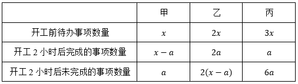

则有a+6a=3x，整理可得，即开工2小时（120分钟）后，甲未完成的事项数量为，完成的事项数量为。设再经过t分钟甲可以完成自己的所有待办事项，根据工作效率不变，工作总量和工作时间成正比，可得，解得t=90。

故正确答案为C。

---

### 第 15 题　qid 11542800 · 数学运算

大学生小陈和小刘同时做一套模拟题，小陈的正确率为75%，小刘只答错了5道，并且两人都答错的题数占总题数的六分之一，两人都答对的题超过一半。问小陈答对而小刘答错的题有多少道？

- **A**. 1　✅
- **B**. 2
- **C**. 3
- **D**. 4

**答案**：A

**官方解析**

根据“小陈的正确率为75%”，因，可得总题数为4的倍数；根据“两人都答错的题数占总题数的六分之一”，可得总题数为6的倍数，故设总题数为12x道，则两人都答错道，又因小刘只答错了5道，故，x可取值为1、2。

若x=1，则总题数为12x=12道，两人都答错2x=2道，小刘答错5道，小陈答错12×（1-75%）=3道，根据两集合容斥原理公式：，可得两人总共答错5+3-2=6道，则两人都答对的题数占总题数的，并未超过总题数的一半，排除；

若x=2，则总题数为12x=24道，两人都答错2x=4道，小刘答错5道，小陈答错24×（1-75%）=6道，则两人总共答错5+6-4=7道，两人都答对24-7=17道，占总题数的，超过总题数的一半；小陈答对的题数为24×75%=18道，则小陈答对而小刘答错的题有18-17=1道。

故正确答案为A。

---

### 第 16 题　qid 11542813 · 数学运算

某工程可交给甲、乙两个工程队完成，两个工程队周一到周五工作，周六、日休息，甲队从11月4日（周一）开始工作，乙队从11月12日开始加入一起工作。截至11月13日下班，工程完成了25%；截至11月21日下班，工程完成了一半。问该工程将于哪天完成？

- **A**. 12月12日
- **B**. 12月11日
- **C**. 12月10日
- **D**. 12月9日　✅

**答案**：D

**官方解析**

根据题意，甲、乙两队工作和休息的情况如下表所示：（“×”表示休息）

方法一：结合表格可得，截至11月13日下班，甲队工作8天，乙队工作2天，工程完成了25%；截至11月21日下班，甲队工作14天，乙队工作8天，工程完成了一半，可知还剩一半工程，且甲、乙两队效率关系为：2×（8甲+2乙）=14甲+8乙，整理可得甲=2乙。赋值甲队效率为2，乙队效率为1，则剩余工程量为14×2+8×1=36，还需个工作日完成。11月22日为周五，11月22日-30日共6个工作日，则再过12-6=6个工作日，即12月9日完成。

方法二：根据截至11月13日下班，工程完成了25%；截至11月21日下班，工程完成了一半，可知还剩一半工程，结合表格可得，11月14日-21日，甲、乙两队合作6天完成了，则每天完成，剩余工程还需个工作日完成。11月22日为周五，11月22日-30日共6个工作日，则再过12-6=6个工作日，即12月9日完成。

故正确答案为D。

---

### 第 17 题　qid 11542812 · 数学运算

小明老家有一块三角形空地，已知该三角形是直角三角形且斜边长为千米，其中一条直角边正好是另一条直角边的小数部分，问该空地的面积为多少平方千米？

- **A**. 0.75　✅
- **B**. 1
- **C**. 1.5
- **D**. 2

**答案**：A

**官方解析**

根据题意，设该三角形空地较长的直角边为（x+y）千米（x为正整数，0&lt;y&lt;1），较短的直角边为y千米，则该空地的面积平方千米。根据直角三角形斜边长为千米，结合勾股定理可列式：，整理可得，则，该空地的面积平方千米。 

代入A项：若，解得x=3，则面积，，可得y&lt;1，满足题干条件，当选；

代入B项：若，解得，x非整数，排除；

代入C项：若，解得，x非整数，排除；

代入D项：若，解得x=2，则面积，，可得y&gt;1，不满足题干条件，排除。

故正确答案为A。

---

### 第 18 题　qid 11542822 · 数学运算

小张、小王、小李是3名健身爱好者，按以下规律坚持健身：小张每健身2天休息1天；小王每健身3天休息2天；小李每健身5天休息3天。某年3月，小张、小王、小李分别从2日、3日、4日开始健身。问当年3月，三人均健身的日子有几天？

- **A**. 7
- **B**. 8
- **C**. 9　✅
- **D**. 10

**答案**：C

**官方解析**

根据题意，列表如下，其中“√”代表去健身，“×”代表休息。

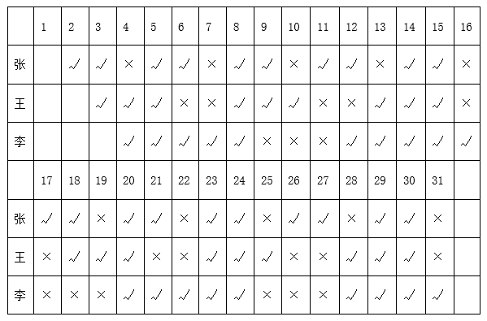

可知，当年3月，三人均健身的日子有5日、8日、14日、15日、20日、23日、24日、29日、30日，共9天。

故正确答案为C。

---

### 第 19 题　qid 11542821 · 数学运算

从足够量的桃子、李子、橘子、柿子中选取2025个水果装成一车，要求选取的桃子的数量是5的倍数，李子数是7的倍数，橘子最多6个，柿子最多4个，桃子李子必须都有。问有多少种不同的装法？

- **A**. 2013
- **B**. 2014　✅
- **C**. 2015
- **D**. 2016

**答案**：B

**官方解析**

根据题干条件可知，桃子数量为5的倍数即个，柿子数量不超过4个即0~4个，设桃子与柿子总数为x；李子数量为7的倍数即个，橘子数量不超过6个即0~6个，设李子与橘子总数为y。则x+y=2025。分析x与y的取值：

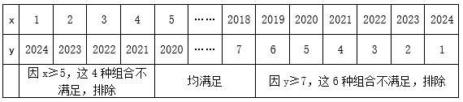

故满足条件的装法共2024-4-6=2014种。

故正确答案为B。

---

## 判断推理

### 第 1 题　qid 15419028 · 图形推理

从所给的四个选项中，选择最合适的一个填入问号处，使之呈现一定的规律性：

- **A**. A
- **B**. B
- **C**. C
- **D**. D　✅

**答案**：D

**官方解析**

元素组成不同，优先考虑属性规律。观察发现，每幅图形内部均存在一个轴对称的面，且外框也均为轴对称图形，分别画出两者的对称轴，发现两条对称轴的关系为平行、垂直交替出现，则？处两条对称轴的关系应为垂直，只有D项符合。

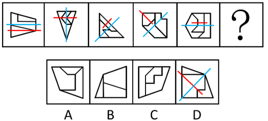

故正确答案为D。

---

### 第 2 题　qid 15419024 · 图形推理

从所给的四个选项中，选择最合适的一个填入问号处，使之呈现一定的规律性：

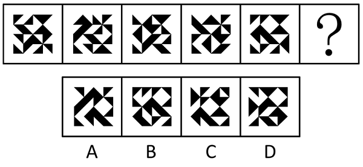

- **A**. A　✅
- **B**. B
- **C**. C
- **D**. D

**答案**：A

**官方解析**

元素组成基本相同，但位置规律不明显，考虑相邻比较。观察发现，如下图所示，图1和图2有5个位置的黑三角形相同，图2和图3有5个位置的黑三角形相同，题干其他图形也均满足此规律，故？处图形应该和图5有5个位置的黑三角形相同（且题干所有图形左下角和右上角的黑三角形均相同），只有A项符合。

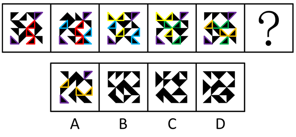

故正确答案为A。

---

### 第 3 题　qid 15419020 · 图形推理

从所给的四个选项中，选择最合适的一个填入问号处，使之呈现一定的规律性：

- **A**. A
- **B**. B
- **C**. C
- **D**. D　✅

**答案**：D

**官方解析**

元素组成相同，但无位置规律和属性规律，考虑数量规律。观察发现，题干图形中黑白球分堆明显，考虑部分数。第一组图中，白球的部分数均为2，每一部分的个数分别为（3、9），（4、8），（5、7）；第二组图中，前两幅图黑球的部分数均为2，每一部分的个数分别为（3、9），（4、8），故？处图形的黑球也应该为两个部分，且每一部分的个数分别为（5、7），只有D项符合。
故正确答案为D。

---

### 第 4 题　qid 15419022 · 图形推理

从所给的四个选项中，选择最合适的一个填入问号处，使之呈现一定的规律性：

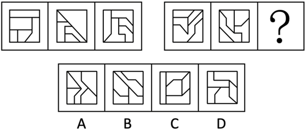

- **A**. A
- **B**. B　✅
- **C**. C
- **D**. D

**答案**：B

**官方解析**

解析一：元素组成不同，且无明显属性规律，考虑数量规律。观察发现，题干图形分割明显，考虑面数量，但没规律；继续观察发现，题干图形均由多个面拼接而成，考虑图形间关系。第一组图中，面彼此挨在一起，第二组图形中，面①将其中1个面和另外3个面完全隔开，只有B项符合。

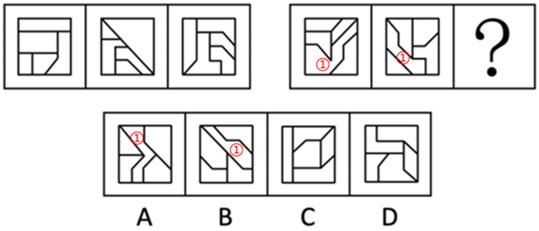

解析二：元素组成不同，且无明显属性规律，考虑数量规律。观察发现，题干图形分割明显，考虑面数量，但没规律；继续观察发现，只考虑内部线条的情况下，第一组图的内部线条为一部分，第二组图的内部线条为两部分，且有一部分线条是一笔画，只有B项符合。

故正确答案为B。

---

### 第 5 题　qid 15419026 · 图形推理

以下除哪一项外，均为同一正方体纸盒的外表面展开图？

- **A**. A
- **B**. B
- **C**. C
- **D**. D　✅

**答案**：D

**官方解析**

各选项面都相同，如下图所示，在四个选项中，均以黑色方块的直角顶点为起始点，沿着黑色方块所在面顺时针画边，逐一进行分析。

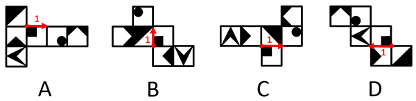

A项：边1挨着白色直角三角形；

B项：边1挨着白色直角三角形；

C项：边1挨着白色直角三角形；

D项：边1没有挨着白色直角三角形。

综上，只有D项与其他三项不同。

本题为选非题，故正确答案为D。

---

### 第 6 题　qid 15419025 · 定义判断

有氧运动是人体以有氧代谢为主要供能方式，在较长时间里有节奏地锻炼躯干、四肢等部位大肌群的全身运动。
根据上述定义，以下属于有氧运动的是：

- **A**. 老王每周一、三、五慢跑40分钟，二、四、六游泳50分钟以上　✅
- **B**. 小王几乎每天都要拉十几下单杠，然后操起哑铃或杠铃进行力量训练
- **C**. 小刘上大学以来坚持每天早上做20个俯卧撑，晚上做20次仰卧起坐
- **D**. 老张坚持单脚站立、提踵踮脚尖等身体运动，每周3次，每次30分钟

**答案**：A

**官方解析**

第一步：找出定义关键词。
“以有氧代谢为主要供能方式”、“在较长时间里有节奏地锻炼躯干、四肢等部位大肌群的全身运动”。
第二步：逐一分析选项。
A项：慢跑和游泳是以有氧代谢为主的运动，符合“以有氧代谢为主要供能方式”，老王每次运动时间均超过40分钟，且慢跑和游泳属于全身运动，符合“在较长时间里有节奏地锻炼躯干、四肢等部位大肌群的全身运动”，符合定义，当选；
B项：拉单杠、举哑铃和杠铃主要锻炼的是上肢力量，不符合“在较长时间里有节奏地锻炼躯干、四肢等部位大肌群的全身运动”，不符合定义，排除；
C项：俯卧撑主要锻炼上肢力量，仰卧起坐主要锻炼腹部力量，不符合“在较长时间里有节奏地锻炼躯干、四肢等部位大肌群的全身运动”，不符合定义，排除；
D项：单脚站立和提踵踮脚尖主要锻炼的是下肢力量，不符合“在较长时间里有节奏地锻炼躯干、四肢等部位大肌群的全身运动”，不符合定义，排除。
故正确答案为A。

---

### 第 7 题　qid 15419032 · 定义判断

封山育林是利用森林自我更新能力，对林区实行划界封禁，在一定时间内禁止垦荒、放牧、采伐、砍柴等人为活动，以保证林木繁殖生长的育林方式，有三种封法，一是全封，即较长时间（5至10年）的全林区封育；二是半封，在林木主要生长季节封育；三是轮封，将整个林区划片分段，实行轮流封育。
根据上述定义，以下为半封的是：

- **A**. Q省30个国有林场封山育林9千多万公顷，争取用5年建成现代林场
- **B**. S市长乐林区所辖西山林场正值封育时期，林区树木苍翠植被恢复良好
- **C**. H省大青山有10万亩原始次生林，每年10月至次年6月实行封山防火　✅
- **D**. J市在郊区5座连绵起伏的山上，新造幼林并建立林长和护林员巡护制

**答案**：C

**官方解析**

第一步：找出定义关键词。
封山育林：“利用森林自我更新能力，对林区实行划界封禁”、“在一定时间内禁止垦荒、放牧、采伐、砍柴等人为活动”、“以保证林木繁殖生长的育林方式”；
全封：“较长时间（5至10年）的全林区封育”；
半封：“在林木主要生长季节封育”；
轮封：“将整个林区划片分段，实行轮流封育”。
第二步：逐一分析选项。
A项：国有林场封山育林，争取用5年建成现代林场，符合“较长时间（5至10年）的全林区封育”，符合“全封”定义，不符合“半封”定义，排除；
B项：西山林场封育时期林区树木苍翠植被恢复良好，没有明确说明封育时间，不符合“在林木主要生长季节封育”，不符合“半封”定义，排除；
C项：大青山每年10月至次年6月实行封山防火，给出了封山的具体时间段，符合“在林木主要生长季节封育”，符合“半封”定义，当选；
D项：新造幼林并建立林长和护林员巡护制，并未提及封育，不符合“在林木主要生长季节封育”，不符合“半封”定义，排除。
故正确答案为C。

---

### 第 8 题　qid 15419036 · 定义判断

内容管理是指在信息时代，借助信息技术，对各种形式的内容进行创建、存储、分享、应用、检索，并在个人、企业、组织、业务、战略等方面产生价值的过程。内容管理涉及的内容可以是文本、图形图像、Web页面、业务文档、数据库表单、视频、声音等多种形式的数字信息。
根据上述定义，下列不属于内容管理的是：

- **A**. 企业官网发布产品介绍、新闻资讯、企业动态等，确保网站信息的时效性和准确性
- **B**. 电子商务网站频繁更新商品信息、促销活动和用户评价等内容，以提升用户体验
- **C**. 个人博客更新博客文章、评论互动和社交媒体分享等内容，提升博客的吸引力和互动性
- **D**. 信息技术课上，学生对作业本上记录的PPT上的概念、公式、定理等内容进行归纳、分类　✅

**答案**：D

**官方解析**

第一步：找到定义关键词。
“借助信息技术”、“对各种形式的内容进行创建、存储、分享、应用、检索”、“在个人、企业、组织、业务、战略等方面产生价值”。
第二步：逐一分析选项。
A项：企业官网发布产品介绍等内容，符合“借助信息技术”、“对各种形式的内容进行创建、存储、分享、应用、检索”，确保网站信息的时效性和准确性，符合“在个人、企业、组织、业务、战略等方面产生价值”，符合定义，排除；
B项：电子商务网站更新商品信息等内容，符合“借助信息技术”、“对各种形式的内容进行创建、存储、分享、应用、检索”，提升用户体验，符合“在个人、企业、组织、业务、战略等方面产生价值”，符合定义，排除；
C项：个人博客更新博客文章等内容，符合“借助信息技术”、“对各种形式的内容进行创建、存储、分享、应用、检索”，提升博客的吸引力和互动性，符合“在个人、企业、组织、业务、战略等方面产生价值”，符合定义，排除；
D项：学生只是在课堂上对作业本上记录的PPT上的概念等内容进行归纳、分类，并未涉及信息技术，不符合“借助信息技术”，不符合定义，当选。
本题为选非题，故正确答案为D。

---

### 第 9 题　qid 15419030 · 定义判断

封闭疗法是将一定剂量、浓度的麻醉、消炎等特定药物注射到身体特定部位或病变组织周围，用来阻断神经传导并改善局部营养，发挥消炎止痛等作用的一种治疗方法。封闭疗法对全身各部位的肌肉、韧带、筋膜、腱鞘、滑膜的急慢性损伤或退行性病变、骨关节病都适用。
根据上述定义，以下最可能为封闭疗法的是：

- **A**. 麻醉师为小刘右脚拇指注射麻醉剂后，医生为其拇指做手术
- **B**. 鱼刺卡在了小王喉咙处，医生取刺前，先给小王口腔喷麻药
- **C**. 医生将特定药液注入痛点周围，以此治疗老李的肩周炎　✅
- **D**. 医生为缓解老赵术后疼痛，给他上止痛泵

**答案**：C

**官方解析**

第一步：找出定义关键词。
“将一定剂量、浓度的麻醉、消炎等特定药物注射到身体特定部位或病变组织周围”、“用来阻断神经传导并改善局部营养，发挥消炎止痛等作用”。
第二步：逐一分析选项。
A项：麻醉师是为了手术给小刘注射麻醉剂，不符合“用来阻断神经传导并改善局部营养，发挥消炎止痛等作用”，不符合定义，排除；
B项：医生是为了取刺给小王口腔喷麻药，不是“注射”，不符合“将一定剂量、浓度的麻醉、消炎等特定药物注射到身体特定部位或病变组织周围”，不符合定义，排除；
C项：医生是为了治疗老李的肩周炎，将特定的药液注射到痛点周围，符合“将一定剂量、浓度的麻醉、消炎等特定药物注射到身体特定部位或病变组织周围”、“用来阻断神经传导并改善局部营养，发挥消炎止痛等作用”，符合定义，当选；
D项：医生为了缓解术后的疼痛给老赵上止痛泵，不符合“将一定剂量、浓度的麻醉、消炎等特定药物注射到身体特定部位或病变组织周围”，不符合定义，排除。
故正确答案为C。

---

### 第 10 题　qid 15419019 · 定义判断

非职务发明指企事业单位、社会团体、国家机关的工作人员没有利用本单位物质条件，在业余时间所完成的发明创造。
根据上述定义，以下属于非职务发明的是：

- **A**. 王医生旅游途中构思“多功能喉镜”后，用草图申请并获得发明专利　✅
- **B**. 陈工利用单位实验室设备研制“电缆穿管保护器”
- **C**. 张教授团队研发的“大气多参数探测光量子激光雷达”获得发明金奖
- **D**. 林场职工在单位制作的“果柄高效水果采摘器”获国家发明专利

**答案**：A

**官方解析**

第一步：找出定义关键词。
“没有利用本单位物质条件在业余时间所完成的发明创造”。
第二步：逐一分析选项。
A项：王医生“旅游途中”构思且用草图申请并获得发明专利，利用的是业余时间，且没有体现利用单位资源进行发明，符合“没有利用本单位物质条件在业余时间所完成的发明创造”，符合定义，当选；
B项：陈工使用的实验室设备是本单位资源，不符合“没有利用本单位物质条件在业余时间所完成的发明创造”，不符合定义，排除；
C项：张教授团队研发成果获得金奖，属于张教授团队的工作成果，不符合“没有利用本单位物质条件在业余时间所完成的发明创造”，不符合定义，排除；
D项：林场职工是在单位进行的发明，不符合“没有利用本单位物质条件在业余时间所完成的发明创造”，不符合定义，排除。
故正确答案为A。

---

### 第 11 题　qid 15419034 · 定义判断

两用物项是指既有民事用途，又有军事用途或者有助于提升军事潜力，特别是可以用于设计、开发、生产或者使用大规模杀伤性武器及其运载工具的货物、技术和服务，包括相关的技术资料等数据。
根据上述定义，以下不涉及两用物项的是：

- **A**. 我国涡轴发动机AES100，是为满足商用直升机动力需求研制的　✅
- **B**. 稀土有许多优良性能，能广泛运用于机械、电子、国防等领域
- **C**. 到目前为止，北斗系统服务及相关产品已输出到130余个国家
- **D**. 我国航发维修业能够为各种航空发动机提供高质量的维修服务

**答案**：A

**官方解析**

第一步：找出定义关键词。
“既有民事用途，又有军事用途或者有助于提升军事潜力”。
第二步：逐一分析选项。
A项：该项中发动机只是为了满足商用直升机动力需求而研制的，没有涉及军事用途，不符合“既有民事用途，又有军事用途或者有助于提升军事潜力”，不符合定义，当选；
B项：该项中稀土广泛运用于机械、电子、国防等领域，这些领域既有民事用途，又有军事用途，符合“既有民事用途，又有军事用途或者有助于提升军事潜力”，符合定义，排除；
C项：该项中北斗系统服务及相关产品输出到130余个国家，可能符合“既有民事用途，又有军事用途或者有助于提升军事潜力”，可能符合定义，排除；
D项：该项中航发维修业能够为“各种”航空发动机提供高质量的维修服务，“各种”航空发动机既包括民用设备，又包括军用设备，符合“既有民事用途，又有军事用途或者有助于提升军事潜力”，符合定义，排除。
本题为选非题，故正确答案为A。

---

### 第 12 题　qid 15419045 · 定义判断

绝对年代和相对年代是古今历史的纪年法，是历史学与考古学测定和记载人文时序的基本标志。历史上可以确定的具体年代，称为绝对年代。不能确定具体年代而仅能比较或推定先后时序者，称为相对年代。
根据上述定义，以下涉及相对年代的是：

- **A**. 秦始皇（前259-前210年）于公元前221年统一中国
- **B**. 孔子（前551-前479年）是中国古代伟大思想家和教育家
- **C**. 旧石器时代于距今约300万年始，于距今10000年左右止
- **D**. 特洛伊城陷落后约60年，彼阿提亚人定居于现在的彼阿提亚　✅

**答案**：D

**官方解析**

第一步：找出定义关键词。
绝对年代：“历史上可以确定的具体年代”；
相对年代：“不能确定具体年代而仅能比较或推定先后时序”。
第二步：逐一分析选项。
A项：秦始皇的生卒年份（前259-前210年）是一个具体的时间段，统一中国的时间（公元前221年）是一个具体的时间点，符合“历史上可以确定的具体年代”，符合“绝对年代”的定义，不符合“相对年代”的定义，排除；
B项：孔子的生卒年份（前551-前479年）是一个具体的时间段，符合“历史上可以确定的具体年代”，符合“绝对年代”的定义，不符合“相对年代”的定义，排除；
C项：旧石器时代的起（距今约300万年）止（距今10000年）时间是一个具体的时间段，符合“历史上可以确定的具体年代”，符合“绝对年代”的定义，不符合“相对年代”的定义，排除；
D项：彼阿提亚人定居发生在特洛伊城陷落后的约60年，60年是一个相对时间，且特洛伊城陷落在前，彼阿提亚人定居在后，符合“不能确定具体年代而仅能比较或推定先后时序”，符合“相对年代”的定义，当选。
故正确答案为D。

---

### 第 13 题　qid 15419055 · 定义判断

跨流域调水是从一个流域往另一个流域调水，以解决缺水地区水资源需求的一项措施。由于天然降水分布不均，不同流域的水量盈缺差距大，缺水流域的经济社会发展和居民生活受到水资源制约。可从丰水流域调出部分水量以调节缺水流域的用水，促进该流域经济社会可持续发展。
根据上述定义，以下不属于跨流域调水的是：

- **A**. 将长江江水引入黄河、淮河和海河
- **B**. 三峡水库在旱季向长江中下游输水　✅
- **C**. 让滦河河水穿越燕山山脉流入海河
- **D**. 丹江口水库一直把汉江水输往北方

**答案**：B

**官方解析**

第一步：找出定义关键词。
“从一个流域往另一个流域调水”、“解决缺水地区水资源需求的一项措施”。
第二步：逐一分析选项。
A项：从“长江流域”向“黄河流域、淮河流域和海河流域”调水，符合“从一个流域往另一个流域调水”，符合定义，排除；
B项：三峡水库处于长江上游，旱季向长江中下游输水，属于同一个流域，不符合“从一个流域往另一个流域调水”，不符合定义，当选；
C项：从“滦河流域”向“海河流域”调水，符合“从一个流域往另一个流域调水”，符合定义，排除；
D项：从“汉江流域”向“北方流域”调水，符合“从一个流域往另一个流域调水”，符合定义，排除。
本题为选非题，故正确答案为B。

---

### 第 14 题　qid 15419060 · 定义判断

碳足迹是用来衡量个体、组织或国家在一定时间内直接或间接导致的二氧化碳排放的指标。碳足迹的计算涵盖了产品或服务从生产、运输、最终使用到废弃处理的整个生命周期的排放。
根据上述定义，下列行为不利于减少碳足迹的是：

- **A**. 小陈放弃自己开车，选择公共交通出行
- **B**. 小李开车上下班，为了避开堵车高峰，提前两小时出门
- **C**. 小王在新家装修时选择密闭性良好的门窗，以减少家中气流和漏气情况
- **D**. ​小张认为吃牛肉比较耐饿，减少蔬菜、水果食用量，增加餐食中的牛肉　✅

**答案**：D

**官方解析**

第一步：找出定义关键词。
“衡量个体、组织或国家在一定时间内直接或间接导致的二氧化碳排放的指标”。
第二步：逐一分析选项。
A项：小陈放弃自己开车选择公共交通出行，可减少汽车尾气排放，减少了二氧化碳排放量，有利于减少碳足迹，排除；
B项：小李提前两小时出门避开堵车高峰，缩短了开车的时间，减少了二氧化碳排放量，有利于减少碳足迹，排除；
C项：密闭性良好的门窗可减少室内热量散失，降低取暖或制冷能源消耗，减少了二氧化碳排放量，有利于减少碳足迹，排除；
D项：小张增加牛肉的食用量，减少蔬菜、水果的食用量，牛肉在养殖等环节上会比种植蔬菜、水果等产生更多的二氧化碳，即增加了二氧化碳排放量，不利于减少碳足迹，当选。
故正确答案为D。

---

### 第 15 题　qid 15419061 · 定义判断

“列车效应”是指有多个对流云团依次经过某地时其所产生的降水量累积起来，就会导致大暴雨甚至特大暴雨，就像人站在一节节经过的列车面前一般，接连不断地感受到一节节车厢经过时带来的巨大声音和冲力，影响效果不断叠加，导致灾害加剧。
根据上述定义，以下属于列车效应的是：

- **A**. 某地因地势低洼，排水不畅，遭遇暴雨时经常发生城市内涝灾害
- **B**. 某地因强台风过境，短时产生大量降水，且降雨量明显高于往年同期水平
- **C**. 某地遭遇罕见特大暴雨天气，暴雨导致的山体滑坡、泥石流等次生灾害造成部分人员伤亡
- **D**. 某地进入梅雨季后天气阴晴不定，前一日艳阳高照，后又连续多日暴雨，拉响暴雨红色警报　✅

**答案**：D

**官方解析**

第一步：找出定义关键词。
“多个对流云团依次经过某地时其所产生的降水量累积起来”、“影响效果不断叠加”、“导致灾害加剧”。
第二步：逐一分析选项。
A项：某地因地势低洼，排水不畅，遭遇暴雨时经常发生城市内涝灾害，但没有说连续多次暴雨，不符合“多个对流云团依次经过某地时其所产生的降水量累积起来”、“影响效果不断叠加”，不符合定义，排除；
B项：某地因强台风过境，短时产生大量降水，强台风是一次影响，不符合“多个对流云团依次经过某地时其所产生的降水量累积起来”、“影响效果不断叠加”，不符合定义，排除；
C项：某地遭遇特大暴雨导致多种灾害，特大暴雨是一次影响，不符合“多个对流云团依次经过某地时其所产生的降水量累积起来”、“影响效果不断叠加”，不符合定义，排除；
D项：某地连续多日暴雨，符合“多个对流云团依次经过某地时其所产生的降水量累积起来”，拉响暴雨红色警报，符合“影响效果不断叠加”、“导致灾害加剧”，符合定义，当选。
故正确答案为D。

---

### 第 16 题　qid 15419102 · 类比推理

手机：扫码：支付

- **A**. 按键：开机：通话
- **B**. 煮饭：吃饭：洗碗
- **C**. 茶杯：泡茶：喝茶　✅
- **D**. 学习：看书：写字

**答案**：C

**官方解析**

第一步：判断题干词语间逻辑关系。
手机是用来扫码和支付的工具，第一词分别和后两词构成工具对应关系，且先扫码，再支付，后两词为时间先后顺序的对应关系。
第二步：判断选项词语间逻辑关系。
A项：按键是通话工具的组成部分，不是开机和通话的工具，与题干逻辑关系不一致，排除；
B项：先煮饭，再吃饭，最后洗碗，三者为时间先后顺序的对应关系，与题干逻辑关系不一致，排除；
C项：茶杯是用来泡茶和喝茶的工具，第一词分别和后两词构成工具对应关系，且先泡茶，再喝茶，后两词为时间先后顺序的对应关系，与题干逻辑关系一致，当选；
D项：看书和写字都是学习的方式，第一词分别和后两词构成方式目的对应关系，与题干逻辑关系不一致，排除。
故正确答案为C。

---

### 第 17 题　qid 15419099 · 类比推理

导诊：挂号：治疗

- **A**. 上班：打卡：同事
- **B**. 恋爱：订亲：结婚　✅
- **C**. 旅游：购票：交通
- **D**. 购房：交税：财产

**答案**：B

**官方解析**

第一步：判断题干词语间逻辑关系。
先“导诊”，再“挂号”，最后“治疗”，三者为时间先后顺序的对应关系。
第二步：判断选项词语间逻辑关系。
A项：打卡一般是在上班时进行的一个行为动作，同事是一起工作的人，三者没有明显的时间先后顺序，与题干逻辑关系不一致，排除；
B项：先“恋爱”，再“订亲”，最后“结婚”，三者为时间先后顺序的对应关系，与题干逻辑关系一致，当选；
C项：“交通”是旅游过程中涉及的一个方面，其与“购票”和“旅游”没有明确的时间先后顺序，与题干逻辑关系不一致，排除；
D项：先“购房”，再“交税”，但前两词均与“财产”不存在明确的时间先后顺序，与题干逻辑关系不一致，排除。
故正确答案为B。

---

### 第 18 题　qid 15419101 · 类比推理

太阳能：路灯：风能

- **A**. 燃气：热水器：电能　✅
- **B**. 自动：汽车：手动
- **C**. 竹子：洞箫：木头
- **D**. 机械：手表：发条

**答案**：A

**官方解析**

第一步：判断题干词语间逻辑关系。
太阳能和风能是两种不同的能源，且二者均可以作为路灯的动力来源，第一词和第三词为并列关系，分别与第二词构成动力来源的对应关系。
第二步：判断选项词语间逻辑关系。
A项：燃气和电能是两种不同的能源，且二者均可以作为热水器的动力来源，第一词和第三词为并列关系，分别与第二词构成动力来源的对应关系，与题干逻辑关系一致，当选；
B项：自动和手动是两种不同的汽车变速方式，第一词和第三词为并列关系，但与第二词不构成动力来源的对应关系，与题干逻辑关系不一致，排除；
C项：竹子和木头是两种不同的制作洞箫的原材料，第一词和第三词为并列关系，分别与第二词构成原材料的对应关系，与题干逻辑关系不一致，排除；
D项：发条是手表的组成部分，第三词与第二词为组成关系，与题干逻辑关系不一致，排除。
故正确答案为A。

---

### 第 19 题　qid 15419096 · 类比推理

水稻：小麦：玉米：粮食

- **A**. 白菜：萝卜：青椒：蔬菜　✅
- **B**. 溪涧：池塘：沟渠：流水
- **C**. 聊天：支付：定位：微信
- **D**. 善良：宽厚：诚实：人性

**答案**：A

**官方解析**

第一步：判断题干词语间逻辑关系。
水稻、小麦、玉米都是粮食，前三个词是并列关系，且均和第四个词构成种属关系。
第二步：判断选项词语间逻辑关系。
A项：白菜、萝卜、青椒都是蔬菜，前三个词是并列关系，且均和第四个词构成种属关系，与题干逻辑关系一致，保留；
B项：溪涧是指夹在两山中间的小河沟，溪涧、池塘、沟渠都是水域，都由流水组成，前三个词均和第四个词构成组成关系，与题干逻辑关系不一致，排除；
C项：聊天、支付、定位都是微信具有的功能，前三个词是并列关系，且均和第四个词构成功能对应关系，与题干逻辑关系不一致，排除；
D项：善良、宽厚、诚实都是人性，前三个词是并列关系，且均和第四个词构成种属关系，与题干逻辑关系一致，保留。
比较A、D两项，题干和A项中的词语都是具体事物，且都是自然产物，而D项中的词语都是抽象事物，且不是自然产物，故A项与题干逻辑关系更为一致，当选。
故正确答案为A。

---

### 第 20 题　qid 15419097 · 类比推理

筑堤：拦水：养鱼

- **A**. 春播：夏种：秋收
- **B**. 开荒：造田：种粮　✅
- **C**. 吐丝：结茧：丝绸
- **D**. 研墨：铺纸：书法

**答案**：B

**官方解析**

第一步：判断题干词语间逻辑关系。
筑堤是为了拦水，拦水是为了养鱼，分别构成方式目的的对应关系。
第二步：判断选项词语间逻辑关系。
A项：春播、夏种和秋收是农业生产中的不同阶段，三者为并列关系，且存在时间上的先后顺序，与题干逻辑关系不一致，排除；
B项：开荒是为了造田，造田是为了种粮，三者为方式目的的对应关系，与题干逻辑关系一致，当选；
C项：吐丝和结茧是蚕生长中的两个过程，二者为并列关系，且存在时间上的先后顺序，丝绸是由蚕吐出的丝加工而成的，与题干逻辑关系不一致，排除；
D项：研墨和铺纸是书法创作中的准备工作，二者为并列关系，均与第三个词构成对应关系，与题干逻辑关系不一致，排除。
故正确答案为B。

---

### 第 21 题　qid 15419098 · 类比推理

桥墩：桥面：桥

- **A**. 路标：路面：路
- **B**. 车轮：车身：车　✅
- **C**. 门框：门锁：门
- **D**. 房顶：房型：房

**答案**：B

**官方解析**

第一步：判断题干词语间逻辑关系。
桥墩和桥面都是桥的组成部分，前两词和第三词分别构成组成关系。
第二步：判断选项词语间逻辑关系。
A项：路面是路的组成部分，路标是一种交通标志，路标设置在路上，二者为地点的对应关系，与题干逻辑关系不一致，排除；
B项：车轮和车身都是车的组成部分，前两词和第三词分别构成组成关系，与题干逻辑关系一致，保留；
C项：门框和门锁都是门的组成部分，前两词和第三词分别构成组成关系，与题干逻辑关系一致，保留；
D项：房顶是房的组成部分，但房型一是指面积大小不等、基本平面功能分区各异的单元住宅系列；二是指在同一总面积水平下，每户使用面积内部的功能组合和面积安排以及各分区的朝向、通风、采光情况等，与房不构成组成关系，与题干逻辑关系不一致，排除。
对比B、C两项，题干中桥墩是在桥面的下方，B项中车轮是在车身的下方，而C项中门框并不在门锁的下方，故B项与题干逻辑关系更为一致，当选。
故正确答案为B。

---

### 第 22 题　qid 15419100 · 类比推理

汉剧：川剧：传统戏剧

- **A**. 诗词：散文：古典文学
- **B**. 山歌：民歌：经典情歌
- **C**. 劲舞：街舞：广场舞蹈
- **D**. 唢呐：二胡：民族乐器　✅

**答案**：D

**官方解析**

第一步：判断题干词语间逻辑关系。
汉剧和川剧是两种不同的传统戏剧，前两词为并列关系，且分别与第三词构成种属关系。
第二步：判断选项词语间逻辑关系。
A项：诗词和散文是两种不同的文学体裁，前两词为并列关系，古典文学泛指各民族的古代文学作品，前两词分别与第三词构成交叉关系，与题干逻辑关系不一致，排除；
B项：山歌是中国民歌的基本体裁之一，前两词为种属关系，与题干逻辑关系不一致，排除；
C项：街舞是一种起源于美国街头的舞蹈，是一种体育与街头表演相结合的舞蹈。劲舞是指节奏强烈有力的现代舞蹈，街舞是劲舞，前两词为种属关系，与题干逻辑关系不一致，排除；
D项：唢呐和二胡是两种不同的民族乐器，前两词为并列关系，且分别与第三词构成种属关系，与题干逻辑关系一致，当选。
故正确答案为D。

---

### 第 23 题　qid 15419103 · 类比推理

建筑：设计：施工

- **A**. 项目：规划：实施　✅
- **B**. 文章：构思：写作
- **C**. 药品：配方：成分
- **D**. 实验：守则：报告

**答案**：A

**官方解析**

第一步：判断题干词语间逻辑关系。
建筑应先设计，再施工，后两词与第一词分别构成对应关系，且后两词存在时间的先后顺序。
第二步：判断选项词语间逻辑关系。
A项：项目应先规划，再实施，后两词与第一词分别构成对应关系，且后两词存在时间的先后顺序，与题干逻辑关系一致，保留；
B项：文章应先构思，再写作，后两词与第一词分别构成对应关系，且后两词存在时间的先后顺序，与题干逻辑关系一致，保留；
C项：药品配方、药品成分，后两词与第一词分别构成偏正关系，且后两词不存在时间的先后顺序，与题干逻辑关系不一致，排除；
D项：实验守则、实验报告，后两词与第一词分别构成偏正关系，且后两词不存在时间的先后顺序，与题干逻辑关系不一致，排除。
对比A、B两项，题干中，设计方设计方案，施工方根据方案施工，两个行为的主体不一致；A项中，规划方规划方案，实施方根据方案实施，两个行为的主体不一致；而B项中，构思和写作的主体均是作者，两个行为的主体一致，因此A项与题干逻辑关系更为一致，当选。
故正确答案为A。

---

### 第 24 题　qid 15419104 · 类比推理

（    ） 对于 遇事 相当于 朝气 对于 （    ）

- **A**. 静气；干事　✅
- **B**. 沉着；人生
- **C**. 担当；事业
- **D**. 无惧；开拓

**答案**：A

**官方解析**

逐一代入选项。
A项：遇事要有静气，干事要有朝气，二者均为情境和心态的对应关系，前后逻辑关系一致，保留；
B项：遇事需要沉着，前者为情境和心态的对应关系；朝气可用来形容人生状态，二者为描述对象和状态的对应关系，前后逻辑关系不一致，排除；
C项：遇事要有担当，二者为情境和心态的对应关系；朝气可用来形容事业状态，二者为描述对象和状态的对应关系，前后逻辑关系不一致，排除；
D项：遇事要无惧，开拓要有朝气，二者均为情境和心态的对应关系，前后逻辑关系一致，保留。
对比A、D两项，A项中“遇事”和“干事”均为动宾结构，而D项中“开拓”是动词，故A项前后逻辑关系更为一致，当选。
故正确答案为A。

---

### 第 25 题　qid 15419106 · 类比推理

铁三角 对于 （    ） 相当于 （    ） 对于 老谋深算

- **A**. 患难之交；老黄牛
- **B**. 金兰之交；和事佬
- **C**. 泛泛之交；愣头青　✅
- **D**. 总角之交；老江湖

**答案**：C

**官方解析**

逐一代入选项。
A项：铁三角比喻牢固可靠的三方组合，患难之交指在一起经历过忧患和危难的朋友，二者是近义关系；老黄牛比喻老老实实、勤勤恳恳工作的人，老谋深算指周密的筹划、深远的打算，形容人办事精明老练，二者不是近义关系，前后逻辑关系不一致，排除；
B项：铁三角比喻牢固可靠的三方组合，金兰之交指十分亲密的朋友或结拜兄弟，二者是近义关系；和事佬指调停争端的人，特指无原则地进行调节的人，老谋深算指周密的筹划、深远的打算，形容人办事精明老练，二者不是近义关系，前后逻辑关系不一致，排除；
C项：铁三角比喻牢固可靠的三方组合，泛泛之交指普通朋友，二者是反义关系；愣头青指鲁莽的人，老谋深算指周密的筹划、深远的打算，形容人办事精明老练，二者是反义关系，前后逻辑关系一致，当选；
D项：铁三角比喻牢固可靠的三方组合，总角之交指小时候很要好的朋友，即前者指“关系牢固”的朋友，后者指“小时候很要好”的朋友，二者无明显逻辑关系；老江湖指在外多年，很有阅历，处事圆滑的人，老谋深算指周密的筹划、深远的打算，形容人办事精明老练，二者是近义关系，前后逻辑关系不一致，排除。
故正确答案为C。

---

### 第 26 题　qid 15419143 · 逻辑判断

在一项研究中，将睡眠不足定义为每晚睡眠时间少于7小时。研究者选择存在这种情况的受试者19816名，14年后随访，发现周末补偿性睡眠的受试者比没有补偿性睡眠的受试者患心血管疾病的可能性低19%，这一比率不存在男女差异。可见，充足的补偿性睡眠与罹患心血管疾病风险的降低有关。
以下各项如果为真，最能支持上述结论的是：

- **A**. 另一项有90903名受试者参与的研究也得出了相同的结论
- **B**. 每天平均睡眠时间少于7小时，确实会增加患心血管疾病的风险
- **C**. 充足的补偿性睡眠对心血管健康至关重要，也对整个机体健康至关重要
- **D**. 每天平均睡眠时间7小时以上，能有效保护心脏生理机制的复杂平衡　✅

**答案**：D

**官方解析**

第一步：找出论点和论据。
论点：充足的补偿性睡眠与罹患心血管疾病风险的降低有关。
论据：研究者选择存在这种情况的受试者19816名，14年后随访，发现周末补偿性睡眠的受试者比没有补偿性睡眠的受试者患心血管疾病的可能性低19%，这一比率不存在男女差异。
本题论点和论据讨论的都是“充足的补偿性睡眠”和“罹患心血管疾病风险”之间的关系，话题一致，加强优先考虑补充论据。
第二步：逐一分析选项。
A项：该项指出另一项研究也得出了相同的结论，通过补充其他研究的结果来证明“充足的补偿性睡眠与罹患心血管疾病风险的降低有关”，补充论据，可以加强，保留；
B项：该项指出每天平均睡眠时间少于7小时，确实会增加患心血管疾病的风险，但并没有提到是否有充足的补偿性睡眠，而论点讨论的是充足的补偿性睡眠是否与罹患心血管疾病风险的降低有关，话题不一致，不能加强，排除；
C项：该项指出充足的补偿性睡眠对心血管健康至关重要，也对整个机体健康至关重要，与论点表述的意思一致，可以加强，保留；
D项：该项指出“平均”每天睡眠时间7小时以上对心脏的好处，根据题干第一句可知“睡眠不足指每晚睡眠时间少于7小时”，那么“充足的”补偿性睡眠应当指“平均到”每晚睡眠时间不少于7小时， 而每天平均睡眠时间7小时以上是能有效保护心脏生理机制的，所以需要通过周末的补偿性睡眠，来使“平均睡眠”达到7小时以上，这就解释了为什么“充足的”补偿性睡眠可以降低罹患心血管疾病的风险，补充论据，可以加强，保留；
对比A、C、D三项，A项通过补充另外一个例子来证明论点成立，C项只是在重复论点，D项设置的很巧妙， 解释了为什么睡得少时要补偿性睡眠，因为当补到每天“平均”睡眠时间达到7小时时，能降低患心血管疾病的风险，解释了论点成立的原因，对比之后，D项解释原因的力度&gt;A项举例子&gt;C项重复论点，因此，D项加强力度更大，当选。
故正确答案为D。

---

### 第 27 题　qid 15419137 · 逻辑判断

数据显示，2024年1至7月，我国服务贸易进出口总额42301.8亿元，同比增长14.7%，其中出口17325亿元，增长12.4%，显著超过同期货物贸易出口增幅。服务贸易中的知识产权使用费、文化娱乐服务出口增长较快，增幅分别达到15.7%、16.3%。服务贸易数字化、科技化、便利化和高附加值化趋势明显。
根据以上叙述，最能推出的结论是：

- **A**. 中国服务贸易实现高水平对外开放
- **B**. 中国服务贸易国际竞争力全面提升
- **C**. 中国服务贸易呈量增质优发展态势　✅
- **D**. 中国服务贸易已在国际上崭露头角

**答案**：C

**官方解析**

日常结论题，根据题干信息逐一分析选项。
A项：题干内容不涉及“对外开放”，无中生有，无法推出，排除；
B项：根据第二句话“服务贸易中的知识产权使用费、文化娱乐服务出口增长较快，增幅分别达到15.7%、16.3%”可知，讨论的是部分重点领域的服务贸易情况，不涉及“国际竞争力全面提升”，无中生有，无法推出，排除；
C项：根据第一句话“我国服务贸易进出口总额42301.8亿元，同比增长14.7%，其中出口17325亿元，增长12.4%，显著超过同期货物贸易出口增幅”和最后一句话“服务贸易数字化、科技化、便利化和高附加值化趋势明显”可知，中国服务贸易呈量增质优发展态势，可以推出，当选；
D项：题干讨论的是“我国服务贸易进出口数量和质量的提升”，但该项讨论的是“中国服务贸易已在国际上崭露头角”，无中生有，无法推出，排除。
故正确答案为C。

---

### 第 28 题　qid 15419138 · 逻辑判断

科学界认为弗洛勒斯人是目前已知的体形最小人种，弗洛勒斯人的祖先是在约100万年前登上印尼弗洛勒斯岛的。研究人员最近在弗洛勒斯岛发现了一块70万年前的古弗洛勒斯成年人的肱骨化石，只有88毫米长。研究结论是，弗洛勒斯人的祖先在抵达弗洛勒斯岛后的30万年里进化得更矮小了。
以下各项如果为真，最能支持上述结论的是：

- **A**. 弗洛勒斯人的祖先应该是体形较大的古人类，或因风暴被冲上弗洛勒斯岛
- **B**. 研究早就证明，动物被困在岛屿上都会进化出更小体形，这叫岛屿侏儒症
- **C**. 因为岛屿上食物或被捕食威胁减少，人和动物的体形都会进化得更加矮小
- **D**. 这根肱骨的大小是更早前弗洛勒斯成年人肱骨化石的9%至16%，且更细　✅

**答案**：D

**官方解析**

第一步：找出论点和论据。
论点：弗洛勒斯人的祖先在抵达弗洛勒斯岛后的30万年里进化得更矮小了。
论据：弗洛勒斯人的祖先是在约100万年前登上印尼弗洛勒斯岛的。研究人员最近在弗洛勒斯岛发现了一块70万年前的古弗洛勒斯成年人的肱骨化石，只有88毫米长。
本题论点讨论的是“弗洛勒斯人抵达岛后的30万年里进化得更矮小了”，论据讨论的是“发现70万年前的古弗洛勒斯成年人的肱骨化石，长度只有88毫米”，二者话题不一致，加强优先考虑搭桥，即建立“70万年前的这块肱骨化石”与“抵达岛后变得更矮小”之间的联系。
第二步：逐一分析选项。
A项：该项指出弗洛勒斯人的祖先应该是体形较大的古人类，或因风暴被冲上弗洛勒斯岛，讨论的是“弗洛勒斯人的祖先如何登上弗洛勒斯岛”，与论点讨论的“弗洛勒斯人的祖先在抵达弗洛勒斯岛后的30万年里进化得更矮小了”话题不一致，不能加强，排除；
B项：该项指出动物被困在岛屿上都会进化出更小体形，可以在一定程度上解释为什么“弗洛勒斯人的祖先在抵达弗洛勒斯岛后的30万年里进化得更矮小了”，可以加强，但没有建立“70万年前的这块肱骨化石”与“抵达岛后变得更矮小”之间的联系，不是搭桥项，排除；
C项：该项指出因为岛屿上食物或被捕食威胁减少，人和动物的体形都会进化得更加矮小，可以解释为什么“弗洛勒斯人的祖先在抵达弗洛勒斯岛后的30万年里进化得更矮小了”，可以加强，但没有建立“70万年前的这块肱骨化石”与“抵达岛后变得更矮小”之间的联系，不是搭桥项，排除；
D项：该项指出这根肱骨的大小是更早前弗洛勒斯成年人肱骨化石的9%至16%，且更细，说明发现的这根70万年前的肱骨比更早前的弗洛勒斯成年人肱骨化石要小得多，可以说明“弗洛勒斯人的祖先在抵达弗洛勒斯岛后的30万年里进化得更矮小了”，建立了“70万年前的这块肱骨化石”与“抵达岛后变得更矮小”之间的联系，搭桥项，可以加强，当选。
故正确答案为D。

---

### 第 29 题　qid 15419148 · 逻辑判断

在研究石英与黄金形成的关系时，科研人员发现：石英是压电矿物，它在地震产生的应力作用下会产生电荷；热液流体将金原子从地壳深处带入石英脉（石英岩缝）中，使石英脉充满溶解金；石英产生的电荷，与溶解金发生反应，让金析出并凝固成金块。因此，研究人员断定：地震促使黄金在石英中形成。
研究人员的观点若要更具说服力，最需补充的前提是：

- **A**. 地震让石英产生电荷的同时造成石英岩断裂，让热液流体将金原子带入石英脉　✅
- **B**. 金原子充当一个电极，通过吸收石英产生的电荷在石英脉中展开反应凝固成团
- **C**. 实验室模拟的地震波让石英产生足够大的电压，使金从溶液中析出凝固成金块
- **D**. 科学家已能在实验室里模拟地震环境，利用石英和含金原子的液体制造大金块

**答案**：A

**官方解析**

第一步：找出论点和论据。
论点：地震促使黄金在石英中形成。
论据：石英是压电矿物，它在地震产生的应力作用下会产生电荷；热液流体将金原子从地壳深处带入石英脉（石英岩缝）中，使石英脉充满溶解金；石英产生的电荷，与溶解金发生反应，让金析出并凝固成金块。
本题论据讨论地震时石英产生电荷，与溶解金反应形成黄金，论点讨论地震促使黄金在石英中形成，话题一致，问法为“前提”，加强优先考虑必要条件。
第二步：逐一分析选项。
A项：指出地震使得热液流体将金原子带入石英脉，如果该项不成立，那么石英中就不存在金原子，地震时就无法与电荷发生反应、形成黄金，论点就无法成立，是论点成立的必要条件，当选；
B项：指出金原子通过吸收石英产生的电荷在石英脉中展开反应凝固成团，解释了地震时石英中黄金是如何形成的，补充论据，可以加强，但不是论点成立的前提，排除；
C项：指出实验室模拟的地震波让石英产生足够大的电压，使金从溶液中析出凝固成金块，说明地震确实可以促使黄金在石英中形成，补充论据，可以加强，但不是论点成立的前提，排除；
D项：指出科学家已能在实验室里模拟地震环境，利用石英和含金原子的液体制造大金块，说明地震确实可以促使黄金在石英中形成，补充论据，可以加强，但不是论点成立的前提，排除。
故正确答案为A。

---

### 第 30 题　qid 15419154 · 逻辑判断

寝室里住着甲、乙、丙、丁四位大学生。他们当中一人是班长，一人是院男篮队员，一人选修了逻辑学，一人刚参加完数学建模比赛，且四人均不兼项。其中，甲不是班长也没参加数学建模比赛，乙没选修逻辑学也不是班长，丁没有参加数学建模比赛也不是班长。另外还知道，如果甲没有选修逻辑学，那么丙也不是班长。
根据以上叙述，可推出的结论是：

- **A**. 甲是院男篮队员
- **B**. 丁选修了逻辑学
- **C**. 乙参加了数学建模比赛　✅
- **D**. 丙或乙选修了逻辑学

**答案**：C

**官方解析**

第一步：分析题干条件。

（1）甲、乙、丙、丁中一人是班长，一人是院男篮队员，一人选修了逻辑学，一人刚参加完数学建模比赛，且四人均不兼项；

（2）甲班长，甲数学建模比赛；

（3）乙逻辑学，乙班长；

（4）丁数学建模比赛，丁班长；

（5）甲选修逻辑学丙是班长。

第二步：根据题干条件进行推理。

题干条件中“班长”提及次数最多，可优先从此处入手进行推理。

根据条件（2）（3）（4）可知，甲、乙、丁都不是班长，结合条件（1）可知，丙是班长。这是对条件（5）的否后，否后必否前，可得甲选修逻辑学。根据（4）可知，丁没有参加数学建模比赛，那么丁是院男篮队员，乙参加了数学建模比赛，只有C项符合。

故正确答案为C。

---

### 第 31 题　qid 15419144 · 逻辑判断

干眼症是一种常见病。研究人员选择了300名年龄在18至45岁之间的干眼症患者，在8周时间里，一半人每天接受4次、每次5分钟笑疗，另一半人每天接受滴眼液治疗，笑疗包括各种让人发笑的干预手段。结果发现，两种治疗方法对两组患者的干眼症都有疗效。研究结论是，滴眼液在改善干眼症症状方面不逊于笑疗。
以下哪项如果为真，最能削弱上述结论？

- **A**. 上述研究没揭示出“笑”治疗干眼症的生物学机制
- **B**. 使用滴眼液实验组的患者，大多数都是乐观爱笑的　✅
- **C**. 笑疗仅是一种比较安全、环保且低成本的干预措施
- **D**. 有些生性开朗活泼、笑容常挂脸上的人也患干眼症

**答案**：B

**官方解析**

第一步：找出论点和论据。
论点：滴眼液在改善干眼症症状方面不逊于笑疗。
论据：研究人员选择了300名年龄在18至45岁之间的干眼症患者，在8周时间里，一半人每天接受4次、每次5分钟笑疗，另一半人每天接受滴眼液治疗，笑疗包括各种让人发笑的干预手段。结果发现，两种治疗方法对两组患者的干眼症都有疗效。
本题论据讨论的是对300名干眼症患者的研究发现，滴眼液治疗和笑疗对干眼症都有疗效，论点讨论的是滴眼液在改善干眼症症状方面不逊于笑疗，二者话题一致，削弱优先考虑削弱论点，还可考虑削弱论据等。
第二步：逐一分析选项。
A项：该项说的是上述研究没揭示出“笑”治疗干眼症的生物学机制，而论点讨论的是滴眼液治疗和笑疗的效果，话题不一致，无法削弱，排除；
B项：该项说的是使用滴眼液实验组的患者大多数乐观爱笑，说明该组患者的疗效不一定是因为滴眼液，还可能是因为患者乐观爱笑，即滴眼液在改善干眼症症状方面不一定优于笑疗，削弱论据，可以削弱，当选；
C项：该项说的是笑疗仅是一种比较安全、环保且低成本的干预措施，不涉及笑疗的效果，而论点讨论的是滴眼液治疗和笑疗的效果，话题不一致，无法削弱，排除；
D项：该项说的是有些生性开朗活泼、笑容常挂脸上的人也患干眼症，不涉及干眼症的治疗，而论点讨论的是滴眼液治疗和笑疗的效果，话题不一致，无法削弱，排除。
故正确答案为B。

---

### 第 32 题　qid 15419142 · 逻辑判断

烹饪使人类祖先的大脑得以进化。研究人员在一个古老洞穴中发现了一座30万年前的炉灶，旁边是被屠宰动物的遗骸；在一处遗址中发现存在了78万年的石垒炉灶及被加热过的一些鱼骨；还有证据表明，早在160万年前，肯尼亚地区的早期人类就学会了使用火。研究结论是：烹饪至少发明于160万年前。
以下各项如果为真，最能质疑上述结论的是：

- **A**. 目前有关考古学和生物学的已有证据，不一定能确定人类何时开始烹饪
- **B**. 生物学证据表明，人类约在200万年前就可能失去生食动物的生理特征
- **C**. 人类学会使用火不一定学会烹饪，因为使用火可能只是取暖或制造工具　✅
- **D**. 人类祖先到底什么时候学会控制和使用火的，考古界对此还没有定论

**答案**：C

**官方解析**

第一步：找出论点和论据。
论点：烹饪至少发明于160万年前。
论据：研究人员在一个古老洞穴中发现了一座30万年前的炉灶，旁边是被屠宰动物的遗骸；在一处遗址中发现存在了78万年的石垒炉灶及被加热过的一些鱼骨；还有证据表明，早在160万年前，肯尼亚地区的早期人类就学会了使用火。
本题论点讨论的是烹饪是否发明于160万年前，论据讨论的是人类在160万年前就学会了使用火，二者话题不一致，削弱优先考虑拆桥，即拆断“会使用火”与“发明烹饪”之间的联系。
第二步：逐一分析选项。
A项：该项指出已有证据不一定能确定人类何时开始烹饪，即不明确人类是否在160万年前就发明了烹饪，为不明确项，无法削弱，排除；
B项：该项指出有证据表明人类约在200万年前就可能失去生食动物的生理特征，但失去生食动物的特征不一定是由于人类学会了烹饪，与题干话题不一致，无法削弱，排除；
C项：该项指出人类学会使用火不一定学会烹饪，拆断了“会使用火”与“发明烹饪”之间的联系，为拆桥项，可以削弱，当选；
D项：该项指出考古界尚不清楚人类是什么时候学会控制和使用火的，为不明确项，无法削弱，排除。
故正确答案为C。

---

### 第 33 题　qid 15419141 · 逻辑判断

生物工程师一直在努力运用微生物制造塑料，以取代造成全球塑料污染的石油基料。研究人员最近实现了一项技术突破，使细菌产生一种含有环状结构的N聚合物，用它制造的塑料更加坚硬和耐热。研究人员指出，利用N聚合物制造的塑料一旦大规模商业化运用，就能缓解全球性塑料污染危机。
研究人员的观点若要增强说服力，最需要补充的前提是：

- **A**. 实验证明，N聚合物能自行生物降解，不会形成污染　✅
- **B**. 研究和生产人员正努力提高N聚合物合成塑料的产量
- **C**. 实验证明，N聚合物还特别适合药物在人体内的输送
- **D**. 研究人员正努力提高N聚合物塑料回收率，缓解污染

**答案**：A

**官方解析**

第一步：找出论点和论据。
论点：利用N聚合物制造的塑料一旦大规模商业化运用，就能缓解全球性塑料污染危机。
论据：研究人员最近实现了一项技术突破，使细菌产生一种含有环状结构的N聚合物，用它制造的塑料更加坚硬和耐热。
本题论点和论据都在讨论用N聚合物制造的塑料的优点，话题一致，且提问方式为“前提”，加强优先考虑必要条件。
第二步：逐一分析选项。
A项：该项指出N聚合物不会形成污染，如果N聚合物会形成污染，那大规模使用了利用N聚合物制造的塑料就会产生更多的污染，就不能用它来缓解全球性塑料污染危机，即否定该项后论点不能成立，该项为论点成立的必要条件，可以加强，当选；
B项：该项指出人们正努力提高N聚合物合成塑料的产量，而论点讨论的是大规模使用N聚合物制造的塑料，能否缓解全球性塑料污染危机，话题不一致，无法加强，排除；
C项：该项指出N聚合物还特别适合药物在人体内的输送，而论点讨论的是大规模使用N聚合物制造的塑料，能否缓解全球性塑料污染危机，话题不一致，无法加强，排除；
D项：该项指出研究人员正努力提高N聚合物塑料回收率，但不确定是否能提升N聚合物塑料回收率，也不确定大规模使用了利用N聚合物制造的塑料能否缓解全球性塑料污染，为不明确项，无法加强，排除。
故正确答案为A。

---

### 第 34 题　qid 15419151 · 逻辑判断

一项研究分析了飞机产生的航迹云与全球变暖的关系。航迹云是由喷气发动机排放的烟尘凝结水蒸气形成的云，更持久的航迹云会造成更多的全球变暖。研究人员认为，飞机飞行高度越高，带来的气候变暖越严重。
以下哪项如果为真，最能支持研究人员的观点?

- **A**. 飞机飞行的高度越高，就会有越多的烟尘排放
- **B**. 航空业多达一半的变暖效应是由航迹云引起的
- **C**. 高空飞行的飞机对气候的非二氧化碳影响同样重大
- **D**. 飞机飞行的高度越高，产生的航迹云持续时间越长　✅

**答案**：D

**官方解析**

第一步：找出论点和论据。
论点：飞机飞行高度越高，带来的气候变暖越严重。
论据：航迹云是由喷气发动机排放的烟尘凝结水蒸气形成的云，更持久的航迹云会造成更多的全球变暖。
本题论点说的是“飞机飞行高度”和“气候变暖”之间的关系，论据说的是“航迹云持续时间”和“气候变暖”之间的关系，二者话题不一致，加强优先考虑搭桥，即建立“航迹云持续时间”与“飞机飞行高度”之间的联系。
第二步：逐一分析选项。
A项：该项指出飞机飞行的高度越高，就会有越多的烟尘排放，排放的烟尘不明确是否会形成航迹云，为不明确项，无法加强，排除；
B项：该项指出航空业多达一半的变暖效应是由航迹云引起的，说的是“航迹云”与“变暖效应”之间的关系，而论点讨论的是“飞机飞行高度”与“气候变暖”之间的关系，话题不一致，无法加强，排除；
C项：该项指出高空飞行的飞机对气候的非二氧化碳影响同样重大，讨论的是对“气候的非二氧化碳”的影响，而论点讨论的是对“气候变暖”的影响，话题不一致，无法加强，排除；
D项：该项指出飞机飞行的高度越高，产生的航迹云持续时间越长，建立了“航迹云持续时间”与“飞机飞行高度”之间的联系，为搭桥项，可以加强，当选。
故正确答案为D。

---

### 第 35 题　qid 15419146 · 逻辑判断

近代历史上火星至少发生过10次大规模撞击，大量物质在撞击过程中被高速抛向太空，其中一些可能会作为陨石落到地球上。最新研究揭示，地球上约有200颗陨石的来源，可追溯到火星上的塔尔西斯和埃律西昂这两个火山区的5个撞击坑。研究报告声称，地球上的部分陨石确实来自火星。
以下各项如果为真，最能支持上述结论的是：

- **A**. 科学家现在可根据上述200颗陨石曾在火星表面的位置对它们进行分组
- **B**. 火星探测器探明，上述200颗陨石和两个火山区5个撞击坑物质成分相同　✅
- **C**. 火星探测器发现火星大气成分与上述200颗陨石中所包含气体成分相同
- **D**. 科学家现在能模拟陨石与上述5个撞击坑的撞击以及特定陨石群的抛射过程

**答案**：B

**官方解析**

第一步：找出论点和论据。
论点：地球上的部分陨石确实来自火星。
论据：地球上约有200颗陨石的来源，可追溯到火星上的塔尔西斯和埃律西昂这两个火山区的5个撞击坑。
本题论点和论据都在讨论地球上部分陨石来自火星，二者话题一致，加强优先考虑补充论据。
第二步：逐一分析选项。
A项：该项指出可根据上述200颗陨石曾在火星表面的位置对它们进行分组，说明这些陨石曾在火星表面，提供了陨石来自火星的证据，补充论据，可以加强，保留；
B项：该项指出上述200颗陨石和两个火山区5个撞击坑物质成分相同，说明这些陨石来自撞击坑，提供了陨石来自火星的证据，补充论据，可以加强，保留；
C项：该项指出火星大气成分与上述200颗陨石中所包含气体成分相同，提供了陨石来自火星的证据，补充论据，可以加强，保留；
D项：该项指出科学家能模拟陨石与上述5个撞击坑的撞击以及特定陨石群的抛射过程，与论点说的地球上的部分陨石来自火星无关，为无关项，无法加强，排除。
对比A、B、C三项，A项说的是陨石与火星表面的关系，C项说的是陨石与火星大气的关系，只有B项明确提到陨石与火星撞击坑的关系，故B项与题干关键词更为一致，当选。
故正确答案为B。

---

### 第 36 题　qid 15419140 · 逻辑判断

血糖生成指数（GI）较高的食物进入人体后对血糖的不良影响大，是糖尿病和肥胖症的主要诱因。高GI食物指高糖和高碳水、低蛋白和低纤维的食物。传统大米是一种高GI的食物。一个国际研究团队最近通过基因改造的方法，种植出一种大米，这种大米的GI低于45（为低血糖生成指数），蛋白质含量接近16%，是传统大米的5倍多。

根据以上叙述，最能推出的结论是：

- **A**. 这种营养丰富的水稻新品种将为实现关键粮食和营养安全目标铺平道路
- **B**. 全球约有5.37亿成年人罹患糖尿病，这与饮食有关，如吃高GI的大米
- **C**. 上述研究结果凸显低GI和高蛋白大米的巨大潜力，定会很快推广上市
- **D**. 研究成果有助于降低糖尿病发病率，并满足人们摄入充足蛋白质的需求　✅

**答案**：D

**官方解析**

日常结论题，根据题干信息逐一分析选项。
A项：题干最后一句话中仅指出新大米的GI值和蛋白质含量，并未提及“关键粮食和营养安全目标”，无中生有，无法推出，排除；
B项：题干中只提到高GI的食物是糖尿病和肥胖症的主要诱因，而大米是一种高GI的食物，但不明确全球成年人患糖尿病是否与饮食有关，无法推出，排除；
C项：题干最后一句话中说明了新大米在GI值和蛋白质含量方面的优势，但不明确这种大米是否会很快被推广上市，无法推出，排除；
D项：题干中指出“新大米的GI低于45”，属于低GI食物，而高GI食物是糖尿病的主要诱因，所以新大米有助于降低糖尿病发病率，且“新大米蛋白质含量接近16%，是传统大米的5倍多”，说明新大米能满足人们摄入充足蛋白质的需求，可以推出，当选。
故正确答案为D。

---

### 第 37 题　qid 15419139 · 逻辑判断

珠穆朗玛峰为什么会成为世界最高峰呢？研究发现，大约89万年前，发源于喜马拉雅山脉的阿润河受大洪水作用，河流改道，由北向南在珠穆朗玛峰附近切割出一条峡谷，汇入巨大的科西河。这一过程侵蚀带走了大量岩石和土壤，研究人员认为，这是珠峰成为世界最高峰的一个原因。
以下各项如果为真，最能支持研究人员观点的是：

- **A**. 阿润河迅速侵蚀河道，带走大量沉积物，使地壳从中释放出来
- **B**. 另一项研究指出，阿润河与科西河汇合过程，最终使珠峰隆升50米
- **C**. 河流侵蚀对珠峰成为世界之巅有影响，并且对其他山峰的高度有影响
- **D**. 大量岩石和土壤被侵蚀带走，珠峰因附近地球外壳质量少而缓慢上升　✅

**答案**：D

**官方解析**

第一步：找出论点和论据。
论点：阿润河受大洪水作用改道汇入科西河，这一过程侵蚀带走大量岩石和土壤，是珠峰成为世界最高峰的一个原因。
论据：无。
本题只有论点没有论据，加强优先考虑补充论据。
第二步：逐一分析选项。
A项：指出阿润河侵蚀河道带走沉积物使地壳释放，但不明确地壳释放与珠峰成为世界最高峰之间的关系，为不明确项，无法加强，排除；
B项：指出阿润河与科西河汇合过程使珠峰隆升50米，说明阿润河与科西河的汇合过程增加了珠峰的高度，可能使得珠峰成为世界最高峰，补充论据，可以加强，保留；
C项：指出河流侵蚀对珠峰成为世界之巅有影响，但未提及影响具体有哪些、影响有多大，为不明确项，无法加强，排除；
D项：指出大量岩石和土壤被侵蚀带走，珠峰因附近地球外壳质量少而缓慢上升，说明河流侵蚀作用与珠峰高度上升之间的因果关系，解释了为什么河流改道侵蚀带走大量岩石和土壤是珠峰成为世界最高峰的一个原因，补充论据，可以加强，保留。
对比B、D两项，B项只说明了阿润河与科西河汇合过程使珠峰隆升50米，这可能是珠峰成为世界最高峰的一个原因，而D项明确指出了河流侵蚀作用与珠峰高度上升之间的因果关系，因此D项加强的力度更大，当选。
故正确答案为D。

---

### 第 38 题　qid 15419149 · 逻辑判断

巴黎协定时对全球升温的乐观限制是只能比工业化前气温升高。最近有学者提出了气候过冲论，其认为，不必太固执于的升温限制，可以暂时性超过这一目标，然后再通过减少二氧化碳排放让升温回到以下。

以下各项如果为真，最能质疑上述观点的是：

- **A**. 
升温以上，地球系统会形成较强的变暖放大效应，会造成长期大幅升温
　✅
- **B**. 
过冲后，地球系统的物种丰度、碳储量和陆地生物多样性等回不到之前的水平

- **C**. 
现在切实降低全球气温比尝试过冲后让全球升温稳定下来更易避免气候风险

- **D**. 
不能对过冲后的可控性过度自信，快速减少排放才是限制气候变化的有效手段

**答案**：A

**官方解析**

第一步：找出论点和论据。

论点：不必太固执于的升温限制，可以暂时性超过这一目标，然后再通过减少二氧化碳排放让升温回到以下。

论据：无。

本题只有论点没有论据，削弱优先考虑削弱论点。

第二步：逐一分析选项。

A项：指出升温以上，地球系统会形成较强的变暖放大效应，会造成长期大幅升温，说明升温以上不是暂时性的，很难再让升温回到以下，削弱论点，可以削弱，当选；

B项：指出过冲后，地球系统的物种丰度、碳储量和陆地生物多样性等回不到之前的水平，但论点讨论的是能否让升温回到以下，话题不一致，无法削弱，排除；

C项：指出现在切实降低全球气温比尝试过冲后让全球升温稳定下来更易避免气候风险，但论点讨论的是能否让升温回到以下，话题不一致，无法削弱，排除；

D项：指出不能对过冲后的可控性过度自信，快速减少排放才是限制气候变化的有效手段，但不明确过冲后能否让升温回到以下，为不明确项，无法削弱，排除。

故正确答案为A。

---

### 第 39 题　qid 15419150 · 逻辑判断

水果里的酸是有机酸，比如柠檬中含有的柠檬酸。有机酸还包括苹果酸、水杨酸等。水果中酸含量高出含糖量，吃起来酸味就比较浓，反之甜味则比较浓，水果中有机酸含量和维生素C含量之间并没有必然联系，比如很酸的柠檬，实际上维生素C含量并不高，而大枣、猕猴桃等维生素C含量则很高。
以上叙述如果为真，最能质疑以下的哪一项？

- **A**. 想补充维生素C可以多吃水果
- **B**. 酸甜水果多含有大量维生素C
- **C**. 水果的酸味由有机酸含量决定
- **D**. 水果越酸，维生素C含量越高　✅

**答案**：D

**官方解析**

第一步：分析题干。
问法为用题干叙述来削弱选项论点，所以题干叙述内容可视为论据。
论据：水果里的酸是有机酸，水果中酸含量高出含糖量，吃起来酸味就比较浓，反之甜味则比较浓，水果中有机酸含量和维生素C含量之间并没有必然联系。
第二步：逐一分析选项。
A项：提出论点“想补充维生素C可以多吃水果”，题干论据只提到了大枣、猕猴桃的维生素C含量高，但不明确其他水果是否也可以用来补充维生素C，无法削弱选项论点，排除；
B项：提出论点“酸甜水果多含有大量维生素C”，题干论据说“水果中有机酸含量和维生素C含量之间并没有必然联系”，因此不明确酸甜水果中是否多含有大量维生素C，无法削弱选项论点，排除；
C项：提出论点“水果的酸味由有机酸含量决定”，题干论据说“水果里的酸是有机酸，水果中酸含量高出含糖量，吃起来酸味就比较浓，反之甜味则比较浓”，可以说明水果的酸味是由有机酸含量决定的，可以加强，无法削弱选项论点，排除；
D项：提出论点“水果越酸，维生素C含量越高”，即论点认为“水果中有机酸含量越高，维生素C含量就越高，二者有联系”，而题干论据说“水果中有机酸含量和维生素C含量之间并没有必然联系”，可以削弱选项论点，当选。
故正确答案为D。

---

### 第 40 题　qid 15419147 · 逻辑判断

多年来，站着工作一直备受推崇。专家们认为，久坐会损害员工健康，建议人们站着回复电子邮件、开会或处理文件······有些人甚至把办公桌换成了加高的。然而在研究分析了8万多名成年人的数据后发现，站立时间过长并不能弥补久坐不动的损害。研究结论为，长时间站立工作会加剧血液循环系统患静脉曲张或静脉炎等风险，损害身体健康。
上述结论若要增强说服力，最需补充的前提是：

- **A**. 久坐不动对大多数人来说会有风险，但比站着办公带来的风险可能要小得多
- **B**. 站立时间超过两小时后，每增加半小时，患循环系统疾病的风险增加11%　✅
- **C**. 长时间站立工作的人，不进行适当运动锻炼都不会降低患心血管疾病的风险
- **D**. 即使在一天中进行了运动锻炼，长期站立工作也存在患心血管疾病的风险

**答案**：B

**官方解析**

第一步：找出论点和论据。
论点：长时间站立工作会加剧血液循环系统患静脉曲张或静脉炎等风险，损害身体健康。
论据：站立时间过长并不能弥补久坐不动的损害。
本题论点和论据均重点讨论的是长时间站立对身体的损害，话题一致，加强可以考虑必要条件、补充论据。
第二步：逐一分析选项。
A项：指出站着办公的风险比久坐不动要大，但并未提及是否会“加剧血液循环系统患静脉曲张或静脉炎”的风险，为不明确项，无法加强，排除；
B项：指出站立时间超过两小时后，每增加半小时，患循环系统疾病的风险增加11%，说明长时间站立工作会损害身体健康，补充论据，可以加强，当选；
C项：指出长时间站立工作的人，不进行适当运动锻炼都不会降低患心血管疾病的风险，说明长时间站立工作中，适当运动锻炼和降低患心血管疾病的风险之间存在联系，但不明确长时间站立工作和患心血管疾病的风险之间的关系，为不明确项，无法加强，排除；
D项：指出即使在一天中进行了运动锻炼，长期站立工作也存在患心血管疾病的风险，说明长时间站立工作中，运动锻炼并不会影响患心血管疾病的风险，但不明确长时间站立工作和患心血管疾病的风险之间的关系，为不明确项，无法加强，排除。
故正确答案为B。

---

## 资料分析

### 材料 1

        2024年11月证券期货经营机构共计销售产品928支。

#### 第 1 题　qid 15419184 · 综合

以下柱状图反映了2024年哪一时间段内，证券期货经营机构各类私募资管产品哪一指标的环比增量变化趋势（横轴位置代表增量为0）？

- **A**. 2-5月产品数量
- **B**. 3-6月设立规模
- **C**. 6-9月产品数量
- **D**. 7-10月设立规模　✅

**答案**：D

**官方解析**

根据题干“······环比增量变化趋势······”，可判定本题为增长量比较问题。定位统计图可得2024年1月-2024年10月证券期货经营机构私募资管产品数量和设立规模。根据公式：增长量=现期量-基期量，可得选项中各指标环比增长量如下：
A项，2-5月产品数量：2月，497-809=-312支，环比增长量&lt;0，而柱状图（横轴位置代表增量为0）中2024年2月产品数量的环比增长量&gt;0，不符合柱状图变化趋势，排除；
B项，3-6月设立规模：3月，534.25-234.82=299.43亿元；4月，518.72-534.25=-15.53亿元，环比增长量&lt;0，而柱状图（横轴位置代表增量为0）中2024年4月设立规模的环比增长量&gt;0，不符合柱状图变化趋势，排除；
C项，6-9月产品数量：6月，861-666=195支；7月，878-861=17支。2024年6月产品数量的环比增长量&gt;2024年7月产品数量的环比增长量，不符合柱状图变化趋势，排除；
D项，7-10月设立规模：7月，543.38-410.37=133.01亿元；8月，690.80-543.38=147.42亿元；9月，491.41-690.80=-199.39亿元；10月，324.49-491.41=-166.92亿元。符合柱状图变化趋势，当选。
故正确答案为D。

---

#### 第 2 题　qid 15419185 · 综合

2024年上半年，证券期货经营机构共备案私募资管产品：

- **A**. 不到4400支　✅
- **B**. 4400-4500支之间
- **C**. 4500-4600支之间
- **D**. 超过4600支

**答案**：A

**官方解析**

定位统计图可得2024年1月-2024年6月，证券期货经营机构备案私募资管产品数量。则2024年上半年，证券期货经营机构共备案私募资管产品数量为支，在A项范围内。

故正确答案为A。

---

#### 第 3 题　qid 15419186 · 平均数

2024年11月，证券期货经营机构备案私募资管产品平均每支设立规模约比上年同期：

- **A**. 少27%
- **B**. 少35%　✅
- **C**. 多27%
- **D**. 多35%

**答案**：B

**官方解析**

根据题干“2024年11月······平均每支设立规模约比上年同期”，结合选项为“多/少+百分数”，可判定本题为平均数的增长率问题。定位统计图可得：2024年11月，证券期货经营机构备案私募资管产品设立规模为440.84亿元，产品数量为928支；2023年11月，证券期货经营机构备案私募资管产品设立规模为608.29亿元，产品数量为844支。

方法一：根据公式：平均每支设立规模，可得：2024年11月证券期货经营机构备案私募资管产品平均每支设立规模，2023年11月证券期货经营机构备案私募资管产品平均每支设立规模。根据公式：增长率，则所求为，与B项最接近。

方法二：根据公式：增长率，可得：2024年11月证券期货经营机构备案私募资管产品设立规模的增长率（a），2024年11月证券期货经营机构备案私募资管产品数量的增长率（b）。根据公式：平均数的增长率，则所求为，与B项最接近。

故正确答案为B。

---

#### 第 4 题　qid 15419187 · 平均数

以2024年11月私募资管产品平均每支设立规模计算，将①证券公司及其资管子公司、②证券公司私募子公司、③基金管理公司，按从大到小顺序排列，正确的是：

- **A**. ①②③
- **B**. ②③①
- **C**. ③①②
- **D**. ②①③　✅

**答案**：D

**官方解析**

根据题干“以2024年11月······平均每支设立规模······按从大到小顺序排列，正确的是”，结合材料时间为2024年11月，可判定本题为现期平均数问题。定位统计表可得2024年11月①证券公司及其资管子公司、②证券公司私募子公司、③基金管理公司私募资管产品的设立规模和产品数量。根据公式：平均每支设立规模，可得2024年11月①证券公司及其资管子公司私募资管产品平均每支设立规模亿元，②证券公司私募子公司私募资管产品平均每支设立规模亿元，③基金管理公司私募资管产品平均每支设立规模亿元。比较可知，按从大到小顺序排列正确的是②①③。

故正确答案为D。

---

#### 第 5 题　qid 15419188 · 比重

以下饼图中，最能准确反映2024年11月各类证券期货经营机构私募资管产品中，证券公司及其资管子公司（白色）、证券公司私募子公司、基金管理公司（黑色）和其他公司（横线）产品数量占比关系的是：

- **A**. 
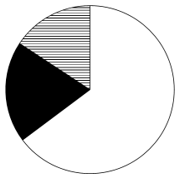
　✅
- **B**. 

- **C**. 
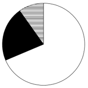

- **D**. 

**答案**：A

**官方解析**

根据题干“以下饼图中，最能准确反映2024年11月······占比关系的是”，结合材料时间为2024年11月，可判定本题为现期比重问题。定位统计表可知，2024年11月证券公司及其资管子公司、证券公司私募子公司、基金管理公司、基金子公司、期货公司及其资管子公司产品数量分别为601支、13支、168支、86支、60支。则证券公司及其资管子公司（白色）产品数量为601支；证券公司私募子公司、基金管理公司（黑色）产品数量为13+168=181支；其他公司（横线）产品数量为86+60=146支。，即白色区域是黑色区域的3倍多，，即黑色区域是横线区域的1倍多，只有A项符合。

故正确答案为A。

---

### 材料 2

        2023年，全国6大类茶叶产量、产值、内销量、内销额相关数据如下：2023年，全国绿茶产量193.4万吨，同比增长8.0万吨；红茶49.1万吨，同比增长0.9万吨；黑茶45.8万吨，同比增长3.2万吨；乌龙茶33.3万吨，同比增长2.15万吨；白茶10.0万吨，同比增长0.56万吨；黄茶2.3万吨，同比增长1.0万吨。

        2023年，全国绿茶产值2060.6亿元，同比增长2.4亿元；红茶519.7亿元，同比增长10.3亿元；黑茶310.4亿元，同比增长41.8亿元；乌龙茶288.5亿元，同比增长33.7亿元；白茶87.0亿元，同比增长9.0亿元；黄茶30.5亿元，同比增长18.7亿元。

        2023年，全国茶叶内销总量240.4万吨，同比增长0.7万吨。其中绿茶内销量128.9万吨，同比减少1.6%；红茶37.9万吨，同比减少0.7%：黑茶37.8万吨，同比增长3.7%；乌龙茶25.6万吨，同比增长3.2%；白茶8.3万吨，同比增长1.6%；黄茶1.9万吨。

        2023年，全国茶叶内销总额3346.7亿元，同比减少48.5亿元，其中绿茶内销额1978.3亿元，同比减少6.3%；红茶560.9亿元，同比减少0.6%；黑茶358.6亿元，同比增长11.6%；乌龙茶311.0亿元，同比增长9.3%；白茶107.5亿元，同比增长6.9%；黄茶30.4亿元。

#### 第 6 题　qid 15419179 · 增长

2023年，全国6大类茶叶总产量同比约增长了：

- **A**. 3%
- **B**. 5%　✅
- **C**. 7%
- **D**. 9%

**答案**：B

**官方解析**

根据题干“2023年······同比约增长了”，结合选项为百分数，可判定本题为一般增长率问题。定位文字材料第一段可知2023年全国6大类茶叶产量及其同比增长量。则2023年全国6大类茶叶总产量=193.4+49.1+45.8+33.3+10.0+2.3=333.9万吨，2023年全国6大类茶叶总产量同比增长量=8.0+0.9+3.2+2.15+0.56+1.0=15.81万吨。根据公式：增长率，则题干所求，与B项最接近。

故正确答案为B。

---

#### 第 7 题　qid 15419180 · 增长

2023年，全国6大类茶叶中，平均每吨产值同比上升的有几类？

- **A**. 2
- **B**. 3
- **C**. 4
- **D**. 5　✅

**答案**：D

**官方解析**

根据题干“2023年······平均每吨产值同比上升······”，可判定本题为两期平均数比较问题。定位文字材料第一段可知2023年全国6大类茶叶产量及其同比增长量；定位文字材料第二段可知2023年全国6大类茶叶产值及其同比增长量。根据公式：，结合两期平均数比较的方法：当分子增长率（a）&gt;分母增长率（b）时，平均数上升，反之下降。根据公式：，则各类茶叶产值同比增长率（a）与产量的同比增长率（b）如下：

绿茶，，，，下降；

红茶，，，，上升；

黑茶，，，，上升；

乌龙茶，，，，上升；

白茶，，，，上升；

黄茶，，，上升。

综上，红茶、黑茶、乌龙茶、白茶、黄茶这5类茶叶平均每吨产值同比上升。

故正确答案为D。

---

#### 第 8 题　qid 15419181 · 比重

2023年，全国绿茶内销量占产量的比重比上年约：

- **A**. 上升了不到2个百分点
- **B**. 上升了2个百分点以上
- **C**. 下降了不到2个百分点
- **D**. 下降了2个百分点以上　✅

**答案**：D

**官方解析**

根据题干“2023年······占······的比重比上年约”，结合选项为“上升/下降+百分点”，可判定本题为两期比重问题。定位文字材料第一、三段可知：2023年，全国绿茶产量193.4万吨（B），同比增长8.0万吨；绿茶内销量128.9万吨（A），同比减少1.6%（a）。根据公式：增长率，则2023年全国绿茶产量同比增长率（b）。根据公式：两期比重差，则题干所求，即下降了2个百分点以上。

故正确答案为D。

---

#### 第 9 题　qid 15419182 · 增长

2023年，全国黑茶内销额同比增量约是白茶的多少倍？

- **A**. 3.0
- **B**. 4.2
- **C**. 5.4　✅
- **D**. 6.6

**答案**：C

**官方解析**

根据题干“2023年······是······多少倍”，结合材料时间为2023年，可判定本题为现期倍数问题。定位文字材料第四段可知：2023年，全国黑茶内销额358.6亿元，同比增长11.6%；白茶107.5亿元，同比增长6.9%。根据公式：增长量，则2023年，全国黑茶内销额同比增量为亿元，白茶内销额同比增量为亿元。故题干所求倍数为倍，与C项最接近。

故正确答案为C。

---

#### 第 10 题　qid 15419183 · 综合

以下各项能够从上述资料中推出的是：

- **A**. 2023年，全国茶叶总产值超过3400亿元
- **B**. 2023年，全国红茶内销量占产量的比重高于黑茶
- **C**. 2023年，全国乌龙茶内销额同比增长了30亿元以上
- **D**. 2023年，全国黄茶平均每吨产值是黑茶的1.5倍以上　✅

**答案**：D

**官方解析**

A项：定位文字材料第二段可得：2023年，全国绿茶产值2060.6亿元；红茶519.7亿元，黑茶310.4亿元，乌龙茶288.5亿元，白茶87.0亿元，黄茶30.5亿元。则2023年，全国茶叶总产值亿元&lt;3400亿元，错误；

B项：定位文字材料第一段可得：2023年，全国红茶产量49.1万吨，黑茶产量45.8万吨；定位文字材料第三段可得：2023年，全国红茶内销量37.9万吨，黑茶内销量37.8万吨。根据公式：比重，则2023年，全国红茶内销量占产量的比重，黑茶内销量占产量的比重，即2023年全国红茶内销量占产量的比重低于黑茶，错误；

C项：定位文字材料第四段可得：2023年，全国乌龙茶内销额311.0亿元，同比增长9.3%。根据公式：增长量，则2023年全国乌龙茶内销额同比增长亿元，即同比增长不到30亿元，错误；

D项：定位文字材料第一段可得：2023年，全国黑茶产量45.8万吨，黄茶产量2.3万吨；定位文字材料第二段可得：2023年，全国黑茶产值310.4亿元，黄茶30.5亿元。根据公式：平均每吨产值，则2023年全国黄茶平均每吨产值是黑茶的倍，超过1.5倍，正确。

故正确答案为D。

---

### 材料 3

        2023年，我国汽车产销量分别为3016.1万辆和3009.4万辆，同比分别增长11.6%和12%，创历史新高，连续15年保持全球第一，汽车出口量首次跃全球第一。

        2022年，我国汽车产销量分别为2702.1万辆和2686.4万辆，其中新能源汽车产销分别为705.8万辆和688.7万辆，同比分别增长96.9%和93.4%，汽车出口311.1万辆，同比增长54.4%，新能源汽车出口67.9万辆，同比增长1.2倍。

        2021年，我国汽车产销量分别为2608.2万辆和2627.5万辆，产销同比分别增长3.4%和3.8%，结束了连续三年的下降趋势。其中新能源汽车销售352.1万辆，同比增长1.6倍，连续7年位居全球第一。汽车出口201.5万辆，同比增长1倍，新能源汽车出口32万辆，同比增长3倍。

#### 第 11 题　qid 15419189 · 综合

2020-2023年，我国汽车产销率（销量与产量之比）大于100%的年份有几个？

- **A**. 1个
- **B**. 2个　✅
- **C**. 3个
- **D**. 4个

**答案**：B

**官方解析**

根据题干“2020-2023年······产销率······”，结合材料给出2021-2023年我国汽车产销量以及2021年产销量的同比增速，可判定本题为基期比重问题。产销率（销量与产量之比）大于100%，，即产量&lt;销量。定位文字材料第一、二、三段可得：2023年，我国汽车产销量分别为3016.1万辆和3009.4万辆；2022年，我国汽车产销量分别为2702.1万辆和2686.4万辆；2021年，我国汽车产销量分别为2608.2万辆和2627.5万辆，产销同比分别增长3.4%和3.8%。在2021-2023年中，2021年满足产量&lt;销量。根据公式：基期量，则2020年我国汽车产量万辆；2020年我国汽车销量万辆，满足产量&lt;销量。故2020-2023年，我国汽车产销率大于100%的有2020年和2021年，共2个年份。

故正确答案为B。

---

#### 第 12 题　qid 15419190 · 增长

2021-2023年，我国汽车销量年均增长约多少万辆？

- **A**. 191　✅
- **B**. 179
- **C**. 167
- **D**. 127

**答案**：A

**官方解析**

根据题干“2021-2023年······年均增长约多少万辆”，可判定本题为年均增长量问题。定位文字材料第一段可得：2023年，我国汽车销量为3009.4万辆；定位文字材料第三段可得：2021年，我国汽车销量为2627.5万辆。根据公式：年均增长量，则题干所求为万辆，与A项最接近。

故正确答案为A。

---

#### 第 13 题　qid 15419191 · 比重

2020年，我国汽车出口量中，新能源汽车出口量的占比约为：

- **A**. 6.8%
- **B**. 7.9%　✅
- **C**. 8.4%
- **D**. 10.3%

**答案**：B

**官方解析**

根据题干“2020年······中······的占比约为”，结合材料时间为2021年，可判定本题为基期比重问题。定位文字材料第三段可得：2021年，我国汽车出口201.5万辆（B），同比增长1倍（b），新能源汽车出口32万辆（A），同比增长3倍（a）。根据公式：基期比重，则所求比重为。

故正确答案为B。

---

#### 第 14 题　qid 15419192 · 增长

2024年，我国新能源汽车出口量若要实现同比增长10%的目标，则第四季度出口量环比须增长约多少万辆？

- **A**. 8.84
- **B**. 8.31
- **C**. 7.23　✅
- **D**. 7.01

**答案**：C

**官方解析**

根据题干“2024年······则第四季度出口量环比须增长约多少万辆”，定位表格材料可得：2023年1-12月我国新能源汽车出口量为120.3万辆；2024年1-6月出口量为60.5万辆；2024年1-9月出口量为92.8万辆。结合题干“2024年，我国新能源汽车出口量若要实现同比增长10%的目标”，根据公式：现期量=基期量×（1+增长率），2024年我国新能源汽车出口量将达到120.3×（1+10%）=132.33万辆，则2024年第四季度出口量=2024年出口量-2024年1-9月出口量=132.33-92.8=39.53万辆。2024年第三季度我国新能源汽车出口量=2024年1-9月出口量-2024年1-6月出口量=92.8-60.5=32.3万辆。根据公式：增长量=现期量-基期量，则2024年第四季度出口量环比增量=2024年第四季度出口量-2024年第三季度出口量=39.53-32.3=7.23万辆。
故正确答案为C。

---

#### 第 15 题　qid 15419193 · 增长

下列选项中，可由资料推出的是：
①2021-2023年，我国汽车年均产量达2775万辆
②2021年，我国新能源汽车销量中，出口量占比不足一成
③假设2024年我国汽车产销量同比增长率维持2023年水平，则双双突破3370万辆

- **A**. ②③
- **B**. ①③
- **C**. ①②　✅
- **D**. ①②③

**答案**：C

**官方解析**

①：定位文字材料第一至三段可知，2021-2023年，我国汽车产量分别为2608.2万辆、2702.1万辆、3016.1万辆。根据公式：平均数，则2021-2023年，我国汽车年均产量万辆，即汽车年均产量达2775万辆，正确；

②：定位文字材料第三段可知，2021年，我国新能源汽车销售352.1万辆，新能源汽车出口32万辆。根据公式：比重，则2021年，我国新能源汽车销量中出口量占比，即出口量占比不足一成，正确；

③：定位文字材料第一段可知，2023年，我国汽车产销量分别为3016.1万辆和3009.4万辆，同比分别增长11.6%和12%。根据公式：现期量=基期量×（1+增长率），则2024年我国汽车产量=3016.1×（1+11.6%）=（3000+10+6.1）×1.116&lt;3348+12+7=3367万辆&lt;3370万辆，即产量低于3370万辆，不满足产销量双双突破3370万辆，错误。

综上可知，只有①②可以推出。

故正确答案为C。

---

### 材料 4

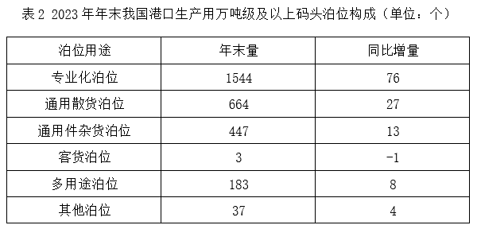

        2023年年末，我国港口生产用码头泊位22023个，比上年末增加700个。其中，内河港口生产用码头泊位16433个、增加551个，沿海港口生产用码头泊位5590个、增加149个。

#### 第 16 题　qid 15419198 · 比重

2022年年末，我国港口生产用万吨级及以上码头泊位中，专业化泊位占比接近：

- **A**. 65%
- **B**. 61%
- **C**. 58%
- **D**. 53%　✅

**答案**：D

**官方解析**

根据题干“2022年年末······中······占比接近”，结合材料时间为2023年年末，可判定本题为基期比重问题。定位表1可得：2023年年末我国港口生产用万吨级及以上码头泊位数量为2878个，同比增量为127个；定位表2可得：2023年年末我国港口生产用万吨级及以上码头泊位中专业化泊位数量为1544个，同比增量为76个。根据公式：基期量=现期量-增长量、比重，则题干所求为。

故正确答案为D。

---

#### 第 17 题　qid 15419200 · 增长

2023年年末，我国下列各类港口生产用万吨级及以上码头泊位，同比增速最快的是：

- **A**. 3万吨级以下泊位
- **B**. 3-5（不含）万吨级泊位
- **C**. 5-10（不含）万吨级泊位
- **D**. 10万吨级及以上泊位　✅

**答案**：D

**官方解析**

根据题干“······同比增速最快的是”，可判定本题为一般增长率问题。定位表1可得2023年年末我国港口生产用万吨级及以上码头中，各类吨级泊位数量及其同比增量。根据公式：增长率，各选项代入数据可得：

A项，；

B项，；

C项，；

D项，。

比较可知，D项同比增速最快。

故正确答案为D。

---

#### 第 18 题　qid 15419201 · 平均数

2022年年末，我国沿海港口生产用码头泊位，平均约每多少个之中就有一个是10万吨级及以上泊位？

- **A**. 12　✅
- **B**. 14
- **C**. 15
- **D**. 17

**答案**：A

**官方解析**

根据题干“2022年年末······平均约每······”，结合材料时间为2023年年末，可判定本题为基期平均数问题。定位文字材料可得：2023年年末，我国沿海港口生产用码头泊位5590个，同比增加149个；定位统计表1可得：2023年年末，我国沿海港口生产用码头泊位中10万吨级及以上泊位为503个，同比增加34个。根据公式：平均数、基期量=现期量-增长量，可得所求为个。

故正确答案为A。

---

#### 第 19 题　qid 15419202 · 增长

若2024年各类泊位同比增速不变，则2024年年末我国港口生产用万吨级及以上码头通用件杂货泊位约多少个？

- **A**. 455
- **B**. 460　✅
- **C**. 465
- **D**. 470

**答案**：B

**官方解析**

根据题干“若2024年······同比增速不变，则2024年年末······约多少个”，可判定本题为现期计算问题。定位表2可得：2023年年末我国港口生产用万吨级及以上码头通用件杂货泊位为447个，同比增量为13个。根据公式：增长率、现期量=基期量×（1+增长率），可得所求为个，与B项最接近。

故正确答案为B。

---

#### 第 20 题　qid 15419205 · 增长

下列选项中，可由资料推出的是：
①2023年年末，我国港口生产用万吨级及以上码头泊位中，“多用途泊位”增量比“其他泊位”增量多2倍
②2022年年末，我国沿海港口生产用万吨级及以上码头泊位中，3万吨级以下泊位与5~10（不含）万吨级泊位数量差值在100以内
③2023年年末，我国港口生产用万吨级及以上码头泊位中，客货泊位同比负增长

- **A**. ①②③
- **B**. ①③
- **C**. ②③　✅
- **D**. ①②

**答案**：C

**官方解析**

①定位统计表2可得：2023年年末我国港口生产用万吨级及以上码头泊位中，多用途泊位同比增长8个，其他泊位同比增长4个。根据公式：多几倍=倍数-1，则“多用途泊位”增量比“其他泊位”增量多倍，并非多2倍，错误；

②定位统计表1可得：2023年年末我国沿海港口生产用万吨级及以上码头泊位中，3万吨级以下泊位744个，同比增长38个；5~10（不含）万吨级泊位824个，同比增长26个。根据公式：基期量=现期量-增长量，则2022年年末二者相差（824-26）-（744-38）=92个，差值在100以内，正确；

③定位统计表2可得：2023年年末我国港口生产用万吨级及以上码头泊位中，客货泊位3个，同比增长-1个，即同比负增长，正确。

综上，可由资料推出的是②③。

故正确答案为C。

---

#### 第 21 题　qid 11542802 · 增长

某新能源汽车电池制造厂的成本包含生产成本和研发成本，已知前年的生产成本是研发成本的5倍，因矿产资源价格下降，去年生产成本同比降低20%，但研发成本同比增长27%。去年电池销售单价同比降低5%。若前年每个电池的利润率（利润率）为10%，那么前年每个电池的利润是去年的多少倍？

- **A**. 0.2
- **B**. 0.4
- **C**. 0.6　✅
- **D**. 0.8

**答案**：C

**官方解析**

赋值前年单个电池的研发成本为100，根据题意可列表如下，数据均为单个电池数据。

则前年每个电池的利润是去年的倍。

故正确答案为C。

注：前年和去年电池销量默认相同，否则无法计算。

---
